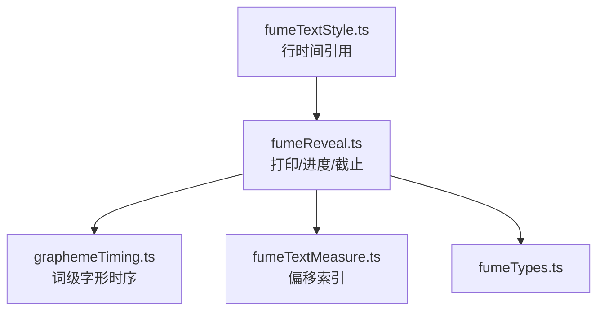
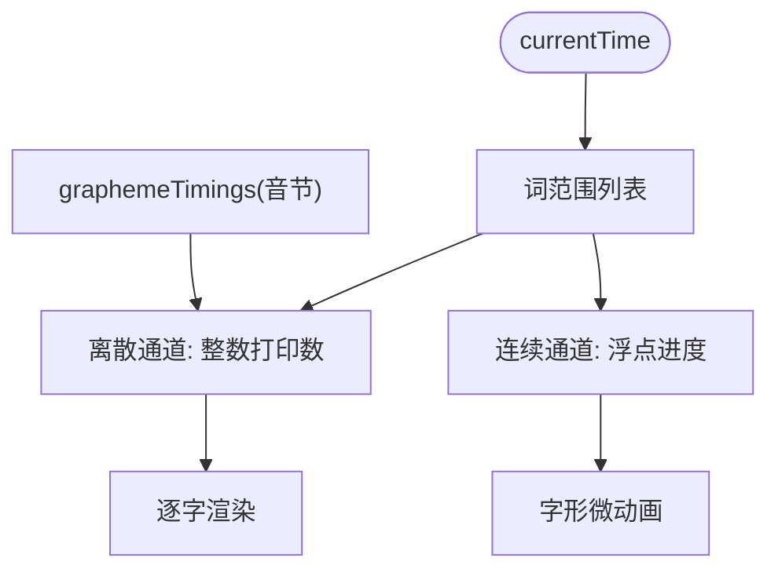
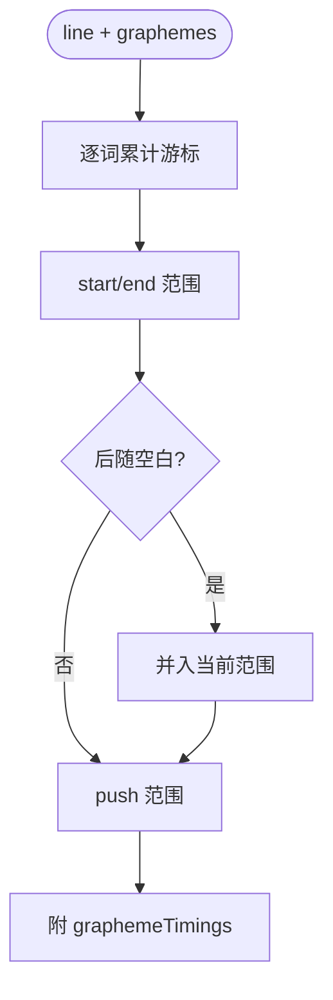
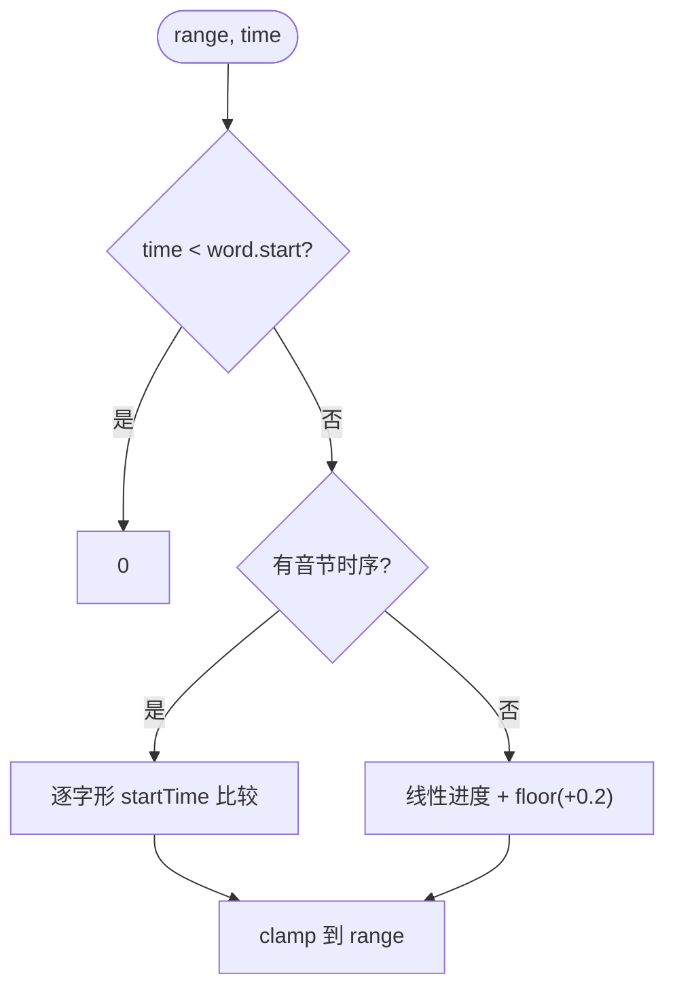
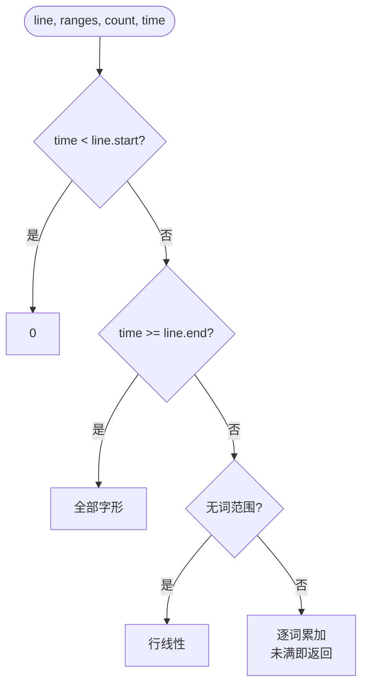
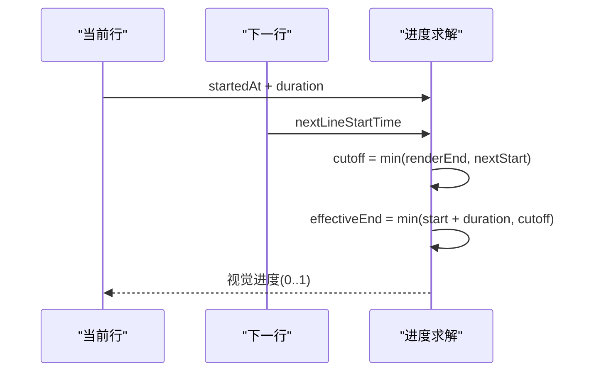
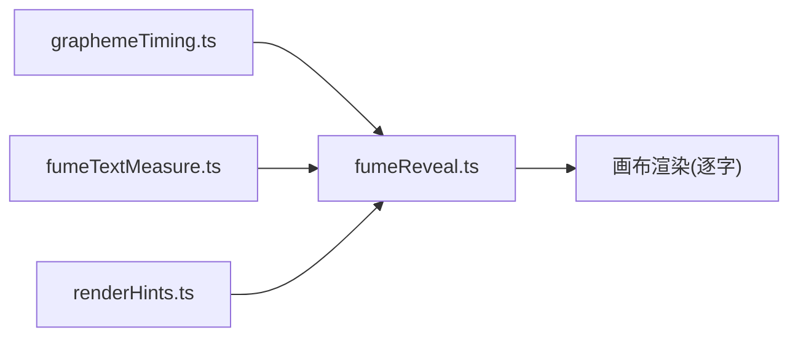

# 打字机效果系统

<cite>
**本文引用的文件**   
- [fumeReveal.ts](file://src/components/visualizer/fume/fumeReveal.ts)
- [fumeTextMeasure.ts](file://src/components/visualizer/fume/fumeTextMeasure.ts)
- [fumeTypes.ts](file://src/components/visualizer/fume/fumeTypes.ts)
- [graphemeTiming.ts](file://src/utils/lyrics/graphemeTiming.ts)
- [fumeTextStyle.ts](file://src/components/visualizer/fume/fumeTextStyle.ts)
</cite>

## 目录
1. [引言](#引言)
2. [项目结构](#项目结构)
3. [核心组件](#核心组件)
4. [架构总览](#架构总览)
5. [详细组件分析](#详细组件分析)
6. [依赖关系分析](#依赖关系分析)
7. [性能考量](#性能考量)
8. [故障排查指南](#故障排查指南)
9. [结论](#结论)

## 引言
本文聚焦 Fume 模式的打字机效果系统，围绕以下目标展开：
- 解释逐字显示动画的实现原理：字形打印计数与按词揭示进度。
- 说明音节级动画控制：`graphemeTimings` 与歌词的精确同步。
- 阐述行判定机制：行结束完成、渲染截止时间（cutoff）与视觉进度。
- 解释性能策略：纯函数增量求值、打印计数与连续进度的双通道。

## 项目结构
- fumeReveal.ts：揭示核心——词范围构建、打印计数、连续进度、截止时间。
- fumeTextMeasure.ts：`buildWordRangeIndexByOffset`（偏移→词范围索引）。
- graphemeTiming.ts：`buildWordGraphemeTimings`（词级字形时序）。
- fumeTextStyle.ts：行结束判定使用的 `getLineRenderEndTime` 与相关工具。
- fumeTypes.ts：`WordRange` 等类型。

**图示来源**
- [fumeReveal.ts:7-8](file://src/components/visualizer/fume/fumeReveal.ts#L7-L8)
- [fumeTextMeasure.ts:219-234](file://src/components/visualizer/fume/fumeTextMeasure.ts#L219-L234)

**章节来源**
- [fumeReveal.ts:7-8](file://src/components/visualizer/fume/fumeReveal.ts#L7-L8)

## 核心组件
- `buildWordRangesFromWords(line, graphemes)`：词范围（含颜色范围）构建。
- `resolvePrintedGlyphsInRange(range, time)`：单词内的打印字形数（整数）。
- `resolvePrintedGraphemeCount(line, ranges, count, time)`：整行的打印字形数。
- `resolvePrintedGraphemeProgress(...)`：整行的连续打印进度（浮点）。
- `resolveLinePassCutoffTime(line, nextLineStart)`：行被下一行截断的截止时间。
- `resolveVisualProgressWithCutoff(startedAt, duration, time, cutoff)`：带截止的视觉进度。

**章节来源**
- [fumeReveal.ts:10-217](file://src/components/visualizer/fume/fumeReveal.ts#L10-L217)

## 架构总览
打字机效果不依赖内部状态："打印了多少"完全由当前时间求解。系统提供两条并行通道：**离散通道**（打印字形数为整数，用于逐字渲染）与**连续通道**（浮点进度，用于字形级的微动画）。两条通道共享同一套时间源——词的 `startTime/endTime` 与音节派生的 `graphemeTimings`。

**图示来源**
- [fumeReveal.ts:138-174](file://src/components/visualizer/fume/fumeReveal.ts#L138-L174)
- [fumeReveal.ts:176-217](file://src/components/visualizer/fume/fumeReveal.ts#L176-L217)

**章节来源**
- [fumeReveal.ts:7-8](file://src/components/visualizer/fume/fumeReveal.ts#L7-L8)

## 详细组件分析

### 词范围构建与空白吸附
`buildWordRangesFromWords` 把词的显示文本映射到全文字形流：
- 逐词累计游标，生成 `start/end` 与独立的 `colorStart/colorEnd`（配色可与打印范围不同）。
- **空白吸附**：部分歌词负载的 `word.text` 不含词间空格而 `fullText` 含——此时把紧随其后的空白并入当前词范围，保持视觉流连续，避免后续所有词整体左移。
- 每个范围携带 `graphemeTimings = buildWordGraphemeTimings(word)`——音节级时序的来源。

**图示来源**
- [fumeReveal.ts:10-48](file://src/components/visualizer/fume/fumeReveal.ts#L10-L48)

**章节来源**
- [fumeReveal.ts:10-48](file://src/components/visualizer/fume/fumeReveal.ts#L10-L48)

### 音节级打印：graphemeTimings 优先
`resolvePrintedGlyphsInRange` 的决策顺序：
1. 时间早于词开始 → 0。
2. **存在音节时序**（`word.syllables` 非空且有时序字形）：逐字形检查 `startTime`，统计已开始打印的字形数；时间超过词结束直接全打。这是与歌词精确同步的主路径（逐音节点亮）。
3. 无音节时序（回退）：按词的线性揭示进度 `(time - startTime) / max(endTime - startTime, 0.08)` 计算打印数 `floor(progress * length + 0.2)`——`+0.2` 让第一格在进度刚过 0 时立刻点亮，避免"卡住不动"的观感。

**图示来源**
- [fumeReveal.ts:62-100](file://src/components/visualizer/fume/fumeReveal.ts#L62-L100)

**章节来源**
- [fumeReveal.ts:62-100](file://src/components/visualizer/fume/fumeReveal.ts#L62-L100)

### 行级判定：打印计数与行末捷径
`resolvePrintedGraphemeCount` 的整行逻辑：
- 时间早于行开始 → 0。
- **行末捷径**：`currentTime >= line.endTime` 直接返回整行字形数（无需逐词扫描）。
- 无词范围：按行时长线性计算。
- 有词范围：逐词累加——词内打印不满时立即返回 `range.start + partial`（后续词全部未打印）。

**图示来源**
- [fumeReveal.ts:138-174](file://src/components/visualizer/fume/fumeReveal.ts#L138-L174)

**章节来源**
- [fumeReveal.ts:138-174](file://src/components/visualizer/fume/fumeReveal.ts#L138-L174)

### 连续进度与渲染截止时间
- `resolvePrintedGraphemeProgress` 输出浮点进度：每词按线性进度贡献 `start + progress * length`，未满即返回——供字形级微动画使用（与离散通道同源、不同粒度）。
- `resolveLinePassCutoffTime`：行的截止时间取 `min(渲染结束时间, 下一行开始时间)`——下一行开始时当前行必须已经完成视觉过渡，避免两行同时在"唱"。
- `resolveVisualProgressWithCutoff`：把截止时间并入进度分母——`effectiveEnd = min(startedAt + duration, cutoff)`，保证过渡在截止前完成。

**图示来源**
- [fumeReveal.ts:107-136](file://src/components/visualizer/fume/fumeReveal.ts#L107-L136)

**章节来源**
- [fumeReveal.ts:107-136](file://src/components/visualizer/fume/fumeReveal.ts#L107-L136)

## 依赖关系分析
- 揭示系统依赖 graphemeTiming（音节时序）与 fumeTextMeasure 的偏移索引（`buildWordRangeIndexByOffset`）把字形偏移映射回词范围（配色用 `rangeKind: 'color'`）。
- 所有函数为纯函数，输入时间输出数值——完美适配 seek 与逐帧重算。
- 行时间引用 `getLineRenderEndTime`（renderHints 工具），与 Fume 外部的时间线保持一致。

**图示来源**
- [fumeReveal.ts:1-5](file://src/components/visualizer/fume/fumeReveal.ts#L1-L5)

**章节来源**
- [fumeTextMeasure.ts:219-234](file://src/components/visualizer/fume/fumeTextMeasure.ts#L219-L234)

## 性能考量
- 无状态求解：打印计数每次直接由时间算出，无增量缓存负担。
- 行末捷径：已完成的行走 O(1) 返回；只有进行中的行需要逐词扫描。
- 位移索引预计算：`buildWordRangeIndexByOffset` 在布局期生成偏移→范围映射，逐帧查表 O(1)。
- 连续/离散双通道按需调用：微动画缺省时可只走离散通道。

**章节来源**
- [fumeReveal.ts:152-154](file://src/components/visualizer/fume/fumeReveal.ts#L152-L154)

## 故障排查指南
- 某些字始终不打印：检查该字形是否落在词范围与音节时序的交集之外（空白吸附失效）；确认 `word.syllables` 结构。
- 第一个字延迟感明显：线性回退分支的 `+0.2` 补偿缺失；它保证进度刚过 0 就点亮第一格。
- 相邻两行同时高亮：`resolveLinePassCutoffTime` 未生效；截止必须取 min(渲染结束, 下一行开始)。
- 排版换行后打印错位：词范围基于 `fullText` 字形流；换行只影响渲染行切片（`RenderLineSlice`），不影响范围数据。
- seek 后打印状态异常：此系统无内部状态；异常来自调用方缓存或词范围构建输入（line.words）变更。
- 空词/零长词导致跳字：`rangedWords` 过滤已处理（拆字形数为 0 的词被剔除）。

**章节来源**
- [fumeReveal.ts:14-17](file://src/components/visualizer/fume/fumeReveal.ts#L14-L17)
- [fumeReveal.ts:95-99](file://src/components/visualizer/fume/fumeReveal.ts#L95-L99)

## 结论
Fume 打字机效果系统以"时间→打印数"的纯函数模型，实现了逐音节精确、seek 稳定的逐字显示。它用离散/连续双通道分别服务逐字渲染与字形微动画，用空白吸附保证视觉流连续，用截止时间机制保证行与行之间互不打架。与既有的排版测量系统共享同一套字形数据，是 Fume"逐字读过去"体验的核心引擎。
