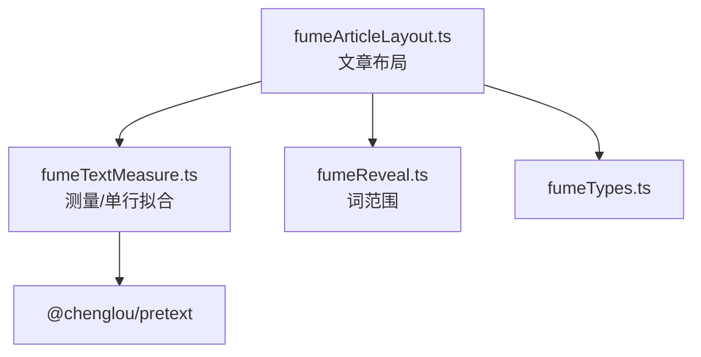
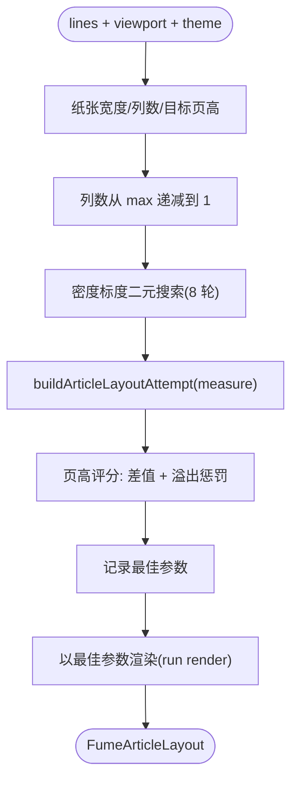
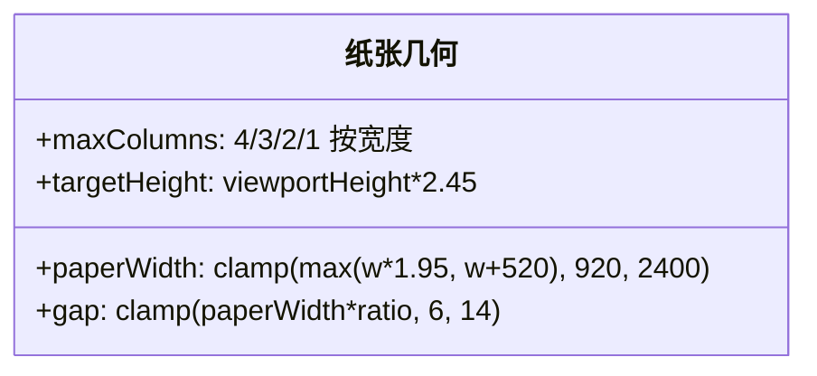
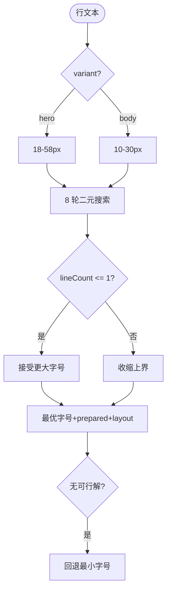
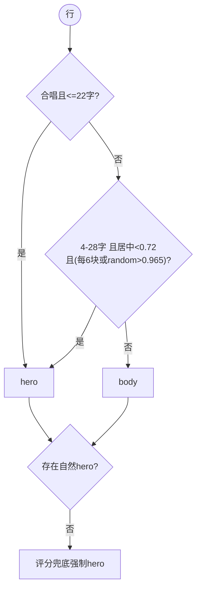
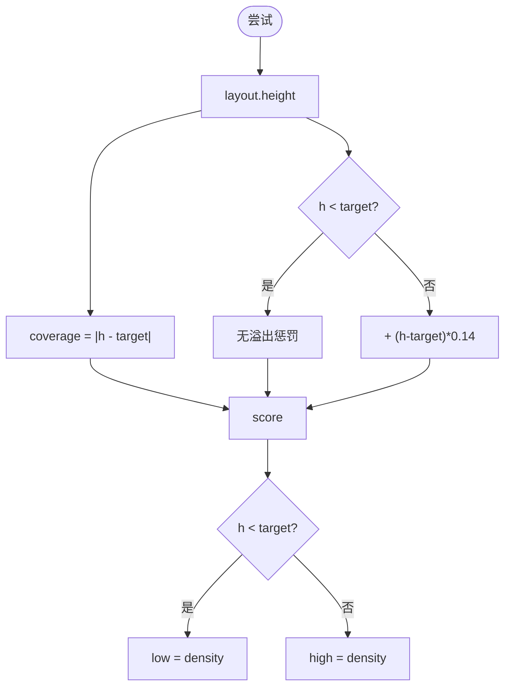
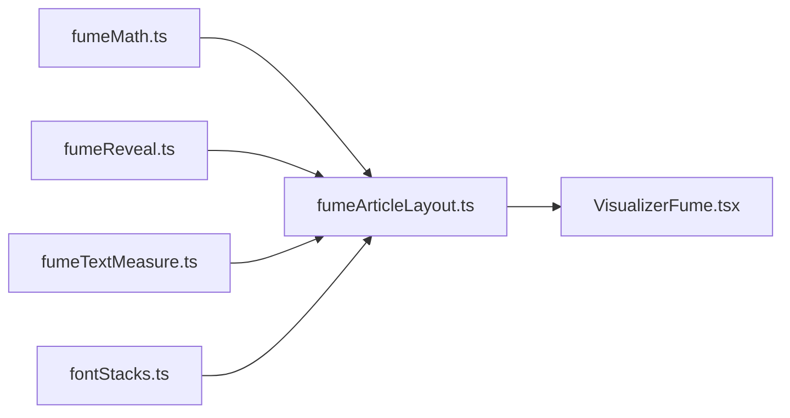

# 文本布局算法

<cite>
**本文引用的文件**   
- [fumeArticleLayout.ts](file://src/components/visualizer/fume/fumeArticleLayout.ts)
- [fumeTextMeasure.ts](file://src/components/visualizer/fume/fumeTextMeasure.ts)
- [fumeReveal.ts](file://src/components/visualizer/fume/fumeReveal.ts)
- [fumeMath.ts](file://src/components/visualizer/fume/fumeMath.ts)
- [fumeTypes.ts](file://src/components/visualizer/fume/fumeTypes.ts)
</cite>

## 目录
1. [引言](#引言)
2. [项目结构](#项目结构)
3. [核心组件](#核心组件)
4. [架构总览](#架构总览)
5. [详细组件分析](#详细组件分析)
6. [依赖关系分析](#依赖关系分析)
7. [性能考量](#性能考量)
8. [故障排查指南](#故障排查指南)
9. [结论](#结论)

## 引言
本文聚焦 Fume 模式的文本布局算法，围绕以下目标展开：
- 解释文章流式排版引擎：纸张宽度、列数、密度标度的搜索与择优。
- 说明文本分割与单行优先策略：二元搜索字号使大多数块保持单行。
- 阐述块变体（hero/body）的选取算法与"每首歌至少一个 hero"的兜底。
- 解释渲染细节：渲染行切片、字形偏移与页高目标评分。

## 项目结构
- fumeArticleLayout.ts：文章布局主引擎（`buildArticleLayout`）与布局缓存键。
- fumeTextMeasure.ts：pretext 段落测量、字形偏移/前进、单行二元搜索。
- fumeReveal.ts：词范围与打印进度（布局阶段产出时序数据）。
- fumeMath.ts / fumeTypes.ts：数学工具与布局类型。

**图示来源**
- [fumeArticleLayout.ts:9-10](file://src/components/visualizer/fume/fumeArticleLayout.ts#L9-L10)
- [fumeTextMeasure.ts:7-8](file://src/components/visualizer/fume/fumeTextMeasure.ts#L7-L8)

**章节来源**
- [fumeArticleLayout.ts:9-10](file://src/components/visualizer/fume/fumeArticleLayout.ts#L9-L10)

## 核心组件
- `buildArticleLayout(lines, viewport, theme, lyricsFontScale, fumeTuning)`：文章布局总入口。
- `buildLayoutCacheKey(...)`：布局缓存键（避免重复重排）。
- `buildPreparedSingleLine(...)`：单行二元搜索字号拟合。
- `chooseNaturalBlockVariant` / `chooseFallbackHeroBlockIndex`：块变体选择。
- `chooseFontPx`：基于密度（字形数 + 词数 ×1.4）的字号公式。

**章节来源**
- [fumeArticleLayout.ts:27-136](file://src/components/visualizer/fume/fumeArticleLayout.ts#L27-L136)

## 架构总览
布局引擎采用"多方案搜索 + 页高择优"的结构：纸张宽度由视口推导（`max(width*1.95, width+520)`，夹在 920-2400），列数按纸张宽度分档（4/3/2/1 列），目标页高为视口高的 2.45 倍。引擎遍历列数（从最大到 1），对每个列数进行 8 轮密度标度二元搜索（0.82-1.42），用"页高与目标差"评分（溢出额外 ×0.14 惩罚），最后以最佳参数渲染一版文章。

**图示来源**
- [fumeArticleLayout.ts:449-540](file://src/components/visualizer/fume/fumeArticleLayout.ts#L449-L540)

**章节来源**
- [fumeArticleLayout.ts:475-533](file://src/components/visualizer/fume/fumeArticleLayout.ts#L475-L533)

## 详细组件分析

### 纸张几何与目标页高
- 纸张宽度：`clamp(max(viewport.width * 1.95, viewport.width + 520), 920, 2400)`——保证多列排版有足够宽度，同时设上下限避免极端视口。
- 列数分档：≥1120 → 4 列；≥760 → 3 列；≥500 → 2 列；否则 1 列。
- 列间距：按纸张宽度派生（4 列 0.65%、3 列 0.85%、其余 1.15%），夹在 6-14px。
- 目标页高：视口高的 2.45 倍——文章要"铺满并略微超过一屏"，形成可滚动的手帐感。

**图示来源**
- [fumeArticleLayout.ts:460-464](file://src/components/visualizer/fume/fumeArticleLayout.ts#L460-L464)

**章节来源**
- [fumeArticleLayout.ts:460-464](file://src/components/visualizer/fume/fumeArticleLayout.ts#L460-L464)

### 单行优先的字号拟合
Fume 的核心排版偏好是"大多数块保持单行"（文件注释明确）：
- `buildPreparedSingleLine` 在字号区间（body 10-30、hero 18-58）内做 8 轮二元搜索，接受"仍能单行容纳"的最大字号；全部失败时回退到最小字号重排。
- 行高按字号派生：hero 1.02 倍、body 1.06 倍。
- `chooseFontPx` 用密度公式给出搜索的初值：`density = 字形数 + 词数 * 1.4`；hero 字号 = `width / max(sqrt(density)*1.5, 4.5)`（夹 24-54），body = `width / max(sqrt(density)*2.25, 7)`（夹 14-28）。

**图示来源**
- [fumeTextMeasure.ts:240-296](file://src/components/visualizer/fume/fumeTextMeasure.ts#L240-L296)

**章节来源**
- [fumeTextMeasure.ts:240-296](file://src/components/visualizer/fume/fumeTextMeasure.ts#L240-L296)

### 块变体选择与 hero 兜底
- 自然选择：合唱行且 ≤22 字形 → hero；否则 4-28 字形、居中程度 < 0.72 且（每第 6 块或 3.5% 概率）→ hero，其余 body。
- 兜底：若整首歌没有任何自然 hero，`chooseFallbackHeroBlockIndex` 按评分（居中 0.62 + 长度 0.34 + 合唱 0.28 + 稳定抖动）选出最强的候选强制为 hero；再退一步选最短的可渲染行。
- 全部基于 `seeded(文本:索引)` 的确定性伪随机——同一首歌的排版永远一致。

**图示来源**
- [fumeArticleLayout.ts:27-117](file://src/components/visualizer/fume/fumeArticleLayout.ts#L27-L117)

**章节来源**
- [fumeArticleLayout.ts:27-117](file://src/components/visualizer/fume/fumeArticleLayout.ts#L27-L117)

### 渲染细节与页高评分
每轮尝试产出完整的渲染细节（`mode: 'render'` 才生成）：渲染行切片、逐字形偏移与前进量、词范围映射。评分函数：`coveragePenalty = |height - targetHeight|`，页高不足只按差值计（希望铺满），溢出则额外 `(height-target)*0.14` 惩罚。二元搜索的方向也由页高决定：不足则升密度、溢出则降密度。最终选择分数最小的参数组合渲染一版。

**图示来源**
- [fumeArticleLayout.ts:499-527](file://src/components/visualizer/fume/fumeArticleLayout.ts#L499-L527)

**章节来源**
- [fumeArticleLayout.ts:499-527](file://src/components/visualizer/fume/fumeArticleLayout.ts#L499-L527)

## 依赖关系分析
- 布局引擎依赖 fumeTextMeasure（测量）、fumeReveal（词范围）、fumeMath（clamp/哈希/seeded）。
- 与渲染器解耦：布局输出纯数据结构（`FumeArticleLayout`），组件层消费。
- 布局缓存键（`buildLayoutCacheKey`）把主题名、视口、字体参数与歌词时间线纳入键，任何输入变化才重排。

**图示来源**
- [fumeArticleLayout.ts:1-7](file://src/components/visualizer/fume/fumeArticleLayout.ts#L1-L7)

**章节来源**
- [fumeArticleLayout.ts:138-160](file://src/components/visualizer/fume/fumeArticleLayout.ts#L138-L160)

## 性能考量
- 多方案搜索的成本由"列数 × 8 轮"限定（最多 4×8 = 32 次尝试），每次尝试只做测量模式（不发渲染细节），最后只渲染一版。
- DEV 构建输出完整布局耗时遥测（总耗时、测量/渲染分解、逐列统计、尝试次数），便于定位回归。
- 测量与渲染分离：`mode: 'measure'` 与 `mode: 'render'` 让搜索成本可控。
- 字号二元搜索固定 8 轮，避免收敛不确定性。

**章节来源**
- [fumeArticleLayout.ts:542-578](file://src/components/visualizer/fume/fumeArticleLayout.ts#L542-L578)

## 故障排查指南
- 文章页高远低于目标：检查密度搜索上界（1.42）是否被裁断，或列数评分方向写反。
- 某首歌没有 hero 块：兜底评分链失效；检查 `chooseFallbackHeroBlockIndex` 的候选过滤条件。
- 块字号溢出纸张：`buildPreparedSingleLine` 的 fitScale 缺失——单行拟合的回退分支必须保留。
- 排版在两次打开间跳动：检查 `seeded` 的键是否包含了所有输入（文本 + 索引 + 盐值）。
- 布局耗时暴涨：查看 DEV 遥测的 `attempts` 与 `measuredLines`；异常值通常来自超长歌词行触发大量重排。

**章节来源**
- [fumeArticleLayout.ts:499-527](file://src/components/visualizer/fume/fumeArticleLayout.ts#L499-L527)

## 结论
Fume 文本布局算法以"多方案搜索 + 页高择优 + 单行优先"三要素构建出杂志式的手帐排版。它把"排版感"从硬编码配方转化为可搜索的参数空间（列数 × 密度标度），并以内置的质量评分（铺满优先、溢出惩罚）自动选择最佳布局。确定性的块变体与字号策略保证了同一首歌的排版永远一致，是 Fume"文章感"视觉语言的地基。
