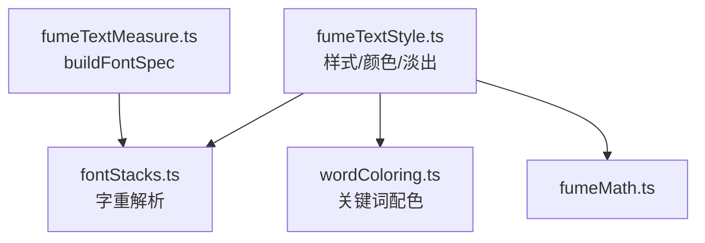
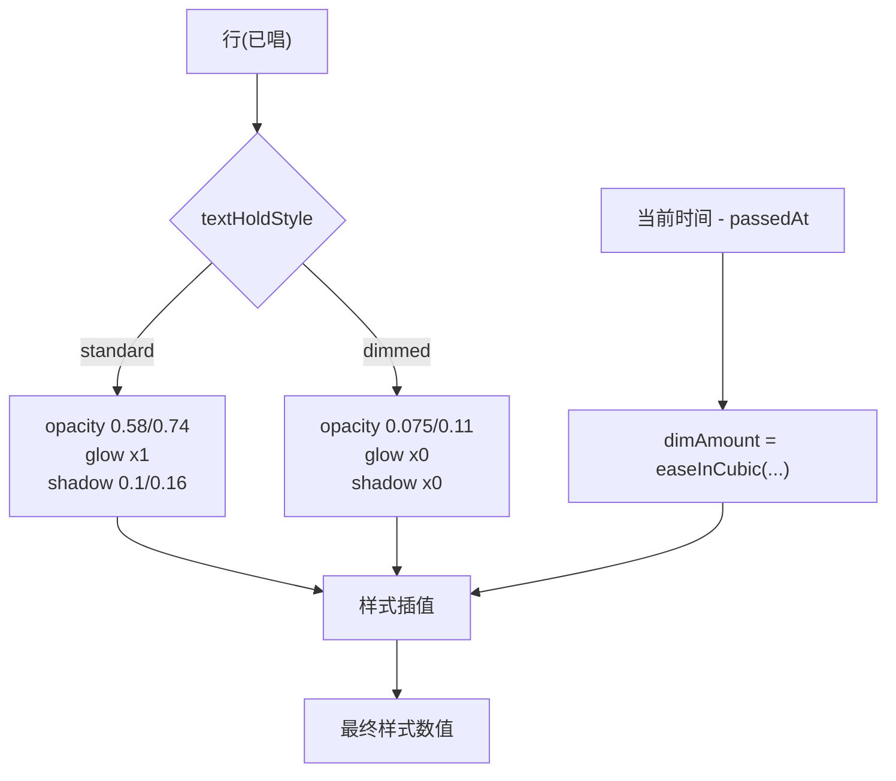
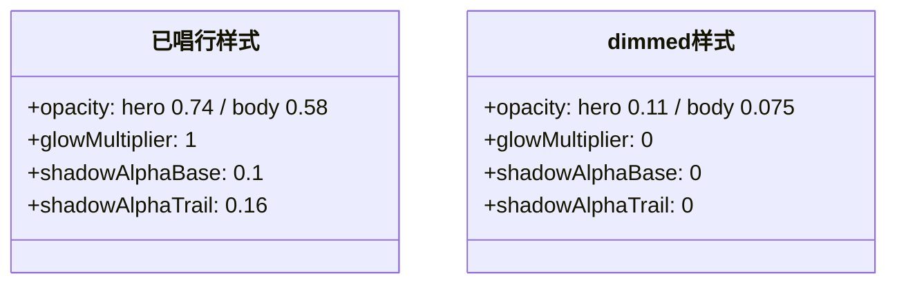
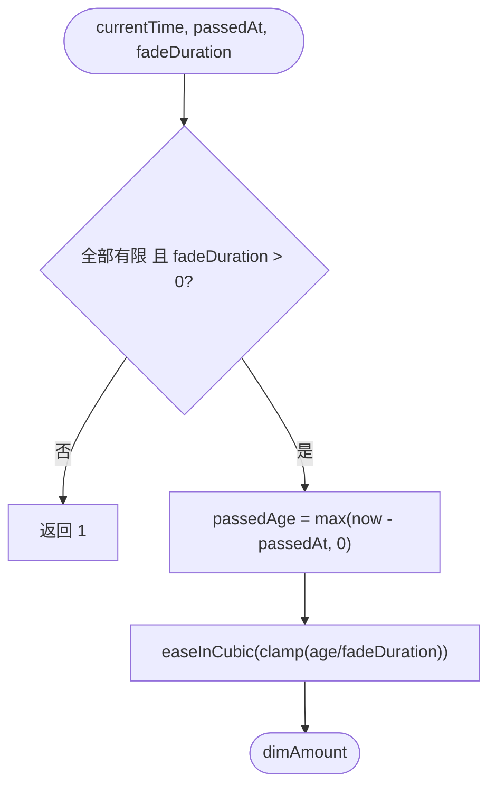
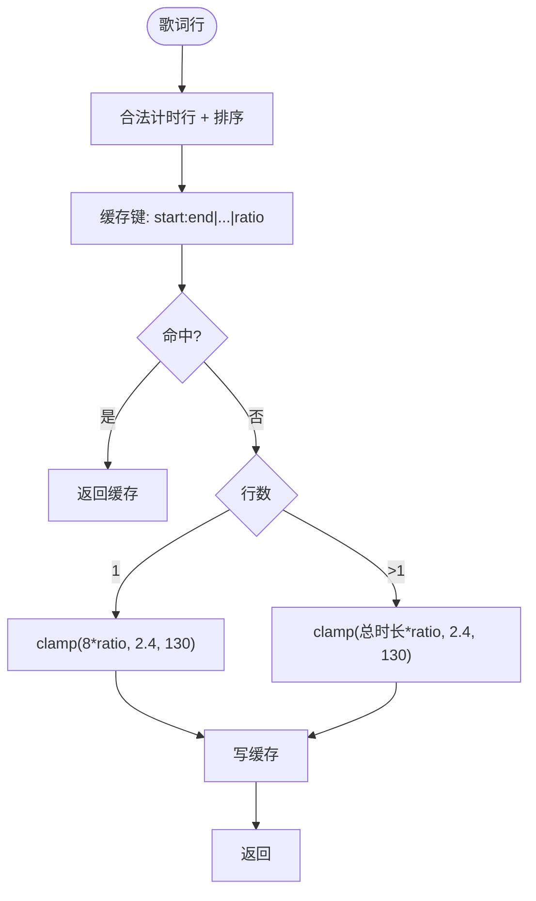
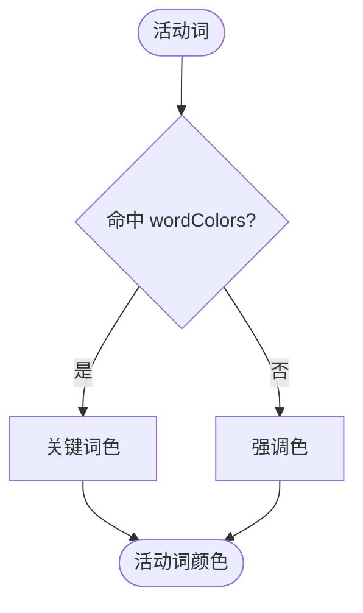
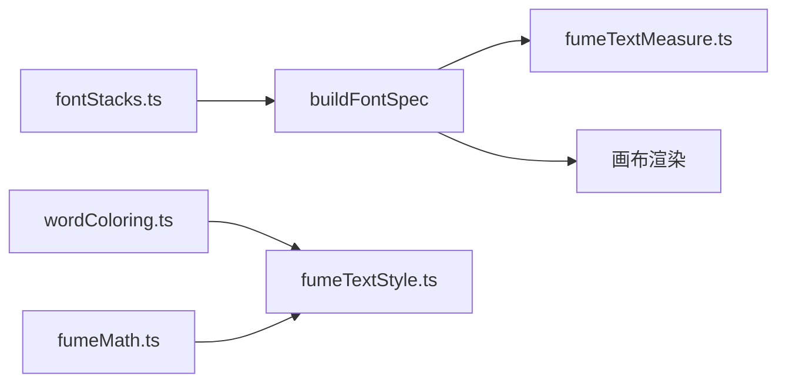

# 文本样式系统

<cite>
**本文引用的文件**   
- [fumeTextStyle.ts](file://src/components/visualizer/fume/fumeTextStyle.ts)
- [fumeTextMeasure.ts](file://src/components/visualizer/fume/fumeTextMeasure.ts)
- [fumeMath.ts](file://src/components/visualizer/fume/fumeMath.ts)
- [wordColoring.ts](file://src/components/visualizer/wordColoring.ts)
- [fontStacks.ts](file://src/utils/fontStacks.ts)
</cite>

## 目录
1. [引言](#引言)
2. [项目结构](#项目结构)
3. [核心组件](#核心组件)
4. [架构总览](#架构总览)
5. [详细组件分析](#详细组件分析)
6. [依赖关系分析](#依赖关系分析)
7. [性能考量](#性能考量)
8. [故障排查指南](#故障排查指南)
9. [结论](#结论)

## 引言
本文聚焦 Fume 模式的文本样式系统，围绕以下目标展开：
- 解释不依赖渲染器的样式设计：已唱行样式（standard/dimmed）、其淡出与活动词配色。
- 说明字体栈解析机制：`buildFontSpec` 与主题字重的角色默认（hero 780 / body 640）。
- 阐述颜色映射算法：`resolveWordColor` 的双向包含匹配与主题关键词色。
- 解释样式缓存：淡出时长的记忆化与缓存键设计。

## 项目结构
- fumeTextStyle.ts：已唱行样式、淡出时长、活动词颜色——全部为纯函数（renderer-independent）。
- fumeTextMeasure.ts：`buildFontSpec`（字体规格字符串的构建）。
- wordColoring.ts：`resolveWordColor` 关键词配色核心。
- fontStacks.ts：`resolveThemeFontWeight` 主题字重规范化。
- fumeMath.ts：`clamp` 与 `easeInCubic`。

**图示来源**
- [fumeTextStyle.ts:1-4](file://src/components/visualizer/fume/fumeTextStyle.ts#L1-L4)
- [fumeTextMeasure.ts:172-180](file://src/components/visualizer/fume/fumeTextMeasure.ts#L172-L180)

**章节来源**
- [fumeTextStyle.ts:6-7](file://src/components/visualizer/fume/fumeTextStyle.ts#L6-L7)

## 核心组件
- `resolvePassedTextStyle(variant, textHoldStyle)`：已唱行的四个样式量（透明度、光晕乘数、阴影基础/拖尾 alpha）。
- `resolvePassedDimAmount(currentTime, passedAt, fadeDuration)`：时间驱动的淡化量（easeInCubic）。
- `resolveFumePassedFadeDuration(lines, textHoldRatio)`：从歌词时间线推导淡出总时长（2.4-130s，带缓存）。
- `getActiveColor(wordText, theme)`：活动词配色（双向包含匹配）。
- `buildFontSpec(fontPx, variant, fontFamily, theme)`：字体规格字符串。

**章节来源**
- [fumeTextStyle.ts:14-88](file://src/components/visualizer/fume/fumeTextStyle.ts#L14-L88)

## 架构总览
样式系统遵循"样式与渲染器解耦"的原则：所有函数只吃数据（行、主题、时间），吐数值；"怎么画"完全留给画布层。样式状态机只有两个状态——**standard**（已唱但保持可见）与 **dimmed**（已唱并深度变暗），两者都由四个数值定义，且通过时间驱动的淡化量在两个状态之间连续过渡。

**图示来源**
- [fumeTextStyle.ts:14-44](file://src/components/visualizer/fume/fumeTextStyle.ts#L14-L44)

**章节来源**
- [fumeTextStyle.ts:14-44](file://src/components/visualizer/fume/fumeTextStyle.ts#L14-L44)

## 详细组件分析

### 已唱行样式：standard 与 dimmed
`resolvePassedTextStyle` 按变体（body/hero）与保持样式给出四个数值：
- standard：hero 透明度 0.74 / body 0.58；光晕乘数 1；阴影基础 0.1、拖尾 0.16——已唱行保持"可读的残影"。
- dimmed：hero 0.11 / body 0.075；光晕与阴影全部归零——已唱行退到背景层，为当前行让位。
hero 的透明度始终高于 body（同一状态下更"重"），与"hero 是视觉焦点"的角色体系一致。

**图示来源**
- [fumeTextStyle.ts:14-31](file://src/components/visualizer/fume/fumeTextStyle.ts#L14-L31)

**章节来源**
- [fumeTextStyle.ts:14-31](file://src/components/visualizer/fume/fumeTextStyle.ts#L14-L31)

### 淡化：时间驱动的连续过渡
`resolvePassedDimAmount(currentTime, passedAt, fadeDuration)` 输出 0-1 的淡化量：`easeInCubic(clamp(passedAge / fadeDuration, 0, 1))`——用三次缓入让"刚唱完"的阶段变化缓慢，后段加速退场。非有限值（NaN/Infinity）或非正时长返回 1（直接完全淡化），保证数值异常时不会卡住样式。

**图示来源**
- [fumeTextStyle.ts:33-44](file://src/components/visualizer/fume/fumeTextStyle.ts#L33-L44)

**章节来源**
- [fumeTextStyle.ts:33-44](file://src/components/visualizer/fume/fumeTextStyle.ts#L33-L44)

### 淡出时长推导与缓存
`resolveFumePassedFadeDuration` 从时间线推导整首歌的淡出尺度：
- `textHoldRatio >= 1` 直接返回 Infinity（保持不淡出）。
- 过滤出合法计时的行并排序；单行时用 `clamp(8 * ratio, 2.4, 130)`，多行时用 `clamp(总时长 * ratio, 2.4, 130)`。
- 缓存键由所有行的 `start:end`（保留 3 位小数）与 ratio 拼接——时间线或参数任何变化都会使键失效重算；模块级单槽缓存（`lastFumePassedFadeDurationCache`）专为"同一首歌内反复查询"设计。

**图示来源**
- [fumeTextStyle.ts:46-82](file://src/components/visualizer/fume/fumeTextStyle.ts#L46-L82)

**章节来源**
- [fumeTextStyle.ts:46-82](file://src/components/visualizer/fume/fumeTextStyle.ts#L46-L82)

### 颜色映射与关键词高亮
`getActiveColor` 委托给 `resolveWordColor(wordText, theme.wordColors, theme.accentColor, { cjkMatchMode: 'bidirectional-contains' })`：
- 命中主题关键词时返回关键词色，否则回退强调色。
- CJK 使用双向包含匹配——用户配置的短词（如"光"）能命中包含它的长词（如"光芒"），而英文按词边界匹配。
活动词配色让"正在唱的这个词"在外观上跳出，与已唱行的 dimmed 状态形成对比层级。

**图示来源**
- [fumeTextStyle.ts:84-88](file://src/components/visualizer/fume/fumeTextStyle.ts#L84-L88)

**章节来源**
- [fumeTextStyle.ts:84-88](file://src/components/visualizer/fume/fumeTextStyle.ts#L84-L88)

### 字体栈与字重
`buildFontSpec` 通过 `resolveThemeFontWeight(theme, variant === 'hero' ? 780 : 640)` 解析字重：Hero 默认 780、正文 640——中间字重让亮色纸面上的大字保持"印刷感"而不臃肿；用户手动字重（主题设置）优先。字体族来自 `resolveThemeFontStack` 的产物，随主题的 fontStyle/fontFamily 变化。多语言支持由字体栈回退链承担（CJK 字体在前、内置栈兜底）。

**章节来源**
- [fumeTextMeasure.ts:172-180](file://src/components/visualizer/fume/fumeTextMeasure.ts#L172-L180)

## 依赖关系分析
- 样式系统只依赖纯工具（fontStacks、wordColoring、fumeMath），不触 Pixi 或 DOM——可在单元测试中直接断言数值。
- 字体规格（`buildFontSpec`）同时服务测量（pretext）与渲染（画布字），两侧必须使用同一字符串——这是"测量与渲染一致性"的样式侧保证。
- 淡出缓存是模块级单槽，依赖缓存键的完整性。

**图示来源**
- [fumeTextStyle.ts:1-4](file://src/components/visualizer/fume/fumeTextStyle.ts#L1-L4)
- [fumeTextMeasure.ts:172-180](file://src/components/visualizer/fume/fumeTextMeasure.ts#L172-L180)

**章节来源**
- [fumeTextMeasure.ts:172-180](file://src/components/visualizer/fume/fumeTextMeasure.ts#L172-L180)

## 性能考量
- 全纯函数、零分配（除对象字面量返回），适合在逐帧路径调用。
- 淡出时长缓存避免每帧重扫歌词数组；缓存键保留 3 位小数在"精度"与"键稳定性"之间取平衡。
- 样式数值由常量对定义，无动态计算链。

**章节来源**
- [fumeTextStyle.ts:62-68](file://src/components/visualizer/fume/fumeTextStyle.ts#L62-L68)

## 故障排查指南
- 已唱行永不淡化：`textHoldRatio >= 1` 会返回 Infinity；检查调参。
- 淡化开始时间与听感不符：`passedAt` 应取行的渲染结束时间（`getLineRenderEndTime`），而不是 startTime。
- 关键词高亮不生效：英文需按词边界命中；CJK 采用双向包含——检查词条是否被空格污染。
- 字体粗细与设置不符：手动字重优先于角色默认（780/640）；检查主题 fontWeight 是否非空。
- 排版与渲染字体不一致：两侧必须共享 `buildFontSpec` 的输出；自建字体字符串会破坏测量一致性。
- 歌词时间修正后淡化时长不更新：缓存键包含每行的 start/end——确认时间修正确实改变了这些值。

**章节来源**
- [fumeTextStyle.ts:46-82](file://src/components/visualizer/fume/fumeTextStyle.ts#L46-L82)

## 结论
Fume 文本样式系统以"数据进、数值出"的纯函数设计，把已唱行的两种状态、时间驱动的淡化、活动词配色与字体规格全部解耦为可测试的样式层。它以 hero/body 双角色、standard/dimmed 双状态与时间线派生的淡出尺度，构建出"文章读过去、当前行亮起"的阅读感，是 Fume 温和视觉气质的重要组成。
