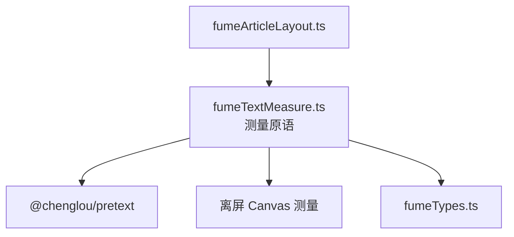
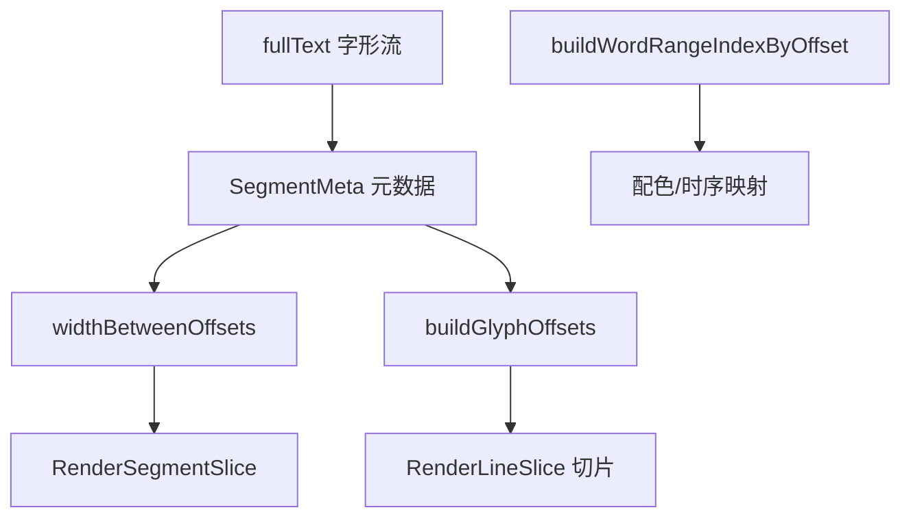
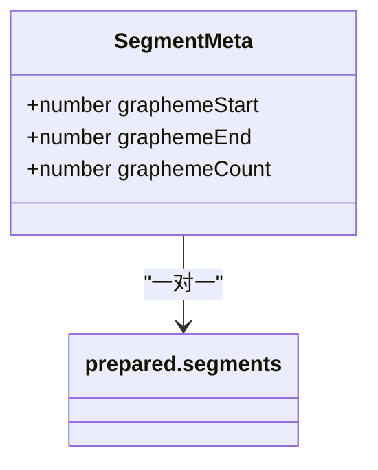
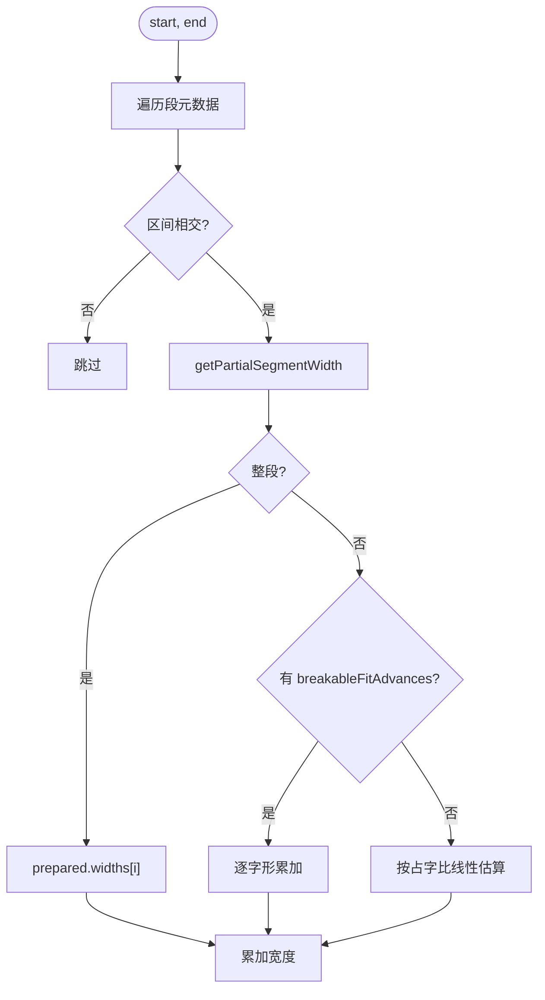
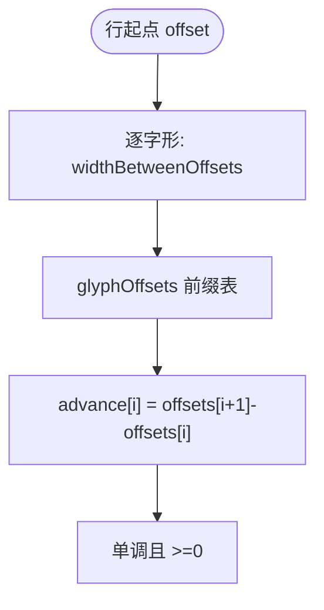
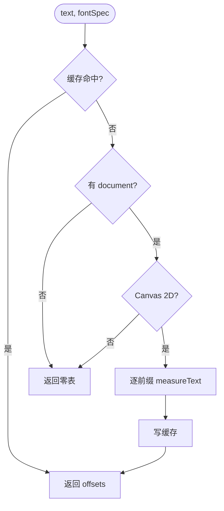
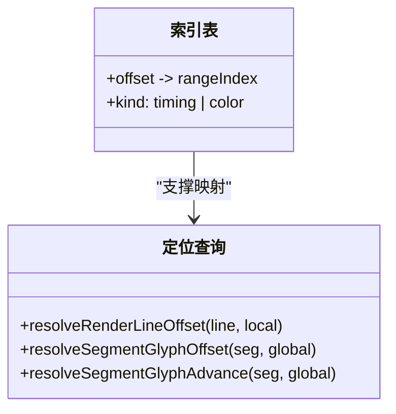
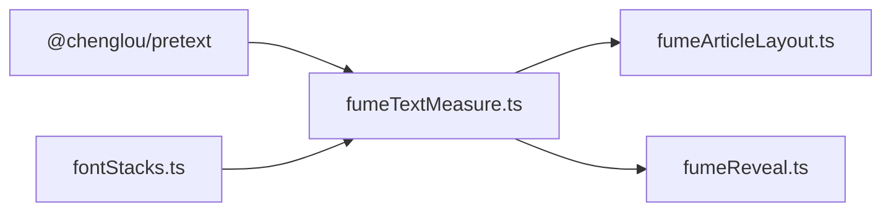

# 文本测量与定位

<cite>
**本文引用的文件**   
- [fumeTextMeasure.ts](file://src/components/visualizer/fume/fumeTextMeasure.ts)
- [fumeArticleLayout.ts](file://src/components/visualizer/fume/fumeArticleLayout.ts)
- [fumeTypes.ts](file://src/components/visualizer/fume/fumeTypes.ts)
- [fumeMath.ts](file://src/components/visualizer/fume/fumeMath.ts)
- [fontStacks.ts](file://src/utils/fontStacks.ts)
</cite>

## 目录
1. [引言](#引言)
2. [项目结构](#项目结构)
3. [核心组件](#核心组件)
4. [架构总览](#架构总览)
5. [详细组件分析](#详细组件分析)
6. [依赖关系分析](#依赖关系分析)
7. [性能考量](#性能考量)
8. [故障排查指南](#故障排查指南)
9. [结论](#结论)

## 引言
本文聚焦 Fume 模式的文本测量与定位系统，围绕以下目标展开：
- 解释字形测量算法：pretext 段落准备、逐字形偏移与前进距离的计算。
- 说明分段测量与 Canvas 缓存：逐字符宽度测量的记忆化与降级策略。
- 阐述文本定位：渲染行切片、词范围索引与字形偏移的坐标系统。
- 解释单行优先的二元搜索测量（详见《文本布局算法》，本文聚焦测量原语）。

## 项目结构
- fumeTextMeasure.ts：测量原语全集——段落元数据、字形偏移/前进、分段测量缓存、单行拟合。
- fumeArticleLayout.ts：布局引擎（消费测量原语）。
- fumeTypes.ts：`SegmentMeta`、`RenderLineSlice`、`RenderSegmentSlice` 等类型。
- fumeMath.ts / fontStacks.ts：clamp/拆分与字重解析。

**图示来源**
- [fumeTextMeasure.ts:1-8](file://src/components/visualizer/fume/fumeTextMeasure.ts#L1-L8)

**章节来源**
- [fumeTextMeasure.ts:7-8](file://src/components/visualizer/fume/fumeTextMeasure.ts#L7-L8)

## 核心组件
- `buildSegmentMetas(prepared)`：把 pretext 段落切成字形计数元数据，并产出全文字形数组。
- `cursorToGlobalOffset(cursor, metas)`：布局游标 → 全局字形偏移。
- `widthBetweenOffsets(prepared, metas, start, end)`：任意字形区间宽度。
- `buildGlyphOffsets(...)`：整行字形偏移表（累计前缀宽度）。
- `resolveGlyphAdvance(renderLine, index)`：单字形前进距离。
- `buildRenderSegments(...)`：渲染行 → 渲染分段切片（含实测字形偏移）。
- `buildPreparedSingleLine(...)`：单行二元搜索字号（任务见布局算法）。
- `buildWordRangeIndexByOffset(...)`：字形偏移 → 词范围索引（timing/color 两用）。

**章节来源**
- [fumeTextMeasure.ts:12-110](file://src/components/visualizer/fume/fumeTextMeasure.ts#L12-L110)

## 架构总览
测量系统区分两套坐标系：**全局字形流**（`fullText` 的每个字形按序编号）与**渲染行切片**（换行后的每行只持有全局偏移区间）。所有宽度与偏移查询都以全局流为基准，渲染行只做区间映射——这保证换行、词范围、打印计数与配色共享同一坐标系，不会因排版而漂移。

**图示来源**
- [fumeTextMeasure.ts:12-29](file://src/components/visualizer/fume/fumeTextMeasure.ts#L12-L29)
- [fumeTextMeasure.ts:123-170](file://src/components/visualizer/fume/fumeTextMeasure.ts#L123-L170)

**章节来源**
- [fumeTextMeasure.ts:123-170](file://src/components/visualizer/fume/fumeTextMeasure.ts#L123-L170)

## 详细组件分析

### 段落元数据与字形流
`buildSegmentMetas` 遍历 `prepared.segments`，对每个段落用 `splitGraphemes` 拆分字形，累计生成 `{ graphemeStart, graphemeEnd, graphemeCount }` 元数据，并汇总出全文字形数组。pretext 的"段"是排版断行单位（词、CJK 字符串或不可断片段），而字形是渲染断行单位——两者的映射由该函数一次建立。

**图示来源**
- [fumeTextMeasure.ts:12-29](file://src/components/visualizer/fume/fumeTextMeasure.ts#L12-L29)

**章节来源**
- [fumeTextMeasure.ts:12-29](file://src/components/visualizer/fume/fumeTextMeasure.ts#L12-L29)

### 区间宽度与部分测量
`widthBetweenOffsets` 计算任意字形区间 `[start, end)` 的宽度：
- 逐段取交集，跳过完全不重叠的段。
- `getPartialSegmentWidth`：整段命中直接取 `prepared.widths`；部分命中优先用 `prepared.breakableFitAdvances`（逐字形前进量）累加；没有前进量数据时按字形占比线性估算。
该函数是字形偏移表、词宽度、分段宽度与打印位置的全部公共基础。

**图示来源**
- [fumeTextMeasure.ts:42-92](file://src/components/visualizer/fume/fumeTextMeasure.ts#L42-L92)

**章节来源**
- [fumeTextMeasure.ts:42-92](file://src/components/visualizer/fume/fumeTextMeasure.ts#L42-L92)

### 字形偏移与前进距离
- `buildGlyphOffsets`：对行内每个字形调用 `widthBetweenOffsets(start, start + index)`，得到累计前缀宽度表（偏移表）。
- `resolveGlyphAdvance`：当前字形前进 = 下一字形偏移 − 当前偏移；行尾字形用行宽兜底；负值截断为 0。这保证字形定位严格单调、无重叠。
- `buildRenderSegments` 为每个渲染分段实测 `measuredGlyphOffsets`（`measureSegmentGlyphOffsets`），供逐字形渲染与微动画共用。

**图示来源**
- [fumeTextMeasure.ts:94-121](file://src/components/visualizer/fume/fumeTextMeasure.ts#L94-L121)

**章节来源**
- [fumeTextMeasure.ts:94-121](file://src/components/visualizer/fume/fumeTextMeasure.ts#L94-L121)

### Canvas 逐字测量缓存与降级
`measureSegmentGlyphOffsets` 用离屏 Canvas 逐前缀测量：`context.measureText(前 i 个字形).width`。性能与稳健性设计：
- 模块级单画布复用（`segmentMeasureCanvas`），不重复创建。
- 缓存键 `fontSpec + '__' + text`，命中直接返回；缓存无上限但输入域由歌词文本决定。
- 无 DOM 环境（`document === undefined`）返回全零偏移——SSR/测试环境安全降级。
- Canvas 上下文不可用时同样全零返回，不抛异常。

**图示来源**
- [fumeTextMeasure.ts:182-217](file://src/components/visualizer/fume/fumeTextMeasure.ts#L182-L217)

**章节来源**
- [fumeTextMeasure.ts:182-217](file://src/components/visualizer/fume/fumeTextMeasure.ts#L182-L217)

### 词范围索引与定位查询
- `buildWordRangeIndexByOffset`：把每个字形偏移映射到词范围索引（-1 表示不在任何范围）；`rangeKind` 支持 timing（start/end）与 color（colorStart/colorEnd）两种口径——同一字形在"打印进度"与"配色"上可以属于不同的词范围。
- `resolveRenderLineOffset` / `resolveSegmentGlyphOffset` / `resolveSegmentGlyphAdvance`：三类定位查询——行内偏移、分段内偏移与分段内前进，全部做边界钳制。

**图示来源**
- [fumeTextMeasure.ts:219-327](file://src/components/visualizer/fume/fumeTextMeasure.ts#L219-L327)

**章节来源**
- [fumeTextMeasure.ts:219-234](file://src/components/visualizer/fume/fumeTextMeasure.ts#L219-L234)

## 依赖关系分析
- 测量依赖 `@chenglou/pretext`（段落准备与布局）与 fontStacks（字体规格）。
- 布局引擎消费全部测量原语；揭示系统消费偏移索引。
- 与渲染器的契约是"带字形偏移的数据切片"，渲染层不再自行测量。

**图示来源**
- [fumeTextMeasure.ts:1-5](file://src/components/visualizer/fume/fumeTextMeasure.ts#L1-L5)

**章节来源**
- [fumeTextMeasure.ts:172-180](file://src/components/visualizer/fume/fumeTextMeasure.ts#L172-L180)

## 性能考量
- 前缀偏移表 O(n²) 的朴素形态被 `widthBetweenOffsets` 的分段短路优化：整段命中 O(1)。
- Canvas 逐字测量按文本缓存；同一句歌词在多次布局尝试（最多 32 次）中只测一次。
- 离屏 Canvas 单例复用显著低于按次创建的分配与初始化成本。
- 所有测量在布局期完成；播放期零测量成本。

**章节来源**
- [fumeTextMeasure.ts:182-217](file://src/components/visualizer/fume/fumeTextMeasure.ts#L182-L217)

## 故障排查指南
- 字形位置整体偏移：全局字形流与渲染行切片的区间映射错位——检查 `buildRenderSegments` 的 localStart/localEnd 换算。
- 前进距离为 0 或负：`resolveGlyphAdvance` 已做 `max(0)` 保护；出现 0 通常意味着偏移表全零（无 DOM/缓存降级）。
- 测试环境测不到宽度：`document === undefined` 时返回零表属预期；布局断言应跳过宽度敏感项。
- 部分字形宽度误差大：`breakableFitAdvances` 缺失时走线性估算；为需要高精度的文本提供 advance 数据。
- 打印与配色范围不一致：两个通道使用不同 `rangeKind`；检查调用方是否传错。
- 首行与后续行左边距不同：渲染行切片按对齐方式定位；左对齐行的切片起点应为 0。

**章节来源**
- [fumeTextMeasure.ts:112-121](file://src/components/visualizer/fume/fumeTextMeasure.ts#L112-L121)
- [fumeTextMeasure.ts:195-199](file://src/components/visualizer/fume/fumeTextMeasure.ts#L195-L199)

## 结论
Fume 文本测量与定位系统以"全局字形流 + 前缀宽度表 + 双口径索引"的坐标系设计，为布局、揭示与渲染提供了一致、可缓存、可降级的测量原语。它用分段短路优化把 O(n²) 的前缀测量压回可控成本，用 Canvas 缓存与单例复用消除了重复测量的主要开销，是 Fume 排版与逐字动画共享的数据地基。
