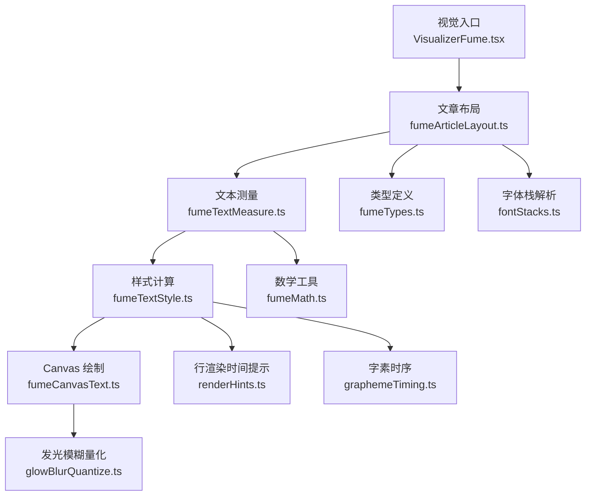
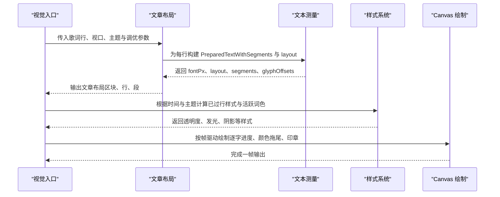
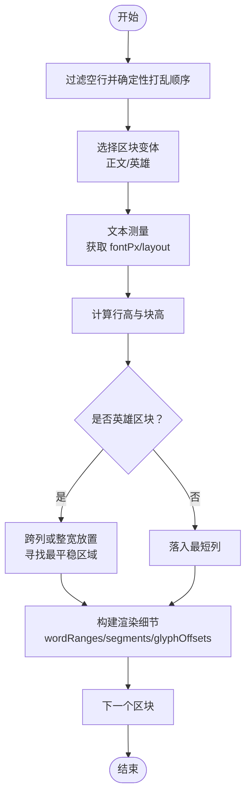
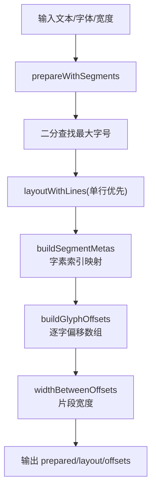
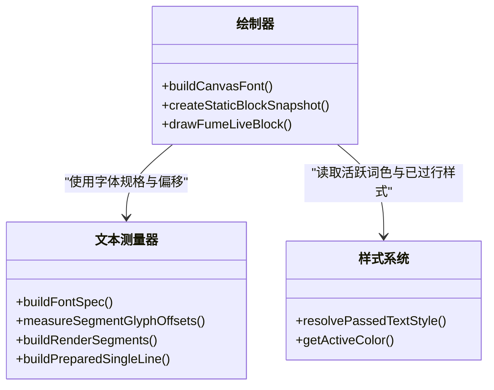
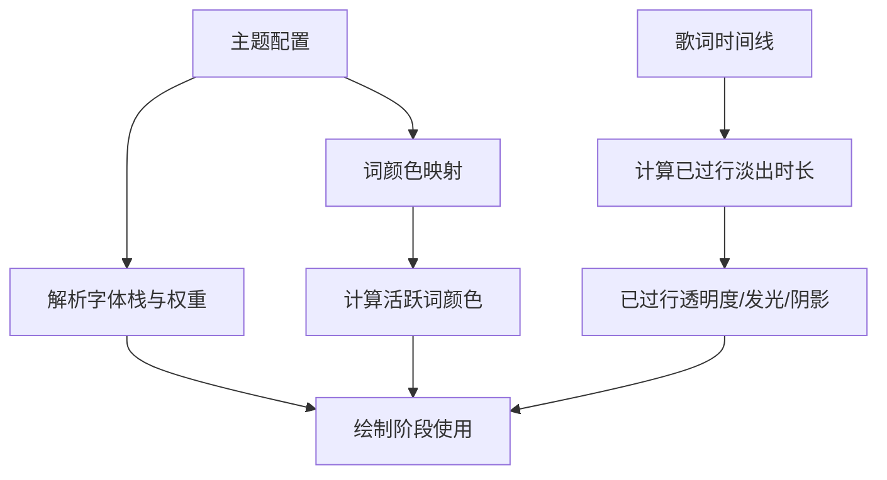
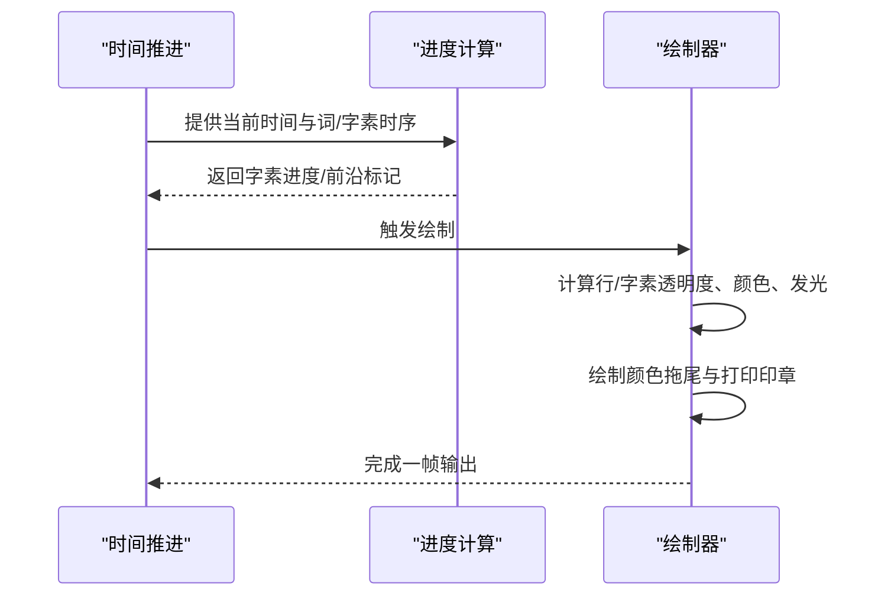
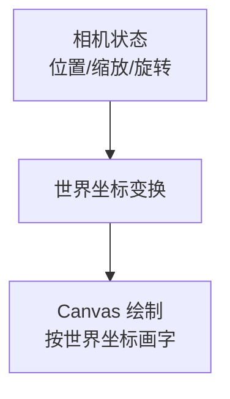
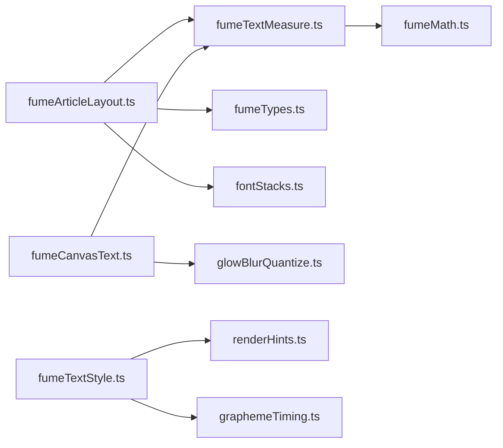

# 文本渲染引擎

<cite>
**本文引用的文件**   
- [fumeArticleLayout.ts](file://src/components/visualizer/fume/fumeArticleLayout.ts)
- [fumeTextMeasure.ts](file://src/components/visualizer/fume/fumeTextMeasure.ts)
- [fumeCanvasText.ts](file://src/components/visualizer/fume/fumeCanvasText.ts)
- [fumeTextStyle.ts](file://src/components/visualizer/fume/fumeTextStyle.ts)
- [fumeTypes.ts](file://src/components/visualizer/fume/fumeTypes.ts)
- [fumeMath.ts](file://src/components/visualizer/fume/fumeMath.ts)
- [fontStacks.ts](file://src/utils/fontStacks.ts)
- [renderHints.ts](file://src/utils/lyrics/renderHints.ts)
- [graphemeTiming.ts](file://src/utils/lyrics/graphemeTiming.ts)
- [glowBlurQuantize.ts](file://src/utils/glowBlurQuantize.ts)
- [VisualizerFume.tsx](file://src/components/visualizer/fume/VisualizerFume.tsx)
</cite>

## 目录
1. [简介](#简介)
2. [项目结构](#项目结构)
3. [核心组件](#核心组件)
4. [架构总览](#架构总览)
5. [详细组件分析](#详细组件分析)
6. [依赖关系分析](#依赖关系分析)
7. [性能考量](#性能考量)
8. [故障排查指南](#故障排查指南)
9. [结论](#结论)
10. [附录](#附录)

## 简介
本文面向 Fume 模式的文本渲染引擎，系统性说明文章布局算法、字形渲染管道、文本样式系统、打字机效果、文本变形与多语言支持。文档以代码级事实为依据，配合流程图与时序图帮助读者理解从歌词数据到像素输出的完整链路。

## 项目结构
Fume 文本渲染位于可视化器子系统中，围绕“文章布局 → 文本测量 → 样式计算 → Canvas 绘制”的流水线组织：

图表来源
- [VisualizerFume.tsx](file://src/components/visualizer/fume/VisualizerFume.tsx)
- [fumeArticleLayout.ts:169-447](file://src/components/visualizer/fume/fumeArticleLayout.ts#L169-L447)
- [fumeTextMeasure.ts:240-296](file://src/components/visualizer/fume/fumeTextMeasure.ts#L240-L296)
- [fumeTextStyle.ts:14-88](file://src/components/visualizer/fume/fumeTextStyle.ts#L14-L88)
- [fumeCanvasText.ts:118-408](file://src/components/visualizer/fume/fumeCanvasText.ts#L118-L408)
- [fumeTypes.ts:54-127](file://src/components/visualizer/fume/fumeTypes.ts#L54-L127)
- [fontStacks.ts](file://src/utils/fontStacks.ts)
- [renderHints.ts](file://src/utils/lyrics/renderHints.ts)
- [graphemeTiming.ts](file://src/utils/lyrics/graphemeTiming.ts)
- [glowBlurQuantize.ts](file://src/utils/glowBlurQuantize.ts)

章节来源
- [fumeArticleLayout.ts:1-582](file://src/components/visualizer/fume/fumeArticleLayout.ts#L1-L582)
- [fumeTextMeasure.ts:1-328](file://src/components/visualizer/fume/fumeTextMeasure.ts#L1-L328)
- [fumeCanvasText.ts:1-409](file://src/components/visualizer/fume/fumeCanvasText.ts#L1-L409)
- [fumeTextStyle.ts:1-89](file://src/components/visualizer/fume/fumeTextStyle.ts#L1-L89)
- [fumeTypes.ts:1-160](file://src/components/visualizer/fume/fumeTypes.ts#L1-L160)

## 核心组件
- 文章布局器：负责选择区块变体（正文/英雄）、列数与密度、逐块排版并产出可渲染的文章结构。
- 文本测量器：基于外部排版库进行分段、断行、字素切分、字形偏移与宽度计算，并提供缓存。
- 样式系统：计算已过行样式、淡出时长、当前词高亮色等与渲染无关的样式。
- Canvas 绘制器：按字素粒度绘制文字、光晕、颜色拖尾、打印印章等动态效果。
- 类型与工具：统一数据结构、数学函数与辅助方法。

章节来源
- [fumeArticleLayout.ts:169-447](file://src/components/visualizer/fume/fumeArticleLayout.ts#L169-L447)
- [fumeTextMeasure.ts:12-29](file://src/components/visualizer/fume/fumeTextMeasure.ts#L12-L29)
- [fumeTextStyle.ts:14-88](file://src/components/visualizer/fume/fumeTextStyle.ts#L14-L88)
- [fumeCanvasText.ts:118-408](file://src/components/visualizer/fume/fumeCanvasText.ts#L118-L408)
- [fumeTypes.ts:54-127](file://src/components/visualizer/fume/fumeTypes.ts#L54-L127)

## 架构总览
Fume 文本渲染采用“离线布局 + 在线绘制”的分层架构：

图表来源
- [VisualizerFume.tsx](file://src/components/visualizer/fume/VisualizerFume.tsx)
- [fumeArticleLayout.ts:169-447](file://src/components/visualizer/fume/fumeArticleLayout.ts#L169-L447)
- [fumeTextMeasure.ts:240-296](file://src/components/visualizer/fume/fumeTextMeasure.ts#L240-L296)
- [fumeTextStyle.ts:14-88](file://src/components/visualizer/fume/fumeTextStyle.ts#L14-L88)
- [fumeCanvasText.ts:118-408](file://src/components/visualizer/fume/fumeCanvasText.ts#L118-L408)

## 详细组件分析

### 文章布局算法
- 区块变体选择：依据歌词是否副歌、字数区间、居中程度与随机扰动决定“正文/英雄”。若无自然英雄，则回退评分选出一个合适位置作为英雄区块。
- 字号与行高：根据区块密度（字数+词数）估算基础字号，再乘以歌词缩放与密度缩放；行高由字号乘系数得到。
- 列布局与放置：对列数与密度进行二分搜索，使文章高度逼近目标高度；英雄区块可跨列，正文区块落入最短列。
- 渲染细节：在 render 模式下构建 wordRanges、segmentMetas、renderLines 等供绘制使用。

图表来源
- [fumeArticleLayout.ts:27-136](file://src/components/visualizer/fume/fumeArticleLayout.ts#L27-L136)
- [fumeArticleLayout.ts:229-407](file://src/components/visualizer/fume/fumeArticleLayout.ts#L229-L407)
- [fumeArticleLayout.ts:449-581](file://src/components/visualizer/fume/fumeArticleLayout.ts#L449-L581)

章节来源
- [fumeArticleLayout.ts:27-136](file://src/components/visualizer/fume/fumeArticleLayout.ts#L27-L136)
- [fumeArticleLayout.ts:229-407](file://src/components/visualizer/fume/fumeArticleLayout.ts#L229-L407)
- [fumeArticleLayout.ts:449-581](file://src/components/visualizer/fume/fumeArticleLayout.ts#L449-L581)

### 文本流式排版、行高计算与断字处理
- 流式排版：使用外部排版库准备带分段的文本，并以单行优先策略通过二分法寻找最大字号，确保大多数区块保持单行。
- 行高计算：行高 = 字号 × 系数（英雄略紧、正文略松）。
- 断字与度量：将段落拆分为字素序列，计算每个字素的累积偏移与增量，支持部分片段宽度估算与缓存。

图表来源
- [fumeTextMeasure.ts:240-296](file://src/components/visualizer/fume/fumeTextMeasure.ts#L240-L296)
- [fumeTextMeasure.ts:12-29](file://src/components/visualizer/fume/fumeTextMeasure.ts#L12-L29)
- [fumeTextMeasure.ts:71-121](file://src/components/visualizer/fume/fumeTextMeasure.ts#L71-L121)

章节来源
- [fumeTextMeasure.ts:12-29](file://src/components/visualizer/fume/fumeTextMeasure.ts#L12-L29)
- [fumeTextMeasure.ts:71-121](file://src/components/visualizer/fume/fumeTextMeasure.ts#L71-L121)
- [fumeTextMeasure.ts:240-296](file://src/components/visualizer/fume/fumeTextMeasure.ts#L240-L296)

### 字形渲染管道：字体加载、字符测量与位图缓存
- 字体规格：根据主题字体栈与权重生成 CSS 字体串。
- 字符测量：使用 Canvas 2D measureText 计算字素前缀宽度，并按字体串+文本键值缓存结果。
- 静态快照：为每个区块预渲染一次静态位图，减少重复绘制开销。
- 运行期绘制：按字素粒度绘制主体、光晕、颜色拖尾与打印印章，并对模糊半径进行量化以避免共享内存泄漏。

图表来源
- [fumeTextMeasure.ts:172-217](file://src/components/visualizer/fume/fumeTextMeasure.ts#L172-L217)
- [fumeCanvasText.ts:15-103](file://src/components/visualizer/fume/fumeCanvasText.ts#L15-L103)
- [fumeCanvasText.ts:118-408](file://src/components/visualizer/fume/fumeCanvasText.ts#L118-L408)
- [fumeTextStyle.ts:14-88](file://src/components/visualizer/fume/fumeTextStyle.ts#L14-L88)

章节来源
- [fumeTextMeasure.ts:172-217](file://src/components/visualizer/fume/fumeTextMeasure.ts#L172-L217)
- [fumeCanvasText.ts:15-103](file://src/components/visualizer/fume/fumeCanvasText.ts#L15-L103)
- [fumeCanvasText.ts:118-408](file://src/components/visualizer/fume/fumeCanvasText.ts#L118-L408)

### 文本样式系统：字体栈、颜色映射与透明度控制
- 字体栈解析：从主题中解析字体族与权重，区分正文与英雄变体。
- 颜色映射：根据词文本与主题配色规则计算活跃词颜色，支持中日韩双向包含匹配。
- 透明度控制：已过行样式支持标准/淡化两种模式，淡出曲线与时长由歌词时间线推导并缓存。

图表来源
- [fumeTextStyle.ts:14-88](file://src/components/visualizer/fume/fumeTextStyle.ts#L14-L88)
- [fontStacks.ts](file://src/utils/fontStacks.ts)
- [renderHints.ts](file://src/utils/lyrics/renderHints.ts)

章节来源
- [fumeTextStyle.ts:14-88](file://src/components/visualizer/fume/fumeTextStyle.ts#L14-L88)
- [fontStacks.ts](file://src/utils/fontStacks.ts)
- [renderHints.ts](file://src/utils/lyrics/renderHints.ts)

### 打字机效果：逐字显示动画、光标闪烁与进度跟踪
- 逐字进度：基于词与音节时序，计算每个字素的起止时间与进度，短字有最小点亮时长保证。
- 光标与前沿：已打印计数与全局偏移映射确定“前沿字”，用于绘制高亮边框与过渡状态。
- 颜色拖尾：字完成后进入颜色拖尾阶段，颜色与透明度随时间平滑过渡。
- 打印印章：在字激活窗口内绘制临时高亮矩形，模拟落印效果。

图表来源
- [fumeCanvasText.ts:118-408](file://src/components/visualizer/fume/fumeCanvasText.ts#L118-L408)
- [fumeTypes.ts:19-27](file://src/components/visualizer/fume/fumeTypes.ts#L19-L27)
- [graphemeTiming.ts](file://src/utils/lyrics/graphemeTiming.ts)

章节来源
- [fumeCanvasText.ts:118-408](file://src/components/visualizer/fume/fumeCanvasText.ts#L118-L408)
- [fumeTypes.ts:19-27](file://src/components/visualizer/fume/fumeTypes.ts#L19-L27)
- [graphemeTiming.ts](file://src/utils/lyrics/graphemeTiming.ts)

### 文本变形：透视变换、扭曲与动态缩放
- 相机与舞台：Fume 模式通过相机与舞台模块实现缓慢推近、平移与手持浮动，叠加旋转与缩放。
- 世界坐标：绘制时在当前变换下按世界坐标绘制，保证所有几何与动画一致。
- 注：具体透视与扭曲矩阵由上层相机/舞台逻辑提供，本文聚焦文本侧如何消费这些变换。

图表来源
- [fumeCanvasText.ts:118-408](file://src/components/visualizer/fume/fumeCanvasText.ts#L118-L408)

章节来源
- [fumeCanvasText.ts:118-408](file://src/components/visualizer/fume/fumeCanvasText.ts#L118-L408)

### 多语言支持与特殊字符处理
- 字素切分：使用通用字素分割工具，确保组合字符、表情符号等正确切分。
- 中日韩检测：CJK 检测用于基线偏移与印章尺寸调整。
- 特殊标点：布局与颜色映射对常见分隔符与括号进行兼容处理，避免异常断行或着色。

章节来源
- [fumeMath.ts](file://src/components/visualizer/fume/fumeMath.ts)
- [fumeCanvasText.ts:83-83](file://src/components/visualizer/fume/fumeCanvasText.ts#L83-L83)
- [fumeTextStyle.ts:84-88](file://src/components/visualizer/fume/fumeTextStyle.ts#L84-L88)

## 依赖关系分析
Fume 文本渲染的关键依赖如下：

图表来源
- [fumeArticleLayout.ts:1-8](file://src/components/visualizer/fume/fumeArticleLayout.ts#L1-L8)
- [fumeTextMeasure.ts:1-5](file://src/components/visualizer/fume/fumeTextMeasure.ts#L1-L5)
- [fumeCanvasText.ts:1-10](file://src/components/visualizer/fume/fumeCanvasText.ts#L1-L10)
- [fumeTextStyle.ts:1-4](file://src/components/visualizer/fume/fumeTextStyle.ts#L1-L4)

章节来源
- [fumeArticleLayout.ts:1-8](file://src/components/visualizer/fume/fumeArticleLayout.ts#L1-L8)
- [fumeTextMeasure.ts:1-5](file://src/components/visualizer/fume/fumeTextMeasure.ts#L1-L5)
- [fumeCanvasText.ts:1-10](file://src/components/visualizer/fume/fumeCanvasText.ts#L1-L10)
- [fumeTextStyle.ts:1-4](file://src/components/visualizer/fume/fumeTextStyle.ts#L1-L4)

## 性能考量
- 布局优化：通过二分搜索列数与密度，快速收敛到目标高度，减少无效尝试。
- 测量缓存：按字体串+文本缓存字素偏移，避免重复 measureText。
- 绘制批处理：合并相同样式的字素段，减少 Canvas 状态切换。
- 模糊量化：对 shadowBlur 进行量化，避免频繁变化导致的 GPU/CPU 共享内存泄漏。
- 静态快照：为区块预渲染静态位图，降低重复绘制成本。

章节来源
- [fumeArticleLayout.ts:449-581](file://src/components/visualizer/fume/fumeArticleLayout.ts#L449-L581)
- [fumeTextMeasure.ts:182-217](file://src/components/visualizer/fume/fumeTextMeasure.ts#L182-L217)
- [fumeCanvasText.ts:378-383](file://src/components/visualizer/fume/fumeCanvasText.ts#L378-L383)
- [fumeCanvasText.ts:61-103](file://src/components/visualizer/fume/fumeCanvasText.ts#L61-L103)
- [glowBlurQuantize.ts](file://src/utils/glowBlurQuantize.ts)

## 故障排查指南
- 文本溢出或换行异常：检查视口宽度、列数与密度缩放；确认单行优先策略是否生效。
- 字素错位或宽度错误：核对 segmentMetas 与 glyphOffsets 的映射；确认字素切分是否正确。
- 颜色拖尾不流畅：检查词/字素时序是否有效；确认进度与缓动函数调用路径。
- 模糊导致卡顿：确认 shadowBlur 已量化；避免每帧变化模糊半径。
- 中文基线偏移异常：确认 CJK 检测与基线偏移计算；检查字体栈是否包含中文字体。

章节来源
- [fumeArticleLayout.ts:229-407](file://src/components/visualizer/fume/fumeArticleLayout.ts#L229-L407)
- [fumeTextMeasure.ts:94-121](file://src/components/visualizer/fume/fumeTextMeasure.ts#L94-L121)
- [fumeCanvasText.ts:225-371](file://src/components/visualizer/fume/fumeCanvasText.ts#L225-L371)
- [fumeCanvasText.ts:378-383](file://src/components/visualizer/fume/fumeCanvasText.ts#L378-L383)
- [fumeCanvasText.ts:83-83](file://src/components/visualizer/fume/fumeCanvasText.ts#L83-L83)

## 结论
Fume 文本渲染引擎以“布局先行、测量精确、样式解耦、绘制高效”为核心原则，结合二分布局、字素级进度与量化模糊等技术，在保证视觉质量的同时兼顾性能与稳定性。其模块化设计便于扩展新的文本效果与多语言支持。

## 附录
- 关键数据结构：区块、渲染行、渲染段、词范围、相机目标等见类型定义文件。
- 外部依赖：排版库用于分段与断行；Canvas 2D 用于测量与绘制；主题系统提供字体与颜色。

章节来源
- [fumeTypes.ts:54-160](file://src/components/visualizer/fume/fumeTypes.ts#L54-L160)