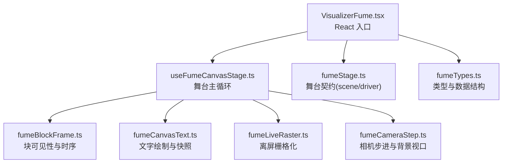
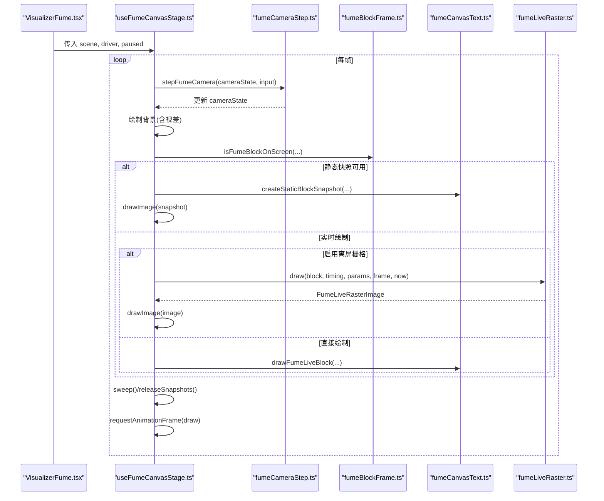
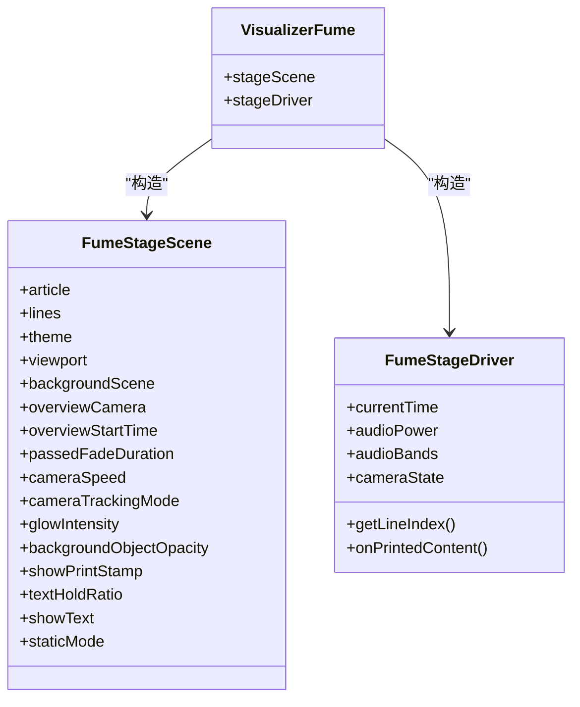
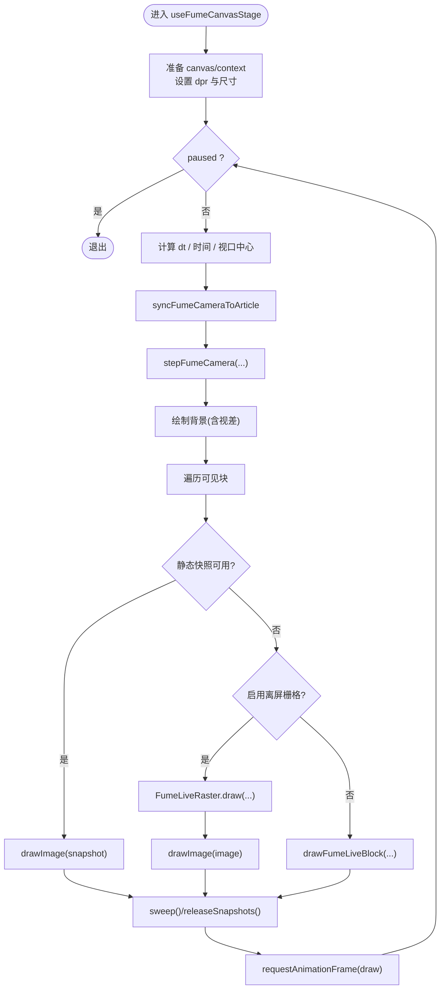
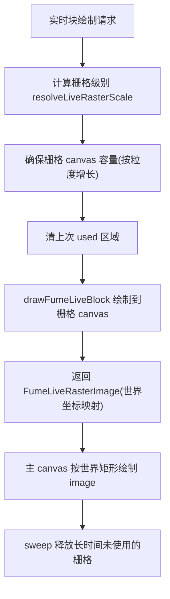
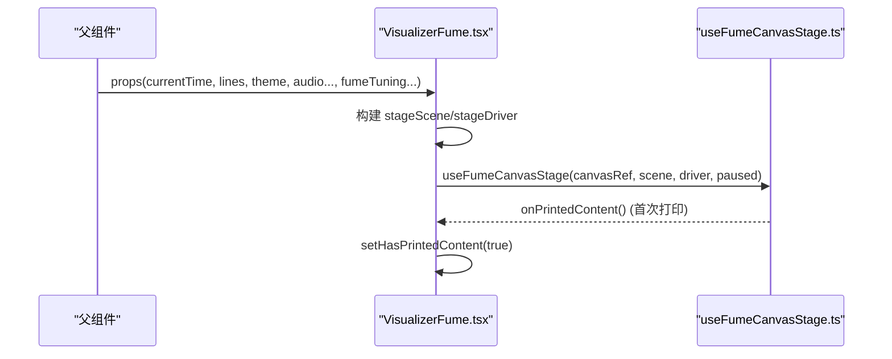
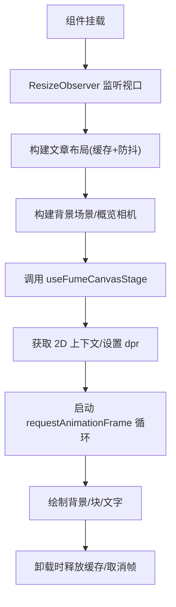
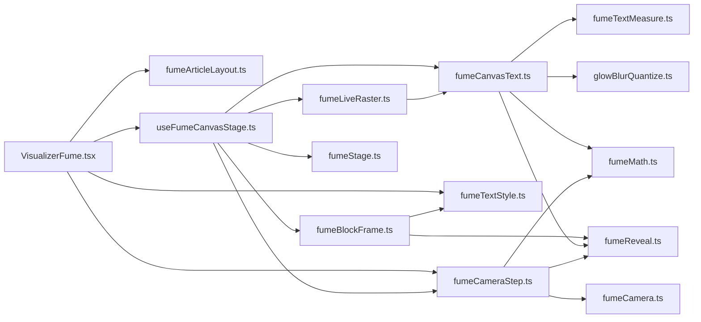

# 舞台系统架构

<cite>
**本文引用的文件**   
- [VisualizerFume.tsx](file://src/components/visualizer/fume/VisualizerFume.tsx)
- [useFumeCanvasStage.ts](file://src/components/visualizer/fume/useFumeCanvasStage.ts)
- [fumeStage.ts](file://src/components/visualizer/fume/fumeStage.ts)
- [fumeTypes.ts](file://src/components/visualizer/fume/fumeTypes.ts)
- [fumeLiveRaster.ts](file://src/components/visualizer/fume/fumeLiveRaster.ts)
- [fumeCanvasText.ts](file://src/components/visualizer/fume/fumeCanvasText.ts)
- [fumeBlockFrame.ts](file://src/components/visualizer/fume/fumeBlockFrame.ts)
- [fumeCameraStep.ts](file://src/components/visualizer/fume/fumeCameraStep.ts)
</cite>

## 目录
1. [简介](#简介)
2. [项目结构](#项目结构)
3. [核心组件](#核心组件)
4. [架构总览](#架构总览)
5. [详细组件分析](#详细组件分析)
6. [依赖关系分析](#依赖关系分析)
7. [性能考量](#性能考量)
8. [故障排查指南](#故障排查指南)
9. [结论](#结论)
10. [附录](#附录)

## 简介
本文件为 Fume 模式的舞台系统提供深入技术文档，聚焦以下目标：
- 解释 FumeStageDriver 与 FumeStageScene 的设计模式，以及舞台生命周期管理、渲染循环控制与状态同步机制。
- 详细说明 Canvas 渲染管道：离屏渲染、增量更新与内存优化策略。
- 阐述舞台与 React 组件的集成方式：props 传递、事件处理与性能监控。
- 说明舞台初始化流程：资源加载、上下文创建与动画帧管理。
- 提供调试工具使用方法和性能分析技巧。

## 项目结构
Fume 舞台相关代码集中在 visualizer/fume 目录下，采用“数据驱动 + 渲染分离”的组织方式：
- VisualizerFume.tsx：React 入口，负责布局构建、主题与调参、背景场景生成、相机概览计算，并组装 scene/driver 传给舞台钩子。
- useFumeCanvasStage.ts：舞台主循环，协调相机步进、背景绘制、静态快照缓存与实时文本绘制。
- fumeStage.ts：定义舞台契约（scene/driver）与音频采样读取。
- fumeTypes.ts：共享数据结构（文章布局、块、相机状态等）。
- fumeBlockFrame.ts：每帧对单个块的可见性、时序与样式决策。
- fumeCanvasText.ts：Canvas 2D 文字绘制与静态快照创建。
- fumeLiveRaster.ts：针对 Linux 下字体缓存泄漏问题的离屏栅格化方案。
- fumeCameraStep.ts：相机步进、回退桥接与背景视口计算。

**图示来源**
- [VisualizerFume.tsx:43-295](file://src/components/visualizer/fume/VisualizerFume.tsx#L43-L295)
- [useFumeCanvasStage.ts:25-286](file://src/components/visualizer/fume/useFumeCanvasStage.ts#L25-L286)
- [fumeStage.ts:11-48](file://src/components/visualizer/fume/fumeStage.ts#L11-L48)
- [fumeTypes.ts:8-159](file://src/components/visualizer/fume/fumeTypes.ts#L8-L159)
- [fumeBlockFrame.ts:31-176](file://src/components/visualizer/fume/fumeBlockFrame.ts#L31-L176)
- [fumeCanvasText.ts:61-409](file://src/components/visualizer/fume/fumeCanvasText.ts#L61-L409)
- [fumeLiveRaster.ts:55-119](file://src/components/visualizer/fume/fumeLiveRaster.ts#L55-L119)
- [fumeCameraStep.ts:98-413](file://src/components/visualizer/fume/fumeCameraStep.ts#L98-L413)

**章节来源**
- [VisualizerFume.tsx:43-295](file://src/components/visualizer/fume/VisualizerFume.tsx#L43-L295)
- [useFumeCanvasStage.ts:25-286](file://src/components/visualizer/fume/useFumeCanvasStage.ts#L25-L286)

## 核心组件
- FumeStageScene：描述当前舞台所需的全部静态/半静态数据，包括文章布局、歌词行、主题、视口、背景场景、概览相机、时间参数与显示开关。
- FumeStageDriver：每帧被读取的动态数据源，包含时间、音频能量/频段、相机状态、当前行索引回调与“已打印内容”通知回调。
- useFumeCanvasStage：React 钩子，封装完整渲染循环，负责：
  - 根据视口与 DPR 调整 canvas 尺寸与变换。
  - 调用相机步进更新 cameraState。
  - 绘制背景层（含视差）。
  - 遍历可见块，决定走静态快照路径或实时绘制路径。
  - 维护静态快照缓存与离屏栅格器，定期释放闲置资源。
- fumeBlockFrame：计算块是否可见、块时序（等待/活跃/已过）、静态层快照规格与 alpha。
- fumeCanvasText：实现文字绘制、发光、颜色轨迹、打印标记；支持创建静态快照。
- fumeLiveRaster：将正在打印的块以离散栅格级别绘制到独立 canvas，避免在连续缩放时频繁触发字体缓存分配。
- fumeCameraStep：选择焦点块/概览镜头，计算目标位置与缩放，执行弹簧/桥接过渡，并计算背景视口。

**章节来源**
- [fumeStage.ts:11-48](file://src/components/visualizer/fume/fumeStage.ts#L11-L48)
- [useFumeCanvasStage.ts:25-286](file://src/components/visualizer/fume/useFumeCanvasStage.ts#L25-L286)
- [fumeBlockFrame.ts:31-176](file://src/components/visualizer/fume/fumeBlockFrame.ts#L31-L176)
- [fumeCanvasText.ts:61-409](file://src/components/visualizer/fume/fumeCanvasText.ts#L61-L409)
- [fumeLiveRaster.ts:55-119](file://src/components/visualizer/fume/fumeLiveRaster.ts#L55-L119)
- [fumeCameraStep.ts:98-413](file://src/components/visualizer/fume/fumeCameraStep.ts#L98-L413)

## 架构总览
Fume 舞台遵循“React 编排 + 纯函数步进 + Canvas 渲染”的分层架构：
- React 层（VisualizerFume）负责：
  - 监听视口变化，构建文章布局（带缓存与防抖）。
  - 生成背景场景与概览相机。
  - 组合 scene/driver 并挂载 useFumeCanvasStage。
- 舞台层（useFumeCanvasStage）负责：
  - 帧循环（requestAnimationFrame），dt 计算与节流。
  - 相机步进（fumeCameraStep）。
  - 背景绘制（drawFumeBackground）。
  - 块遍历与可见性裁剪（isFumeBlockOnScreen）。
  - 静态快照缓存与离屏栅格化（createStaticBlockSnapshot / FumeLiveRaster）。
  - 实时文字绘制（drawFumeLiveBlock）。
- 数据契约（fumeStage.ts）明确 scene/driver 接口，便于替换渲染后端或测试。

**图示来源**
- [VisualizerFume.tsx:247-295](file://src/components/visualizer/fume/VisualizerFume.tsx#L247-L295)
- [useFumeCanvasStage.ts:91-286](file://src/components/visualizer/fume/useFumeCanvasStage.ts#L91-L286)
- [fumeCameraStep.ts:98-375](file://src/components/visualizer/fume/fumeCameraStep.ts#L98-L375)
- [fumeBlockFrame.ts:31-176](file://src/components/visualizer/fume/fumeBlockFrame.ts#L31-L176)
- [fumeCanvasText.ts:61-409](file://src/components/visualizer/fume/fumeCanvasText.ts#L61-L409)
- [fumeLiveRaster.ts:58-119](file://src/components/visualizer/fume/fumeLiveRaster.ts#L58-L119)

## 详细组件分析

### FumeStageScene 与 FumeStageDriver 设计
- FumeStageScene 是“不可变快照”，当歌词、主题、视口或调参变化时重建，供渲染层消费。
- FumeStageDriver 是“可变读端”，每帧读取 currentTime/audioPower/audioBands/cameraState/getLineIndex/onPrintedContent。
- readFumeAudioLevels 从 MotionValue 中采样音频数据，解耦 framer-motion 与渲染逻辑。

**图示来源**
- [fumeStage.ts:11-48](file://src/components/visualizer/fume/fumeStage.ts#L11-L48)
- [VisualizerFume.tsx:247-295](file://src/components/visualizer/fume/VisualizerFume.tsx#L247-L295)

**章节来源**
- [fumeStage.ts:11-48](file://src/components/visualizer/fume/fumeStage.ts#L11-L48)
- [VisualizerFume.tsx:247-295](file://src/components/visualizer/fume/VisualizerFume.tsx#L247-L295)

### 舞台生命周期与渲染循环
- 初始化：
  - VisualizerFume 通过 ResizeObserver 获取视口，构建文章布局（带缓存键与防抖）。
  - 构建 backgroundScene 与 overviewCamera。
  - 组装 stageScene/stageDriver 并调用 useFumeCanvasStage。
- 渲染循环：
  - useFumeCanvasStage 内部使用 requestAnimationFrame 驱动 draw。
  - dt 限制在 [1/240, 0.05] 秒，防止跳帧异常。
  - 每次绘制前按当前 viewport 与 devicePixelRatio 设置 canvas 尺寸与 transform。
  - 先同步相机到文章边界，再步进相机。
  - 绘制背景（无文章时仅背景；有文章时带视差）。
  - 遍历可见块：优先静态快照，其次实时绘制（可走离屏栅格）。
  - 每帧末尾清理离屏栅格与闲置快照。
- 销毁：
  - 取消 rAF，清空 live raster 与快照缓存。

**图示来源**
- [useFumeCanvasStage.ts:53-286](file://src/components/visualizer/fume/useFumeCanvasStage.ts#L53-L286)
- [fumeCameraStep.ts:98-375](file://src/components/visualizer/fume/fumeCameraStep.ts#L98-L375)

**章节来源**
- [useFumeCanvasStage.ts:53-286](file://src/components/visualizer/fume/useFumeCanvasStage.ts#L53-L286)

### Canvas 渲染管道：离屏渲染、增量更新与内存优化
- 离屏渲染：
  - FumeLiveRaster 为每个正在打印的块维护一个独立 canvas，按离散栅格级别（resolveLiveRasterScale）绘制，避免在相机缩放时频繁触发字体缓存分配。
  - 栅格 canvas 容量按 LIVE_CANVAS_GRANULE 步长增长，减少重分配。
  - 每帧只绘制可见区域，并在下次绘制前清除上次 used 区域，实现增量更新。
- 静态快照：
  - createStaticBlockSnapshot 将整块文本预渲染到离屏 canvas，并按 fill/shadowBlur/shadowColor 生成缓存键。
  - 快照缓存按 lastUsed 时间戳回收，空闲超过 SNAPSHOT_IDLE_MS 即释放底层像素缓冲。
- 增量更新：
  - 实时绘制路径逐字元推进（resolvePrintedGraphemeCount），结合颜色轨迹与发光包络，避免全量重绘。
  - 背景视口随相机视差移动，减少不必要的重绘范围。
- 内存优化：
  - 快照与离屏栅格均具备惰性释放策略。
  - 仅在需要时创建新 canvas，复用已有实例。
  - 通过 quantizeShadowBlur 量化模糊半径，降低 Chromium 字体缓存压力。

**图示来源**
- [fumeLiveRaster.ts:58-119](file://src/components/visualizer/fume/fumeLiveRaster.ts#L58-L119)
- [fumeCanvasText.ts:61-103](file://src/components/visualizer/fume/fumeCanvasText.ts#L61-L103)
- [useFumeCanvasStage.ts:210-274](file://src/components/visualizer/fume/useFumeCanvasStage.ts#L210-L274)

**章节来源**
- [fumeLiveRaster.ts:55-119](file://src/components/visualizer/fume/fumeLiveRaster.ts#L55-L119)
- [fumeCanvasText.ts:61-103](file://src/components/visualizer/fume/fumeCanvasText.ts#L61-L103)
- [useFumeCanvasStage.ts:210-274](file://src/components/visualizer/fume/useFumeCanvasStage.ts#L210-L274)

### 舞台与 React 组件集成：Props、事件与性能监控
- Props 传递：
  - VisualizerFume 接收播放时间、歌词行、主题、音频能量/频段、字幕配置与 Fume 调参。
  - 将 article/backgroundScene/overviewCamera/passedFadeDuration/cameraSpeed/glowIntensity/textHoldRatio/showPrintStamp/staticMode 等组合为 stageScene。
  - 将 currentTime/audioPower/audioBands/cameraState/getLineIndex/onPrintedContent 组合为 stageDriver。
- 事件处理：
  - onPrintedContent：首次检测到任何块开始打印时触发，用于 UI 状态切换（如缩放过渡）。
  - ResizeObserver：监听视口变化，触发布局重建。
- 性能监控：
  - layoutBuildVersionRef 与 hasResolvedArticleRef 保证布局重建的幂等与去抖。
  - LAYOUT_REBUILD_DEBOUNCE_MS 控制重复构建开销。
  - 快照与栅格的惰性释放避免内存膨胀。

**图示来源**
- [VisualizerFume.tsx:43-295](file://src/components/visualizer/fume/VisualizerFume.tsx#L43-L295)
- [useFumeCanvasStage.ts:139-143](file://src/components/visualizer/fume/useFumeCanvasStage.ts#L139-L143)

**章节来源**
- [VisualizerFume.tsx:43-295](file://src/components/visualizer/fume/VisualizerFume.tsx#L43-L295)
- [useFumeCanvasStage.ts:139-143](file://src/components/visualizer/fume/useFumeCanvasStage.ts#L139-L143)

### 舞台初始化流程：资源加载、上下文创建与动画帧管理
- 资源加载：
  - 根据 lines/viewport/layoutTheme/lyricsFontScale/fumeTuning 构建文章布局，使用 buildLayoutCacheKey 做缓存键。
  - 构建 backgroundScene（几何背景/纹理等）与 overviewCamera（文章概览镜头）。
- 上下文创建：
  - 在 useFumeCanvasStage 内获取 canvas.getContext('2d')，按 DPR 设置尺寸与变换。
  - 初始化 FumeLiveRaster 实例。
- 动画帧管理：
  - 使用 window.requestAnimationFrame 驱动 draw，暂停时取消下一帧。
  - 组件卸载时 cancelAnimationFrame 并释放所有缓存。

**图示来源**
- [VisualizerFume.tsx:83-195](file://src/components/visualizer/fume/VisualizerFume.tsx#L83-L195)
- [useFumeCanvasStage.ts:53-88](file://src/components/visualizer/fume/useFumeCanvasStage.ts#L53-L88)
- [useFumeCanvasStage.ts:281-286](file://src/components/visualizer/fume/useFumeCanvasStage.ts#L281-L286)

**章节来源**
- [VisualizerFume.tsx:83-195](file://src/components/visualizer/fume/VisualizerFume.tsx#L83-L195)
- [useFumeCanvasStage.ts:53-88](file://src/components/visualizer/fume/useFumeCanvasStage.ts#L53-L88)
- [useFumeCanvasStage.ts:281-286](file://src/components/visualizer/fume/useFumeCanvasStage.ts#L281-L286)

## 依赖关系分析
- VisualizerFume 依赖：
  - fumeCameraStep（概览相机、相机步进）
  - fumeArticleLayout（文章布局构建）
  - fumeTextStyle（过场样式与淡出时长）
  - useFumeCanvasStage（渲染）
- useFumeCanvasStage 依赖：
  - fumeCameraStep（相机步进与背景视口）
  - fumeBlockFrame（可见性、时序、静态层）
  - fumeCanvasText（文字绘制与快照）
  - fumeLiveRaster（离屏栅格）
  - fumeStage（scene/driver 契约）
- fumeBlockFrame 依赖：
  - fumeReveal（打印进度/过场截止）
  - fumeTextStyle（过场样式）
  - fumeMath（数学工具）
- fumeCanvasText 依赖：
  - glowBlurQuantize（模糊量化）
  - fumeMath（插值/缓动）
  - fumeReveal（打印计数）
  - fumeTextStyle（活动色）
  - fumeTextMeasure（字体/度量）
- fumeLiveRaster 依赖：
  - fumeCanvasText（drawFumeLiveBlock）
- fumeCameraStep 依赖：
  - fumeCamera（相机常量/焦点点/缩放）
  - fumeReveal（打印进度）
  - fumeMath（插值/缓动）

**图示来源**
- [VisualizerFume.tsx:1-23](file://src/components/visualizer/fume/VisualizerFume.tsx#L1-L23)
- [useFumeCanvasStage.ts:1-10](file://src/components/visualizer/fume/useFumeCanvasStage.ts#L1-L10)
- [fumeBlockFrame.ts:1-8](file://src/components/visualizer/fume/fumeBlockFrame.ts#L1-L8)
- [fumeCanvasText.ts:1-10](file://src/components/visualizer/fume/fumeCanvasText.ts#L1-L10)
- [fumeLiveRaster.ts:1-3](file://src/components/visualizer/fume/fumeLiveRaster.ts#L1-L3)
- [fumeCameraStep.ts:1-6](file://src/components/visualizer/fume/fumeCameraStep.ts#L1-L6)

**章节来源**
- [VisualizerFume.tsx:1-23](file://src/components/visualizer/fume/VisualizerFume.tsx#L1-L23)
- [useFumeCanvasStage.ts:1-10](file://src/components/visualizer/fume/useFumeCanvasStage.ts#L1-L10)
- [fumeBlockFrame.ts:1-8](file://src/components/visualizer/fume/fumeBlockFrame.ts#L1-L8)
- [fumeCanvasText.ts:1-10](file://src/components/visualizer/fume/fumeCanvasText.ts#L1-L10)
- [fumeLiveRaster.ts:1-3](file://src/components/visualizer/fume/fumeLiveRaster.ts#L1-L3)
- [fumeCameraStep.ts:1-6](file://src/components/visualizer/fume/fumeCameraStep.ts#L1-L6)

## 性能考量
- 帧率稳定：
  - dt 限制在合理区间，避免极端跳帧导致数值爆炸。
  - 相机步进使用弹簧与桥接混合，兼顾平滑与响应。
- 渲染优化：
  - 静态快照缓存减少重复绘制；按 lastUsed 回收。
  - 离屏栅格化避免在缩放时频繁触发字体缓存分配，缓解 Linux 下 fd 泄漏问题。
  - 模糊半径量化减少 GPU/CPU 抖动。
- 内存管理：
  - 快照与栅格均惰性释放，空闲超时即回收。
  - 栅格 canvas 容量按粒度增长，减少重分配次数。
- React 层优化：
  - 布局构建使用缓存键与防抖，避免频繁重建。
  - ResizeObserver 合并视口变化，减少重排。

[本节为通用性能建议，不直接分析具体文件]

## 故障排查指南
- 常见问题定位：
  - 画面闪烁/卡顿：检查 dt 是否异常大；确认 paused 状态是否正确传递；查看是否有大量快照/栅格未及时释放。
  - 文字模糊/锯齿：确认 devicePixelRatio 与 canvas 尺寸匹配；检查 blur 量化是否生效。
  - Linux 下内存泄漏：确认启用了离屏栅格路径（isGlowBlurQuantized 条件分支），避免直接在相机变换下绘制实时文字。
  - 相机跳动：检查 retarget 持续时间与 cameraSpeed 配置；观察 overview 切换时的桥接阶段。
- 调试建议：
  - 在 VisualizerFume 中打开 showPrintStamp 以观察打印标记。
  - 调整 fumeTuning.glowIntensity/cameraSpeed/textHoldRatio 观察影响。
  - 使用浏览器性能面板记录 requestAnimationFrame 耗时与 GC 行为。
  - 关注 onPrintedContent 触发时机，确认 UI 过渡与渲染同步。

**章节来源**
- [useFumeCanvasStage.ts:91-110](file://src/components/visualizer/fume/useFumeCanvasStage.ts#L91-L110)
- [useFumeCanvasStage.ts:210-274](file://src/components/visualizer/fume/useFumeCanvasStage.ts#L210-L274)
- [fumeLiveRaster.ts:5-15](file://src/components/visualizer/fume/fumeLiveRaster.ts#L5-L15)
- [VisualizerFume.tsx:233-234](file://src/components/visualizer/fume/VisualizerFume.tsx#L233-L234)

## 结论
Fume 舞台通过清晰的 scene/driver 契约、稳定的渲染循环与多级缓存策略，实现了高流畅度的歌词可视化体验。其离屏栅格化与静态快照机制有效缓解了平台差异带来的性能问题，同时保持与 React 生态的良好集成。建议在扩展新功能时遵循现有分层与数据流约定，优先复用相机步进、块时序与渲染管线能力。

[本节为总结性内容，不直接分析具体文件]

## 附录
- 关键类型速览（节选）：
  - ViewportSize：视口宽高。
  - FumeBlock：文章块，包含布局、文本段、词范围与渲染线。
  - FumeArticleLayout：文章整体布局与块集合。
  - CameraTarget/CameraRetargetState：相机状态与回退桥接状态。
  - StaticBlockSnapshot：静态快照对象。

**章节来源**
- [fumeTypes.ts:8-159](file://src/components/visualizer/fume/fumeTypes.ts#L8-L159)