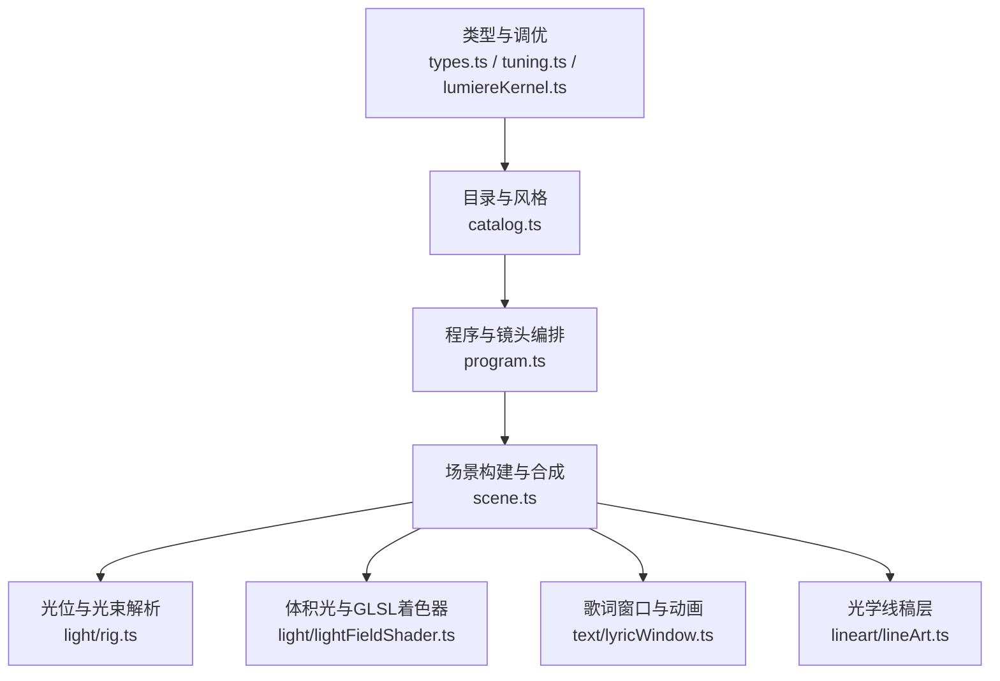
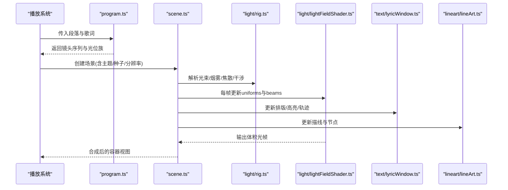
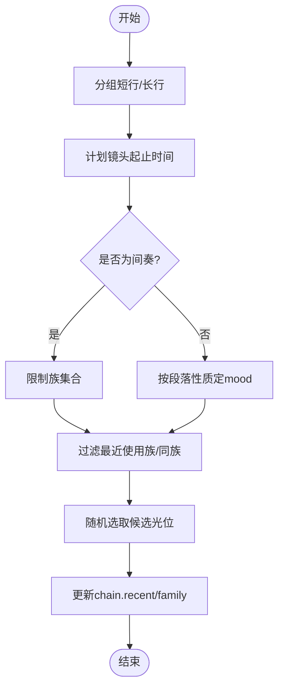
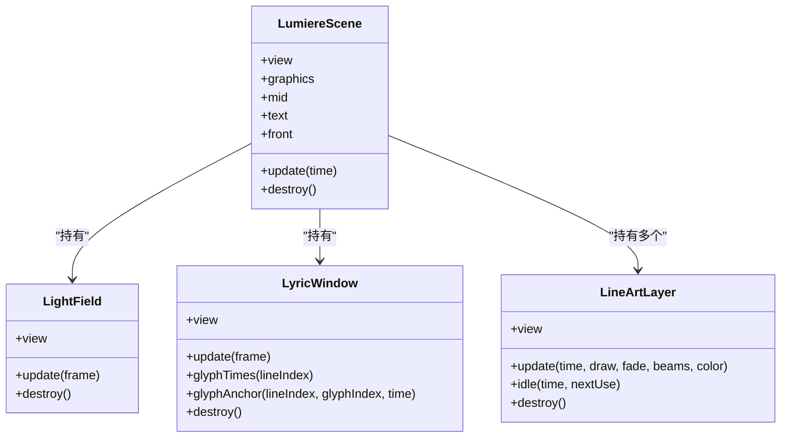
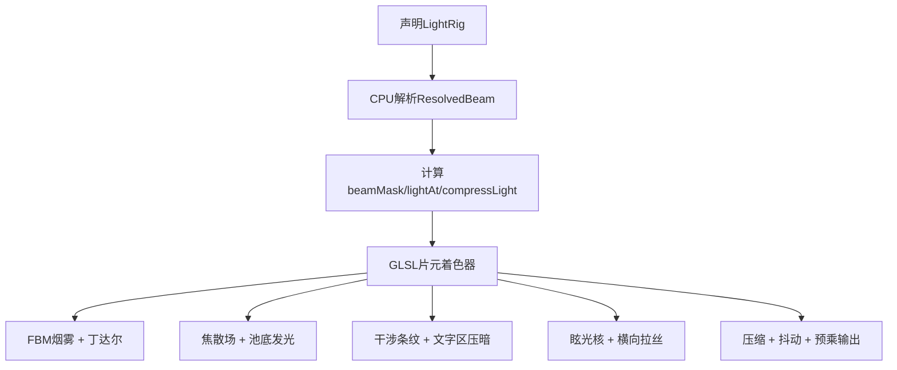
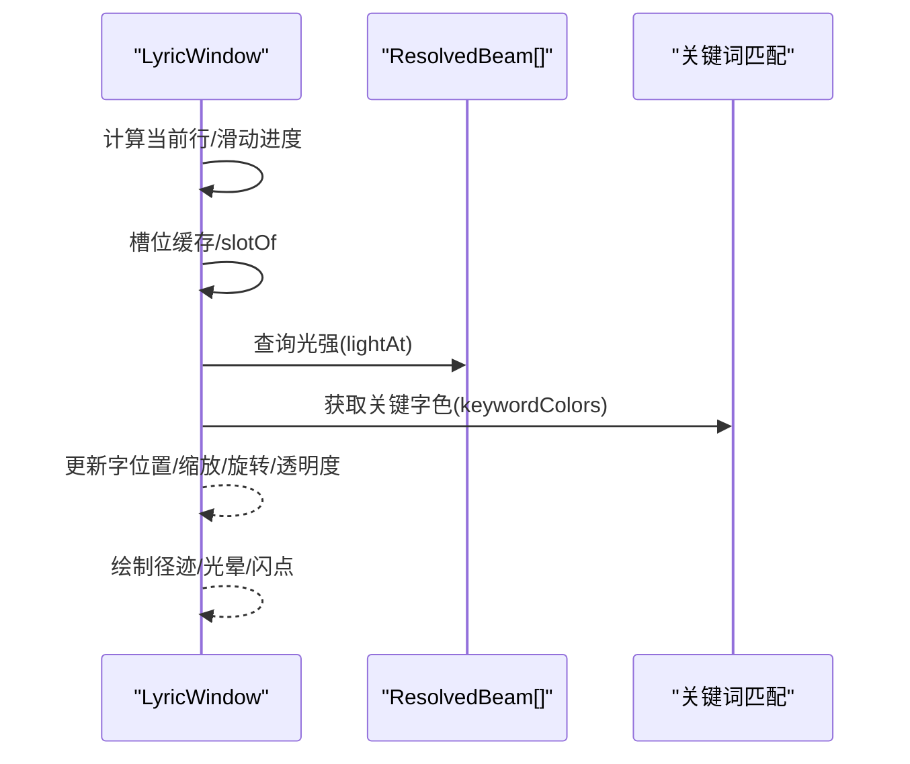
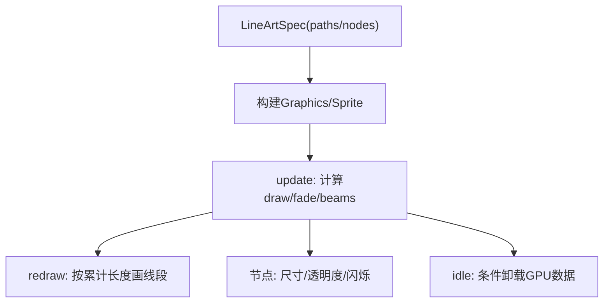
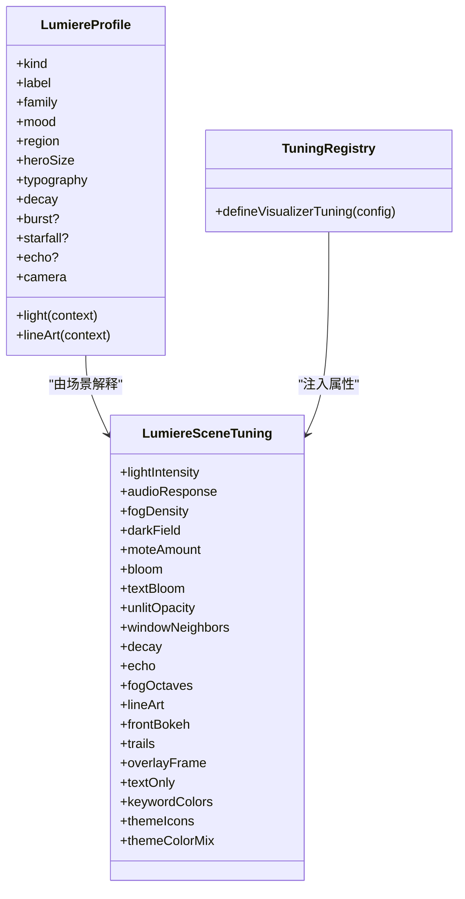
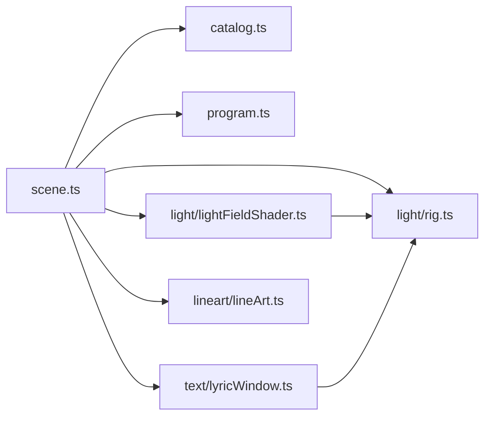

# Lumiere模式实现

<cite>
**本文引用的文件**   
- [src/components/visualizer/definition.ts](file://src/components/visualizer/definition.ts)
- [src/components/visualizer/lumiere/tuning.ts](file://src/components/visualizer/lumiere/tuning.ts)
- [src/components/visualizer/lumiere/catalog.ts](file://src/components/visualizer/lumiere/catalog.ts)
- [src/components/visualizer/lumiere/types.ts](file://src/components/visualizer/lumiere/types.ts)
- [src/components/visualizer/lumiere/program.ts](file://src/components/visualizer/lumiere/program.ts)
- [src/components/visualizer/lumiere/scene.ts](file://src/components/visualizer/lumiere/scene.ts)
- [src/components/visualizer/lumiere/lumiereKernel.ts](file://src/components/visualizer/lumiere/lumiereKernel.ts)
- [src/components/visualizer/lumiere/light/rig.ts](file://src/components/visualizer/lumiere/light/rig.ts)
- [src/components/visualizer/lumiere/light/lightFieldShader.ts](file://src/components/visualizer/lumiere/light/lightFieldShader.ts)
- [src/components/visualizer/lumiere/text/lyricWindow.ts](file://src/components/visualizer/lumiere/text/lyricWindow.ts)
- [src/components/visualizer/lumiere/lineart/lineArt.ts](file://src/components/visualizer/lumiere/lineart/lineArt.ts)
</cite>

## 目录
1. [引言](#引言)
2. [项目结构](#项目结构)
3. [核心组件](#核心组件)
4. [架构总览](#架构总览)
5. [详细组件分析](#详细组件分析)
6. [依赖关系分析](#依赖关系分析)
7. [性能与GPU资源管理](#性能与gpu资源管理)
8. [故障排查指南](#故障排查指南)
9. [结论](#结论)
10. [附录：自定义Lumiere效果开发指南](#附录自定义lumiere效果开发指南)

## 引言
本文件为“Lumiere（绘光）可视化模式”的完整技术文档。该模式以多图层合成、体积光渲染、动态阴影与歌词同步为核心，提供舞台级光束、烟雾、焦散、干涉条纹、线稿动画与十字爆闪等效果。其设计将“纯数据的光位配方”与“运行时渲染管线”解耦：程序编排按段落切分镜头并选择光位族；场景构建器负责图层组织、运镜、转场与主题适配；底层通过CPU侧光束解析与GLSL光场着色器协同，保证字面亮度与光柱位置一致。

## 项目结构
Lumiere模式位于可视化子系统下，围绕“类型定义—程序编排—场景构建—光场渲染—歌词窗口—线稿层”分层组织：
- 类型与调优：types.ts、tuning.ts、lumiereKernel.ts
- 目录与风格：catalog.ts
- 程序与镜头：program.ts
- 场景与合成：scene.ts
- 光位与光束：light/rig.ts
- 体积光与着色器：light/lightFieldShader.ts
- 歌词排版与动画：text/lyricWindow.ts
- 光学线稿：lineart/lineArt.ts

**图示来源** 
- [src/components/visualizer/lumiere/types.ts:1-156](file://src/components/visualizer/lumiere/types.ts#L1-L156)
- [src/components/visualizer/lumiere/tuning.ts:1-12](file://src/components/visualizer/lumiere/tuning.ts#L1-L12)
- [src/components/visualizer/lumiere/lumiereKernel.ts:1-106](file://src/components/visualizer/lumiere/lumiereKernel.ts#L1-L106)
- [src/components/visualizer/lumiere/catalog.ts:1-70](file://src/components/visualizer/lumiere/catalog.ts#L1-L70)
- [src/components/visualizer/lumiere/program.ts:1-209](file://src/components/visualizer/lumiere/program.ts#L1-L209)
- [src/components/visualizer/lumiere/scene.ts:1-525](file://src/components/visualizer/lumiere/scene.ts#L1-L525)
- [src/components/visualizer/lumiere/light/rig.ts:1-334](file://src/components/visualizer/lumiere/light/rig.ts#L1-L334)
- [src/components/visualizer/lumiere/light/lightFieldShader.ts:1-439](file://src/components/visualizer/lumiere/light/lightFieldShader.ts#L1-L439)
- [src/components/visualizer/lumiere/text/lyricWindow.ts:1-800](file://src/components/visualizer/lumiere/text/lyricWindow.ts#L1-L800)
- [src/components/visualizer/lumiere/lineart/lineArt.ts:1-216](file://src/components/visualizer/lumiere/lineart/lineArt.ts#L1-L216)

**章节来源**
- [src/components/visualizer/lumiere/types.ts:1-156](file://src/components/visualizer/lumiere/types.ts#L1-L156)
- [src/components/visualizer/lumiere/catalog.ts:1-70](file://src/components/visualizer/lumiere/catalog.ts#L1-L70)
- [src/components/visualizer/lumiere/program.ts:1-209](file://src/components/visualizer/lumiere/program.ts#L1-L209)
- [src/components/visualizer/lumiere/scene.ts:1-525](file://src/components/visualizer/lumiere/scene.ts#L1-L525)

## 核心组件
- 类型与调优
  - types.ts：定义光位Profile、场景Tuning、Bloom预设、跨段Section等数据结构。
  - tuning.ts：将Lumiere强类型Tuning注入到可视化渲染边界。
  - lumiereKernel.ts：定义Mood、段落性质、变换矩阵、音频帧等内核约定。
- 目录与风格
  - catalog.ts：汇总10族×若干种光位，提供族标签、描述与查找API。
- 程序编排
  - program.ts：切块（groupLines）、计划镜头（planShots）、选光位（castShot）、链式去重（advanceChain）。
- 场景构建
  - scene.ts：七层合成（图形组/素材插入层/文字组/前景），处理开场星落、交叠转场、bloom、运镜、关键字色、主题图标。
- 光位与光束
  - light/rig.ts：BeamSpec/Gobo/Wave/Caustic/Fog/Glare等声明式参数，CPU侧解析ResolvedBeam，计算beamMask/lightAt/compressLight。
- 体积光与着色器
  - light/lightFieldShader.ts：GLSL体积光、丁达尔烟雾、焦散、干涉条纹、眩光、暗场底叠加，输出预乘颜色。
- 歌词窗口
  - text/lyricWindow.ts：局部平铺窗口、纵横交错排版、逐字点亮、径迹、崩解、保护框避让、关键词高亮。
- 光学线稿
  - lineart/lineArt.ts：折线描边、节点闪烁、受光强度驱动alpha与tint，支持虚线与GPU卸载。

**章节来源**
- [src/components/visualizer/lumiere/types.ts:1-156](file://src/components/visualizer/lumiere/types.ts#L1-L156)
- [src/components/visualizer/lumiere/tuning.ts:1-12](file://src/components/visualizer/lumiere/tuning.ts#L1-L12)
- [src/components/visualizer/lumiere/lumiereKernel.ts:1-106](file://src/components/visualizer/lumiere/lumiereKernel.ts#L1-L106)
- [src/components/visualizer/lumiere/catalog.ts:1-70](file://src/components/visualizer/lumiere/catalog.ts#L1-L70)
- [src/components/visualizer/lumiere/program.ts:1-209](file://src/components/visualizer/lumiere/program.ts#L1-L209)
- [src/components/visualizer/lumiere/scene.ts:1-525](file://src/components/visualizer/lumiere/scene.ts#L1-L525)
- [src/components/visualizer/lumiere/light/rig.ts:1-334](file://src/components/visualizer/lumiere/light/rig.ts#L1-L334)
- [src/components/visualizer/lumiere/light/lightFieldShader.ts:1-439](file://src/components/visualizer/lumiere/light/lightFieldShader.ts#L1-L439)
- [src/components/visualizer/lumiere/text/lyricWindow.ts:1-800](file://src/components/visualizer/lumiere/text/lyricWindow.ts#L1-L800)
- [src/components/visualizer/lumiere/lineart/lineArt.ts:1-216](file://src/components/visualizer/lumiere/lineart/lineArt.ts#L1-L216)

## 架构总览
Lumiere采用“数据驱动+运行时合成”的架构：
- 数据层：Profile/Tuning/StructureLine/ParagraphKind/Mood等纯数据描述。
- 编排层：program.ts根据歌曲结构与段落性质生成镜头序列与光位族。
- 场景层：scene.ts组合光场、线稿、浮尘、星空、歌词窗口与前景散景，统一更新。
- 渲染层：rig.ts在CPU侧计算光束强度，lightFieldShader.ts在GPU侧绘制体积光与特效。
- 文本层：lyricWindow.ts负责歌词布局、高亮、过渡动画与避让。
- 装饰层：lineArt.ts提供光学线稿与节点闪烁。

**图示来源** 
- [src/components/visualizer/lumiere/program.ts:113-209](file://src/components/visualizer/lumiere/program.ts#L113-L209)
- [src/components/visualizer/lumiere/scene.ts:194-494](file://src/components/visualizer/lumiere/scene.ts#L194-L494)
- [src/components/visualizer/lumiere/light/rig.ts:191-224](file://src/components/visualizer/lumiere/light/rig.ts#L191-L224)
- [src/components/visualizer/lumiere/light/lightFieldShader.ts:359-426](file://src/components/visualizer/lumiere/light/lightFieldShader.ts#L359-L426)
- [src/components/visualizer/lumiere/text/lyricWindow.ts:362-800](file://src/components/visualizer/lumiere/text/lyricWindow.ts#L362-L800)
- [src/components/visualizer/lumiere/lineart/lineArt.ts:91-216](file://src/components/visualizer/lumiere/lineart/lineArt.ts#L91-L216)

## 详细组件分析

### 程序编排与镜头规划（program.ts）
- 切块：短行两两合并，长行独立成镜头，避免单镜头过长。
- 计划：按段落起止时间分配镜头起止，长空隙插入间奏镜头。
- 选光位：按段落性质映射mood，间奏偏向安静族，避免最近使用过的族与同族连续重复。
- 链维护：记录recent族与family，跨段落保留，保证多样性。

**图示来源** 
- [src/components/visualizer/lumiere/program.ts:113-209](file://src/components/visualizer/lumiere/program.ts#L113-L209)

**章节来源**
- [src/components/visualizer/lumiere/program.ts:1-209](file://src/components/visualizer/lumiere/program.ts#L1-L209)

### 场景构建与多图层合成（scene.ts）
- 七层结构：图形组（光场/背景碎片/星空/线稿/浮尘）→ 素材插入层 → 文字组（十字爆闪/歌词窗口）→ 前景（散景）。
- 主题调色板：resolveLumierePalette将主题主/次色与强调色混合进光色、亮字色、未唱字色。
- 转场与交接：镜头切换时两套光束在光场内交叉渐变，光源移动走三次缓动曲线。
- 开场星落：首单元可触发星落与主光柱渐亮，后续单元从已亮状态继续。
- Bloom：图形组与文字组分别设置阈值与强度，文字区bloom区域固定以避免抖动。
- 音频响应：低频推光束亮度，高频提升浮尘闪烁，整体响度增加烟雾浓度。

**图示来源** 
- [src/components/visualizer/lumiere/scene.ts:194-494](file://src/components/visualizer/lumiere/scene.ts#L194-L494)
- [src/components/visualizer/lumiere/light/lightFieldShader.ts:317-439](file://src/components/visualizer/lumiere/light/lightFieldShader.ts#L317-L439)
- [src/components/visualizer/lumiere/text/lyricWindow.ts:362-800](file://src/components/visualizer/lumiere/text/lyricWindow.ts#L362-L800)
- [src/components/visualizer/lumiere/lineart/lineArt.ts:91-216](file://src/components/visualizer/lumiere/lineart/lineArt.ts#L91-L216)

**章节来源**
- [src/components/visualizer/lumiere/scene.ts:1-525](file://src/components/visualizer/lumiere/scene.ts#L1-L525)

### 光位系统与体积光渲染（light/rig.ts + light/lightFieldShader.ts）
- 光束模型：BeamSpec包含光源位置、角度、半张角、宽度、衰减长度、边缘软度、条纹、色散、射程等。
- CPU解析：resolveBeams将声明转换为ResolvedBeam，应用sway/pulse/reveal/audioLift等调制。
- 光照公式：beamMask在CPU与GLSL中保持一致，确保字幕亮度与光柱位置对齐。
- 体积光：lightFieldShader.ts实现FBM噪声烟雾、丁达尔效应、焦散迭代、干涉条纹、眩光拉伸、暗场底叠加。
- 均匀变量：每帧将beams数组、雾参数、眩光、焦散、干涉、文字区屏蔽等写入UniformGroup。

**图示来源** 
- [src/components/visualizer/lumiere/light/rig.ts:191-334](file://src/components/visualizer/lumiere/light/rig.ts#L191-L334)
- [src/components/visualizer/lumiere/light/lightFieldShader.ts:39-286](file://src/components/visualizer/lumiere/light/lightFieldShader.ts#L39-L286)

**章节来源**
- [src/components/visualizer/lumiere/light/rig.ts:1-334](file://src/components/visualizer/lumiere/light/rig.ts#L1-L334)
- [src/components/visualizer/lumiere/light/lightFieldShader.ts:1-439](file://src/components/visualizer/lumiere/light/lightFieldShader.ts#L1-L439)

### 歌词同步机制（text/lyricWindow.ts）
- 窗口布局：当前行附近几行构成局部平铺窗口，支持横排/竖排/纵横交错三种排版。
- 换行滑动：LEAD提前、SLIDE时长、各行错开起步，叠加漂移与绕行，保持画面不停滞。
- 逐字点亮：基于演唱进度与光场强度，四芒闪点与柔光晕随光强变化。
- 径迹与崩解：换位时沿贝塞尔曲线飞行，记录过去路径形成径迹；点亮后延迟漂离并旋转。
- 保护框避让：邻行不朝当前行走，当前行绕小圈；非当前行进入当前行墨迹框时压暗。
- 关键词高亮：匹配wordColors的关键字在字、光晕、十字爆闪与背景碎片上着色。

**图示来源** 
- [src/components/visualizer/lumiere/text/lyricWindow.ts:362-800](file://src/components/visualizer/lumiere/text/lyricWindow.ts#L362-L800)
- [src/components/visualizer/lumiere/light/rig.ts:326-334](file://src/components/visualizer/lumiere/light/rig.ts#L326-L334)

**章节来源**
- [src/components/visualizer/lumiere/text/lyricWindow.ts:1-800](file://src/components/visualizer/lumiere/text/lyricWindow.ts#L1-L800)

### 光学线稿与节点闪烁（lineart/lineArt.ts）
- 折线描边：按累计长度控制描线进度，支持虚线周期切割。
- 节点闪烁：节点Sprite尺寸与透明度随出现进度与光强闪烁。
- GPU卸载：隐藏足够长时间且下次使用较远时，释放GraphicsContext的GPU批数据，避免WebGL缓冲增长。

**图示来源** 
- [src/components/visualizer/lumiere/lineart/lineArt.ts:91-216](file://src/components/visualizer/lumiere/lineart/lineArt.ts#L91-L216)

**章节来源**
- [src/components/visualizer/lumiere/lineart/lineArt.ts:1-216](file://src/components/visualizer/lumiere/lineart/lineArt.ts#L1-L216)

### 类型系统与调优注入（types.ts + tuning.ts + definition.ts）
- types.ts：定义LumiereProfile/LumiereSceneTuning/BloomPreset等，作为场景直接读取的参数契约。
- tuning.ts：defineVisualizerTuning将lumiereTuning注入渲染属性。
- definition.ts：扩展VisualizerTuningKind为'lumiere'，并提供onLumiereTuningChange回调接口。

**图示来源** 
- [src/components/visualizer/lumiere/types.ts:1-156](file://src/components/visualizer/lumiere/types.ts#L1-L156)
- [src/components/visualizer/lumiere/tuning.ts:1-12](file://src/components/visualizer/lumiere/tuning.ts#L1-L12)
- [src/components/visualizer/definition.ts:14-31](file://src/components/visualizer/definition.ts#L14-L31)

**章节来源**
- [src/components/visualizer/lumiere/types.ts:1-156](file://src/components/visualizer/lumiere/types.ts#L1-L156)
- [src/components/visualizer/lumiere/tuning.ts:1-12](file://src/components/visualizer/lumiere/tuning.ts#L1-L12)
- [src/components/visualizer/definition.ts:14-31](file://src/components/visualizer/definition.ts#L14-L31)

## 依赖关系分析
- 模块耦合
  - scene.ts依赖catalog.ts（光位族）、program.ts（镜头结构）、light/*（光束/光场）、text/*（歌词窗口）、lineart/*（线稿）。
  - light/lightFieldShader.ts依赖light/rig.ts（MAX_BEAMS、WAVE_MODE_ID、ResolvedBeam）。
  - text/lyricWindow.ts依赖light/rig.ts（lightAt/compressLight）与主题词匹配。
- 外部依赖
  - Pixi.js：Container/Graphics/Mesh/Shader/Geometry/Texture等用于图层与着色器。
  - 主题系统：Theme对象提供accentColor/primaryColor/secondaryColor/lyricsIcons/wordColors等。

**图示来源** 
- [src/components/visualizer/lumiere/scene.ts:1-525](file://src/components/visualizer/lumiere/scene.ts#L1-L525)
- [src/components/visualizer/lumiere/light/lightFieldShader.ts:1-439](file://src/components/visualizer/lumiere/light/lightFieldShader.ts#L1-L439)
- [src/components/visualizer/lumiere/text/lyricWindow.ts:1-800](file://src/components/visualizer/lumiere/text/lyricWindow.ts#L1-L800)
- [src/components/visualizer/lumiere/lineart/lineArt.ts:1-216](file://src/components/visualizer/lumiere/lineart/lineArt.ts#L1-L216)

**章节来源**
- [src/components/visualizer/lumiere/scene.ts:1-525](file://src/components/visualizer/lumiere/scene.ts#L1-L525)
- [src/components/visualizer/lumiere/light/lightFieldShader.ts:1-439](file://src/components/visualizer/lumiere/light/lightFieldShader.ts#L1-L439)
- [src/components/visualizer/lumiere/text/lyricWindow.ts:1-800](file://src/components/visualizer/lumiere/text/lyricWindow.ts#L1-L800)
- [src/components/visualizer/lumiere/lineart/lineArt.ts:1-216](file://src/components/visualizer/lumiere/lineart/lineArt.ts#L1-L216)

## 性能与GPU资源管理
- 光束上限：MAX_BEAMS限制每帧光束数量，避免GLSL循环开销过大。
- 体积光质量：fogOctaves控制噪声倍频数，平衡画质与性能。
- Bloom分区：图形组与文字组分别设置阈值与强度，减少过度泛光。
- 歌词窗口按需构建：仅构建当前行附近若干行，离开后销毁，降低纹理与几何内存。
- 线稿GPU卸载：隐藏超过阈值且下次使用较远时调用context.unload()释放批数据，防止WebGL缓冲累积。
- 文本bloom区域固定：避免Pixi按内容包围盒取整导致的降采样网格抖动。
- 音频响应限幅：低频对光束亮度提升有上限（AUDIO_GAIN），避免过曝。

[本节为通用性能建议，不直接分析具体文件]

## 故障排查指南
- 字幕抖动或错位
  - 检查text.filterArea是否固定为远大于画面的矩形，避免bloom金字塔原点跳动。
  - 确认scene.ts中文字组bloom区域设置与视口裁剪一致。
- 光束与字幕亮度不一致
  - 核对CPU侧beamMask/lightAt与GLSL端实现一致性，确保两者公式完全相同。
- 线条GPU泄漏
  - 确认lineArt.destroy时传递context:true，并在idle中调用shouldUnloadLineArt与context.unload()。
- 主题色异常
  - 检查resolveLumierePalette中主题主/次色与强调色的混合比例，以及glowOf峰值归一化逻辑。
- 转场闪烁
  - 检查镜头交接HANDOFF与GLARE_MOVE缓动曲线，确保handoff与glareK平滑过渡。

**章节来源**
- [src/components/visualizer/lumiere/scene.ts:349-362](file://src/components/visualizer/lumiere/scene.ts#L349-L362)
- [src/components/visualizer/lumiere/light/rig.ts:301-334](file://src/components/visualizer/lumiere/light/rig.ts#L301-L334)
- [src/components/visualizer/lumiere/lineart/lineArt.ts:195-216](file://src/components/visualizer/lumiere/lineart/lineArt.ts#L195-L216)
- [src/components/visualizer/lumiere/scene.ts:143-157](file://src/components/visualizer/lumiere/scene.ts#L143-L157)
- [src/components/visualizer/lumiere/scene.ts:101-114](file://src/components/visualizer/lumiere/scene.ts#L101-L114)

## 结论
Lumiere模式通过“数据驱动的光位配方”和“运行时多图层合成”，实现了舞台级光束、体积光、焦散、干涉、线稿与歌词同步的高表现力视觉效果。其关键优势在于：
- 严格的数据/渲染分离，便于扩展新族与新效果。
- CPU与GLSL一致的照明公式，保证字幕与光柱的一致性。
- 精细的转场与动画控制，兼顾可读性与视觉冲击。
- 完善的GPU资源管理与性能优化策略，适应长时运行与复杂曲目。

[本节为总结性内容，不直接分析具体文件]

## 附录：自定义Lumiere效果开发指南
- 新增光位族
  - 在catalog.ts中添加族常量与描述，并在LUMIERE_PROFILES中注册。
  - 在对应rigs目录下实现profile.light/lineArt/camera等函数，返回LightRig/LineArtSpec等数据。
- 调整场景行为
  - 修改types.ts中的LumiereSceneTuning字段，并在scene.ts中消费这些参数。
  - 如需新增特效（如粒子），在light/或text/下新增模块，并在scene.ts中组合到相应图层。
- 主题适配
  - 使用resolveLumierePalette将主题色融入光色与字色，确保对比度与可读性。
  - 通过keywordColors与lyricsIcons增强主题表达。
- 性能调优
  - 合理设置fogOctaves、bloom/textBloom、moteAmount等参数。
  - 利用textOnly模式仅渲染歌词，降低图形组开销。
  - 监控lineArt的idle卸载策略，避免GPU缓冲增长。

**章节来源**
- [src/components/visualizer/lumiere/catalog.ts:1-70](file://src/components/visualizer/lumiere/catalog.ts#L1-L70)
- [src/components/visualizer/lumiere/types.ts:71-139](file://src/components/visualizer/lumiere/types.ts#L71-L139)
- [src/components/visualizer/lumiere/scene.ts:143-157](file://src/components/visualizer/lumiere/scene.ts#L143-L157)
- [src/components/visualizer/lumiere/lineart/lineArt.ts:195-216](file://src/components/visualizer/lumiere/lineart/lineArt.ts#L195-L216)