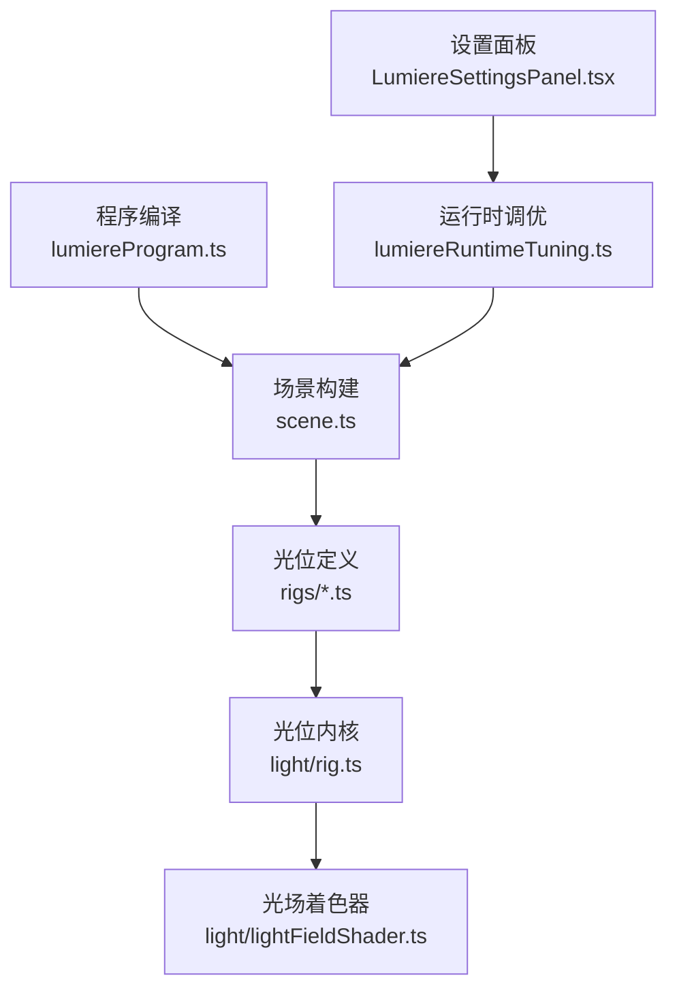
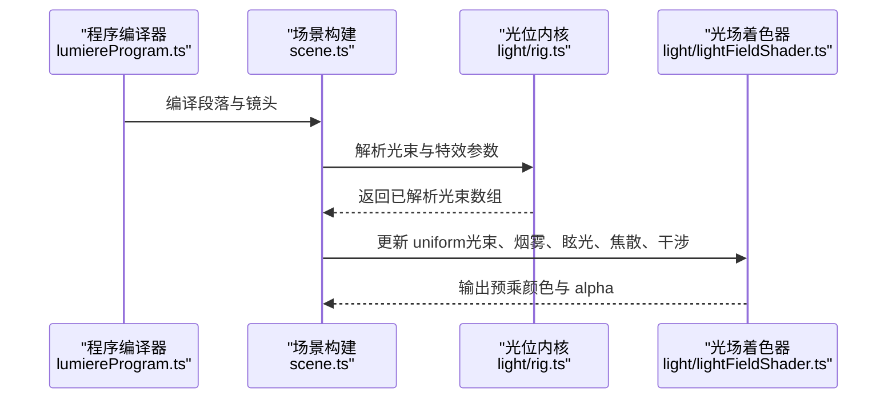
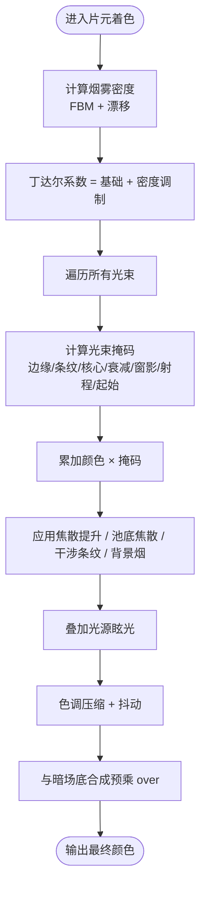
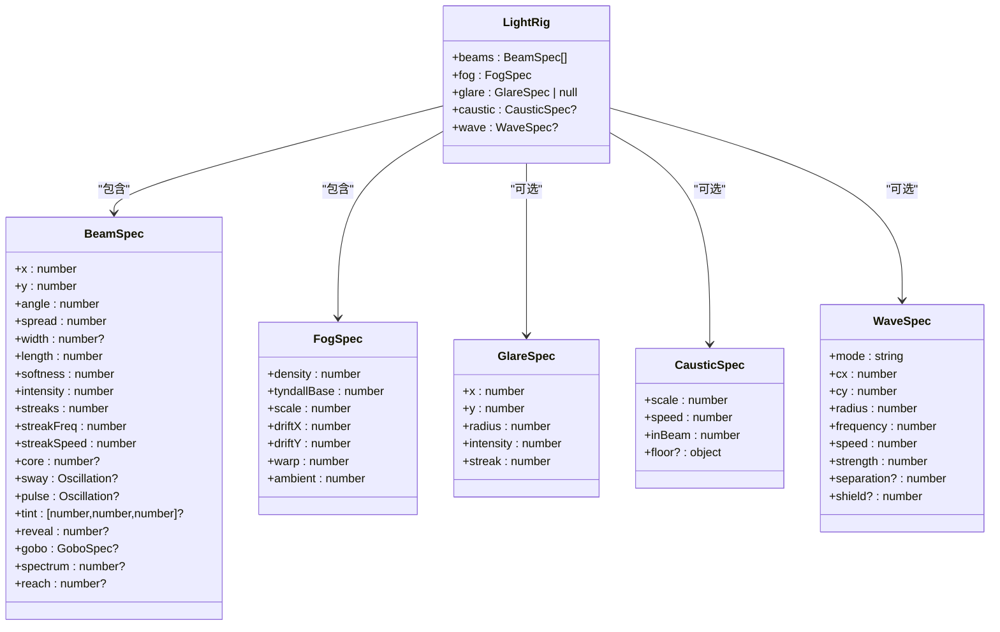
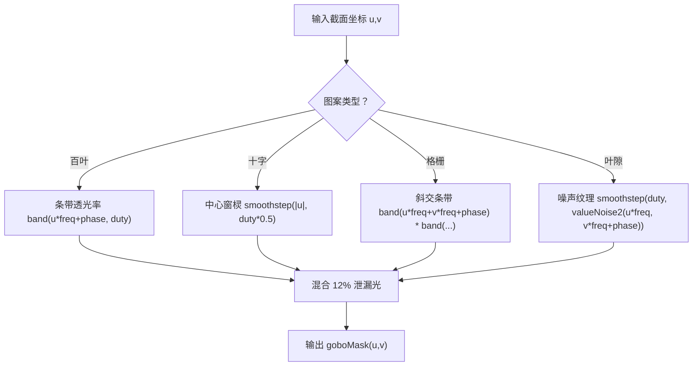
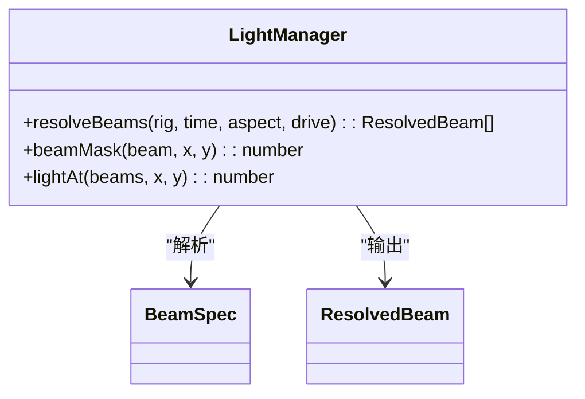
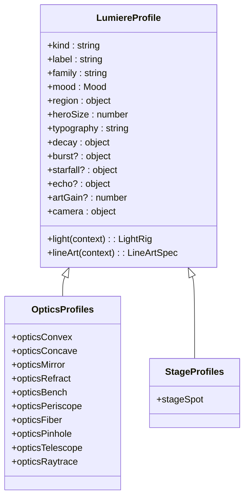
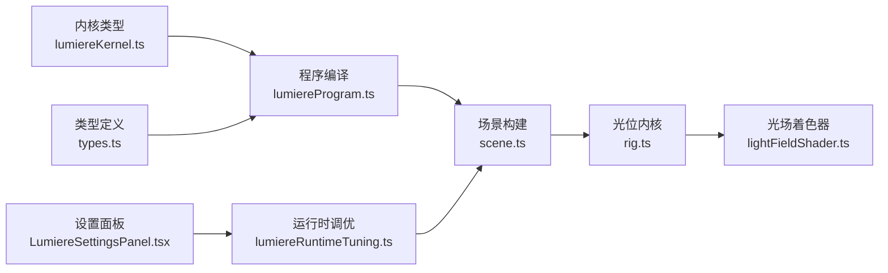

# 光照系统

<cite>
**本文引用的文件**   
- [lumiereKernel.ts](file://src/components/visualizer/lumiere/lumiereKernel.ts)
- [lumiereProgram.ts](file://src/components/visualizer/lumiere/lumiereProgram.ts)
- [types.ts](file://src/components/visualizer/lumiere/types.ts)
- [tuning.ts](file://src/components/visualizer/lumiere/tuning.ts)
- [lumiereRuntimeTuning.ts](file://src/components/visualizer/lumiere/lumiereRuntimeTuning.ts)
- [lightFieldShader.ts](file://src/components/visualizer/lumiere/light/lightFieldShader.ts)
- [rig.ts](file://src/components/visualizer/lumiere/light/rig.ts)
- [optics.ts](file://src/components/visualizer/lumiere/rigs/optics.ts)
- [stage.ts](file://src/components/visualizer/lumiere/rigs/stage.ts)
- [scene.ts](file://src/components/visualizer/lumiere/scene.ts)
- [LumiereSettingsPanel.tsx](file://src/components/visualizer/lumiere/LumiereSettingsPanel.tsx)
</cite>

## 目录
1. [引言](#引言)
2. [项目结构](#项目结构)
3. [核心组件](#核心组件)
4. [架构总览](#架构总览)
5. [详细组件分析](#详细组件分析)
6. [依赖关系分析](#依赖关系分析)
7. [性能与质量设置](#性能与质量设置)
8. [故障排查指南](#故障排查指南)
9. [结论](#结论)

## 引言
本技术文档面向 Lumiere 模式的光照系统，系统性说明其“光位—光场—场景”的渲染管线。内容覆盖：
- 光线追踪模拟算法：以声明式光束、CPU 解析与 GLSL 片元着色器协同实现体积光；包含光束掩码、窗影、色散、射程与衰减等关键路径。
- 体积光渲染：烟雾噪声（FBM）、丁达尔效应、光源眩光、焦散与干涉条纹、池底焦散投影。
- 动态阴影计算：通过窗影图样（百叶、十字、格栅、叶隙）在光束截面上产生遮挡与半透散射，形成实时阴影效果。
- 光源管理系统：点光源、方向光、聚光灯由统一光束参数表达，并通过光位（rig）组合为镜头风格。
- 光照着色器：GLSL 实现细节、优化技巧与 CPU/GPU 一致性保证。
- 质量与性能：画质档、烟雾倍频、浮尘数量、bloom 强度、仅文字模式等对性能的影响与最佳实践。

## 项目结构
Lumiere 光照系统位于可视化模块下，按职责分层组织：
- 程序编译层：将歌词与时间线编译为段落、镜头与转场计划。
- 光位定义层：用声明式数据描述光束、烟雾、眩光、焦散、干涉等。
- 渲染层：GPU 光场着色器 + Pixi Mesh 绘制，配合 CPU 解析生成每帧 uniform。
- 运行时调优层：用户设置映射到场景 tuning，控制画质与视觉强度。

**图表来源**
- [lumiereProgram.ts:130-210](file://src/components/visualizer/lumiere/lumiereProgram.ts#L130-L210)
- [scene.ts:194-207](file://src/components/visualizer/lumiere/scene.ts#L194-L207)
- [rig.ts:131-137](file://src/components/visualizer/lumiere/light/rig.ts#L131-L137)
- [lightFieldShader.ts:317-438](file://src/components/visualizer/lumiere/light/lightFieldShader.ts#L317-L438)
- [lumiereRuntimeTuning.ts:79-106](file://src/components/visualizer/lumiere/lumiereRuntimeTuning.ts#L79-L106)
- [LumiereSettingsPanel.tsx:161-171](file://src/components/visualizer/lumiere/LumiereSettingsPanel.tsx#L161-L171)

**章节来源**
- [lumiereProgram.ts:1-220](file://src/components/visualizer/lumiere/lumiereProgram.ts#L1-L220)
- [types.ts:1-156](file://src/components/visualizer/lumiere/types.ts#L1-L156)

## 核心组件
- 程序编译：将歌词行与时间轴切分为段落与镜头，选择光位并规划转场。
- 光位（Rig）：声明式描述光束组、烟雾、眩光、焦散、干涉等，提供 CPU 解析函数。
- 光场着色器：单 Mesh 全屏绘制，逐像素计算多束体积光、烟雾密度、眩光、焦散与干涉。
- 运行时调优：将用户设置映射为场景 tuning，决定画质档、烟雾倍频、浮尘数量等。
- 场景构建：根据节目单与光位生成场景容器、舞台与帧更新逻辑。

**章节来源**
- [lumiereProgram.ts:130-210](file://src/components/visualizer/lumiere/lumiereProgram.ts#L130-L210)
- [rig.ts:131-137](file://src/components/visualizer/lumiere/light/rig.ts#L131-L137)
- [lightFieldShader.ts:317-438](file://src/components/visualizer/lumiere/light/lightFieldShader.ts#L317-L438)
- [lumiereRuntimeTuning.ts:79-106](file://src/components/visualizer/lumiere/lumiereRuntimeTuning.ts#L79-L106)
- [scene.ts:194-207](file://src/components/visualizer/lumiere/scene.ts#L194-L207)

## 架构总览
下图展示从程序编译到 GPU 渲染的关键调用链与数据流：

**图表来源**
- [lumiereProgram.ts:130-210](file://src/components/visualizer/lumiere/lumiereProgram.ts#L130-L210)
- [scene.ts:194-207](file://src/components/visualizer/lumiere/scene.ts#L194-L207)
- [rig.ts:191-224](file://src/components/visualizer/lumiere/light/rig.ts#L191-L224)
- [lightFieldShader.ts:359-426](file://src/components/visualizer/lumiere/light/lightFieldShader.ts#L359-L426)

## 详细组件分析

### 光线追踪模拟算法
Lumiere 并非传统意义上的几何光线追踪，而是采用“声明式光束 + CPU 解析 + GPU 片元着色”的混合方案：
- 光束模型：每个光束由位置、角度、张角、初始宽度、长度、软边、强度、条纹、中心亮度、摇摆/脉冲、窗影、色散、射程等参数描述。
- CPU 解析：将画面比例坐标转换为高度单位，应用摇摆/脉冲、reveal 渐起、音频低频提升，得到 ResolvedBeam。
- GPU 计算：片元着色器中按像素计算沿光束距离与横向偏移，叠加边缘柔化、条纹噪声、核心增强、指数衰减、窗影遮罩、射程收尾与光源起始平滑。

**图表来源**
- [lightFieldShader.ts:115-126](file://src/components/visualizer/lumiere/light/lightFieldShader.ts#L115-L126)
- [lightFieldShader.ts:149-167](file://src/components/visualizer/lumiere/light/lightFieldShader.ts#L149-L167)
- [lightFieldShader.ts:227-286](file://src/components/visualizer/lumiere/light/lightFieldShader.ts#L227-L286)

**章节来源**
- [rig.ts:25-58](file://src/components/visualizer/lumiere/light/rig.ts#L25-L58)
- [rig.ts:191-224](file://src/components/visualizer/lumiere/light/rig.ts#L191-L224)
- [rig.ts:301-323](file://src/components/visualizer/lumiere/light/rig.ts#L301-L323)
- [lightFieldShader.ts:149-167](file://src/components/visualizer/lumiere/light/lightFieldShader.ts#L149-L167)
- [lightFieldShader.ts:227-286](file://src/components/visualizer/lumiere/light/lightFieldShader.ts#L227-L286)

### 体积光渲染技术
- 烟雾与丁达尔：使用 FBM 噪声生成体积密度，结合漂移与域扭曲，使烟雾呈现一缕一缕的结构；丁达尔系数由基础可见度与密度共同决定。
- 光源眩光：亮核 + 大半径柔光 + 横向拉丝，强度可随整体光强与 tuning 缩放。
- 焦散与干涉：焦散场迭代模拟水面焦散，调制光束亮度；干涉条纹支持环形、双缝、双源与艾里斑模式，并在文字区压暗以保证可读性。
- 池底焦散：在指定椭圆区域直接叠加焦散光斑，不依赖烟雾。

**图表来源**
- [rig.ts:131-137](file://src/components/visualizer/lumiere/light/rig.ts#L131-L137)
- [rig.ts:25-58](file://src/components/visualizer/lumiere/light/rig.ts#L25-L58)
- [rig.ts:106-129](file://src/components/visualizer/lumiere/light/rig.ts#L106-L129)
- [rig.ts:76-104](file://src/components/visualizer/lumiere/light/rig.ts#L76-L104)

**章节来源**
- [lightFieldShader.ts:115-126](file://src/components/visualizer/lumiere/light/lightFieldShader.ts#L115-L126)
- [lightFieldShader.ts:176-225](file://src/components/visualizer/lumiere/light/lightFieldShader.ts#L176-L225)
- [lightFieldShader.ts:251-270](file://src/components/visualizer/lumiere/light/lightFieldShader.ts#L251-L270)

### 动态阴影计算（窗影）
- 窗影图样：支持百叶、十字、格栅、叶隙四种模式，在光束截面坐标 (u, v) 上计算透光率。
- 半透散射：即使处于阴影中，仍有 12% 的散射光，避免全黑条纹像条形码。
- 动画与滚动：叶隙模式支持风动相位，其他模式支持频率与相位滚动。
- 与 GLSL 一致：CPU 与 GPU 的 goboMask/goboPattern 完全对齐，确保字面亮度与光场一致。

**图表来源**
- [rig.ts:285-299](file://src/components/visualizer/lumiere/light/rig.ts#L285-L299)
- [lightFieldShader.ts:134-147](file://src/components/visualizer/lumiere/light/lightFieldShader.ts#L134-L147)

**章节来源**
- [rig.ts:282-299](file://src/components/visualizer/lumiere/light/rig.ts#L282-L299)
- [lightFieldShader.ts:134-147](file://src/components/visualizer/lumiere/light/lightFieldShader.ts#L134-L147)

### 光源管理系统
- 点光源：通过小范围高亮与径向衰减表现，常配合眩光与池底焦散。
- 方向光：长长度、低张角，适合大面积均匀照明。
- 聚光灯：会聚后发散（负张角），形成沙漏形光柱，常用于追光或聚焦字幕。
- 统一抽象：所有光源均以 BeamSpec 表达，通过 resolveBeams 生成 ResolvedBeam，再由光场着色器渲染。

**图表来源**
- [rig.ts:191-224](file://src/components/visualizer/lumiere/light/rig.ts#L191-L224)
- [rig.ts:301-333](file://src/components/visualizer/lumiere/light/rig.ts#L301-L333)

**章节来源**
- [rig.ts:191-224](file://src/components/visualizer/lumiere/light/rig.ts#L191-L224)
- [rig.ts:301-333](file://src/components/visualizer/lumiere/light/rig.ts#L301-L333)

### 光照着色器代码与优化
- 顶点着色：传入 Pixi 的世界变换矩阵，输出屏幕空间坐标与全局 alpha。
- 片元着色：
  - 烟雾：FBM 多层噪声 + 漂移 + 域扭曲，拉开对比避免均匀灰。
  - 光束：beamMask 精确匹配 CPU 公式，支持窗影、色散、射程、起始平滑。
  - 焦散：经典迭代焦散场，可调速度、强度与光束内调制。
  - 干涉：多种模式（环、双缝、双源、艾里斑），文字区压暗。
  - 眩光：亮核 + 柔光 + 横向拉丝。
  - 色调映射：按最大通道压缩，极亮处微白，抖动防色带。
  - 合成：预乘 over 与暗场底合成，兼容淡入淡出与透明底。
- 优化要点：
  - MAX_BEAMS 限制循环次数，避免过多光束导致性能下降。
  - octaves 控制烟雾倍频数，画质档限制上限。
  - 文本区 shield 降低干涉强度，提高可读性。
  - 抖动基于 gl_FragCoord，确定性且低成本。

**章节来源**
- [lightFieldShader.ts:20-37](file://src/components/visualizer/lumiere/light/lightFieldShader.ts#L20-L37)
- [lightFieldShader.ts:115-126](file://src/components/visualizer/lumiere/light/lightFieldShader.ts#L115-L126)
- [lightFieldShader.ts:149-167](file://src/components/visualizer/lumiere/light/lightFieldShader.ts#L149-L167)
- [lightFieldShader.ts:176-225](file://src/components/visualizer/lumiere/light/lightFieldShader.ts#L176-L225)
- [lightFieldShader.ts:227-286](file://src/components/visualizer/lumiere/light/lightFieldShader.ts#L227-L286)

### 光位与镜头风格
- 光学族（Optics）：追迹、凸透镜、凹透镜、反射镜、折射、工作台、潜望镜、光纤、针孔、望远镜、追迹等，均通过 beams 与 glare 组合表达。
- 舞台族（Stage）：独光、追光等，强调光源头线稿与闪点装饰。
- 光位上下文：aspect 与 random 用于随机播种，保证同一种子下稳定结果。

**图表来源**
- [types.ts:36-69](file://src/components/visualizer/lumiere/types.ts#L36-L69)
- [optics.ts:233-258](file://src/components/visualizer/lumiere/rigs/optics.ts#L233-L258)
- [stage.ts:29-50](file://src/components/visualizer/lumiere/rigs/stage.ts#L29-L50)

**章节来源**
- [optics.ts:233-258](file://src/components/visualizer/lumiere/rigs/optics.ts#L233-L258)
- [stage.ts:29-50](file://src/components/visualizer/lumiere/rigs/stage.ts#L29-L50)
- [types.ts:36-69](file://src/components/visualizer/lumiere/types.ts#L36-L69)

## 依赖关系分析
- 程序编译依赖内核类型与结构线，产出段落与镜头。
- 场景构建依赖光位 profile 与调色板，生成容器与舞台。
- 光位内核提供光束解析与噪声函数，与着色器保持一致。
- 运行时调优将用户设置映射为场景 tuning，影响画质与视觉强度。
- 设置面板暴露渲染质量、文字窗口邻居、主题色混合等选项。

**图表来源**
- [lumiereKernel.ts:8-105](file://src/components/visualizer/lumiere/lumiereKernel.ts#L8-L105)
- [lumiereProgram.ts:130-210](file://src/components/visualizer/lumiere/lumiereProgram.ts#L130-L210)
- [types.ts:1-156](file://src/components/visualizer/lumiere/types.ts#L1-L156)
- [scene.ts:194-207](file://src/components/visualizer/lumiere/scene.ts#L194-L207)
- [rig.ts:131-137](file://src/components/visualizer/lumiere/light/rig.ts#L131-L137)
- [lightFieldShader.ts:317-438](file://src/components/visualizer/lumiere/light/lightFieldShader.ts#L317-L438)
- [lumiereRuntimeTuning.ts:79-106](file://src/components/visualizer/lumiere/lumiereRuntimeTuning.ts#L79-L106)
- [LumiereSettingsPanel.tsx:161-171](file://src/components/visualizer/lumiere/LumiereSettingsPanel.tsx#L161-L171)

**章节来源**
- [lumiereKernel.ts:8-105](file://src/components/visualizer/lumiere/lumiereKernel.ts#L8-L105)
- [lumiereProgram.ts:130-210](file://src/components/visualizer/lumiere/lumiereProgram.ts#L130-L210)
- [types.ts:1-156](file://src/components/visualizer/lumiere/types.ts#L1-L156)
- [scene.ts:194-207](file://src/components/visualizer/lumiere/scene.ts#L194-L207)
- [rig.ts:131-137](file://src/components/visualizer/lumiere/light/rig.ts#L131-L137)
- [lightFieldShader.ts:317-438](file://src/components/visualizer/lumiere/light/lightFieldShader.ts#L317-L438)
- [lumiereRuntimeTuning.ts:79-106](file://src/components/visualizer/lumiere/lumiereRuntimeTuning.ts#L79-L106)
- [LumiereSettingsPanel.tsx:161-171](file://src/components/visualizer/lumiere/LumiereSettingsPanel.tsx#L161-L171)

## 性能与质量设置
- 画质档：图形组分辨率缩放、烟雾倍频上限、浮尘数量缩放。
- 关键开销：
  - 光场着色器：多光束循环、FBM 噪声、焦散与干涉计算。
  - Bloom：图形组与文字组分别配置强度、阈值、膝部、层级与扩散。
  - 仅文字模式：关闭图形组更新与绘制，但仍计算光束掩码以驱动文字明暗。
- 建议：
  - 移动端或低端设备：降低 renderQuality，减少 fogOctaves 与 moteAmount。
  - 高对比主题：适当降低 bloom strength，避免过曝。
  - 复杂光位（如 optics-raytrace）：减少光束数量或关闭不必要的特效（wave/caustic）。
  - 长时间演出：启用 textOnly 模式进行纯歌词演示，降低 GPU 压力。

**章节来源**
- [lumiereRuntimeTuning.ts:15-22](file://src/components/visualizer/lumiere/lumiereRuntimeTuning.ts#L15-L22)
- [lumiereRuntimeTuning.ts:79-106](file://src/components/visualizer/lumiere/lumiereRuntimeTuning.ts#L79-L106)
- [types.ts:118-155](file://src/components/visualizer/lumiere/types.ts#L118-L155)
- [LumiereSettingsPanel.tsx:161-171](file://src/components/visualizer/lumiere/LumiereSettingsPanel.tsx#L161-L171)

## 故障排查指南
- 光束边缘出现硬直边：检查 beam.reach 与 softness，确保 start 平滑与 reach 收尾合理。
- 窗影全黑像条形码：确认 goboMask 泄漏光（GOBO_LEAK）生效，避免 pattern 参数异常。
- 烟雾过于均匀：调整 fog.scale 与 warp，增加 octaves 以提升层次。
- 文字被干涉条纹遮挡：增大 wave.shield 或在 textRegion 外显示干涉。
- 眩光过曝：降低 glare.intensity 或整体 lightIntensity，调整 bloom threshold。
- 性能骤降：减少 MAX_BEAMS 实际使用数量，降低 fogOctaves 与 moteAmount，或切换更低画质档。

**章节来源**
- [rig.ts:301-323](file://src/components/visualizer/lumiere/light/rig.ts#L301-L323)
- [rig.ts:282-299](file://src/components/visualizer/lumiere/light/rig.ts#L282-L299)
- [lightFieldShader.ts:115-126](file://src/components/visualizer/lumiere/light/lightFieldShader.ts#L115-L126)
- [lightFieldShader.ts:192-225](file://src/components/visualizer/lumiere/light/lightFieldShader.ts#L192-L225)
- [lightFieldShader.ts:262-270](file://src/components/visualizer/lumiere/light/lightFieldShader.ts#L262-L270)

## 结论
Lumiere 光照系统通过声明式光位、严格的 CPU/GPU 一致性以及精细的体积光着色器，实现了高质量、可控的实时光效。其设计兼顾了艺术表达与性能优化：
- 算法层面：光束掩码、窗影、色散、射程与衰减构成完整的光学模拟。
- 渲染层面：FBM 烟雾、丁达尔、眩光、焦散与干涉提供丰富的体积感。
- 工程层面：程序编译、光位定义、运行时调优与设置面板形成清晰的分层架构。
在实际使用中，应根据设备能力与演出需求，合理配置画质档与特效开关，以获得最佳的视觉与性能平衡。