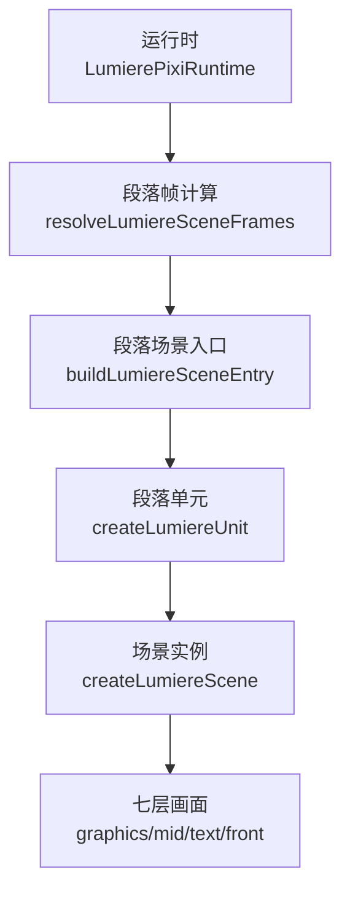
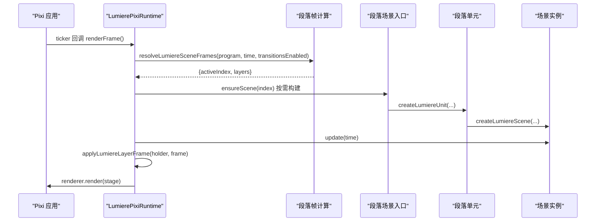
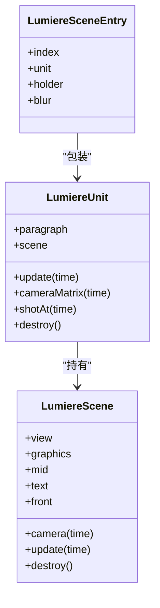
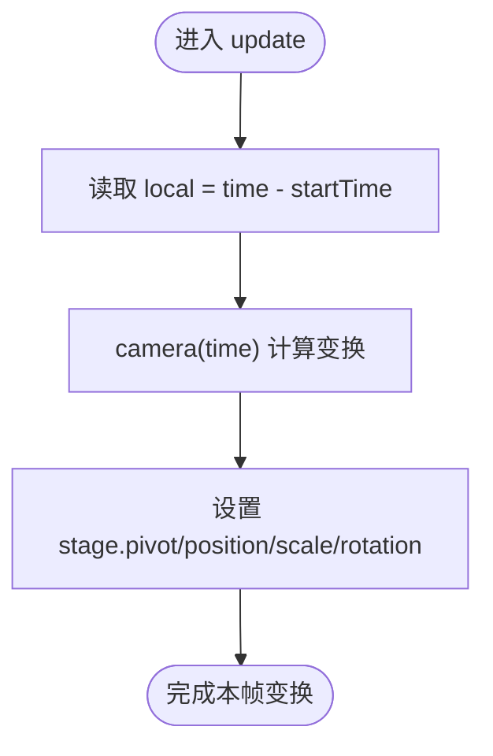
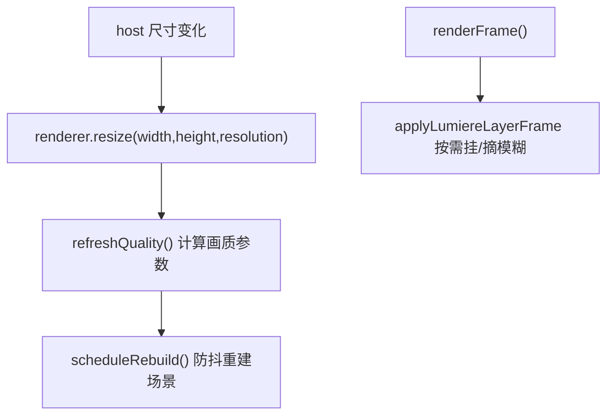
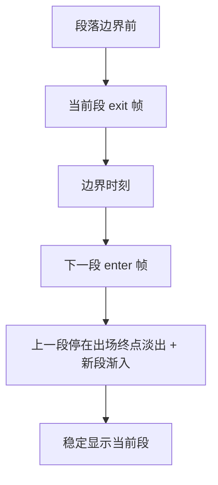
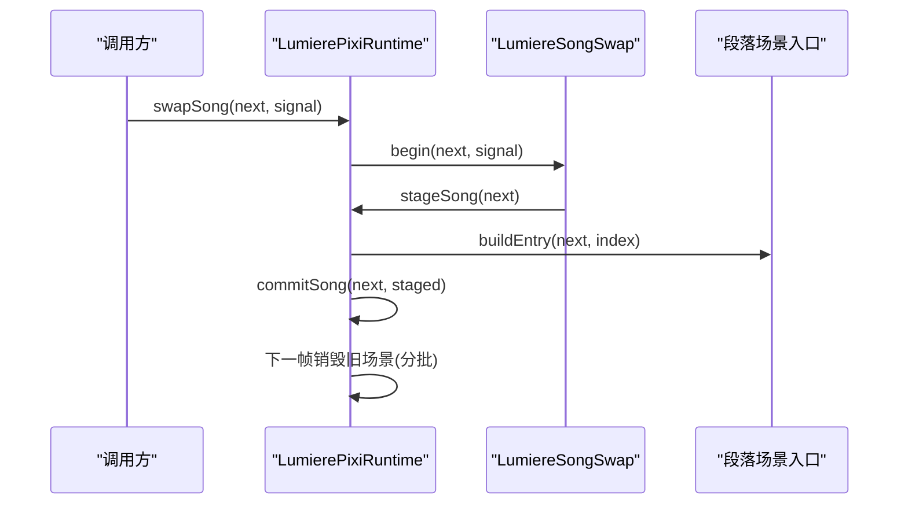
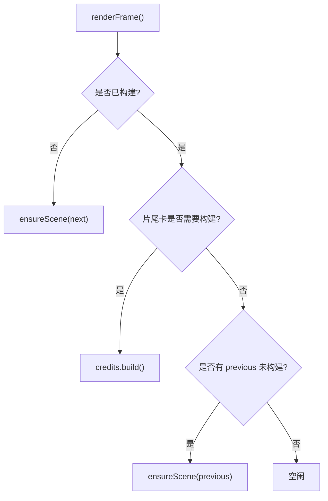
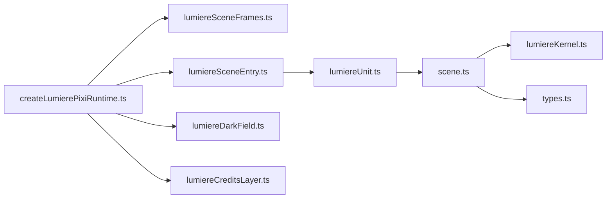

# 场景管理

<cite>
**本文引用的文件**   
- [scene.ts](file://src/components/visualizer/lumiere/scene.ts)
- [lumiereUnit.ts](file://src/components/visualizer/lumiere/lumiereUnit.ts)
- [createLumierePixiRuntime.ts](file://src/components/visualizer/lumiere/createLumierePixiRuntime.ts)
- [lumiereSceneFrames.ts](file://src/components/visualizer/lumiere/lumiereSceneFrames.ts)
- [lumiereTransitions.ts](file://src/components/visualizer/lumiere/lumiereTransitions.ts)
- [lumiereSceneEntry.ts](file://src/components/visualizer/lumiere/lumiereSceneEntry.ts)
- [types.ts](file://src/components/visualizer/lumiere/types.ts)
</cite>

## 目录
1. [简介](#简介)
2. [项目结构](#项目结构)
3. [核心组件](#核心组件)
4. [架构总览](#架构总览)
5. [详细组件分析](#详细组件分析)
6. [依赖关系分析](#依赖关系分析)
7. [性能与内存特性](#性能与内存特性)
8. [故障排查指南](#故障排查指南)
9. [结论](#结论)
10. [附录：最佳实践与调优清单](#附录最佳实践与调优清单)

## 简介
本文面向 Lumiere 模式的场景管理系统，围绕“场景图结构、帧管理、过渡系统、状态管理、预加载机制”五个维度展开，帮助读者理解从段落到镜头、从光场到文字、从运行时调度到资源清理的完整链路。文档同时给出架构图、类图、时序图与流程图，并附带性能优化与排错建议。

## 项目结构
Lumiere 的场景系统由“运行时 → 段落帧 → 段落入口 → 段落单元 → 场景”分层组织：
- 运行时负责 Pixi 应用、渲染循环、换歌交接、画质与尺寸变化、转场叠加与片尾卡。
- 段落帧根据时间与程序描述决定当前段与前一段的可见层与过渡参数。
- 段落入口为每个段落构建一个可缓存的场景容器，并在运行时挂载到舞台。
- 段落单元把编译后的段落数据转换为场景所需参数（行号映射、熄灯窗口等）。
- 场景负责七层画面结构与每帧更新（光场、线稿、浮尘、星空、歌词窗口、十字爆闪、前景散景），并提供运镜矩阵。

**图表来源**
- [createLumierePixiRuntime.ts:271-339](file://src/components/visualizer/lumiere/createLumierePixiRuntime.ts#L271-L339)
- [lumiereSceneFrames.ts:47-84](file://src/components/visualizer/lumiere/lumiereSceneFrames.ts#L47-L84)
- [lumiereSceneEntry.ts:72-97](file://src/components/visualizer/lumiere/lumiereSceneEntry.ts#L72-L97)
- [lumiereUnit.ts:64-99](file://src/components/visualizer/lumiere/lumiereUnit.ts#L64-L99)
- [scene.ts:194-524](file://src/components/visualizer/lumiere/scene.ts#L194-L524)

**章节来源**
- [createLumierePixiRuntime.ts:32-37](file://src/components/visualizer/lumiere/createLumierePixiRuntime.ts#L32-L37)
- [lumiereSceneFrames.ts:5-13](file://src/components/visualizer/lumiere/lumiereSceneFrames.ts#L5-L13)
- [lumiereSceneEntry.ts:11-14](file://src/components/visualizer/lumiere/lumiereSceneEntry.ts#L11-L14)
- [lumiereUnit.ts:11-15](file://src/components/visualizer/lumiere/lumiereUnit.ts#L11-L15)
- [scene.ts:30-43](file://src/components/visualizer/lumiere/scene.ts#L30-L43)

## 核心组件
- 运行时 LumierePixiRuntime：创建 Pixi Application，维护场景缓存、换歌交接、画质与分辨率、tuning 实时生效与重建防抖、暗场底与片尾卡、音频采样。
- 段落帧 resolveLumiereSceneFrames：纯函数，按时间返回 activeIndex 与 layers（含 alpha/scale/blur）。
- 段落场景入口 buildLumiereSceneEntry：为段落创建 LumiereUnit 与 holder，挂上模糊滤镜与层级 z-index。
- 段落单元 createLumiereUnit：把 LumiereParagraph 转为场景参数（行号映射、熄灯窗口、种子、音频回调等）。
- 场景 createLumiereScene：构建七层容器、光场、线稿、浮尘、星空、歌词窗口、十字爆闪、前景散景；提供 camera/update/destroy。

**章节来源**
- [createLumierePixiRuntime.ts:72-112](file://src/components/visualizer/lumiere/createLumierePixiRuntime.ts#L72-L112)
- [lumiereSceneFrames.ts:24-29](file://src/components/visualizer/lumiere/lumiereSceneFrames.ts#L24-L29)
- [lumiereSceneEntry.ts:16-32](file://src/components/visualizer/lumiere/lumiereSceneEntry.ts#L16-L32)
- [lumiereUnit.ts:17-46](file://src/components/visualizer/lumiere/lumiereUnit.ts#L17-L46)
- [scene.ts:84-99](file://src/components/visualizer/lumiere/scene.ts#L84-L99)

## 架构总览
下图展示运行时在每帧如何驱动场景更新、过渡叠加与资源回收。

**图表来源**
- [createLumierePixiRuntime.ts:271-339](file://src/components/visualizer/lumiere/createLumierePixiRuntime.ts#L271-L339)
- [lumiereSceneFrames.ts:47-84](file://src/components/visualizer/lumiere/lumiereSceneFrames.ts#L47-L84)
- [lumiereSceneEntry.ts:72-97](file://src/components/visualizer/lumiere/lumiereSceneEntry.ts#L72-L97)
- [lumiereUnit.ts:64-99](file://src/components/visualizer/lumiere/lumiereUnit.ts#L64-L99)
- [scene.ts:384-494](file://src/components/visualizer/lumiere/scene.ts#L384-L494)

## 详细组件分析

### 场景图结构与渲染顺序
- 容器层次：view 包含 stage，stage 下按序挂载 graphics（图形组）、mid（素材插入层）、text（文字组）、front（前景）。
- 图形组内部顺序：光场（烟雾+体积光+眩光）→ 背景歌词碎片 → 星空 → 线稿 → 主题图标 → 浮尘。
- 文字组内部顺序：十字爆闪 → 歌词窗口（字、径迹、光晕、闪点）。
- 前景：可选的前景散景。
- 运行期只读 scene.view，不直接修改其变换；运行时通过 holder 套转场缩放/模糊，避免与场景内部的 camera 冲突。

**图表来源**
- [scene.ts:84-99](file://src/components/visualizer/lumiere/scene.ts#L84-L99)
- [lumiereUnit.ts:34-46](file://src/components/visualizer/lumiere/lumiereUnit.ts#L34-L46)
- [lumiereSceneEntry.ts:16-22](file://src/components/visualizer/lumiere/lumiereSceneEntry.ts#L16-L22)

**章节来源**
- [scene.ts:205-347](file://src/components/visualizer/lumiere/scene.ts#L205-L347)
- [lumiereSceneEntry.ts:91-97](file://src/components/visualizer/lumiere/lumiereSceneEntry.ts#L91-L97)

### 变换系统与运镜
- 场景内部维护 rest 与 camera(time)，stage 的 pivot/position/scale/rotation 由 camera 决定。
- 单元对外暴露 cameraMatrix(time)，用于其他图层跟随场景运镜（例如叠加层或外部容器）。
- 运镜基于领头光位的 camera 配置，支持轨迹过渡分段往返推拉与手持浮动。

**图表来源**
- [scene.ts:367-399](file://src/components/visualizer/lumiere/scene.ts#L367-L399)
- [lumiereUnit.ts:94-96](file://src/components/visualizer/lumiere/lumiereUnit.ts#L94-L96)

**章节来源**
- [scene.ts:367-399](file://src/components/visualizer/lumiere/scene.ts#L367-L399)
- [lumiereUnit.ts:38-46](file://src/components/visualizer/lumiere/lumiereUnit.ts#L38-L46)

### 场景帧管理与离屏渲染
- 帧选择：resolveLumiereSceneFrames 返回 activeIndex 与 layers（通常一层，边界处两层）。
- 离屏模糊：当需要转场模糊时，运行时为 holder 挂 BlurFilter，并使用半分辨率降低开销。
- 画质控制：运行时统一计算 graphicsResolution 与 bloomLevelDrop，应用到所有场景与片尾卡。
- 尺寸变化：ResizeObserver 触发 renderer.resize，随后防抖重建场景。

**图表来源**
- [createLumierePixiRuntime.ts:161-189](file://src/components/visualizer/lumiere/createLumierePixiRuntime.ts#L161-L189)
- [createLumierePixiRuntime.ts:191-213](file://src/components/visualizer/lumiere/createLumierePixiRuntime.ts#L191-L213)
- [lumiereSceneEntry.ts:99-118](file://src/components/visualizer/lumiere/lumiereSceneEntry.ts#L99-L118)

**章节来源**
- [createLumierePixiRuntime.ts:161-213](file://src/components/visualizer/lumiere/createLumierePixiRuntime.ts#L161-L213)
- [lumiereSceneEntry.ts:48-69](file://src/components/visualizer/lumiere/lumiereSceneEntry.ts#L48-L69)

### 场景过渡系统
- 三种转场：熄灯 lights-out、闪白 flare-cut、拉焦 focus-pull。
- 出场阶段：对当前段落容器套用 exit 帧；熄灯时场景自身 fadeOut 收光，外层保持透明度为 1。
- 进场阶段：边界后 enterDuration 秒内对新段落套用 enter 帧，并与停在出场终点的上一段交叉渐变。
- 运行时将 transitionOut 的 kind 与时间窗传给段落帧计算，再套到 holder 的 alpha/scale/blur。

**图表来源**
- [lumiereTransitions.ts:38-54](file://src/components/visualizer/lumiere/lumiereTransitions.ts#L38-L54)
- [lumiereSceneFrames.ts:36-84](file://src/components/visualizer/lumiere/lumiereSceneFrames.ts#L36-L84)
- [scene.ts:391-393](file://src/components/visualizer/lumiere/scene.ts#L391-L393)

**章节来源**
- [lumiereTransitions.ts:5-11](file://src/components/visualizer/lumiere/lumiereTransitions.ts#L5-L11)
- [lumiereSceneFrames.ts:5-13](file://src/components/visualizer/lumiere/lumiereSceneFrames.ts#L5-L13)
- [lumiereSceneFrames.ts:47-84](file://src/components/visualizer/lumiere/lumiereSceneFrames.ts#L47-L84)

### 场景状态管理（暂停/恢复、内存与资源清理）
- 暂停/恢复：setPaused 停止/启动 ticker，并在暂停时仍渲染一帧以维持画面。
- 换歌交接：swapSong 先离屏构建新歌当前段，第二帧切换，旧场景分帧销毁。
- 资源清理：destroy 释放动画、观察者、锚点、场景、片尾卡、暗场、overlay、纹理与过滤器。
- 场景销毁：destroyLumiereSceneEntry 移除 holder、摘除共享 passthrough、销毁 unit 与 holder。

**图表来源**
- [createLumierePixiRuntime.ts:364-407](file://src/components/visualizer/lumiere/createLumierePixiRuntime.ts#L364-L407)
- [lumiereSceneEntry.ts:120-130](file://src/components/visualizer/lumiere/lumiereSceneEntry.ts#L120-L130)
- [createLumierePixiRuntime.ts:472-495](file://src/components/visualizer/lumiere/createLumierePixiRuntime.ts#L472-L495)

**章节来源**
- [createLumierePixiRuntime.ts:461-495](file://src/components/visualizer/lumiere/createLumierePixiRuntime.ts#L461-L495)
- [lumiereSceneEntry.ts:120-130](file://src/components/visualizer/lumiere/lumiereSceneEntry.ts#L120-L130)

### 场景预加载机制（资源池、缓存策略与并发控制）
- 资源池：LightSprites 由运行时创建并全局复用，场景与片尾卡共享。
- 缓存策略：sceneCache 以段落索引为键，保留当前段 ±1 的场景；pruneScenes 清理远端场景。
- 并发控制：一帧只做一件贵的事（销毁旧场景 > 预建下一段 > 片尾卡构建 > 预建上一段），避免峰值卡顿。
- 换歌预构建：stageSong 在离屏构建新歌当前段，commitSong 后替换缓存并清空旧缓存。

**图表来源**
- [createLumierePixiRuntime.ts:271-317](file://src/components/visualizer/lumiere/createLumierePixiRuntime.ts#L271-L317)
- [createLumierePixiRuntime.ts:228-251](file://src/components/visualizer/lumiere/createLumierePixiRuntime.ts#L228-L251)
- [createLumierePixiRuntime.ts:381-407](file://src/components/visualizer/lumiere/createLumierePixiRuntime.ts#L381-L407)

**章节来源**
- [createLumierePixiRuntime.ts:228-317](file://src/components/visualizer/lumiere/createLumierePixiRuntime.ts#L228-L317)
- [createLumierePixiRuntime.ts:381-407](file://src/components/visualizer/lumiere/createLumierePixiRuntime.ts#L381-L407)

## 依赖关系分析
- 运行时依赖：pixi.js、音频采样、段落帧计算、段落场景入口、暗场层、片尾卡、光点纹理、覆盖层。
- 段落单元依赖：catalog/profile、kernel、scene、program、WindowTypography。
- 场景依赖：lightFieldShader、crossBurst、motes、starfall、lineArt、lyricWindow、keywordColors、lumiereUnitLayout、types。

**图表来源**
- [createLumierePixiRuntime.ts:1-30](file://src/components/visualizer/lumiere/createLumierePixiRuntime.ts#L1-L30)
- [lumiereSceneEntry.ts:1-10](file://src/components/visualizer/lumiere/lumiereSceneEntry.ts#L1-L10)
- [lumiereUnit.ts:1-10](file://src/components/visualizer/lumiere/lumiereUnit.ts#L1-L10)
- [scene.ts:1-23](file://src/components/visualizer/lumiere/scene.ts#L1-L23)

**章节来源**
- [createLumierePixiRuntime.ts:1-30](file://src/components/visualizer/lumiere/createLumierePixiRuntime.ts#L1-L30)
- [lumiereSceneEntry.ts:1-10](file://src/components/visualizer/lumiere/lumiereSceneEntry.ts#L1-L10)
- [lumiereUnit.ts:1-10](file://src/components/visualizer/lumiere/lumiereUnit.ts#L1-L10)
- [scene.ts:1-23](file://src/components/visualizer/lumiere/scene.ts#L1-L23)

## 性能与内存特性
- WebGL 强制：非 WebGL 环境直接抛错，确保光场与 bloom 可用。
- 分辨率与画质：按 devicePixelRatio 与用户画质档计算 graphicsResolution 与 bloomLevelDrop，降低主路径开销。
- Bloom 分组：图形组与文字组分别处理，文字组 filterArea 固定以避免抖动。
- 文本模式 textOnly：关闭图形组绘制与更新，仅计算光束影响字明暗，显著降成本。
- 模糊优化：仅在 blur > BLUR_EPSILON 时挂 BlurFilter，并使用半分辨率。
- 场景裁剪：pruneScenes 仅保留当前段 ±1，减少 GPU/CPU 占用。
- 抖动与重建：尺寸变化与 tuning 变更走 scheduleRebuild 防抖，避免拖动滑块时每帧重建。
- 音频响应：低频推光束亮度、高频推浮尘闪烁、整体响度推烟雾浓度，但上限封顶避免过载。

[本节为通用性能讨论，无需具体文件引用]

## 故障排查指南
- 无法初始化：检查 WebGL 支持；若不支持会抛出错误。
- 画面异常黑/亮：确认暗场强度 darkField 与主题对比；熄灯转场时场景自身 fadeOut 生效，外层不压透明度。
- 字幕抖动：确认文字组 bloom 的 filterArea 是否固定；textOnly 模式下应关闭图形组。
- 卡顿：检查是否频繁重建场景（尺寸/tuning 变化）；确认一帧只做一件贵事；评估 bloom 级别与模糊强度。
- 内存泄漏：确保 destroy 被调用；检查 sceneCache 与 retired 列表是否清空；确认 LightSprites 与 passthrough 被释放。

**章节来源**
- [createLumierePixiRuntime.ts:134-137](file://src/components/visualizer/lumiere/createLumierePixiRuntime.ts#L134-L137)
- [scene.ts:349-362](file://src/components/visualizer/lumiere/scene.ts#L349-L362)
- [lumiereSceneEntry.ts:48-69](file://src/components/visualizer/lumiere/lumiereSceneEntry.ts#L48-L69)
- [createLumierePixiRuntime.ts:472-495](file://src/components/visualizer/lumiere/createLumierePixiRuntime.ts#L472-L495)

## 结论
Lumiere 的场景系统以“运行时调度 + 段落帧计算 + 段落单元封装 + 场景实例化”的分层架构实现高内聚、低耦合的画面管线。通过严格的帧级控制、离屏模糊与画质分级、以及稳健的资源生命周期管理，系统在复杂视觉需求下仍能保持稳定与流畅。配合本文的最佳实践与调优清单，可在不同设备与主题下获得一致的体验。

[本节为总结性内容，无需具体文件引用]

## 附录：最佳实践与调优清单
- 设计场景
  - 使用合理的段落长度与镜头数量，避免过密切换导致频繁重建。
  - 合理设置 burst 密度与 size，避免过多十字爆闪叠加造成峰值。
  - 控制 lineArt 与 themeIcons 开关，必要时关闭以提升性能。
- 运行时调参
  - 调整 audioResponse、fogDensity、moteAmount 平衡音乐响应与性能。
  - 在高负载设备上降低 bloom 与 fogOctaves，启用 textOnly 仅显示歌词。
  - 谨慎使用 overlayFrame 与 trails，它们会增加额外绘制。
- 内存与资源
  - 确保在宿主卸载时调用 destroy，释放 sprites、passthrough、app。
  - 避免长时间持有大量场景缓存；利用 pruneScenes 自动清理。
  - 换歌时使用 swapSong，让交接过程平滑且分帧释放。
- 调试与观测
  - 使用 burstTimes 与 lineAnchor 辅助定位关键帧与对齐问题。
  - 观察 sceneCache 大小与 retired 队列，确认无滞留对象。
  - 在尺寸变化频繁的场景中，验证 rebuild 防抖是否生效。

[本节为通用指导，无需具体文件引用]