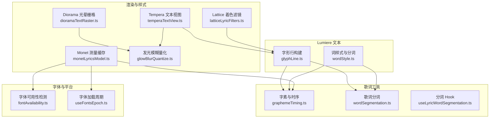
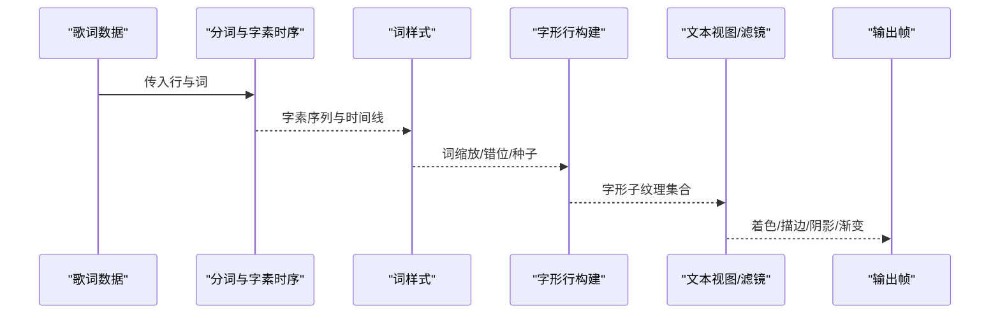
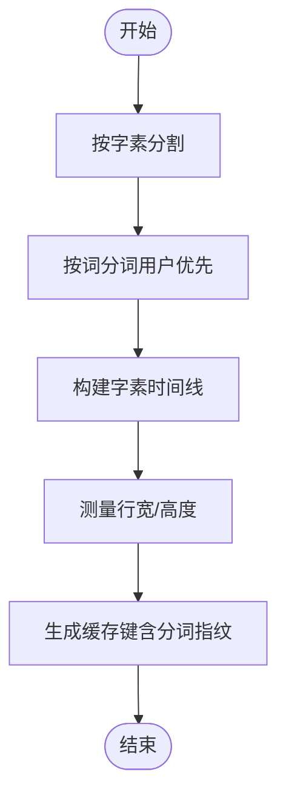
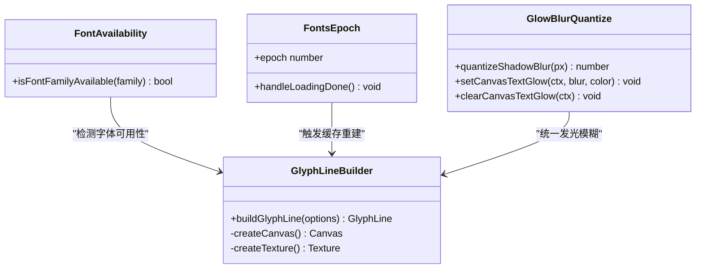
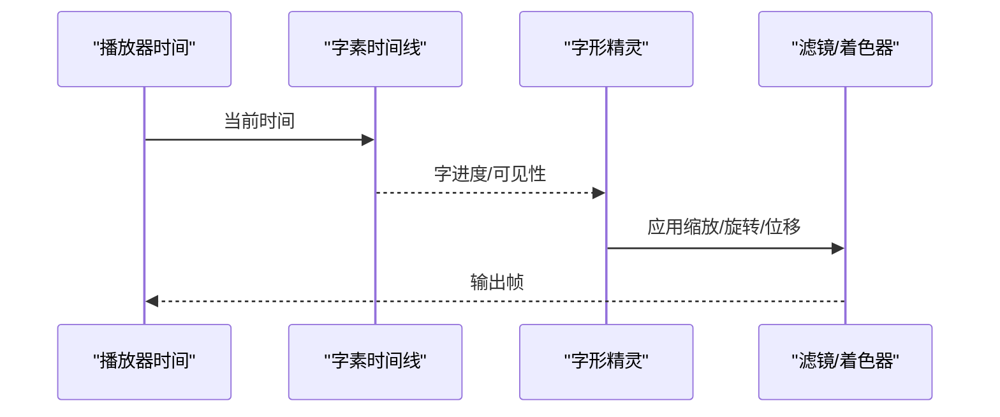
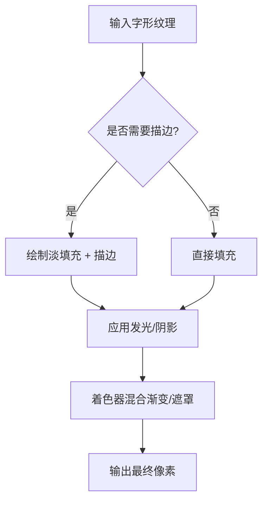
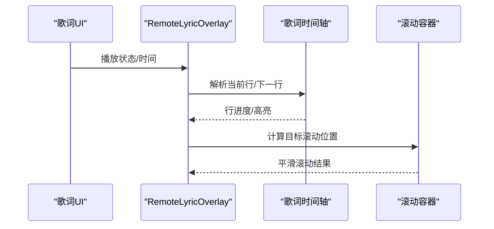
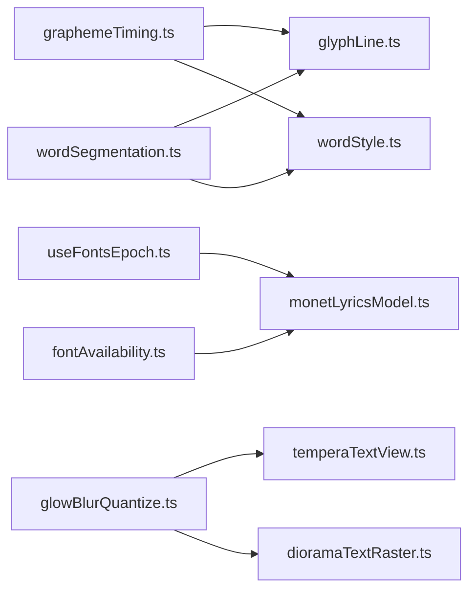

# 文本系统

<cite>
**本文引用的文件**   
- [glyphLine.ts](file://src/components/visualizer/lumiere/text/glyphLine.ts)
- [wordStyle.ts](file://src/components/visualizer/lumiere/text/wordStyle.ts)
- [graphemeTiming.ts](file://src/utils/lyrics/graphemeTiming.ts)
- [wordSegmentation.ts](file://src/utils/lyrics/wordSegmentation.ts)
- [useLyricWordSegmentation.ts](file://src/hooks/useLyricWordSegmentation.ts)
- [temperaTextView.ts](file://src/components/visualizer/tempera/temperaTextView.ts)
- [monetLyricsModel.ts](file://src/components/visualizer/monet/monetLyricsModel.ts)
- [useFontsEpoch.ts](file://src/hooks/useFontsEpoch.ts)
- [fontAvailability.ts](file://src/utils/fontAvailability.ts)
- [glowBlurQuantize.ts](file://src/utils/glowBlurQuantize.ts)
- [dioramaTextRaster.ts](file://src/components/visualizer/diorama/dioramaTextRaster.ts)
- [latticeLyricFilters.ts](file://src/components/app/lattice/lyrics/latticeLyricFilters.ts)
- [RemoteLyricOverlay.tsx](file://src/components/remote/RemoteLyricOverlay.tsx)
- [LyricsTimelineModal.tsx](file://src/components/modal/LyricsTimelineModal.tsx)
</cite>

## 目录
1. [简介](#简介)
2. [项目结构](#项目结构)
3. [核心组件](#核心组件)
4. [架构总览](#架构总览)
5. [详细组件分析](#详细组件分析)
6. [依赖关系分析](#依赖关系分析)
7. [性能考虑](#性能考虑)
8. [故障排查指南](#故障排查指南)
9. [结论](#结论)

## 简介
本文面向 Lumiere 模式的文本系统，系统性梳理其文本布局引擎、字体渲染管线、动画与样式能力、歌词同步机制以及性能优化策略。文档从代码级实现出发，解释文字测量、换行与多语言支持；说明字体加载、字形缓存与抗锯齿处理；阐述逐字显示、波浪与粒子化等动画思路；并给出颜色渐变、描边与阴影的渲染方案。最后覆盖歌词时间轴对齐、高亮与滚动控制，以及多分辨率适配与性能调优建议。

## 项目结构
Lumiere 文本子系统围绕“词粒度排版 + 字形纹理切片”展开：先按词切分，再为整行生成一张高分辨率画布纹理，随后按字形边界切割出子纹理，供 GPU 侧进行独立变换与着色。相关工具层提供多语言分词、字素时序、字体可用性与发光模糊量化等能力。

**图表来源**
- [glyphLine.ts:51-153](file://src/components/visualizer/lumiere/text/glyphLine.ts#L51-L153)
- [wordStyle.ts:28-82](file://src/components/visualizer/lumiere/text/wordStyle.ts#L28-L82)
- [graphemeTiming.ts:17-154](file://src/utils/lyrics/graphemeTiming.ts#L17-L154)
- [wordSegmentation.ts:25-107](file://src/utils/lyrics/wordSegmentation.ts#L25-L107)
- [temperaTextView.ts:30-89](file://src/components/visualizer/tempera/temperaTextView.ts#L30-L89)
- [monetLyricsModel.ts:237-269](file://src/components/visualizer/monet/monetLyricsModel.ts#L237-L269)
- [dioramaTextRaster.ts:65-91](file://src/components/visualizer/diorama/dioramaTextRaster.ts#L65-L91)
- [glowBlurQuantize.ts:47-84](file://src/utils/glowBlurQuantize.ts#L47-L84)
- [latticeLyricFilters.ts:68-88](file://src/components/app/lattice/lyrics/latticeLyricFilters.ts#L68-L88)
- [fontAvailability.ts:32-55](file://src/utils/fontAvailability.ts#L32-L55)
- [useFontsEpoch.ts:27-60](file://src/hooks/useFontsEpoch.ts#L27-L60)

**章节来源**
- [glyphLine.ts:51-153](file://src/components/visualizer/lumiere/text/glyphLine.ts#L51-L153)
- [wordStyle.ts:28-82](file://src/components/visualizer/lumiere/text/wordStyle.ts#L28-L82)
- [graphemeTiming.ts:17-154](file://src/utils/lyrics/graphemeTiming.ts#L17-L154)
- [wordSegmentation.ts:25-107](file://src/utils/lyrics/wordSegmentation.ts#L25-L107)

## 核心组件
- 字形行构建器：将一行歌词绘制到单张画布纹理，并按字素边界切分为多个子纹理，支持字距、空心描边、DPI 自适应与显存回收。
- 词样式与分词：基于用户保存的分词或 Intl.Segmenter 进行词粒度切分，计算词级字号倍率与错位，支撑横竖过渡时的整体移动与内部重排。
- 字素与时序：使用 Intl.Segmenter 拆分字素，构建词内字素时间线，并将词级时间映射回完整行，保留空白与标点。
- 歌词分词工具：统一分词入口，优先使用用户保存的分词边界，否则回退到 Intl.Segmenter，并提供有效性校验与指纹键。
- 字体与测量：提供字体可用性探测、字体加载生命周期钩子，以及 Monet 模式下的垂直度量与字素偏移缓存清理。
- 文本视图与样式：Tempera 文本视图按放置信息创建 Pixi Text，支持多层（回声、关键词）与阴影；Diorama 通过离屏阴影叠加生成纯光晕；Lattice 使用着色器实现前向遮罩、渐变与混合。
- 发光与模糊：提供 Canvas 阴影与 CSS drop-shadow 的统一量化接口，避免频繁抖动半径导致的缓存失效。

**章节来源**
- [glyphLine.ts:51-153](file://src/components/visualizer/lumiere/text/glyphLine.ts#L51-L153)
- [wordStyle.ts:28-82](file://src/components/visualizer/lumiere/text/wordStyle.ts#L28-L82)
- [graphemeTiming.ts:17-154](file://src/utils/lyrics/graphemeTiming.ts#L17-L154)
- [wordSegmentation.ts:25-107](file://src/utils/lyrics/wordSegmentation.ts#L25-L107)
- [temperaTextView.ts:30-89](file://src/components/visualizer/tempera/temperaTextView.ts#L30-L89)
- [monetLyricsModel.ts:237-269](file://src/components/visualizer/monet/monetLyricsModel.ts#L237-L269)
- [dioramaTextRaster.ts:65-91](file://src/components/visualizer/diorama/dioramaTextRaster.ts#L65-L91)
- [glowBlurQuantize.ts:47-84](file://src/utils/glowBlurQuantize.ts#L47-L84)
- [latticeLyricFilters.ts:68-88](file://src/components/app/lattice/lyrics/latticeLyricFilters.ts#L68-L88)

## 架构总览
Lumiere 文本系统的渲染流程如下：歌词数据经分词与字素时序处理后，由词样式模块计算词级缩放与错位；字形行构建器将整行绘制为高分辨率纹理并按字素切分；GPU 侧对每个字形精灵应用变换、着色与特效；样式层通过滤镜与着色器完成渐变、描边与阴影效果。

**图表来源**
- [graphemeTiming.ts:85-154](file://src/utils/lyrics/graphemeTiming.ts#L85-L154)
- [wordSegmentation.ts:100-107](file://src/utils/lyrics/wordSegmentation.ts#L100-L107)
- [wordStyle.ts:28-82](file://src/components/visualizer/lumiere/text/wordStyle.ts#L28-L82)
- [glyphLine.ts:51-153](file://src/components/visualizer/lumiere/text/glyphLine.ts#L51-L153)
- [temperaTextView.ts:54-89](file://src/components/visualizer/tempera/temperaTextView.ts#L54-L89)
- [latticeLyricFilters.ts:68-88](file://src/components/app/lattice/lyrics/latticeLyricFilters.ts#L68-L88)

## 详细组件分析

### 文本布局引擎：文字测量、换行与多语言支持
- 字素分割：优先使用 Intl.Segmenter 的 grapheme 粒度，回退到字符串迭代，保证多语言组合字符的正确切分。
- 词粒度分词：统一入口优先采用用户保存的分词边界，否则使用 Intl.Segmenter 的 word 粒度；提供边界有效性校验与指纹键，确保缓存稳定。
- 字素时序：将词级时间映射到完整行的字素序列，保留空白与标点占位，未命中时均匀分配时间，保证播放进度与视觉一致。
- 换行与宽度测量：在 Monet 模式下通过 prepareWithSegments/layoutWithLines 进行行布局与宽度估算，并在字体加载完成后清理旧缓存，避免 fallback 字体造成的错误度量。

**图表来源**
- [graphemeTiming.ts:17-49](file://src/utils/lyrics/graphemeTiming.ts#L17-L49)
- [graphemeTiming.ts:85-154](file://src/utils/lyrics/graphemeTiming.ts#L85-L154)
- [wordSegmentation.ts:25-107](file://src/utils/lyrics/wordSegmentation.ts#L25-L107)
- [monetLyricsModel.ts:237-269](file://src/components/visualizer/monet/monetLyricsModel.ts#L237-L269)

**章节来源**
- [graphemeTiming.ts:17-154](file://src/utils/lyrics/graphemeTiming.ts#L17-L154)
- [wordSegmentation.ts:25-107](file://src/utils/lyrics/wordSegmentation.ts#L25-L107)
- [monetLyricsModel.ts:237-269](file://src/components/visualizer/monet/monetLyricsModel.ts#L237-L269)

### 字体渲染系统：字体加载、字形缓存与抗锯齿
- 字体可用性检测：通过 Canvas 2D 对比探针文本在不同字体栈下的宽度，判断目标字体是否可测；在无 DOM/2D 环境返回 true，避免误报。
- 字体加载周期：监听 fonts.loadingdone 与 ready 事件，推进 epoch，触发下游缓存失效与重新测量。
- 字形纹理与 DPI：字形行以逻辑像素为单位绘制，再通过 CanvasSource 设置 resolution，确保高 DPI 下不糊；同时限制最大画布尺寸以避免超出 GPU 纹理上限。
- 字形缓存与回收：Pixi Texture 启用自动垃圾回收，长时间未绘制的行释放显存副本但保留画布；Monet 模式提供垂直度量与字素偏移缓存清理。
- 抗锯齿与发光：发光模糊可量化为整数像素半径，配合 drop-shadow 滤镜匹配 Canvas shadow 行为，减少抖动导致的缓存失效。

**图表来源**
- [fontAvailability.ts:32-55](file://src/utils/fontAvailability.ts#L32-L55)
- [useFontsEpoch.ts:27-60](file://src/hooks/useFontsEpoch.ts#L27-L60)
- [glyphLine.ts:51-153](file://src/components/visualizer/lumiere/text/glyphLine.ts#L51-L153)
- [glowBlurQuantize.ts:47-84](file://src/utils/glowBlurQuantize.ts#L47-L84)

**章节来源**
- [fontAvailability.ts:32-55](file://src/utils/fontAvailability.ts#L32-L55)
- [useFontsEpoch.ts:27-60](file://src/hooks/useFontsEpoch.ts#L27-L60)
- [glyphLine.ts:51-153](file://src/components/visualizer/lumiere/text/glyphLine.ts#L51-L153)
- [glowBlurQuantize.ts:47-84](file://src/utils/glowBlurQuantize.ts#L47-L84)

### 文本动画效果：逐字显示、波浪与粒子化
- 逐字显示：基于字素时间线，按 startTime/endTime 驱动每个字形的可见度与进度，结合词级缩放与错位形成错落节奏。
- 波浪效果：词级错位与随机扰动可在横竖过渡时产生波浪式位移；不同强度配置可调整振幅与旋转范围。
- 粒子化文本：将每个字形作为独立精灵，结合相机运动与滤镜（如模糊、发光）形成粒子化扩散；Diorama 通过离屏阴影叠加生成纯光晕，增强粒子质感。

**图表来源**
- [graphemeTiming.ts:85-154](file://src/utils/lyrics/graphemeTiming.ts#L85-L154)
- [wordStyle.ts:46-82](file://src/components/visualizer/lumiere/text/wordStyle.ts#L46-L82)
- [dioramaTextRaster.ts:65-91](file://src/components/visualizer/diorama/dioramaTextRaster.ts#L65-L91)

**章节来源**
- [graphemeTiming.ts:85-154](file://src/utils/lyrics/graphemeTiming.ts#L85-L154)
- [wordStyle.ts:46-82](file://src/components/visualizer/lumiere/text/wordStyle.ts#L46-L82)
- [dioramaTextRaster.ts:65-91](file://src/components/visualizer/diorama/dioramaTextRaster.ts#L65-L91)

### 文本样式系统：颜色渐变、描边与阴影
- 颜色渐变：Lattice 着色器根据 uProgress/uPassed 与 uVerticalFade 计算前景/背景混合，实现沿行方向与纵向渐隐。
- 描边效果：字形行支持 outline 参数，绘制细描边与淡填充的空心字；Tempera 文本视图可为关键字单独图层，避免反色破坏主题色。
- 阴影渲染：Tempera 使用偏移副本与半透明 alpha 模拟第二版印刷；Diorama 通过多次离屏阴影叠加生成纯光晕；GlowBlurQuantize 统一阴影模糊量化，避免抖动。

**图表来源**
- [glyphLine.ts:94-104](file://src/components/visualizer/lumiere/text/glyphLine.ts#L94-L104)
- [temperaTextView.ts:63-89](file://src/components/visualizer/tempera/temperaTextView.ts#L63-L89)
- [dioramaTextRaster.ts:65-91](file://src/components/visualizer/diorama/dioramaTextRaster.ts#L65-L91)
- [latticeLyricFilters.ts:68-88](file://src/components/app/lattice/lyrics/latticeLyricFilters.ts#L68-L88)

**章节来源**
- [glyphLine.ts:94-104](file://src/components/visualizer/lumiere/text/glyphLine.ts#L94-L104)
- [temperaTextView.ts:63-89](file://src/components/visualizer/tempera/temperaTextView.ts#L63-L89)
- [dioramaTextRaster.ts:65-91](file://src/components/visualizer/diorama/dioramaTextRaster.ts#L65-L91)
- [latticeLyricFilters.ts:68-88](file://src/components/app/lattice/lyrics/latticeLyricFilters.ts#L68-L88)

### 歌词同步机制：时间轴对齐、高亮与滚动控制
- 时间轴对齐：RemoteLyricOverlay 根据播放器状态与时长插值当前时间，更新当前行与下一行，并在播放中平滑滚动；非播放态使用 requestAnimationFrame 驱动。
- 高亮效果：依据最新时间与词/字的 startTime/endTime 计算 charProgress，驱动 UI 高亮与透明度变化。
- 滚动控制：歌词时间轴弹窗在用户交互后恢复自动滚动，居中活动项，避免频繁 scroll 抖动。

**图表来源**
- [RemoteLyricOverlay.tsx:221-310](file://src/components/remote/RemoteLyricOverlay.tsx#L221-L310)
- [LyricsTimelineModal.tsx:103-139](file://src/components/modal/LyricsTimelineModal.tsx#L103-L139)

**章节来源**
- [RemoteLyricOverlay.tsx:221-310](file://src/components/remote/RemoteLyricOverlay.tsx#L221-L310)
- [LyricsTimelineModal.tsx:103-139](file://src/components/modal/LyricsTimelineModal.tsx#L103-L139)

## 依赖关系分析
- 低耦合：字形行构建器仅依赖字素分割与分词工具，不感知上层动画与样式；样式层通过纹理与着色器解耦。
- 关键依赖：
  - glyphLine.ts 依赖 graphemeTiming.ts 与 wordSegmentation.ts。
  - wordStyle.ts 依赖 wordSegmentation.ts 与 graphemeTiming.ts。
  - monetLyricsModel.ts 依赖 useFontsEpoch.ts 与 fontAvailability.ts。
  - temperaTextView.ts 与 dioramaTextRaster.ts 依赖 glowBlurQuantize.ts。
- 潜在循环：无直接循环依赖；所有工具层被可视化层单向引用。

**图表来源**
- [glyphLine.ts:1-10](file://src/components/visualizer/lumiere/text/glyphLine.ts#L1-L10)
- [wordStyle.ts:1-10](file://src/components/visualizer/lumiere/text/wordStyle.ts#L1-L10)
- [monetLyricsModel.ts:237-269](file://src/components/visualizer/monet/monetLyricsModel.ts#L237-L269)
- [temperaTextView.ts:30-89](file://src/components/visualizer/tempera/temperaTextView.ts#L30-L89)
- [dioramaTextRaster.ts:65-91](file://src/components/visualizer/diorama/dioramaTextRaster.ts#L65-L91)

**章节来源**
- [glyphLine.ts:1-10](file://src/components/visualizer/lumiere/text/glyphLine.ts#L1-L10)
- [wordStyle.ts:1-10](file://src/components/visualizer/lumiere/text/wordStyle.ts#L1-L10)
- [monetLyricsModel.ts:237-269](file://src/components/visualizer/monet/monetLyricsModel.ts#L237-L269)
- [temperaTextView.ts:30-89](file://src/components/visualizer/tempera/temperaTextView.ts#L30-L89)
- [dioramaTextRaster.ts:65-91](file://src/components/visualizer/diorama/dioramaTextRaster.ts#L65-L91)

## 性能考虑
- 纹理分辨率与上限：字形行根据 maxCanvasPx 限制分辨率，避免超出 GPU 纹理上限；通过 CanvasSource 的 resolution 属性而非直接赋值宽高，防止画布清空。
- 显存回收：启用 autoGarbageCollect，长时间未绘制的行释放显存副本，降低内存占用。
- 缓存键与失效：Monet 模式在字体 epoch 推进时清理垂直度量与字素偏移缓存，避免 fallback 字体导致的错误度量。
- 发光模糊量化：将阴影模糊半径取整，减少抖动导致的缓存失效；统一 setCanvasTextGlow/clearCanvasTextGlow 管理上下文状态。
- 分词缓存：使用分词指纹键（边界长度拼接）作为布局缓存键，避免重复构建；用户保存分词优先，减少运行时开销。

[本节为通用指导，不直接分析具体文件]

## 故障排查指南
- 字体不可用或度量异常：
  - 检查 isFontFamilyAvailable 返回值，确认目标字体是否可测。
  - 监听字体加载事件，确保 epoch 推进后清理 Monet 测量缓存。
- 字形模糊或糊字：
  - 检查字形行 resolution 与 maxCanvasPx 配置，确保不超过纹理上限。
  - 确认 CanvasSource 的 resolution 设置路径正确，避免画布清空。
- 阴影抖动或性能下降：
  - 开启 glowBlurQuantized，使用 quantizeShadowBlur 统一模糊半径。
  - 使用 setCanvasTextGlow/clearCanvasTextGlow 管理上下文状态，避免残留 filter。
- 歌词滚动卡顿：
  - 检查 RemoteLyricOverlay 的 requestAnimationFrame 循环与滚动目标计算。
  - 确保 LyricsTimelineModal 的用户滚动超时与自动滚动切换逻辑正常。

**章节来源**
- [fontAvailability.ts:32-55](file://src/utils/fontAvailability.ts#L32-L55)
- [useFontsEpoch.ts:27-60](file://src/hooks/useFontsEpoch.ts#L27-L60)
- [glyphLine.ts:85-120](file://src/components/visualizer/lumiere/text/glyphLine.ts#L85-L120)
- [glowBlurQuantize.ts:47-84](file://src/utils/glowBlurQuantize.ts#L47-L84)
- [RemoteLyricOverlay.tsx:221-310](file://src/components/remote/RemoteLyricOverlay.tsx#L221-L310)
- [LyricsTimelineModal.tsx:103-139](file://src/components/modal/LyricsTimelineModal.tsx#L103-L139)

## 结论
Lumiere 文本系统以词粒度排版为核心，结合字素时序与高分辨率字形纹理，实现了高性能、多语言友好的文本渲染。通过统一的字体检测与加载周期、发光模糊量化与纹理回收策略，系统在复杂动画与样式需求下仍保持良好性能。歌词同步机制确保时间轴对齐与滚动体验，配合样式层的渐变、描边与阴影能力，为音乐可视化提供了灵活而稳定的文本基础。