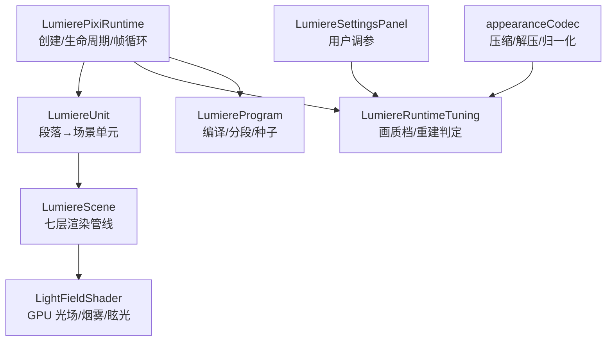
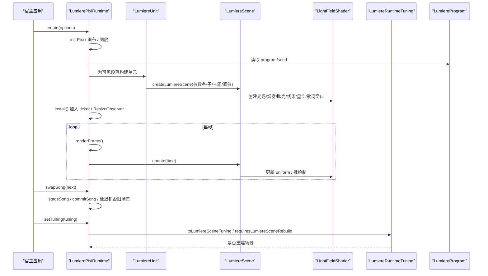
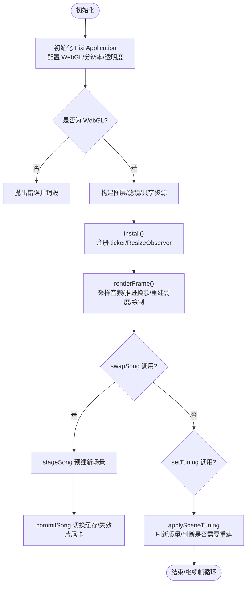
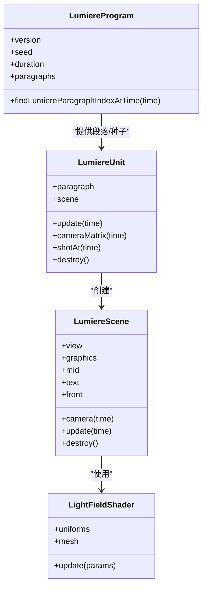
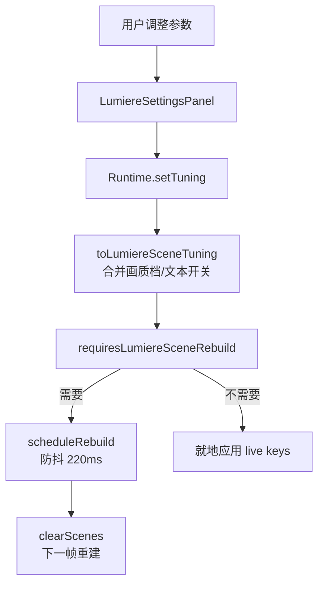
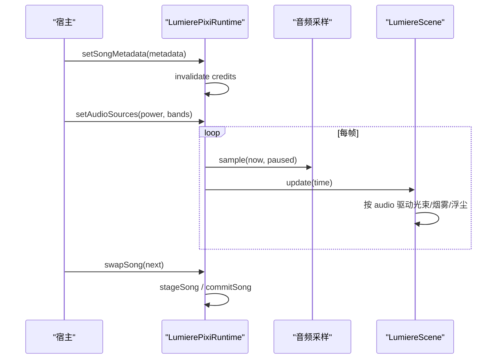
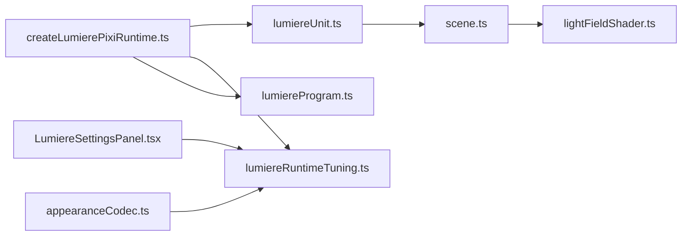

# 核心架构与运行时

<cite>
**本文引用的文件**   
- [createLumierePixiRuntime.ts](file://src/components/visualizer/lumiere/createLumierePixiRuntime.ts)
- [lumiereUnit.ts](file://src/components/visualizer/lumiere/lumiereUnit.ts)
- [scene.ts](file://src/components/visualizer/lumiere/scene.ts)
- [lumiereRuntimeTuning.ts](file://src/components/visualizer/lumiere/lumiereRuntimeTuning.ts)
- [lightFieldShader.ts](file://src/components/visualizer/lumiere/light/lightFieldShader.ts)
- [lumiereProgram.ts](file://src/components/visualizer/lumiere/lumiereProgram.ts)
- [tuning.ts](file://src/components/visualizer/lumiere/tuning.ts)
- [LumiereSettingsPanel.tsx](file://src/components/visualizer/lumiere/LumiereSettingsPanel.tsx)
- [appearanceCodec.ts](file://src/utils/appearanceCodec.ts)
- [lumiereRuntime.test.ts](file://test/unit/visualizer/lumiere/lumiereRuntime.test.ts)
</cite>

## 目录
1. [引言](#引言)
2. [项目结构](#项目结构)
3. [核心组件](#核心组件)
4. [架构总览](#架构总览)
5. [详细组件分析](#详细组件分析)
6. [依赖关系分析](#依赖关系分析)
7. [性能考量](#性能考量)
8. [故障排查指南](#故障排查指南)
9. [结论](#结论)
10. [附录：API参考与使用示例](#附录api参考与使用示例)

## 引言
本文件面向 Lumiere 模式的核心架构与运行时，聚焦以下目标：
- 解释 LumierePixiRuntime 的初始化流程、生命周期管理与资源管理机制。
- 说明程序编译系统（场景图构建、着色器编译与 GPU 资源分配）。
- 阐述运行时调优系统（性能参数配置、内存优化策略与渲染管线调优）。
- 解释歌曲上下文管理（元数据处理、歌词同步与状态切换）。
- 提供错误处理机制、调试工具与性能监控方法。
- 给出核心 API 参考与使用示例。

## 项目结构
Lumiere 相关代码集中在可视化器子系统中，关键路径如下：
- 运行时与 Pixi 集成：createLumierePixiRuntime.ts
- 段落到场景单元：lumiereUnit.ts
- 场景与渲染层：scene.ts
- 运行时调优与画质档：lumiereRuntimeTuning.ts
- 光场着色器与 GPU 资源：lightFieldShader.ts
- 程序编译与分段：lumiereProgram.ts
- 设置面板与用户调参入口：LumiereSettingsPanel.tsx
- 类型注入与设置键：tuning.ts
- 序列化/反序列化与默认值归一化：appearanceCodec.ts
- 单元测试覆盖运行时纯逻辑：lumiereRuntime.test.ts

**图表来源**
- [createLumierePixiRuntime.ts:114-171](file://src/components/visualizer/lumiere/createLumierePixiRuntime.ts#L114-L171)
- [lumiereUnit.ts:64-99](file://src/components/visualizer/lumiere/lumiereUnit.ts#L64-L99)
- [scene.ts:194-363](file://src/components/visualizer/lumiere/scene.ts#L194-L363)
- [lumiereRuntimeTuning.ts:32-71](file://src/components/visualizer/lumiere/lumiereRuntimeTuning.ts#L32-L71)
- [lumiereProgram.ts:202-219](file://src/components/visualizer/lumiere/lumiereProgram.ts#L202-L219)
- [LumiereSettingsPanel.tsx:140-176](file://src/components/visualizer/lumiere/LumiereSettingsPanel.tsx#L140-L176)
- [appearanceCodec.ts:514-544](file://src/utils/appearanceCodec.ts#L514-L544)

**章节来源**
- [createLumierePixiRuntime.ts:114-171](file://src/components/visualizer/lumiere/createLumierePixiRuntime.ts#L114-L171)
- [lumiereRuntimeTuning.ts:32-71](file://src/components/visualizer/lumiere/lumiereRuntimeTuning.ts#L32-L71)

## 核心组件
- LumierePixiRuntime：负责 Pixi Application 初始化、画布尺寸与分辨率管理、帧循环调度、场景缓存与回收、换歌交接、调参应用、暂停/恢复、销毁释放。
- LumiereUnit：将编译后的段落转换为场景构建参数，封装镜头选择、运镜矩阵与当前镜头查询。
- LumiereScene：实现七层渲染管线（图形组、素材插入层、文字组、前景），管理 bloom、线稿、浮尘、星空、歌词窗口、关键字与爆闪等。
- LumiereRuntimeTuning：定义画质档、渲染分辨率上限、图形组分辨率与 bloom 降级策略，以及“每帧现读”和“需重建场景”的参数分类。
- LightFieldShader：GPU 光场着色器，统一接收光束、烟雾、眩光、焦散、波浪、护盾等 uniform，驱动体积光与辉光效果。
- LumiereProgram：根据歌词与元数据生成程序（含种子、时长、段落、无缝过渡选项），并提供按时间查找段落索引。
- LumiereSettingsPanel：暴露用户可调参数（文本、主题、性能）并触发运行时 setTuning。
- appearanceCodec：对 Lumiere 调参进行短键压缩/解压与默认值归一化。

**章节来源**
- [createLumierePixiRuntime.ts:72-112](file://src/components/visualizer/lumiere/createLumierePixiRuntime.ts#L72-L112)
- [lumiereUnit.ts:17-46](file://src/components/visualizer/lumiere/lumiereUnit.ts#L17-L46)
- [scene.ts:45-99](file://src/components/visualizer/lumiere/scene.ts#L45-L99)
- [lumiereRuntimeTuning.ts:15-22](file://src/components/visualizer/lumiere/lumiereRuntimeTuning.ts#L15-L22)
- [lightFieldShader.ts:335-357](file://src/components/visualizer/lumiere/light/lightFieldShader.ts#L335-L357)
- [lumiereProgram.ts:202-219](file://src/components/visualizer/lumiere/lumiereProgram.ts#L202-L219)
- [LumiereSettingsPanel.tsx:140-176](file://src/components/visualizer/lumiere/LumiereSettingsPanel.tsx#L140-L176)
- [appearanceCodec.ts:514-544](file://src/utils/appearanceCodec.ts#L514-L544)

## 架构总览
Lumiere 的运行链路从“程序编译”到“运行时渲染”，再到“用户调参与持久化”。

**图表来源**
- [createLumierePixiRuntime.ts:114-171](file://src/components/visualizer/lumiere/createLumierePixiRuntime.ts#L114-L171)
- [createLumierePixiRuntime.ts:271-339](file://src/components/visualizer/lumiere/createLumierePixiRuntime.ts#L271-L339)
- [lumiereUnit.ts:64-99](file://src/components/visualizer/lumiere/lumiereUnit.ts#L64-L99)
- [scene.ts:384-494](file://src/components/visualizer/lumiere/scene.ts#L384-L494)
- [lumiereRuntimeTuning.ts:78-106](file://src/components/visualizer/lumiere/lumiereRuntimeTuning.ts#L78-L106)
- [lumiereProgram.ts:202-219](file://src/components/visualizer/lumiere/lumiereProgram.ts#L202-L219)

## 详细组件分析

### LumierePixiRuntime：初始化、生命周期与资源管理
- 初始化流程
  - 加载 Pixi 模块，创建 Application，计算画布宽高与渲染分辨率，配置 WebGL 偏好与抗锯齿策略。
  - 校验渲染器类型必须为 WebGL，否则抛出错误。
  - 构造运行时实例，创建共享光点纹理、直通 AlphaFilter、暗场层、场景容器、叠加层与片尾卡层，并将它们加入舞台。
  - 安装尺寸监听、帧循环与首次渲染；若处于暂停则不启动 ticker。
- 生命周期
  - install：注册 resizeObserver 与 ticker，必要时单帧渲染一次。
  - destroy：停止 ticker、断开观察者、释放锚点、清理场景缓存与待销毁场景、销毁共享资源与 Pixi Application。
- 资源管理
  - 场景缓存：维护当前段 ±1 的场景，避免频繁重建。
  - 延迟销毁：换歌时将被换下的场景放入 retired 队列，逐帧销毁一个，避免交接帧卡顿。
  - 质量刷新：根据渲染分辨率与画质档计算图形组分辨率与 bloom 降级，应用到所有现存场景与片尾卡。
- 换歌与状态切换
  - swapSong：当 seed 变化且非暂停、已有画面时，进入离屏预建 + 下一帧切换的流程；否则直接替换。
  - stageSong：在离屏容器中预建新歌当前段落场景。
  - commitSong：清空或替换场景缓存，失效片尾卡，必要时重绘画框。
- 调参与显示控制
  - setTuning：就地更新 sceneTuning，必要时防抖重建场景；影响 overlay 时重绘画框。
  - setShowText：批量切换场景内 text.visible，并重新应用 sceneTuning。
  - setStaticMode/setPaused：分别控制静态模式与运行/暂停状态。
  - setAudioSources/setSongMetadata：更新音频源与歌词元数据，触发片尾卡失效与必要渲染。

**图表来源**
- [createLumierePixiRuntime.ts:114-171](file://src/components/visualizer/lumiere/createLumierePixiRuntime.ts#L114-L171)
- [createLumierePixiRuntime.ts:271-339](file://src/components/visualizer/lumiere/createLumierePixiRuntime.ts#L271-L339)
- [createLumierePixiRuntime.ts:364-407](file://src/components/visualizer/lumiere/createLumierePixiRuntime.ts#L364-L407)
- [createLumierePixiRuntime.ts:409-440](file://src/components/visualizer/lumiere/createLumierePixiRuntime.ts#L409-L440)

**章节来源**
- [createLumierePixiRuntime.ts:114-171](file://src/components/visualizer/lumiere/createLumierePixiRuntime.ts#L114-L171)
- [createLumierePixiRuntime.ts:271-339](file://src/components/visualizer/lumiere/createLumierePixiRuntime.ts#L271-L339)
- [createLumierePixiRuntime.ts:364-407](file://src/components/visualizer/lumiere/createLumierePixiRuntime.ts#L364-L407)
- [createLumierePixiRuntime.ts:409-440](file://src/components/visualizer/lumiere/createLumierePixiRuntime.ts#L409-L440)
- [createLumierePixiRuntime.ts:472-495](file://src/components/visualizer/lumiere/createLumierePixiRuntime.ts#L472-L495)

### 程序编译系统：场景图构建、着色器编译与 GPU 资源分配
- 程序编译
  - compileLumiereProgram 输出包含版本、种子、时长、歌词结束时间、段落列表与无缝过渡选项的程序对象。
  - findLumiereParagraphIndexAtTime 支持按播放时间定位段落。
- 段落到场景单元
  - buildLumiereSceneShots 将段落镜头映射到场景镜头，行号转为单元内下标。
  - createLumiereUnit 组装 createLumiereScene 所需参数，包括种子、主题、调参、音频回调、排版与段落范围。
- 场景构建与渲染层
  - createLumiereScene 构建七层容器：图形组（bloom）、素材插入层、文字组（bloom）、前景。
  - 管理 bloom 过滤器、线稿、浮尘、星空、歌词窗口、关键字与十字爆闪。
  - 通过 createLumiereCamera 计算运镜变换，update 中按时间驱动各层。
- 着色器与 GPU 资源
  - lightFieldShader 创建 GLSL 着色器与 Mesh，绑定 uniforms（光束、烟雾、眩光、焦散、波浪、护盾等）。
  - 运行时创建共享光点纹理与直通 filter，场景与片尾卡按需销毁，避免重复分配。

**图表来源**
- [lumiereProgram.ts:202-219](file://src/components/visualizer/lumiere/lumiereProgram.ts#L202-L219)
- [lumiereUnit.ts:48-99](file://src/components/visualizer/lumiere/lumiereUnit.ts#L48-L99)
- [scene.ts:194-363](file://src/components/visualizer/lumiere/scene.ts#L194-L363)
- [lightFieldShader.ts:335-357](file://src/components/visualizer/lumiere/light/lightFieldShader.ts#L335-L357)

**章节来源**
- [lumiereProgram.ts:202-219](file://src/components/visualizer/lumiere/lumiereProgram.ts#L202-L219)
- [lumiereUnit.ts:48-99](file://src/components/visualizer/lumiere/lumiereUnit.ts#L48-L99)
- [scene.ts:194-363](file://src/components/visualizer/lumiere/scene.ts#L194-L363)
- [lightFieldShader.ts:335-357](file://src/components/visualizer/lumiere/light/lightFieldShader.ts#L335-L357)

### 运行时调优系统：性能参数、内存优化与渲染管线调优
- 画质档与分辨率
  - LUMIERE_QUALITY_PROFILES 定义 full/balanced/low 三档，分别控制图形组倍率、雾倍频上限与浮尘倍率。
  - resolveLumiereRenderResolution 限制渲染分辨率上限为 2，避免高 DPI 整屏开销过大。
  - resolveLumiereGraphicsResolution 按画质档降低图形组分辨率，并按纹理池吸附到更小的桶。
  - resolveLumiereBloomLevelDrop 根据图形组降采样比例减少 bloom 级数，保持最小一级纹素宽度一致。
- 场景重建判定
  - LUMIERE_LIVE_SCENE_KEYS 标识每帧现读的字段（如光强、随音乐、烟雾浓度、未唱字透明度、倍频）。
  - requiresLumiereSceneRebuild 判定哪些改动需要重建场景（如浮尘数量、窗口邻居、衰减、回声、线稿、前景散景、轨迹、仅文字、关键字色、主题图标、主题混色、bloom 跨零）。
- 用户界面与设置注入
  - LumiereSettingsPanel 暴露文本、主题与性能分组控件，触发 onLumiereTuningChange。
  - tuning.ts 将 Lumiere 调参注入可视化器设置体系。
  - appearanceCodec 提供短键压缩/解压与默认值归一化，确保存储与传输高效。

**图表来源**
- [lumiereRuntimeTuning.ts:32-71](file://src/components/visualizer/lumiere/lumiereRuntimeTuning.ts#L32-L71)
- [lumiereRuntimeTuning.ts:78-106](file://src/components/visualizer/lumiere/lumiereRuntimeTuning.ts#L78-L106)
- [lumiereRuntimeTuning.ts:108-155](file://src/components/visualizer/lumiere/lumiereRuntimeTuning.ts#L108-L155)
- [LumiereSettingsPanel.tsx:140-176](file://src/components/visualizer/lumiere/LumiereSettingsPanel.tsx#L140-L176)
- [tuning.ts:1-11](file://src/components/visualizer/lumiere/tuning.ts#L1-L11)
- [appearanceCodec.ts:514-544](file://src/utils/appearanceCodec.ts#L514-L544)

**章节来源**
- [lumiereRuntimeTuning.ts:32-71](file://src/components/visualizer/lumiere/lumiereRuntimeTuning.ts#L32-L71)
- [lumiereRuntimeTuning.ts:78-106](file://src/components/visualizer/lumiere/lumiereRuntimeTuning.ts#L78-L106)
- [lumiereRuntimeTuning.ts:108-155](file://src/components/visualizer/lumiere/lumiereRuntimeTuning.ts#L108-L155)
- [LumiereSettingsPanel.tsx:140-176](file://src/components/visualizer/lumiere/LumiereSettingsPanel.tsx#L140-L176)
- [tuning.ts:1-11](file://src/components/visualizer/lumiere/tuning.ts#L1-L11)
- [appearanceCodec.ts:514-544](file://src/utils/appearanceCodec.ts#L514-L544)

### 歌曲上下文管理：元数据处理、歌词同步与状态切换
- 歌曲上下文
  - LumiereSongContext 包含 seed（曲目身份）、program（编译结果）、theme（主题）。
  - LumiereSongMetadata 包含 title/artist/album，用于片尾卡展示。
- 元数据处理
  - setSongMetadata 比较新旧元数据，仅在变化时失效片尾卡并可能触发单帧渲染。
- 歌词同步
  - runtime 每帧采样音频（audioPower/audioBands），scene.update 中按音频特征驱动光束强度、烟雾浓度与浮尘闪烁。
  - 歌词窗口与关键字颜色在 scene.update 中按 beam 与时间更新。
- 状态切换
  - swapSong 在非暂停且有画面时走 staged/commit 流程，保证切歌平滑；同曲替换（seed 不变）直接替换 program/theme。
  - setPaused 控制 ticker 启停与单帧渲染，便于预览与调试。

**图表来源**
- [createLumierePixiRuntime.ts:39-65](file://src/components/visualizer/lumiere/createLumierePixiRuntime.ts#L39-L65)
- [createLumierePixiRuntime.ts:364-407](file://src/components/visualizer/lumiere/createLumierePixiRuntime.ts#L364-L407)
- [createLumierePixiRuntime.ts:448-459](file://src/components/visualizer/lumiere/createLumierePixiRuntime.ts#L448-L459)
- [scene.ts:384-494](file://src/components/visualizer/lumiere/scene.ts#L384-L494)

**章节来源**
- [createLumierePixiRuntime.ts:39-65](file://src/components/visualizer/lumiere/createLumierePixiRuntime.ts#L39-L65)
- [createLumierePixiRuntime.ts:364-407](file://src/components/visualizer/lumiere/createLumierePixiRuntime.ts#L364-L407)
- [createLumierePixiRuntime.ts:448-459](file://src/components/visualizer/lumiere/createLumierePixiRuntime.ts#L448-L459)
- [scene.ts:384-494](file://src/components/visualizer/lumiere/scene.ts#L384-L494)

### 错误处理机制与调试工具
- 错误处理
  - WebGL 不支持时抛出错误并销毁 Application。
  - 创建被中止时抛出 AbortError。
  - 场景重建与画质刷新过程中有防御性检查（destroyed、width=0 等）。
- 调试工具
  - scene.burstTimes 暴露十字爆闪时刻，便于测试与连贯性检查。
  - scene.lineAnchor 提供某一行在指定时间的中心与透明度，便于调试歌词位置。
  - 单元测试覆盖渲染分辨率、bloom 降级、段落转场帧与音频归一化等纯逻辑。

**章节来源**
- [createLumierePixiRuntime.ts:134-157](file://src/components/visualizer/lumiere/createLumierePixiRuntime.ts#L134-L157)
- [scene.ts:84-99](file://src/components/visualizer/lumiere/scene.ts#L84-L99)
- [lumiereRuntime.test.ts:50-70](file://test/unit/visualizer/lumiere/lumiereRuntime.test.ts#L50-L70)
- [lumiereRuntime.test.ts:64-88](file://test/unit/visualizer/lumiere/lumiereRuntime.test.ts#L64-L88)

## 依赖关系分析
- 运行时依赖 Pixi Application、Renderer、Container、Mesh、Shader、Filter 等。
- 场景依赖光场着色器、线稿层、浮尘、星空、歌词窗口、关键字与爆闪。
- 运行时调优依赖画质档与纹理池吸附策略。
- 程序编译依赖歌词结构与元数据，输出段落与种子。
- 设置面板依赖可视化器设置注入与本地化文案。
- 编解码依赖短键映射与默认值归一化。

**图表来源**
- [createLumierePixiRuntime.ts:1-31](file://src/components/visualizer/lumiere/createLumierePixiRuntime.ts#L1-L31)
- [lumiereUnit.ts:1-15](file://src/components/visualizer/lumiere/lumiereUnit.ts#L1-L15)
- [scene.ts:1-23](file://src/components/visualizer/lumiere/scene.ts#L1-L23)
- [lumiereRuntimeTuning.ts:1-5](file://src/components/visualizer/lumiere/lumiereRuntimeTuning.ts#L1-L5)
- [lumiereProgram.ts:202-219](file://src/components/visualizer/lumiere/lumiereProgram.ts#L202-L219)
- [LumiereSettingsPanel.tsx:53-87](file://src/components/visualizer/lumiere/LumiereSettingsPanel.tsx#L53-L87)
- [appearanceCodec.ts:514-544](file://src/utils/appearanceCodec.ts#L514-L544)

**章节来源**
- [createLumierePixiRuntime.ts:1-31](file://src/components/visualizer/lumiere/createLumierePixiRuntime.ts#L1-L31)
- [lumiereUnit.ts:1-15](file://src/components/visualizer/lumiere/lumiereUnit.ts#L1-L15)
- [scene.ts:1-23](file://src/components/visualizer/lumiere/scene.ts#L1-L23)
- [lumiereRuntimeTuning.ts:1-5](file://src/components/visualizer/lumiere/lumiereRuntimeTuning.ts#L1-L5)
- [lumiereProgram.ts:202-219](file://src/components/visualizer/lumiere/lumiereProgram.ts#L202-L219)
- [LumiereSettingsPanel.tsx:53-87](file://src/components/visualizer/lumiere/LumiereSettingsPanel.tsx#L53-L87)
- [appearanceCodec.ts:514-544](file://src/utils/appearanceCodec.ts#L514-L544)

## 性能考量
- 渲染分辨率上限：设备像素比钳制在 1..2，避免 4K/高 DPI 整屏开销。
- 图形组降采样：按画质档降低图形组分辨率，并按纹理池吸附到更小的桶，减少显存与带宽压力。
- Bloom 降级：根据图形组降采样比例减少 bloom 级数，保持最小一级纹素宽度一致，避免视觉抖动。
- 场景重建防抖：尺寸变化或调参导致重建时，使用 220ms 防抖，拖动滑块与窗口缩放时不每帧重建。
- 帧级任务优先级：一帧只做一件贵的事（释放旧场景 → 预建下一段 → 片尾卡 → 预建上一段），避免峰值卡顿。
- 共享资源复用：光点纹理与直通 filter 由运行时持有，场景与片尾卡按需销毁，避免重复分配。
- 仅文字模式：关闭图形组绘制，仅保留 CPU 侧光束计算以驱动字的明暗，显著降低 GPU 负载。

[本节为通用性能指导，无需特定文件引用]

## 故障排查指南
- WebGL 不可用
  - 现象：初始化失败并抛出错误。
  - 排查：确认浏览器/环境支持 WebGL；检查显卡驱动与权限。
- 创建被中止
  - 现象：AbortError。
  - 排查：检查传入的 AbortSignal 是否已中止；确保宿主未在初始化期间取消。
- 场景重建频繁
  - 现象：拖拽窗口或调节参数时卡顿。
  - 排查：确认使用了防抖重建；避免高频变更需重建的参数（如 windowNeighbors、lineArt、textOnly）。
- 歌词错位或模糊
  - 现象：歌词位置异常或 bloom 抖动。
  - 排查：检查 scene.lineAnchor 与 burstTimes；确认 text.filterArea 固定于画面区域，避免每帧包围盒变化。
- 内存泄漏
  - 现象：长时间运行后显存增长。
  - 排查：确保 destroy 被调用；检查 retired 队列是否被清空；确认共享资源（sprites/passthrough）在运行时销毁。

**章节来源**
- [createLumierePixiRuntime.ts:134-157](file://src/components/visualizer/lumiere/createLumierePixiRuntime.ts#L134-L157)
- [createLumierePixiRuntime.ts:472-495](file://src/components/visualizer/lumiere/createLumierePixiRuntime.ts#L472-L495)
- [scene.ts:84-99](file://src/components/visualizer/lumiere/scene.ts#L84-L99)

## 结论
Lumiere 模式通过清晰的职责分离与严格的资源管理，实现了高性能的实时可视化：
- 运行时负责 Pixi 集成、生命周期与资源回收，确保稳定与可预测的性能。
- 编译系统将歌词与元数据转化为程序与段落，为运行时提供稳定的输入。
- 调优系统通过画质档、分辨率与 bloom 降级策略，在视觉效果与性能之间取得平衡。
- 歌曲上下文管理支持平滑换歌与元数据更新，配合音频采样驱动动态效果。
- 错误处理与调试工具为开发与运维提供了可靠的保障。

[本节为总结性内容，无需特定文件引用]

## 附录：API参考与使用示例

### 核心 API 参考
- LumierePixiRuntime.create(options)
  - 作用：创建运行时实例，初始化 Pixi、图层与帧循环。
  - 输入：host、song、tuning、currentTime、audioPower、audioBands、staticMode、showText、paused、metadata、signal。
  - 返回：Promise<LumierePixiRuntime>。
- LumierePixiRuntime.swapSong(next, signal?)
  - 作用：换歌，支持离屏预建与下一帧切换。
- LumierePixiRuntime.setTuning(tuning)
  - 作用：应用用户调参，必要时防抖重建场景。
- LumierePixiRuntime.setShowText(showText)
  - 作用：切换歌词显示，批量更新场景 text.visible。
- LumierePixiRuntime.setStaticMode(staticMode)
  - 作用：切换静态模式。
- LumierePixiRuntime.setAudioSources(audioPower, audioBands)
  - 作用：更新音频源。
- LumierePixiRuntime.setSongMetadata(metadata)
  - 作用：更新歌词元数据。
- LumierePixiRuntime.setPaused(paused)
  - 作用：暂停/恢复运行。
- LumierePixiRuntime.destroy()
  - 作用：释放所有资源并销毁 Pixi Application。

**章节来源**
- [createLumierePixiRuntime.ts:114-171](file://src/components/visualizer/lumiere/createLumierePixiRuntime.ts#L114-L171)
- [createLumierePixiRuntime.ts:364-407](file://src/components/visualizer/lumiere/createLumierePixiRuntime.ts#L364-L407)
- [createLumierePixiRuntime.ts:409-440](file://src/components/visualizer/lumiere/createLumierePixiRuntime.ts#L409-L440)
- [createLumierePixiRuntime.ts:448-459](file://src/components/visualizer/lumiere/createLumierePixiRuntime.ts#L448-L459)
- [createLumierePixiRuntime.ts:461-470](file://src/components/visualizer/lumiere/createLumierePixiRuntime.ts#L461-L470)
- [createLumierePixiRuntime.ts:472-495](file://src/components/visualizer/lumiere/createLumierePixiRuntime.ts#L472-L495)

### 使用示例（步骤式）
- 初始化
  - 准备 host 容器、song（program/seed/theme）、tuning、currentTime、audioPower、audioBands、metadata。
  - 调用 LumierePixiRuntime.create(options)，将 canvas 挂载到 host。
- 播放与更新
  - 每帧更新 currentTime 与音频源。
  - 运行时自动采样音频、更新场景、绘制画面。
- 换歌
  - 调用 swapSong(next)，等待 Promise 完成。
- 调参
  - 调用 setTuning(tuning)，必要时触发重建。
- 销毁
  - 组件卸载时调用 destroy，释放资源。

**章节来源**
- [createLumierePixiRuntime.ts:114-171](file://src/components/visualizer/lumiere/createLumierePixiRuntime.ts#L114-L171)
- [createLumierePixiRuntime.ts:364-407](file://src/components/visualizer/lumiere/createLumierePixiRuntime.ts#L364-L407)
- [createLumierePixiRuntime.ts:409-440](file://src/components/visualizer/lumiere/createLumierePixiRuntime.ts#L409-L440)
- [createLumierePixiRuntime.ts:472-495](file://src/components/visualizer/lumiere/createLumierePixiRuntime.ts#L472-L495)