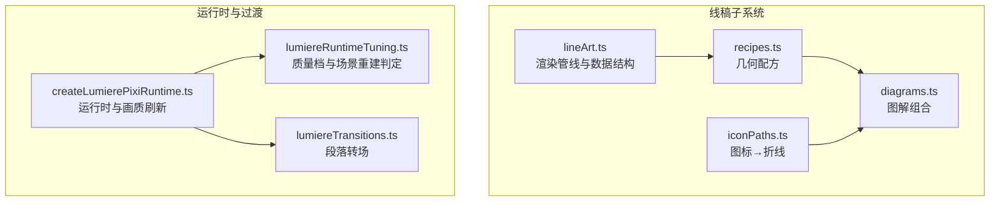
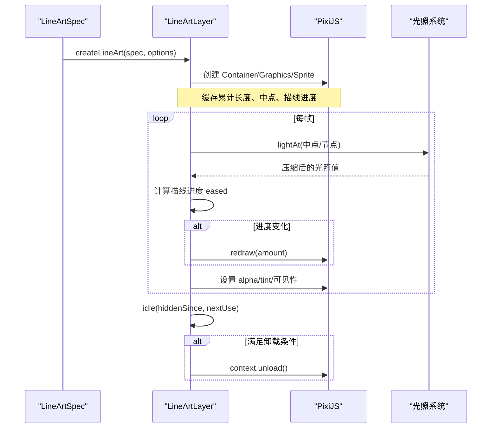
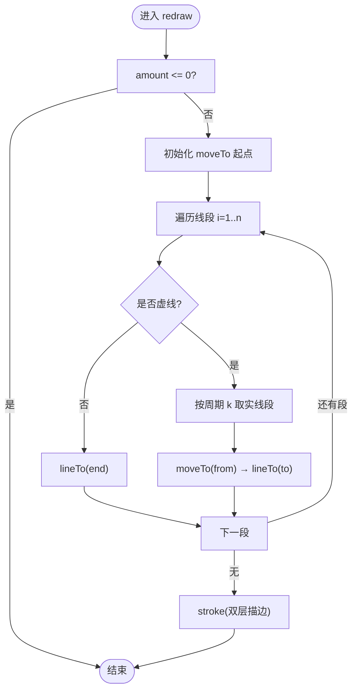
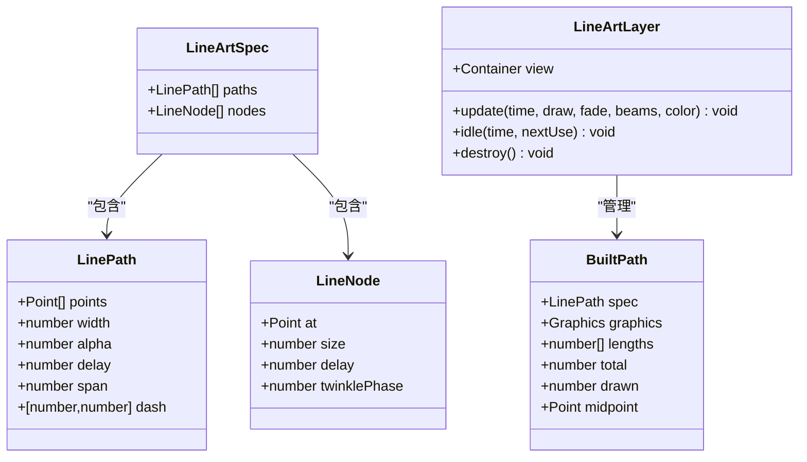
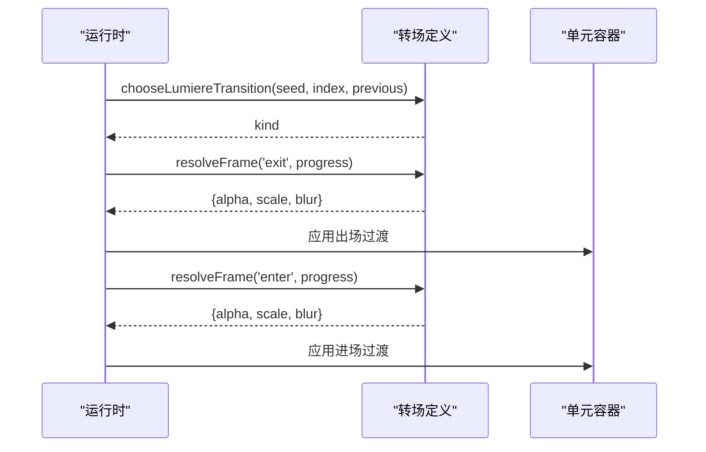
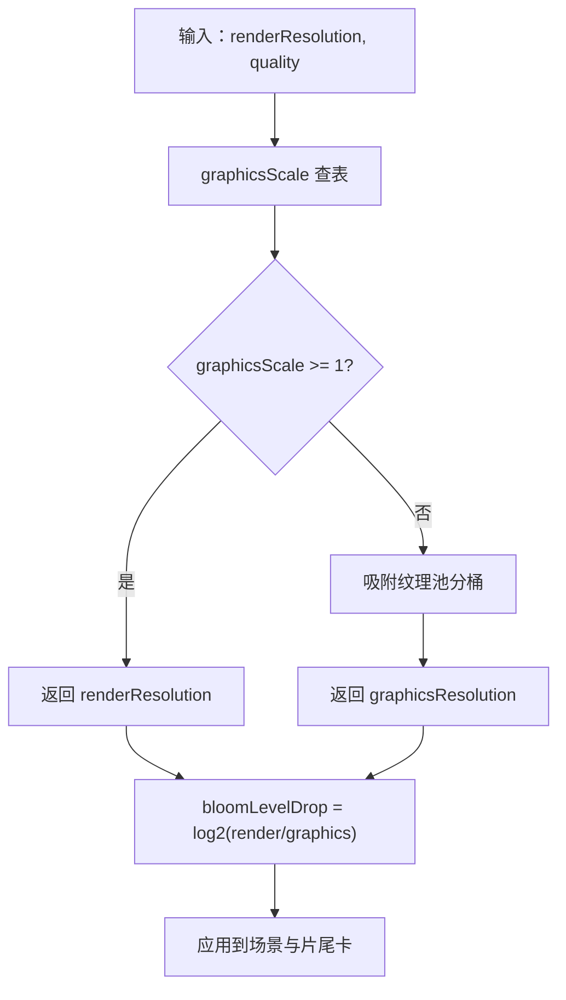
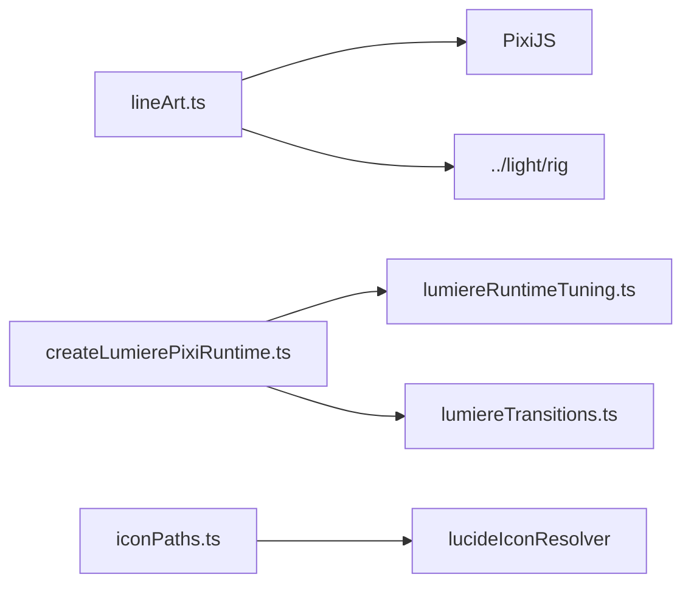

# 线稿系统

<cite>
**本文引用的文件**   
- [lineArt.ts](file://src/components/visualizer/lumiere/lineart/lineArt.ts)
- [recipes.ts](file://src/components/visualizer/lumiere/lineart/recipes.ts)
- [diagrams.ts](file://src/components/visualizer/lumiere/lineart/diagrams.ts)
- [iconPaths.ts](file://src/components/visualizer/lumiere/lineart/iconPaths.ts)
- [lumiereTransitions.ts](file://src/components/visualizer/lumiere/lumiereTransitions.ts)
- [lumiereRuntimeTuning.ts](file://src/components/visualizer/lumiere/lumiereRuntimeTuning.ts)
- [createLumierePixiRuntime.ts](file://src/components/visualizer/lumiere/createLumierePixiRuntime.ts)
</cite>

## 目录
1. [引言](#引言)
2. [项目结构](#项目结构)
3. [核心组件](#核心组件)
4. [架构总览](#架构总览)
5. [详细组件分析](#详细组件分析)
6. [依赖关系分析](#依赖关系分析)
7. [性能与优化](#性能与优化)
8. [故障排查指南](#故障排查指南)
9. [结论](#结论)
10. [附录：自定义线稿效果开发指南](#附录自定义线稿效果开发指南)

## 引言
本技术文档聚焦 Lumiere 模式的线稿子系统，目标是帮助开发者理解并扩展其矢量图形绘制引擎、线条样式系统、图形组合操作、动画与过渡系统，以及渲染优化策略。该子系统以“高度单位坐标”的折线集合为核心，结合 PixiJS 的 Graphics/Sprite 完成描线、虚线、节点闪烁与受光亮度变化；同时通过配方函数与图解函数生成不同风格的几何图元，并通过运行时质量档位控制整体开销。

## 项目结构
线稿系统位于可视化器模块下的 lumiere/lineart 子目录中，主要包含四类职责清晰的实现：
- 渲染管线与数据结构：定义点、路径、节点、规格与图层接口，负责逐帧更新、GPU 数据释放与销毁。
- 几何配方：提供弧、三次贝塞尔、量角器光环、取景框、萌芽、百叶窗、三棱镜、双缝挡板等基础图元的构建函数。
- 图解组合：按族（窗、棱镜、焦散、光路、干涉、植物、天体、舞台）组织更复杂的线稿场景，统一风格与描线节奏。
- 图标转折线：将 Lucide 图标解析为折线，供线稿引擎复用。

**图表来源**
- [lineArt.ts:11-65](file://src/components/visualizer/lumiere/lineart/lineArt.ts#L11-L65)
- [recipes.ts:10-36](file://src/components/visualizer/lumiere/lineart/recipes.ts#L10-L36)
- [diagrams.ts:11-31](file://src/components/visualizer/lumiere/lineart/diagrams.ts#L11-L31)
- [iconPaths.ts:6-17](file://src/components/visualizer/lumiere/lineart/iconPaths.ts#L6-L17)
- [createLumierePixiRuntime.ts:191-203](file://src/components/visualizer/lumiere/createLumierePixiRuntime.ts#L191-L203)
- [lumiereTransitions.ts:5-11](file://src/components/visualizer/lumiere/lumiereTransitions.ts#L5-L11)
- [lumiereRuntimeTuning.ts:7-13](file://src/components/visualizer/lumiere/lumiereRuntimeTuning.ts#L7-L13)

**章节来源**
- [lineArt.ts:11-65](file://src/components/visualizer/lumiere/lineart/lineArt.ts#L11-L65)
- [recipes.ts:10-36](file://src/components/visualizer/lumiere/lineart/recipes.ts#L10-L36)
- [diagrams.ts:11-31](file://src/components/visualizer/lumiere/lineart/diagrams.ts#L11-L31)
- [iconPaths.ts:6-17](file://src/components/visualizer/lumiere/lineart/iconPaths.ts#L6-L17)
- [createLumierePixiRuntime.ts:191-203](file://src/components/visualizer/lumiere/createLumierePixiRuntime.ts#L191-L203)
- [lumiereTransitions.ts:5-11](file://src/components/visualizer/lumiere/lumiereTransitions.ts#L5-L11)
- [lumiereRuntimeTuning.ts:7-13](file://src/components/visualizer/lumiere/lumiereRuntimeTuning.ts#L7-L13)

## 核心组件
- 线稿图层接口：提供 view、update、idle、destroy，封装了整组线的描线进度、淡入淡出、隐藏后 GPU 数据卸载与销毁。
- 路径与节点：LinePath 描述折线、线宽、基础亮度、描线延迟与跨度、可选虚线；LineNode 描述闪点位置、尺寸、出现延迟与闪烁相位。
- 规格合并：LineArtSpec 聚合 paths 与 nodes，便于多配方组合。
- 渲染器：createLineArt 基于 PixiJS 创建 Container、Graphics、Sprite，维护累计长度、描线进度、受光强度与颜色 tint。

**章节来源**
- [lineArt.ts:16-65](file://src/components/visualizer/lumiere/lineart/lineArt.ts#L16-L65)
- [lineArt.ts:91-115](file://src/components/visualizer/lumiere/lineart/lineArt.ts#L91-L115)

## 架构总览
线稿系统的运行流程如下：
- 构建阶段：由 recipes 或 diagrams 生成 LineArtSpec，传入 createLineArt 构建图层。
- 播放阶段：每帧调用 update(time, draw, fade, beams, color)，根据 draw 计算每条线的描线进度，按需重建几何；根据光束计算亮区 alpha 与 tint。
- 空闲阶段：当图层隐藏时调用 idle，若满足条件则卸载各条线的 GPU 上下文，减少显存占用。
- 销毁阶段：调用 destroy 释放容器与 GraphicsContext，避免 Pixi 8 的 GC 延迟回收问题。

**图表来源**
- [lineArt.ts:91-115](file://src/components/visualizer/lumiere/lineart/lineArt.ts#L91-L115)
- [lineArt.ts:117-156](file://src/components/visualizer/lumiere/lineart/lineArt.ts#L117-L156)
- [lineArt.ts:162-204](file://src/components/visualizer/lumiere/lineart/lineArt.ts#L162-L204)

## 详细组件分析

### 矢量图形绘制引擎
- 路径解析与曲线拟合：
  - 弧与圆：arcPoints 使用角度步进采样生成点列；ellipsePath 支持旋转与椭圆缩放。
  - 三次贝塞尔：cubicPoints 使用伯恩斯坦基函数采样；SVG 命令 C/S/Q/T/A 在 iconPaths 中被展平为折线。
  - SVG 解析：svgPathToPolylines 支持 M/L/H/V/C/S/Q/T/A/Z，处理相对/绝对坐标、连续参数、标志位与圆弧半径不足时的等比放大。
- 几何变换：
  - 高度单位坐标：所有坐标以高度为单位，渲染时乘以 height 适配屏幕。
  - 图标坐标系：Lucide 图标保持在 24×24 viewBox，交由上层缩放摆放。
- 复杂度分析：
  - 弧/圆采样 O(n)，贝塞尔采样 O(n)，SVG 解析线性于 d 字符串长度。
  - 累计长度 cumulative 为 O(m)，m 为点数；redraw 遍历点段，虚线按周期整数下标迭代，避免浮点游标边界问题。

**图表来源**
- [lineArt.ts:117-156](file://src/components/visualizer/lumiere/lineart/lineArt.ts#L117-L156)

**章节来源**
- [recipes.ts:12-29](file://src/components/visualizer/lumiere/lineart/recipes.ts#L12-L29)
- [diagrams.ts:35-47](file://src/components/visualizer/lumiere/lineart/diagrams.ts#L35-L47)
- [iconPaths.ts:61-101](file://src/components/visualizer/lumiere/lineart/iconPaths.ts#L61-L101)
- [iconPaths.ts:120-263](file://src/components/visualizer/lumiere/lineart/iconPaths.ts#L120-L263)
- [lineArt.ts:79-87](file://src/components/visualizer/lumiere/lineart/lineArt.ts#L79-L87)
- [lineArt.ts:117-156](file://src/components/visualizer/lumiere/lineart/lineArt.ts#L117-L156)

### 线条样式系统
- 线宽变化：LinePath.width 以高度单位表示，渲染时乘以 height 再乘以系数得到像素宽度；双层 stroke（外层半透明白色 + 内层不透明）增强边缘质感。
- 虚线模式：dash 指定实段与空段长度；redraw 按周期整数下标取出落在当前段的每一截实线，避免浮点游标卡在边界。
- 端点处理：cap 与 join 均为 round，使端点与连接处平滑。
- 透明度与着色：alpha 由基础亮度、fade、光照压缩值共同决定；tint 应用主题色。

**章节来源**
- [lineArt.ts:18-30](file://src/components/visualizer/lumiere/lineart/lineArt.ts#L18-L30)
- [lineArt.ts:153-156](file://src/components/visualizer/lumiere/lineart/lineArt.ts#L153-L156)
- [lineArt.ts:174-178](file://src/components/visualizer/lumiere/lineart/lineArt.ts#L174-L178)

### 图形组合操作
- 布尔运算：代码未实现显式布尔差集/交集；通过路径拆分与顺序绘制模拟（如 slitBarrier 用三段横线模拟双缝）。
- 路径合并：mergeSpecs 与 mergeDiagrams 将多个 LineArtSpec 的 paths/nodes 扁平合并，便于多配方叠加。
- 层次结构管理：LineArtLayer 内部维护 pathsHolder 与 nodesHolder 两个容器，分别承载线与节点；update 中按中点查询光照并设置 alpha/tint。

**图表来源**
- [lineArt.ts:16-65](file://src/components/visualizer/lumiere/lineart/lineArt.ts#L16-L65)
- [lineArt.ts:46-53](file://src/components/visualizer/lumiere/lineart/lineArt.ts#L46-L53)

**章节来源**
- [recipes.ts:33-36](file://src/components/visualizer/lumiere/lineart/recipes.ts#L33-L36)
- [diagrams.ts:44-47](file://src/components/visualizer/lumiere/lineart/diagrams.ts#L44-L47)
- [lineArt.ts:96-107](file://src/components/visualizer/lumiere/lineart/lineArt.ts#L96-L107)

### 动画系统与过渡
- 路径动画：draw 进度经三次缓动映射到 amount，逐条线按 delay/span 错开描线。
- 节点闪烁：twinklePhase 与时间正弦叠加，配合 appear 与光照产生闪烁与弹出效果。
- 段落转场：lumiereTransitions 定义熄灯、闪白、拉焦三种转场，提供 duration、enterClamp、resolveFrame；运行时在旧段出场与新段进场窗口应用 alpha/scale/blur。

**图表来源**
- [lumiereTransitions.ts:38-54](file://src/components/visualizer/lumiere/lumiereTransitions.ts#L38-L54)
- [lumiereTransitions.ts:56-68](file://src/components/visualizer/lumiere/lumiereTransitions.ts#L56-L68)

**章节来源**
- [lineArt.ts:162-193](file://src/components/visualizer/lumiere/lineart/lineArt.ts#L162-L193)
- [lumiereTransitions.ts:13-29](file://src/components/visualizer/lumiere/lumiereTransitions.ts#L13-L29)
- [lumiereTransitions.ts:38-54](file://src/components/visualizer/lumiere/lumiereTransitions.ts#L38-L54)

### 渲染优化
- 批处理渲染：每条线自建 Graphics，PIXI 自动批处理；idle 中调用 context.unload() 释放 GPU 指令缓冲，避免长时间驻留。
- 视锥剔除：通过 holder.visible = false 隐藏不可见图层；update 中按 alpha 阈值控制节点 Sprite 可见性。
- LOD 系统：quality 档位控制图形组分辨率与 bloom 级别；graphicsResolution 低于 renderResolution 时降低光场与烟雾开销，文字保持清晰。

**图表来源**
- [lumiereRuntimeTuning.ts:52-71](file://src/components/visualizer/lumiere/lumiereRuntimeTuning.ts#L52-L71)
- [createLumierePixiRuntime.ts:191-203](file://src/components/visualizer/lumiere/createLumierePixiRuntime.ts#L191-L203)

**章节来源**
- [lineArt.ts:195-214](file://src/components/visualizer/lumiere/lineart/lineArt.ts#L195-L214)
- [lumiereRuntimeTuning.ts:24-36](file://src/components/visualizer/lumiere/lumiereRuntimeTuning.ts#L24-L36)
- [createLumierePixiRuntime.ts:191-203](file://src/components/visualizer/lumiere/createLumierePixiRuntime.ts#L191-L203)

## 依赖关系分析
- 线稿渲染依赖 PixiJS 的 Container/Graphics/Sprite/Texture。
- 光照依赖 ../light/rig 的 compressLight/lightAt，用于计算路径中点与节点的受光强度。
- 运行时依赖 lumiereRuntimeTuning 的质量档与场景重建判定，以及 lumiereTransitions 的转场定义。
- 图标转折线依赖 lucideIconResolver 获取 IconNode，并缓存结果。

**图表来源**
- [lineArt.ts:2-3](file://src/components/visualizer/lumiere/lineart/lineArt.ts#L2-L3)
- [createLumierePixiRuntime.ts:191-203](file://src/components/visualizer/lumiere/createLumierePixiRuntime.ts#L191-L203)
- [lumiereRuntimeTuning.ts:7-13](file://src/components/visualizer/lumiere/lumiereRuntimeTuning.ts#L7-L13)
- [lumiereTransitions.ts:1-3](file://src/components/visualizer/lumiere/lumiereTransitions.ts#L1-L3)
- [iconPaths.ts:2-4](file://src/components/visualizer/lumiere/lineart/iconPaths.ts#L2-L4)

**章节来源**
- [lineArt.ts:2-3](file://src/components/visualizer/lumiere/lineart/lineArt.ts#L2-L3)
- [createLumierePixiRuntime.ts:191-203](file://src/components/visualizer/lumiere/createLumierePixiRuntime.ts#L191-L203)
- [lumiereRuntimeTuning.ts:7-13](file://src/components/visualizer/lumiere/lumiereRuntimeTuning.ts#L7-L13)
- [lumiereTransitions.ts:1-3](file://src/components/visualizer/lumiere/lumiereTransitions.ts#L1-L3)
- [iconPaths.ts:2-4](file://src/components/visualizer/lumiere/lineart/iconPaths.ts#L2-L4)

## 性能与优化
- 几何重建节流：仅当 amount 与 path.drawn 差异超过阈值时才 redraw，减少频繁重建。
- GPU 数据卸载：idle 中根据 hiddenSince 与 nextUse 判断是否卸载 context，避免显存泄漏。
- 质量档位：full/balanced/low 三档控制 graphicsScale、fogOctaves、moteScale；bloomLevelDrop 补偿降分辨率带来的辉光宽度变化。
- 文本清晰度：文字与画框始终按 renderResolution 渲染，不受 graphicsResolution 影响。
- 批处理与可见性：holder.visible 控制图层可见；节点 sprite 按 alpha 阈值隐藏，减少绘制调用。

**章节来源**
- [lineArt.ts:162-178](file://src/components/visualizer/lumiere/lineart/lineArt.ts#L162-L178)
- [lineArt.ts:195-214](file://src/components/visualizer/lumiere/lineart/lineArt.ts#L195-L214)
- [lumiereRuntimeTuning.ts:24-36](file://src/components/visualizer/lumiere/lumiereRuntimeTuning.ts#L24-L36)
- [lumiereRuntimeTuning.ts:47-71](file://src/components/visualizer/lumiere/lumiereRuntimeTuning.ts#L47-L71)
- [createLumierePixiRuntime.ts:191-203](file://src/components/visualizer/lumiere/createLumierePixiRuntime.ts#L191-L203)

## 故障排查指南
- 线稿不显示：检查 draw 进度是否推进、delay/span 是否合理；确认 alpha 未被 fade 或光照压至极低。
- 虚线异常：确认 dash 非空且 period > 0；检查 start/end 与 limit 的关系，避免整段被裁剪。
- 内存增长：确保 destroy 带 context:true；idle 中应正确调用 context.unload()。
- 转场异常：核对 transitionOut/enter 窗口时长与 enterClamp；确认 resolveFrame 返回值符合预期。
- 画质切换卡顿：确认 refreshQuality 在 resize 后调用；检查 requiresLumiereSceneRebuild 触发的字段是否必要。

**章节来源**
- [lineArt.ts:162-193](file://src/components/visualizer/lumiere/lineart/lineArt.ts#L162-L193)
- [lineArt.ts:195-214](file://src/components/visualizer/lumiere/lineart/lineArt.ts#L195-L214)
- [lumiereTransitions.ts:38-54](file://src/components/visualizer/lumiere/lumiereTransitions.ts#L38-L54)
- [lumiereRuntimeTuning.ts:139-154](file://src/components/visualizer/lumiere/lumiereRuntimeTuning.ts#L139-L154)

## 结论
Lumiere 线稿系统以简洁的数据结构与高效的渲染管线为核心，通过配方与图解函数快速构建多样化几何图元，并结合运行时质量档位与转场系统实现稳定、可控的视觉效果。开发者可在此基础上扩展新的图元、样式与动画，同时遵循现有的性能优化策略，确保在高 DPI 与复杂场景下的流畅表现。

## 附录：自定义线稿效果开发指南
- 新增图元：
  - 在 recipes.ts 中添加基础图元构建函数，返回 LineArtSpec。
  - 在 diagrams.ts 中组合多个图元形成族级场景，统一 delay/alpha/width 风格。
- 自定义样式：
  - 调整 LinePath.width/alpha/dash；使用双层 stroke 提升边缘质感。
  - 通过 LineNode.size/delay/twinklePhase 控制节点闪烁与出现时机。
- 动画与过渡：
  - 利用 draw 进度与 ease 控制描线节奏；结合光照计算 alpha。
  - 在 lumiereTransitions.ts 中注册新转场，定义 duration/enterClamp/resolveFrame。
- 性能建议：
  - 控制采样步数（弧/贝塞尔），避免过多点段。
  - 合理使用 idle/unload，避免 GPU 数据常驻。
  - 选择合适质量档位，平衡清晰度与开销。

**章节来源**
- [recipes.ts:38-83](file://src/components/visualizer/lumiere/lineart/recipes.ts#L38-L83)
- [diagrams.ts:68-130](file://src/components/visualizer/lumiere/lineart/diagrams.ts#L68-L130)
- [lineArt.ts:117-156](file://src/components/visualizer/lumiere/lineart/lineArt.ts#L117-L156)
- [lumiereTransitions.ts:38-54](file://src/components/visualizer/lumiere/lumiereTransitions.ts#L38-L54)