# 骨骼系统

<cite>
**本文引用的文件**   
- [VisualizerLumiere.tsx](file://src/components/visualizer/lumiere/VisualizerLumiere.tsx)
- [lumiereKernel.ts](file://src/components/visualizer/lumiere/lumiereKernel.ts)
- [lumiereStructure.ts](file://src/components/visualizer/lumiere/lumiereStructure.ts)
- [types.ts](file://src/components/visualizer/lumiere/types.ts)
- [scene.ts](file://src/components/visualizer/lumiere/scene.ts)
- [lumiereUnit.ts](file://src/components/visualizer/lumiere/lumiereUnit.ts)
- [lumiereSceneFrames.ts](file://src/components/visualizer/lumiere/lumiereSceneFrames.ts)
- [catalog.ts](file://src/components/visualizer/lumiere/catalog.ts)
- [optics.ts](file://src/components/visualizer/lumiere/rigs/optics.ts)
- [lightFieldShader.ts](file://src/components/visualizer/lumiere/light/lightFieldShader.ts)
- [appearanceCodec.ts](file://src/utils/appearanceCodec.ts)
</cite>

## 目录
1. [引言](#引言)
2. [项目结构](#项目结构)
3. [核心组件](#核心组件)
4. [架构总览](#架构总览)
5. [详细组件分析](#详细组件分析)
6. [依赖关系分析](#依赖关系分析)
7. [性能与渲染特性](#性能与渲染特性)
8. [故障排查指南](#故障排查指南)
9. [结论](#结论)
10. [附录：自定义开发流程与调试要点](#附录自定义开发流程与调试要点)

## 引言
本技术文档围绕 Lumiere 模式的“骨骼系统”展开。这里的“骨骼”并非传统意义上的角色骨骼动画，而是指视觉器中驱动光位、镜头、段落、场景与过渡的“结构化骨架”。它定义了：
- 段落与镜头的层级组织（父子关系）
- 变换矩阵与局部坐标系统（运镜、容器变换）
- 动画控制器（关键帧插值、混合动画、状态机管理）
- 物理模拟（烟雾、焦散、衍射等 GPU 侧效果）
- 约束系统（光束几何、角度与距离约束）
- 序列化与反序列化（设置压缩键、默认值补齐）
- 自定义开发与调试流程

需要特别说明的是：仓库中没有实现传统意义上的 IK 求解器、重力或弹性碰撞检测；物理相关能力以 GPU 着色器中的烟雾、焦散、波场等参数化效果呈现。

## 项目结构
Lumiere 模式的核心位于可视化器子系统中，按职责划分为 React 外壳、运行时编译、段落与场景构建、光位族库、GPU 着色器等模块。

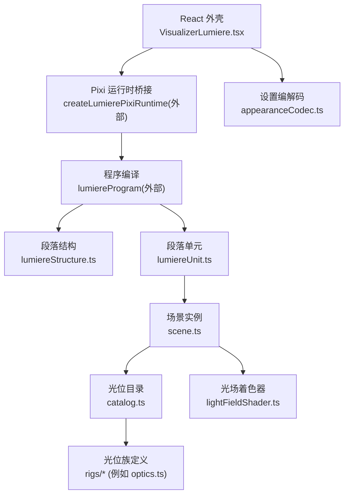

图表来源
- [VisualizerLumiere.tsx:1-210](file://src/components/visualizer/lumiere/VisualizerLumiere.tsx#L1-L210)
- [lumiereStructure.ts:1-132](file://src/components/visualizer/lumiere/lumiereStructure.ts#L1-L132)
- [lumiereUnit.ts:1-100](file://src/components/visualizer/lumiere/lumiereUnit.ts#L1-L100)
- [scene.ts:84-207](file://src/components/visualizer/lumiere/scene.ts#L84-L207)
- [catalog.ts:1-69](file://src/components/visualizer/lumiere/catalog.ts#L1-L69)
- [optics.ts:233-258](file://src/components/visualizer/lumiere/rigs/optics.ts#L233-L258)
- [lightFieldShader.ts:335-385](file://src/components/visualizer/lumiere/light/lightFieldShader.ts#L335-L385)
- [appearanceCodec.ts:514-544](file://src/utils/appearanceCodec.ts#L514-L544)

章节来源
- [VisualizerLumiere.tsx:1-210](file://src/components/visualizer/lumiere/VisualizerLumiere.tsx#L1-L210)
- [lumiereStructure.ts:1-132](file://src/components/visualizer/lumiere/lumiereStructure.ts#L1-L132)
- [lumiereUnit.ts:1-100](file://src/components/visualizer/lumiere/lumiereUnit.ts#L1-L100)
- [scene.ts:84-207](file://src/components/visualizer/lumiere/scene.ts#L84-L207)
- [catalog.ts:1-69](file://src/components/visualizer/lumiere/catalog.ts#L1-L69)
- [optics.ts:233-258](file://src/components/visualizer/lumiere/rigs/optics.ts#L233-L258)
- [lightFieldShader.ts:335-385](file://src/components/visualizer/lumiere/light/lightFieldShader.ts#L335-L385)
- [appearanceCodec.ts:514-544](file://src/utils/appearanceCodec.ts#L514-L544)

## 核心组件
- 运行外壳 VisualizerLumiere：负责挂载 Pixi 运行时、传入歌词与主题、切换歌曲、更新调参与暂停状态。
- 内核 lumiereKernel：定义仿射矩阵、变换参数、音频帧、段落性质等基础类型与矩阵运算。
- 段落结构 lumiereStructure：将歌词行切分为段落，计算阈值、分类段落性质。
- 类型定义 types：描述光位 profile、场景 tuning、爆闪、星空等数据契约。
- 场景 scene：创建场景容器、构建镜头、处理光位交叉渐变、提供 camera 与 rest 变换。
- 单元 lumiereUnit：把段落映射为场景，封装 update、cameraMatrix、shotAt。
- 场景帧 lumiereSceneFrames：根据时间与过渡策略决定当前段与上一段的图层透明度、缩放、模糊。
- 目录 catalog：汇总所有光位族，提供 kind→profile 查找。
- 光位族 optics：示例族，展示光线追迹、线稿与排版风格。
- 光场着色器 lightFieldShader：将光束、烟雾、眩光、焦散、波场等参数上传至 GPU。
- 设置编解码 appearanceCodec：对 Lumiere 调参进行短键压缩与解压，并做默认值补齐。

章节来源
- [VisualizerLumiere.tsx:1-210](file://src/components/visualizer/lumiere/VisualizerLumiere.tsx#L1-L210)
- [lumiereKernel.ts:1-106](file://src/components/visualizer/lumiere/lumiereKernel.ts#L1-L106)
- [lumiereStructure.ts:1-132](file://src/components/visualizer/lumiere/lumiereStructure.ts#L1-L132)
- [types.ts:1-156](file://src/components/visualizer/lumiere/types.ts#L1-L156)
- [scene.ts:84-207](file://src/components/visualizer/lumiere/scene.ts#L84-L207)
- [lumiereUnit.ts:1-100](file://src/components/visualizer/lumiere/lumiereUnit.ts#L1-L100)
- [lumiereSceneFrames.ts:1-85](file://src/components/visualizer/lumiere/lumiereSceneFrames.ts#L1-L85)
- [catalog.ts:1-69](file://src/components/visualizer/lumiere/catalog.ts#L1-L69)
- [optics.ts:233-258](file://src/components/visualizer/lumiere/rigs/optics.ts#L233-L258)
- [lightFieldShader.ts:335-385](file://src/components/visualizer/lumiere/light/lightFieldShader.ts#L335-L385)
- [appearanceCodec.ts:514-544](file://src/utils/appearanceCodec.ts#L514-L544)

## 架构总览
Lumiere 的“骨骼”由三段组成：
- 编译期：从歌词生成段落与镜头序列（structure + program）。
- 运行时：每个可见段落创建一个场景单元，逐帧更新。
- 过渡期：在段落边界处对上一段与当前段进行淡入淡出、缩放与模糊混合。

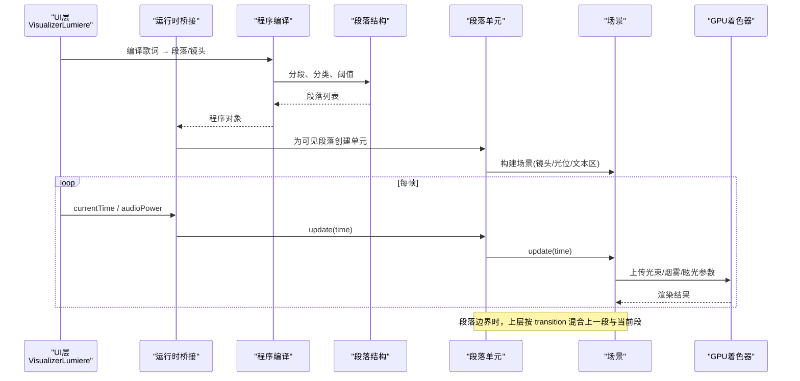

图表来源
- [VisualizerLumiere.tsx:75-123](file://src/components/visualizer/lumiere/VisualizerLumiere.tsx#L75-L123)
- [lumiereStructure.ts:45-131](file://src/components/visualizer/lumiere/lumiereStructure.ts#L45-L131)
- [lumiereUnit.ts:64-99](file://src/components/visualizer/lumiere/lumiereUnit.ts#L64-L99)
- [scene.ts:194-207](file://src/components/visualizer/lumiere/scene.ts#L194-L207)
- [lightFieldShader.ts:359-385](file://src/components/visualizer/lumiere/light/lightFieldShader.ts#L359-L385)

## 详细组件分析

### 变换矩阵与局部坐标系统（骨骼“关节”）
- 仿射矩阵 Affine：表示二维仿射变换，支持乘法、求逆与应用点。
- 变换参数 TransformParams：对应容器的 x/y、pivot、scale、rotation。
- fromParams/multiply/invert/applyAffine：矩阵构造、组合、逆变换与点变换。
- cameraBetween：计算「无运镜」到「有运镜」的矩阵差，用于其他图层跟随场景运镜。

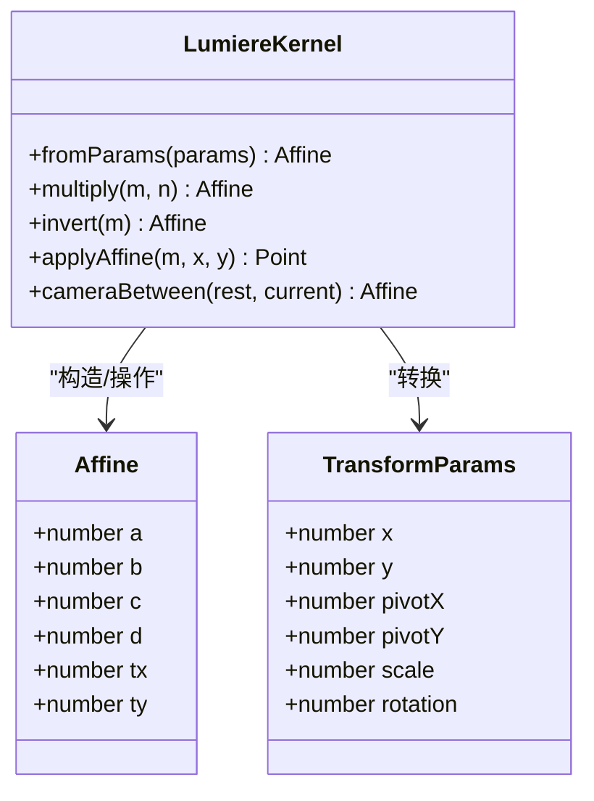

图表来源
- [lumiereKernel.ts:48-106](file://src/components/visualizer/lumiere/lumiereKernel.ts#L48-L106)

章节来源
- [lumiereKernel.ts:48-106](file://src/components/visualizer/lumiere/lumiereKernel.ts#L48-L106)

### 动画控制器（关键帧插值、混合动画、状态机）
- 关键帧插值：场景内使用缓动函数（easeInOutCubic、smooth、lerp）对光位交叉渐变、光源移动等进行平滑过渡。
- 混合动画：不同光位之间通过 fadeCaustic 与 wave strength 的线性插值实现混合。
- 状态机管理：段落状态机由 lumiereSceneFrames 维护，依据时间选择 activeIndex，并在进入/出场窗口叠加上一段与当前段。

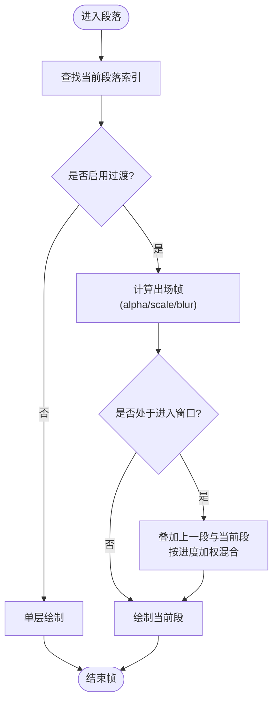

图表来源
- [lumiereSceneFrames.ts:31-84](file://src/components/visualizer/lumiere/lumiereSceneFrames.ts#L31-L84)
- [scene.ts:101-115](file://src/components/visualizer/lumiere/scene.ts#L101-L115)

章节来源
- [lumiereSceneFrames.ts:1-85](file://src/components/visualizer/lumiere/lumiereSceneFrames.ts#L1-L85)
- [scene.ts:101-115](file://src/components/visualizer/lumiere/scene.ts#L101-L115)

### 物理模拟（烟雾、焦散、波场）
- 烟雾（Fog）：密度、尺度、漂移、环境光、噪声倍频数等参数由 rig.fog 提供，并通过着色器 uFogA/uFogB 上传。
- 焦散（Caustic）：inBeam/floor.strength 随光位切换衰减/增强。
- 波场（Wave）：strength 随光位切换线性变化。
- 眩光（Glare）：位置与颜色通过 uGlare/uGlareColor 控制。

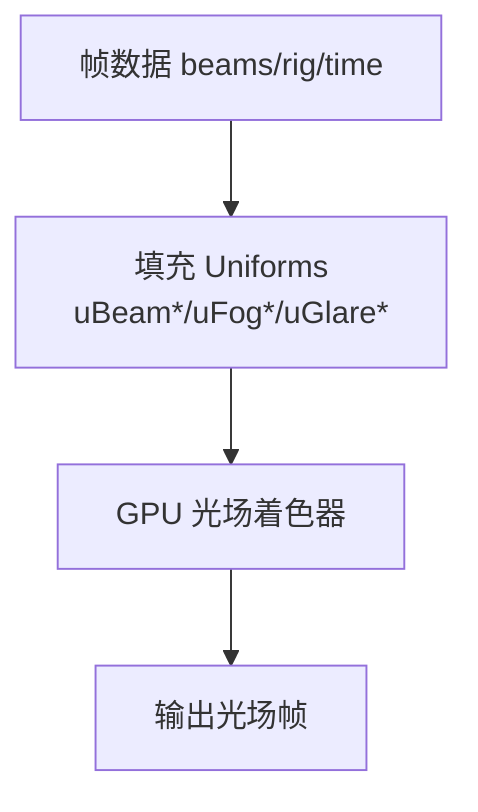

图表来源
- [lightFieldShader.ts:359-385](file://src/components/visualizer/lumiere/light/lightFieldShader.ts#L359-L385)
- [scene.ts:181-192](file://src/components/visualizer/lumiere/scene.ts#L181-L192)

章节来源
- [lightFieldShader.ts:335-385](file://src/components/visualizer/lumiere/light/lightFieldShader.ts#L335-L385)
- [scene.ts:181-192](file://src/components/visualizer/lumiere/scene.ts#L181-L192)

### 约束系统（光束几何、角度与距离）
- 光束几何：beam.ox/oy/dx/dy/halfWidth/tanSpread/softness/length 等参数约束光束起点、方向、宽度、扩散与长度。
- 角度与距离：通过射线/折线（如 opticsRaytrace）定义光路节点与折射路径，形成“距离+角度”约束的光网。
- 线稿与图解：lineArt 与 viewfinderFrame/scatteredSparks 等装饰元素受 profile 配置约束。

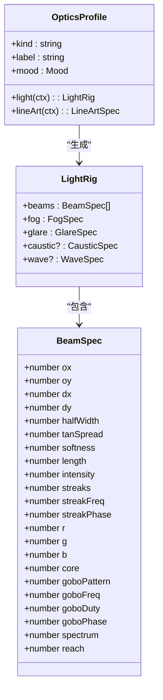

图表来源
- [lightFieldShader.ts:359-385](file://src/components/visualizer/lumiere/light/lightFieldShader.ts#L359-L385)
- [optics.ts:233-258](file://src/components/visualizer/lumiere/rigs/optics.ts#L233-L258)
- [types.ts:36-69](file://src/components/visualizer/lumiere/types.ts#L36-L69)

章节来源
- [lightFieldShader.ts:359-385](file://src/components/visualizer/lumiere/light/lightFieldShader.ts#L359-L385)
- [optics.ts:233-258](file://src/components/visualizer/lumiere/rigs/optics.ts#L233-L258)
- [types.ts:36-69](file://src/components/visualizer/lumiere/types.ts#L36-L69)

### 序列化与反序列化（设置与版本兼容）
- 短键映射：LUMIERE_SHORT_KEYS 将用户可见字段映射为短键，便于存储与传输。
- 压缩/解压：compressLumiere/decompressLumiere 负责短码编解码。
- 默认值补齐：decompressLumiere 后统一走 normalizeLumiereTuning 钳制与补全默认值，保证向后兼容。

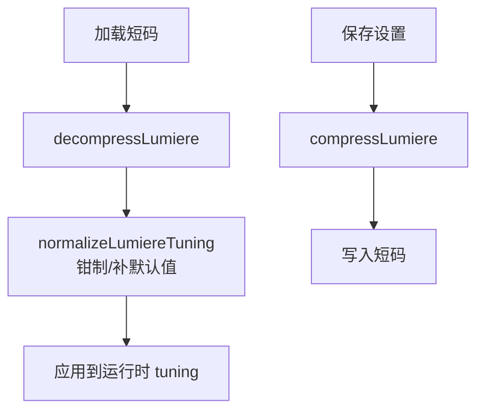

图表来源
- [appearanceCodec.ts:514-544](file://src/utils/appearanceCodec.ts#L514-L544)

章节来源
- [appearanceCodec.ts:514-544](file://src/utils/appearanceCodec.ts#L514-L544)

### 段落结构与分类（骨骼“分段”）
- 构建结构行：buildStructureLines 将歌词行转为带 renderEndTime 的结构行。
- 阈值计算：resolveParagraphGapThreshold 使用中位数×倍数确定切分阈值，并钳制范围。
- 超长段落切分：splitOversizedDraft 在最大空隙处切开，支持递归切分左半部分。
- 自动分段：draftParagraphs 基于元数据变化或空隙阈值切段，再按上限切分。
- 段落性质分类：classifyParagraph 根据副歌标记、间奏标记、时长、词密与标点进行分类。

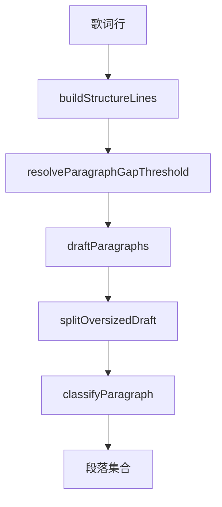

图表来源
- [lumiereStructure.ts:45-131](file://src/components/visualizer/lumiere/lumiereStructure.ts#L45-L131)

章节来源
- [lumiereStructure.ts:45-131](file://src/components/visualizer/lumiere/lumiereStructure.ts#L45-L131)

### 场景与单元（骨骼“装配”）
- 场景创建：createLumiereScene 根据 width/height/resolution/seed/theme/tuning/shots 构建场景容器与光位。
- 单元封装：createLumiereUnit 将段落映射为场景，并提供 update/cameraMatrix/shotAt。
- 镜头选择：shotAt 根据时间返回当前镜头；buildLumiereSceneShots 将全局行号映射为单元内下标。

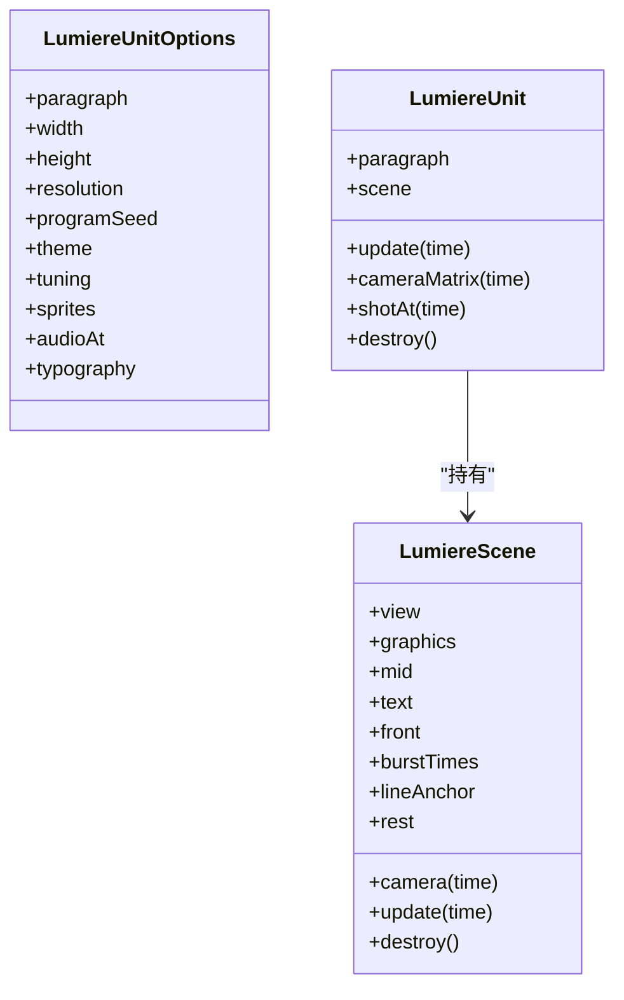

图表来源
- [lumiereUnit.ts:17-99](file://src/components/visualizer/lumiere/lumiereUnit.ts#L17-L99)
- [scene.ts:84-207](file://src/components/visualizer/lumiere/scene.ts#L84-L207)

章节来源
- [lumiereUnit.ts:17-99](file://src/components/visualizer/lumiere/lumiereUnit.ts#L17-L99)
- [scene.ts:84-207](file://src/components/visualizer/lumiere/scene.ts#L84-L207)

### 光位族与目录（骨骼“样式库”）
- 目录聚合：catalog 汇总各族 profiles，提供 LUMIERE_PROFILES/LUMIERE_KINDS/profileOf。
- 族默认值：base.ts 提供 familyOf 构造器，统一填充 motes/front/lineArt/region/heroSize/camera 等默认值。
- 示例族 optics：展示光线追迹、线稿与排版风格。

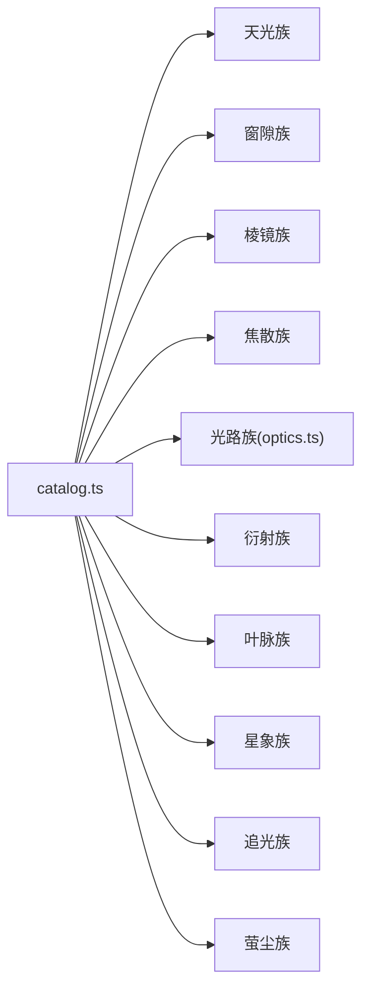

图表来源
- [catalog.ts:1-69](file://src/components/visualizer/lumiere/catalog.ts#L1-L69)
- [optics.ts:233-258](file://src/components/visualizer/lumiere/rigs/optics.ts#L233-L258)

章节来源
- [catalog.ts:1-69](file://src/components/visualizer/lumiere/catalog.ts#L1-L69)
- [optics.ts:233-258](file://src/components/visualizer/lumiere/rigs/optics.ts#L233-L258)

## 依赖关系分析
- VisualizerLumiere 依赖运行时桥接与程序编译，负责 UI 与运行时之间的数据同步。
- lumiereStructure 被程序编译阶段调用，产出段落结构。
- lumiereUnit 依赖 catalog 与 scene，将段落装配为可更新的场景。
- scene 依赖 catalog 与 types，构建光位与调色板。
- lightFieldShader 接收来自 scene/unit 的参数，完成 GPU 渲染。
- appearanceCodec 独立于渲染管线，仅影响设置持久化与加载。

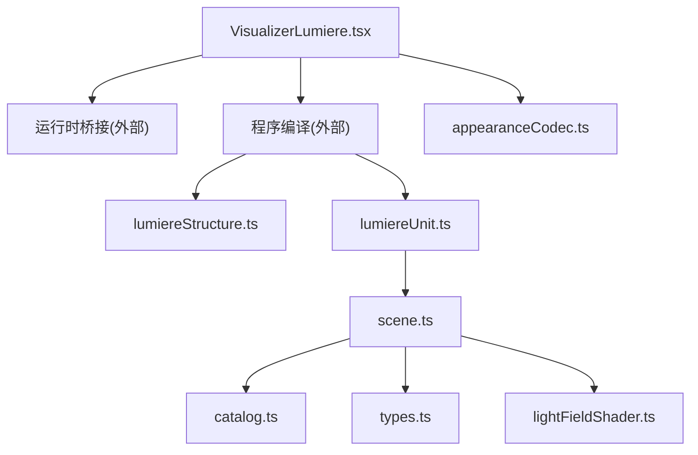

图表来源
- [VisualizerLumiere.tsx:75-123](file://src/components/visualizer/lumiere/VisualizerLumiere.tsx#L75-L123)
- [lumiereStructure.ts:1-132](file://src/components/visualizer/lumiere/lumiereStructure.ts#L1-L132)
- [lumiereUnit.ts:1-100](file://src/components/visualizer/lumiere/lumiereUnit.ts#L1-L100)
- [scene.ts:84-207](file://src/components/visualizer/lumiere/scene.ts#L84-L207)
- [catalog.ts:1-69](file://src/components/visualizer/lumiere/catalog.ts#L1-L69)
- [types.ts:1-156](file://src/components/visualizer/lumiere/types.ts#L1-L156)
- [lightFieldShader.ts:335-385](file://src/components/visualizer/lumiere/light/lightFieldShader.ts#L335-L385)
- [appearanceCodec.ts:514-544](file://src/utils/appearanceCodec.ts#L514-L544)

章节来源
- [VisualizerLumiere.tsx:75-123](file://src/components/visualizer/lumiere/VisualizerLumiere.tsx#L75-L123)
- [lumiereStructure.ts:1-132](file://src/components/visualizer/lumiere/lumiereStructure.ts#L1-L132)
- [lumiereUnit.ts:1-100](file://src/components/visualizer/lumiere/lumiereUnit.ts#L1-L100)
- [scene.ts:84-207](file://src/components/visualizer/lumiere/scene.ts#L84-L207)
- [catalog.ts:1-69](file://src/components/visualizer/lumiere/catalog.ts#L1-L69)
- [types.ts:1-156](file://src/components/visualizer/lumiere/types.ts#L1-L156)
- [lightFieldShader.ts:335-385](file://src/components/visualizer/lumiere/light/lightFieldShader.ts#L335-L385)
- [appearanceCodec.ts:514-544](file://src/utils/appearanceCodec.ts#L514-L544)

## 性能与渲染特性
- GPU 优先：光场、烟雾、焦散、波场等效果通过 WebGL 着色器批量渲染，CPU 仅计算必要参数。
- 分层渲染：graphics/mid/text/front 分层减少重绘范围。
- 过渡混合：仅在进入/出场窗口叠加两层，避免多余绘制。
- 纹理共享：sprites 作为全局共享资源，减少重复分配。
- 调参优化：bloom、fogOctaves、textOnly 等开关可按设备性能调整。

[本节为通用性能讨论，不直接分析具体文件]

## 故障排查指南
- 运行时失败回退：当 Pixi 运行时初始化失败时，UI 层显示占位文字与等待提示。
- 歌词未就绪：在静态模式或纯音乐情况下，编译为仅有间奏镜头的程序，光照照常但不画字。
- 过渡异常：检查 transitionsEnabled 与段落 transitionOut 的时间区间，确认 enter/exit 帧计算是否正确。
- 设置无效：确认 short key 映射与 normalizeLumiereTuning 的默认值补齐逻辑。

章节来源
- [VisualizerLumiere.tsx:172-184](file://src/components/visualizer/lumiere/VisualizerLumiere.tsx#L172-L184)
- [VisualizerLumiere.tsx:71-78](file://src/components/visualizer/lumiere/VisualizerLumiere.tsx#L71-L78)
- [lumiereSceneFrames.ts:47-84](file://src/components/visualizer/lumiere/lumiereSceneFrames.ts#L47-L84)
- [appearanceCodec.ts:514-544](file://src/utils/appearanceCodec.ts#L514-L544)

## 结论
Lumiere 模式的“骨骼系统”以段落—镜头—场景为主线，通过仿射矩阵与变换参数实现稳定的局部坐标系与运镜；以光位族与目录提供丰富的视觉风格；以 GPU 着色器承载烟雾、焦散、波场等物理感效果；以过渡框架实现段落间的平滑混合。该体系具备良好的可扩展性：新增光位族、调整过渡策略、扩展调参项均可在不破坏既有管线的前提下进行。

[本节为总结性内容，不直接分析具体文件]

## 附录：自定义开发流程与调试要点

### 新增光位族
- 在 rigs 目录下新增族文件，导出若干 LumiereProfile。
- 在 catalog.ts 中引入并合并到 LUMIERE_PROFILES。
- 使用 profileOf(kind) 确保未知 kind 回退到默认天井。

章节来源
- [catalog.ts:1-69](file://src/components/visualizer/lumiere/catalog.ts#L1-L69)
- [optics.ts:233-258](file://src/components/visualizer/lumiere/rigs/optics.ts#L233-L258)

### 调整过渡与混合
- 修改 lumiereSceneFrames 中的 enter/exit 帧计算逻辑，或调整 resolveLumiereEnterDuration。
- 在 scene.ts 中调整 HANDOFF/GLARE_MOVE 等过渡时长常量。

章节来源
- [lumiereSceneFrames.ts:31-84](file://src/components/visualizer/lumiere/lumiereSceneFrames.ts#L31-L84)
- [scene.ts:101-115](file://src/components/visualizer/lumiere/scene.ts#L101-L115)

### 扩展调参项
- 在 types.ts 的 LumiereSceneTuning 中添加新字段。
- 在 appearanceCodec.ts 的 LUMIERE_SHORT_KEYS 中添加短键映射。
- 在运行时入口处应用新调参（例如 setTuning）。

章节来源
- [types.ts:71-116](file://src/components/visualizer/lumiere/types.ts#L71-L116)
- [appearanceCodec.ts:514-544](file://src/utils/appearanceCodec.ts#L514-L544)
- [VisualizerLumiere.tsx:127-149](file://src/components/visualizer/lumiere/VisualizerLumiere.tsx#L127-L149)

### 调试工具与断点建议
- 在 scene.ts 的 createLumiereScene 与 update 中观察镜头切换与光位混合。
- 在 lightFieldShader.ts 的 update 中检查 Uniforms 上传是否按预期。
- 在 lumiereSceneFrames.ts 中打印 activeIndex 与 layers，验证过渡混合。

章节来源
- [scene.ts:194-207](file://src/components/visualizer/lumiere/scene.ts#L194-L207)
- [lightFieldShader.ts:359-385](file://src/components/visualizer/lumiere/light/lightFieldShader.ts#L359-L385)
- [lumiereSceneFrames.ts:47-84](file://src/components/visualizer/lumiere/lumiereSceneFrames.ts#L47-L84)