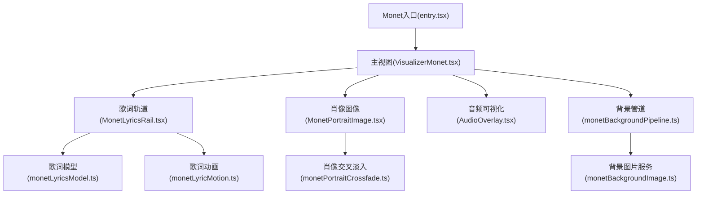
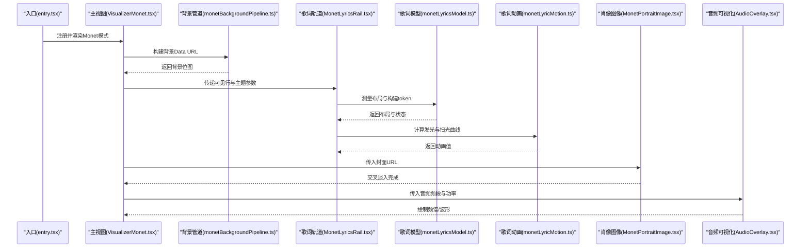
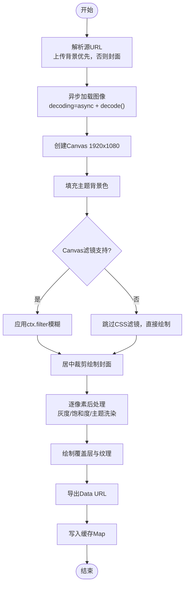
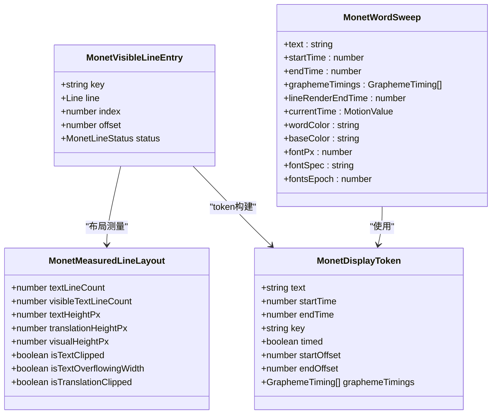
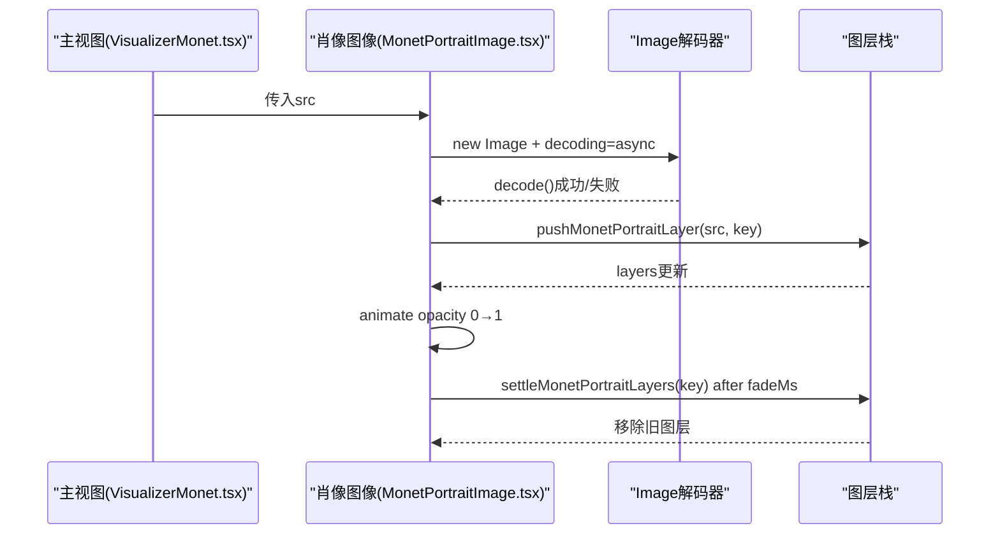
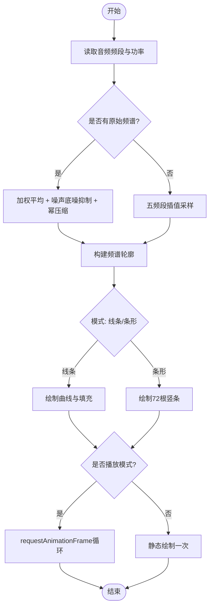
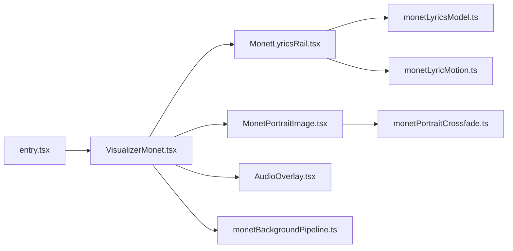

# Monet模式实现

<cite>
**本文引用的文件**   
- [VisualizerMonet.tsx](file://src/components/visualizer/monet/VisualizerMonet.tsx)
- [entry.tsx](file://src/components/visualizer/monet/entry.tsx)
- [tuning.ts](file://src/components/visualizer/monet/tuning.ts)
- [monetBackgroundPipeline.ts](file://src/components/visualizer/monet/monetBackgroundPipeline.ts)
- [monetBackgroundImage.ts](file://src/services/monetBackgroundImage.ts)
- [monetPortraitImage.ts](file://src/services/monetPortraitImage.ts)
- [MonetPortraitImage.tsx](file://src/components/visualizer/monet/MonetPortraitImage.tsx)
- [monetPortraitCrossfade.ts](file://src/components/visualizer/monet/monetPortraitCrossfade.ts)
- [MonetLyricsRail.tsx](file://src/components/visualizer/monet/MonetLyricsRail.tsx)
- [monetLyricsModel.ts](file://src/components/visualizer/monet/monetLyricsModel.ts)
- [monetLyricMotion.ts](file://src/components/visualizer/monet/monetLyricMotion.ts)
- [AudioOverlay.tsx](file://src/components/visualizer/monet/AudioOverlay.tsx)
</cite>

## 目录
1. [简介](#简介)
2. [项目结构](#项目结构)
3. [核心组件](#核心组件)
4. [架构总览](#架构总览)
5. [详细组件分析](#详细组件分析)
6. [依赖关系分析](#依赖关系分析)
7. [性能与优化](#性能与优化)
8. [故障排查指南](#故障排查指南)
9. [结论](#结论)
10. [附录：自定义艺术风格与图像处理效果开发指南](#附录自定义艺术风格与图像处理效果开发指南)

## 简介
本文件为“Monet可视化模式”的完整技术文档。Monet模式以印象派美学为核心，通过点彩式歌词扫光、色彩融合与光影叠加，构建出具有油画质感的音乐可视化体验。其关键能力包括：
- 背景管道系统：对封面或上传图像进行预处理、模糊、灰度/饱和度调节、主题色洗染与纹理叠加，生成稳定的Canvas位图作为背景。
- 歌词轨道系统：基于字形级时间线、词级着色、行级布局测量与Framer Motion动画曲线，实现平滑滚动、发光与扫光效果。
- 肖像图像处理：在封面切换时采用离屏解码与图层交叉淡入，避免画面闪烁；支持可拖拽定位与方形/卡片两种展示样式。
- 音频可视化：底部频谱条/波形层根据音频频段与原始频谱数据动态绘制，提供静态预览与实时渲染两种模式。
- 色彩科学与视觉平衡：通过亮度阈值、阴影/高光端点选择与多段渐变叠加，确保不同主题下的可读性与对比度。
- 性能优化：Canvas滤镜检测与降级、离屏测量、缓存策略、异步加载与GPU加速提示，保障高帧率与低内存占用。

## 项目结构
Monet模式位于可视化子系统内，围绕一个主入口注册器、一个主视图组件以及若干子模块组织：
- 入口与注册：[entry.tsx](file://src/components/visualizer/monet/entry.tsx) 将Monet模式注册到可视化框架，并注入设置面板与默认调参。
- 主视图：[VisualizerMonet.tsx](file://src/components/visualizer/monet/VisualizerMonet.tsx) 组合歌词轨道、肖像图像、浮动装饰与音频可视化。
- 背景管道：[monetBackgroundPipeline.ts](file://src/components/visualizer/monet/monetBackgroundPipeline.ts) 负责背景位图构建与后处理。
- 图片服务：[monetBackgroundImage.ts](file://src/services/monetBackgroundImage.ts)、[monetPortraitImage.ts](file://src/services/monetPortraitImage.ts) 持久化全局背景与自定义肖像。
- 歌词模型与动画：[monetLyricsModel.ts](file://src/components/visualizer/monet/monetLyricsModel.ts)、[monetLyricMotion.ts](file://src/components/visualizer/monet/monetLyricMotion.ts)。
- 歌词渲染：[MonetLyricsRail.tsx](file://src/components/visualizer/monet/MonetLyricsRail.tsx)。
- 肖像交叉淡入：[MonetPortraitImage.tsx](file://src/components/visualizer/monet/MonetPortraitImage.tsx)、[monetPortraitCrossfade.ts](file://src/components/visualizer/monet/monetPortraitCrossfade.ts)。
- 音频可视化：[AudioOverlay.tsx](file://src/components/visualizer/monet/AudioOverlay.tsx)。

**图表来源**
- [entry.tsx:10-35](file://src/components/visualizer/monet/entry.tsx#L10-L35)
- [VisualizerMonet.tsx:180-543](file://src/components/visualizer/monet/VisualizerMonet.tsx#L180-L543)
- [monetBackgroundPipeline.ts:315-361](file://src/components/visualizer/monet/monetBackgroundPipeline.ts#L315-L361)
- [monetBackgroundImage.ts:14-30](file://src/services/monetBackgroundImage.ts#L14-L30)
- [monetPortraitImage.ts:14-30](file://src/services/monetPortraitImage.ts#L14-L30)
- [MonetLyricsRail.tsx:35-56](file://src/components/visualizer/monet/MonetLyricsRail.tsx#L35-L56)
- [monetLyricsModel.ts:10-55](file://src/components/visualizer/monet/monetLyricsModel.ts#L10-L55)
- [monetLyricMotion.ts:1-60](file://src/components/visualizer/monet/monetLyricMotion.ts#L1-L60)
- [AudioOverlay.tsx:156-314](file://src/components/visualizer/monet/AudioOverlay.tsx#L156-L314)

**章节来源**
- [entry.tsx:1-36](file://src/components/visualizer/monet/entry.tsx#L1-L36)
- [VisualizerMonet.tsx:1-548](file://src/components/visualizer/monet/VisualizerMonet.tsx#L1-L548)

## 核心组件
- 入口与类型注入
  - [entry.tsx](file://src/components/visualizer/monet/entry.tsx) 使用 `defineVisualizer` 注册Monet模式，设置渲染顺序、标签、预览种子与调参键。
  - [tuning.ts](file://src/components/visualizer/monet/tuning.ts) 将强类型的Monet调参注入渲染边界，使主题与歌词字体缩放等参数贯穿整个视图。
- 主视图
  - [VisualizerMonet.tsx](file://src/components/visualizer/monet/VisualizerMonet.tsx) 聚合歌词轨道、肖像图像、浮动装饰与音频可视化，计算大尺寸屏幕缩放、字号与列宽，并提供可拖拽的肖像定位。
- 背景管道
  - [monetBackgroundPipeline.ts](file://src/components/visualizer/monet/monetBackgroundPipeline.ts) 构建固定分辨率（1920×1080）的背景位图，执行模糊、灰度/饱和度、主题洗染与纹理叠加，并通过缓存键避免重复计算。
- 歌词轨道
  - [MonetLyricsRail.tsx](file://src/components/visualizer/monet/MonetLyricsRail.tsx) 基于预计算的可见行条目与布局测量，使用Framer Motion驱动滚动、缩放、模糊与发光。
  - [monetLyricsModel.ts](file://src/components/visualizer/monet/monetLyricsModel.ts) 提供歌词token构建、字形偏移测量、行布局测量、可见窗口选择与大屏缩放策略。
  - [monetLyricMotion.ts](file://src/components/visualizer/monet/monetLyricMotion.ts) 提供发光包络、填充宽度插值与行态色调函数。
- 肖像图像
  - [MonetPortraitImage.tsx](file://src/components/visualizer/monet/MonetPortraitImage.tsx) 使用离屏解码与图层栈实现封面切换时的无闪烁交叉淡入。
  - [monetPortraitCrossfade.ts](file://src/components/visualizer/monet/monetPortraitCrossfade.ts) 管理图层压入与结算逻辑。
- 音频可视化
  - [AudioOverlay.tsx](file://src/components/visualizer/monet/AudioOverlay.tsx) 根据音频频段与原始频谱数据绘制条形或线条模式，支持静态预览与实时循环。

**章节来源**
- [entry.tsx:10-35](file://src/components/visualizer/monet/entry.tsx#L10-L35)
- [tuning.ts:1-4](file://src/components/visualizer/monet/tuning.ts#L1-L4)
- [VisualizerMonet.tsx:34-179](file://src/components/visualizer/monet/VisualizerMonet.tsx#L34-L179)
- [monetBackgroundPipeline.ts:6-15](file://src/components/visualizer/monet/monetBackgroundPipeline.ts#L6-L15)
- [MonetLyricsRail.tsx:35-56](file://src/components/visualizer/monet/MonetLyricsRail.tsx#L35-L56)
- [monetLyricsModel.ts:10-55](file://src/components/visualizer/monet/monetLyricsModel.ts#L10-L55)
- [monetLyricMotion.ts:1-60](file://src/components/visualizer/monet/monetLyricMotion.ts#L1-L60)
- [MonetPortraitImage.tsx:18-27](file://src/components/visualizer/monet/MonetPortraitImage.tsx#L18-L27)
- [AudioOverlay.tsx:156-314](file://src/components/visualizer/monet/AudioOverlay.tsx#L156-L314)

## 架构总览
Monet模式的运行时流程如下：
1. 入口注册：[entry.tsx](file://src/components/visualizer/monet/entry.tsx) 将Monet模式挂载到可视化框架，并传入调参与设置面板。
2. 主视图装配：[VisualizerMonet.tsx](file://src/components/visualizer/monet/VisualizerMonet.tsx) 计算布局与字体缩放，组装歌词轨道、肖像图像、装饰与音频可视化。
3. 背景构建：[monetBackgroundPipeline.ts](file://src/components/visualizer/monet/monetBackgroundPipeline.ts) 从封面或上传资源中解析源URL，加载图像，应用模糊与主题洗染，输出Data URL。
4. 歌词渲染：[MonetLyricsRail.tsx](file://src/components/visualizer/monet/MonetLyricsRail.tsx) 读取当前时间与行状态，调用[monetLyricsModel.ts](file://src/components/visualizer/monet/monetLyricsModel.ts) 进行布局测量与token构建，使用[monetLyricMotion.ts](file://src/components/visualizer/monet/monetLyricMotion.ts) 的动画曲线驱动扫光与发光。
5. 肖像切换：[MonetPortraitImage.tsx](file://src/components/visualizer/monet/MonetPortraitImage.tsx) 在解码完成后压入新图层，并在淡入结束后结算旧图层。
6. 音频可视化：[AudioOverlay.tsx](file://src/components/visualizer/monet/AudioOverlay.tsx) 在播放模式下按帧绘制频谱，或在预览/静态模式下绘制静态图形。

**图表来源**
- [entry.tsx:10-35](file://src/components/visualizer/monet/entry.tsx#L10-L35)
- [VisualizerMonet.tsx:180-543](file://src/components/visualizer/monet/VisualizerMonet.tsx#L180-L543)
- [monetBackgroundPipeline.ts:315-361](file://src/components/visualizer/monet/monetBackgroundPipeline.ts#L315-L361)
- [MonetLyricsRail.tsx:432-643](file://src/components/visualizer/monet/MonetLyricsRail.tsx#L432-L643)
- [monetLyricsModel.ts:330-406](file://src/components/visualizer/monet/monetLyricsModel.ts#L330-L406)
- [monetLyricMotion.ts:9-47](file://src/components/visualizer/monet/monetLyricMotion.ts#L9-L47)
- [MonetPortraitImage.tsx:32-76](file://src/components/visualizer/monet/MonetPortraitImage.tsx#L32-L76)
- [AudioOverlay.tsx:194-309](file://src/components/visualizer/monet/AudioOverlay.tsx#L194-L309)

## 详细组件分析

### 背景管道系统
背景管道负责将封面或上传图像转换为带主题风格的稳定背景位图。关键步骤：
- 源URL解析：优先使用上传的全局背景，否则回退到封面。
- 图像加载：使用`Image`对象并启用`decoding='async'`，同时尝试`decode()`，失败则回退到`onload`。
- Canvas绘制：先填充主题背景色，再根据浏览器能力决定是否使用`ctx.filter`进行模糊；随后居中裁剪绘制封面。
- 后处理：逐像素应用灰度、饱和度与主题洗染（wash），其中洗染颜色根据背景与主色的亮度比较选择阴影/高光端点。
- 纹理叠加：绘制线性渐变覆盖层、径向光晕与右侧遮罩，可选绘制条纹纹理。
- 缓存：基于输入源、主题三原色与调参项生成缓存键，避免重复构建。

**图表来源**
- [monetBackgroundPipeline.ts:42-75](file://src/components/visualizer/monet/monetBackgroundPipeline.ts#L42-L75)
- [monetBackgroundPipeline.ts:142-201](file://src/components/visualizer/monet/monetBackgroundPipeline.ts#L142-L201)
- [monetBackgroundPipeline.ts:203-240](file://src/components/visualizer/monet/monetBackgroundPipeline.ts#L203-L240)
- [monetBackgroundPipeline.ts:270-313](file://src/components/visualizer/monet/monetBackgroundPipeline.ts#L270-L313)
- [monetBackgroundPipeline.ts:315-361](file://src/components/visualizer/monet/monetBackgroundPipeline.ts#L315-L361)

**章节来源**
- [monetBackgroundPipeline.ts:6-15](file://src/components/visualizer/monet/monetBackgroundPipeline.ts#L6-L15)
- [monetBackgroundPipeline.ts:42-75](file://src/components/visualizer/monet/monetBackgroundPipeline.ts#L42-L75)
- [monetBackgroundPipeline.ts:142-201](file://src/components/visualizer/monet/monetBackgroundPipeline.ts#L142-L201)
- [monetBackgroundPipeline.ts:203-240](file://src/components/visualizer/monet/monetBackgroundPipeline.ts#L203-L240)
- [monetBackgroundPipeline.ts:270-313](file://src/components/visualizer/monet/monetBackgroundPipeline.ts#L270-L313)
- [monetBackgroundPipeline.ts:315-361](file://src/components/visualizer/monet/monetBackgroundPipeline.ts#L315-L361)
- [monetBackgroundImage.ts:14-30](file://src/services/monetBackgroundImage.ts#L14-L30)

### 歌词轨道系统
歌词轨道由“模型+渲染+动画”三层构成：
- 模型层（monetLyricsModel.ts）
  - 构建显示token：保留标点与空格，将词级时间戳映射到文本片段。
  - 字形偏移测量：使用Intl.Segmenter分词，累积每个字形的宽度偏移，用于扫光边缘插值。
  - 行布局测量：基于@chenglou/pretext计算行数、可视高度、是否截断与溢出，区分主动行与非主动行的行数上限。
  - 可见窗口选择：围绕活跃行前后选取少量行，分配waiting/active/passed状态。
  - 大屏缩放：超过一定视口宽度时整体放大，保持列宽与字号比例不变。
- 渲染层（MonetLyricsRail.tsx）
  - 行态色调：根据距离与状态计算透明度、缩放、模糊与层级。
  - 行间距：主动行与非主动行使用不同间距比例，随字号增长。
  - 掩码与裁切：垂直裁切与水平边缘柔化，避免长词被硬切。
  - 词级扫光：使用mask-image与background-clip:text实现从左到右的渐变填充，结合发光阴影。
  - 翻译字幕：仅在活跃行显示，独立测量与裁切。
- 动画层（monetLyricMotion.ts）
  - 发光包络：使用Smoothstep曲线实现柔和的上升与驻留衰减。
  - 填充宽度插值：按字形时间线插值，保证短CJK词连续过渡。
  - 弹簧参数：滚动与缩放的spring配置，提供自然物理感。

**图表来源**
- [monetLyricsModel.ts:12-55](file://src/components/visualizer/monet/monetLyricsModel.ts#L12-L55)
- [MonetLyricsRail.tsx:432-643](file://src/components/visualizer/monet/MonetLyricsRail.tsx#L432-L643)

**章节来源**
- [monetLyricsModel.ts:10-55](file://src/components/visualizer/monet/monetLyricsModel.ts#L10-L55)
- [monetLyricsModel.ts:169-185](file://src/components/visualizer/monet/monetLyricsModel.ts#L169-L185)
- [monetLyricsModel.ts:271-299](file://src/components/visualizer/monet/monetLyricsModel.ts#L271-L299)
- [monetLyricsModel.ts:330-406](file://src/components/visualizer/monet/monetLyricsModel.ts#L330-L406)
- [monetLyricsModel.ts:441-487](file://src/components/visualizer/monet/monetLyricsModel.ts#L441-L487)
- [monetLyricsModel.ts:489-547](file://src/components/visualizer/monet/monetLyricsModel.ts#L489-L547)
- [MonetLyricsRail.tsx:110-174](file://src/components/visualizer/monet/MonetLyricsRail.tsx#L110-L174)
- [MonetLyricsRail.tsx:310-378](file://src/components/visualizer/monet/MonetLyricsRail.tsx#L310-L378)
- [MonetLyricsRail.tsx:432-643](file://src/components/visualizer/monet/MonetLyricsRail.tsx#L432-L643)
- [monetLyricMotion.ts:9-47](file://src/components/visualizer/monet/monetLyricMotion.ts#L9-L47)

### 肖像图像处理
肖像图像组件的核心目标是“无闪烁切换”与“可交互定位”：
- 离屏解码：新建`Image`对象并设置`decoding='async'`，优先调用`decode()`，失败回退到`onload`。
- 图层栈：每次成功解码后压入新图层，使用Framer Motion控制透明度交叉淡入。
- 结算逻辑：在淡入时长后结算顶层图层，移除已不透明的旧图层，避免DOM节点无限增长。
- 交互定位：在主视图中提供拖拽手柄与重置按钮，保存横向偏移至调参中，支持方形与卡片两种样式。

**图表来源**
- [MonetPortraitImage.tsx:32-76](file://src/components/visualizer/monet/MonetPortraitImage.tsx#L32-L76)
- [VisualizerMonet.tsx:379-514](file://src/components/visualizer/monet/VisualizerMonet.tsx#L379-L514)

**章节来源**
- [MonetPortraitImage.tsx:18-27](file://src/components/visualizer/monet/MonetPortraitImage.tsx#L18-L27)
- [MonetPortraitImage.tsx:32-76](file://src/components/visualizer/monet/MonetPortraitImage.tsx#L32-L76)
- [VisualizerMonet.tsx:379-514](file://src/components/visualizer/monet/VisualizerMonet.tsx#L379-L514)
- [monetPortraitImage.ts:14-30](file://src/services/monetPortraitImage.ts#L14-L30)

### 音频可视化
音频可视化组件提供两种模式：
- 线条模式：绘制平滑曲线与填充区域，模拟频谱响应。
- 条形模式：绘制72根竖条，带有正弦包络与微脉冲。
数据来源：
- 若存在原始频谱数据，则按频率加权平均与噪声底噪抑制，再进行幂压缩与低频补偿。
- 否则使用五频段（bass/lowMid/mid/vocal/treble）插值采样。
渲染：
- 播放模式：requestAnimationFrame循环绘制。
- 静态/预览模式：仅绘制一次静态图形。

**图表来源**
- [AudioOverlay.tsx:19-92](file://src/components/visualizer/monet/AudioOverlay.tsx#L19-L92)
- [AudioOverlay.tsx:194-309](file://src/components/visualizer/monet/AudioOverlay.tsx#L194-L309)

**章节来源**
- [AudioOverlay.tsx:156-314](file://src/components/visualizer/monet/AudioOverlay.tsx#L156-L314)

## 依赖关系分析
Monet模式内部依赖关系如下：
- 入口与注册：[entry.tsx](file://src/components/visualizer/monet/entry.tsx) 依赖可视化定义API与设置面板。
- 主视图：[VisualizerMonet.tsx](file://src/components/visualizer/monet/VisualizerMonet.tsx) 依赖歌词模型、字体栈、主题与Framer Motion。
- 背景管道：[monetBackgroundPipeline.ts](file://src/components/visualizer/monet/monetBackgroundPipeline.ts) 依赖颜色工具与主题类型。
- 歌词轨道：[MonetLyricsRail.tsx](file://src/components/visualizer/monet/MonetLyricsRail.tsx) 依赖歌词模型、动画曲线与词级着色。
- 肖像图像：[MonetPortraitImage.tsx](file://src/components/visualizer/monet/MonetPortraitImage.tsx) 依赖交叉淡入逻辑。
- 音频可视化：[AudioOverlay.tsx](file://src/components/visualizer/monet/AudioOverlay.tsx) 依赖主题与音频数据类型。

**图表来源**
- [entry.tsx:10-35](file://src/components/visualizer/monet/entry.tsx#L10-L35)
- [VisualizerMonet.tsx:180-543](file://src/components/visualizer/monet/VisualizerMonet.tsx#L180-L543)
- [MonetLyricsRail.tsx:35-56](file://src/components/visualizer/monet/MonetLyricsRail.tsx#L35-L56)
- [monetLyricsModel.ts:10-55](file://src/components/visualizer/monet/monetLyricsModel.ts#L10-L55)
- [monetLyricMotion.ts:1-60](file://src/components/visualizer/monet/monetLyricMotion.ts#L1-L60)
- [MonetPortraitImage.tsx:18-27](file://src/components/visualizer/monet/MonetPortraitImage.tsx#L18-L27)
- [AudioOverlay.tsx:156-314](file://src/components/visualizer/monet/AudioOverlay.tsx#L156-L314)

**章节来源**
- [entry.tsx:1-36](file://src/components/visualizer/monet/entry.tsx#L1-L36)
- [VisualizerMonet.tsx:1-548](file://src/components/visualizer/monet/VisualizerMonet.tsx#L1-L548)
- [monetBackgroundPipeline.ts:1-362](file://src/components/visualizer/monet/monetBackgroundPipeline.ts#L1-L362)
- [MonetLyricsRail.tsx:1-800](file://src/components/visualizer/monet/MonetLyricsRail.tsx#L1-L800)
- [monetLyricsModel.ts:1-547](file://src/components/visualizer/monet/monetLyricsModel.ts#L1-L547)
- [monetLyricMotion.ts:1-60](file://src/components/visualizer/monet/monetLyricMotion.ts#L1-L60)
- [MonetPortraitImage.tsx:1-103](file://src/components/visualizer/monet/MonetPortraitImage.tsx#L1-L103)
- [AudioOverlay.tsx:1-320](file://src/components/visualizer/monet/AudioOverlay.tsx#L1-L320)

## 性能与优化
- Canvas滤镜检测与降级：在iOS Safari等环境中，`ctx.filter`可能无效，代码会检测并回退到CSS模糊或纯Canvas绘制路径，避免静默失效。
- 离屏解码与图层栈：肖像图像在离屏元素上解码，成功后才压入图层，避免空帧闪烁；淡入结束后结算图层，控制DOM数量。
- 布局测量缓存：歌词行布局、字形偏移与垂直度量均使用缓存，限制最大条目数，防止内存泄漏。
- 异步加载：背景图像与歌词字体加载均采用异步策略，提升首帧速度。
- GPU加速提示：肖像容器使用`will-change: transform`与`translateZ(0)`，促使合成层优化。
- 音频绘制优化：仅在播放模式下启动requestAnimationFrame，静态/预览模式一次性绘制，减少CPU占用。

**章节来源**
- [monetBackgroundPipeline.ts:270-313](file://src/components/visualizer/monet/monetBackgroundPipeline.ts#L270-L313)
- [MonetPortraitImage.tsx:32-76](file://src/components/visualizer/monet/MonetPortraitImage.tsx#L32-L76)
- [monetLyricsModel.ts:105-107](file://src/components/visualizer/monet/monetLyricsModel.ts#L105-L107)
- [monetLyricsModel.ts:260-285](file://src/components/visualizer/monet/monetLyricsModel.ts#L260-L285)
- [VisualizerMonet.tsx:419-424](file://src/components/visualizer/monet/VisualizerMonet.tsx#L419-L424)
- [AudioOverlay.tsx:297-314](file://src/components/visualizer/monet/AudioOverlay.tsx#L297-L314)

## 故障排查指南
- 背景模糊未生效
  - 检查Canvas滤镜支持检测结果，确认是否在受支持环境；若不支持，应验证CSS模糊回退是否启用。
  - 参考：[monetBackgroundPipeline.ts:270-313](file://src/components/visualizer/monet/monetBackgroundPipeline.ts#L270-L313)
- 肖像切换闪烁
  - 确认图像解码是否成功；若`decode()`拒绝，应回退到`onload`；检查blob URL是否有效。
  - 参考：[MonetPortraitImage.tsx:44-56](file://src/components/visualizer/monet/MonetPortraitImage.tsx#L44-L56)
- 歌词扫光异常
  - 检查字形偏移缓存是否因字体加载而失效；在字体epoch变化时清理测量缓存。
  - 参考：[monetLyricsModel.ts:243-248](file://src/components/visualizer/monet/monetLyricsModel.ts#L243-L248)
- 音频可视化卡顿
  - 确认是否在非播放模式下误启requestAnimationFrame；检查静态绘制分支是否正确返回。
  - 参考：[AudioOverlay.tsx:297-314](file://src/components/visualizer/monet/AudioOverlay.tsx#L297-L314)

**章节来源**
- [monetBackgroundPipeline.ts:270-313](file://src/components/visualizer/monet/monetBackgroundPipeline.ts#L270-L313)
- [MonetPortraitImage.tsx:44-56](file://src/components/visualizer/monet/MonetPortraitImage.tsx#L44-L56)
- [monetLyricsModel.ts:243-248](file://src/components/visualizer/monet/monetLyricsModel.ts#L243-L248)
- [AudioOverlay.tsx:297-314](file://src/components/visualizer/monet/AudioOverlay.tsx#L297-L314)

## 结论
Monet模式通过背景管道、歌词轨道、肖像图像与音频可视化四大子系统，实现了印象派风格的音乐可视化体验。其设计强调：
- 稳定性：背景位图缓存与Canvas滤镜检测确保在不同环境下一致表现。
- 流畅性：离屏解码、图层栈与Framer Motion弹簧动画提供无闪烁与自然的动效。
- 可读性：歌词布局测量与掩码策略保证多语言与长词的清晰呈现。
- 可扩展性：调参系统与设置面板便于定制艺术风格与视觉效果。

## 附录：自定义艺术风格与图像处理效果开发指南
- 扩展背景后处理
  - 在[monetBackgroundPipeline.ts](file://src/components/visualizer/monet/monetBackgroundPipeline.ts)的`applyBackgroundPostProcessing`中增加新的像素级变换（如色调分离、颗粒噪声）。
  - 在`paintMonetOverlay`中添加新的纹理层或渐变叠加。
- 调整歌词扫光与发光
  - 修改[monetLyricMotion.ts](file://src/components/visualizer/monet/monetLyricMotion.ts)中的发光包络与填充宽度插值函数，改变节奏与强度。
  - 在[MonetLyricsRail.tsx](file://src/components/visualizer/monet/MonetLyricsRail.tsx)中调整掩码柔化与阴影半径。
- 新增肖像样式
  - 在[VisualizerMonet.tsx](file://src/components/visualizer/monet/VisualizerMonet.tsx)中扩展`portraitStyle`分支，添加新的边框、阴影或动画。
- 自定义音频可视化
  - 在[AudioOverlay.tsx](file://src/components/visualizer/monet/AudioOverlay.tsx)中新增绘制模式，或调整频段采样与噪声底噪策略。
- 集成新调参
  - 在[tuning.ts](file://src/components/visualizer/monet/tuning.ts)中扩展强类型调参，并在[entry.tsx](file://src/components/visualizer/monet/entry.tsx)中注入默认值。

**章节来源**
- [monetBackgroundPipeline.ts:142-240](file://src/components/visualizer/monet/monetBackgroundPipeline.ts#L142-L240)
- [monetLyricMotion.ts:9-47](file://src/components/visualizer/monet/monetLyricMotion.ts#L9-L47)
- [MonetLyricsRail.tsx:560-643](file://src/components/visualizer/monet/MonetLyricsRail.tsx#L560-L643)
- [VisualizerMonet.tsx:484-514](file://src/components/visualizer/monet/VisualizerMonet.tsx#L484-L514)
- [AudioOverlay.tsx:94-153](file://src/components/visualizer/monet/AudioOverlay.tsx#L94-L153)
- [tuning.ts:1-4](file://src/components/visualizer/monet/tuning.ts#L1-L4)
- [entry.tsx:18-35](file://src/components/visualizer/monet/entry.tsx#L18-L35)