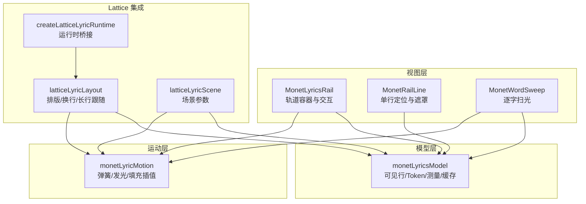
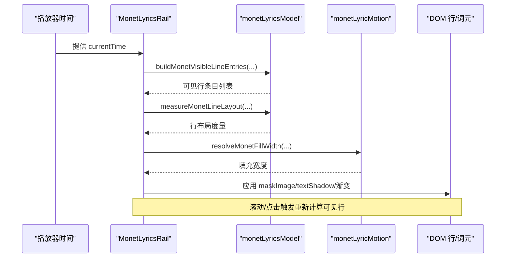
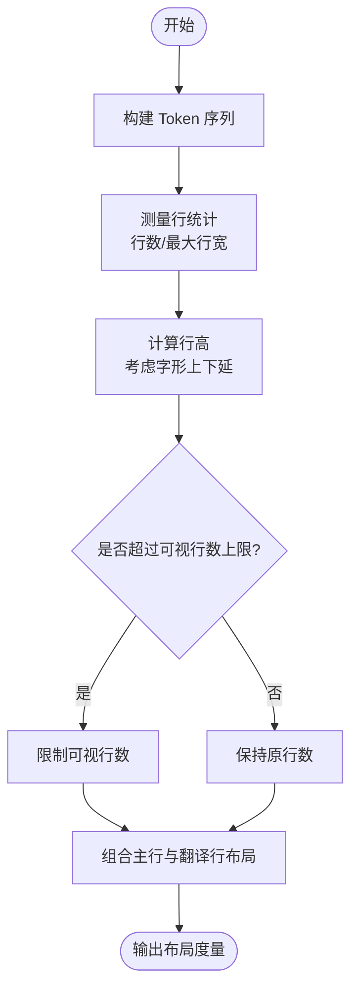
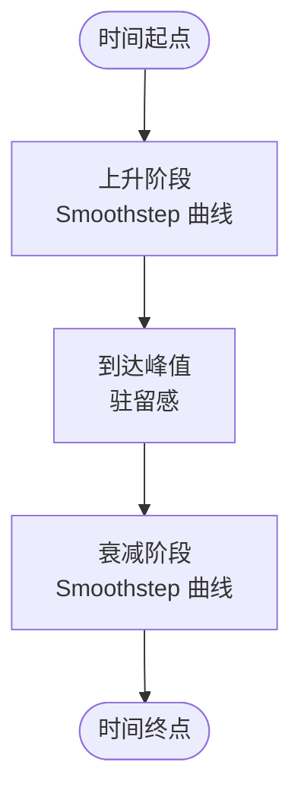
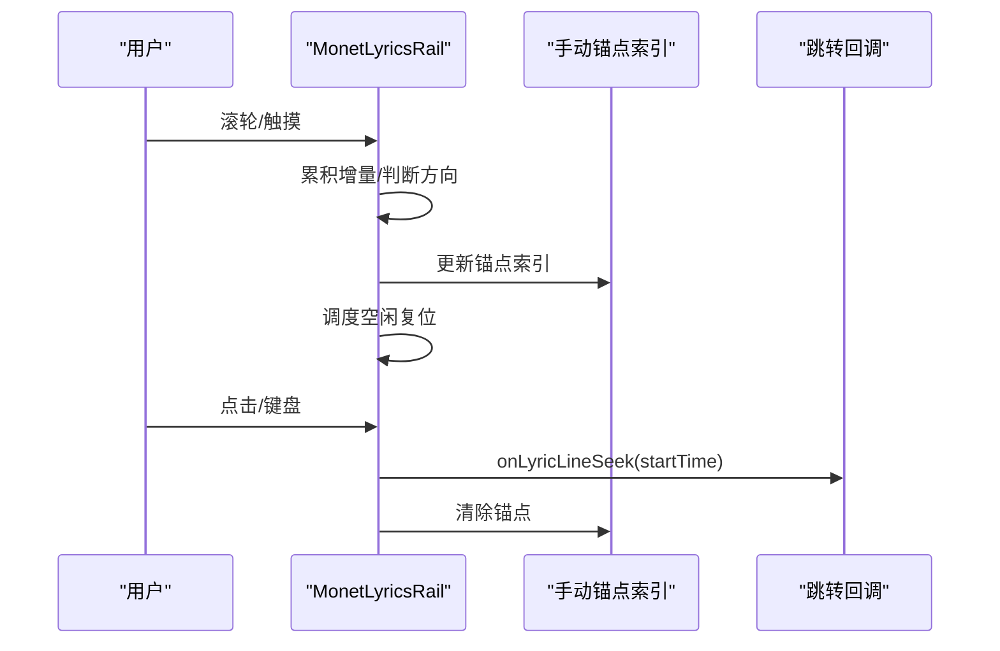
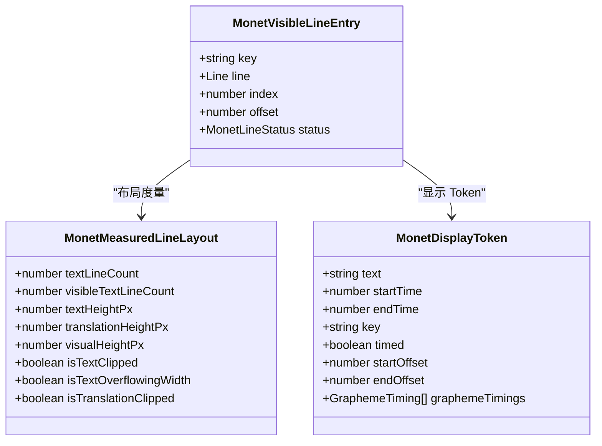
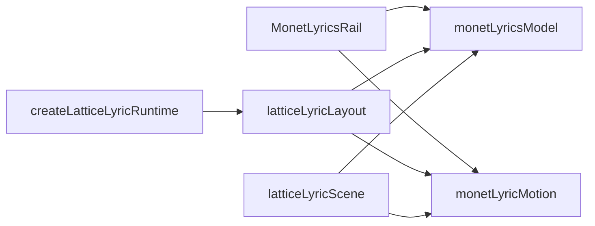

# 歌词轨道系统

<cite>
**本文引用的文件**   
- [MonetLyricsRail.tsx](file://src/components/visualizer/monet/MonetLyricsRail.tsx)
- [monetLyricsModel.ts](file://src/components/visualizer/monet/monetLyricsModel.ts)
- [monetLyricMotion.ts](file://src/components/visualizer/monet/monetLyricMotion.ts)
- [latticeLyricLayout.ts](file://src/components/app/lattice/lyrics/latticeLyricLayout.ts)
- [createLatticeLyricRuntime.ts](file://src/components/app/lattice/lyrics/createLatticeLyricRuntime.ts)
- [latticeLyricScene.ts](file://src/components/app/lattice/lyrics/latticeLyricScene.ts)
- [VisualizerMonet.tsx](file://src/components/visualizer/monet/VisualizerMonet.tsx)
- [App.tsx](file://src/App.tsx)
</cite>

## 目录
1. [引言](#引言)
2. [项目结构](#项目结构)
3. [核心组件](#核心组件)
4. [架构总览](#架构总览)
5. [详细组件分析](#详细组件分析)
6. [依赖关系分析](#依赖关系分析)
7. [性能考量](#性能考量)
8. [故障排查指南](#故障排查指南)
9. [结论](#结论)
10. [附录：定制与扩展指南](#附录定制与扩展指南)

## 引言
本技术文档聚焦 Monet 模式的歌词轨道系统，围绕以下目标展开：
- 歌词布局算法：文本测量、行高计算、换行与响应式适配。
- 动画曲线系统：时间轴同步、缓动函数、过渡效果。
- 交互响应机制：滚动控制、点击导航、键盘操作。
- 字体渲染优化：字体栈选择、文本阴影与发光、性能优化。
- 歌词高亮算法：当前行检测、渐入渐出、关键词着色。
- 开发指南：歌词样式定制与动画效果扩展。

## 项目结构
Monet 歌词轨道由“模型层 + 运动层 + 视图层”组成，并与 Lattice 歌词子系统共享部分布局与测量能力：
- 模型层：负责可见行窗口、显示 Token、词元时间线、文字测量与缓存。
- 运动层：提供滚动弹簧、缩放弹簧、发光包络、填充宽度插值等绝对时间驱动函数。
- 视图层：React 组件负责轨道容器、逐行定位、Mask 遮罩、滚动与点击交互。
- Lattice 集成：复用 Token 构建、图素偏移测量、长行跟随逻辑。

图表来源
- [MonetLyricsRail.tsx:32-1120](file://src/components/visualizer/monet/MonetLyricsRail.tsx#L32-L1120)
- [monetLyricsModel.ts:1-547](file://src/components/visualizer/monet/monetLyricsModel.ts#L1-L547)
- [monetLyricMotion.ts:1-60](file://src/components/visualizer/monet/monetLyricMotion.ts#L1-L60)
- [latticeLyricLayout.ts:1-102](file://src/components/app/lattice/lyrics/latticeLyricLayout.ts#L1-L102)
- [latticeLyricScene.ts:1-20](file://src/components/app/lattice/lyrics/latticeLyricScene.ts#L1-L20)
- [createLatticeLyricRuntime.ts:1-10](file://src/components/app/lattice/lyrics/createLatticeLyricRuntime.ts#L1-L10)

章节来源
- [MonetLyricsRail.tsx:32-1120](file://src/components/visualizer/monet/MonetLyricsRail.tsx#L32-L1120)
- [monetLyricsModel.ts:1-547](file://src/components/visualizer/monet/monetLyricsModel.ts#L1-L547)
- [monetLyricMotion.ts:1-60](file://src/components/visualizer/monet/monetLyricMotion.ts#L1-L60)
- [latticeLyricLayout.ts:1-102](file://src/components/app/lattice/lyrics/latticeLyricLayout.ts#L1-L102)

## 核心组件
- 轨道容器与交互：MonetLyricsRail 负责轨道尺寸、可见行构建、滚动/触摸事件、点击跳转、淡入淡出与模糊过渡。
- 模型与测量：monetLyricsModel 负责可见行窗口、Token 拆分、图素偏移测量、行高与换行统计、多类缓存管理。
- 动画包络：monetLyricMotion 提供滚动/缩放弹簧、发光强度曲线、按图素位置插值的填充宽度。
- Lattice 集成：latticeLyricLayout 复用 Token 与图素偏移，完成固定预算的字号选择、换行与长行跟随；scene/runtime 将 Monet 参数注入到 Lattice 渲染管线。

章节来源
- [MonetLyricsRail.tsx:35-1120](file://src/components/visualizer/monet/MonetLyricsRail.tsx#L35-L1120)
- [monetLyricsModel.ts:10-547](file://src/components/visualizer/monet/monetLyricsModel.ts#L10-L547)
- [monetLyricMotion.ts:1-60](file://src/components/visualizer/monet/monetLyricMotion.ts#L1-L60)
- [latticeLyricLayout.ts:1-102](file://src/components/app/lattice/lyrics/latticeLyricLayout.ts#L1-L102)

## 架构总览
Monet 歌词轨道采用“数据驱动 + 绝对时间包络”的架构：
- 数据流：播放时间 → 可见行窗口 → 行状态（等待/活跃/已过）→ 行布局测量 → 渲染。
- 动画流：framer-motion 的 MotionValue 绑定 currentTime，驱动 fillWidth、maskImage、textShadow 等属性。
- 交互流：滚轮/触摸累积步数 → 手动锚点索引 → 重建可见行 → 平滑过渡回自动滚动。

图表来源
- [MonetLyricsRail.tsx:870-906](file://src/components/visualizer/monet/MonetLyricsRail.tsx#L870-L906)
- [monetLyricsModel.ts:441-547](file://src/components/visualizer/monet/monetLyricsModel.ts#L441-L547)
- [monetLyricMotion.ts:24-47](file://src/components/visualizer/monet/monetLyricMotion.ts#L24-L47)

## 详细组件分析

### 歌词布局算法：文本测量、行高计算与响应式适配
- Token 构建与断行约束：
  - 使用 monetLyricsModel 的 Token 构建，保持标点与空格不被时序切分破坏。
  - 定时词元以 inline-block 渲染，断行仅在 Token 边界发生，避免 CJK 短语被错误截断。
- 行高与可视高度：
  - 通过 Canvas 测量实际字形上/下延，保证 descender 不溢出裁剪盒。
  - 主行与翻译行分别计算行高、内边距与可视行数上限，active 行不截断，非 active 行限制行数。
- 响应式大屏缩放：
  - 根据容器或视口宽度计算缩放因子，使列宽与字号比例恒定，避免换行行为突变。
- Lattice 集成：
  - 在固定预算下二分搜索字号，确保主行与翻译行同时满足高度与宽度预算。
  - wrapLatticeTokens 在 Token 边界换行，超长 Token 再退化为图素级换行，保留时序信息。
  - resolveLatticeLongLineOffset 让长行跟随当前活动词元所在行滚动，而不改变字号或丢弃文本。

图表来源
- [monetLyricsModel.ts:169-235](file://src/components/visualizer/monet/monetLyricsModel.ts#L169-L235)
- [monetLyricsModel.ts:490-547](file://src/components/visualizer/monet/monetLyricsModel.ts#L490-L547)
- [latticeLyricLayout.ts:12-35](file://src/components/app/lattice/lyrics/latticeLyricLayout.ts#L12-L35)
- [latticeLyricLayout.ts:42-85](file://src/components/app/lattice/lyrics/latticeLyricLayout.ts#L42-L85)

章节来源
- [monetLyricsModel.ts:169-235](file://src/components/visualizer/monet/monetLyricsModel.ts#L169-L235)
- [monetLyricsModel.ts:490-547](file://src/components/visualizer/monet/monetLyricsModel.ts#L490-L547)
- [latticeLyricLayout.ts:12-35](file://src/components/app/lattice/lyrics/latticeLyricLayout.ts#L12-L35)
- [latticeLyricLayout.ts:42-85](file://src/components/app/lattice/lyrics/latticeLyricLayout.ts#L42-L85)

### 动画曲线系统：时间轴同步、缓动函数与过渡效果
- 滚动与缩放弹簧：
  - 使用统一的 MONET_SCROLL_SPRING 与 MONET_SCALE_SPRING，为轨道位移与行缩放提供一致的物理感。
- 发光包络：
  - resolveMonetGlow 基于 Smoothstep(ease-in-out) 实现上升与衰减两段曲线，峰值后缓慢驻留再平滑消失。
- 填充宽度插值：
  - resolveMonetFillWidth 按图素时序插值，未带时序的图素按比例回退，保证短词元连续交接。
- 过渡效果：
  - 行进入/退出使用 Framer Motion 的 spring 与 easeOut，配合 blur 与 opacity 形成柔和过渡。

图表来源
- [monetLyricMotion.ts:9-22](file://src/components/visualizer/monet/monetLyricMotion.ts#L9-L22)
- [monetLyricMotion.ts:24-47](file://src/components/visualizer/monet/monetLyricMotion.ts#L24-L47)
- [MonetLyricsRail.tsx:100-105](file://src/components/visualizer/monet/MonetLyricsRail.tsx#L100-L105)

章节来源
- [monetLyricMotion.ts:1-60](file://src/components/visualizer/monet/monetLyricMotion.ts#L1-L60)
- [MonetLyricsRail.tsx:100-105](file://src/components/visualizer/monet/MonetLyricsRail.tsx#L100-L105)

### 交互响应机制：滚动控制、点击导航与键盘操作
- 滚轮与触摸滚动：
  - 滚轮/触摸增量累积，达到阈值后步进一行，方向反转时重置累积器，避免误判。
  - 手动滚动期间禁用入场动画，提升稳定性；空闲超时后恢复自动滚动。
- 点击与键盘导航：
  - 可点击行支持 Enter/Space 触发跳转，调用 onLyricLineSeek 并清除手动滚动锚点。
- 滚动区域与遮罩：
  - 轨道顶部/底部渐变遮罩，避免首尾行突兀出现；左右边缘对超长 Token 做柔化遮罩。

图表来源
- [MonetLyricsRail.tsx:947-1017](file://src/components/visualizer/monet/MonetLyricsRail.tsx#L947-L1017)
- [MonetLyricsRail.tsx:1019-1047](file://src/components/visualizer/monet/MonetLyricsRail.tsx#L1019-L1047)

章节来源
- [MonetLyricsRail.tsx:947-1017](file://src/components/visualizer/monet/MonetLyricsRail.tsx#L947-L1017)
- [MonetLyricsRail.tsx:1019-1047](file://src/components/visualizer/monet/MonetLyricsRail.tsx#L1019-L1047)

### 字体渲染优化：字体栈选择、文本阴影与性能优化
- 字体栈与字重：
  - 主行与翻译行分别解析主题字体栈与字重，确保不同语言/副标题有合适字体族。
- 文本阴影与发光：
  - 活跃行添加背景色阴影，词元扫光叠加双层 text-shadow，半径随字号与是否副歌调整。
- 性能优化：
  - 使用 OffscreenCanvas 优先测量，降级到普通 Canvas。
  - 维护图素偏移、垂直指标、布局等多类缓存，并在 webfont 加载完成后清空缓存，避免错配。
  - 大字符集使用 Intl.Segmenter 进行图素分割，提高 CJK 处理准确性。

章节来源
- [MonetLyricsRail.tsx:856-869](file://src/components/visualizer/monet/MonetLyricsRail.tsx#L856-L869)
- [MonetLyricsRail.tsx:579-591](file://src/components/visualizer/monet/MonetLyricsRail.tsx#L579-L591)
- [monetLyricsModel.ts:105-111](file://src/components/visualizer/monet/monetLyricsModel.ts#L105-L111)
- [monetLyricsModel.ts:193-248](file://src/components/visualizer/monet/monetLyricsModel.ts#L193-L248)

### 歌词高亮算法：当前行检测、渐入渐出与关键词着色
- 当前行检测：
  - 依据 activeIndex 与 currentTime 判定行状态 waiting/active/passed，用于视觉层级与透明度。
- 渐入渐出：
  - 非活跃行按距离衰减透明度与缩放，等待行与已过行使用不同衰减曲线。
- 关键词着色：
  - 通过 wordColorMatchers 与 token 颜色映射，结合 isChorus 混合主题强调色，实现关键词高亮。

图表来源
- [monetLyricsModel.ts:12-55](file://src/components/visualizer/monet/monetLyricsModel.ts#L12-L55)
- [monetLyricsModel.ts:29-55](file://src/components/visualizer/monet/monetLyricsModel.ts#L29-L55)

章节来源
- [monetLyricsModel.ts:301-328](file://src/components/visualizer/monet/monetLyricsModel.ts#L301-L328)
- [MonetLyricsRail.tsx:122-174](file://src/components/visualizer/monet/MonetLyricsRail.tsx#L122-L174)
- [MonetLyricsRail.tsx:432-504](file://src/components/visualizer/monet/MonetLyricsRail.tsx#L432-L504)

## 依赖关系分析
- 组件耦合：
  - MonetLyricsRail 依赖 monetLyricsModel 提供可见行与布局度量，依赖 monetLyricMotion 提供动画包络。
  - latticeLyricLayout 复用 monetLyricsModel 的 Token 与图素偏移，注入到 Lattice 渲染管线。
- 外部依赖：
  - @chenglou/pretext 用于富文本行布局与统计。
  - framer-motion 提供 MotionValue 与动画过渡。
  - Intl.Segmenter 用于图素分割。

图表来源
- [MonetLyricsRail.tsx:1-31](file://src/components/visualizer/monet/MonetLyricsRail.tsx#L1-L31)
- [latticeLyricLayout.ts:1-5](file://src/components/app/lattice/lyrics/latticeLyricLayout.ts#L1-L5)
- [latticeLyricScene.ts:1-4](file://src/components/app/lattice/lyrics/latticeLyricScene.ts#L1-L4)
- [createLatticeLyricRuntime.ts:1-10](file://src/components/app/lattice/lyrics/createLatticeLyricRuntime.ts#L1-L10)

章节来源
- [MonetLyricsRail.tsx:1-31](file://src/components/visualizer/monet/MonetLyricsRail.tsx#L1-L31)
- [latticeLyricLayout.ts:1-5](file://src/components/app/lattice/lyrics/latticeLyricLayout.ts#L1-L5)
- [latticeLyricScene.ts:1-4](file://src/components/app/lattice/lyrics/latticeLyricScene.ts#L1-L4)
- [createLatticeLyricRuntime.ts:1-10](file://src/components/app/lattice/lyrics/createLatticeLyricRuntime.ts#L1-L10)

## 性能考量
- 测量与缓存：
  - 图素偏移、垂直指标、布局度量均使用 Map 缓存，并按容量淘汰最旧项。
  - webfont 加载完成后清空测量缓存，避免 fallback 字体导致的错位。
- 渲染路径：
  - 使用 Mask 与渐变替代复杂 DOM 结构，减少重排与重绘。
  - 手动滚动期间禁用入场动画，降低帧率抖动。
- 大屏适配：
  - 大容器宽度下整体缩放，保持列宽与字号比例，避免换行突变。

章节来源
- [monetLyricsModel.ts:105-111](file://src/components/visualizer/monet/monetLyricsModel.ts#L105-L111)
- [monetLyricsModel.ts:244-248](file://src/components/visualizer/monet/monetLyricsModel.ts#L244-L248)
- [monetLyricsModel.ts:130-145](file://src/components/visualizer/monet/monetLyricsModel.ts#L130-L145)
- [MonetLyricsRail.tsx:878-906](file://src/components/visualizer/monet/MonetLyricsRail.tsx#L878-L906)

## 故障排查指南
- 字体加载导致布局错乱：
  - 现象：webfont 加载前后换行不一致，翻译行掉落到下一行。
  - 处理：监听字体 epoch 变化，清空测量缓存与布局缓存，强制重新测量。
- 长词元被截断：
  - 现象：超长 Token 被 overflow:hidden 直接切字。
  - 处理：启用右侧边缘柔化遮罩，避免中文字符被硬切。
- 滚动卡顿或误判：
  - 现象：滚轮/触摸方向反转导致步数异常。
  - 处理：方向反转时重置累积器，设置最小步长阈值，空闲超时复位。

章节来源
- [MonetLyricsRail.tsx:878-906](file://src/components/visualizer/monet/MonetLyricsRail.tsx#L878-L906)
- [MonetLyricsRail.tsx:947-1017](file://src/components/visualizer/monet/MonetLyricsRail.tsx#L947-L1017)
- [monetLyricsModel.ts:244-248](file://src/components/visualizer/monet/monetLyricsModel.ts#L244-L248)

## 结论
Monet 歌词轨道系统通过“模型-运动-视图”分层，实现了高精度文本测量、稳定动画曲线与流畅交互体验。其设计重点在于：
- 精确的 Token 与图素级测量，保证 CJK 与英文混排的稳定性。
- 基于绝对时间的包络函数，确保播放时间与视觉效果严格同步。
- 完善的缓存策略与性能优化，适应大屏与高分辨率场景。
- 可扩展的交互与样式体系，便于二次开发与主题定制。

## 附录：定制与扩展指南
- 歌词样式定制：
  - 修改主题字体栈与字重，影响主行与翻译行的字体表现。
  - 调整关键词着色规则，结合 isChorus 混合强调色。
- 动画效果扩展：
  - 调整滚动/缩放弹簧参数，改变轨道与行的物理感。
  - 自定义发光包络曲线，增强或减弱驻留与衰减效果。
- 布局与换行：
  - 在 latticeLyricLayout 中调整预算与字号搜索范围，适配不同屏幕比例。
  - 使用 wrapLatticeTokens 的图素级换行逻辑，保留时序信息的同时避免误切。
- 集成与桥接：
  - 在 createLatticeLyricRuntime 中注入 Monet 参数，确保 Lattice 渲染管线正确消费。
  - 在 App.tsx 中提供 onLyricLineSeek 回调，实现点击/键盘跳转到指定歌词时间。

章节来源
- [MonetLyricsRail.tsx:856-869](file://src/components/visualizer/monet/MonetLyricsRail.tsx#L856-L869)
- [MonetLyricsRail.tsx:432-504](file://src/components/visualizer/monet/MonetLyricsRail.tsx#L432-L504)
- [monetLyricMotion.ts:1-60](file://src/components/visualizer/monet/monetLyricMotion.ts#L1-L60)
- [latticeLyricLayout.ts:12-35](file://src/components/app/lattice/lyrics/latticeLyricLayout.ts#L12-L35)
- [createLatticeLyricRuntime.ts:1-10](file://src/components/app/lattice/lyrics/createLatticeLyricRuntime.ts#L1-L10)
- [App.tsx:2050-2109](file://src/App.tsx#L2050-L2109)