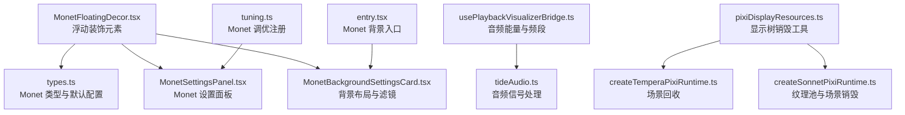
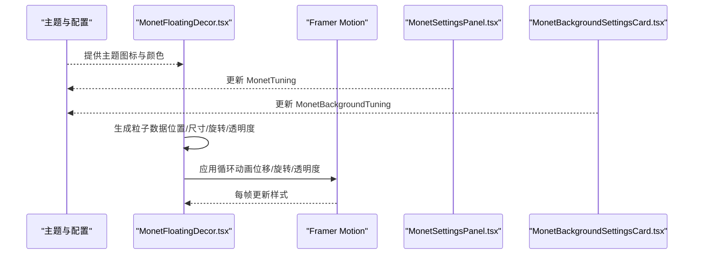
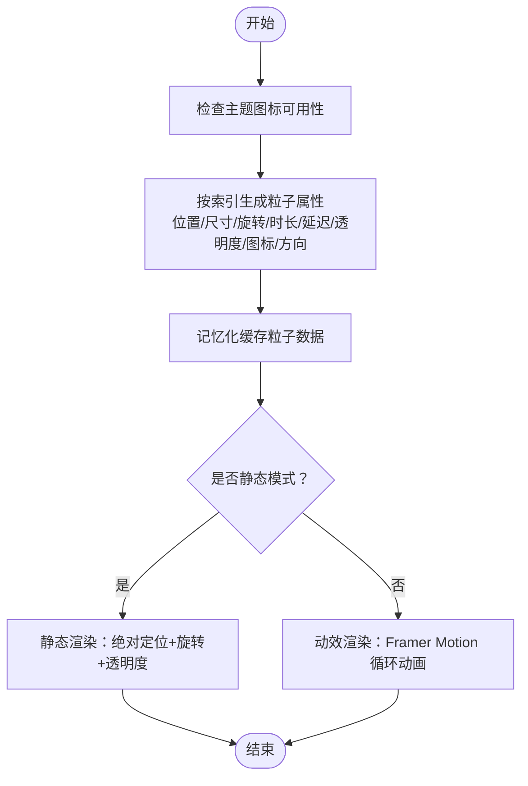
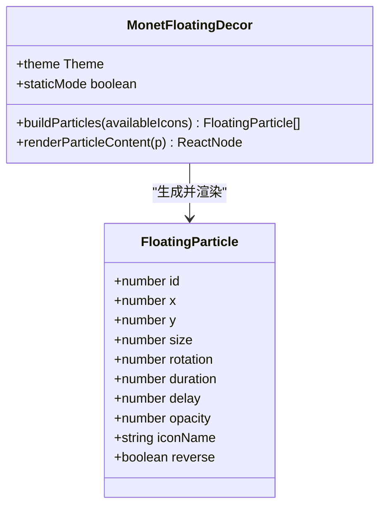
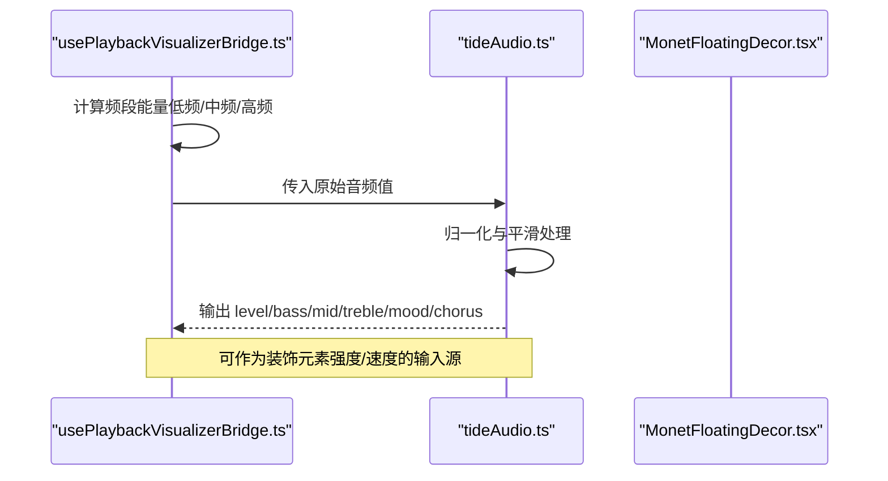
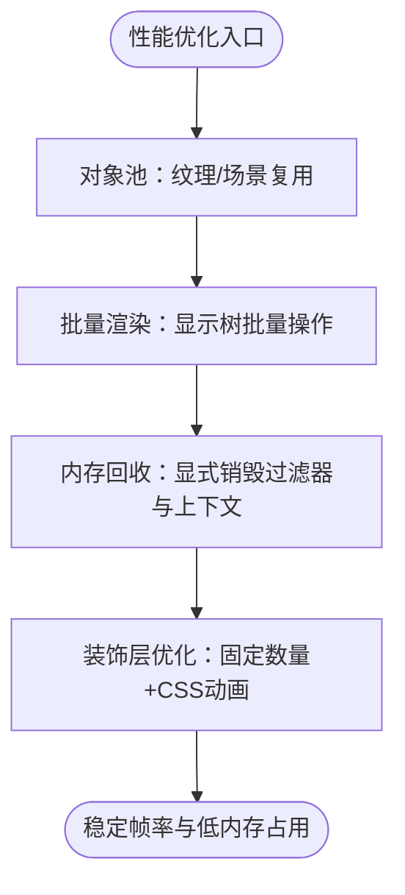
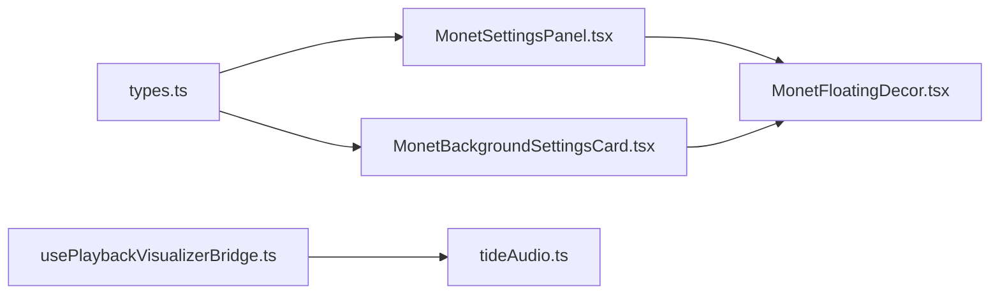

# 浮动装饰元素

<cite>
**本文引用的文件**   
- [MonetFloatingDecor.tsx](file://src/components/visualizer/monet/MonetFloatingDecor.tsx)
- [types.ts](file://src/types.ts)
- [MonetSettingsPanel.tsx](file://src/components/visualizer/monet/MonetSettingsPanel.tsx)
- [MonetBackgroundSettingsCard.tsx](file://src/components/visualizer/backgrounds/monet/MonetBackgroundSettingsCard.tsx)
- [entry.tsx](file://src/components/visualizer/backgrounds/monet/entry.tsx)
- [tuning.ts](file://src/components/visualizer/monet/tuning.ts)
- [usePlaybackVisualizerBridge.ts](file://src/hooks/usePlaybackVisualizerBridge.ts)
- [tideAudio.ts](file://src/components/visualizer/backgrounds/tide/tideAudio.ts)
- [pixiDisplayResources.ts](file://src/components/visualizer/pixiDisplayResources.ts)
- [createTemperaPixiRuntime.ts](file://src/components/visualizer/tempera/createTemperaPixiRuntime.ts)
- [createSonnetPixiRuntime.ts](file://src/components/visualizer/sonnet/createSonnetPixiRuntime.ts)
</cite>

## 目录
1. [引言](#引言)
2. [项目结构](#项目结构)
3. [核心组件](#核心组件)
4. [架构总览](#架构总览)
5. [详细组件分析](#详细组件分析)
6. [依赖关系分析](#依赖关系分析)
7. [性能考虑](#性能考虑)
8. [故障排查指南](#故障排查指南)
9. [结论](#结论)
10. [附录：配置与扩展](#附录配置与扩展)

## 引言
本文聚焦 Monet 可视化模式下的“浮动装饰元素”子系统，系统性说明其生成算法、动画系统、音频同步机制、性能优化策略以及配置与扩展方式。该子系统以轻量 DOM + CSS 动效为主，配合主题图标或花瓣形状，为 Monet 背景提供柔和的漂浮氛围层；同时给出与音频数据桥接、对象池与批量销毁等通用渲染优化实践，帮助你在保持视觉表现的同时控制内存与帧率开销。

## 项目结构
Monet 浮动装饰元素位于可视化子系统中，主要涉及以下文件：
- 装饰元素渲染：`MonetFloatingDecor.tsx`
- 类型与默认调优：`types.ts`
- Monet 设置面板（含字体、头像、频谱等）：`MonetSettingsPanel.tsx`
- Monet 背景设置卡片（布局、漂移、模糊、色罩等）：`MonetBackgroundSettingsCard.tsx`
- Monet 背景入口与快捷控件：`entry.tsx`
- Monet 调优注册：`tuning.ts`
- 音频能量与频段采样桥接：`usePlaybackVisualizerBridge.ts`
- 音频信号处理示例（TIDE 参考实现）：`tideAudio.ts`
- Pixi 显示树销毁工具：`pixiDisplayResources.ts`
- 其他可视化运行时中的场景回收与资源释放：`createTemperaPixiRuntime.ts`、`createSonnetPixiRuntime.ts`

**图表来源**
- [MonetFloatingDecor.tsx:1-140](file://src/components/visualizer/monet/MonetFloatingDecor.tsx#L1-L140)
- [types.ts:919-1061](file://src/types.ts#L919-L1061)
- [MonetSettingsPanel.tsx:170-362](file://src/components/visualizer/monet/MonetSettingsPanel.tsx#L170-L362)
- [MonetBackgroundSettingsCard.tsx:294-458](file://src/components/visualizer/backgrounds/monet/MonetBackgroundSettingsCard.tsx#L294-L458)
- [entry.tsx:48-71](file://src/components/visualizer/backgrounds/monet/entry.tsx#L48-L71)
- [tuning.ts:1-4](file://src/components/visualizer/monet/tuning.ts#L1-L4)
- [usePlaybackVisualizerBridge.ts:93-113](file://src/hooks/usePlaybackVisualizerBridge.ts#L93-L113)
- [tideAudio.ts:37-136](file://src/components/visualizer/backgrounds/tide/tideAudio.ts#L37-L136)
- [pixiDisplayResources.ts:31-55](file://src/components/visualizer/pixiDisplayResources.ts#L31-L55)
- [createTemperaPixiRuntime.ts:463-495](file://src/components/visualizer/tempera/createTemperaPixiRuntime.ts#L463-L495)
- [createSonnetPixiRuntime.ts:372-406](file://src/components/visualizer/sonnet/createSonnetPixiRuntime.ts#L372-L406)

**章节来源**
- [MonetFloatingDecor.tsx:1-140](file://src/components/visualizer/monet/MonetFloatingDecor.tsx#L1-L140)
- [types.ts:919-1061](file://src/types.ts#L919-L1061)

## 核心组件
- 浮动装饰元素渲染器：负责根据主题图标或花瓣形状生成固定数量的粒子，并应用位置、尺寸、旋转、透明度与循环动画。
- 主题与配置：通过 `Theme` 与 `MonetTuning`、`MonetBackgroundTuning` 控制视觉风格、背景布局与后处理参数。
- 设置面板：暴露字体缩放、关键词着色、描述展示、头像来源与样式、音频可视化开关与样式等选项。
- 背景设置卡片：提供背景布局、偏移、漂移强度、模糊、饱和度、灰度、遮罩不透明度、色罩模式与自定义颜色等调节项。

**章节来源**
- [MonetFloatingDecor.tsx:27-88](file://src/components/visualizer/monet/MonetFloatingDecor.tsx#L27-L88)
- [types.ts:1035-1061](file://src/types.ts#L1035-L1061)
- [MonetSettingsPanel.tsx:219-358](file://src/components/visualizer/monet/MonetSettingsPanel.tsx#L219-L358)
- [MonetBackgroundSettingsCard.tsx:294-458](file://src/components/visualizer/backgrounds/monet/MonetBackgroundSettingsCard.tsx#L294-L458)

## 架构总览
Monet 浮动装饰元素采用“静态数据生成 + 动效框架驱动”的轻量架构：
- 数据层：基于主题图标列表生成稳定的粒子数组，包含位置、尺寸、旋转、时长、延迟、透明度、是否反向等属性。
- 渲染层：使用 React + Framer Motion 对每个粒子进行绝对定位与循环动画（位移、旋转、透明度）。
- 配置层：通过 `MonetTuning` 与 `MonetBackgroundTuning` 控制整体视觉风格与背景效果；设置面板与背景卡片提供用户可调参数。
- 音频层：可选地通过音频桥接获取频段能量，用于更高级的视觉反馈（当前装饰层未直接绑定音频，但可复用桥接逻辑）。

**图表来源**
- [MonetFloatingDecor.tsx:47-88](file://src/components/visualizer/monet/MonetFloatingDecor.tsx#L47-L88)
- [MonetFloatingDecor.tsx:111-136](file://src/components/visualizer/monet/MonetFloatingDecor.tsx#L111-L136)
- [MonetSettingsPanel.tsx:219-358](file://src/components/visualizer/monet/MonetSettingsPanel.tsx#L219-L358)
- [MonetBackgroundSettingsCard.tsx:294-458](file://src/components/visualizer/backgrounds/monet/MonetBackgroundSettingsCard.tsx#L294-L458)

## 详细组件分析

### 装饰元素生成算法
- 粒子数量：固定为 10 个，保证视觉密度稳定且开销可控。
- 随机位置计算：使用线性同余风格的伪随机公式，将索引映射到屏幕百分比范围，避免重叠与边缘溢出。
- 尺寸分布：基础尺寸加上基于索引的增量，形成自然的大小差异。
- 透明度控制：在较低区间内变化，确保装饰元素作为氛围层不抢主内容。
- 图标选择：优先使用主题提供的图标；若无可用图标则回退到樱花花瓣 SVG。
- 稳定性：粒子数据通过记忆化缓存，仅在主题图标集合变化时重建，减少重渲染成本。

**图表来源**
- [MonetFloatingDecor.tsx:47-88](file://src/components/visualizer/monet/MonetFloatingDecor.tsx#L47-L88)
- [MonetFloatingDecor.tsx:90-109](file://src/components/visualizer/monet/MonetFloatingDecor.tsx#L90-L109)
- [MonetFloatingDecor.tsx:111-136](file://src/components/visualizer/monet/MonetFloatingDecor.tsx#L111-L136)

**章节来源**
- [MonetFloatingDecor.tsx:47-88](file://src/components/visualizer/monet/MonetFloatingDecor.tsx#L47-L88)
- [MonetFloatingDecor.tsx:90-136](file://src/components/visualizer/monet/MonetFloatingDecor.tsx#L90-L136)

### 动画系统：轨迹、旋转与生命周期
- 浮动轨迹：每个粒子拥有独立的 Y/X 位移序列，并根据 `reverse` 标志决定正向或反向路径，形成交错漂浮感。
- 旋转效果：初始旋转角度叠加周期性增量，使粒子在漂浮过程中缓慢自转。
- 透明度波动：透明度在基础值附近波动，增强呼吸感。
- 生命周期管理：动画无限循环，无显式销毁；静态模式下仅应用静态样式，不参与动效框架。

**图表来源**
- [MonetFloatingDecor.tsx:27-38](file://src/components/visualizer/monet/MonetFloatingDecor.tsx#L27-L38)
- [MonetFloatingDecor.tsx:47-88](file://src/components/visualizer/monet/MonetFloatingDecor.tsx#L47-L88)
- [MonetFloatingDecor.tsx:111-136](file://src/components/visualizer/monet/MonetFloatingDecor.tsx#L111-L136)

**章节来源**
- [MonetFloatingDecor.tsx:111-136](file://src/components/visualizer/monet/MonetFloatingDecor.tsx#L111-L136)

### 与音频数据的同步机制
虽然当前浮动装饰层未直接绑定音频数据，但项目中提供了成熟的音频桥接与信号处理实现，可作为扩展参考：
- 音频能量与频段采样：通过 `usePlaybackVisualizerBridge` 获取低频、中频、高频等频段能量，并进行归一化与增强。
- 音频信号处理：`tideAudio.ts` 展示了响度、鼓点、情绪、段落状态等信号的平滑与迟滞处理，可用于节奏匹配与能量检测。
- 频率响应：通过对不同频段求平均能量，得到频率响应曲线，可用于驱动视觉元素的强度或速度。

**图表来源**
- [usePlaybackVisualizerBridge.ts:93-113](file://src/hooks/usePlaybackVisualizerBridge.ts#L93-L113)
- [tideAudio.ts:37-136](file://src/components/visualizer/backgrounds/tide/tideAudio.ts#L37-L136)

**章节来源**
- [usePlaybackVisualizerBridge.ts:93-113](file://src/hooks/usePlaybackVisualizerBridge.ts#L93-L113)
- [tideAudio.ts:37-136](file://src/components/visualizer/backgrounds/tide/tideAudio.ts#L37-L136)

### 性能优化策略
- 对象池：在 Pixi 相关运行时中，通过纹理池与场景缓存复用资源，避免频繁创建销毁导致的抖动。
- 批量渲染：使用显示树批量移除与销毁，减少逐节点操作开销。
- 内存回收：显式调用销毁方法，清理过滤器、图形上下文与 GPU 缓冲，防止内存泄漏。
- 装饰层优化：固定粒子数量、使用 CSS 合成层动画、避免复杂滤镜，降低主线程压力。

**图表来源**
- [pixiDisplayResources.ts:31-55](file://src/components/visualizer/pixiDisplayResources.ts#L31-L55)
- [createTemperaPixiRuntime.ts:463-495](file://src/components/visualizer/tempera/createTemperaPixiRuntime.ts#L463-L495)
- [createSonnetPixiRuntime.ts:372-406](file://src/components/visualizer/sonnet/createSonnetPixiRuntime.ts#L372-L406)

**章节来源**
- [pixiDisplayResources.ts:31-55](file://src/components/visualizer/pixiDisplayResources.ts#L31-L55)
- [createTemperaPixiRuntime.ts:463-495](file://src/components/visualizer/tempera/createTemperaPixiRuntime.ts#L463-L495)
- [createSonnetPixiRuntime.ts:372-406](file://src/components/visualizer/sonnet/createSonnetPixiRuntime.ts#L372-L406)

## 依赖关系分析
- `MonetFloatingDecor.tsx` 依赖主题图标与颜色，并通过 Framer Motion 实现动画。
- `MonetSettingsPanel.tsx` 与 `MonetBackgroundSettingsCard.tsx` 分别管理 Monet 主体调优与背景调优，最终影响渲染结果。
- `types.ts` 定义了所有调优接口与默认值，是配置层的契约。
- 音频桥接与信号处理模块为未来扩展提供基础能力。

**图表来源**
- [types.ts:919-1061](file://src/types.ts#L919-L1061)
- [MonetSettingsPanel.tsx:219-358](file://src/components/visualizer/monet/MonetSettingsPanel.tsx#L219-L358)
- [MonetBackgroundSettingsCard.tsx:294-458](file://src/components/visualizer/backgrounds/monet/MonetBackgroundSettingsCard.tsx#L294-L458)
- [MonetFloatingDecor.tsx:1-140](file://src/components/visualizer/monet/MonetFloatingDecor.tsx#L1-L140)
- [usePlaybackVisualizerBridge.ts:93-113](file://src/hooks/usePlaybackVisualizerBridge.ts#L93-L113)
- [tideAudio.ts:37-136](file://src/components/visualizer/backgrounds/tide/tideAudio.ts#L37-L136)

**章节来源**
- [types.ts:919-1061](file://src/types.ts#L919-L1061)
- [MonetFloatingDecor.tsx:1-140](file://src/components/visualizer/monet/MonetFloatingDecor.tsx#L1-L140)

## 性能考虑
- 控制粒子数量：当前固定为 10 个，适合大多数设备；如需更多粒子，建议分屏或按需加载。
- 避免过度滤镜：背景模糊、饱和度、灰度等后处理应适度，避免高 DPI 设备上的性能瓶颈。
- 使用合成层动画：Framer Motion 的 CSS 动画由浏览器合成层处理，减少重排重绘。
- 监控内存使用：定期检查 Pixi 显示树与纹理池的释放情况，避免长时间运行后的内存增长。

[本节为通用指导，无需具体文件引用]

## 故障排查指南
- 装饰元素不显示：检查主题图标是否可用，或确认静态模式是否正确切换。
- 动画卡顿：降低背景模糊与色罩强度，或关闭不必要的音频可视化。
- 内存泄漏：确保 Pixi 显示树与过滤器被正确销毁，特别是在场景切换时。
- 音频不同步：验证音频桥接返回值是否在有效范围，并检查信号平滑参数。

**章节来源**
- [MonetFloatingDecor.tsx:90-136](file://src/components/visualizer/monet/MonetFloatingDecor.tsx#L90-L136)
- [pixiDisplayResources.ts:31-55](file://src/components/visualizer/pixiDisplayResources.ts#L31-L55)

## 结论
Monet 浮动装饰元素以简洁的数据生成与动效驱动为核心，结合主题与配置系统，提供稳定且可定制的视觉氛围层。通过音频桥接与通用性能优化策略，可在保持流畅体验的同时支持进一步扩展。建议在开发中优先关注粒子数量、后处理强度与资源释放，以获得最佳的性能与视觉效果平衡。

[本节为总结性内容，无需具体文件引用]

## 附录：配置与扩展
- 配置项概览：
  - `MonetTuning`：关键词着色、描述展示、音频可视化、字体缩放、头像来源与样式等。
  - `MonetBackgroundTuning`：背景来源、布局、模糊、饱和度、灰度、遮罩不透明度、色罩模式与自定义颜色、漂移强度等。
- 扩展建议：
  - 将音频能量接入装饰元素：通过 `usePlaybackVisualizerBridge` 获取频段能量，动态调整粒子大小、速度或透明度。
  - 增加粒子类型：扩展 `FloatingParticle` 以支持更多形状或纹理，并结合主题调色板。
  - 引入对象池：对于大量粒子场景，可借鉴 Pixi 运行时中的纹理池与场景缓存机制。

**章节来源**
- [types.ts:1035-1061](file://src/types.ts#L1035-L1061)
- [MonetSettingsPanel.tsx:219-358](file://src/components/visualizer/monet/MonetSettingsPanel.tsx#L219-L358)
- [MonetBackgroundSettingsCard.tsx:294-458](file://src/components/visualizer/backgrounds/monet/MonetBackgroundSettingsCard.tsx#L294-L458)