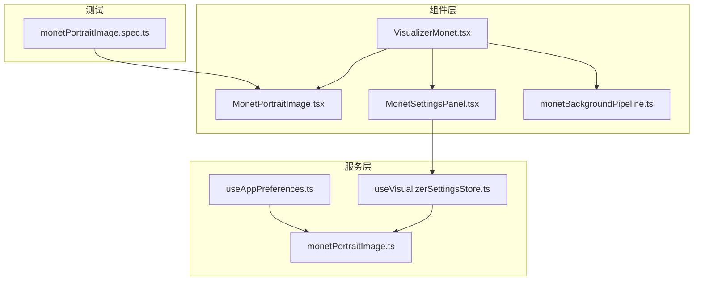
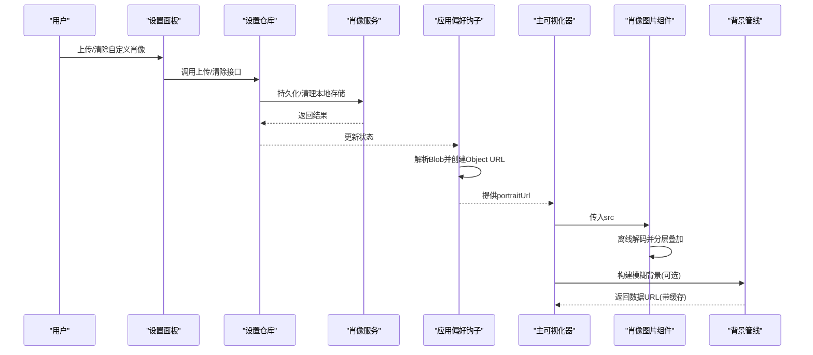
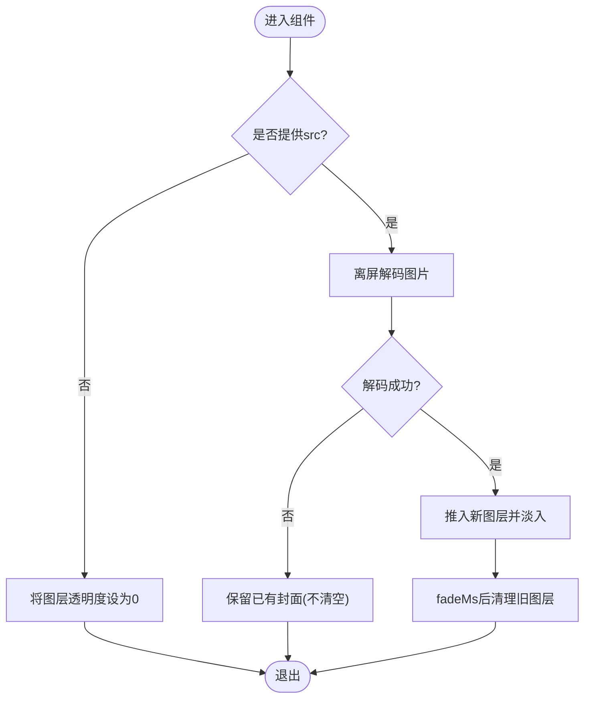
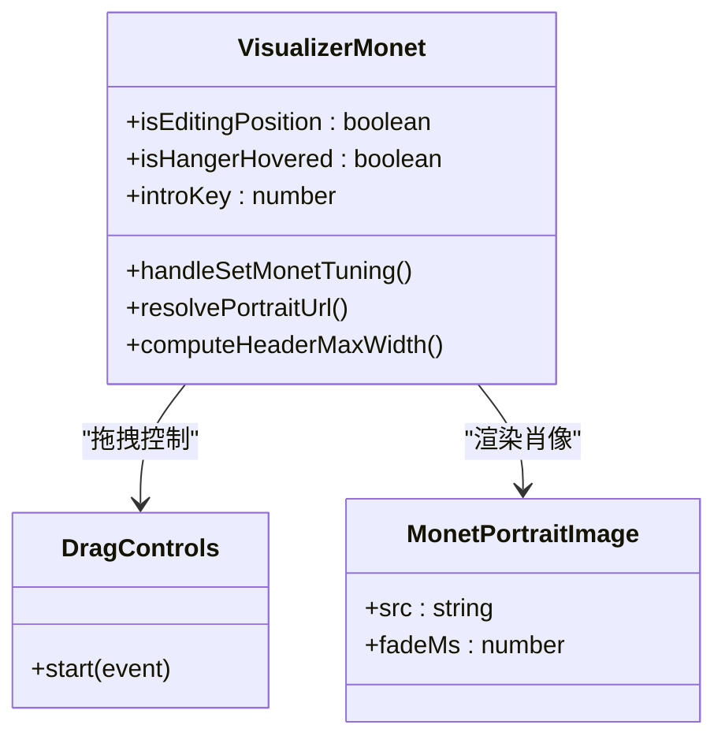
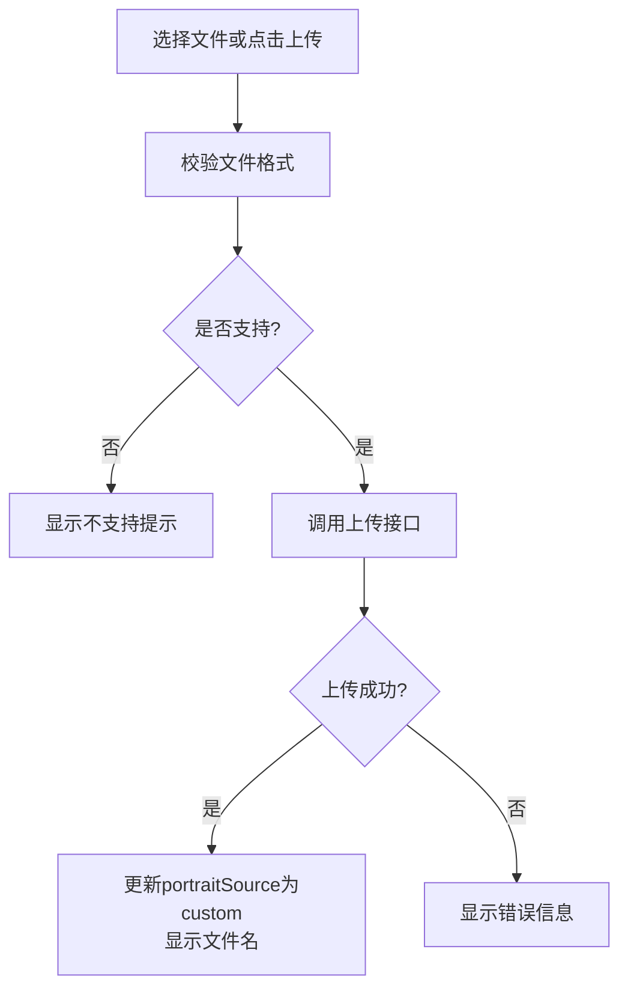
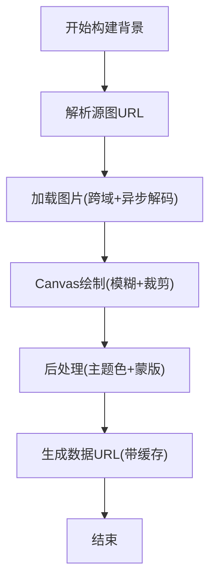
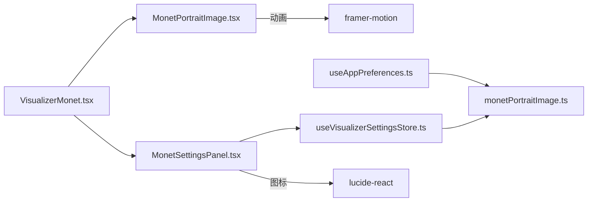

# 肖像图像处理

<cite>
**本文引用的文件**   
- [MonetPortraitImage.tsx](file://src/components/visualizer/monet/MonetPortraitImage.tsx)
- [VisualizerMonet.tsx](file://src/components/visualizer/monet/VisualizerMonet.tsx)
- [MonetSettingsPanel.tsx](file://src/components/visualizer/monet/MonetSettingsPanel.tsx)
- [monetBackgroundPipeline.ts](file://src/components/visualizer/monet/monetBackgroundPipeline.ts)
- [monetPortraitImage.ts](file://src/services/monetPortraitImage.ts)
- [useAppPreferences.ts](file://src/hooks/useAppPreferences.ts)
- [useVisualizerSettingsStore.ts](file://src/stores/useVisualizerSettingsStore.ts)
- [monetPortraitImage.spec.ts](file://test/component/monetPortraitImage.spec.ts)
</cite>

## 目录
1. [简介](#简介)
2. [项目结构](#项目结构)
3. [核心组件](#核心组件)
4. [架构总览](#架构总览)
5. [详细组件分析](#详细组件分析)
6. [依赖关系分析](#依赖关系分析)
7. [性能与内存优化](#性能与内存优化)
8. [故障排查指南](#故障排查指南)
9. [结论](#结论)
10. [附录：扩展与自定义样式](#附录扩展与自定义样式)

## 简介
本技术文档聚焦 Monet 模式的肖像图像处理组件，围绕以下目标展开：
- 图像加载与缓存机制：预加载策略、解码顺序、内存管理与错误处理。
- 图像变换算法：缩放、裁剪与自适应布局。
- 视觉效果实现：阴影渲染、边框样式与动态调整。
- 拖拽交互功能：位置编辑、边界约束与状态持久化。
- 不同肖像样式的渲染逻辑：方形模式与传统模式的区别。
- 图像处理优化与自定义样式扩展的技术指南。

## 项目结构
Monet 肖像相关代码主要分布在可视化器子模块中，包含组件层、服务层、设置面板与测试用例：
- 组件层：负责 UI 渲染、交互动画与视觉样式。
- 服务层：封装本地存储、URL 生成与资源生命周期管理。
- 设置面板：提供上传、清除、样式切换等用户操作入口。
- 测试用例：覆盖切歌交叉淡入、失效 URL 容错等行为。

**图表来源**
- [VisualizerMonet.tsx:1-200](file://src/components/visualizer/monet/VisualizerMonet.tsx#L1-L200)
- [MonetPortraitImage.tsx:1-103](file://src/components/visualizer/monet/MonetPortraitImage.tsx#L1-L103)
- [MonetSettingsPanel.tsx:178-333](file://src/components/visualizer/monet/MonetSettingsPanel.tsx#L178-L333)
- [monetBackgroundPipeline.ts:315-361](file://src/components/visualizer/monet/monetBackgroundPipeline.ts#L315-L361)
- [monetPortraitImage.ts:1-31](file://src/services/monetPortraitImage.ts#L1-L31)
- [useAppPreferences.ts:349-402](file://src/hooks/useAppPreferences.ts#L349-L402)
- [useVisualizerSettingsStore.ts:707-739](file://src/stores/useVisualizerSettingsStore.ts#L707-L739)
- [monetPortraitImage.spec.ts:1-27](file://test/component/monetPortraitImage.spec.ts#L1-L27)

**章节来源**
- [VisualizerMonet.tsx:1-200](file://src/components/visualizer/monet/VisualizerMonet.tsx#L1-L200)
- [MonetPortraitImage.tsx:1-103](file://src/components/visualizer/monet/MonetPortraitImage.tsx#L1-L103)
- [MonetSettingsPanel.tsx:178-333](file://src/components/visualizer/monet/MonetSettingsPanel.tsx#L178-L333)
- [monetBackgroundPipeline.ts:315-361](file://src/components/visualizer/monet/monetBackgroundPipeline.ts#L315-L361)
- [monetPortraitImage.ts:1-31](file://src/services/monetPortraitImage.ts#L1-L31)
- [useAppPreferences.ts:349-402](file://src/hooks/useAppPreferences.ts#L349-L402)
- [useVisualizerSettingsStore.ts:707-739](file://src/stores/useVisualizerSettingsStore.ts#L707-L739)
- [monetPortraitImage.spec.ts:1-27](file://test/component/monetPortraitImage.spec.ts#L1-L27)

## 核心组件
- 肖像图片组件（MonetPortraitImage）：负责无闪烁的封面切换、离线解码与分层淡入淡出。
- 主可视化器（VisualizerMonet）：编排布局、拖拽交互、样式选择与文本叠加。
- 设置面板（MonetSettingsPanel）：上传自定义肖像、切换样式、显示/隐藏拖拽手柄。
- 背景管线（monetBackgroundPipeline）：根据主题与调优参数构建模糊背景数据 URL，并带缓存。
- 肖像存储服务（monetPortraitImage.ts）：封装本地存储键、读取/保存/清除与文件校验。
- 应用偏好钩子（useAppPreferences.ts）：将持久化的 Blob 转换为安全 Object URL，并在卸载时释放。
- 可视化设置仓库（useVisualizerSettingsStore.ts）：处理上传、清除与默认源回退逻辑。

**章节来源**
- [MonetPortraitImage.tsx:18-103](file://src/components/visualizer/monet/MonetPortraitImage.tsx#L18-L103)
- [VisualizerMonet.tsx:34-179](file://src/components/visualizer/monet/VisualizerMonet.tsx#L34-L179)
- [MonetSettingsPanel.tsx:178-333](file://src/components/visualizer/monet/MonetSettingsPanel.tsx#L178-L333)
- [monetBackgroundPipeline.ts:315-361](file://src/components/visualizer/monet/monetBackgroundPipeline.ts#L315-L361)
- [monetPortraitImage.ts:10-31](file://src/services/monetPortraitImage.ts#L10-L31)
- [useAppPreferences.ts:349-402](file://src/hooks/useAppPreferences.ts#L349-L402)
- [useVisualizerSettingsStore.ts:707-739](file://src/stores/useVisualizerSettingsStore.ts#L707-L739)

## 架构总览
Monet 肖像处理的整体流程如下：
- 用户通过设置面板上传或清除自定义肖像，触发服务层持久化。
- 应用偏好钩子从持久化数据恢复 Blob，并创建安全的 Object URL。
- 主可视化器根据当前曲目标识更新 introKey，驱动装饰与文本动画。
- 肖像图片组件在 src 变化时进行离线解码，成功后以分层方式叠加到现有封面之上，避免画面空洞。
- 背景管线根据主题与调优参数计算模糊背景，并通过缓存减少重复计算。

**图表来源**
- [MonetSettingsPanel.tsx:188-203](file://src/components/visualizer/monet/MonetSettingsPanel.tsx#L188-L203)
- [useVisualizerSettingsStore.ts:735-739](file://src/stores/useVisualizerSettingsStore.ts#L735-L739)
- [monetPortraitImage.ts:14-30](file://src/services/monetPortraitImage.ts#L14-L30)
- [useAppPreferences.ts:349-402](file://src/hooks/useAppPreferences.ts#L349-L402)
- [VisualizerMonet.tsx:101-103](file://src/components/visualizer/monet/VisualizerMonet.tsx#L101-L103)
- [MonetPortraitImage.tsx:32-61](file://src/components/visualizer/monet/MonetPortraitImage.tsx#L32-L61)
- [monetBackgroundPipeline.ts:315-361](file://src/components/visualizer/monet/monetBackgroundPipeline.ts#L315-L361)

## 详细组件分析

### 肖像图片组件（MonetPortraitImage）
职责与行为：
- 当 src 变化时，使用离屏 Image 元素进行异步解码；若 decode 可用则优先使用，否则回退到 onload。
- 解码成功后，将新图层推入 layers 栈，并使用 framer-motion 对透明度做交叉淡入淡出。
- 顶层图层完成后，在 fadeMs 后清理旧图层，确保不会出现半透明残留。
- 如果 src 为空，则将整栈透明度降至 0，为下一次封面淡入提供基底。
- 所有 img 节点禁用拖拽，避免与上层交互冲突。

**图表来源**
- [MonetPortraitImage.tsx:32-76](file://src/components/visualizer/monet/MonetPortraitImage.tsx#L32-L76)

**章节来源**
- [MonetPortraitImage.tsx:18-103](file://src/components/visualizer/monet/MonetPortraitImage.tsx#L18-L103)

### 主可视化器（VisualizerMonet）
职责与行为：
- 编排整体布局，包括标题、艺术家、专辑信息与右侧肖像区域。
- 根据 portraitStyle 决定方形模式与传统模式：
  - 方形模式：容器宽高比固定为 square，增强阴影，无边框。
  - 传统模式：容器宽高比为 0.74，带圆角边框与毛玻璃效果。
- 支持拖拽手柄（Hanger），仅在 isEditingPosition 时启用拖拽控制。
- 计算头部最大宽度，预留肖像溢出空间，防止长标题被肖像遮挡。
- 根据大尺寸屏幕比例放大字体与肖像尺寸，保持可读性与视觉平衡。

**图表来源**
- [VisualizerMonet.tsx:74-85](file://src/components/visualizer/monet/VisualizerMonet.tsx#L74-L85)
- [VisualizerMonet.tsx:420-439](file://src/components/visualizer/monet/VisualizerMonet.tsx#L420-L439)
- [VisualizerMonet.tsx:484-513](file://src/components/visualizer/monet/VisualizerMonet.tsx#L484-L513)

**章节来源**
- [VisualizerMonet.tsx:34-179](file://src/components/visualizer/monet/VisualizerMonet.tsx#L34-L179)
- [VisualizerMonet.tsx:420-439](file://src/components/visualizer/monet/VisualizerMonet.tsx#L420-L439)
- [VisualizerMonet.tsx:484-513](file://src/components/visualizer/monet/VisualizerMonet.tsx#L484-L513)

### 设置面板（MonetSettingsPanel）
职责与行为：
- 提供“肖像样式”选项：矩形（传统）与方形两种模式。
- 提供“拖拽手柄”开关：显示或隐藏拖拽条。
- 处理文件上传：校验格式、调用上传接口、反馈文件名或错误信息。
- 提供“清除肖像”按钮：调用清除接口并重置状态。

**图表来源**
- [MonetSettingsPanel.tsx:188-203](file://src/components/visualizer/monet/MonetSettingsPanel.tsx#L188-L203)
- [MonetSettingsPanel.tsx:310-333](file://src/components/visualizer/monet/MonetSettingsPanel.tsx#L310-L333)

**章节来源**
- [MonetSettingsPanel.tsx:178-333](file://src/components/visualizer/monet/MonetSettingsPanel.tsx#L178-L333)

### 背景管线（monetBackgroundPipeline）
职责与行为：
- 根据 coverUrl 与 monetBackgroundImage 以及 tuning.backgroundSource 决定最终源图。
- 加载图片时设置 crossOrigin 与 decoding=async，优先使用 decode()，失败回退到 onload。
- 在 Canvas 上绘制模糊背景，应用主题色填充、裁剪与后处理。
- 提供 resolveMonetBackgroundDataUrl 函数，基于缓存键获取或构建数据 URL。

**图表来源**
- [monetBackgroundPipeline.ts:42-74](file://src/components/visualizer/monet/monetBackgroundPipeline.ts#L42-L74)
- [monetBackgroundPipeline.ts:315-361](file://src/components/visualizer/monet/monetBackgroundPipeline.ts#L315-L361)

**章节来源**
- [monetBackgroundPipeline.ts:315-361](file://src/components/visualizer/monet/monetBackgroundPipeline.ts#L315-L361)

### 肖像存储服务（monetPortraitImage.ts）
职责与行为：
- 定义本地存储键 monent_portrait_image。
- 提供 get/save/clear 三个方法，委托通用视觉资产存储工具。
- 复用 isSupportedVisualizerImageFile 作为文件类型校验。
- 提供 buildStoredMonetPortraitImage 构造存储对象。

**章节来源**
- [monetPortraitImage.ts:10-31](file://src/services/monetPortraitImage.ts#L10-L31)

### 应用偏好钩子（useAppPreferences.ts）
职责与行为：
- 监听 storedMonetPortraitImage，将其 blob 转为安全 Object URL。
- 在组件卸载时撤销 Object URL，避免内存泄漏。
- 当 portraitSource 为 custom 且未设置时，自动回退到 cover 源。

**章节来源**
- [useAppPreferences.ts:349-402](file://src/hooks/useAppPreferences.ts#L349-L402)

### 可视化设置仓库（useVisualizerSettingsStore.ts）
职责与行为：
- 处理上传自定义背景/肖像，校验格式并持久化。
- 清除背景时，若 backgroundSource 为 uploaded-global，则回退到 cover-derived。
- 上传肖像后，更新资产状态并提示用户。

**章节来源**
- [useVisualizerSettingsStore.ts:707-739](file://src/stores/useVisualizerSettingsStore.ts#L707-L739)

## 依赖关系分析
- 组件耦合：
  - VisualizerMonet 依赖 MonetPortraitImage 进行肖像渲染，依赖 MonetSettingsPanel 提供用户配置。
  - MonetPortraitImage 依赖 framer-motion 进行动画，依赖 monetPortraitCrossfade 提供的图层管理（未在引用文件中出现）。
- 服务解耦：
  - monetPortraitImage.ts 仅暴露读写与校验接口，具体存储由通用视觉资产工具实现。
  - useAppPreferences.ts 负责 URL 生命周期管理，避免直接操作 Blob。
- 外部依赖：
  - framer-motion 用于动画与拖拽控制。
  - i18n 用于国际化提示。
  - lucide-react 图标库用于 UI 元素。

**图表来源**
- [VisualizerMonet.tsx:1-20](file://src/components/visualizer/monet/VisualizerMonet.tsx#L1-L20)
- [MonetPortraitImage.tsx:1-10](file://src/components/visualizer/monet/MonetPortraitImage.tsx#L1-L10)
- [MonetSettingsPanel.tsx:178-203](file://src/components/visualizer/monet/MonetSettingsPanel.tsx#L178-L203)
- [useVisualizerSettingsStore.ts:707-739](file://src/stores/useVisualizerSettingsStore.ts#L707-L739)
- [monetPortraitImage.ts:1-31](file://src/services/monetPortraitImage.ts#L1-L31)
- [useAppPreferences.ts:349-402](file://src/hooks/useAppPreferences.ts#L349-L402)

**章节来源**
- [VisualizerMonet.tsx:1-20](file://src/components/visualizer/monet/VisualizerMonet.tsx#L1-L20)
- [MonetPortraitImage.tsx:1-10](file://src/components/visualizer/monet/MonetPortraitImage.tsx#L1-L10)
- [MonetSettingsPanel.tsx:178-203](file://src/components/visualizer/monet/MonetSettingsPanel.tsx#L178-L203)
- [useVisualizerSettingsStore.ts:707-739](file://src/stores/useVisualizerSettingsStore.ts#L707-L739)
- [monetPortraitImage.ts:1-31](file://src/services/monetPortraitImage.ts#L1-L31)
- [useAppPreferences.ts:349-402](file://src/hooks/useAppPreferences.ts#L349-L402)

## 性能与内存优化
- 预加载与解码：
  - 使用离屏 Image 元素进行异步解码，避免阻塞主线程与界面闪烁。
  - 优先使用 decode() API，失败时回退到 onload，提升兼容性。
- 缓存策略：
  - 背景数据 URL 通过缓存键存储，避免重复构建与编码。
  - 肖像图层在淡入完成后及时清理，防止 DOM 节点堆积。
- 内存管理：
  - 在 useAppPreferences 中创建 Object URL 后立即注册清理回调，避免内存泄漏。
  - 禁用 img 拖拽，减少不必要的指针事件开销。
- 自适应布局：
  - 根据 shell 宽度计算 largeScreenScale，统一放大字体与肖像尺寸，保证在不同视口下的可读性。
  - 头部宽度预留肖像溢出空间，避免长标题被遮挡。

[本节为通用性能指导，不直接分析具体文件]

## 故障排查指南
常见问题与定位建议：
- 切歌瞬间封面闪烁：
  - 现象：画面短暂空白或闪烁。
  - 原因：新封面未解码完成就替换了旧封面。
  - 解决：确认 MonetPortraitImage 使用离屏解码与分层叠加逻辑。
  - 参考测试：[monetPortraitImage.spec.ts:8-24](file://test/component/monetPortraitImage.spec.ts#L8-L24)
- 失效 Blob URL 导致画面清空：
  - 现象：指向无效资源的 URL 使画面变空。
  - 原因：decode 拒绝但未捕获异常。
  - 解决：组件已吞掉解码拒绝，保留已有封面；检查 src 是否正确传递。
  - 参考测试：[monetPortraitImage.spec.ts:26-27](file://test/component/monetPortraitImage.spec.ts#L26-L27)
- 上传格式不支持：
  - 现象：上传失败并提示不支持的图片格式。
  - 原因：文件类型不在允许列表中。
  - 解决：检查 accept 属性与 isSupportedVisualizerImageFile 的实现。
  - 参考：[MonetSettingsPanel.tsx:188-203](file://src/components/visualizer/monet/MonetSettingsPanel.tsx#L188-L203)
- 背景构建失败：
  - 现象：背景无法生成或为 null。
  - 原因：源图加载失败或 Canvas 上下文不可用。
  - 解决：检查网络请求与 crossOrigin 设置；确认 Canvas 支持 filter。
  - 参考：[monetBackgroundPipeline.ts:52-74](file://src/components/visualizer/monet/monetBackgroundPipeline.ts#L52-L74)

**章节来源**
- [monetPortraitImage.spec.ts:8-27](file://test/component/monetPortraitImage.spec.ts#L8-L27)
- [MonetSettingsPanel.tsx:188-203](file://src/components/visualizer/monet/MonetSettingsPanel.tsx#L188-L203)
- [monetBackgroundPipeline.ts:52-74](file://src/components/visualizer/monet/monetBackgroundPipeline.ts#L52-L74)

## 结论
Monet 模式的肖像图像处理组件通过离屏解码、分层叠加与缓存策略，实现了流畅无闪烁的封面切换体验。主可视化器提供了方形与传统两种样式，结合拖拽交互与自适应布局，满足不同场景下的视觉需求。服务层与应用偏好钩子确保了资源的生命周期管理与状态持久化。背景管线则为主题化模糊背景提供了高性能实现。整体架构清晰、职责分明，便于扩展与维护。

[本节为总结性内容，不直接分析具体文件]

## 附录：扩展与自定义样式
- 新增肖像样式：
  - 在 VisualizerMonet 中扩展 portraitStyle 分支，添加新的容器样式与阴影/边框规则。
  - 在 MonetSettingsPanel 中添加对应选项，并更新 onMonetTuningChange 回调。
- 自定义背景处理：
  - 扩展 monetBackgroundPipeline 的后处理逻辑，添加滤镜、渐变或蒙版效果。
  - 调整 MONET_BACKGROUND_WIDTH/HEIGHT 常量以适配不同输出尺寸。
- 拖拽交互增强：
  - 在 VisualizerMonet 中增加边界约束逻辑，限制 offsetX 的有效范围。
  - 使用 useDragControls 的 constraints 参数实现更精确的拖拽行为。
- 性能优化建议：
  - 对大图进行缩略图预加载，减少首次解码时间。
  - 使用 requestIdleCallback 调度非关键任务，避免阻塞主线程。
  - 定期清理不再使用的图层与 Object URL，防止内存增长。

[本节为概念性扩展指导，不直接分析具体文件]