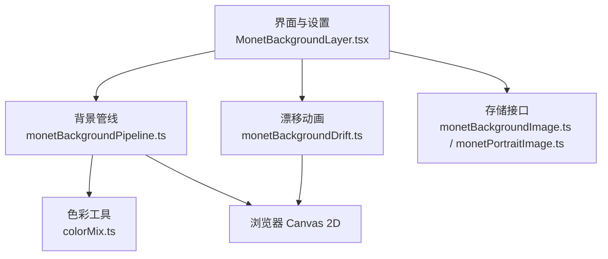
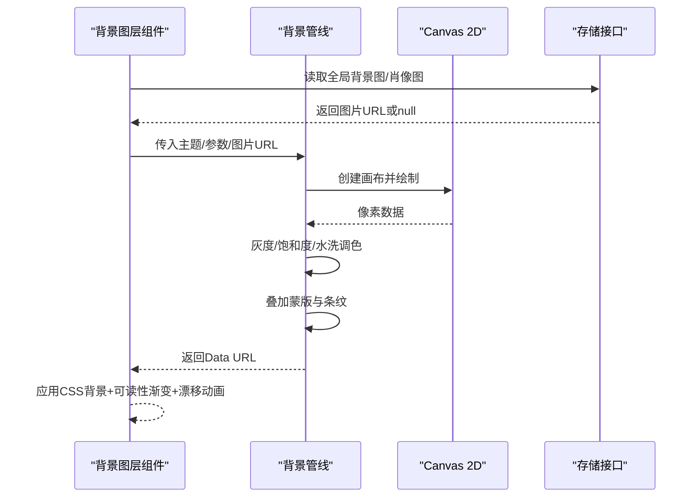
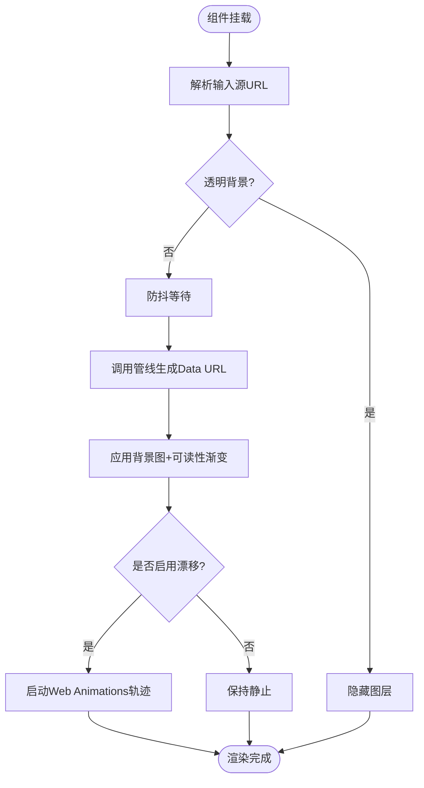
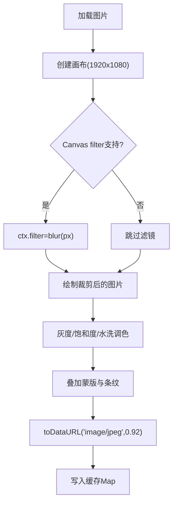
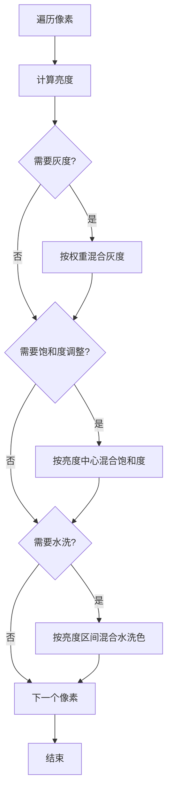
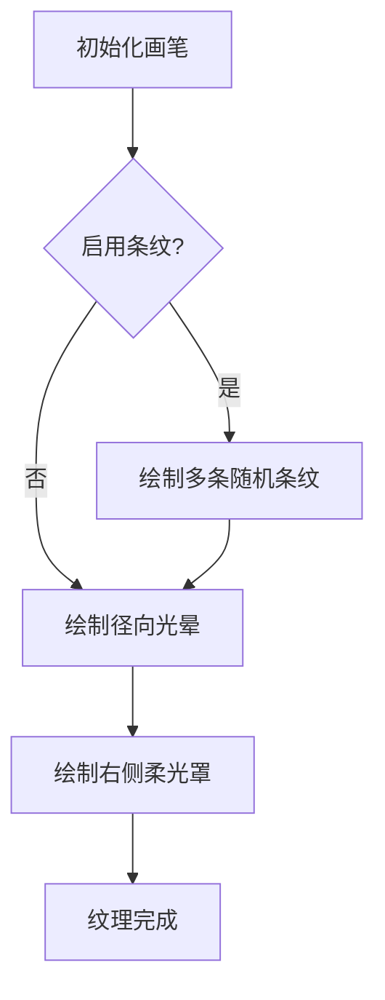
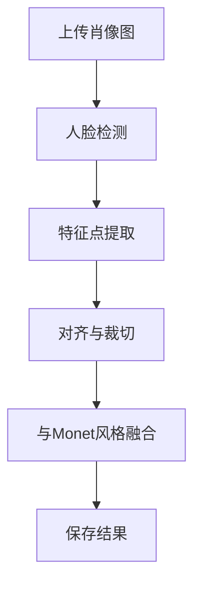
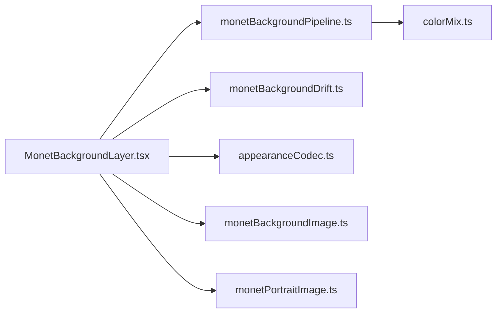
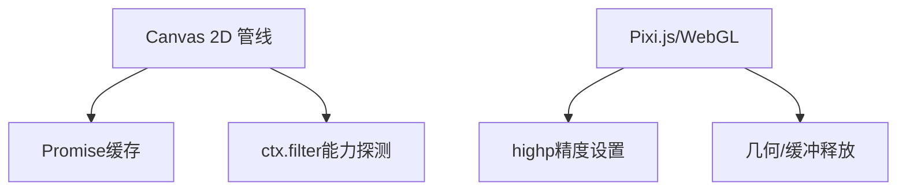

# 背景管道系统

<cite>
**本文引用的文件**   
- [MonetBackgroundLayer.tsx](file://src/components/visualizer/backgrounds/monet/MonetBackgroundLayer.tsx)
- [monetBackgroundPipeline.ts](file://src/components/visualizer/monet/monetBackgroundPipeline.ts)
- [monetBackgroundDrift.ts](file://src/components/visualizer/backgrounds/monet/monetBackgroundDrift.ts)
- [colorMix.ts](file://src/components/visualizer/colorMix.ts)
- [appearanceCodec.ts](file://src/utils/appearanceCodec.ts)
- [monetBackgroundImage.ts](file://src/services/monetBackgroundImage.ts)
- [monetPortraitImage.ts](file://src/services/monetPortraitImage.ts)
- [loadPixi.ts](file://src/components/visualizer/loadPixi.ts)
- [temperaSceneBuilder.ts](file://src/components/visualizer/tempera/temperaSceneBuilder.ts)
- [temperaHatch.ts](file://src/components/visualizer/tempera/temperaHatch.ts)
- [temperaRandom.ts](file://src/components/visualizer/tempera/temperaRandom.ts)
- [gl.mjs](file://dist-mods/tide-background/tide/gl.mjs)
- [lumiereGpuRelease.test.ts](file://test/unit/visualizer/lumiere/lumiereGpuRelease.test.ts)
</cite>

## 目录
1. [引言](#引言)
2. [项目结构](#项目结构)
3. [核心组件](#核心组件)
4. [架构总览](#架构总览)
5. [详细组件分析](#详细组件分析)
6. [依赖关系分析](#依赖关系分析)
7. [性能与GPU优化](#性能与gpu优化)
8. [故障排查指南](#故障排查指南)
9. [结论](#结论)
10. [附录：扩展与调优建议](#附录扩展与调优建议)

## 引言
本技术文档聚焦于 Monet 模式的“背景管道系统”，系统性阐述印象派风格图像处理的完整流程，包括图像预处理、色彩分析与纹理生成机制；深入解释点彩技法模拟算法（像素级色彩混合、随机采样策略与视觉融合效果）；说明 GPU 加速优化（WebGL 着色器、内存管理与异步处理）；并给出肖像图像处理（人脸检测、特征提取与风格迁移）的扩展指南与性能调优建议。

## 项目结构
Monet 背景管道由三层组成：
- 渲染层：React 组件负责选择输入源、驱动管线、合成最终背景图与叠加可读性遮罩。
- 管线层：Canvas 2D 静态管线完成图像缩放裁剪、模糊、灰度/饱和度/水洗调色、蒙版与条纹等后处理，并输出 Data URL。
- 服务层：IndexedDB 持久化全局背景图与自定义肖像图，供设置面板与渲染层复用。

**图示来源**
- [MonetBackgroundLayer.tsx:65-125](file://src/components/visualizer/backgrounds/monet/MonetBackgroundLayer.tsx#L65-L125)
- [monetBackgroundPipeline.ts:315-361](file://src/components/visualizer/monet/monetBackgroundPipeline.ts#L315-L361)
- [monetBackgroundDrift.ts](file://src/components/visualizer/backgrounds/monet/monetBackgroundDrift.ts)
- [colorMix.ts](file://src/components/visualizer/colorMix.ts)
- [monetBackgroundImage.ts:14-30](file://src/services/monetBackgroundImage.ts#L14-L30)
- [monetPortraitImage.ts:14-30](file://src/services/monetPortraitImage.ts#L14-L30)

**章节来源**
- [MonetBackgroundLayer.tsx:65-125](file://src/components/visualizer/backgrounds/monet/MonetBackgroundLayer.tsx#L65-L125)
- [monetBackgroundPipeline.ts:315-361](file://src/components/visualizer/monet/monetBackgroundPipeline.ts#L315-L361)
- [monetBackgroundImage.ts:14-30](file://src/services/monetBackgroundImage.ts#L14-L30)
- [monetPortraitImage.ts:14-30](file://src/services/monetPortraitImage.ts#L14-L30)

## 核心组件
- 背景图层组件：负责输入源解析、缓存键计算、防抖触发管线、漂移动画与可读性渐变叠加。
- 背景管线：构建固定分辨率（1920×1080）的离线画布，执行加载、裁剪、模糊、灰度/饱和度/水洗调色、蒙版与条纹绘制，输出 JPEG Data URL。
- 漂移动画：基于 Web Animations API 的噪声驱动位移轨迹，主线程仅一次配置，交由合成器播放。
- 色彩工具：提供带透明度的颜色混合与通道解析，被管线与组件共用。
- 存储接口：为全局背景图与自定义肖像图提供 IndexedDB 存取封装。

**章节来源**
- [MonetBackgroundLayer.tsx:65-125](file://src/components/visualizer/backgrounds/monet/MonetBackgroundLayer.tsx#L65-L125)
- [monetBackgroundPipeline.ts:30-40](file://src/components/visualizer/monet/monetBackgroundPipeline.ts#L30-L40)
- [monetBackgroundPipeline.ts:142-201](file://src/components/visualizer/monet/monetBackgroundPipeline.ts#L142-L201)
- [monetBackgroundPipeline.ts:203-240](file://src/components/visualizer/monet/monetBackgroundPipeline.ts#L203-L240)
- [monetBackgroundPipeline.ts:315-361](file://src/components/visualizer/monet/monetBackgroundPipeline.ts#L315-L361)
- [monetBackgroundImage.ts:14-30](file://src/services/monetBackgroundImage.ts#L14-L30)
- [monetPortraitImage.ts:14-30](file://src/services/monetPortraitImage.ts#L14-L30)

## 架构总览
Monet 背景管道的数据流如下：
- 输入：封面图或上传的全局背景图、主题色、用户调节参数。
- 预处理：根据布局模式选择覆盖方式，必要时对图片进行缩放裁剪与模糊。
- 色彩分析：按亮度分布计算阴影/高光端点，结合主题色生成水洗色调。
- 纹理生成：可选条纹与径向光晕叠加，形成印象派质感。
- 输出：稳定的 Data URL 作为 CSS background-image，配合 DOM 层可读性渐变与漂移动画。

**图示来源**
- [MonetBackgroundLayer.tsx:95-125](file://src/components/visualizer/backgrounds/monet/MonetBackgroundLayer.tsx#L95-L125)
- [monetBackgroundPipeline.ts:315-361](file://src/components/visualizer/monet/monetBackgroundPipeline.ts#L315-L361)
- [monetBackgroundImage.ts:14-30](file://src/services/monetBackgroundImage.ts#L14-L30)
- [monetPortraitImage.ts:14-30](file://src/services/monetPortraitImage.ts#L14-L30)

## 详细组件分析

### 背景图层组件（MonetBackgroundLayer）
职责与行为：
- 输入源解析：优先使用全局上传背景图，否则回退到封面图。
- 防抖管线调用：通过定时器节流，避免频繁重算。
- 缓存键：基于图片URL、主题三原色与关键调节项生成稳定键，减少重复计算。
- 漂移动画：当启用且强度大于0时，使用 Web Animations API 播放噪声驱动的位移轨迹，提升合成效率。
- 兼容模糊：在 Canvas filter 不支持时回退到 CSS blur。
- 布局模式：支持全屏覆盖与半屏偏移两种布局，均叠加可读性渐变。

**图示来源**
- [MonetBackgroundLayer.tsx:55-63](file://src/components/visualizer/backgrounds/monet/MonetBackgroundLayer.tsx#L55-L63)
- [MonetBackgroundLayer.tsx:95-125](file://src/components/visualizer/backgrounds/monet/MonetBackgroundLayer.tsx#L95-L125)
- [MonetBackgroundLayer.tsx:127-148](file://src/components/visualizer/backgrounds/monet/MonetBackgroundLayer.tsx#L127-L148)
- [MonetBackgroundLayer.tsx:154-250](file://src/components/visualizer/backgrounds/monet/MonetBackgroundLayer.tsx#L154-L250)

**章节来源**
- [MonetBackgroundLayer.tsx:55-63](file://src/components/visualizer/backgrounds/monet/MonetBackgroundLayer.tsx#L55-L63)
- [MonetBackgroundLayer.tsx:95-125](file://src/components/visualizer/backgrounds/monet/MonetBackgroundLayer.tsx#L95-L125)
- [MonetBackgroundLayer.tsx:127-148](file://src/components/visualizer/backgrounds/monet/MonetBackgroundLayer.tsx#L127-L148)
- [MonetBackgroundLayer.tsx:154-250](file://src/components/visualizer/backgrounds/monet/MonetBackgroundLayer.tsx#L154-L250)

### 背景管线（monetBackgroundPipeline）
核心算法与步骤：
- 图像加载与解码：优先使用 decode()，失败则回退 onload。
- 尺寸与裁剪：按目标宽高等比缩放并居中绘制，保证画面比例。
- 模糊处理：若浏览器支持 Canvas filter，则在绘制前设置 ctx.filter 实现高斯模糊。
- 灰度/饱和度/水洗调色：逐像素计算亮度，按权重混合灰度、饱和度与水洗色。
- 水洗色计算：依据背景与主色的亮度比较确定阴影/高光端点，按归一化亮度分段线性插值。
- 蒙版与条纹：叠加主题渐变色块与径向光晕，可选绘制条纹纹理。
- 缓存与导出：以 JSON 字符串作为缓存键，返回 JPEG Data URL。

**图示来源**
- [monetBackgroundPipeline.ts:52-75](file://src/components/visualizer/monet/monetBackgroundPipeline.ts#L52-L75)
- [monetBackgroundPipeline.ts:77-105](file://src/components/visualizer/monet/monetBackgroundPipeline.ts#L77-L105)
- [monetBackgroundPipeline.ts:142-201](file://src/components/visualizer/monet/monetBackgroundPipeline.ts#L142-L201)
- [monetBackgroundPipeline.ts:203-240](file://src/components/visualizer/monet/monetBackgroundPipeline.ts#L203-L240)
- [monetBackgroundPipeline.ts:315-361](file://src/components/visualizer/monet/monetBackgroundPipeline.ts#L315-L361)

**章节来源**
- [monetBackgroundPipeline.ts:52-75](file://src/components/visualizer/monet/monetBackgroundPipeline.ts#L52-L75)
- [monetBackgroundPipeline.ts:77-105](file://src/components/visualizer/monet/monetBackgroundPipeline.ts#L77-L105)
- [monetBackgroundPipeline.ts:142-201](file://src/components/visualizer/monet/monetBackgroundPipeline.ts#L142-L201)
- [monetBackgroundPipeline.ts:203-240](file://src/components/visualizer/monet/monetBackgroundPipeline.ts#L203-L240)
- [monetBackgroundPipeline.ts:315-361](file://src/components/visualizer/monet/monetBackgroundPipeline.ts#L315-L361)

### 点彩技法模拟算法
虽然当前 Monet 背景管线未直接实现点阵笔触，但其“像素级色彩混合”和“随机采样策略”可视为点彩的基础：
- 像素级色彩混合：在 applyBackgroundPostProcessing 中，对每个像素分别计算灰度、饱和度与水洗混合，体现点彩的局部色彩叠加思想。
- 随机采样策略：条纹纹理通过伪随机位置与长度生成，模拟手绘笔触的离散分布。
- 视觉融合效果：通过主题渐变的径向光晕与右侧柔光罩，使局部色块自然过渡，形成印象派的视觉融合。

**图示来源**
- [monetBackgroundPipeline.ts:142-201](file://src/components/visualizer/monet/monetBackgroundPipeline.ts#L142-L201)
- [monetBackgroundPipeline.ts:203-240](file://src/components/visualizer/monet/monetBackgroundPipeline.ts#L203-L240)

**章节来源**
- [monetBackgroundPipeline.ts:142-201](file://src/components/visualizer/monet/monetBackgroundPipeline.ts#L142-L201)
- [monetBackgroundPipeline.ts:203-240](file://src/components/visualizer/monet/monetBackgroundPipeline.ts#L203-L240)

### 纹理生成机制
- 条纹纹理：通过伪随机坐标与固定数量绘制垂直条带，增强手绘质感。
- 径向光晕：以主题强调色为中心向外扩散，营造氛围光。
- 右侧柔光罩：线性渐变从透明到主题背景色，增加层次。

**图示来源**
- [monetBackgroundPipeline.ts:203-240](file://src/components/visualizer/monet/monetBackgroundPipeline.ts#L203-L240)

**章节来源**
- [monetBackgroundPipeline.ts:203-240](file://src/components/visualizer/monet/monetBackgroundPipeline.ts#L203-L240)

### 肖像图像处理（扩展方向）
当前代码库提供了自定义肖像图的持久化接口，但未包含人脸检测与特征提取的实现。可扩展方向：
- 人脸检测：集成前端人脸检测模型（如 MediaPipe Face Detection），在上传肖像图后检测人脸区域。
- 特征提取：基于检测结果提取关键点（眼睛、鼻子、嘴部），用于构图与焦点定位。
- 风格迁移：将人像区域作为模板，与 Monet 背景的色彩与纹理风格进行融合，例如通过分层蒙版与局部水洗/饱和度调整。

[此图为概念流程图，不映射具体源码]

## 依赖关系分析
- 组件依赖管线：MonetBackgroundLayer 调用 monetBackgroundPipeline 生成 Data URL。
- 管线依赖色彩工具：applyBackgroundPostProcessing 使用 colorWithAlpha 与 parseColorChannels。
- 组件依赖漂移动画：useMonetBackgroundDrift 调用 buildMonetDriftTrack。
- 设置与编解码：appearanceCodec 提供 Monet 背景的压缩/解压字段映射。
- 存储接口：monetBackgroundImage 与 monetPortraitImage 统一封装 IndexedDB 操作。

**图示来源**
- [MonetBackgroundLayer.tsx:1-8](file://src/components/visualizer/backgrounds/monet/MonetBackgroundLayer.tsx#L1-L8)
- [monetBackgroundPipeline.ts:1-2](file://src/components/visualizer/monet/monetBackgroundPipeline.ts#L1-L2)
- [appearanceCodec.ts:206-229](file://src/utils/appearanceCodec.ts#L206-L229)
- [monetBackgroundImage.ts:14-30](file://src/services/monetBackgroundImage.ts#L14-L30)
- [monetPortraitImage.ts:14-30](file://src/services/monetPortraitImage.ts#L14-L30)

**章节来源**
- [MonetBackgroundLayer.tsx:1-8](file://src/components/visualizer/backgrounds/monet/MonetBackgroundLayer.tsx#L1-L8)
- [monetBackgroundPipeline.ts:1-2](file://src/components/visualizer/monet/monetBackgroundPipeline.ts#L1-L2)
- [appearanceCodec.ts:206-229](file://src/utils/appearanceCodec.ts#L206-L229)
- [monetBackgroundImage.ts:14-30](file://src/services/monetBackgroundImage.ts#L14-L30)
- [monetPortraitImage.ts:14-30](file://src/services/monetPortraitImage.ts#L14-L30)

## 性能与GPU优化
- Canvas 2D 管线：所有图像处理在离屏 Canvas 上完成，避免主线程阻塞；JPEG 压缩降低内存占用。
- 浏览器能力探测：checkCanvasFilterSupport 检测 ctx.filter 支持情况，在不支持的平台上回退 CSS blur。
- 缓存策略：monetBackgroundCache Map 缓存 Promise，避免重复计算。
- WebGL/Pixi.js：其他可视化模块（如 Tempera、Lumiere）使用 Pixi.js 与 GLSL 着色器进行 GPU 加速；确保 highp 精度以提升数值稳定性。
- 资源释放：测试用例验证几何与缓冲随对象销毁而释放，防止显存泄漏。

**图示来源**
- [monetBackgroundPipeline.ts:270-313](file://src/components/visualizer/monet/monetBackgroundPipeline.ts#L270-L313)
- [monetBackgroundPipeline.ts:315-361](file://src/components/visualizer/monet/monetBackgroundPipeline.ts#L315-L361)
- [loadPixi.ts:18-36](file://src/components/visualizer/loadPixi.ts#L18-L36)
- [lumiereGpuRelease.test.ts:88-97](file://test/unit/visualizer/lumiere/lumiereGpuRelease.test.ts#L88-L97)

**章节来源**
- [monetBackgroundPipeline.ts:270-313](file://src/components/visualizer/monet/monetBackgroundPipeline.ts#L270-L313)
- [monetBackgroundPipeline.ts:315-361](file://src/components/visualizer/monet/monetBackgroundPipeline.ts#L315-L361)
- [loadPixi.ts:18-36](file://src/components/visualizer/loadPixi.ts#L18-L36)
- [lumiereGpuRelease.test.ts:88-97](file://test/unit/visualizer/lumiere/lumiereGpuRelease.test.ts#L88-L97)

## 故障排查指南
- 背景图不显示：检查输入源URL是否为空，确认 transparentBackground 标志位。
- 模糊无效：确认 checkCanvasFilterSupport 返回 true；若不支持，将使用 CSS blur 回退。
- 颜色异常：校验主题三色是否有效，parseColorChannels 是否能正确解析。
- 条纹未出现：确认 backgroundStreaksEnabled 为真。
- 设置未生效：核对 appearanceCodec 的压缩字段是否与当前 tuning 一致。

**章节来源**
- [MonetBackgroundLayer.tsx:95-125](file://src/components/visualizer/backgrounds/monet/MonetBackgroundLayer.tsx#L95-L125)
- [monetBackgroundPipeline.ts:270-313](file://src/components/visualizer/monet/monetBackgroundPipeline.ts#L270-L313)
- [appearanceCodec.ts:206-229](file://src/utils/appearanceCodec.ts#L206-L229)

## 结论
Monet 背景管道通过稳定的 Canvas 2D 管线与 React 组件协作，实现了印象派风格的背景合成。其像素级色彩混合、随机纹理与主题水洗调色共同构成点彩技法的视觉基础。同时，系统具备完善的缓存、能力探测与兼容性回退机制，并在其他可视化模块中使用 WebGL/Pixi.js 进行 GPU 加速。针对肖像图像处理，当前仅提供存储接口，未来可扩展人脸检测与风格迁移能力。

## 附录：扩展与调优建议
- 自定义图像处理效果
  - 新增纹理：在 paintMonetOverlay 中添加新的形状或图案生成逻辑，注意保持确定性以避免缓存失效。
  - 调整水洗曲线：修改 resolveWashEndpoints 与 resolveWashColor 的分段插值策略，实现更丰富的明暗过渡。
  - 引入噪声纹理：结合 temperaRandom 的确定性随机函数，生成更自然的笔触分布。
- 性能调优
  - 降低分辨率：在非高分屏设备上降低画布分辨率，减少像素处理开销。
  - 合并过滤：将灰度、饱和度与水洗合并为单次像素遍历，减少 getImageData/putImageData 次数。
  - 控制条纹密度：限制条纹数量与长度，避免过多绘制指令。
  - WebGL 替代：对大规模像素操作考虑迁移至 Pixi.js 着色器，利用 GPU 并行计算。
- 肖像处理扩展
  - 集成人脸检测：在上传肖像图后运行检测模型，输出人脸框与关键点。
  - 局部风格迁移：将人像区域与背景风格进行分层融合，保留主体细节的同时统一色调与纹理。
  - 动态构图：根据人脸位置自动调整背景偏移与蒙版强度，提升可读性与美观度。

**章节来源**
- [monetBackgroundPipeline.ts:142-201](file://src/components/visualizer/monet/monetBackgroundPipeline.ts#L142-L201)
- [monetBackgroundPipeline.ts:203-240](file://src/components/visualizer/monet/monetBackgroundPipeline.ts#L203-L240)
- [temperaRandom.ts:1-31](file://src/components/visualizer/tempera/temperaRandom.ts#L1-L31)
- [temperaHatch.ts:32-40](file://src/components/visualizer/tempera/temperaHatch.ts#L32-L40)
- [temperaSceneBuilder.ts:345-379](file://src/components/visualizer/tempera/temperaSceneBuilder.ts#L345-L379)
- [gl.mjs:1-20](file://dist-mods/tide-background/tide/gl.mjs#L1-L20)