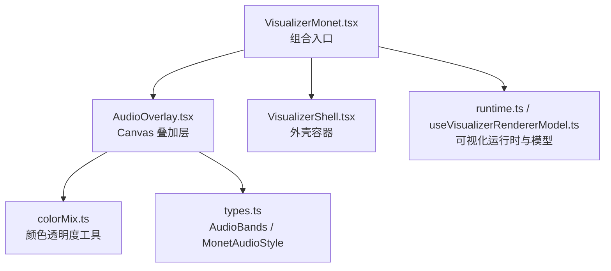
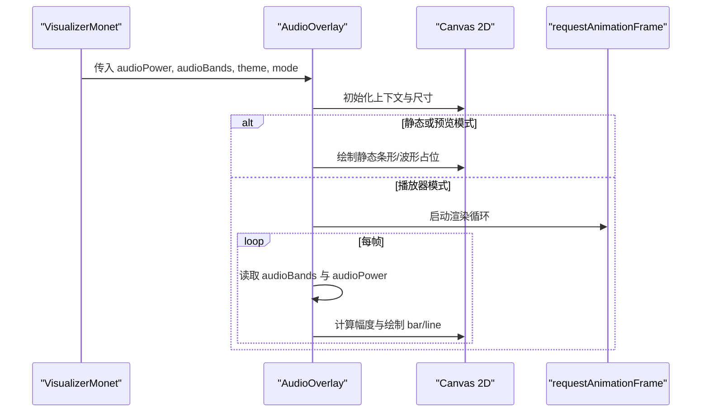
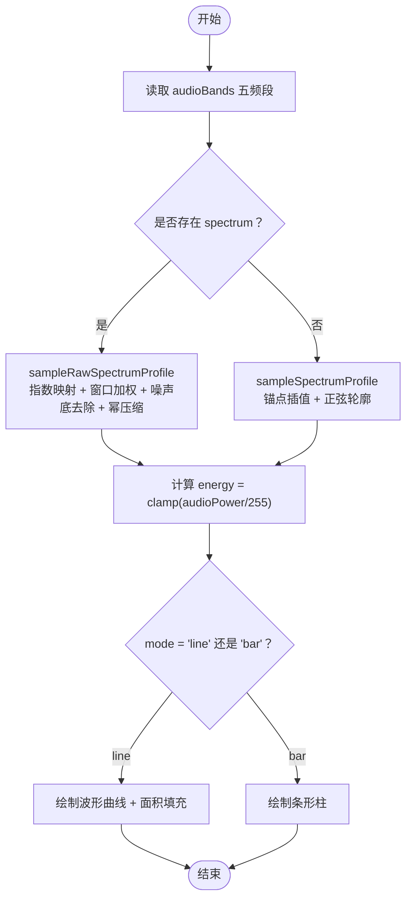
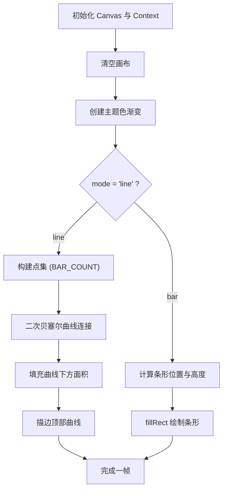
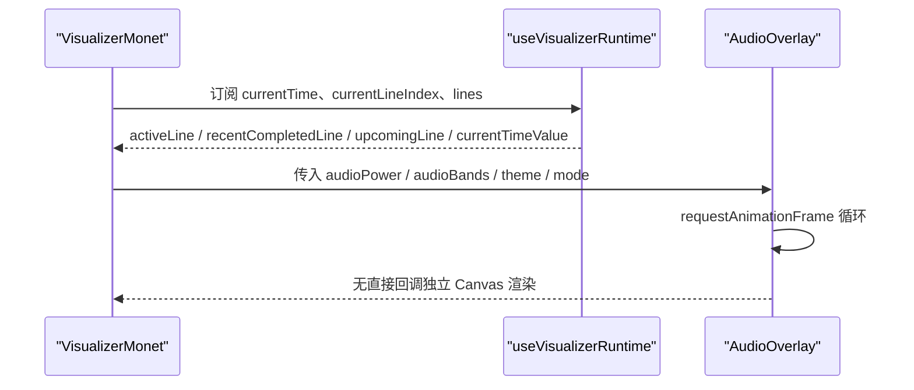
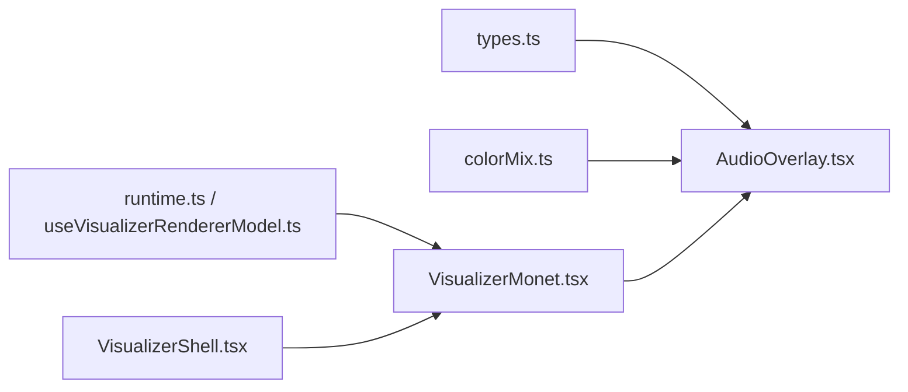

# 音频可视化叠加层

<cite>
**本文引用的文件**   
- [AudioOverlay.tsx](file://src/components/visualizer/monet/AudioOverlay.tsx)
- [VisualizerMonet.tsx](file://src/components/visualizer/monet/VisualizerMonet.tsx)
- [types.ts](file://src/types.ts)
- [colorMix.ts](file://src/components/visualizer/colorMix.ts)
- [runtime.ts](file://src/components/visualizer/runtime.ts)
- [useVisualizerRendererModel.ts](file://src/components/visualizer/useVisualizerRendererModel.ts)
- [VisualizerShell.tsx](file://src/components/visualizer/VisualizerShell.tsx)
</cite>

## 目录
1. [简介](#简介)
2. [项目结构](#项目结构)
3. [核心组件](#核心组件)
4. [架构总览](#架构总览)
5. [详细组件分析](#详细组件分析)
6. [依赖关系分析](#依赖关系分析)
7. [性能考量](#性能考量)
8. [故障排查指南](#故障排查指南)
9. [结论](#结论)
10. [附录：自定义与调优指南](#附录自定义与调优指南)

## 简介
本文面向 Monet 模式的音频可视化叠加层，系统性说明其音频数据解析、频谱分析与频带提取、功率计算、Canvas 渲染算法、不同音频样式（条形图、波形图）的实现方式，以及与播放状态同步、时间轴对齐、实时刷新机制。同时给出 Canvas 渲染优化、帧率控制、资源管理策略，以及扩展自定义可视化效果的开发建议。

## 项目结构
Monet 音频可视化叠加层位于可视化子系统内部，主要涉及以下文件：
- 叠加层渲染：`src/components/visualizer/monet/AudioOverlay.tsx`
- 组合入口与配置注入：`src/components/visualizer/monet/VisualizerMonet.tsx`
- 类型定义：`src/types.ts`
- 颜色工具：`src/components/visualizer/colorMix.ts`
- 可视化运行时与模型：`src/components/visualizer/runtime.ts`、`src/components/visualizer/useVisualizerRendererModel.ts`
- 外壳容器：`src/components/visualizer/VisualizerShell.tsx`

**图表来源**
- [VisualizerMonet.tsx:34-58](file://src/components/visualizer/monet/VisualizerMonet.tsx#L34-L58)
- [VisualizerMonet.tsx:522-542](file://src/components/visualizer/monet/VisualizerMonet.tsx#L522-L542)
- [AudioOverlay.tsx:1-14](file://src/components/visualizer/monet/AudioOverlay.tsx#L1-L14)
- [AudioOverlay.tsx:155-162](file://src/components/visualizer/monet/AudioOverlay.tsx#L155-L162)
- [types.ts:908-908](file://src/types.ts#L908-L908)
- [types.ts:1481-1488](file://src/types.ts#L1481-L1488)

**章节来源**
- [VisualizerMonet.tsx:34-58](file://src/components/visualizer/monet/VisualizerMonet.tsx#L34-L58)
- [VisualizerMonet.tsx:522-542](file://src/components/visualizer/monet/VisualizerMonet.tsx#L522-L542)
- [AudioOverlay.tsx:1-14](file://src/components/visualizer/monet/AudioOverlay.tsx#L1-L14)
- [AudioOverlay.tsx:155-162](file://src/components/visualizer/monet/AudioOverlay.tsx#L155-L162)
- [types.ts:908-908](file://src/types.ts#L908-L908)
- [types.ts:1481-1488](file://src/types.ts#L1481-L1488)

## 核心组件
- AudioOverlay：负责在 Monet 模式下绘制底部音频轨道，支持两种样式：
  - 条形图（bar）
  - 波形图（line）
- VisualizerMonet：作为 Monet 可视化主组件，将音频数据、主题、用户设置传递给 AudioOverlay，并控制显示开关与动画入场。
- types.ts：定义音频频带数据结构 AudioBands 与音频样式枚举 MonetAudioStyle。
- colorMix.ts：提供带透明度的颜色混合工具，用于 Canvas 渐变与描边填充。

关键职责划分：
- 音频数据输入：audioPower（整体响度）、audioBands（分频频段 + 可选原始频谱）。
- 样式选择：通过 monetTuning.audioStyle 决定 bar 或 line。
- 渲染管线：Canvas 2D 逐帧绘制，使用 requestAnimationFrame 驱动。
- 静态模式与预览模式：避免不必要的动画循环，直接绘制静态占位图形。

**章节来源**
- [AudioOverlay.tsx:1-14](file://src/components/visualizer/monet/AudioOverlay.tsx#L1-L14)
- [AudioOverlay.tsx:155-162](file://src/components/visualizer/monet/AudioOverlay.tsx#L155-L162)
- [VisualizerMonet.tsx:522-542](file://src/components/visualizer/monet/VisualizerMonet.tsx#L522-L542)
- [types.ts:908-908](file://src/types.ts#L908-L908)
- [types.ts:1481-1488](file://src/types.ts#L1481-L1488)

## 架构总览
Monet 音频可视化叠加层的运行流程如下：
1. VisualizerMonet 从 props 获取 currentTime、audioPower、audioBands、theme、monetTuning 等。
2. 根据 monetTuning.showAudioVisualization 决定是否渲染 AudioOverlay。
3. AudioOverlay 内部创建 Canvas，监听窗口 resize，按设备像素比缩放画布尺寸。
4. 在 player 模式下启动 requestAnimationFrame 循环；在 staticMode 或 isPreviewMode 下仅绘制静态图形。
5. 每帧读取 audioBands 的五个频段值与可选 spectrum 原始 FFT 数据，结合 energy（audioPower）计算视觉幅度。
6. 根据 mode（bar/line）分别绘制条形图或波形图，并使用主题色生成渐变。

**图表来源**
- [VisualizerMonet.tsx:522-542](file://src/components/visualizer/monet/VisualizerMonet.tsx#L522-L542)
- [AudioOverlay.tsx:165-192](file://src/components/visualizer/monet/AudioOverlay.tsx#L165-L192)
- [AudioOverlay.tsx:297-314](file://src/components/visualizer/monet/AudioOverlay.tsx#L297-L314)

**章节来源**
- [VisualizerMonet.tsx:522-542](file://src/components/visualizer/monet/VisualizerMonet.tsx#L522-L542)
- [AudioOverlay.tsx:165-192](file://src/components/visualizer/monet/AudioOverlay.tsx#L165-L192)
- [AudioOverlay.tsx:297-314](file://src/components/visualizer/monet/AudioOverlay.tsx#L297-L314)

## 详细组件分析

### 音频数据解析与频带处理
- 频带输入：AudioBands 包含 bass、lowMid、mid、vocal、treble 五个 MotionValue<number>，以及可选 spectrum（Uint8Array 原始 FFT 幅值）。
- 频带采样与插值：
  - buildSpectrumAnchors：基于五个频段构建频谱锚点，进行加权混合以形成平滑曲线。
  - sampleSpectrumProfile：对归一化频率索引进行对数映射，并在锚点间线性插值，叠加正弦轮廓增强连续性。
- 原始频谱采样：
  - sampleRawSpectrumProfile：当存在 spectrum 时，采用指数映射到可用 bin 范围，使用滑动窗口加权平均，动态噪声底去除，幂压缩提升对比度，低频补偿与高频存在感提升。
- 能量（功率）：energy = clamp(audioPower / 255, 0.08, 1)，作为整体振幅乘数。

复杂度分析：
- 频带插值：O(1)
- 原始频谱采样：O(W)，W 为窗口半径（常数级），总体 O(1)
- 每帧绘制：O(N)，N 为 BAR_COUNT（固定 72）

**图表来源**
- [AudioOverlay.tsx:19-54](file://src/components/visualizer/monet/AudioOverlay.tsx#L19-L54)
- [AudioOverlay.tsx:56-92](file://src/components/visualizer/monet/AudioOverlay.tsx#L56-L92)
- [AudioOverlay.tsx:201-219](file://src/components/visualizer/monet/AudioOverlay.tsx#L201-L219)
- [AudioOverlay.tsx:223-284](file://src/components/visualizer/monet/AudioOverlay.tsx#L223-L284)

**章节来源**
- [types.ts:1481-1488](file://src/types.ts#L1481-L1488)
- [AudioOverlay.tsx:19-54](file://src/components/visualizer/monet/AudioOverlay.tsx#L19-L54)
- [AudioOverlay.tsx:56-92](file://src/components/visualizer/monet/AudioOverlay.tsx#L56-L92)
- [AudioOverlay.tsx:201-219](file://src/components/visualizer/monet/AudioOverlay.tsx#L201-L219)

### 可视化渲染算法
- 画布初始化与缩放：
  - 根据 getBoundingClientRect 与 devicePixelRatio 设置 canvas.width/height，并通过 setTransform 适配高 DPI。
- 渐变与颜色：
  - 使用 colorWithAlpha 生成主题色的半透明版本，构建水平渐变（左右软色、中间主色）与垂直渐变（顶部半透明填充到底部透明）。
- 波形图（line）：
  - 生成 BAR_COUNT 个点，每个点的 y 由 energy、band、wave 合成，使用二次贝塞尔曲线连接，填充曲线下方面积并描边顶部曲线。
- 条形图（bar）：
  - 计算每个条形的宽度与高度，高度受 energy、band、pulse 影响，使用 fillRect 绘制。
- 静态模式与预览模式：
  - drawStaticBars 使用固定形状与正弦包络模拟波形/条形，不依赖实时音频数据。

**图表来源**
- [AudioOverlay.tsx:180-192](file://src/components/visualizer/monet/AudioOverlay.tsx#L180-L192)
- [AudioOverlay.tsx:214-221](file://src/components/visualizer/monet/AudioOverlay.tsx#L214-L221)
- [AudioOverlay.tsx:223-284](file://src/components/visualizer/monet/AudioOverlay.tsx#L223-L284)
- [AudioOverlay.tsx:94-153](file://src/components/visualizer/monet/AudioOverlay.tsx#L94-L153)

**章节来源**
- [AudioOverlay.tsx:180-192](file://src/components/visualizer/monet/AudioOverlay.tsx#L180-L192)
- [AudioOverlay.tsx:214-221](file://src/components/visualizer/monet/AudioOverlay.tsx#L214-L221)
- [AudioOverlay.tsx:223-284](file://src/components/visualizer/monet/AudioOverlay.tsx#L223-L284)
- [AudioOverlay.tsx:94-153](file://src/components/visualizer/monet/AudioOverlay.tsx#L94-L153)

### 不同音频样式的实现
- 条形图（bar）：
  - 使用固定数量的条形（BAR_COUNT=72），高度由 energy、band、pulse 共同决定，呈现节奏感。
- 波形图（line）：
  - 使用连续曲线与面积填充，叠加时间相关的 wave 项，使波形具有流动感。
- 静态占位：
  - 在 staticMode 或 isPreviewMode 下，drawStaticBars 使用固定包络与随机性数值模拟视觉效果，避免动画开销。

**章节来源**
- [AudioOverlay.tsx:16-17](file://src/components/visualizer/monet/AudioOverlay.tsx#L16-L17)
- [AudioOverlay.tsx:94-153](file://src/components/visualizer/monet/AudioOverlay.tsx#L94-L153)
- [AudioOverlay.tsx:223-284](file://src/components/visualizer/monet/AudioOverlay.tsx#L223-L284)

### 与播放状态的同步机制
- 时间轴对齐：
  - VisualizerMonet 通过 useVisualizerRuntime 获取 activeLine、recentCompletedLine、upcomingLine、currentTimeValue，用于歌词与文本层的时间轴对齐。
  - 音频可视化叠加层本身不直接依赖歌词时间轴，但通过 showText 与 introKey 控制音频轨道的入场动画时机。
- 播放控制：
  - 通过 props 传入 audioPower 与 audioBands，这些值由上层播放器或可视化运行时更新。
- 实时刷新：
  - AudioOverlay 使用 requestAnimationFrame 驱动渲染循环，确保与屏幕刷新率同步。
  - 在静态或预览模式下禁用循环，减少 CPU/GPU 占用。

**图表来源**
- [VisualizerMonet.tsx:90-115](file://src/components/visualizer/monet/VisualizerMonet.tsx#L90-L115)
- [VisualizerMonet.tsx:522-542](file://src/components/visualizer/monet/VisualizerMonet.tsx#L522-L542)
- [AudioOverlay.tsx:304-314](file://src/components/visualizer/monet/AudioOverlay.tsx#L304-L314)

**章节来源**
- [VisualizerMonet.tsx:90-115](file://src/components/visualizer/monet/VisualizerMonet.tsx#L90-L115)
- [VisualizerMonet.tsx:522-542](file://src/components/visualizer/monet/VisualizerMonet.tsx#L522-L542)
- [AudioOverlay.tsx:304-314](file://src/components/visualizer/monet/AudioOverlay.tsx#L304-L314)

### 错误处理与边界条件
- 画布尺寸无效：当 width <= 0 或 height <= 0 时跳过绘制，避免异常。
- 频谱数据不足：当 rawSpectrum.length <= MIN_RAW_SPECTRUM_BIN 时返回 0，防止越界。
- 窗口 resize：监听 window.resize 事件，重新计算画布尺寸与静态绘制。
- 清理资源：在 useEffect 返回函数中取消 requestAnimationFrame 与移除 resize 监听。

**章节来源**
- [AudioOverlay.tsx:194-199](file://src/components/visualizer/monet/AudioOverlay.tsx#L194-L199)
- [AudioOverlay.tsx:56-59](file://src/components/visualizer/monet/AudioOverlay.tsx#L56-L59)
- [AudioOverlay.tsx:287-314](file://src/components/visualizer/monet/AudioOverlay.tsx#L287-L314)

## 依赖关系分析
- AudioOverlay 依赖：
  - types.ts：AudioBands、MonetAudioStyle
  - colorMix.ts：colorWithAlpha
- VisualizerMonet 依赖：
  - runtime.ts / useVisualizerRendererModel.ts：可视化运行时与模型
  - VisualizerShell.tsx：外壳容器
  - AudioOverlay.tsx：音频可视化叠加层
  - types.ts：MonetAudioStyle、MonetTuning

**图表来源**
- [AudioOverlay.tsx:1-3](file://src/components/visualizer/monet/AudioOverlay.tsx#L1-L3)
- [VisualizerMonet.tsx:1-17](file://src/components/visualizer/monet/VisualizerMonet.tsx#L1-L17)
- [VisualizerMonet.tsx:522-542](file://src/components/visualizer/monet/VisualizerMonet.tsx#L522-L542)
- [types.ts:908-908](file://src/types.ts#L908-L908)
- [types.ts:1481-1488](file://src/types.ts#L1481-L1488)

**章节来源**
- [AudioOverlay.tsx:1-3](file://src/components/visualizer/monet/AudioOverlay.tsx#L1-L3)
- [VisualizerMonet.tsx:1-17](file://src/components/visualizer/monet/VisualizerMonet.tsx#L1-L17)
- [VisualizerMonet.tsx:522-542](file://src/components/visualizer/monet/VisualizerMonet.tsx#L522-L542)
- [types.ts:908-908](file://src/types.ts#L908-L908)
- [types.ts:1481-1488](file://src/types.ts#L1481-L1488)

## 性能考量
- Canvas 渲染优化：
  - 使用 devicePixelRatio 适配高 DPI，避免模糊与过度重绘。
  - 仅在必要时更新 canvas.width/height，减少布局抖动。
  - 使用线性渐变与少量路径操作，降低 GPU/CPU 压力。
- 帧率控制：
  - 使用 requestAnimationFrame 保证与屏幕刷新同步，避免多余绘制。
  - 在 staticMode 或 isPreviewMode 下关闭动画循环，显著降低功耗。
- 资源管理：
  - 在组件卸载时取消 frameId 与移除 resize 监听，防止内存泄漏。
  - 避免在每帧创建大量对象，复用 points 数组与渐变对象。
- 数据访问：
  - 直接从 MotionValue 读取最新值，避免额外拷贝。
  - 对 spectrum 数据进行最小化窗口处理，限制计算范围。

[本节为通用性能指导，不直接分析具体文件]

## 故障排查指南
- 画面空白或尺寸异常：
  - 检查 canvas.width/height 是否被正确设置，确认 getBoundingClientRect 返回值有效。
  - 确认 context.setTransform(dpr, 0, 0, dpr, 0, 0) 已调用。
- 音频无响应：
  - 确认 audioPower 与 audioBands 的值是否随播放更新。
  - 检查是否有 spectrum 数据；若无，则回退到频带插值。
- 卡顿或掉帧：
  - 确认未启用不必要的动画（staticMode/isPreviewMode）。
  - 减少 BAR_COUNT 或简化渐变与路径操作。
- 内存泄漏：
  - 确保 useEffect 清理函数执行，取消 requestAnimationFrame 与移除事件监听。

**章节来源**
- [AudioOverlay.tsx:180-192](file://src/components/visualizer/monet/AudioOverlay.tsx#L180-L192)
- [AudioOverlay.tsx:297-314](file://src/components/visualizer/monet/AudioOverlay.tsx#L297-L314)
- [AudioOverlay.tsx:201-219](file://src/components/visualizer/monet/AudioOverlay.tsx#L201-L219)

## 结论
Monet 模式的音频可视化叠加层通过轻量 Canvas 渲染与简洁的频带/频谱处理逻辑，实现了高效的条形图与波形图效果。其在静态与预览模式下自动降级，避免了不必要的动画开销；在播放器模式下通过 requestAnimationFrame 与主题色渐变提供流畅的视觉反馈。配合 VisualizerMonet 的组合与运行时模型，系统具备良好的可维护性与可扩展性。

[本节为总结性内容，不直接分析具体文件]

## 附录：自定义与调优指南
- 新增音频样式：
  - 在 AudioOverlay.tsx 中扩展 mode 分支，添加新的绘制逻辑（如粒子效果、环形频谱等）。
  - 保持 BAR_COUNT 与采样函数的接口一致，便于复用频带与频谱数据。
- 调整频带权重：
  - 修改 buildSpectrumAnchors 中的系数，以改变低频/中频/高频的视觉比重。
- 优化频谱采样：
  - 调整 MIN_RAW_SPECTRUM_BIN 与窗口半径，平衡细节与性能。
  - 调节噪声底去除与幂压缩参数，改善低音量场景下的对比度。
- 性能调优：
  - 在低端设备上降低 BAR_COUNT 或禁用复杂渐变。
  - 使用更简单的数学函数替代正弦叠加，减少每帧计算量。
- 与播放状态同步：
  - 如需与歌词时间轴联动，可在 VisualizerMonet 中引入更多运行时信号，并传递给 AudioOverlay。
  - 使用 motion 动画控制音频轨道的入场与退出，保持与其他 UI 元素的一致性。

[本节为概念性指导，不直接分析具体文件]