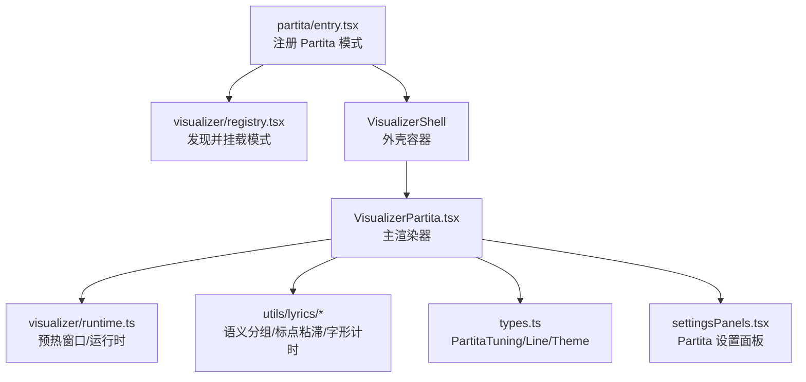
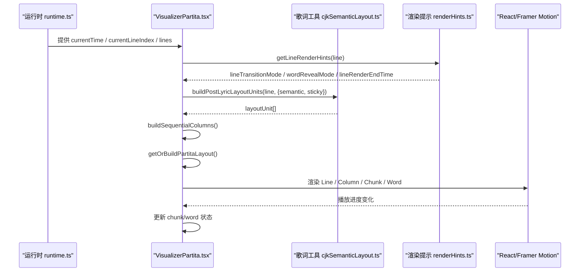
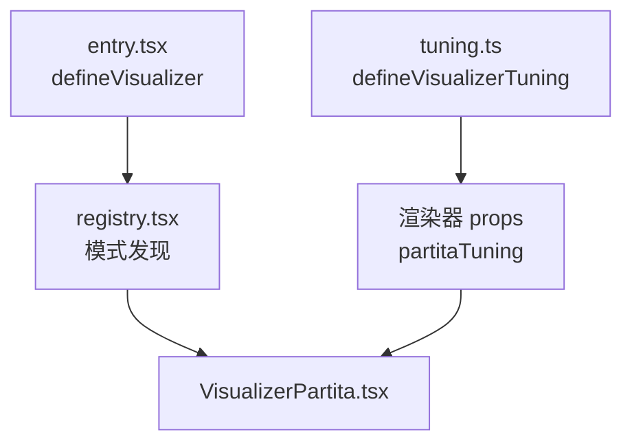
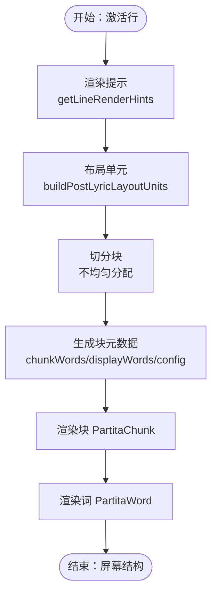
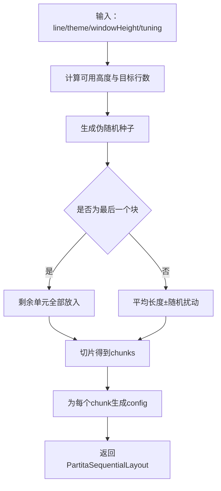
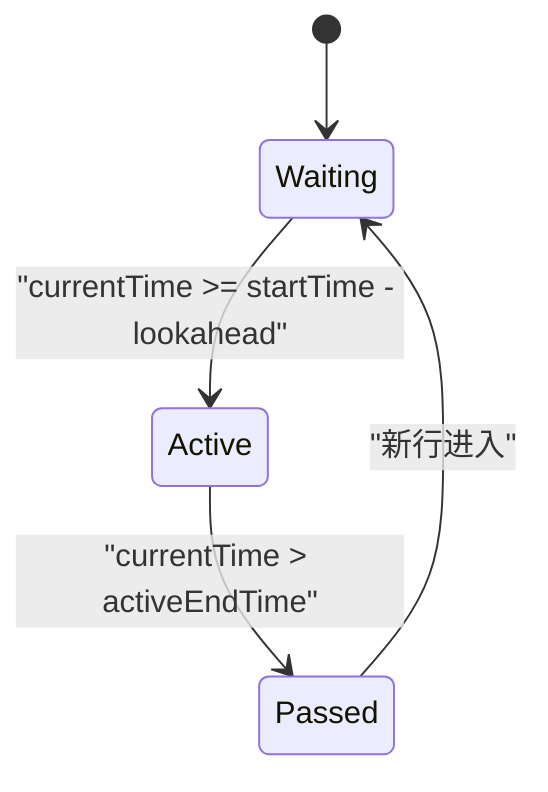
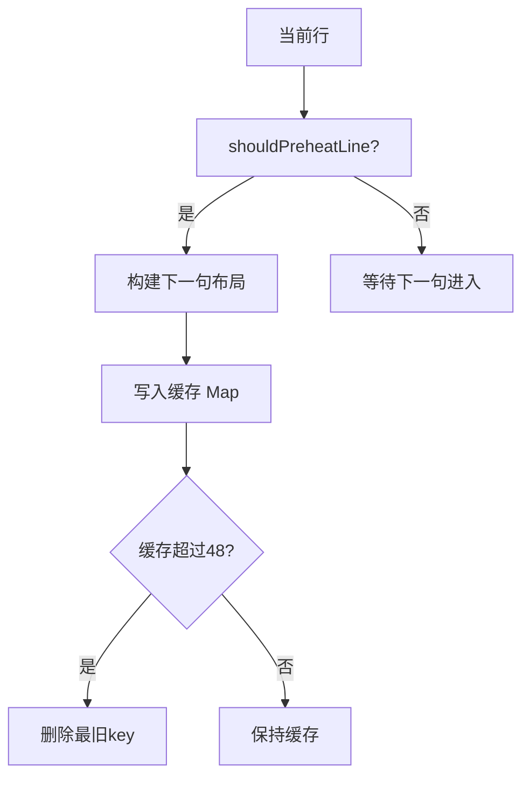
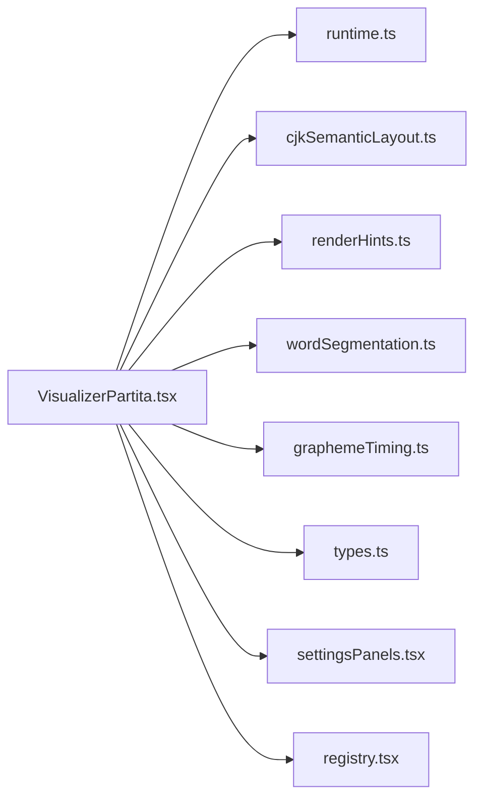
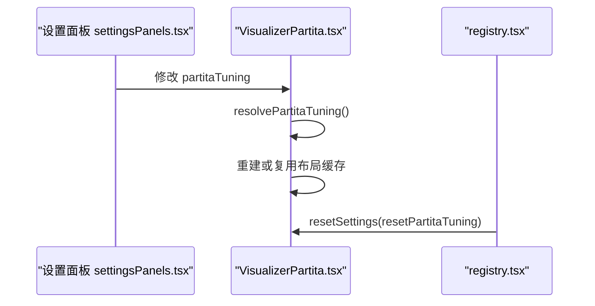

# Partita模式实现

<cite>
**本文引用的文件**   
- [entry.tsx](file://src/components/visualizer/partita/entry.tsx)
- [tuning.ts](file://src/components/visualizer/partita/tuning.ts)
- [VisualizerPartita.tsx](file://src/components/visualizer/partita/VisualizerPartita.tsx)
- [README.md](file://src/components/visualizer/partita/README.md)
- [types.ts](file://src/types.ts)
- [registry.tsx](file://src/components/visualizer/registry.tsx)
- [runtime.ts](file://src/components/visualizer/runtime.ts)
- [cjkSemanticLayout.ts](file://src/utils/lyrics/cjkSemanticLayout.ts)
- [renderHints.ts](file://src/utils/lyrics/renderHints.ts)
- [wordSegmentation.ts](file://src/utils/lyrics/wordSegmentation.ts)
- [graphemeTiming.ts](file://src/utils/lyrics/graphemeTiming.ts)
- [settingsPanels.tsx](file://src/components/visualizer/settingsPanels.tsx)
- [VisPlayground.tsx](file://src/components/visualizer/VisPlayground.tsx)
- [trackProfile.ts](file://src/services/automix/trackProfile.ts)
- [musicalTime.ts](file://src/services/automix/musicalTime.ts)
- [harmonyRuntime.ts](file://src/components/visualizer/harmonyRuntime.ts)
- [partitaLayoutCacheKey.test.ts](file://test/unit/visualizer/partitaLayoutCacheKey.test.ts)
</cite>

## 目录
1. [引言](#引言)
2. [项目结构](#项目结构)
3. [核心组件](#核心组件)
4. [架构总览](#架构总览)
5. [详细组件分析](#详细组件分析)
6. [依赖关系分析](#依赖关系分析)
7. [性能与缓存](#性能与缓存)
8. [音乐理论与数据处理边界](#音乐理论与数据处理边界)
9. [交互控制与设置](#交互控制与设置)
10. [故障排查](#故障排查)
11. [结论](#结论)
12. [附录：可视化与乐谱扩展指南](#附录可视化与乐谱扩展指南)

## 引言
Partita（云阶）是 Folia Major 的歌词可视化模式之一，它不直接绘制五线谱或和弦进行，而是把“歌词时间轴”转译为一种手写乐谱风格的视觉序列。其音乐性体现在：
- 音符序列：以解析器产出的 `Line.words` 为最小时间单位，通过词级、行级、列级的状态机驱动动画。
- 和声表现：当前实现未对音频做和声识别；和声信息来自歌词背景人声的时序片段，用于合唱波纹等辅助效果。
- 节奏表现：由歌词 timing、渲染提示和主题强度共同决定 reveal 速度、过渡模式和字级高亮节奏。

本文件重点解释 Partita 的数据流、布局算法、动画状态机、预热与缓存机制，并明确其与通用音乐分析模块的边界。

## 项目结构
Partita 位于可视化子系统的一个独立模式中，遵循“每个模式一个目录 + entry 注册 + tuning 注入”的组织方式：
- 入口注册：`src/components/visualizer/partita/entry.tsx`
- 主渲染逻辑：`src/components/visualizer/partita/VisualizerPartita.tsx`
- 模式调音注入：`src/components/visualizer/partita/tuning.ts`
- 内部说明文档：`src/components/visualizer/partita/README.md`
- 类型定义：`src/types.ts` 中的 `PartitaTuning`
- 共享歌词工具：`src/utils/lyrics/*`
- 可视化运行时：`src/components/visualizer/runtime.ts`
- 可视化注册中心：`src/components/visualizer/registry.tsx`

**图表来源**
- [entry.tsx:9-23](file://src/components/visualizer/partita/entry.tsx#L9-L23)
- [registry.tsx](file://src/components/visualizer/registry.tsx)
- [VisualizerPartita.tsx:1-15](file://src/components/visualizer/partita/VisualizerPartita.tsx#L1-L15)
- [runtime.ts](file://src/components/visualizer/runtime.ts)
- [cjkSemanticLayout.ts](file://src/utils/lyrics/cjkSemanticLayout.ts)
- [types.ts:419-424](file://src/types.ts#L419-L424)
- [settingsPanels.tsx](file://src/components/visualizer/settingsPanels.tsx)

**章节来源**
- [entry.tsx:1-24](file://src/components/visualizer/partita/entry.tsx#L1-L24)
- [VisualizerPartita.tsx:1-26](file://src/components/visualizer/partita/VisualizerPartita.tsx#L1-L26)

## 核心组件
- **Partita 模式入口**：声明模式标识、预览种子、调音类型、是否使用分词、渲染函数和设置面板。
- **Partita 主渲染器**：负责从运行时获取激活行、构建列/块布局、计算渲染轮廓、驱动词级动画、管理预热与缓存。
- **Partita 调音**：将 UI 设置的 stagger 范围、引导线开关、语义布局开关规范化后注入渲染器。
- **歌词布局工具**：提供语义分组、标点粘滞、显示词生成、字形计时等能力。
- **运行时接口**：提供下一句预热窗口判定、当前时间、激活行索引、歌词行列表等。

**章节来源**
- [entry.tsx:9-23](file://src/components/visualizer/partita/entry.tsx#L9-L23)
- [tuning.ts:1-5](file://src/components/visualizer/partita/tuning.ts#L1-L5)
- [VisualizerPartita.tsx:17-26](file://src/components/visualizer/partita/VisualizerPartita.tsx#L17-L26)
- [cjkSemanticLayout.ts](file://src/utils/lyrics/cjkSemanticLayout.ts)
- [runtime.ts](file://src/components/visualizer/runtime.ts)

## 架构总览
Partita 的渲染流程可以概括为：
1. 运行时提供当前激活行、当前时间和预热窗口。
2. 渲染器根据主题强度和调音参数构建 `PartitaSequentialLayout`。
3. 布局产物被缓存，避免每帧重建。
4. 行级组件根据渲染提示决定进入/退出动画。
5. 块级组件负责引导线和行内随机偏移。
6. 词级组件负责 waiting/active/passed 状态、高亮层、主体文本和合唱波纹。

**图表来源**
- [VisualizerPartita.tsx:118-133](file://src/components/visualizer/partita/VisualizerPartita.tsx#L118-L133)
- [VisualizerPartita.tsx:205-314](file://src/components/visualizer/partita/VisualizerPartita.tsx#L205-L314)
- [VisualizerPartita.tsx:316-368](file://src/components/visualizer/partita/VisualizerPartita.tsx#L316-L368)
- [runtime.ts](file://src/components/visualizer/runtime.ts)
- [renderHints.ts](file://src/utils/lyrics/renderHints.ts)
- [cjkSemanticLayout.ts](file://src/utils/lyrics/cjkSemanticLayout.ts)

## 详细组件分析

### 模式入口与调音注入
- 入口通过 `defineVisualizer` 注册 Partita，指定 `mode: 'partita'`、预览种子、调音类型、是否使用分词，以及渲染函数和设置面板。
- 调音注入通过 `defineVisualizerTuning` 将 `partitaTuning` 映射到渲染属性，使 UI 设置能稳定传入渲染器。

**图表来源**
- [entry.tsx:9-23](file://src/components/visualizer/partita/entry.tsx#L9-L23)
- [tuning.ts:1-5](file://src/components/visualizer/partita/tuning.ts#L1-L5)

**章节来源**
- [entry.tsx:1-24](file://src/components/visualizer/partita/entry.tsx#L1-L24)
- [tuning.ts:1-5](file://src/components/visualizer/partita/tuning.ts#L1-L5)

### 主渲染器与数据模型
Partita 的核心数据结构包括：
- `WordLayoutConfig`：词级位置、旋转、缩放、边距、对齐和经过态旋转。
- `LineLayoutConfig`：行级透视、对齐、间距。
- `PartitaColumn`：列包含多个词对象，每个词对象携带布局单元、原始词、显示词、配置和行索引。
- `PartitaSequentialLayout`：列集合、总字形数、行配置。
- `PartitaLineRenderProfile`：渲染提示、行结束时间、行过渡模式、词揭示模式、预读窗口。

这些结构在渲染前一次性构建，并在播放过程中仅更新状态，从而保持布局稳定。

**章节来源**
- [VisualizerPartita.tsx:29-71](file://src/components/visualizer/partita/VisualizerPartita.tsx#L29-L71)
- [VisualizerPartita.tsx:47-53](file://src/components/visualizer/partita/VisualizerPartita.tsx#L47-L53)

### 歌词处理流水线
Partita 的歌词处理严格遵循 README 中定义的步骤：
1. 从运行时拿到激活行，读取 `fullText`、`words`、`renderHints`。
2. 调用 `buildPostLyricLayoutUnits` 生成布局单元，支持可选语义分组和固定开启的标点粘滞。
3. 将布局单元切分为不均匀的 chunks，形成手写乐谱风格。
4. 为每个 chunk 派生 `chunkWords`、`displayWords`、`config`、`rowIndex`。
5. 用 `PartitaChunk` 渲染行，用 `PartitaWord` 渲染词。
6. 最终屏幕结构为：行 → 列 → 块 → 词 → 主体层/高亮层。

**图表来源**
- [README.md:27-224](file://src/components/visualizer/partita/README.md#L27-L224)
- [VisualizerPartita.tsx:205-314](file://src/components/visualizer/partita/VisualizerPartita.tsx#L205-L314)

**章节来源**
- [README.md:1-229](file://src/components/visualizer/partita/README.md#L1-L229)
- [VisualizerPartita.tsx:205-314](file://src/components/visualizer/partita/VisualizerPartita.tsx#L205-L314)

### 布局算法与随机性
`buildSequentialColumns` 的关键行为：
- 根据主题强度判断是否“混乱”或“平静”。
- 计算可用高度和目标行数，限制实际行数不超过布局单元数量。
- 使用基于 `line.startTime` 的种子生成伪随机数，保证同一行在不同帧下布局一致。
- 按剩余单元数和剩余块数动态计算块长度，最后一块接收剩余所有单元。
- 为每个块计算交错偏移、缩放、旋转、边距和对齐，形成错落感。
- 返回列集合、总字形数和行配置。

**图表来源**
- [VisualizerPartita.tsx:205-314](file://src/components/visualizer/partita/VisualizerPartita.tsx#L205-L314)

**章节来源**
- [VisualizerPartita.tsx:205-314](file://src/components/visualizer/partita/VisualizerPartita.tsx#L205-L314)

### 行与词的动画状态机
- 行容器根据 `lineTransitionMode` 选择 normal/fast/none 三种进入/退出动画。
- 词级状态机依据 `currentTime` 与 `word.startTime`、`activeEndTime` 切换 waiting/active/passed。
- 词级显示时长由 `wordRevealMode` 决定最小持续时间。
- 非 CJK 长文本的高亮层会拆成字符级动画，主体层仍作为整体 span。
- 合唱标记会在 active 时触发波纹扩散。

**图表来源**
- [VisualizerPartita.tsx:135-156](file://src/components/visualizer/partita/VisualizerPartita.tsx#L135-L156)
- [VisualizerPartita.tsx:372-486](file://src/components/visualizer/partita/VisualizerPartita.tsx#L372-L486)
- [VisualizerPartita.tsx:488-686](file://src/components/visualizer/partita/VisualizerPartita.tsx#L488-L686)

**章节来源**
- [VisualizerPartita.tsx:135-191](file://src/components/visualizer/partita/VisualizerPartita.tsx#L135-L191)
- [VisualizerPartita.tsx:372-686](file://src/components/visualizer/partita/VisualizerPartita.tsx#L372-L686)

### 预热与布局缓存
- 预热窗口由 `shouldPreheatLine` 与 `PARTITA_PREHEAT_WINDOW` 共同决定，提前构建下一句布局。
- 布局缓存 key 包含语义布局版本、行起止时间、词数量、完整文本、分词键、主题强度、字体粗细、窗口高度桶、stagger 范围、引导线开关、语义布局开关。
- 缓存上限为 48 项，超出则删除最旧项。

**图表来源**
- [VisualizerPartita.tsx:84-88](file://src/components/visualizer/partita/VisualizerPartita.tsx#L84-L88)
- [VisualizerPartita.tsx:316-368](file://src/components/visualizer/partita/VisualizerPartita.tsx#L316-L368)
- [runtime.ts](file://src/components/visualizer/runtime.ts)

**章节来源**
- [VisualizerPartita.tsx:84-88](file://src/components/visualizer/partita/VisualizerPartita.tsx#L84-L88)
- [VisualizerPartita.tsx:316-368](file://src/components/visualizer/partita/VisualizerPartita.tsx#L316-L368)

### 调音规范与默认值
`PartitaTuning` 包含：
- `showGuideLines`：是否显示引导线。
- `useSemanticLayout`：是否启用 CJK 语义分组。
- `staggerMin` / `staggerMax`：交错偏移范围，会被规范化为 min ≤ max。

默认值和规范化逻辑在渲染器和设置面板中多处复用，确保 UI 调整不会破坏布局稳定性。

**章节来源**
- [types.ts:419-424](file://src/types.ts#L419-L424)
- [VisualizerPartita.tsx:106-116](file://src/components/visualizer/partita/VisualizerPartita.tsx#L106-L116)
- [settingsPanels.tsx:143-148](file://src/components/visualizer/settingsPanels.tsx#L143-L148)
- [VisPlayground.tsx:260-273](file://src/components/visualizer/VisPlayground.tsx#L260-L273)

## 依赖关系分析
Partita 依赖以下关键模块：
- 运行时：提供预热窗口、当前时间、激活行。
- 歌词工具：提供语义分组、标点粘滞、显示词生成、字形计时。
- 渲染提示：提供行过渡模式、词揭示模式、行结束时间。
- 类型系统：提供 `PartitaTuning`、`Line`、`Theme`、`AudioBands`。
- 设置面板：提供 Partita 调音 UI。
- 可视化注册中心：发现并挂载模式。

**图表来源**
- [VisualizerPartita.tsx:1-15](file://src/components/visualizer/partita/VisualizerPartita.tsx#L1-L15)
- [entry.tsx:1-24](file://src/components/visualizer/partita/entry.tsx#L1-L24)

**章节来源**
- [VisualizerPartita.tsx:1-15](file://src/components/visualizer/partita/VisualizerPartita.tsx#L1-L15)
- [entry.tsx:1-24](file://src/components/visualizer/partita/entry.tsx#L1-L24)

## 性能与缓存
- 布局缓存避免每帧重建列和块，显著降低重排成本。
- 预热窗口提前构建下一句布局，减少切换时的卡顿。
- 伪随机种子基于行起始时间，保证布局确定性，避免抖动。
- 字形分割使用 `Intl.Segmenter`，在不支持环境回退到逐字符数组。
- 缓存键包含语义布局版本、分词键、主题强度、字体粗细、窗口高度桶和调音参数，防止陈旧布局污染。

**章节来源**
- [VisualizerPartita.tsx:84-104](file://src/components/visualizer/partita/VisualizerPartita.tsx#L84-L104)
- [VisualizerPartita.tsx:316-368](file://src/components/visualizer/partita/VisualizerPartita.tsx#L316-L368)
- [partitaLayoutCacheKey.test.ts:1-31](file://test/unit/visualizer/partitaLayoutCacheKey.test.ts#L1-L31)

## 音乐理论与数据处理边界
需要明确的是，Partita 当前不是音乐理论分析器：
- 音阶计算：未实现。Partita 不计算音阶或音程。
- 和声分析：未实现。Partita 不分析 chord progression。
- 旋律提取：未实现。Partita 不提取旋律线。
- MIDI 解析：未实现。Partita 不解析 MIDI。
- 音频分析：未直接实现。Partita 使用运行时提供的音频能量和频带数据，但不自行做频谱分析。
- 元数据提取：未直接实现。Partita 使用运行时提供的歌词行和主题信息。

项目中存在独立的自动混音与音乐分析模块，但它们与 Partita 渲染器解耦：
- `trackProfile.ts` 提供节拍、结构边界、音色分布等分析结果。
- `musicalTime.ts` 提供小节、短语等音乐时间单位。
- `harmonyRuntime.ts` 提供基于歌词背景人声的和声快照，可用于其他可视化模式。

因此，若要在 Partita 中引入真正的音乐理论可视化，应新增数据管道，将上述分析结果映射到 Partita 的布局与动画系统，而不是修改现有歌词处理流水线。

**章节来源**
- [trackProfile.ts:389-416](file://src/services/automix/trackProfile.ts#L389-L416)
- [trackProfile.ts:807-829](file://src/services/automix/trackProfile.ts#L807-L829)
- [musicalTime.ts:1-11](file://src/services/automix/musicalTime.ts#L1-L11)
- [harmonyRuntime.ts:92-117](file://src/components/visualizer/harmonyRuntime.ts#L92-L117)

## 交互控制与设置
Partita 的交互控制主要来自可视化设置面板和运行时桥接：
- 播放控制：由上层播放器控制，Partita 只消费 `currentTime` 和激活行。
- 速度调节：由上层播放速率控制，Partita 根据 `currentTime` 推进状态机。
- 效果参数：通过 `PartitaTuning` 控制引导线、语义布局和交错范围。
- 重置设置：入口暴露 `resetSettings`，调用 `resetPartitaTuning`。

**图表来源**
- [settingsPanels.tsx:143-148](file://src/components/visualizer/settingsPanels.tsx#L143-L148)
- [VisualizerPartita.tsx:106-116](file://src/components/visualizer/partita/VisualizerPartita.tsx#L106-L116)
- [entry.tsx:20-22](file://src/components/visualizer/partita/entry.tsx#L20-L22)

**章节来源**
- [entry.tsx:20-22](file://src/components/visualizer/partita/entry.tsx#L20-L22)
- [settingsPanels.tsx:143-148](file://src/components/visualizer/settingsPanels.tsx#L143-L148)
- [VisPlayground.tsx:260-273](file://src/components/visualizer/VisPlayground.tsx#L260-L273)

## 故障排查
常见问题与定位建议：
- 布局错乱或标点漂移：检查 `buildPostLyricLayoutUnits` 的 `sticky` 是否开启，确认标点粘滞发生在切块之前。
- 缓存命中陈旧布局：检查缓存 key 是否包含分词键、主题强度、字体粗细、窗口高度桶和调音参数。
- 词级动画不同步：检查 `wordRevealMode`、`wordLookahead`、`activeEndTime` 和 `minDuration`。
- 预热无效：检查 `shouldPreheatLine` 与 `PARTITA_PREHEAT_WINDOW` 的 minLead/maxLead。
- 中文/日文/韩文显示异常：检查 `isCJK` 和 `splitGraphemes` 是否正确使用 `Intl.Segmenter`。

**章节来源**
- [README.md:85-120](file://src/components/visualizer/partita/README.md#L85-L120)
- [VisualizerPartita.tsx:316-368](file://src/components/visualizer/partita/VisualizerPartita.tsx#L316-L368)
- [VisualizerPartita.tsx:135-156](file://src/components/visualizer/partita/VisualizerPartita.tsx#L135-L156)
- [VisualizerPartita.tsx:90-104](file://src/components/visualizer/partita/VisualizerPartita.tsx#L90-L104)

## 结论
Partita 是一个以歌词时间轴为核心的可视化模式，它通过语义分组、标点粘滞、不均匀块切分和词级状态机，营造出类似手写乐谱的视觉节奏。其优势在于：
- 布局稳定且可缓存，适合高频刷新。
- 动画层次清晰，行/块/词职责分离。
- 调音参数可控，便于 UI 定制。

其局限在于：
- 不直接实现音乐理论算法。
- 不进行 MIDI 解析或音频频谱分析。
- 和声与节奏表现主要依赖歌词 timing 和主题强度。

若需扩展 Partita 的音乐性可视化，建议在现有歌词流水线之上增加音乐分析数据通道，将节拍、和声、旋律等信息映射到 Partita 的布局与动画系统，同时保持缓存与预热机制不变。

## 附录：可视化与乐谱扩展指南
如果要为 Partita 添加更丰富的音乐理论可视化，可参考以下方向：
- 音阶计算：在运行时注入音阶信息，将其映射到词级颜色或块级高度。
- 和声分析：将 `harmonyRuntime.ts` 的输出与 Partita 的行状态结合，改变活跃行的引导线颜色或波纹强度。
- 旋律提取：将旋律轮廓映射到块的 y 偏移或 scale，形成“旋律地形”。
- MIDI 解析：在预处理阶段将 MIDI note 事件转换为歌词时间附近的可视化标记。
- 音频分析：将频谱能量映射到词级 glow 强度或合唱波纹半径。
- 自定义乐谱显示：在 `PartitaChunk` 中插入五线谱 SVG 或 Canvas 层，但需保持与歌词 timing 同步。

实施时应注意：
- 不要修改 `Line.words`，只在布局层派生新结构。
- 保持缓存 key 包含新增影响布局的参数。
- 保持预热窗口与新数据管道的兼容性。
- 在设置面板中暴露新的调音参数，并通过 `resolvePartitaTuning` 规范化。

**章节来源**
- [VisualizerPartita.tsx:205-314](file://src/components/visualizer/partita/VisualizerPartita.tsx#L205-L314)
- [VisualizerPartita.tsx:316-368](file://src/components/visualizer/partita/VisualizerPartita.tsx#L316-L368)
- [harmonyRuntime.ts:92-117](file://src/components/visualizer/harmonyRuntime.ts#L92-L117)