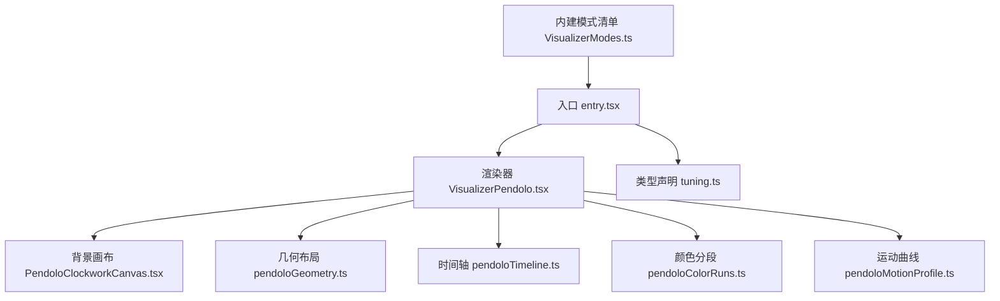
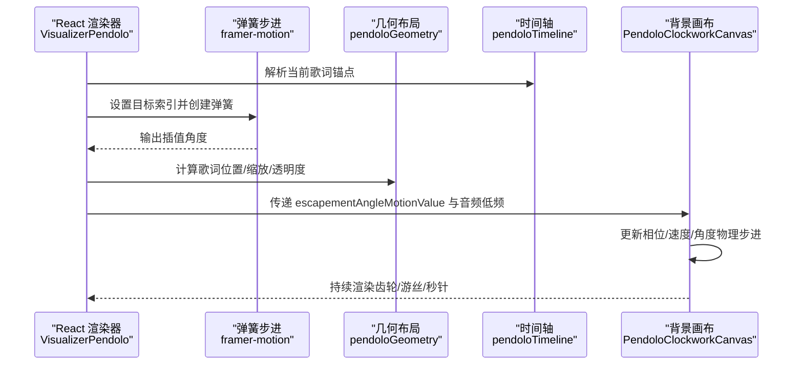
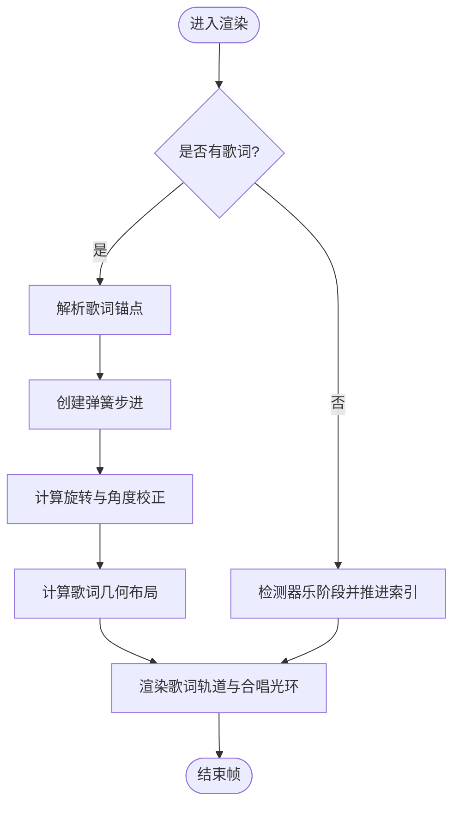
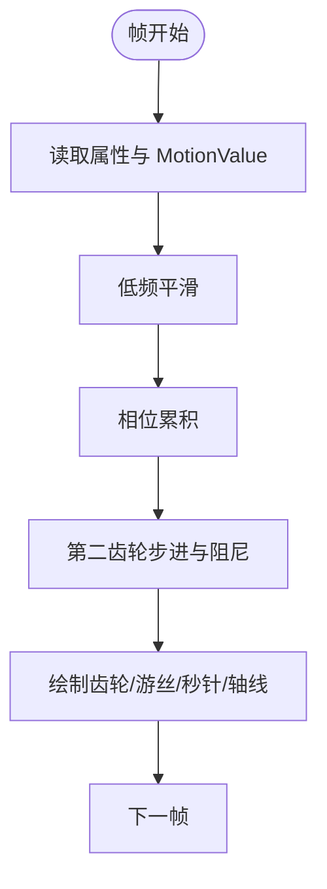
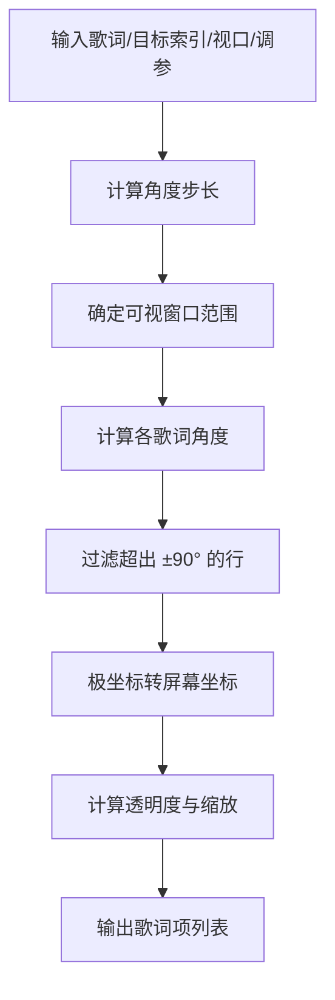
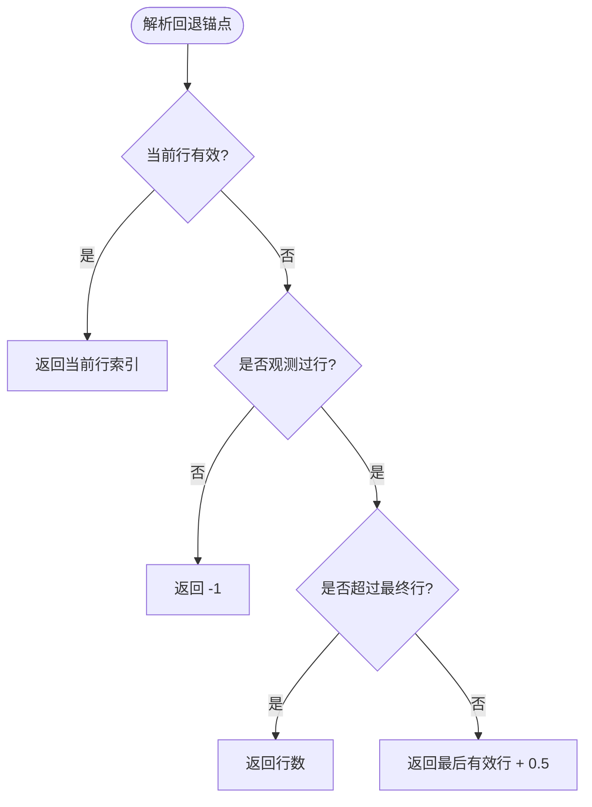
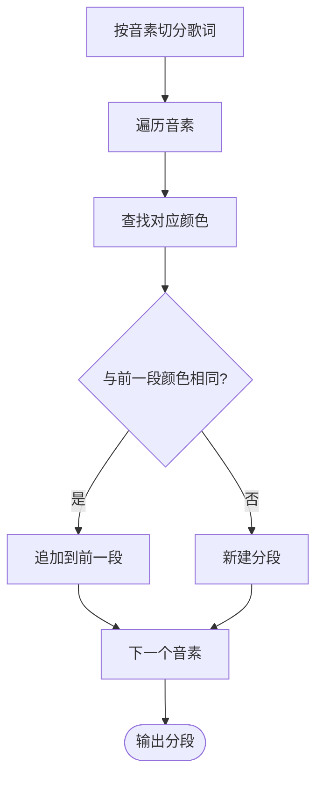
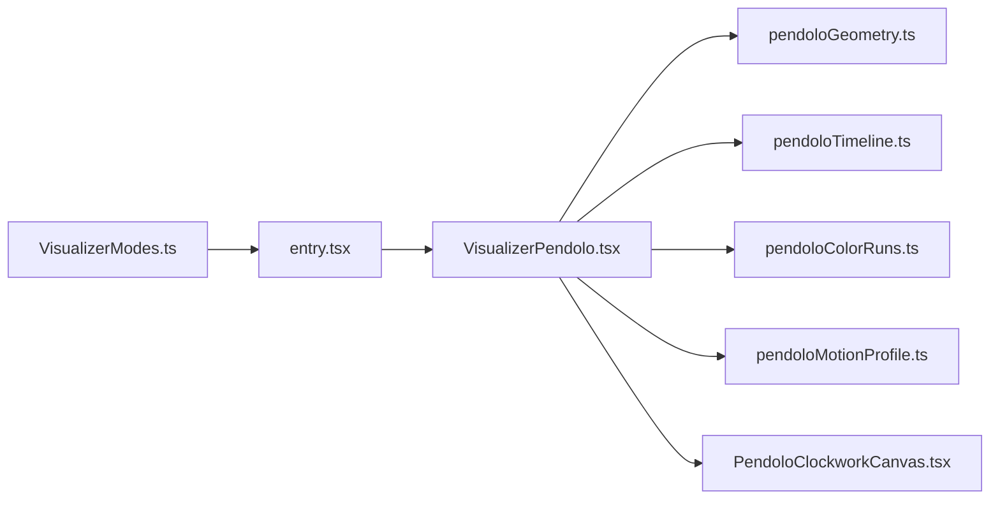

# 擒纵可视化模式实现

<cite>
**本文引用的文件**   
- [VisualizerPendolo.tsx](file://src/components/visualizer/pendolo/VisualizerPendolo.tsx)
- [PendoloClockworkCanvas.tsx](file://src/components/visualizer/pendolo/PendoloClockworkCanvas.tsx)
- [pendoloGeometry.ts](file://src/components/visualizer/pendolo/pendoloGeometry.ts)
- [pendoloTimeline.ts](file://src/components/visualizer/pendolo/pendoloTimeline.ts)
- [pendoloColorRuns.ts](file://src/components/visualizer/pendolo/pendoloColorRuns.ts)
- [pendoloMotionProfile.ts](file://src/components/visualizer/pendolo/pendoloMotionProfile.ts)
- [tuning.ts](file://src/components/visualizer/pendolo/tuning.ts)
- [entry.tsx](file://src/components/visualizer/pendolo/entry.tsx)
- [VisualizerModes.ts](file://src/types/visualizerModes.ts)
</cite>

## 目录
1. [简介](#简介)
2. [项目结构](#项目结构)
3. [核心组件](#核心组件)
4. [架构总览](#架构总览)
5. [详细组件分析](#详细组件分析)
6. [依赖关系分析](#依赖关系分析)
7. [性能与优化](#性能与优化)
8. [故障排查](#故障排查)
9. [结论](#结论)
10. [附录：参数调优与扩展指南](#附录参数调优与扩展指南)

## 简介
本文件为“擒纵”（Pendolo）可视化模式的完整技术文档。该模式以机械钟表的擒纵机构为灵感，将歌词沿弧形轨道排布，并通过弹簧阻尼系统驱动轮盘步进；背景使用 Canvas 绘制齿轮、游丝与摆轮等机械装饰，同时提供颜色动画、几何变换、时间轴关键帧与运动曲线控制。文档覆盖物理引擎、重力与阻尼模拟、时间轴与插值、几何变换、颜色动画、性能优化、参数调优以及二次开发指南。

## 项目结构
Pendolo 模式位于可视化子系统下，采用“入口注册 + 渲染器 + 几何/时间轴/颜色工具 + 设置面板”的分层组织方式：

图表来源
- [entry.tsx:10-25](file://src/components/visualizer/pendolo/entry.tsx#L10-L25)
- [VisualizerModes.ts:15-30](file://src/types/visualizerModes.ts#L15-L30)

章节来源
- [entry.tsx:1-26](file://src/components/visualizer/pendolo/entry.tsx#L1-L26)
- [VisualizerModes.ts:1-75](file://src/types/visualizerModes.ts#L1-L75)

## 核心组件
- 渲染器 VisualizerPendolo：负责歌词轨道、交互滚动、弹簧步进、歌词布局与合唱高亮。
- 背景画布 PendoloClockworkCanvas：基于 Canvas 的机械齿轮、游丝、摆轮与秒针齿轮动画。
- 几何布局 pendoloGeometry：计算歌词在弧形轨道上的角度、坐标、缩放与透明度。
- 时间轴 pendoloTimeline：处理无歌词或歌词切换时的锚点回退与可见弧段淡入淡出。
- 颜色分段 pendoloColorRuns：按音素级粒度合并同色文本片段，提升排版稳定性。
- 运动曲线 pendoloMotionProfile：根据主题强度选择 calm/normal/chaotic 三种机械运动风格。
- 类型声明 tuning.ts：将 Pendolo 强类型调参与设置注入渲染边界。

章节来源
- [VisualizerPendolo.tsx:40-45](file://src/components/visualizer/pendolo/VisualizerPendolo.tsx#L40-L45)
- [PendoloClockworkCanvas.tsx:214-237](file://src/components/visualizer/pendolo/PendoloClockworkCanvas.tsx#L214-L237)
- [pendoloGeometry.ts:19-31](file://src/components/visualizer/pendolo/pendoloGeometry.ts#L19-L31)
- [pendoloTimeline.ts:5-12](file://src/components/visualizer/pendolo/pendoloTimeline.ts#L5-L12)
- [pendoloColorRuns.ts:5-17](file://src/components/visualizer/pendolo/pendoloColorRuns.ts#L5-L17)
- [pendoloMotionProfile.ts:5-15](file://src/components/visualizer/pendolo/pendoloMotionProfile.ts#L5-L15)
- [tuning.ts:3-10](file://src/components/visualizer/pendolo/tuning.ts#L3-L10)

## 架构总览
Pendolo 模式由 React 组件层与 Canvas 渲染层协作完成：React 负责歌词轨道、交互与动画状态；Canvas 负责机械背景的高频绘制。两者通过 MotionValue 与 props 同步数据。

图表来源
- [VisualizerPendolo.tsx:318-363](file://src/components/visualizer/pendolo/VisualizerPendolo.tsx#L318-L363)
- [VisualizerPendolo.tsx:398-410](file://src/components/visualizer/pendolo/VisualizerPendolo.tsx#L398-L410)
- [VisualizerPendolo.tsx:431-450](file://src/components/visualizer/pendolo/VisualizerPendolo.tsx#L431-L450)
- [PendoloClockworkCanvas.tsx:328-362](file://src/components/visualizer/pendolo/PendoloClockworkCanvas.tsx#L328-L362)

## 详细组件分析

### 渲染器 VisualizerPendolo
职责
- 管理视口尺寸、歌词轨道滚动（滚轮/触摸）、手动锚点与自动回退。
- 使用 framer-motion 的 useSpring/useTransform 构建弹簧步进与旋转校正。
- 计算歌词块高度、布局与合唱光环效果。
- 向背景画布传递 escapementAngleMotionValue 与音频低频。

关键流程
- 歌词锚点回退：当无有效歌词时，依据最后观察到的行索引与播放时间决定回退策略。
- 弹簧步进：根据目标行索引生成弹簧，刚度与阻尼受主题强度与运动曲线影响。
- 歌词布局：调用几何模块计算弧形轨道上歌词的角度、坐标、缩放与透明度。
- 交互滚动：滚轮与触摸事件累积步数，限制最大步长并在空闲后重置。

图表来源
- [VisualizerPendolo.tsx:113-122](file://src/components/visualizer/pendolo/VisualizerPendolo.tsx#L113-L122)
- [VisualizerPendolo.tsx:124-174](file://src/components/visualizer/pendolo/VisualizerPendolo.tsx#L124-L174)
- [VisualizerPendolo.tsx:318-363](file://src/components/visualizer/pendolo/VisualizerPendolo.tsx#L318-L363)
- [VisualizerPendolo.tsx:398-410](file://src/components/visualizer/pendolo/VisualizerPendolo.tsx#L398-L410)

章节来源
- [VisualizerPendolo.tsx:40-45](file://src/components/visualizer/pendolo/VisualizerPendolo.tsx#L40-L45)
- [VisualizerPendolo.tsx:113-122](file://src/components/visualizer/pendolo/VisualizerPendolo.tsx#L113-L122)
- [VisualizerPendolo.tsx:124-174](file://src/components/visualizer/pendolo/VisualizerPendolo.tsx#L124-L174)
- [VisualizerPendolo.tsx:318-363](file://src/components/visualizer/pendolo/VisualizerPendolo.tsx#L318-L363)
- [VisualizerPendolo.tsx:398-410](file://src/components/visualizer/pendolo/VisualizerPendolo.tsx#L398-L410)
- [VisualizerPendolo.tsx:431-450](file://src/components/visualizer/pendolo/VisualizerPendolo.tsx#L431-L450)

### 背景画布 PendoloClockworkCanvas
职责
- 使用 Canvas 绘制机械齿轮组、游丝、摆轮、秒针齿轮与焦点轴线。
- 维护相位、平滑低频、第二齿轮步进与阻尼，形成类物理的振荡与衰减。
- 根据主题与配置动态调整不透明度、描边与发光滤镜。

物理与动画要点
- 相位累积：基于 dt 与低频响应调节角速度，驱动摆轮摆动。
- 第二齿轮步进：每帧累加时间，按固定步长更新目标角度，并用弹簧-阻尼模型计算速度与角度。
- 低频平滑：对音频低频进行指数平滑，避免突变。
- 渲染循环：requestAnimationFrame 驱动，按设备像素比缩放画布，裁剪到机械区域以减少透明像素分配。

图表来源
- [PendoloClockworkCanvas.tsx:328-362](file://src/components/visualizer/pendolo/PandoloClockworkCanvas.tsx#L328-L362)
- [PendoloClockworkCanvas.tsx:378-390](file://src/components/visualizer/pendolo/PendoloClockworkCanvas.tsx#L378-L390)
- [PendoloClockworkCanvas.tsx:820-830](file://src/components/visualizer/pendolo/PendoloClockworkCanvas.tsx#L820-L830)

章节来源
- [PendoloClockworkCanvas.tsx:214-237](file://src/components/visualizer/pendolo/PendoloClockworkCanvas.tsx#L214-L237)
- [PendoloClockworkCanvas.tsx:328-362](file://src/components/visualizer/pendolo/PendoloClockworkCanvas.tsx#L328-L362)
- [PendoloClockworkCanvas.tsx:378-390](file://src/components/visualizer/pendolo/PendoloClockworkCanvas.tsx#L378-L390)
- [PendoloClockworkCanvas.tsx:820-830](file://src/components/visualizer/pendolo/PendoloClockworkCanvas.tsx#L820-L830)

### 几何布局 pendoloGeometry
职责
- 计算歌词在弧形轨道上的角度、坐标、缩放与透明度。
- 根据目标行索引与可视窗口数量确定相邻歌词间距。
- 仅渲染右侧半圆（±90°）内的歌词，保证视觉聚焦于焦点轴。

算法要点
- 角度步长：按可视窗口数量均分总弧度。
- 距离衰减：随距离焦点行的偏移降低透明度与缩放。
- 坐标映射：极坐标转屏幕坐标，结合中心点与半径。

图表来源
- [pendoloGeometry.ts:22-31](file://src/components/visualizer/pendolo/pendoloGeometry.ts#L22-L31)
- [pendoloGeometry.ts:36-70](file://src/components/visualizer/pendolo/pendoloGeometry.ts#L36-L70)
- [pendoloGeometry.ts:72-113](file://src/components/visualizer/pendolo/pendoloGeometry.ts#L72-L113)

章节来源
- [pendoloGeometry.ts:19-31](file://src/components/visualizer/pendolo/pendoloGeometry.ts#L19-L31)
- [pendoloGeometry.ts:36-70](file://src/components/visualizer/pendolo/pendoloGeometry.ts#L36-L70)
- [pendoloGeometry.ts:72-113](file://src/components/visualizer/pendolo/pendoloGeometry.ts#L72-L113)

### 时间轴 pendoloTimeline
职责
- 在无有效歌词时回退到最后一个有效行或最终行之后。
- 根据轮盘旋转角度与可见弧段计算歌词淡入淡出。

关键点
- 回退锚点：优先使用当前行；若无观测行则返回 -1；若超过最终行则返回长度；否则返回最后有效行+0.5。
- 可见弧段：仅在右半侧可见弧内渐显，边缘渐变宽度用于柔和过渡。

图表来源
- [pendoloTimeline.ts:6-28](file://src/components/visualizer/pendolo/pendoloTimeline.ts#L6-L28)
- [pendoloTimeline.ts:30-43](file://src/components/visualizer/pendolo/pendoloTimeline.ts#L30-L43)

章节来源
- [pendoloTimeline.ts:5-12](file://src/components/visualizer/pendolo/pendoloTimeline.ts#L5-L12)
- [pendoloTimeline.ts:30-43](file://src/components/visualizer/pendolo/pendoloTimeline.ts#L30-L43)

### 颜色分段 pendoloColorRuns
职责
- 将歌词按音素切分，并将相邻同色片段合并为一段，减少排版开销并保持字形稳定。

要点
- 输入：歌词文本、起始索引、词元颜色映射、默认颜色。
- 输出：颜色分段数组，每个分段包含键、文本与颜色。

图表来源
- [pendoloColorRuns.ts:11-29](file://src/components/visualizer/pendolo/pendoloColorRuns.ts#L11-L29)

章节来源
- [pendoloColorRuns.ts:5-17](file://src/components/visualizer/pendolo/pendoloColorRuns.ts#L5-L17)
- [pendoloColorRuns.ts:11-29](file://src/components/visualizer/pendolo/pendoloColorRuns.ts#L11-L29)

### 运动曲线 pendoloMotionProfile
职责
- 根据主题动画强度选择 calm/normal/chaotic 三种机械运动风格，影响平衡轮速度/振幅、擒纵弹簧/阻尼、合唱光环不透明度与过渡时长。

要点
- 强度排序：calm < normal < chaotic，确保从克制到激进的渐进。
- 与渲染器联动：弹簧刚度与阻尼乘以对应乘数，背景画布的低频响应与摆轮振幅也受其影响。

章节来源
- [pendoloMotionProfile.ts:5-15](file://src/components/visualizer/pendolo/pendoloMotionProfile.ts#L5-L15)

### 类型声明 tuning.ts
职责
- 将 Pendolo 的强类型调参与设置注入渲染边界，供设置面板与预览使用。

章节来源
- [tuning.ts:3-10](file://src/components/visualizer/pendolo/tuning.ts#L3-L10)

## 依赖关系分析
Pendolo 模式内部依赖清晰，外部依赖主要为 React、framer-motion、Canvas API 与字体排版库。

图表来源
- [entry.tsx:10-25](file://src/components/visualizer/pendolo/entry.tsx#L10-L25)
- [VisualizerModes.ts:15-30](file://src/types/visualizerModes.ts#L15-L30)

章节来源
- [entry.tsx:1-26](file://src/components/visualizer/pendolo/entry.tsx#L1-L26)
- [VisualizerModes.ts:1-75](file://src/types/visualizerModes.ts#L1-L75)

## 性能与优化
- 批量渲染与裁剪
  - 背景画布根据机械区域计算内容框，避免全屏透明像素分配。
  - 使用 devicePixelRatio 缩放画布，保证清晰度并减少重绘面积。
- 缓存机制
  - 歌词块高度预计算，避免重复测量。
  - 歌词几何布局使用 useMemo 缓存，减少频繁重算。
- 帧率限制与节流
  - 背景画布使用 requestAnimationFrame 驱动，dt 上限限制防止跳帧。
  - 低频平滑使用指数平滑，避免剧烈抖动。
- 交互节流
  - 滚轮与触摸事件累积步数并限制最大步长，空闲后重置，避免过度触发。

章节来源
- [PendoloClockworkCanvas.tsx:184-212](file://src/components/visualizer/pendolo/PendoloClockworkCanvas.tsx#L184-L212)
- [PendoloClockworkCanvas.tsx:328-362](file://src/components/visualizer/pendolo/PendoloClockworkCanvas.tsx#L328-L362)
- [VisualizerPendolo.tsx:366-396](file://src/components/visualizer/pendolo/VisualizerPendolo.tsx#L366-L396)
- [VisualizerPendolo.tsx:239-288](file://src/components/visualizer/pendolo/VisualizerPendolo.tsx#L239-L288)

## 故障排查
- 歌词不显示或错位
  - 检查几何布局是否仅渲染右侧半圆（±90°），确认目标索引与可视窗口范围。
  - 验证歌词块高度预计算是否正确，避免重叠。
- 背景画布闪烁或卡顿
  - 检查 dt 上限与低频平滑系数，避免过大跳变。
  - 确认画布宽高与设备像素比设置正确。
- 弹簧步进异常
  - 检查弹簧刚度与阻尼乘数是否与运动曲线一致。
  - 确认 escapementAngleMotionValue 传递正确。
- 交互滚动无效
  - 检查滚轮与触摸事件监听是否绑定到轨道元素。
  - 确认步数累积与阈值逻辑正常。

章节来源
- [pendoloGeometry.ts:72-113](file://src/components/visualizer/pendolo/pendoloGeometry.ts#L72-L113)
- [PendoloClockworkCanvas.tsx:328-362](file://src/components/visualizer/pendolo/PendoloClockworkCanvas.tsx#L328-L362)
- [VisualizerPendolo.tsx:318-363](file://src/components/visualizer/pendolo/VisualizerPendolo.tsx#L318-L363)
- [VisualizerPendolo.tsx:239-288](file://src/components/visualizer/pendolo/VisualizerPendolo.tsx#L239-L288)

## 结论
Pendolo 模式通过 React 与 Canvas 的协同，实现了具有机械美感的歌词可视化。其物理引擎以相位累积与弹簧-阻尼模型为核心，时间轴与几何布局确保歌词在弧形轨道上的稳定呈现，颜色分段与合唱光环增强可读性与视觉层次。性能优化涵盖批量渲染、缓存与帧率控制，参数调优提供丰富的可定制空间。

## 附录：参数调优与扩展指南

### 物理参数调优
- 重力与阻尼
  - 背景画布中的第二齿轮速度衰减使用指数函数，可调阻尼乘数以改变衰减速率。
  - 摆轮摆动幅度与频率受低频响应与平衡轮速度/振幅乘数影响。
- 弹性系数
  - 弹簧刚度与阻尼在渲染器中通过 useSpring 设置，并与运动曲线乘数联动。
- 摩擦系数
  - 可通过调整第二齿轮位移到速度的转换系数与阻尼项来模拟不同摩擦特性。

章节来源
- [PendoloClockworkCanvas.tsx:346-362](file://src/components/visualizer/pendolo/PendoloClockworkCanvas.tsx#L346-L362)
- [VisualizerPendolo.tsx:318-328](file://src/components/visualizer/pendolo/VisualizerPendolo.tsx#L318-L328)

### 自定义钟摆运动与物理效果
- 修改运动曲线
  - 在运动曲线文件中新增 profile，调整 balanceSpeedMultiplier、balanceAmplitudeMultiplier、escapementSpringMultiplier、escapementDampingMultiplier 等字段。
- 扩展背景装饰
  - 在背景画布中添加新的齿轮组或装饰路径，保持 wireframe 风格与主题色一致性。
- 调整时间轴行为
  - 在时间轴模块中扩展回退策略或可见弧段淡入淡出逻辑，以适应不同歌词节奏。

章节来源
- [pendoloMotionProfile.ts:5-15](file://src/components/visualizer/pendolo/pendoloMotionProfile.ts#L5-L15)
- [PendoloClockworkCanvas.tsx:480-796](file://src/components/visualizer/pendolo/PendoloClockworkCanvas.tsx#L480-L796)
- [pendoloTimeline.ts:6-28](file://src/components/visualizer/pendolo/pendoloTimeline.ts#L6-L28)