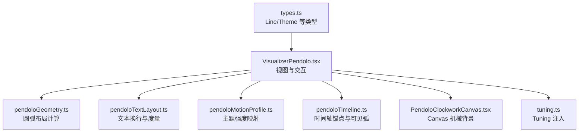
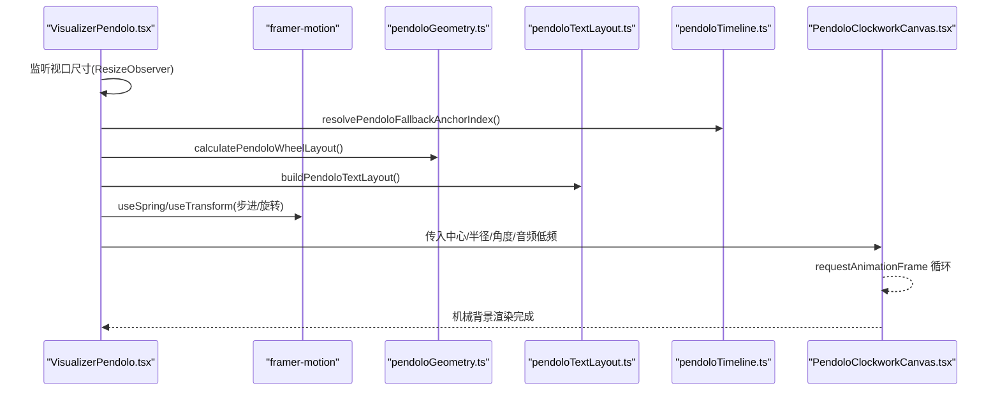
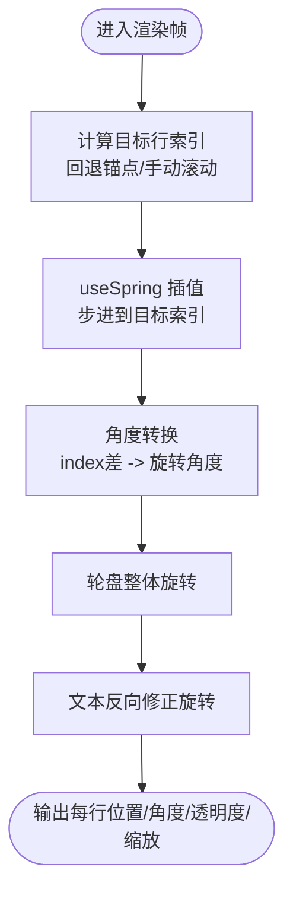
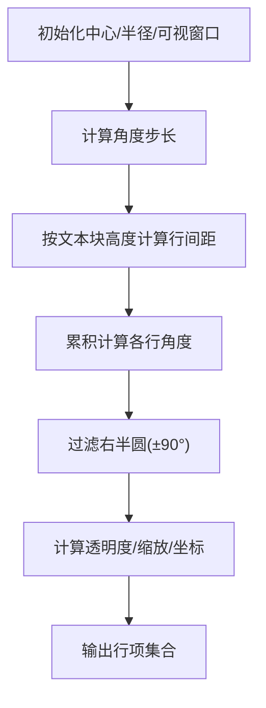
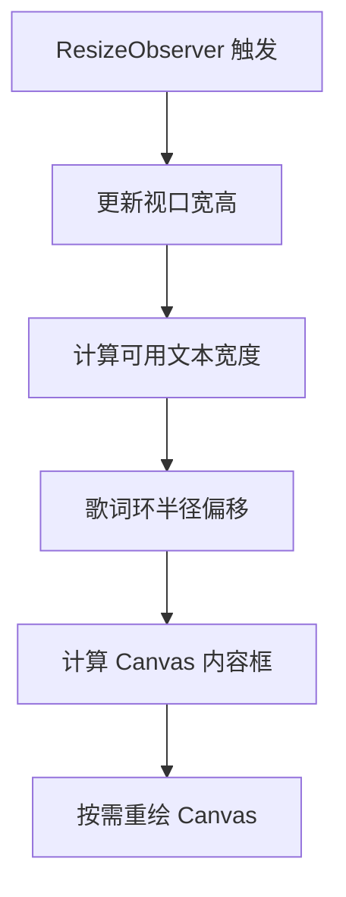
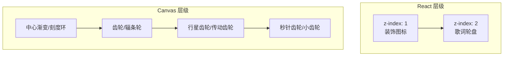
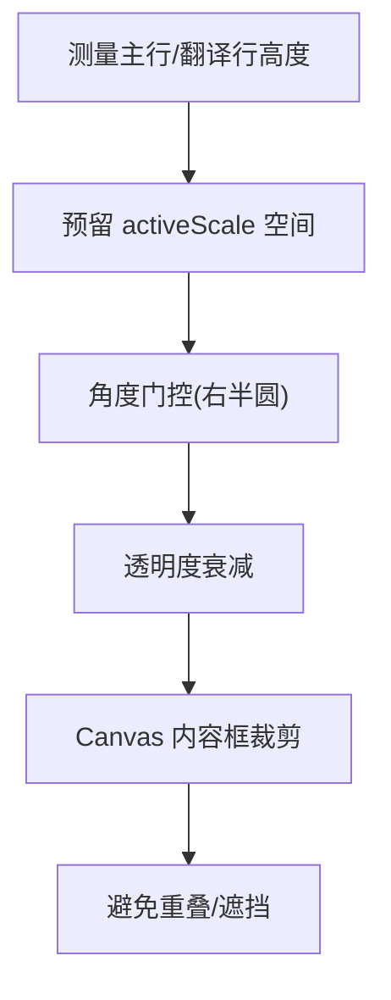
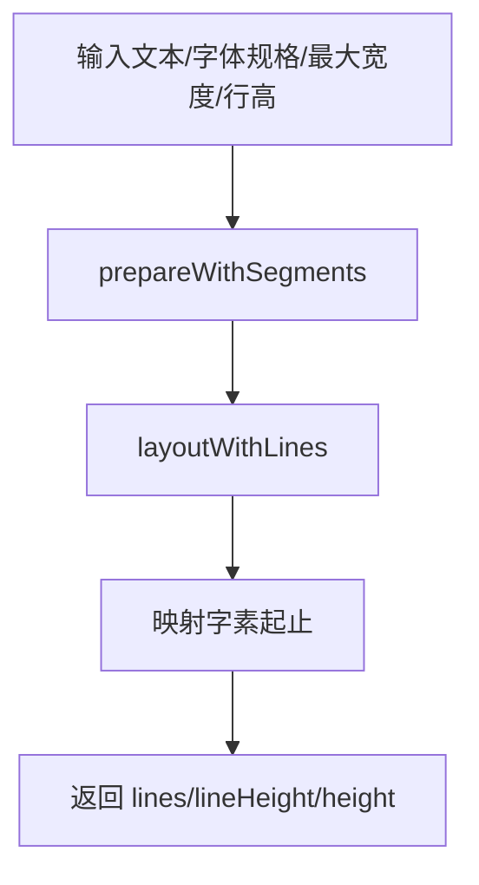
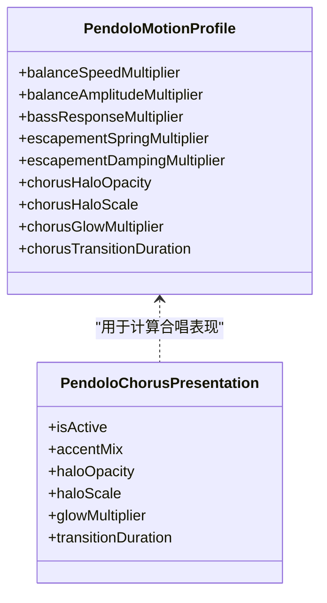
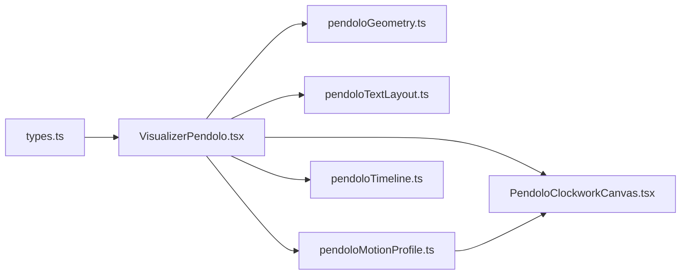

# 几何变换系统

<cite>
**本文引用的文件**   
- [VisualizerPendolo.tsx](file://src/components/visualizer/pendolo/VisualizerPendolo.tsx)
- [PendoloClockworkCanvas.tsx](file://src/components/visualizer/pendolo/PendoloClockworkCanvas.tsx)
- [pendoloGeometry.ts](file://src/components/visualizer/pendolo/pendoloGeometry.ts)
- [pendoloTextLayout.ts](file://src/components/visualizer/pendolo/pendoloTextLayout.ts)
- [pendoloMotionProfile.ts](file://src/components/visualizer/pendolo/pendoloMotionProfile.ts)
- [pendoloTimeline.ts](file://src/components/visualizer/pendolo/pendoloTimeline.ts)
- [tuning.ts](file://src/components/visualizer/pendolo/tuning.ts)
- [types.ts](file://src/types.ts)
</cite>

## 目录
1. [简介](#简介)
2. [项目结构](#项目结构)
3. [核心组件](#核心组件)
4. [架构总览](#架构总览)
5. [详细组件分析](#详细组件分析)
6. [依赖关系分析](#依赖关系分析)
7. [性能与优化](#性能与优化)
8. [故障排查指南](#故障排查指南)
9. [结论](#结论)
10. [附录：参数调优指南](#附录参数调优指南)

## 简介
本技术文档聚焦 Pendolo 模式的几何变换系统，围绕钟摆运动数学模型、圆弧布局算法、视口适配机制、3D 变换效果、碰撞检测与遮挡处理，以及几何参数调优与性能优化进行系统化说明。该系统以“擒纵轮 + 游丝”为视觉隐喻，将歌词行沿右侧半圆弧形排列，随播放进度步进旋转，并通过 Canvas 绘制机械齿轮背景，形成富有机械美感的动态歌词展示。

## 项目结构
Pendolo 模式位于可视化模块下，采用“模式文件夹 + 职责拆分”的组织方式：
- 视图入口与交互控制：VisualizerPendolo.tsx
- 机械背景渲染：PendoloClockworkCanvas.tsx
- 几何与布局：pendoloGeometry.ts、pendoloTextLayout.ts
- 动画曲线与主题强度映射：pendoloMotionProfile.ts
- 时间轴锚点与可见弧遮罩：pendoloTimeline.ts
- 类型定义与配置注入：types.ts、tuning.ts

**图表来源**
- [VisualizerPendolo.tsx:1-627](file://src/components/visualizer/pendolo/VisualizerPendolo.tsx#L1-L627)
- [pendoloGeometry.ts:1-129](file://src/components/visualizer/pendolo/pendoloGeometry.ts#L1-L129)
- [pendoloTextLayout.ts:1-49](file://src/components/visualizer/pendolo/pendoloTextLayout.ts#L1-L49)
- [pendoloMotionProfile.ts:1-85](file://src/components/visualizer/pendolo/pendoloMotionProfile.ts#L1-L85)
- [pendoloTimeline.ts:1-44](file://src/components/visualizer/pendolo/pendoloTimeline.ts#L1-L44)
- [PendoloClockworkCanvas.tsx:1-855](file://src/components/visualizer/pendolo/PendoloClockworkCanvas.tsx#L1-L855)
- [tuning.ts:1-11](file://src/components/visualizer/pendolo/tuning.ts#L1-L11)
- [types.ts:54-102](file://src/types.ts#L54-L102)

**章节来源**
- [VisualizerPendolo.tsx:1-627](file://src/components/visualizer/pendolo/VisualizerPendolo.tsx#L1-L627)
- [types.ts:54-102](file://src/types.ts#L54-L102)

## 核心组件
- VisualizerPendolo.tsx：负责视口尺寸监听、滚动/触摸交互、弹簧步进（framer-motion）、歌词定位与旋转、合唱高亮、子标题显示、字体与排版、以及与 Canvas 背景的集成。
- PendoloClockworkCanvas.tsx：基于 Canvas 的机械背景渲染，包括齿轮、辐条轮、游丝、刻度环、中心渐变、封面图裁剪、秒针齿轮步进等。
- pendoloGeometry.ts：计算歌词在圆弧上的角度、坐标、透明度与缩放，并测量文本宽度。
- pendoloTextLayout.ts：使用 @chenglou/pretext 构建稳定换行结果，用于垂直间距与词级填充对齐。
- pendoloMotionProfile.ts：根据主题强度（calm/normal/chaotic）解析运动参数，如平衡速度、振幅、低音响应、擒纵弹簧与阻尼、合唱光环等。
- pendoloTimeline.ts：提供无歌词时的回退锚点、歌词行可见弧边缘淡入淡出逻辑。
- tuning.ts：将 Pendolo 的强类型 tuning 注入到渲染器边界。
- types.ts：定义 Line、Theme 等基础类型。

**章节来源**
- [VisualizerPendolo.tsx:1-627](file://src/components/visualizer/pendolo/VisualizerPendolo.tsx#L1-L627)
- [PendoloClockworkCanvas.tsx:1-855](file://src/components/visualizer/pendolo/PendoloClockworkCanvas.tsx#L1-L855)
- [pendoloGeometry.ts:1-129](file://src/components/visualizer/pendolo/pendoloGeometry.ts#L1-L129)
- [pendoloTextLayout.ts:1-49](file://src/components/visualizer/pendolo/pendoloTextLayout.ts#L1-L49)
- [pendoloMotionProfile.ts:1-85](file://src/components/visualizer/pendolo/pendoloMotionProfile.ts#L1-L85)
- [pendoloTimeline.ts:1-44](file://src/components/visualizer/pendolo/pendoloTimeline.ts#L1-L44)
- [tuning.ts:1-11](file://src/components/visualizer/pendolo/tuning.ts#L1-L11)
- [types.ts:54-102](file://src/types.ts#L54-L102)

## 架构总览
Pendolo 的渲染管线由 React 视图层与 Canvas 背景层协同完成：
- React 层：计算视口、歌词布局、旋转角度、透明度、缩放；通过 framer-motion 驱动弹簧与变换值；管理交互事件（滚轮、触摸）。
- Canvas 层：按帧更新机械背景，受音频低频与主题强度影响，呈现齿轮、游丝、刻度、中心渐变与封面图。

**图表来源**
- [VisualizerPendolo.tsx:67-94](file://src/components/visualizer/pendolo/VisualizerPendolo.tsx#L67-L94)
- [VisualizerPendolo.tsx:113-122](file://src/components/visualizer/pendolo/VisualizerPendolo.tsx#L113-L122)
- [VisualizerPendolo.tsx:318-362](file://src/components/visualizer/pendolo/VisualizerPendolo.tsx#L318-L362)
- [pendoloGeometry.ts:22-114](file://src/components/visualizer/pendolo/pendoloGeometry.ts#L22-L114)
- [pendoloTextLayout.ts:20-48](file://src/components/visualizer/pendolo/pendoloTextLayout.ts#L20-L48)
- [pendoloTimeline.ts:5-28](file://src/components/visualizer/pendolo/pendoloTimeline.ts#L5-L28)
- [PendoloClockworkCanvas.tsx:319-390](file://src/components/visualizer/pendolo/PendoloClockworkCanvas.tsx#L319-L390)

## 详细组件分析

### 钟摆运动数学模型与轨迹规划
- 目标索引与回退锚点：当当前行不可用或播放处于间奏时，使用回退策略确定目标行索引，保证轮盘始终有锚点。
- 弹簧步进：使用 framer-motion 的 useSpring 对目标行索引进行物理弹簧插值，产生平滑的“擒纵”步进感。
- 角度与旋转：将目标行索引差值转换为轮盘旋转角度，同时为文本提供反向修正旋转，使文字保持可读方向。
- 节拍与低频：Canvas 侧根据音频低频平滑值调整平衡轮相位与游丝摆动幅度，增强节奏感。

**图表来源**
- [VisualizerPendolo.tsx:113-122](file://src/components/visualizer/pendolo/VisualizerPendolo.tsx#L113-L122)
- [VisualizerPendolo.tsx:318-362](file://src/components/visualizer/pendolo/VisualizerPendolo.tsx#L318-L362)
- [pendoloTimeline.ts:5-28](file://src/components/visualizer/pendolo/pendoloTimeline.ts#L5-L28)

**章节来源**
- [VisualizerPendolo.tsx:113-122](file://src/components/visualizer/pendolo/VisualizerPendolo.tsx#L113-L122)
- [VisualizerPendolo.tsx:318-362](file://src/components/visualizer/pendolo/VisualizerPendolo.tsx#L318-L362)
- [pendoloTimeline.ts:5-28](file://src/components/visualizer/pendolo/pendoloTimeline.ts#L5-L28)

### 圆弧布局算法（歌词项定位、旋转角度、间距分配）
- 中心与半径：根据视口尺寸与 tuning 的中心比例与弧度半径计算圆心与基础半径。
- 可视窗口：以目标行为中心，左右各扩展若干行，确保足够上下文。
- 角度步长：根据总弧度与可视行数计算相邻行的角度步长。
- 高度自适应间距：使用文本块高度估算行间距，避免重叠。
- 右半圆过滤：仅渲染焦点轴 ±90° 范围内的行，形成右侧半圆弧形。
- 透明度与缩放：焦点行获得放大与更高不透明度，邻近行渐隐缩小。

**图表来源**
- [pendoloGeometry.ts:22-114](file://src/components/visualizer/pendolo/pendoloGeometry.ts#L22-L114)

**章节来源**
- [pendoloGeometry.ts:22-114](file://src/components/visualizer/pendolo/pendoloGeometry.ts#L22-L114)

### 视口适配机制（响应式布局、缩放计算、边界检测）
- 视口尺寸监听：使用 ResizeObserver 实时获取容器宽高，避免硬编码分辨率。
- 可用文本宽度：根据视口宽度与最大项 X 坐标限制，计算文本最大宽度，防止溢出。
- 半径偏移：为歌词环增加额外半径偏移，避免与机械背景重叠。
- Canvas 内容框：根据中心、半径与歌词环半径计算最小渲染区域，减少透明像素浪费。

**图表来源**
- [VisualizerPendolo.tsx:67-94](file://src/components/visualizer/pendolo/VisualizerPendolo.tsx#L67-L94)
- [VisualizerPendolo.tsx:339-349](file://src/components/visualizer/pendolo/VisualizerPendolo.tsx#L339-L349)
- [PendoloClockworkCanvas.tsx:184-212](file://src/components/visualizer/pendolo/PendoloClockworkCanvas.tsx#L184-L212)

**章节来源**
- [VisualizerPendolo.tsx:67-94](file://src/components/visualizer/pendolo/VisualizerPendolo.tsx#L67-L94)
- [VisualizerPendolo.tsx:339-349](file://src/components/visualizer/pendolo/VisualizerPendolo.tsx#L339-L349)
- [PendoloClockworkCanvas.tsx:184-212](file://src/components/visualizer/pendolo/PendoloClockworkCanvas.tsx#L184-L212)

### 3D 变换效果（透视投影、深度排序、层级管理）
- 透视投影：通过 CSS transform 的 translateZ(0) 启用硬件加速，配合 rotate/scale 实现伪 3D 效果。
- 深度排序：React 层 z-index 分层（背景 Canvas < 装饰图标 < 歌词轮盘），Canvas 内部通过绘制顺序控制层次。
- 层级管理：歌词项包裹在 motion.div 中，独立设置 transformOrigin 与隔离层，避免合成冲突。

**图表来源**
- [VisualizerPendolo.tsx:451-468](file://src/components/visualizer/pendolo/VisualizerPendolo.tsx#L451-L468)
- [VisualizerPendolo.tsx:470-620](file://src/components/visualizer/pendolo/VisualizerPendolo.tsx#L470-L620)
- [PendoloClockworkCanvas.tsx:392-800](file://src/components/visualizer/pendolo/PendoloClockworkCanvas.tsx#L392-L800)

**章节来源**
- [VisualizerPendolo.tsx:451-468](file://src/components/visualizer/pendolo/VisualizerPendolo.tsx#L451-L468)
- [VisualizerPendolo.tsx:470-620](file://src/components/visualizer/pendolo/VisualizerPendolo.tsx#L470-L620)
- [PendoloClockworkCanvas.tsx:392-800](file://src/components/visualizer/pendolo/PendoloClockworkCanvas.tsx#L392-L800)

### 碰撞检测与遮挡处理（歌词重叠避免、视觉层次优化）
- 行间距与高度预估：通过 buildPendoloTextLayout 计算主行与翻译行的实际高度，结合 activeScale 预留空间，避免放大后重叠。
- 角度门控：仅渲染右半圆内的行，减少交叉与遮挡概率。
- 透明度衰减：远离焦点的行透明度降低，视觉层次清晰。
- Canvas 内容框裁剪：只绘制必要区域，避免多余透明像素导致的覆盖问题。

**图表来源**
- [VisualizerPendolo.tsx:366-396](file://src/components/visualizer/pendolo/VisualizerPendolo.tsx#L366-L396)
- [pendoloGeometry.ts:72-114](file://src/components/visualizer/pendolo/pendoloGeometry.ts#L72-L114)
- [PendoloClockworkCanvas.tsx:184-212](file://src/components/visualizer/pendolo/PendoloClockworkCanvas.tsx#L184-L212)

**章节来源**
- [VisualizerPendolo.tsx:366-396](file://src/components/visualizer/pendolo/VisualizerPendolo.tsx#L366-L396)
- [pendoloGeometry.ts:72-114](file://src/components/visualizer/pendolo/pendoloGeometry.ts#L72-L114)
- [PendoloClockworkCanvas.tsx:184-212](file://src/components/visualizer/pendolo/PendoloClockworkCanvas.tsx#L184-L212)

### 文本布局与词级填充
- 文本换行：使用 @chenglou/pretext 的 prepareWithSegments 与 layoutWithLines 生成稳定换行结果。
- 字素映射：记录每行的字素起止位置，便于词级高亮与填充。
- 多语言支持：翻译/罗马化文本使用独立字体栈与字号，保证可读性。

**图表来源**
- [pendoloTextLayout.ts:20-48](file://src/components/visualizer/pendolo/pendoloTextLayout.ts#L20-L48)

**章节来源**
- [pendoloTextLayout.ts:20-48](file://src/components/visualizer/pendolo/pendoloTextLayout.ts#L20-L48)

### 主题强度与运动曲线
- 强度映射：根据 Theme.animationIntensity 选择 calm/normal/chaotic 的运动参数集。
- 关键参数：平衡速度、振幅、低音响应、擒纵弹簧与阻尼、合唱光环不透明度/缩放/辉光倍数/过渡时长。
- 合唱表现：仅在活跃且正在演唱的合唱行上应用光环与辉光，过渡平滑。

**图表来源**
- [pendoloMotionProfile.ts:5-15](file://src/components/visualizer/pendolo/pendoloMotionProfile.ts#L5-L15)
- [pendoloMotionProfile.ts:53-84](file://src/components/visualizer/pendolo/pendoloMotionProfile.ts#L53-L84)

**章节来源**
- [pendoloMotionProfile.ts:5-15](file://src/components/visualizer/pendolo/pendoloMotionProfile.ts#L5-L15)
- [pendoloMotionProfile.ts:53-84](file://src/components/visualizer/pendolo/pendoloMotionProfile.ts#L53-L84)

## 依赖关系分析
- VisualizerPendolo.tsx 依赖：
  - pendoloGeometry.ts：圆弧布局计算
  - pendoloTextLayout.ts：文本换行与度量
  - pendoloMotionProfile.ts：主题强度映射
  - pendoloTimeline.ts：时间轴锚点与可见弧
  - PendoloClockworkCanvas.tsx：机械背景渲染
  - types.ts：Line/Theme 等类型
- PendoloClockworkCanvas.tsx 依赖：
  - pendoloMotionProfile.ts：运动参数
  - 外部库：Canvas API、framer-motion MotionValue

**图表来源**
- [VisualizerPendolo.tsx:1-18](file://src/components/visualizer/pendolo/VisualizerPendolo.tsx#L1-L18)
- [PendoloClockworkCanvas.tsx:1-28](file://src/components/visualizer/pendolo/PendoloClockworkCanvas.tsx#L1-L28)
- [types.ts:54-102](file://src/types.ts#L54-L102)

**章节来源**
- [VisualizerPendolo.tsx:1-18](file://src/components/visualizer/pendolo/VisualizerPendolo.tsx#L1-L18)
- [PendoloClockworkCanvas.tsx:1-28](file://src/components/visualizer/pendolo/PendoloClockworkCanvas.tsx#L1-L28)
- [types.ts:54-102](file://src/types.ts#L54-L102)

## 性能与优化
- 视口裁剪：Canvas 仅绘制必要内容框，减少透明像素分配与绘制开销。
- DPR 适配：根据 devicePixelRatio 调整 canvas 宽高，保证清晰度与性能平衡。
- 动画解耦：弹簧与变换值通过 framer-motion 在合成线程运行，避免阻塞主线程。
- 文本测量缓存：仅在必要时测量文本高度，并对远端行跳过测量。
- 低优先级装饰：齿轮装饰可关闭或减弱，降低绘制复杂度。
- 帧率控制：Canvas 使用 requestAnimationFrame，dt 上限限制避免跳帧抖动。

[本节为通用指导，不直接分析具体文件]

## 故障排查指南
- 歌词重叠：检查文本高度计算是否包含翻译行与 activeScale 预留空间；确认角度门控是否生效。
- 旋转异常：确认弹簧目标索引与角度转换是否正确；检查文本反向修正旋转是否应用。
- 视口错位：验证 ResizeObserver 是否正常触发；检查 contentBox 计算是否越界。
- Canvas 空白：确认 showGearDecor/showCenterGradient/showCover 至少一项开启；检查 ctx 获取与缩放。
- 交互无响应：检查 wheel/touch 事件监听是否绑定到正确元素；确认 passive 选项与 preventDefault 使用。

**章节来源**
- [VisualizerPendolo.tsx:67-94](file://src/components/visualizer/pendolo/VisualizerPendolo.tsx#L67-L94)
- [VisualizerPendolo.tsx:239-316](file://src/components/visualizer/pendolo/VisualizerPendolo.tsx#L239-L316)
- [PendoloClockworkCanvas.tsx:319-390](file://src/components/visualizer/pendolo/PendoloClockworkCanvas.tsx#L319-L390)

## 结论
Pendolo 几何变换系统通过精确的圆弧布局、稳定的文本换行、主题强度驱动的动画曲线与高性能 Canvas 背景渲染，实现了兼具机械美感与可读性的歌词展示。其模块化设计与清晰的职责划分，使得参数调优与性能优化具备良好可扩展性。

[本节为总结性内容，不直接分析具体文件]

## 附录：参数调优指南
- 曲率半径与中心：
  - arcRadius：控制圆弧半径占视口的比例，过小会导致拥挤，过大则失去聚焦。
  - wheelCenterX/Y：调整圆心位置，适应不同屏幕比例。
- 旋转速度与阻尼：
  - escapementSpringMultiplier：增大提升步进力度，减小使过渡更柔和。
  - escapementDampingMultiplier：增大提高阻尼，减小延长振荡。
- 低音响应与振幅：
  - bassResponseMultiplier：增强低频对游丝摆动的影响。
  - balanceAmplitudeMultiplier：调节平衡轮摆动幅度。
- 合唱光环与辉光：
  - chorusHaloOpacity/haloScale/glowMultiplier：控制合唱行的光环不透明度、缩放与辉光强度。
  - chorusTransitionDuration：过渡时长，建议与主题强度匹配。
- 装饰与背景：
  - showGearDecor：none/subtle/full，逐步增加机械细节。
  - showCenterGradient：开启中心渐变增强深度感。
  - showCoverOnWatchFace：在表盘内显示封面图，注意裁剪与透明度。
- 文本与间距：
  - activeScale：焦点行放大倍率，需配合文本高度预留避免重叠。
  - arcAngleDeg：可视弧度范围，影响行间距与可见行数。

**章节来源**
- [pendoloMotionProfile.ts:17-51](file://src/components/visualizer/pendolo/pendoloMotionProfile.ts#L17-L51)
- [VisualizerPendolo.tsx:318-362](file://src/components/visualizer/pendolo/VisualizerPendolo.tsx#L318-L362)
- [VisualizerPendolo.tsx:366-396](file://src/components/visualizer/pendolo/VisualizerPendolo.tsx#L366-L396)
- [pendoloGeometry.ts:22-114](file://src/components/visualizer/pendolo/pendoloGeometry.ts#L22-L114)