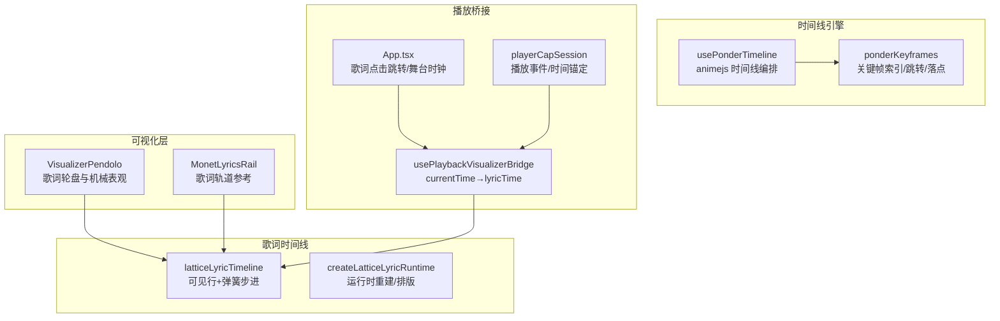
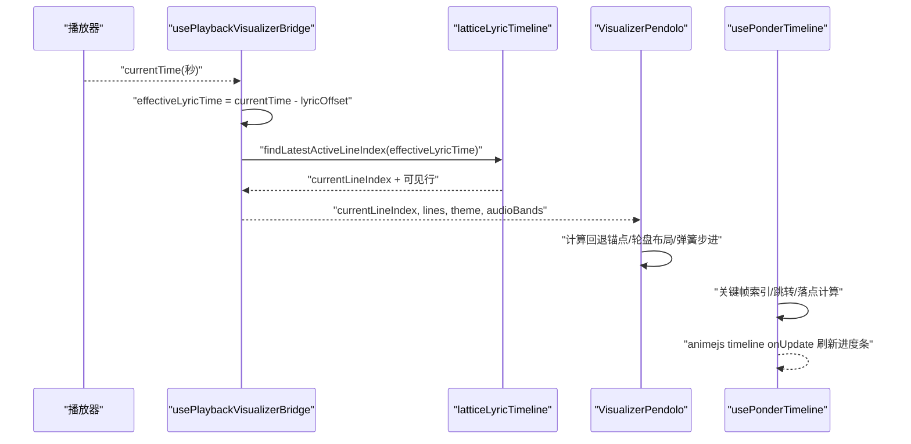
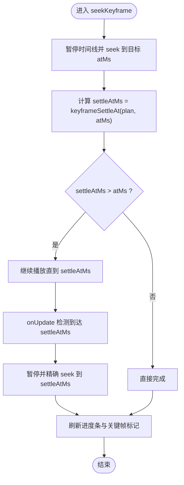
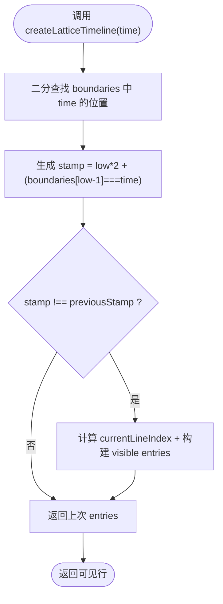
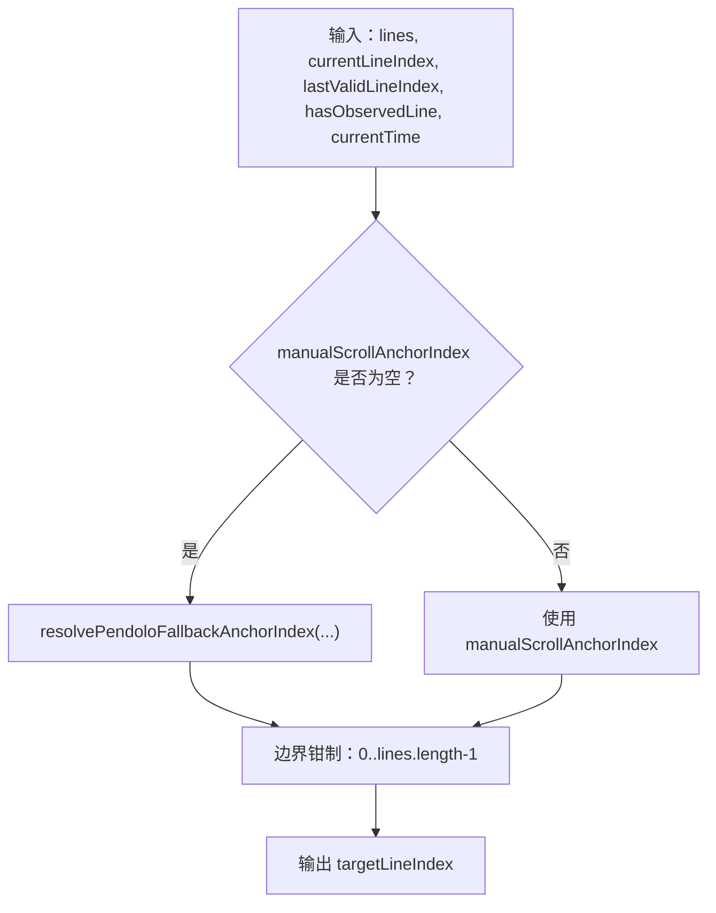
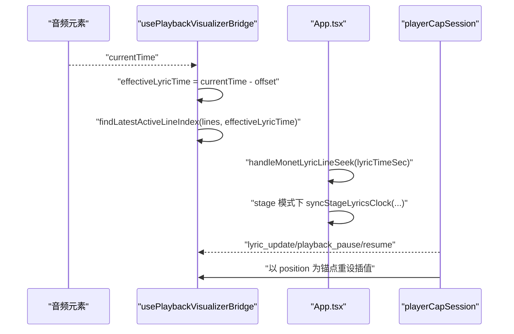
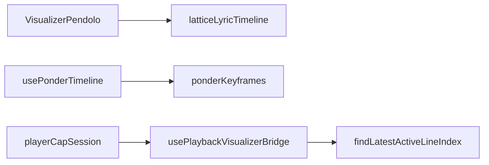

# 时间轴系统

<cite>
**本文引用的文件**   
- [latticeLyricTimeline.ts](file://src/components/app/lattice/lyrics/latticeLyricTimeline.ts)
- [ponderKeyframes.ts](file://src/utils/ponder/ponderKeyframes.ts)
- [usePonderTimeline.ts](file://src/components/ponder/usePonderTimeline.ts)
- [VisualizerPendolo.tsx](file://src/components/visualizer/pendolo/VisualizerPendolo.tsx)
- [pendoloMotionProfile.ts](file://src/components/visualizer/pendolo/pendoloMotionProfile.ts)
- [pendoloGeometry.ts](file://src/components/visualizer/pendolo/pendoloGeometry.ts)
- [usePlaybackVisualizerBridge.ts](file://src/hooks/usePlaybackVisualizerBridge.ts)
- [App.tsx](file://src/App.tsx)
- [playerCapSession.ts](file://src/utils/playerCapSession.ts)
- [MonetLyricsRail.tsx](file://src/components/visualizer/monet/MonetLyricsRail.tsx)
- [createLatticeLyricRuntime.ts](file://src/components/app/lattice/lyrics/createLatticeLyricRuntime.ts)
- [ponderKeyframes.test.ts](file://test/unit/ponder/ponderKeyframes.test.ts)
</cite>

## 目录
1. [引言](#引言)
2. [项目结构](#项目结构)
3. [核心组件](#核心组件)
4. [架构总览](#架构总览)
5. [详细组件分析](#详细组件分析)
6. [依赖关系分析](#依赖关系分析)
7. [性能考量](#性能考量)
8. [故障排除指南](#故障排除指南)
9. [结论](#结论)
10. [附录：配置调优与调试清单](#附录配置调优与调试清单)

## 引言
本技术文档聚焦 Pendolo 模式的时间轴系统，围绕以下目标展开：
- 关键帧管理、插值计算与时序控制机制
- 回退锚点索引解析逻辑（手动滚动状态、自动滚动恢复、边界条件）
- 时间同步机制（音频播放进度与歌词显示对齐）
- 性能优化策略（缓存、增量更新、内存管理）
- 配置参数调优（动画曲线、过渡时间、缓冲设置）
- 调试工具与常见问题排查

该时间轴系统由多个子系统协作完成：可视化层（Pendolo）、通用时间线引擎（animejs 驱动的 Ponder 时间线）、歌词时间线（Lattice/Monet 歌词渲染）、以及播放桥接与播放器能力会话。

## 项目结构
从代码组织看，时间轴相关实现分布在以下层次：
- 可视化层：Pendolo 歌词轮盘与机械表观动画
- 时间线引擎：基于 animejs 的 Ponder 时间线编排与关键帧跳转
- 歌词时间线：Lattice/Monet 歌词可见行计算与弹簧稳定步进
- 播放桥接：音频 currentTime 到歌词时间的映射与当前行号推导
- 播放器能力会话：外部播放事件驱动的时间锚定与暂停/恢复语义

图表来源
- [usePonderTimeline.ts:1-326](file://src/components/ponder/usePonderTimeline.ts#L1-L326)
- [ponderKeyframes.ts:1-73](file://src/utils/ponder/ponderKeyframes.ts#L1-L73)
- [latticeLyricTimeline.ts:1-44](file://src/components/app/lattice/lyrics/latticeLyricTimeline.ts#L1-L44)
- [VisualizerPendolo.tsx:1-627](file://src/components/visualizer/pendolo/VisualizerPendolo.tsx#L1-L627)
- [usePlaybackVisualizerBridge.ts:115-165](file://src/hooks/usePlaybackVisualizerBridge.ts#L115-L165)
- [App.tsx:2050-2079](file://src/App.tsx#L2050-L2079)
- [playerCapSession.ts:119-145](file://src/utils/playerCapSession.ts#L119-L145)

章节来源
- [usePonderTimeline.ts:1-326](file://src/components/ponder/usePonderTimeline.ts#L1-L326)
- [ponderKeyframes.ts:1-73](file://src/utils/ponder/ponderKeyframes.ts#L1-L73)
- [latticeLyricTimeline.ts:1-44](file://src/components/app/lattice/lyrics/latticeLyricTimeline.ts#L1-L44)
- [VisualizerPendolo.tsx:1-627](file://src/components/visualizer/pendolo/VisualizerPendolo.tsx#L1-L627)
- [usePlaybackVisualizerBridge.ts:115-165](file://src/hooks/usePlaybackVisualizerBridge.ts#L115-L165)
- [App.tsx:2050-2079](file://src/App.tsx#L2050-L2079)
- [playerCapSession.ts:119-145](file://src/utils/playerCapSession.ts#L119-L145)

## 核心组件
- 关键帧工具集：提供关键帧刻度、区间索引、前后跳转与“拍后停”落点计算
- Ponder 时间线控制器：将计划编译为 animejs 时间线，处理字幕、光标、高亮、图层切换与进度条刷新
- 歌词时间线：按边界二分查找活跃行，构建可见行条目，并提供弹簧步进以稳定渲染
- Pendolo 可视化：歌词轮盘布局、机械表观动画、手动滚动与自动回退锚点
- 播放桥接：将音频 currentTime 转换为歌词有效时间，并推导 currentLineIndex
- 播放器能力会话：根据 playback_pause/resume/lyric_update 等事件进行时间锚定与插值控制

章节来源
- [ponderKeyframes.ts:1-73](file://src/utils/ponder/ponderKeyframes.ts#L1-L73)
- [usePonderTimeline.ts:1-326](file://src/components/ponder/usePonderTimeline.ts#L1-L326)
- [latticeLyricTimeline.ts:1-44](file://src/components/app/lattice/lyrics/latticeLyricTimeline.ts#L1-L44)
- [VisualizerPendolo.tsx:1-627](file://src/components/visualizer/pendolo/VisualizerPendolo.tsx#L1-L627)
- [usePlaybackVisualizerBridge.ts:115-165](file://src/hooks/usePlaybackVisualizerBridge.ts#L115-L165)
- [playerCapSession.ts:119-145](file://src/utils/playerCapSession.ts#L119-L145)

## 架构总览
时间轴系统的关键数据流如下：
- 播放源提供 currentTime（秒），经桥接器减去歌词偏移得到 effectiveLyricTime
- 歌词时间线根据 effectiveLyricTime 计算当前行与可见行集合
- Pendolo 使用当前行与回退锚点决定轮盘中心行，并通过弹簧动画产生机械表观效果
- Ponder 时间线负责演示类关键帧编排，支持逐帧进度、关键帧跳转与“拍后停”
- 播放器能力会话在暂停/恢复时重新锚定时间，避免插值漂移

图表来源
- [usePlaybackVisualizerBridge.ts:115-165](file://src/hooks/usePlaybackVisualizerBridge.ts#L115-L165)
- [latticeLyricTimeline.ts:1-44](file://src/components/app/lattice/lyrics/latticeLyricTimeline.ts#L1-L44)
- [VisualizerPendolo.tsx:1-627](file://src/components/visualizer/pendolo/VisualizerPendolo.tsx#L1-L627)
- [usePonderTimeline.ts:1-326](file://src/components/ponder/usePonderTimeline.ts#L1-L326)

## 详细组件分析

### 关键帧管理与时序控制（Ponder）
- 关键帧刻度：将每个关键帧 atMs 归一化为 0..1 的进度位置
- 区间索引：根据当前时间确定落在第几个关键帧区间
- 前后跳转：定义 SEEK_TOLERANCE_MS 死区，避免“刚好在某帧”导致原地不动
- “拍后停”落点：对动作类关键帧，确保字幕淡入完成后再停；对 pause 类关键帧，原地停但需等待并行结果层结束

图表来源
- [usePonderTimeline.ts:239-302](file://src/components/ponder/usePonderTimeline.ts#L239-L302)
- [ponderKeyframes.ts:31-72](file://src/utils/ponder/ponderKeyframes.ts#L31-L72)

章节来源
- [ponderKeyframes.ts:1-73](file://src/utils/ponder/ponderKeyframes.ts#L1-L73)
- [usePonderTimeline.ts:1-326](file://src/components/ponder/usePonderTimeline.ts#L1-L326)
- [ponderKeyframes.test.ts:1-41](file://test/unit/ponder/ponderKeyframes.test.ts#L1-L41)

### 歌词时间线与插值稳定（Lattice/Monet）
- 边界二分：收集所有歌词起止时间与扩展渲染结束时间，排序后用二分定位当前时间所在区间
- 可见行构建：仅在区间变化时重建可见行条目，减少每帧开销
- 弹簧步进：对 Monet 歌词的弹簧做固定子步迭代，保证即使帧迟到也能稳定收敛

图表来源
- [latticeLyricTimeline.ts:9-29](file://src/components/app/lattice/lyrics/latticeLyricTimeline.ts#L9-L29)

章节来源
- [latticeLyricTimeline.ts:1-44](file://src/components/app/lattice/lyrics/latticeLyricTimeline.ts#L1-L44)
- [createLatticeLyricRuntime.ts:72-157](file://src/components/app/lattice/lyrics/createLatticeLyricRuntime.ts#L72-L157)

### 回退锚点索引解析（Pendolo）
- 手动滚动状态：通过 manualScrollAnchorIndex 记录用户滚动的目标行；滚动结束后延时重置为 null
- 自动滚动恢复：当无手动锚点时，调用 resolvePendoloFallbackAnchorIndex 结合当前行、最近有效行、是否已观测到行、当前时间计算回退锚点
- 边界条件：滚动步数限制、方向反转清零累加器、触摸与滚轮统一处理；当 pendingSeekIndex 与 currentLineIndex 一致时清除待处理跳转

图表来源
- [VisualizerPendolo.tsx:113-122](file://src/components/visualizer/pendolo/VisualizerPendolo.tsx#L113-L122)
- [VisualizerPendolo.tsx:176-181](file://src/components/visualizer/pendolo/VisualizerPendolo.tsx#L176-L181)
- [VisualizerPendolo.tsx:183-216](file://src/components/visualizer/pendolo/VisualizerPendolo.tsx#L183-L216)
- [VisualizerPendolo.tsx:239-295](file://src/components/visualizer/pendolo/VisualizerPendolo.tsx#L239-L295)
- [VisualizerPendolo.tsx:297-316](file://src/components/visualizer/pendolo/VisualizerPendolo.tsx#L297-L316)

章节来源
- [VisualizerPendolo.tsx:1-627](file://src/components/visualizer/pendolo/VisualizerPendolo.tsx#L1-L627)

### 时间同步机制（音频进度与歌词对齐）
- 歌词偏移：effectiveLyricTime = currentTime - lyricTimelineOffsetMs / 1000
- 行号推导：findLatestActiveLineIndex(lyrics.lines, effectiveLyricTime)
- 舞台模式：若处于 stage 歌词上下文且无音频源，则使用 syncStageLyricsClock 同步舞台歌词时钟，并触发 publishStagePlayerPlaybackUpdate
- 播放器能力会话：收到 lyric_update 仅刷新时间锚点；playback_pause/resume 以 position 为锚点重新开始插值，避免长暂停后回放旧缓存导致的错位

图表来源
- [usePlaybackVisualizerBridge.ts:115-165](file://src/hooks/usePlaybackVisualizerBridge.ts#L115-L165)
- [App.tsx:2050-2079](file://src/App.tsx#L2050-L2079)
- [playerCapSession.ts:119-145](file://src/utils/playerCapSession.ts#L119-L145)

章节来源
- [usePlaybackVisualizerBridge.ts:115-165](file://src/hooks/usePlaybackVisualizerBridge.ts#L115-L165)
- [App.tsx:2050-2079](file://src/App.tsx#L2050-L2079)
- [playerCapSession.ts:119-145](file://src/utils/playerCapSession.ts#L119-L145)

### 性能优化策略
- 歌词时间线缓存：使用 previousStamp 与 boundaries 二分，避免每帧重建可见行
- 弹簧稳定步进：stepLatticeSpring 将 delta 拆分为多步，提高稳定性并减少抖动
- 动画库懒加载：animejs 仅在 Ponder 场景引入，避免进入 bootstrap chunk
- 进度条直接写 DOM：onUpdate 直接操作 DOM，不经过 React 状态，降低渲染压力
- 可视窗口裁剪：Pendolo 几何计算只渲染中心附近若干行，减少绘制量
- 内存清理：visibilitychange 时暂停/恢复时间线，避免后台持续消耗 CPU；组件卸载时移除事件监听并 revert 时间线

章节来源
- [latticeLyricTimeline.ts:9-43](file://src/components/app/lattice/lyrics/latticeLyricTimeline.ts#L9-L43)
- [usePonderTimeline.ts:10-14](file://src/components/ponder/usePonderTimeline.ts#L10-L14)
- [usePonderTimeline.ts:213-251](file://src/components/ponder/usePonderTimeline.ts#L213-L251)
- [usePonderTimeline.ts:304-319](file://src/components/ponder/usePonderTimeline.ts#L304-L319)
- [pendoloGeometry.ts:41-53](file://src/components/visualizer/pendolo/pendoloGeometry.ts#L41-L53)

### 配置参数调优指南
- 动画曲线与强度：
  - usePonderTimeline 默认 ease 为 outQuad，可受 reducedMotion 影响切换为 linear
  - pendoloMotionProfile 提供 balanceSpeedMultiplier、escapementSpringMultiplier、chorusTransitionDuration 等乘数，用于调节机械表观与合唱光环过渡
- 过渡时间与缓冲：
  - 字幕淡入 240ms，淡出 200ms；指向线与标签淡入 300ms
  - CAPTION_SETTLE_MS=300ms，确保“拍后停”时字幕可读
  - 滚动阈值：PENDOLO_SCROLL_STEP_PX=90px，PENDOLO_TOUCH_STEP_PX=60px，空闲重置 2500ms
- 歌词偏移：
  - lyricTimelineOffsetMs 用于对齐音频与歌词，需在播放桥接处调整

章节来源
- [usePonderTimeline.ts:57-63](file://src/components/ponder/usePonderTimeline.ts#L57-L63)
- [usePonderTimeline.ts:77-114](file://src/components/ponder/usePonderTimeline.ts#L77-L114)
- [ponderKeyframes.ts:43-72](file://src/utils/ponder/ponderKeyframes.ts#L43-L72)
- [VisualizerPendolo.tsx:19-26](file://src/components/visualizer/pendolo/VisualizerPendolo.tsx#L19-L26)
- [pendoloMotionProfile.ts:1-15](file://src/components/visualizer/pendolo/pendoloMotionProfile.ts#L1-L15)

## 依赖关系分析
- 组件耦合：
  - VisualizerPendolo 依赖 latticeLyricTimeline 提供的可见行与 spring 步进
  - usePonderTimeline 依赖 ponderKeyframes 进行关键帧计算
  - usePlaybackVisualizerBridge 依赖 findLatestActiveLineIndex 与歌词数据
  - playerCapSession 与 bridge 共同维护时间锚点与插值状态
- 外部依赖：
  - animejs 作为时间线引擎，仅在 Ponder 场景引入
  - framer-motion 用于 Pendolo 的弹簧与变换

图表来源
- [VisualizerPendolo.tsx:1-627](file://src/components/visualizer/pendolo/VisualizerPendolo.tsx#L1-L627)
- [latticeLyricTimeline.ts:1-44](file://src/components/app/lattice/lyrics/latticeLyricTimeline.ts#L1-L44)
- [usePonderTimeline.ts:1-326](file://src/components/ponder/usePonderTimeline.ts#L1-L326)
- [ponderKeyframes.ts:1-73](file://src/utils/ponder/ponderKeyframes.ts#L1-L73)
- [usePlaybackVisualizerBridge.ts:115-165](file://src/hooks/usePlaybackVisualizerBridge.ts#L115-L165)
- [playerCapSession.ts:119-145](file://src/utils/playerCapSession.ts#L119-L145)

章节来源
- [VisualizerPendolo.tsx:1-627](file://src/components/visualizer/pendolo/VisualizerPendolo.tsx#L1-L627)
- [latticeLyricTimeline.ts:1-44](file://src/components/app/lattice/lyrics/latticeLyricTimeline.ts#L1-L44)
- [usePonderTimeline.ts:1-326](file://src/components/ponder/usePonderTimeline.ts#L1-L326)
- [ponderKeyframes.ts:1-73](file://src/utils/ponder/ponderKeyframes.ts#L1-L73)
- [usePlaybackVisualizerBridge.ts:115-165](file://src/hooks/usePlaybackVisualizerBridge.ts#L115-L165)
- [playerCapSession.ts:119-145](file://src/utils/playerCapSession.ts#L119-L145)

## 性能考量
- 歌词时间线：
  - 边界数组去重与排序一次构建，后续用二分 O(logN) 定位
  - previousStamp 避免重复重建可见行
  - stepLatticeSpring 将大 delta 拆分多次小步迭代，提升稳定性
- Ponder 时间线：
  - 直接写 DOM 更新进度条与关键帧标记，绕过 React 渲染
  - visibilitychange 时暂停/恢复，避免后台 CPU 占用
- Pendolo 可视化：
  - 仅渲染中心附近若干行，减少绘制成本
  - 弹簧与变换走 GPU 加速路径（transform/opacity）
- 播放桥接：
  - 仅在 effectiveLyricTime 或 currentLineIndex 变化时更新状态，避免频繁重绘

章节来源
- [latticeLyricTimeline.ts:9-43](file://src/components/app/lattice/lyrics/latticeLyricTimeline.ts#L9-L43)
- [usePonderTimeline.ts:213-251](file://src/components/ponder/usePonderTimeline.ts#L213-L251)
- [usePonderTimeline.ts:304-319](file://src/components/ponder/usePonderTimeline.ts#L304-L319)
- [pendoloGeometry.ts:41-53](file://src/components/visualizer/pendolo/pendoloGeometry.ts#L41-L53)
- [usePlaybackVisualizerBridge.ts:115-165](file://src/hooks/usePlaybackVisualizerBridge.ts#L115-L165)

## 故障排除指南
- 关键帧跳转卡住：
  - 检查 SEEK_TOLERANCE_MS 是否过大导致无法前进
  - 确认 nextKeyframeAt/prevKeyframeAt 返回值是否符合预期
- “拍后停”停在空白帧：
  - 确认 keyframeSettleAt 对 caption 与 pause 的处理逻辑
  - 验证 plan.entries 中 durationMs 与 startMs 是否正确
- 歌词与音频不同步：
  - 检查 lyricTimelineOffsetMs 设置
  - 确认 usePlaybackVisualizerBridge 中 effectiveLyricTime 计算
  - 核对 playerCapSession 在 resume 时是否以 position 为锚点
- 手动滚动未恢复：
  - 检查 scheduleManualScrollReset 定时器是否被正确清理
  - 确认 handleRailTouchEnd/handleRailWheel 是否清空累加器与方向
- 进度条不刷新：
  - 确认 seek 时 paintProgress 被显式调用
  - 检查 timeline.onUpdate 是否被 muteCallbacks 静音

章节来源
- [ponderKeyframes.ts:6-10](file://src/utils/ponder/ponderKeyframes.ts#L6-L10)
- [ponderKeyframes.ts:31-41](file://src/utils/ponder/ponderKeyframes.ts#L31-L41)
- [ponderKeyframes.ts:56-72](file://src/utils/ponder/ponderKeyframes.ts#L56-L72)
- [usePonderTimeline.ts:255-302](file://src/components/ponder/usePonderTimeline.ts#L255-L302)
- [usePlaybackVisualizerBridge.ts:133-146](file://src/hooks/usePlaybackVisualizerBridge.ts#L133-L146)
- [playerCapSession.ts:119-145](file://src/utils/playerCapSession.ts#L119-L145)
- [VisualizerPendolo.tsx:183-216](file://src/components/visualizer/pendolo/VisualizerPendolo.tsx#L183-L216)
- [VisualizerPendolo.tsx:239-295](file://src/components/visualizer/pendolo/VisualizerPendolo.tsx#L239-L295)

## 结论
Pendolo 模式的时间轴系统通过多层协作实现了稳定的歌词展示与流畅的用户交互：
- 关键帧工具与 Ponder 时间线提供可靠的时序控制与跳转体验
- 歌词时间线通过边界二分与弹簧步进确保渲染稳定与高效
- 播放桥接与播放器能力会话保证音频与歌词的精确对齐
- 性能优化贯穿各层，兼顾低延迟与低资源占用
- 配置参数可调，便于在不同主题与设备环境下取得最佳体验

## 附录：配置调优与调试清单
- 动画曲线与强度
  - usePonderTimeline.defaults.ease：outQuad/linear
  - pendoloMotionProfile.*Multiplier：平衡速度、低音响应、 escapement 弹簧/阻尼、合唱光环透明度/缩放/发光
- 过渡时间与缓冲
  - 字幕淡入 240ms，淡出 200ms；指向线/标签淡入 300ms
  - CAPTION_SETTLE_MS=300ms
  - 滚动阈值：PENDOLO_SCROLL_STEP_PX=90px，PENDOLO_TOUCH_STEP_PX=60px，空闲重置 2500ms
- 歌词偏移
  - lyricTimelineOffsetMs：对齐音频与歌词
- 调试建议
  - 打印 effectiveLyricTime 与 currentLineIndex 变化
  - 观察 keyframeIndexAt/nextKeyframeAt/prevKeyframeAt 返回值
  - 检查 scheduleManualScrollReset 定时器生命周期
  - 在后台切回前台时确认 timeline.play/pause 行为

章节来源
- [usePonderTimeline.ts:57-63](file://src/components/ponder/usePonderTimeline.ts#L57-L63)
- [ponderKeyframes.ts:43-72](file://src/utils/ponder/ponderKeyframes.ts#L43-L72)
- [VisualizerPendolo.tsx:19-26](file://src/components/visualizer/pendolo/VisualizerPendolo.tsx#L19-L26)
- [pendoloMotionProfile.ts:1-15](file://src/components/visualizer/pendolo/pendoloMotionProfile.ts#L1-L15)
- [usePlaybackVisualizerBridge.ts:133-146](file://src/hooks/usePlaybackVisualizerBridge.ts#L133-L146)