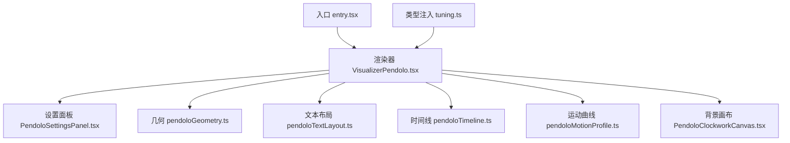
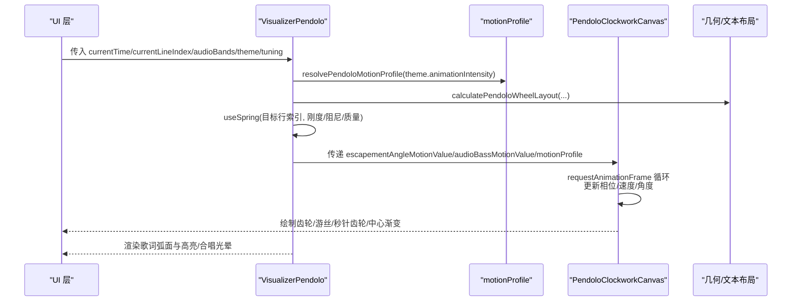
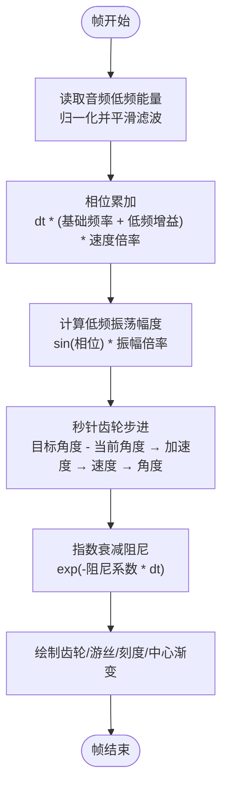
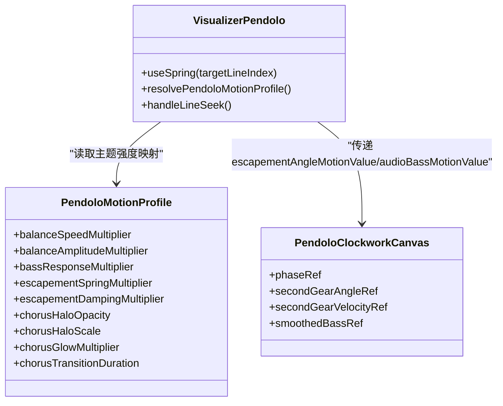
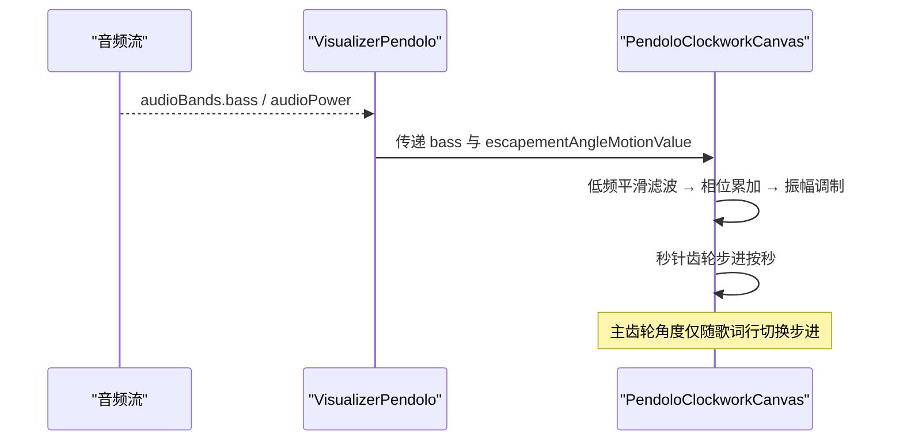
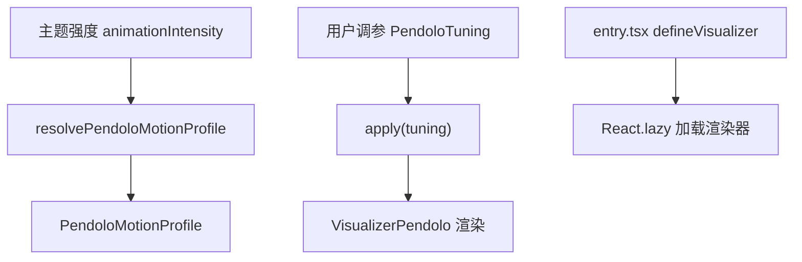
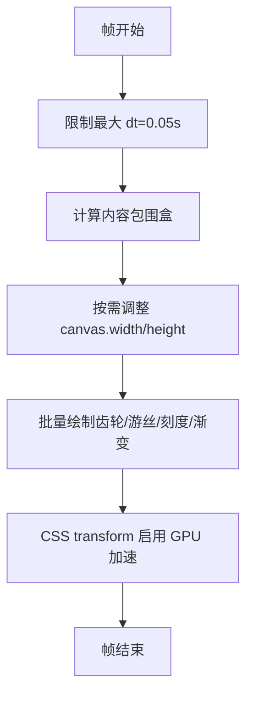
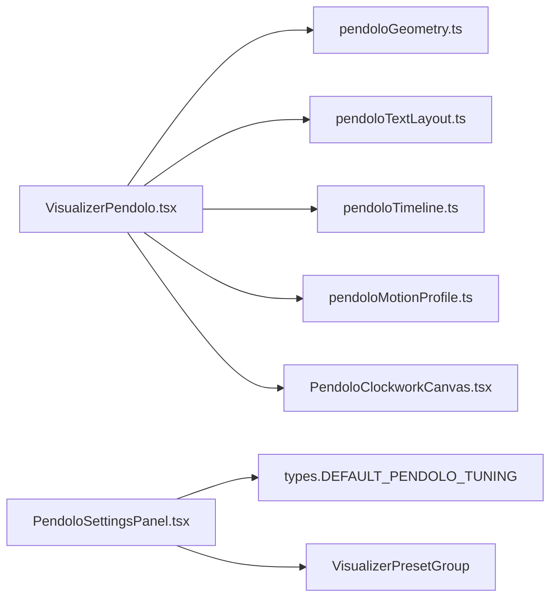
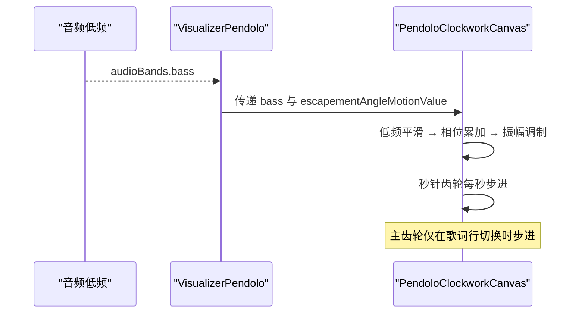

# 运动配置文件

<cite>
**本文引用的文件**   
- [pendoloMotionProfile.ts](file://src/components/visualizer/pendolo/pendoloMotionProfile.ts)
- [VisualizerPendolo.tsx](file://src/components/visualizer/pendolo/VisualizerPendolo.tsx)
- [PendoloClockworkCanvas.tsx](file://src/components/visualizer/pendolo/PendoloClockworkCanvas.tsx)
- [PendoloSettingsPanel.tsx](file://src/components/visualizer/pendolo/PendoloSettingsPanel.tsx)
- [entry.tsx](file://src/components/visualizer/pendolo/entry.tsx)
- [tuning.ts](file://src/components/visualizer/pendolo/tuning.ts)
- [pendoloGeometry.ts](file://src/components/visualizer/pendolo/pendoloGeometry.ts)
- [pendoloTextLayout.ts](file://src/components/visualizer/pendolo/pendoloTextLayout.ts)
- [pendoloTimeline.ts](file://src/components/visualizer/pendolo/pendoloTimeline.ts)
- [pendoloMotionProfile.test.ts](file://test/unit/visualizer/pendoloMotionProfile.test.ts)
</cite>

## 目录
1. [引言](#引言)
2. [项目结构](#项目结构)
3. [核心组件](#核心组件)
4. [架构总览](#架构总览)
5. [详细组件分析](#详细组件分析)
6. [依赖关系分析](#依赖关系分析)
7. [性能与优化](#性能与优化)
8. [节拍检测与同步控制](#节拍检测与同步控制)
9. [预设配置与主题适配](#预设配置与主题适配)
10. [扩展机制与自定义开发指南](#扩展机制与自定义开发指南)
11. [故障排查与调试](#故障排查与调试)
12. [结论](#结论)

## 引言
本文件面向 Pendolo 模式的“运动配置文件系统”，系统性说明其运动曲线数学模型、动画参数动态调整、节拍检测与同步、预设配置管理、性能优化策略，以及设计模式与扩展机制。Pendolo 是一个以“擒纵机构 + 摆轮游丝”为视觉隐喻的歌词可视化模式：歌词沿弧形轨道排列，行切换时触发弹簧式擒纵步进；背景 Canvas 绘制齿轮、行星轮、秒针齿轮和游丝等机械装饰，并通过低频音频能量驱动摆轮相位与振幅，形成音乐驱动的连续动画。

## 项目结构
Pendolo 相关代码集中在 `src/components/visualizer/pendolo` 下，采用“入口注册 + 渲染器 + 设置面板 + 几何/文本布局 + 运动曲线 + 时间线工具”的分层组织方式：

**图表来源**
- [entry.tsx:10-25](file://src/components/visualizer/pendolo/entry.tsx#L10-L25)
- [VisualizerPendolo.tsx:1-18](file://src/components/visualizer/pendolo/VisualizerPendolo.tsx#L1-L18)
- [tuning.ts:5-10](file://src/components/visualizer/pendolo/tuning.ts#L5-L10)

**章节来源**
- [entry.tsx:1-26](file://src/components/visualizer/pendolo/entry.tsx#L1-L26)
- [VisualizerPendolo.tsx:1-45](file://src/components/visualizer/pendolo/VisualizerPendolo.tsx#L1-L45)
- [tuning.ts:1-11](file://src/components/visualizer/pendolo/tuning.ts#L1-L11)

## 核心组件
- 渲染器 VisualizerPendolo：负责歌词弧面布局、行切换弹簧步进、交互滚动、副标题与高亮、合唱段落光晕表现、与背景机械画布集成。
- 背景画布 PendoloClockworkCanvas：使用 Canvas 2D 绘制齿轮组、游丝、中心渐变、封面遮罩、秒针齿轮等，并基于音频低频能量驱动摆轮相位与振幅。
- 运动曲线 pendoloMotionProfile：定义不同主题强度（平静/正常/混沌）下的运动参数映射，包括速度、振幅、低频响应、擒纵弹簧/阻尼、合唱光晕等。
- 设置面板 PendoloSettingsPanel：提供 Pendolo 专属调参控件（轮心偏移、弧度半径、角度范围、刻度弹性、激活缩放、装饰等级、中心渐变、封面显示、线条发光）。
- 几何与文本布局：计算歌词在圆弧上的位置、旋转、缩放与排版高度。
- 时间线工具：在无歌词或纯音乐段提供回退锚点索引。

**章节来源**
- [VisualizerPendolo.tsx:40-66](file://src/components/visualizer/pendolo/VisualizerPendolo.tsx#L40-L66)
- [PendoloClockworkCanvas.tsx:217-237](file://src/components/visualizer/pendolo/PendoloClockworkCanvas.tsx#L217-L237)
- [pendoloMotionProfile.ts:5-15](file://src/components/visualizer/pendolo/pendoloMotionProfile.ts#L5-L15)
- [PendoloSettingsPanel.tsx:8-17](file://src/components/visualizer/pendolo/PendoloSettingsPanel.tsx#L8-L17)

## 架构总览
Pendolo 的运动配置文件系统由三层组成：
- 数据层：运动曲线 Profile、用户调参 Tuning、主题强度 AnimationIntensity。
- 逻辑层：渲染器根据当前行索引、音频频段、时间线计算目标状态，并通过弹簧物理模拟生成平滑过渡。
- 表现层：React 元素与 Canvas 2D 共同输出最终画面，支持 GPU 加速（CSS transform）、批量渲染（Canvas 单次帧绘制）与节流（requestAnimationFrame）。

**图表来源**
- [VisualizerPendolo.tsx:318-363](file://src/components/visualizer/pendolo/VisualizerPendolo.tsx#L318-L363)
- [pendoloMotionProfile.ts:62-67](file://src/components/visualizer/pendolo/pendoloMotionProfile.ts#L62-L67)
- [PendoloClockworkCanvas.tsx:328-365](file://src/components/visualizer/pendolo/PendoloClockworkCanvas.tsx#L328-L365)

## 详细组件分析

### 运动曲线与数学模型
Pendolo 的运动模型包含三类关键曲线：
- 正弦波：用于摆轮相位累积与低频调制振幅，产生自然的往复摆动。
- 弹簧物理：使用 framer-motion 的 useSpring 对行切换进行离散到连续的平滑过渡，参数受“刻度弹性”与 Profile 的擒纵弹簧/阻尼系数影响。
- 物理模拟：背景画布中的秒针齿轮采用二阶微分方程近似（位移→加速度→速度→角度），配合指数衰减阻尼，模拟真实擒纵机构的步进感。

**图表来源**
- [PendoloClockworkCanvas.tsx:338-365](file://src/components/visualizer/pendolo/PendoloClockworkCanvas.tsx#L338-L365)
- [PendoloClockworkCanvas.tsx:723-751](file://src/components/visualizer/pendolo/PendoloClockworkCanvas.tsx#L723-L751)

**章节来源**
- [pendoloMotionProfile.ts:5-15](file://src/components/visualizer/pendolo/pendoloMotionProfile.ts#L5-L15)
- [VisualizerPendolo.tsx:318-363](file://src/components/visualizer/pendolo/VisualizerPendolo.tsx#L318-L363)
- [PendoloClockworkCanvas.tsx:338-365](file://src/components/visualizer/pendolo/PendoloClockworkCanvas.tsx#L338-L365)

### 动画参数的动态调整
- 强度映射：通过 `resolvePendoloMotionProfile(theme.animationIntensity)` 将主题强度映射为稳定参数集，涵盖速度、振幅、低频响应、擒纵弹簧/阻尼、合唱光晕透明度/缩放/辉光/过渡时长。
- 响应性调节：用户可通过 `tickSnappiness` 调节弹簧刚度与阻尼，从而改变行切换时的“弹跳感”。
- 自适应算法：低频能量经平滑滤波后参与相位与振幅调制；当播放暂停时，相位与秒针齿轮步进停止，避免无意义计算。

**图表来源**
- [pendoloMotionProfile.ts:5-15](file://src/components/visualizer/pendolo/pendoloMotionProfile.ts#L5-L15)
- [VisualizerPendolo.tsx:318-363](file://src/components/visualizer/pendolo/VisualizerPendolo.tsx#L318-L363)
- [PendoloClockworkCanvas.tsx:238-246](file://src/components/visualizer/pendolo/PendoloClockworkCanvas.tsx#L238-L246)

**章节来源**
- [pendoloMotionProfile.ts:17-51](file://src/components/visualizer/pendolo/pendoloMotionProfile.ts#L17-L51)
- [VisualizerPendolo.tsx:318-363](file://src/components/visualizer/pendolo/VisualizerPendolo.tsx#L318-L363)
- [PendoloClockworkCanvas.tsx:338-365](file://src/components/visualizer/pendolo/PendoloClockworkCanvas.tsx#L338-L365)

### 节拍检测机制
- 音频分析：通过 `audioBands.bass` 获取低频能量，并在画布中做归一化与平滑滤波，作为摆轮相位与振幅的驱动源。
- 节奏识别：未实现显式的 BPM 检测；节奏感知主要通过低频能量与歌词行切换的离散步进耦合。
- 同步控制：主齿轮角度严格绑定歌词行的 ratchet 步进；歌词行演唱期间齿轮静止，仅在行切换时步进，确保视觉与歌词同步。

**图表来源**
- [VisualizerPendolo.tsx:431-450](file://src/components/visualizer/pendolo/VisualizerPendolo.tsx#L431-L450)
- [PendoloClockworkCanvas.tsx:338-365](file://src/components/visualizer/pendolo/PendoloClockworkCanvas.tsx#L338-L365)
- [PendoloClockworkCanvas.tsx:367-370](file://src/components/visualizer/pendolo/PendoloClockworkCanvas.tsx#L367-L370)

**章节来源**
- [VisualizerPendolo.tsx:431-450](file://src/components/visualizer/pendolo/VisualizerPendolo.tsx#L431-L450)
- [PendoloClockworkCanvas.tsx:338-370](file://src/components/visualizer/pendolo/PendoloClockworkCanvas.tsx#L338-L370)

### 预设配置管理
- 主题适配：`resolvePendoloMotionProfile` 根据 `theme.animationIntensity` 返回 calm/normal/chaotic 三档参数，测试用例验证了从平静到混沌的参数单调递增趋势。
- 用户偏好：`PendoloSettingsPanel` 暴露 wheelCenterX/Y、arcRadius、arcAngleDeg、tickSnappiness、activeScale、showGearDecor、showCenterGradient、showCoverOnWatchFace、enableLineGlow 等可调项。
- 动态加载：`entry.tsx` 使用 React.lazy 延迟加载渲染器，减少初始包体积；`tuning.ts` 通过 `defineVisualizerTuning` 注入强类型调参接口。

**图表来源**
- [pendoloMotionProfile.ts:62-67](file://src/components/visualizer/pendolo/pendoloMotionProfile.ts#L62-L67)
- [PendoloSettingsPanel.tsx:18-170](file://src/components/visualizer/pendolo/PendoloSettingsPanel.tsx#L18-L170)
- [entry.tsx:10-25](file://src/components/visualizer/pendolo/entry.tsx#L10-L25)
- [tuning.ts:5-10](file://src/components/visualizer/pendolo/tuning.ts#L5-L10)

**章节来源**
- [pendoloMotionProfile.ts:17-51](file://src/components/visualizer/pendolo/pendoloMotionProfile.ts#L17-L51)
- [PendoloSettingsPanel.tsx:18-170](file://src/components/visualizer/pendolo/PendoloSettingsPanel.tsx#L18-L170)
- [entry.tsx:10-25](file://src/components/visualizer/pendolo/entry.tsx#L10-L25)
- [tuning.ts:5-10](file://src/components/visualizer/pendolo/tuning.ts#L5-L10)

### 性能优化策略
- 动画节流：Canvas 渲染使用 `requestAnimationFrame` 循环，帧间隔 dt 上限限制为 0.05s，避免跳帧导致数值爆炸。
- 批量渲染：所有齿轮、刻度、游丝、中心渐变、封面遮罩在一次 render 中绘制，减少上下文切换。
- GPU 加速：歌词弧面容器使用 CSS transform（rotate/scale/translateZ）启用合成层加速；Canvas 使用 devicePixelRatio 适配高分屏。
- 内容区域裁剪：通过 `resolveClockworkBox` 计算最小包围盒，避免全屏透明像素分配。
- 条件渲染：当装饰等级为 none 且无中心渐变与封面时，直接返回 null，跳过渲染。

**图表来源**
- [PendoloClockworkCanvas.tsx:328-389](file://src/components/visualizer/pendolo/PendoloClockworkCanvas.tsx#L328-L389)
- [PendoloClockworkCanvas.tsx:184-212](file://src/components/visualizer/pendolo/PendoloClockworkCanvas.tsx#L184-L212)
- [VisualizerPendolo.tsx:470-480](file://src/components/visualizer/pendolo/VisualizerPendolo.tsx#L470-L480)

**章节来源**
- [PendoloClockworkCanvas.tsx:328-389](file://src/components/visualizer/pendolo/PendoloClockworkCanvas.tsx#L328-L389)
- [PendoloClockworkCanvas.tsx:184-212](file://src/components/visualizer/pendolo/PendoloClockworkCanvas.tsx#L184-L212)
- [VisualizerPendolo.tsx:470-480](file://src/components/visualizer/pendolo/VisualizerPendolo.tsx#L470-L480)

## 依赖关系分析
- VisualizerPendolo 依赖：
  - geometry：计算歌词弧面布局。
  - textLayout：测量文本块高度，支持主歌词与翻译行。
  - timeline：在无歌词或纯音乐段提供回退锚点。
  - motionProfile：主题强度到运动参数的映射。
  - clockwork：背景机械画布。
- 设置面板依赖：
  - types：DEFAULT_PENDOLO_TUNING 与 PendoloTuning 类型。
  - VisualizerPresetGroup：复用通用预设分组 UI。

**图表来源**
- [VisualizerPendolo.tsx:10-17](file://src/components/visualizer/pendolo/VisualizerPendolo.tsx#L10-L17)
- [PendoloSettingsPanel.tsx:1-5](file://src/components/visualizer/pendolo/PendoloSettingsPanel.tsx#L1-L5)

**章节来源**
- [VisualizerPendolo.tsx:10-17](file://src/components/visualizer/pendolo/VisualizerPendolo.tsx#L10-L17)
- [PendoloSettingsPanel.tsx:1-5](file://src/components/visualizer/pendolo/PendoloSettingsPanel.tsx#L1-L5)

## 性能与优化
- 帧率与稳定性：
  - 使用 `requestAnimationFrame` 保证与屏幕刷新同步。
  - dt 上限限制防止长时间后台标签页恢复后的数值突变。
- 内存与绘制：
  - 内容包围盒裁剪减少透明像素分配。
  - 按需调整 canvas 尺寸，避免重复分配。
- 交互与滚动：
  - 滚轮与触摸事件使用 passive:false 阻止默认行为，避免页面滚动干扰。
  - 手动滚动锚点与自动回退逻辑结合，提升用户体验。
- 主题与强度：
  - 主题强度映射集中管理，便于测试与回归。

**章节来源**
- [PendoloClockworkCanvas.tsx:328-389](file://src/components/visualizer/pendolo/PendoloClockworkCanvas.tsx#L328-L389)
- [VisualizerPendolo.tsx:239-316](file://src/components/visualizer/pendolo/VisualizerPendolo.tsx#L239-L316)
- [pendoloMotionProfile.test.ts:9-23](file://test/unit/visualizer/pendoloMotionProfile.test.ts#L9-L23)

## 节拍检测与同步控制
- 低频驱动：音频低频能量经平滑滤波后驱动摆轮相位与振幅，使视觉摆动与音乐能量一致。
- 行切换步进：主齿轮角度严格绑定歌词行切换，确保歌词与机械视觉同步。
- 秒针齿轮：每秒步进一次，增强节奏感；步进过程使用弹簧物理与阻尼，呈现自然机械感。
- 纯音乐段：当无歌词时，进入 instrumental 模式，按固定时间步长推进展示，避免界面停滞。

**图表来源**
- [VisualizerPendolo.tsx:124-174](file://src/components/visualizer/pendolo/VisualizerPendolo.tsx#L124-L174)
- [PendoloClockworkCanvas.tsx:338-365](file://src/components/visualizer/pendolo/PendoloClockworkCanvas.tsx#L338-L365)
- [PendoloClockworkCanvas.tsx:723-751](file://src/components/visualizer/pendolo/PendoloClockworkCanvas.tsx#L723-L751)

**章节来源**
- [VisualizerPendolo.tsx:124-174](file://src/components/visualizer/pendolo/VisualizerPendolo.tsx#L124-L174)
- [PendoloClockworkCanvas.tsx:338-365](file://src/components/visualizer/pendolo/PendoloClockworkCanvas.tsx#L338-L365)
- [PendoloClockworkCanvas.tsx:723-751](file://src/components/visualizer/pendolo/PendoloClockworkCanvas.tsx#L723-L751)

## 预设配置与主题适配
- 主题强度映射：
  - calm：较低的速度、振幅、低频响应与辉光，较长的过渡时间。
  - normal：基准参数。
  - chaotic：更高的速度、振幅、低频响应与辉光，更短的过渡时间。
- 用户调参：
  - wheelCenterX/Y：轮心相对视口百分比偏移。
  - arcRadius：弧线半径占视口短边的比例。
  - arcAngleDeg：可见窗口角度范围。
  - tickSnappiness：弹簧刚度与阻尼的调节因子。
  - activeScale：激活行缩放倍数。
  - showGearDecor：装饰等级 none/subtle/full。
  - showCenterGradient：中心径向渐变开关。
  - showCoverOnWatchFace：表盘内封面显示开关。
  - enableLineGlow：线条发光开关。

**章节来源**
- [pendoloMotionProfile.ts:17-51](file://src/components/visualizer/pendolo/pendoloMotionProfile.ts#L17-L51)
- [PendoloSettingsPanel.tsx:18-170](file://src/components/visualizer/pendolo/PendoloSettingsPanel.tsx#L18-L170)

## 扩展机制与自定义开发指南
- 新增运动曲线：
  - 在 `pendoloMotionProfile.ts` 中扩展 `PENDOLO_MOTION_PROFILES`，增加新的强度档位或自定义参数。
  - 在 `resolvePendoloMotionProfile` 中处理新强度值。
- 新增调参项：
  - 在 `PendoloSettingsPanel.tsx` 中添加滑块或开关，并调用 `onPendoloTuningChange` 更新。
  - 在 `tuning.ts` 中确保类型注入正确。
- 自定义视觉效果：
  - 在 `PendoloClockworkCanvas.tsx` 中扩展绘制函数（如新增齿轮形状、纹理、滤镜）。
  - 在 `VisualizerPendolo.tsx` 中接入新的视觉层（如新增图标、光晕、粒子）。
- 调试建议：
  - 使用浏览器开发者工具的 Performance 面板录制帧，观察 requestAnimationFrame 调用与绘制耗时。
  - 在 Canvas 绘制前打印 contentBox 与 dpr，确认包围盒与像素密度。
  - 在弹簧物理处打印 stiffness/damping/mass，确认参数变化符合预期。

**章节来源**
- [pendoloMotionProfile.ts:62-67](file://src/components/visualizer/pendolo/pendoloMotionProfile.ts#L62-L67)
- [PendoloSettingsPanel.tsx:18-170](file://src/components/visualizer/pendolo/PendoloSettingsPanel.tsx#L18-L170)
- [tuning.ts:5-10](file://src/components/visualizer/pendolo/tuning.ts#L5-L10)
- [PendoloClockworkCanvas.tsx:328-389](file://src/components/visualizer/pendolo/PendoloClockworkCanvas.tsx#L328-L389)

## 故障排查与调试
- 常见问题：
  - 动画卡顿：检查是否启用了过多 CSS filter（如 drop-shadow），可关闭 `enableLineGlow`。
  - 歌词重叠：调整 `activeScale` 与 `availableTextWidth`，确保文本块高度计算正确。
  - 低频无响应：确认 `audioBands.bass` 数据有效，且在画布中做了归一化与平滑滤波。
  - 纯音乐段不推进：检查 instrumental 模式的时间推进逻辑与 currentTime 更新。
- 调试步骤：
  - 在 `VisualizerPendolo.tsx` 中打印 targetLineIndex、instrumentalIndex、isInstrumental。
  - 在 `PendoloClockworkCanvas.tsx` 中打印 smoothedBass、phaseRef、secondGearAngleRef。
  - 在 `pendoloMotionProfile.ts` 中打印 profile 参数，确认主题强度映射正确。

**章节来源**
- [VisualizerPendolo.tsx:124-174](file://src/components/visualizer/pendolo/VisualizerPendolo.tsx#L124-L174)
- [PendoloClockworkCanvas.tsx:338-365](file://src/components/visualizer/pendolo/PendoloClockworkCanvas.tsx#L338-L365)
- [pendoloMotionProfile.ts:62-67](file://src/components/visualizer/pendolo/pendoloMotionProfile.ts#L62-L67)

## 结论
Pendolo 的运动配置文件系统以“主题强度 → 运动参数 → 物理模拟 → 视觉表现”为主线，实现了音乐驱动的连续动画与歌词行切换的离散步进之间的平衡。通过 Canvas 批量渲染与 CSS GPU 加速，系统在复杂机械装饰与高频交互下仍保持流畅。未来可扩展更多运动曲线、调参项与视觉效果，同时保持参数映射的可测试性与可维护性。