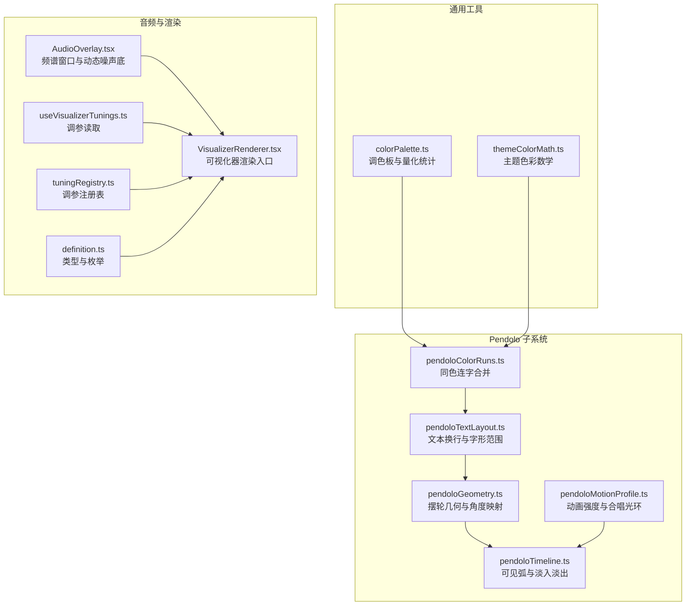
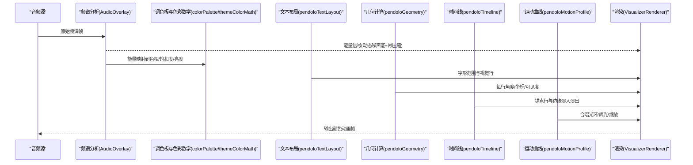
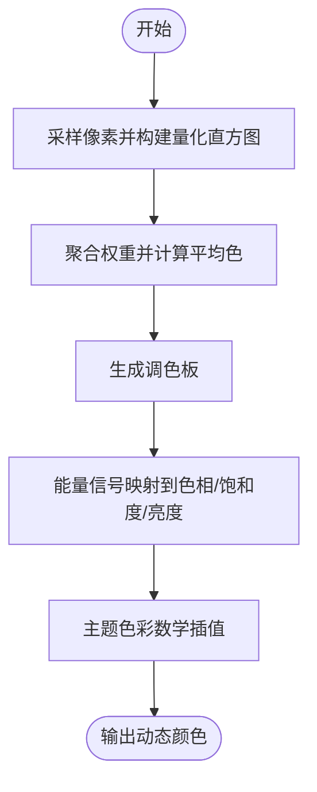
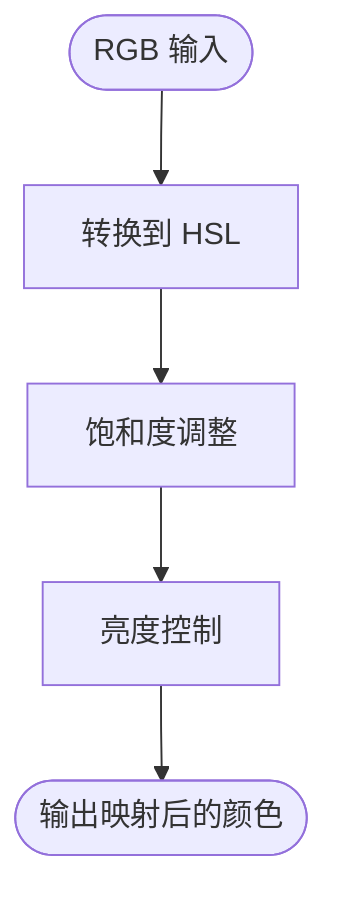
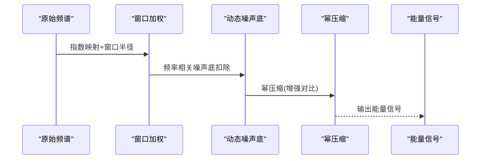
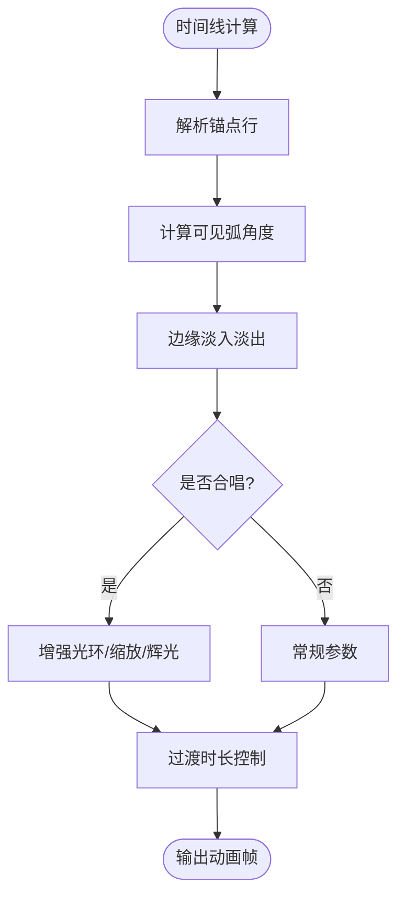
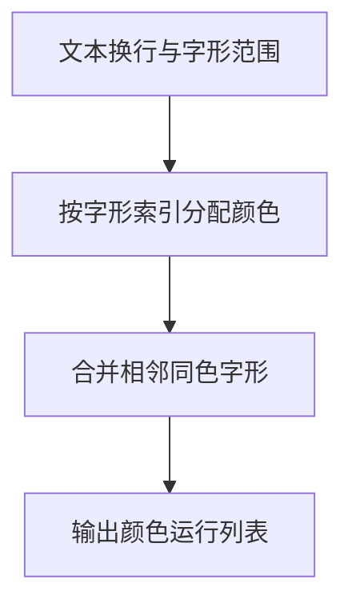
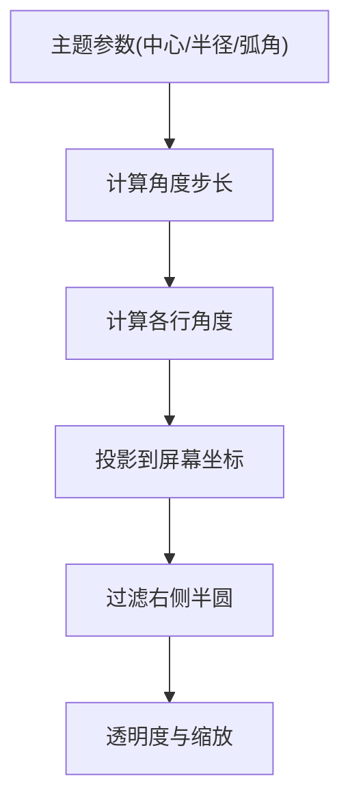
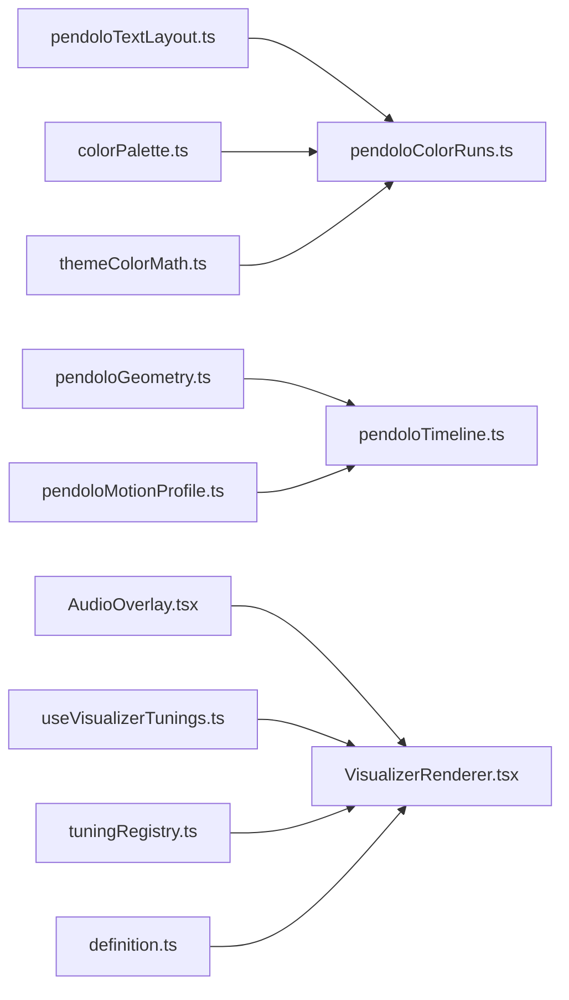

# 颜色动画系统

<cite>
**本文引用的文件**   
- [pendoloColorRuns.ts](file://src/components/visualizer/pendolo/pendoloColorRuns.ts)
- [pendoloMotionProfile.ts](file://src/components/visualizer/pendolo/pendoloMotionProfile.ts)
- [pendoloGeometry.ts](file://src/components/visualizer/pendolo/pendoloGeometry.ts)
- [pendoloTextLayout.ts](file://src/components/visualizer/pendolo/pendoloTextLayout.ts)
- [pendoloTimeline.ts](file://src/components/visualizer/pendolo/pendoloTimeline.ts)
- [colorPalette.ts](file://src/utils/colorPalette.ts)
- [themeColorMath.ts](file://src/utils/themeColorMath.ts)
- [AudioOverlay.tsx](file://src/components/visualizer/monet/AudioOverlay.tsx)
- [monetBackgroundPipeline.ts](file://src/components/visualizer/monet/monetBackgroundPipeline.ts)
- [VisualizerRenderer.tsx](file://src/components/visualizer/VisualizerRenderer.tsx)
- [useVisualizerTunings.ts](file://src/components/visualizer/useVisualizerTunings.ts)
- [tuningRegistry.ts](file://src/components/visualizer/tuningRegistry.ts)
- [definition.ts](file://src/components/visualizer/definition.ts)
</cite>

## 目录
1. [引言](#引言)
2. [项目结构](#项目结构)
3. [核心组件](#核心组件)
4. [架构总览](#架构总览)
5. [详细组件分析](#详细组件分析)
6. [依赖关系分析](#依赖关系分析)
7. [性能与缓存](#性能与缓存)
8. [调参与主题扩展指南](#调参与主题扩展指南)
9. [故障排查](#故障排查)
10. [结论](#结论)

## 引言
本技术文档聚焦 Pendolo 模式的颜色动画系统，系统性阐述以下能力：
- 渐变色带生成算法：颜色插值、渐变分布与动态调色。
- 色调映射机制：HSL 色彩空间转换、饱和度调整与亮度控制。
- 颜色同步系统：音乐节奏匹配、频谱分析与动态响应。
- 动画过渡效果：缓动函数、时间控制与状态切换。
- 颜色缓存机制：预计算优化、内存管理与性能提升。
- 配置参数调优：色板定义、动画强度与视觉效果。
- 扩展接口与自定义主题开发指南。

## 项目结构
Pendolo 颜色动画系统位于可视化器模块的 pendolo 子系统中，围绕歌词文本布局、几何排布、运动曲线与颜色运行（color runs）组织代码；同时与通用工具 colorPalette、themeColorMath 以及音频处理 AudioOverlay 协作，形成从音频到颜色的完整链路。

图表来源
- [pendoloTextLayout.ts:19-48](file://src/components/visualizer/pendolo/pendoloTextLayout.ts#L19-L48)
- [pendoloGeometry.ts:22-114](file://src/components/visualizer/pendolo/pendoloGeometry.ts#L22-L114)
- [pendoloTimeline.ts:5-43](file://src/components/visualizer/pendolo/pendoloTimeline.ts#L5-L43)
- [pendoloMotionProfile.ts:17-84](file://src/components/visualizer/pendolo/pendoloMotionProfile.ts#L17-L84)
- [pendoloColorRuns.ts:11-29](file://src/components/visualizer/pendolo/pendoloColorRuns.ts#L11-L29)
- [colorPalette.ts:83-109](file://src/utils/colorPalette.ts#L83-L109)
- [AudioOverlay.tsx:61-87](file://src/components/visualizer/monet/AudioOverlay.tsx#L61-L87)
- [VisualizerRenderer.tsx](file://src/components/visualizer/VisualizerRenderer.tsx)
- [useVisualizerTunings.ts](file://src/components/visualizer/useVisualizerTunings.ts)
- [tuningRegistry.ts](file://src/components/visualizer/tuningRegistry.ts)
- [definition.ts](file://src/components/visualizer/definition.ts)

章节来源
- [pendoloTextLayout.ts:19-48](file://src/components/visualizer/pendolo/pendoloTextLayout.ts#L19-L48)
- [pendoloGeometry.ts:22-114](file://src/components/visualizer/pendolo/pendoloGeometry.ts#L22-L114)
- [pendoloTimeline.ts:5-43](file://src/components/visualizer/pendolo/pendoloTimeline.ts#L5-L43)
- [pendoloMotionProfile.ts:17-84](file://src/components/visualizer/pendolo/pendoloMotionProfile.ts#L17-L84)
- [pendoloColorRuns.ts:11-29](file://src/components/visualizer/pendolo/pendoloColorRuns.ts#L11-L29)
- [colorPalette.ts:83-109](file://src/utils/colorPalette.ts#L83-L109)
- [AudioOverlay.tsx:61-87](file://src/components/visualizer/monet/AudioOverlay.tsx#L61-L87)

## 核心组件
- 文本布局与字形范围：将歌词文本按字体规格进行换行，并记录每个视觉行的字形起止索引，为后续颜色分配提供稳定坐标。
- 几何与角度映射：根据目标行索引、摆轮半径与可视弧角，计算每行在圆弧上的角度与屏幕坐标，仅保留右侧半圆可见区域。
- 时间线与可见性：基于当前播放时间与歌词行时间，确定锚点行；对超出可视弧的行执行边缘淡出。
- 运动曲线与合唱光环：依据主题动画强度选择运动参数，并在合唱段落增强光晕、缩放与辉光。
- 颜色运行（Color Runs）：将相邻且颜色相同的字形合并为一段，减少绘制批次，提高渲染效率。
- 调色板与色彩数学：从图像像素中统计主色，结合主题色彩数学工具进行插值与映射。
- 音频频谱与动态响应：对原始频谱进行窗口加权、动态噪声底扣除与幂压缩，得到驱动颜色变化的能量信号。

章节来源
- [pendoloTextLayout.ts:19-48](file://src/components/visualizer/pendolo/pendoloTextLayout.ts#L19-L48)
- [pendoloGeometry.ts:22-114](file://src/components/visualizer/pendolo/pendoloGeometry.ts#L22-L114)
- [pendoloTimeline.ts:5-43](file://src/components/visualizer/pendolo/pendoloTimeline.ts#L5-L43)
- [pendoloMotionProfile.ts:17-84](file://src/components/visualizer/pendolo/pendoloMotionProfile.ts#L17-L84)
- [pendoloColorRuns.ts:11-29](file://src/components/visualizer/pendolo/pendoloColorRuns.ts#L11-L29)
- [colorPalette.ts:83-109](file://src/utils/colorPalette.ts#L83-L109)
- [AudioOverlay.tsx:61-87](file://src/components/visualizer/monet/AudioOverlay.tsx#L61-L87)

## 架构总览
Pendolo 颜色动画系统的整体数据流如下：
- 音频输入经频谱分析得到能量信号。
- 能量信号驱动颜色变化，通过主题色彩数学与调色板生成最终颜色。
- 歌词文本被布局为多行，并按字形范围分配颜色。
- 几何计算决定每行在圆弧上的位置与可见度。
- 时间线控制淡入淡出与锚点切换。
- 运动曲线与合唱光环影响辉光与缩放等视觉表现。
- 颜色运行合并相邻同色字形，降低绘制开销。

图表来源
- [AudioOverlay.tsx:61-87](file://src/components/visualizer/monet/AudioOverlay.tsx#L61-L87)
- [colorPalette.ts:83-109](file://src/utils/colorPalette.ts#L83-L109)
- [pendoloTextLayout.ts:19-48](file://src/components/visualizer/pendolo/pendoloTextLayout.ts#L19-L48)
- [pendoloGeometry.ts:22-114](file://src/components/visualizer/pendolo/pendoloGeometry.ts#L22-L114)
- [pendoloTimeline.ts:5-43](file://src/components/visualizer/pendolo/pendoloTimeline.ts#L5-L43)
- [pendoloMotionProfile.ts:17-84](file://src/components/visualizer/pendolo/pendoloMotionProfile.ts#L17-L84)
- [VisualizerRenderer.tsx](file://src/components/visualizer/VisualizerRenderer.tsx)

## 详细组件分析

### 渐变色带生成与颜色插值
- 颜色来源：从图像像素中提取主色，使用量化直方图聚合相近颜色，得到稳定的调色板。
- 插值策略：基于主题色彩数学工具进行颜色插值，支持线性或感知更自然的插值路径。
- 动态调色：根据音频能量信号调整色相偏移、饱和度与明度，使颜色随音乐起伏。

图表来源
- [colorPalette.ts:83-109](file://src/utils/colorPalette.ts#L83-L109)
- [themeColorMath.ts](file://src/utils/themeColorMath.ts)
- [AudioOverlay.tsx:61-87](file://src/components/visualizer/monet/AudioOverlay.tsx#L61-L87)

章节来源
- [colorPalette.ts:83-109](file://src/utils/colorPalette.ts#L83-L109)
- [themeColorMath.ts](file://src/utils/themeColorMath.ts)
- [AudioOverlay.tsx:61-87](file://src/components/visualizer/monet/AudioOverlay.tsx#L61-L87)

### 色调映射机制（HSL、饱和度与亮度）
- HSL 转换：将 RGB 转换为 HSL，便于在色相环上均匀移动色相。
- 饱和度控制：根据能量信号与用户设置调整饱和度，避免过饱和或欠饱和。
- 亮度控制：保持可读性与对比度，避免歌词在背景中不可见。

图表来源
- [monetBackgroundPipeline.ts:157-186](file://src/components/visualizer/monet/monetBackgroundPipeline.ts#L157-L186)
- [themeColorMath.ts](file://src/utils/themeColorMath.ts)

章节来源
- [monetBackgroundPipeline.ts:157-186](file://src/components/visualizer/monet/monetBackgroundPipeline.ts#L157-L186)
- [themeColorMath.ts](file://src/utils/themeColorMath.ts)

### 颜色同步系统（音乐节奏、频谱分析与动态响应）
- 频谱窗口：对原始频谱进行指数映射与窗口加权，提取中心频率附近的能量。
- 动态噪声底：根据频率自适应扣除噪声底，突出真实峰值。
- 幂压缩：对归一化能量进行幂压缩，增强视觉峰值对比度。

图表来源
- [AudioOverlay.tsx:61-87](file://src/components/visualizer/monet/AudioOverlay.tsx#L61-L87)

章节来源
- [AudioOverlay.tsx:61-87](file://src/components/visualizer/monet/AudioOverlay.tsx#L61-L87)

### 动画过渡效果（缓动函数、时间控制与状态切换）
- 时间线锚点：当不在活跃歌词行时，回退到最近有效行或末尾行。
- 可见弧淡入淡出：仅在右侧可视弧内显示歌词，边缘按角度进度淡入淡出。
- 合唱状态切换：根据是否合唱与播放状态切换光环、缩放与辉光，并控制过渡时长。

图表来源
- [pendoloTimeline.ts:5-43](file://src/components/visualizer/pendolo/pendoloTimeline.ts#L5-L43)
- [pendoloMotionProfile.ts:69-84](file://src/components/visualizer/pendolo/pendoloMotionProfile.ts#L69-L84)

章节来源
- [pendoloTimeline.ts:5-43](file://src/components/visualizer/pendolo/pendoloTimeline.ts#L5-L43)
- [pendoloMotionProfile.ts:69-84](file://src/components/visualizer/pendolo/pendoloMotionProfile.ts#L69-L84)

### 文本布局与颜色运行（Color Runs）
- 文本换行：使用排版库准备文本并换行，记录每行的字形起止索引。
- 颜色运行：将相邻且颜色相同的字形合并为一段，减少绘制批次。
- 字形映射：根据字形索引查找对应颜色，若无则使用默认色。

图表来源
- [pendoloTextLayout.ts:19-48](file://src/components/visualizer/pendolo/pendoloTextLayout.ts#L19-L48)
- [pendoloColorRuns.ts:11-29](file://src/components/visualizer/pendolo/pendoloColorRuns.ts#L11-L29)

章节来源
- [pendoloTextLayout.ts:19-48](file://src/components/visualizer/pendolo/pendoloTextLayout.ts#L19-L48)
- [pendoloColorRuns.ts:11-29](file://src/components/visualizer/pendolo/pendoloColorRuns.ts#L11-L29)

### 几何与角度映射（摆轮布局）
- 可视弧角：根据主题设置计算总弧角与角度步长。
- 角度计算：以目标行为中心，前后行按高度差与半径计算角度。
- 坐标投影：将极坐标投影到屏幕坐标，仅保留右侧半圆可见区域。
- 透明度与缩放：随距离与角度衰减透明度，并对焦点行放大。

图表来源
- [pendoloGeometry.ts:22-114](file://src/components/visualizer/pendolo/pendoloGeometry.ts#L22-L114)

章节来源
- [pendoloGeometry.ts:22-114](file://src/components/visualizer/pendolo/pendoloGeometry.ts#L22-L114)

## 依赖关系分析
- 模块内耦合：
  - pendoloTextLayout 与 pendoloColorRuns 紧密耦合，前者提供字形范围，后者负责颜色合并。
  - pendoloGeometry 与 pendoloTimeline 共同决定可见性与淡入淡出。
  - pendoloMotionProfile 为全局动画强度与合唱光环提供参数。
- 外部依赖：
  - colorPalette 提供调色板与量化统计。
  - themeColorMath 提供主题色彩数学工具。
  - AudioOverlay 提供频谱能量信号。
  - VisualizerRenderer 作为渲染入口协调各子系统。

图表来源
- [pendoloTextLayout.ts:19-48](file://src/components/visualizer/pendolo/pendoloTextLayout.ts#L19-L48)
- [pendoloColorRuns.ts:11-29](file://src/components/visualizer/pendolo/pendoloColorRuns.ts#L11-L29)
- [pendoloGeometry.ts:22-114](file://src/components/visualizer/pendolo/pendoloGeometry.ts#L22-L114)
- [pendoloTimeline.ts:5-43](file://src/components/visualizer/pendolo/pendoloTimeline.ts#L5-L43)
- [pendoloMotionProfile.ts:17-84](file://src/components/visualizer/pendolo/pendoloMotionProfile.ts#L17-L84)
- [colorPalette.ts:83-109](file://src/utils/colorPalette.ts#L83-L109)
- [AudioOverlay.tsx:61-87](file://src/components/visualizer/monet/AudioOverlay.tsx#L61-L87)
- [VisualizerRenderer.tsx](file://src/components/visualizer/VisualizerRenderer.tsx)
- [useVisualizerTunings.ts](file://src/components/visualizer/useVisualizerTunings.ts)
- [tuningRegistry.ts](file://src/components/visualizer/tuningRegistry.ts)
- [definition.ts](file://src/components/visualizer/definition.ts)

章节来源
- [pendoloTextLayout.ts:19-48](file://src/components/visualizer/pendolo/pendoloTextLayout.ts#L19-L48)
- [pendoloColorRuns.ts:11-29](file://src/components/visualizer/pendolo/pendoloColorRuns.ts#L11-L29)
- [pendoloGeometry.ts:22-114](file://src/components/visualizer/pendolo/pendoloGeometry.ts#L22-L114)
- [pendoloTimeline.ts:5-43](file://src/components/visualizer/pendolo/pendoloTimeline.ts#L5-L43)
- [pendoloMotionProfile.ts:17-84](file://src/components/visualizer/pendolo/pendoloMotionProfile.ts#L17-L84)
- [colorPalette.ts:83-109](file://src/utils/colorPalette.ts#L83-L109)
- [AudioOverlay.tsx:61-87](file://src/components/visualizer/monet/AudioOverlay.tsx#L61-L87)

## 性能与缓存
- 颜色运行合并：将相邻同色字形合并为一段，减少绘制批次，提升 GPU 吞吐。
- 频谱窗口加权：限制窗口半径与动态噪声底，避免过度计算。
- 幂压缩：对能量信号进行非线性变换，增强对比的同时减少极端值波动。
- 主题调参缓存：通过 useVisualizerTunings 与 tuningRegistry 缓存主题参数，避免每帧重建。
- 渲染入口优化：VisualizerRenderer 统一调度各子系统，减少重复计算。

章节来源
- [pendoloColorRuns.ts:11-29](file://src/components/visualizer/pendolo/pendoloColorRuns.ts#L11-L29)
- [AudioOverlay.tsx:61-87](file://src/components/visualizer/monet/AudioOverlay.tsx#L61-L87)
- [useVisualizerTunings.ts](file://src/components/visualizer/useVisualizerTunings.ts)
- [tuningRegistry.ts](file://src/components/visualizer/tuningRegistry.ts)
- [VisualizerRenderer.tsx](file://src/components/visualizer/VisualizerRenderer.tsx)

## 调参与主题扩展指南
- 色板定义：
  - 使用 colorPalette 从图像像素中提取主色，量化直方图聚合相近颜色，确保色板稳定。
  - 结合 themeColorMath 进行插值，支持多种插值路径以适应不同主题风格。
- 动画强度：
  - 通过 pendoloMotionProfile 选择 calm/normal/chaotic 三种强度，影响平衡速度、振幅、低音响应、 escapement 弹簧与阻尼、合唱光环不透明度与缩放、辉光倍数与过渡时长。
- 视觉效果：
  - 调整 AudioOverlay 的窗口半径、动态噪声底与幂压缩参数，控制颜色响应的灵敏度与对比度。
  - 在 monetBackgroundPipeline 中调整饱和度与灰度，保证背景与歌词的可读性。
- 自定义主题：
  - 在 definition.ts 中扩展主题类型与枚举。
  - 在 tuningRegistry.ts 中注册新的调参项。
  - 在 useVisualizerTunings.ts 中读取并缓存主题参数。
  - 在 VisualizerRenderer.tsx 中集成新参数的渲染逻辑。

章节来源
- [colorPalette.ts:83-109](file://src/utils/colorPalette.ts#L83-L109)
- [themeColorMath.ts](file://src/utils/themeColorMath.ts)
- [pendoloMotionProfile.ts:17-84](file://src/components/visualizer/pendolo/pendoloMotionProfile.ts#L17-L84)
- [AudioOverlay.tsx:61-87](file://src/components/visualizer/monet/AudioOverlay.tsx#L61-L87)
- [monetBackgroundPipeline.ts:157-186](file://src/components/visualizer/monet/monetBackgroundPipeline.ts#L157-L186)
- [definition.ts](file://src/components/visualizer/definition.ts)
- [tuningRegistry.ts](file://src/components/visualizer/tuningRegistry.ts)
- [useVisualizerTunings.ts](file://src/components/visualizer/useVisualizerTunings.ts)
- [VisualizerRenderer.tsx](file://src/components/visualizer/VisualizerRenderer.tsx)

## 故障排查
- 颜色闪烁或不稳定：
  - 检查 colorPalette 的量化直方图聚合是否正确，避免像素采样噪声导致色板抖动。
  - 确认 themeColorMath 的插值路径是否与主题一致。
- 歌词不可见或对比度不足：
  - 调整 monetBackgroundPipeline 的饱和度与灰度，确保背景不会掩盖歌词。
  - 检查 AudioOverlay 的动态噪声底与幂压缩是否过度抑制低频能量。
- 动画过于剧烈或迟缓：
  - 调整 pendoloMotionProfile 的强度参数，选择合适的 calm/normal/chaotic 预设。
  - 检查合唱光环的过渡时长与辉光倍数是否合理。
- 渲染性能下降：
  - 确认 pendoloColorRuns 是否正确合并相邻同色字形。
  - 检查 VisualizerRenderer 是否重复创建对象或触发不必要的重绘。

章节来源
- [colorPalette.ts:83-109](file://src/utils/colorPalette.ts#L83-L109)
- [themeColorMath.ts](file://src/utils/themeColorMath.ts)
- [monetBackgroundPipeline.ts:157-186](file://src/components/visualizer/monet/monetBackgroundPipeline.ts#L157-L186)
- [AudioOverlay.tsx:61-87](file://src/components/visualizer/monet/AudioOverlay.tsx#L61-L87)
- [pendoloMotionProfile.ts:17-84](file://src/components/visualizer/pendolo/pendoloMotionProfile.ts#L17-L84)
- [pendoloColorRuns.ts:11-29](file://src/components/visualizer/pendolo/pendoloColorRuns.ts#L11-L29)
- [VisualizerRenderer.tsx](file://src/components/visualizer/VisualizerRenderer.tsx)

## 结论
Pendolo 颜色动画系统通过文本布局、几何映射、时间线控制与运动曲线，结合频谱分析与调色板生成，实现了与音乐节奏同步的动态颜色效果。系统在颜色插值、色调映射、动画过渡与性能优化方面提供了完善的实现，并通过可配置的调参与主题扩展接口，支持丰富的视觉风格与自定义主题开发。