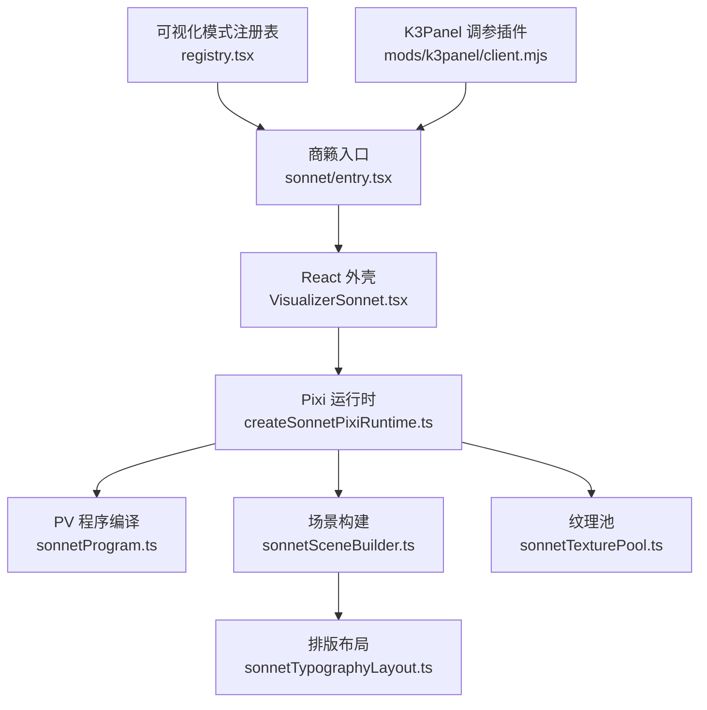
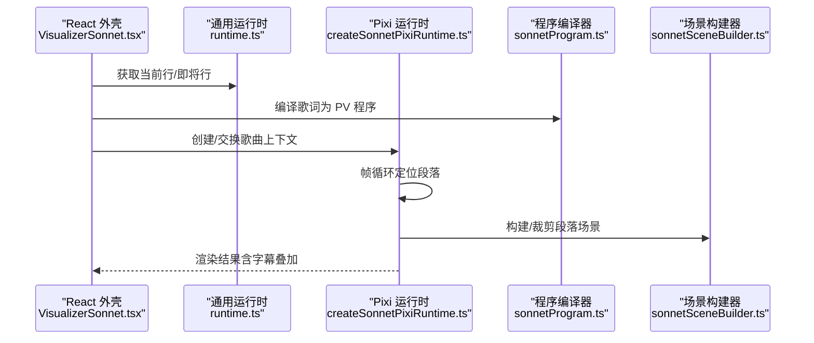
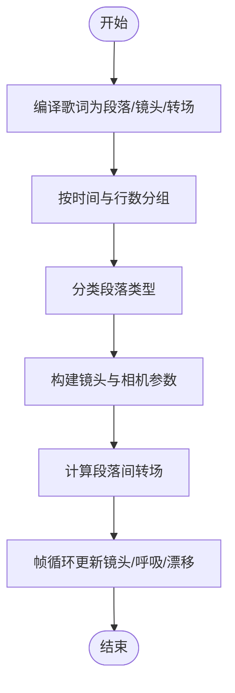
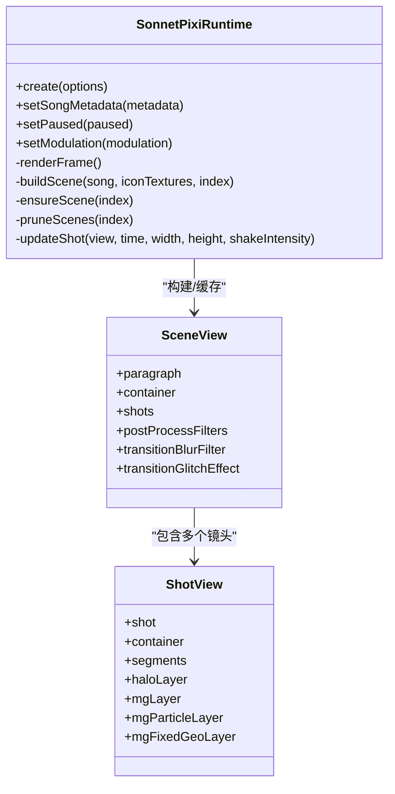
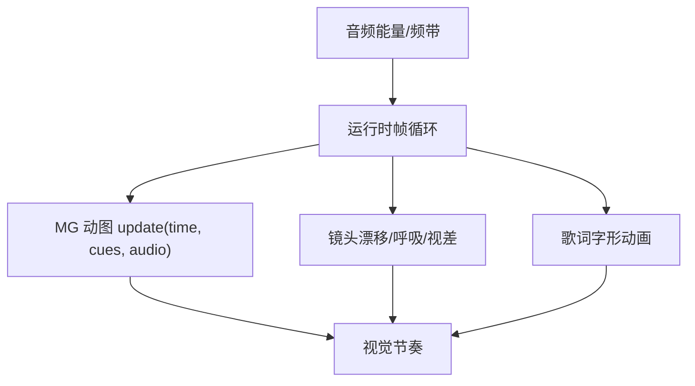
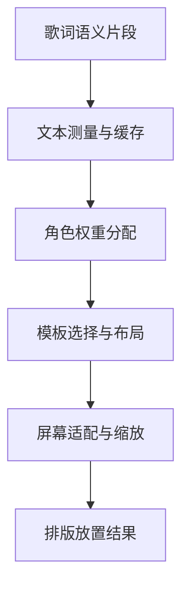
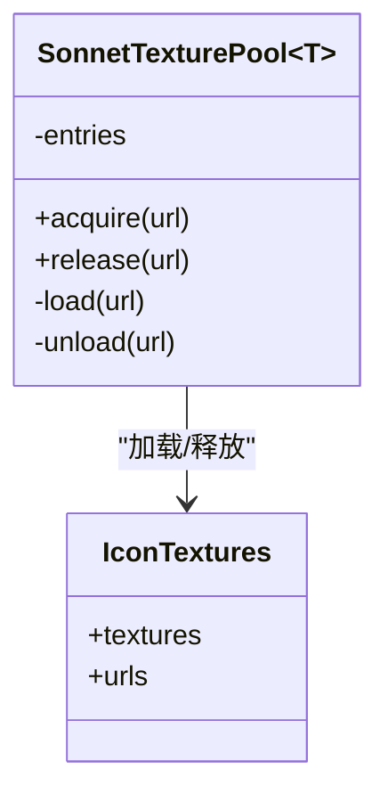
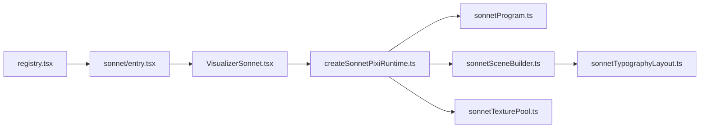

# Sonnet模式实现

<cite>
**本文引用的文件**   
- [registry.tsx](file://src/components/visualizer/registry.tsx)
- [runtime.ts](file://src/components/visualizer/runtime.ts)
- [entry.tsx](file://src/components/visualizer/sonnet/entry.tsx)
- [VisualizerSonnet.tsx](file://src/components/visualizer/sonnet/VisualizerSonnet.tsx)
- [createSonnetPixiRuntime.ts](file://src/components/visualizer/sonnet/createSonnetPixiRuntime.ts)
- [types.ts](file://src/components/visualizer/sonnet/types.ts)
- [sonnetProgram.ts](file://src/components/visualizer/sonnet/sonnetProgram.ts)
- [sonnetSceneBuilder.ts](file://src/components/visualizer/sonnet/sonnetSceneBuilder.ts)
- [sonnetTypographyLayout.ts](file://src/components/visualizer/sonnet/sonnetTypographyLayout.ts)
- [sonnetTexturePool.ts](file://src/components/visualizer/sonnet/sonnetTexturePool.ts)
- [client.mjs](file://mods/k3panel/client.mjs)
</cite>

## 目录
1. [引言](#引言)
2. [项目结构](#项目结构)
3. [核心组件](#核心组件)
4. [架构总览](#架构总览)
5. [详细组件分析](#详细组件分析)
6. [依赖关系分析](#依赖关系分析)
7. [性能考量](#性能考量)
8. [故障排查指南](#故障排查指南)
9. [结论](#结论)
10. [附录](#附录)

## 引言
本文件为“商籁（Sonnet）”可视化模式的完整技术文档。该模式以电影化叙事为核心，将歌词文本、镜头语言、转场与后期处理统一编排为可寻址、可重放的 PV 程序；运行时基于 Pixi.js 进行 2D 图形渲染，并通过纹理池、批处理与帧级调度控制视觉节奏。音乐驱动体现在音频能量与频带对镜头漂移、呼吸浮动与 MG 动图交互的调制上；歌词呈现通过语义分段、排版布局与字体渲染管线完成，并支持语义高亮与装饰元素。此外，文档提供扩展指南，说明如何通过 Folium Tuning 系统注入自定义参数，以及如何替换或新增镜头模板与后处理效果。

## 项目结构
Sonnet 模式位于可视化子系统内部，遵循“入口注册 + React 外壳 + Pixi 运行时 + 程序编译 + 场景构建 + 排版布局 + 资源管理”的分层组织：
- 入口与注册：`sonnet/entry.tsx` 声明模式元数据、可调参数与设置面板；`visualizer/registry.tsx` 负责发现与校验所有内置模式。
- React 外壳：`VisualizerSonnet.tsx` 负责宿主容器、字幕叠加、歌曲提交与运行时生命周期桥接。
- Pixi 运行时：`createSonnetPixiRuntime.ts` 管理 Pixi Application、舞台容器、段落缓存、歌曲切换过渡、帧循环与调试信息。
- 程序编译：`sonnetProgram.ts` 将歌词行编译为确定性 PV 程序（段落、镜头、转场）。
- 场景构建：`sonnetSceneBuilder.ts` 根据段落与镜头生成 Pixi 节点树、MG 图层、文字视图与后处理滤镜链。
- 排版布局：`sonnetTypographyLayout.ts` 计算字形度量、角色权重与多模板排版。
- 资源管理：`sonnetTexturePool.ts` 提供跨重建的资源引用计数与延迟卸载。
- 外部调参：`mods/k3panel/client.mjs` 通过 Folium Tuning 暴露深度调节旋钮，映射到 Sonnet 的公开调制键。

**图表来源**
- [registry.tsx:16-50](file://src/components/visualizer/registry.tsx#L16-L50)
- [entry.tsx:11-45](file://src/components/visualizer/sonnet/entry.tsx#L11-L45)
- [VisualizerSonnet.tsx:22-160](file://src/components/visualizer/sonnet/VisualizerSonnet.tsx#L22-L160)
- [createSonnetPixiRuntime.ts:148-196](file://src/components/visualizer/sonnet/createSonnetPixiRuntime.ts#L148-L196)
- [sonnetProgram.ts:193-258](file://src/components/visualizer/sonnet/sonnetProgram.ts#L193-L258)
- [sonnetSceneBuilder.ts:78-104](file://src/components/visualizer/sonnet/sonnetSceneBuilder.ts#L78-L104)
- [sonnetTypographyLayout.ts:116-159](file://src/components/visualizer/sonnet/sonnetTypographyLayout.ts#L116-L159)
- [sonnetTexturePool.ts:9-52](file://src/components/visualizer/sonnet/sonnetTexturePool.ts#L9-L52)
- [client.mjs:27-43](file://mods/k3panel/client.mjs#L27-L43)

**章节来源**
- [registry.tsx:16-50](file://src/components/visualizer/registry.tsx#L16-L50)
- [entry.tsx:11-45](file://src/components/visualizer/sonnet/entry.tsx#L11-L45)

## 核心组件
- 可视化模式注册表：集中发现 `*/entry.tsx`，去重并按顺序排序，同时校验内置模式清单一致性。
- 通用运行时辅助：提供当前行、即将行、预热窗口等轻量逻辑，供各模式复用。
- 商籁入口：声明模式 ID、标签、种子、预览偏移、Folium 可调参数与设置面板重置行为。
- 商籁 React 外壳：懒加载 Pixi 导演，维护宿主容器、字幕叠加、歌曲提交、暂停状态与调制参数。
- 商籁 Pixi 运行时：创建 Pixi Application，安装画布与 Ticker，预加载图标纹理，按段落构建与裁剪场景，驱动镜头、呼吸、视差、色差、残影与转场。
- 程序编译器：将歌词行编译为段落、镜头、转场与语义片段，保证确定性、可寻址与可重放。
- 场景构建器：组装背景 MG、几何体、粒子层、固定几何、文字视图、引导线、光晕层与后处理滤镜链。
- 排版布局器：基于 pretext 测量与布局，计算角色权重、字号缩放、垂直/水平方向、模板选择与装饰元素。
- 纹理池：对 Pixi Assets 进行引用计数与延迟卸载，避免重复加载与内存泄漏。
- K3Panel 调参插件：注册一组乘数型调参项，映射到 Sonnet 的公开调制键。

**章节来源**
- [registry.tsx:16-50](file://src/components/visualizer/registry.tsx#L16-L50)
- [runtime.ts:5-158](file://src/components/visualizer/runtime.ts#L5-L158)
- [entry.tsx:11-45](file://src/components/visualizer/sonnet/entry.tsx#L11-L45)
- [VisualizerSonnet.tsx:22-160](file://src/components/visualizer/sonnet/VisualizerSonnet.tsx#L22-L160)
- [createSonnetPixiRuntime.ts:148-196](file://src/components/visualizer/sonnet/createSonnetPixiRuntime.ts#L148-L196)
- [sonnetProgram.ts:193-258](file://src/components/visualizer/sonnet/sonnetProgram.ts#L193-L258)
- [sonnetSceneBuilder.ts:78-104](file://src/components/visualizer/sonnet/sonnetSceneBuilder.ts#L78-L104)
- [sonnetTypographyLayout.ts:116-159](file://src/components/visualizer/sonnet/sonnetTypographyLayout.ts#L116-L159)
- [sonnetTexturePool.ts:9-52](file://src/components/visualizer/sonnet/sonnetTexturePool.ts#L9-L52)
- [client.mjs:27-43](file://mods/k3panel/client.mjs#L27-L43)

## 架构总览
Sonnet 的运行流程从 React 外壳开始，通过共享运行时获取当前行与即将行，随后交给 Pixi 运行时驱动帧循环。每帧确定当前段落，按需构建相邻段落场景，更新镜头、呼吸、视差、MG 动图与歌词字形动画，并在歌曲切换时执行遮罩过渡。

**图表来源**
- [VisualizerSonnet.tsx:75-160](file://src/components/visualizer/sonnet/VisualizerSonnet.tsx#L75-L160)
- [runtime.ts:124-158](file://src/components/visualizer/runtime.ts#L124-L158)
- [createSonnetPixiRuntime.ts:715-800](file://src/components/visualizer/sonnet/createSonnetPixiRuntime.ts#L715-L800)
- [sonnetProgram.ts:193-258](file://src/components/visualizer/sonnet/sonnetProgram.ts#L193-L258)
- [sonnetSceneBuilder.ts:78-104](file://src/components/visualizer/sonnet/sonnetSceneBuilder.ts#L78-L104)

## 详细组件分析

### 电影化叙事架构：镜头语言、场景转换与视觉节奏
- 镜头语言：每个段落包含多个镜头，镜头类型包括编辑列、冲击字、碎片拼贴、追踪缎带、蒙版揭示、海报块与静默画面。镜头相机参数（平移、缩放、旋转）由随机种子与段落类型决定，运行时在帧循环中应用平滑抖动、时间间隙漂移与呼吸浮动，使画面不显静止。
- 场景转换：段落之间可选择快速模糊、单色故障或镜头拉远等转场类型，转场时长与起止时间由段落间隔与节目种子决定。运行时在段落进入与退出阶段分别计算转场帧，并配合模糊与故障滤镜链。
- 视觉节奏：通过“段落边界阈值”“分组镜头行数与时长上限”“语义片段强调”控制节奏密度；歌词结尾的视觉尾部被限制在下行起始前，避免越界。

**图表来源**
- [sonnetProgram.ts:49-103](file://src/components/visualizer/sonnet/sonnetProgram.ts#L49-L103)
- [sonnetProgram.ts:125-191](file://src/components/visualizer/sonnet/sonnetProgram.ts#L125-L191)
- [sonnetProgram.ts:227-258](file://src/components/visualizer/sonnet/sonnetProgram.ts#L227-L258)
- [createSonnetPixiRuntime.ts:456-504](file://src/components/visualizer/sonnet/createSonnetPixiRuntime.ts#L456-L504)

**章节来源**
- [sonnetProgram.ts:49-103](file://src/components/visualizer/sonnet/sonnetProgram.ts#L49-L103)
- [sonnetProgram.ts:125-191](file://src/components/visualizer/sonnet/sonnetProgram.ts#L125-L191)
- [sonnetProgram.ts:227-258](file://src/components/visualizer/sonnet/sonnetProgram.ts#L227-L258)
- [createSonnetPixiRuntime.ts:456-504](file://src/components/visualizer/sonnet/createSonnetPixiRuntime.ts#L456-L504)

### 核心渲染引擎：Pixi.js 集成、2D 图形与后期处理
- Pixi 集成：运行时初始化 Pixi Application，禁用自动启动并使用共享 Ticker；根据宿主尺寸与纹理池分辨率策略调整渲染器尺寸；将主舞台、演职员封面与覆盖层容器加入 stage。
- 2D 图形：使用 Graphics 绘制背景装饰、外框与测距调试；Sprite 用于主题图标纹理；Text 与 TextStyle 用于歌词与元数据文本。
- 后期处理：为场景应用光晕、模糊与故障滤镜链；转场期间启用 BlurFilter 与自定义 GlitchEffect；Outro 阶段可选添加 BlurFilter 并共享滤镜链以避免边框膨胀。

**图表来源**
- [createSonnetPixiRuntime.ts:148-196](file://src/components/visualizer/sonnet/createSonnetPixiRuntime.ts#L148-L196)
- [createSonnetPixiRuntime.ts:408-454](file://src/components/visualizer/sonnet/createSonnetPixiRuntime.ts#L408-L454)
- [createSonnetPixiRuntime.ts:715-800](file://src/components/visualizer/sonnet/createSonnetPixiRuntime.ts#L715-L800)
- [sonnetSceneBuilder.ts:34-60](file://src/components/visualizer/sonnet/sonnetSceneBuilder.ts#L34-L60)

**章节来源**
- [createSonnetPixiRuntime.ts:148-196](file://src/components/visualizer/sonnet/createSonnetPixiRuntime.ts#L148-L196)
- [createSonnetPixiRuntime.ts:408-454](file://src/components/visualizer/sonnet/createSonnetPixiRuntime.ts#L408-L454)
- [createSonnetPixiRuntime.ts:715-800](file://src/components/visualizer/sonnet/createSonnetPixiRuntime.ts#L715-L800)
- [sonnetSceneBuilder.ts:34-60](file://src/components/visualizer/sonnet/sonnetSceneBuilder.ts#L34-L60)

### 音乐驱动的动画系统：节拍检测、旋律跟随与情感映射
- 节拍检测：代码未直接实现节拍检测器；音乐能量通过 `audioPower` 与 `audioBands`（如 bass、vocal）传入运行时，用于 MG 动图的 `updateTime` 回调与镜头强度调制。
- 旋律跟随：通过频带值影响 MG 动图的时间与强度，间接形成旋律跟随效果；歌词字形可见性与运动幅度受语义角色与段落类型影响。
- 情感映射：段落类型（呼吸、主歌、推进、副歌、间奏、尾奏）与镜头类型共同决定视觉强度；运行时根据段落末尾与时间间隙持续漂移，避免静态画面。

**图表来源**
- [createSonnetPixiRuntime.ts:572-586](file://src/components/visualizer/sonnet/createSonnetPixiRuntime.ts#L572-L586)
- [createSonnetPixiRuntime.ts:456-504](file://src/components/visualizer/sonnet/createSonnetPixiRuntime.ts#L456-L504)

**章节来源**
- [createSonnetPixiRuntime.ts:572-586](file://src/components/visualizer/sonnet/createSonnetPixiRuntime.ts#L572-L586)
- [createSonnetPixiRuntime.ts:456-504](file://src/components/visualizer/sonnet/createSonnetPixiRuntime.ts#L456-L504)

### 歌词呈现机制：排版算法、字体渲染与语义高亮
- 排版算法：基于 `@chenglou/pretext` 进行段落准备与布局；按镜头类型选择不同排版模板（编辑列、冲击字、碎片拼贴、追踪缎带、蒙版揭示、海报块、静默画面），并进行精确盒测量与自适应缩放。
- 字体渲染：根据主题字体栈与权重计算字体规格，区分英雄词、半英雄词与支持词；非 CJK 单词在垂直排版中整体旋转；CJK 字符按字素逐行测量。
- 语义高亮：通过角色权重与语义片段索引识别英雄与半英雄词，赋予更大字号与强调样式；装饰元素与巨型装饰文本在“只看文字”模式下受控显示。

**图表来源**
- [sonnetTypographyLayout.ts:95-114](file://src/components/visualizer/sonnet/sonnetTypographyLayout.ts#L95-L114)
- [sonnetTypographyLayout.ts:116-159](file://src/components/visualizer/sonnet/sonnetTypographyLayout.ts#L116-L159)
- [sonnetTypographyLayout.ts:180-351](file://src/components/visualizer/sonnet/sonnetTypographyLayout.ts#L180-L351)
- [sonnetTypographyLayout.ts:353-425](file://src/components/visualizer/sonnet/sonnetTypographyLayout.ts#L353-L425)

**章节来源**
- [sonnetTypographyLayout.ts:95-114](file://src/components/visualizer/sonnet/sonnetTypographyLayout.ts#L95-L114)
- [sonnetTypographyLayout.ts:116-159](file://src/components/visualizer/sonnet/sonnetTypographyLayout.ts#L116-L159)
- [sonnetTypographyLayout.ts:180-351](file://src/components/visualizer/sonnet/sonnetTypographyLayout.ts#L180-L351)
- [sonnetTypographyLayout.ts:353-425](file://src/components/visualizer/sonnet/sonnetTypographyLayout.ts#L353-L425)

### 场景构建工具：几何体生成、纹理管理与动画曲线
- 几何体生成：背景层绘制随机线段与主题元数据文本；外框装饰使用 Graphics 绘制不对称边框与十字标记；固定几何与粒子层按镜头类型显示。
- 纹理管理：主题图标纹理通过 `buildSonnetIconDataUrl` 生成 Data URL，并由纹理池异步加载与引用计数；无效图标被忽略以保证几何 MG 可用。
- 动画曲线：镜头进度、呼吸权重、时间抖动与转场帧均通过专用函数计算；字形进入进度、色差合并与残影扩散使用缓动与包络函数。

**图表来源**
- [sonnetTexturePool.ts:9-52](file://src/components/visualizer/sonnet/sonnetTexturePool.ts#L9-L52)
- [createSonnetPixiRuntime.ts:345-385](file://src/components/visualizer/sonnet/createSonnetPixiRuntime.ts#L345-L385)

**章节来源**
- [sonnetTexturePool.ts:9-52](file://src/components/visualizer/sonnet/sonnetTexturePool.ts#L9-L52)
- [createSonnetPixiRuntime.ts:345-385](file://src/components/visualizer/sonnet/createSonnetPixiRuntime.ts#L345-L385)

### 歌词与字幕叠加：React 外壳职责
- React 外壳负责懒加载 Pixi 导演、维护宿主容器、字幕叠加与运行时生命周期；当运行时失败或无段落时显示等待提示；字幕叠加层独立于 Pixi 舞台，负责活跃行、最近完成行与即将行的展示。
- 歌曲元数据（标题、艺术家、专辑）通过运行时接口更新，用于演职员封面绘制。

**章节来源**
- [VisualizerSonnet.tsx:22-160](file://src/components/visualizer/sonnet/VisualizerSonnet.tsx#L22-L160)
- [VisualizerSonnet.tsx:162-232](file://src/components/visualizer/sonnet/VisualizerSonnet.tsx#L162-L232)

## 依赖关系分析
- 模式注册依赖入口模块：`registry.tsx` 通过 glob 发现 `*/entry.tsx`，构建有序列表并校验内置模式清单。
- 商籁入口依赖设置面板与默认调参：`entry.tsx` 声明 `tuningKind`、`foliumTunables` 与设置面板渲染。
- React 外壳依赖通用运行时与歌曲交接：`VisualizerSonnet.tsx` 使用 `useVisualizerRuntime` 与 `useVisualizerSongCommit`。
- Pixi 运行时依赖程序编译与场景构建：`createSonnetPixiRuntime.ts` 调用 `compileSonnetProgram` 与 `buildSonnetScene`。
- 场景构建依赖排版布局与后处理：`sonnetSceneBuilder.ts` 调用 `resolveSonnetTypographyLayout` 与 `applySonnetScenePostProcess`。
- 纹理池依赖 Pixi Assets：`sonnetTexturePool.ts` 包装 `pixi.Assets.load/unload`。

**图表来源**
- [registry.tsx:16-50](file://src/components/visualizer/registry.tsx#L16-L50)
- [entry.tsx:11-45](file://src/components/visualizer/sonnet/entry.tsx#L11-L45)
- [VisualizerSonnet.tsx:75-160](file://src/components/visualizer/sonnet/VisualizerSonnet.tsx#L75-L160)
- [createSonnetPixiRuntime.ts:148-196](file://src/components/visualizer/sonnet/createSonnetPixiRuntime.ts#L148-L196)
- [sonnetProgram.ts:193-258](file://src/components/visualizer/sonnet/sonnetProgram.ts#L193-L258)
- [sonnetSceneBuilder.ts:78-104](file://src/components/visualizer/sonnet/sonnetSceneBuilder.ts#L78-L104)
- [sonnetTypographyLayout.ts:116-159](file://src/components/visualizer/sonnet/sonnetTypographyLayout.ts#L116-L159)
- [sonnetTexturePool.ts:9-52](file://src/components/visualizer/sonnet/sonnetTexturePool.ts#L9-L52)

**章节来源**
- [registry.tsx:16-50](file://src/components/visualizer/registry.tsx#L16-L50)
- [entry.tsx:11-45](file://src/components/visualizer/sonnet/entry.tsx#L11-L45)
- [VisualizerSonnet.tsx:75-160](file://src/components/visualizer/sonnet/VisualizerSonnet.tsx#L75-L160)
- [createSonnetPixiRuntime.ts:148-196](file://src/components/visualizer/sonnet/createSonnetPixiRuntime.ts#L148-L196)
- [sonnetProgram.ts:193-258](file://src/components/visualizer/sonnet/sonnetProgram.ts#L193-L258)
- [sonnetSceneBuilder.ts:78-104](file://src/components/visualizer/sonnet/sonnetSceneBuilder.ts#L78-L104)
- [sonnetTypographyLayout.ts:116-159](file://src/components/visualizer/sonnet/sonnetTypographyLayout.ts#L116-L159)
- [sonnetTexturePool.ts:9-52](file://src/components/visualizer/sonnet/sonnetTexturePool.ts#L9-L52)

## 性能考量
- 批处理渲染：将色差副本放入独立层，避免交错 screen/normal 子节点破坏 Pixi 批处理；严格仅激活当前段落场景，避免重叠绘制。
- 纹理池管理：对主题图标纹理进行引用计数与延迟卸载，避免重复加载；无效图标被忽略，确保几何 MG 可用性。
- 帧率控制：运行时使用 Pixi Ticker 驱动帧循环；在暂停状态下按需单次渲染；ResizeObserver 监听宿主尺寸变化并触发重绘。
- 段落缓存与裁剪：仅缓存当前段落及其相邻段落，超出范围销毁场景与过滤器链，减少 GPU 缓冲占用。
- 文本测量缓存：对 pretext 测量结果进行 FIFO 缓存，限制最大条目数，避免重复计算与内存增长。

**章节来源**
- [createSonnetPixiRuntime.ts:186-196](file://src/components/visualizer/sonnet/createSonnetPixiRuntime.ts#L186-L196)
- [createSonnetPixiRuntime.ts:387-406](file://src/components/visualizer/sonnet/createSonnetPixiRuntime.ts#L387-L406)
- [createSonnetPixiRuntime.ts:438-454](file://src/components/visualizer/sonnet/createSonnetPixiRuntime.ts#L438-L454)
- [sonnetTexturePool.ts:9-52](file://src/components/visualizer/sonnet/sonnetTexturePool.ts#L9-L52)
- [sonnetTypographyLayout.ts:95-114](file://src/components/visualizer/sonnet/sonnetTypographyLayout.ts#L95-L114)

## 故障排查指南
- 运行时失败回退：当 Pixi 运行时初始化失败或段落为空时，React 外壳显示等待提示；可通过控制台查看错误并检查宿主容器尺寸与主题配置。
- 歌曲切换卡顿：歌曲切换采用遮罩过渡与分阶段构建；若频繁 seek 导致信号堆积，运行时已分离 abort 监听以避免累积；必要时降低切换频率。
- 纹理加载异常：主题图标 Data URL 无效会被忽略；检查主题是否提供有效图标名称与颜色；几何 MG 仍可使用。
- 字幕与歌词错位：确认歌词行时间范围与渲染结束时间；使用通用运行时提供的 `getLineRenderEndTime` 与预热窗口逻辑。

**章节来源**
- [VisualizerSonnet.tsx:192-206](file://src/components/visualizer/sonnet/VisualizerSonnet.tsx#L192-L206)
- [createSonnetPixiRuntime.ts:171-183](file://src/components/visualizer/sonnet/createSonnetPixiRuntime.ts#L171-L183)
- [createSonnetPixiRuntime.ts:345-385](file://src/components/visualizer/sonnet/createSonnetPixiRuntime.ts#L345-L385)
- [runtime.ts:35-52](file://src/components/visualizer/runtime.ts#L35-L52)

## 结论
Sonnet 模式以确定性 PV 程序为核心，将歌词语义、镜头语言与后期处理统一编排，并通过 Pixi.js 高效渲染。其架构清晰分层：入口注册、React 外壳、Pixi 运行时、程序编译、场景构建、排版布局与资源管理。音乐能量与频带驱动 MG 动图与镜头动画，歌词排版基于 pretext 精确测量与模板选择。性能方面通过批处理、纹理池、段落缓存与文本测量缓存优化帧率与内存。扩展点包括 Folium Tuning 调制键、镜头模板与后处理滤镜链，便于开发者定制视觉效果与叙事风格。

## 附录

### 扩展开发指南
- 新增镜头模板：在程序编译与场景构建中注册新的 `SonnetShotKind`，并在排版布局中添加对应分支；确保镜头相机参数与 MG 图层兼容。
- 自定义后处理效果：在场景构建器中追加滤镜链，注意滤镜 padding 与 viewport 坐标一致性；转场期间需同步启用/禁用。
- 接入 Folium Tuning：在 `entry.tsx` 的 `foliumTunables` 中声明新键，并在运行时 `updateShot` 中读取调制值；K3Panel 插件可作为参考。
- 歌词语义增强：扩展 `SonnetSemanticSegment` 与角色权重计算，提升英雄词识别与高亮表现。

**章节来源**
- [entry.tsx:22-35](file://src/components/visualizer/sonnet/entry.tsx#L22-L35)
- [client.mjs:10-22](file://mods/k3panel/client.mjs#L10-L22)
- [sonnetProgram.ts:26-34](file://src/components/visualizer/sonnet/sonnetProgram.ts#L26-L34)
- [sonnetSceneBuilder.ts:321-355](file://src/components/visualizer/sonnet/sonnetSceneBuilder.ts#L321-L355)