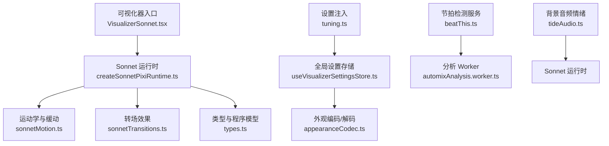
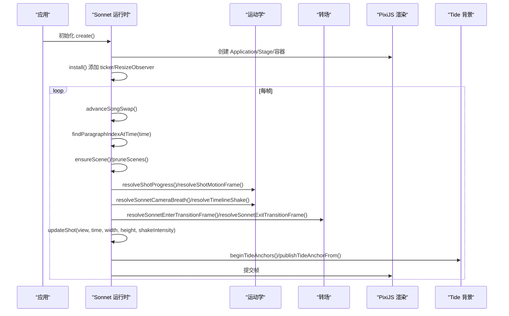
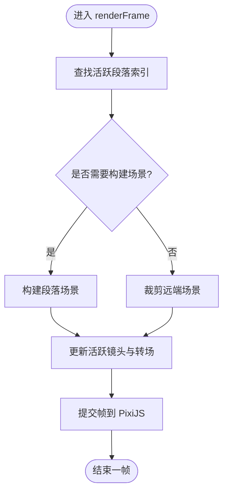
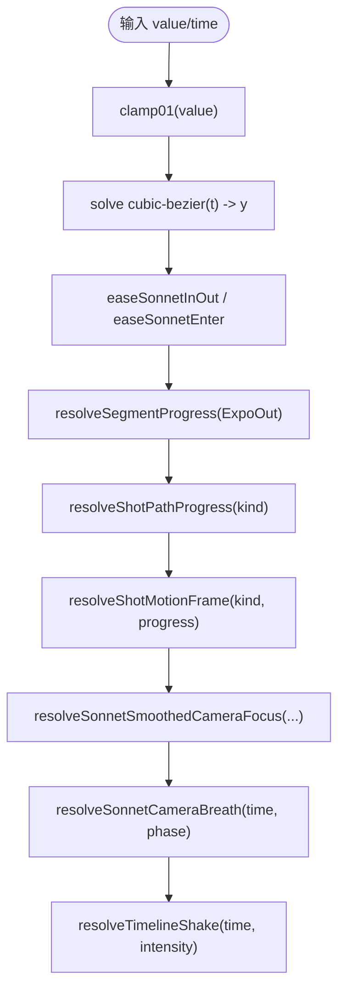
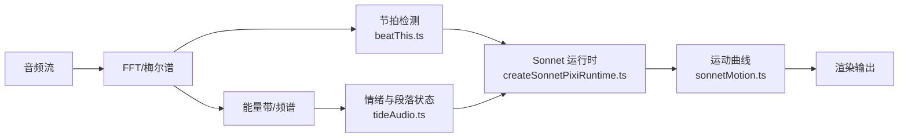
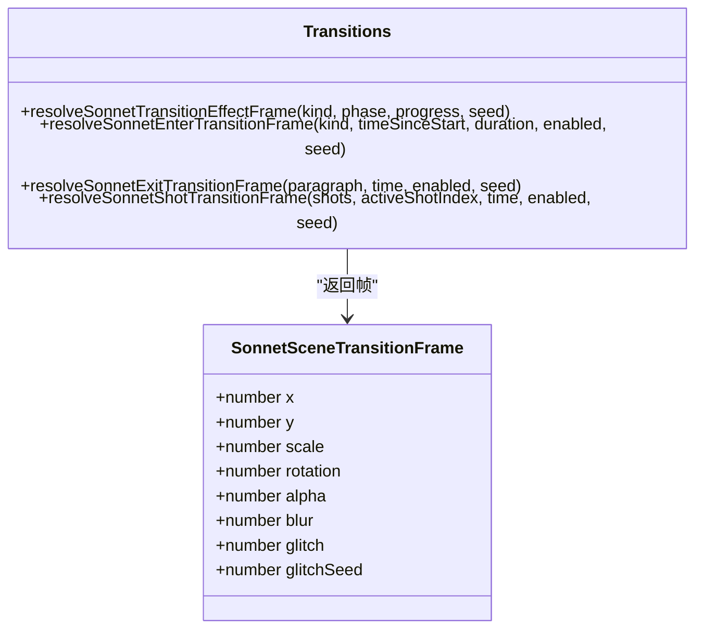
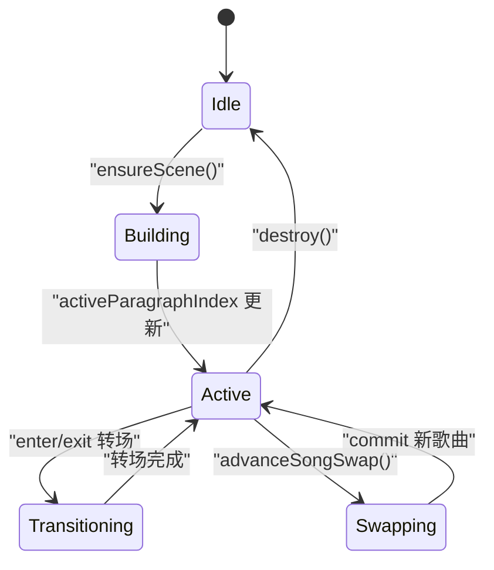
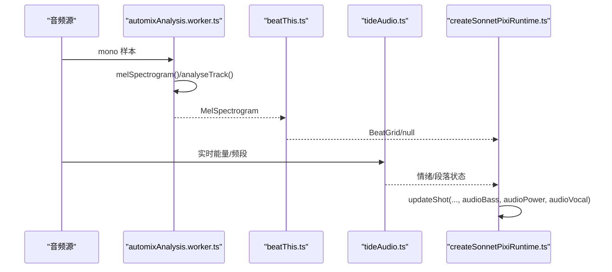
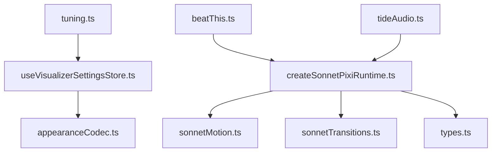

# 动画系统

<cite>
**本文引用的文件**   
- [createSonnetPixiRuntime.ts](file://src/components/visualizer/sonnet/createSonnetPixiRuntime.ts)
- [sonnetMotion.ts](file://src/components/visualizer/sonnet/sonnetMotion.ts)
- [sonnetTransitions.ts](file://src/components/visualizer/sonnet/sonnetTransitions.ts)
- [types.ts](file://src/components/visualizer/sonnet/types.ts)
- [tuning.ts](file://src/components/visualizer/sonnet/tuning.ts)
- [VisualizerSonnet.tsx](file://src/components/visualizer/sonnet/VisualizerSonnet.tsx)
- [useVisualizerSettingsStore.ts](file://src/stores/useVisualizerSettingsStore.ts)
- [appearanceCodec.ts](file://src/utils/appearanceCodec.ts)
- [beatThis.ts](file://src/services/automix/beatThis.ts)
- [automixAnalysis.worker.ts](file://src/workers/automixAnalysis.worker.ts)
- [MODELS.md](file://src/services/automix/MODELS.md)
- [tideAudio.ts](file://src/components/backgrounds/tide/tideAudio.ts)
- [sonnetPostProcess.test.ts](file://test/unit/visualizer/sonnetPostProcess.test.ts)
- [sonnetMotion.test.ts](file://test/unit/visualizer/sonnetMotion.test.ts)
</cite>

## 目录
1. [引言](#引言)
2. [项目结构](#项目结构)
3. [核心组件](#核心组件)
4. [架构总览](#架构总览)
5. [详细组件分析](#详细组件分析)
6. [依赖关系分析](#依赖关系分析)
7. [性能考量](#性能考量)
8. [故障排查指南](#故障排查指南)
9. [结论](#结论)
10. [附录：自定义动画与调试](#附录自定义动画与调试)

## 引言
本技术文档聚焦 Sonnet 模式的动画系统，围绕时间线管理、缓动函数与插值算法、运动曲线系统、转场效果、音乐驱动动画、动画状态机以及性能优化展开。Sonnet 是一个以歌词驱动的视觉呈现模式，采用 PixiJS 作为渲染后端，通过绝对时间驱动确保“直接跳转”与“连续播放”的一致性；同时提供可配置的镜头路径、呼吸浮动、抖动、景深视差、转场滤镜和后期处理等能力，并与后台节拍检测、频谱分析和情绪映射协同工作，形成节奏同步的视听体验。

## 项目结构
Sonnet 动画系统位于可视化器模块下，核心由运行时、运动学、转场、类型定义与设置注入组成，并通过可视化器注册表接入应用设置与主题体系。

**图示来源**
- [VisualizerSonnet.tsx](file://src/components/visualizer/sonnet/VisualizerSonnet.tsx)
- [createSonnetPixiRuntime.ts:148-196](file://src/components/visualizer/sonnet/createSonnetPixiRuntime.ts#L148-L196)
- [sonnetMotion.ts:1-47](file://src/components/visualizer/sonnet/sonnetMotion.ts#L1-L47)
- [sonnetTransitions.ts:1-31](file://src/components/visualizer/sonnet/sonnetTransitions.ts#L1-L31)
- [types.ts:1-21](file://src/components/visualizer/sonnet/types.ts#L1-L21)
- [tuning.ts:1-11](file://src/components/visualizer/sonnet/tuning.ts#L1-L11)
- [useVisualizerSettingsStore.ts:431-450](file://src/stores/useVisualizerSettingsStore.ts#L431-L450)
- [appearanceCodec.ts:420-450](file://src/utils/appearanceCodec.ts#L420-L450)
- [beatThis.ts:1-449](file://src/services/automix/beatThis.ts#L1-L449)
- [automixAnalysis.worker.ts:1-27](file://src/workers/automixAnalysis.worker.ts#L1-L27)
- [tideAudio.ts:187-211](file://src/components/backgrounds/tide/tideAudio.ts#L187-L211)

**章节来源**
- [createSonnetPixiRuntime.ts:148-196](file://src/components/visualizer/sonnet/createSonnetPixiRuntime.ts#L148-L196)
- [tuning.ts:1-11](file://src/components/visualizer/sonnet/tuning.ts#L1-L11)
- [useVisualizerSettingsStore.ts:431-450](file://src/stores/useVisualizerSettingsStore.ts#L431-L450)

## 核心组件
- Sonnet 运行时：负责 PixiJS 生命周期、场景缓存、段落切换、逐帧更新、资源释放与过渡覆盖层。
- 运动学模块：提供贝塞尔缓动、分段进度、镜头路径、焦点平滑、呼吸浮动与时间轴抖动。
- 转场模块：提供淡入淡出、模糊、单色故障等转场帧计算，支持段落级与镜头级边界。
- 类型与程序模型：定义段落、镜头、语义片段、转场种类与程序结构。
- 设置注入与存储：将 Sonnet 调参与可见性开关持久化并应用到运行时。
- 音乐驱动链路：节拍检测、频谱分析与情绪映射为动画提供节奏与情感信号。

**章节来源**
- [createSonnetPixiRuntime.ts:108-196](file://src/components/visualizer/sonnet/createSonnetPixiRuntime.ts#L108-L196)
- [sonnetMotion.ts:1-283](file://src/components/visualizer/sonnet/sonnetMotion.ts#L1-L283)
- [sonnetTransitions.ts:1-153](file://src/components/visualizer/sonnet/sonnetTransitions.ts#L1-L153)
- [types.ts:1-96](file://src/components/visualizer/sonnet/types.ts#L1-L96)
- [tuning.ts:1-11](file://src/components/visualizer/sonnet/tuning.ts#L1-L11)
- [useVisualizerSettingsStore.ts:431-450](file://src/stores/useVisualizerSettingsStore.ts#L431-L450)

## 架构总览
Sonnet 动画系统以“绝对时间驱动”为核心原则，所有运动与转场均基于当前播放时间计算，避免帧率依赖与状态漂移。运行时在每帧中：
- 根据当前时间定位活跃段落与镜头
- 预构建相邻段落以降低切换开销
- 计算镜头路径、呼吸浮动、抖动与景深视差
- 应用段落与镜头级转场
- 更新字形、装饰元素与背景 MG 层
- 发布字形锚点到背景 Tide 系统以实现随字飘散效果

**图示来源**
- [createSonnetPixiRuntime.ts:148-196](file://src/components/visualizer/sonnet/createSonnetPixiRuntime.ts#L148-L196)
- [createSonnetPixiRuntime.ts:715-800](file://src/components/visualizer/sonnet/createSonnetPixiRuntime.ts#L715-L800)
- [sonnetMotion.ts:58-65](file://src/components/visualizer/sonnet/sonnetMotion.ts#L58-L65)
- [sonnetMotion.ts:192-244](file://src/components/visualizer/sonnet/sonnetMotion.ts#L192-L244)
- [sonnetMotion.ts:250-282](file://src/components/visualizer/sonnet/sonnetMotion.ts#L250-L282)
- [sonnetTransitions.ts:90-113](file://src/components/visualizer/sonnet/sonnetTransitions.ts#L90-L113)

## 详细组件分析

### 时间线与段落管理
- 段落查找：按当前时间定位活跃段落，并在切换时重建或裁剪场景缓存。
- 镜头选择：在段落内按时间选择活跃镜头，保证严格可见性与零重叠。
- 预构建策略：非活跃段落仅预构建相邻段落，避免一次性布局大量字形导致的掉帧。
- 资源清理：非活跃镜头卸载显示树，释放过滤器与 GPU 缓冲，防止内存泄漏。

**图示来源**
- [createSonnetPixiRuntime.ts:715-800](file://src/components/visualizer/sonnet/createSonnetPixiRuntime.ts#L715-L800)

**章节来源**
- [createSonnetPixiRuntime.ts:438-454](file://src/components/visualizer/sonnet/createSonnetPixiRuntime.ts#L438-L454)
- [createSonnetPixiRuntime.ts:715-800](file://src/components/visualizer/sonnet/createSonnetPixiRuntime.ts#L715-L800)

### 缓动函数与插值算法
- 贝塞尔缓动：实现 CSS 风格 cubic-bezier，使用二分法求解参数 t，再采样 y。
- 组合缓动：提供 easeSonnetInOut、easeSonnetEnter、easeSonnetExpoOut、easeSonnetElasticOut。
- 分段进度：对每个字形使用高张力 ExpoOut 产生“打击感”入场。
- 镜头路径：按镜头种类返回 x/y/scale/rotation 的关键帧，结合混合速度曲线避免中段停滞。
- 焦点平滑：多时间点加权平均，保留构图跳跃，避免过度平滑导致拖影。
- 呼吸浮动：确定性多频正弦叠加，相位由种子派生，幅度有上限。
- 时间轴抖动：高频噪声合成，强度可调。

**图示来源**
- [sonnetMotion.ts:13-47](file://src/components/visualizer/sonnet/sonnetMotion.ts#L13-L47)
- [sonnetMotion.ts:58-65](file://src/components/visualizer/sonnet/sonnetMotion.ts#L58-L65)
- [sonnetMotion.ts:180-244](file://src/components/visualizer/sonnet/sonnetMotion.ts#L180-L244)
- [sonnetMotion.ts:119-177](file://src/components/visualizer/sonnet/sonnetMotion.ts#L119-L177)
- [sonnetMotion.ts:250-282](file://src/components/visualizer/sonnet/sonnetMotion.ts#L250-L282)

**章节来源**
- [sonnetMotion.ts:1-283](file://src/components/visualizer/sonnet/sonnetMotion.ts#L1-L283)

### 运动曲线系统与节奏同步
- 贝塞尔曲线：用于缓动与镜头路径混合，保证可预测且可复现的运动。
- 物理模拟：呼吸浮动使用多频正弦叠加，模拟手持摄影机的有机漂移；抖动使用高频噪声模拟震动。
- 节奏同步：节拍检测（Beat This!）与频谱分析（梅尔谱、FFT）提供节拍网格与能量带；背景 Tide 的情绪与段落状态与 Sonnet 的镜头/转场协同，使视觉跟随乐句与重拍。

**图示来源**
- [beatThis.ts:90-211](file://src/services/automix/beatThis.ts#L90-L211)
- [beatThis.ts:202-249](file://src/services/automix/beatThis.ts#L202-L249)
- [automixAnalysis.worker.ts:1-27](file://src/workers/automixAnalysis.worker.ts#L1-L27)
- [tideAudio.ts:187-211](file://src/components/backgrounds/tide/tideAudio.ts#L187-L211)
- [createSonnetPixiRuntime.ts:572-586](file://src/components/visualizer/sonnet/createSonnetPixiRuntime.ts#L572-L586)

**章节来源**
- [beatThis.ts:1-449](file://src/services/automix/beatThis.ts#L1-L449)
- [automixAnalysis.worker.ts:1-27](file://src/workers/automixAnalysis.worker.ts#L1-L27)
- [tideAudio.ts:187-211](file://src/components/backgrounds/tide/tideAudio.ts#L187-L211)

### 转场效果
- 段落级转场：支持快速模糊、单色故障、相机拉远等效果，按进入/退出阶段计算 alpha、blur、glitch 与种子。
- 镜头级转场：在相邻镜头之间插入短过渡，时长与方向由时间间隔决定，保持视觉连贯。
- 转场种子：基于段落与边界索引生成确定性种子，保证跳转稳定。

**图示来源**
- [sonnetTransitions.ts:11-31](file://src/components/visualizer/sonnet/sonnetTransitions.ts#L11-L31)
- [sonnetTransitions.ts:38-88](file://src/components/visualizer/sonnet/sonnetTransitions.ts#L38-L88)
- [sonnetTransitions.ts:90-153](file://src/components/visualizer/sonnet/sonnetTransitions.ts#L90-L153)

**章节来源**
- [sonnetTransitions.ts:1-153](file://src/components/visualizer/sonnet/sonnetTransitions.ts#L1-L153)

### 动画状态机
- 段落状态：按时间推进，活跃段落唯一，其他段落隐藏。
- 镜头状态：段落内按时间选择活跃镜头，严格可见性避免残留。
- 歌曲切换状态：维护待提交的下一首歌曲上下文与图标纹理，使用遮罩过渡完成无缝换曲。
- 优先级控制：先推进歌曲切换，再查找段落与镜头，最后更新显示树，确保时序正确。
- 并发管理：Ticker 驱动主循环，ResizeObserver 异步调整画布尺寸；场景构建与资源释放串行执行，避免竞争。

**图示来源**
- [createSonnetPixiRuntime.ts:114-131](file://src/components/visualizer/sonnet/createSonnetPixiRuntime.ts#L114-L131)
- [createSonnetPixiRuntime.ts:715-800](file://src/components/visualizer/sonnet/createSonnetPixiRuntime.ts#L715-L800)

**章节来源**
- [createSonnetPixiRuntime.ts:108-196](file://src/components/visualizer/sonnet/createSonnetPixiRuntime.ts#L108-L196)
- [createSonnetPixiRuntime.ts:715-800](file://src/components/visualizer/sonnet/createSonnetPixiRuntime.ts#L715-L800)

### 音乐驱动动画
- 节拍检测：Beat This! 模型在 Electron 主进程运行，前端仅调用纯函数接口；梅尔谱分块与峰值挑选遵循契约常量，保证与官方 Python 推理一致。
- 频谱分析：Worker 线程进行 FFT 与梅尔谱计算，避免阻塞 UI 线程。
- 情绪映射：背景 Tide 系统维护秒级慢包络与段落二值化状态，触发环状脉冲与节奏事件，与 Sonnet 的镜头/转场协同。
- 运行时集成：Sonnet 运行时读取音频能量带与功率，传递给 MG 层与字形动画，增强节奏响应。

**图示来源**
- [automixAnalysis.worker.ts:1-27](file://src/workers/automixAnalysis.worker.ts#L1-L27)
- [beatThis.ts:90-211](file://src/services/automix/beatThis.ts#L90-L211)
- [beatThis.ts:428-449](file://src/services/automix/beatThis.ts#L428-L449)
- [tideAudio.ts:187-211](file://src/components/backgrounds/tide/tideAudio.ts#L187-L211)
- [createSonnetPixiRuntime.ts:572-586](file://src/components/visualizer/sonnet/createSonnetPixiRuntime.ts#L572-L586)

**章节来源**
- [MODELS.md:1-35](file://src/services/automix/MODELS.md#L1-L35)
- [beatThis.ts:1-449](file://src/services/automix/beatThis.ts#L1-L449)
- [automixAnalysis.worker.ts:1-27](file://src/workers/automixAnalysis.worker.ts#L1-L27)
- [tideAudio.ts:187-211](file://src/components/backgrounds/tide/tideAudio.ts#L187-L211)

## 依赖关系分析
- 运行时依赖运动学与转场模块，依赖类型定义与主题配置。
- 设置注入通过可视化器注册表将 Sonnet 调参注入到运行时属性。
- 外观编码/解码压缩/解压 Sonnet 调参，便于持久化与迁移。
- 节拍检测与频谱分析通过 Worker 与 Electron 桥接，运行时仅消费结果。
- Tide 背景与 Sonnet 运行时通过锚点桥接协作，字形位置与透明度影响背景水纹。

**图示来源**
- [createSonnetPixiRuntime.ts:1-46](file://src/components/visualizer/sonnet/createSonnetPixiRuntime.ts#L1-L46)
- [tuning.ts:1-11](file://src/components/visualizer/sonnet/tuning.ts#L1-L11)
- [useVisualizerSettingsStore.ts:431-450](file://src/stores/useVisualizerSettingsStore.ts#L431-L450)
- [appearanceCodec.ts:420-450](file://src/utils/appearanceCodec.ts#L420-L450)
- [beatThis.ts:1-449](file://src/services/automix/beatThis.ts#L1-L449)
- [tideAudio.ts:187-211](file://src/components/backgrounds/tide/tideAudio.ts#L187-L211)

**章节来源**
- [createSonnetPixiRuntime.ts:1-46](file://src/components/visualizer/sonnet/createSonnetPixiRuntime.ts#L1-L46)
- [tuning.ts:1-11](file://src/components/visualizer/sonnet/tuning.ts#L1-L11)
- [useVisualizerSettingsStore.ts:431-450](file://src/stores/useVisualizerSettingsStore.ts#L431-L450)
- [appearanceCodec.ts:420-450](file://src/utils/appearanceCodec.ts#L420-L450)

## 性能考量
- 请求动画帧：使用 PixiJS Ticker 驱动主循环，避免手动 requestAnimationFrame 带来的不一致。
- 增量更新：仅在段落切换或窗口尺寸变化时重建场景；非活跃镜头卸载显示树，减少绘制开销。
- 硬件加速：启用 WebGL 偏好与抗锯齿，分辨率对齐纹理池桶以减少重分配。
- 纹理池：图标与滤镜目标复用，降低 GPU 内存压力。
- 后处理开关：根据主题动画强度与用户设置启用/禁用噪点、对比度、色差、半色调、暗角与镜头畸变，避免不必要的着色器通道。
- 测试保障：单元测试验证呼吸浮动范围、后处理缩放与上限，确保数值稳定性。

**章节来源**
- [createSonnetPixiRuntime.ts:148-164](file://src/components/visualizer/sonnet/createSonnetPixiRuntime.ts#L148-L164)
- [createSonnetPixiRuntime.ts:381-406](file://src/components/visualizer/sonnet/createSonnetPixiRuntime.ts#L381-L406)
- [sonnetPostProcess.test.ts:51-88](file://test/unit/visualizer/sonnetPostProcess.test.ts#L51-L88)
- [sonnetMotion.test.ts:91-113](file://test/unit/visualizer/sonnetMotion.test.ts#L91-L113)

## 故障排查指南
- 直接跳转不稳定：检查是否使用绝对时间驱动；确认缓动与镜头路径不依赖帧率。
- 呼吸浮动异常：校验 revealDoneTime 与 breathWeight 的斜坡逻辑，确保只在歌词揭示完成后渐入。
- 转场闪烁：确认段落与镜头级转场的时间窗口与种子一致性；检查 enter/exit 阶段的 alpha 与 blur 计算。
- 内存泄漏：确认非活跃镜头与场景的显示树被卸载，过滤器与 GPU 缓冲被销毁。
- 节拍检测失败：确认模型可用性与 Worker 通信；检查梅尔谱分块与峰值挑选是否符合契约常量。
- 背景不同步：确认 Tide 锚点发布条件与字形可见性匹配，避免空读或残影。

**章节来源**
- [sonnetMotion.ts:250-282](file://src/components/visualizer/sonnet/sonnetMotion.ts#L250-L282)
- [sonnetTransitions.ts:90-153](file://src/components/visualizer/sonnet/sonnetTransitions.ts#L90-L153)
- [createSonnetPixiRuntime.ts:381-406](file://src/components/visualizer/sonnet/createSonnetPixiRuntime.ts#L381-L406)
- [beatThis.ts:428-449](file://src/services/automix/beatThis.ts#L428-L449)

## 结论
Sonnet 动画系统以绝对时间为基准，结合贝塞尔缓动、镜头路径、呼吸浮动与抖动，构建了稳定且富有表现力的歌词视觉呈现。转场模块提供多种视觉效果，配合节拍检测与频谱分析，实现音乐驱动的节奏同步。运行时通过严格的可见性控制、场景缓存与资源管理，确保高性能与低内存占用。设置注入与外观编码使得调参与主题易于扩展与维护。整体架构清晰、职责分明，适合进一步扩展自定义动画效果与调试工具。

## 附录：自定义动画与调试
- 自定义缓动：在运动学模块中添加新的缓动函数，并在镜头路径或字形进度中使用。
- 自定义转场：在转场模块中新增效果类型，计算 alpha、blur、glitch 与种子，并在段落/镜头边界调用。
- 自定义 MG 层：在运行时 updateShot 中注入自定义 MG 层的 updateTime 回调，接收时间、提示词、起止时间与音频能量。
- 调试面板：使用 Sonnet 设置面板开关引导线、背景几何、装饰文本与转场，观察镜头路径与呼吸浮动。
- 性能探针：利用单元测试与浏览器性能面板监控帧率、内存与 GPU 使用，确保后处理与纹理池合理配置。

**章节来源**
- [sonnetMotion.ts:1-283](file://src/components/visualizer/sonnet/sonnetMotion.ts#L1-L283)
- [sonnetTransitions.ts:1-153](file://src/components/visualizer/sonnet/sonnetTransitions.ts#L1-L153)
- [createSonnetPixiRuntime.ts:572-586](file://src/components/visualizer/sonnet/createSonnetPixiRuntime.ts#L572-L586)
- [VisualizerSonnet.tsx](file://src/components/visualizer/sonnet/VisualizerSonnet.tsx)