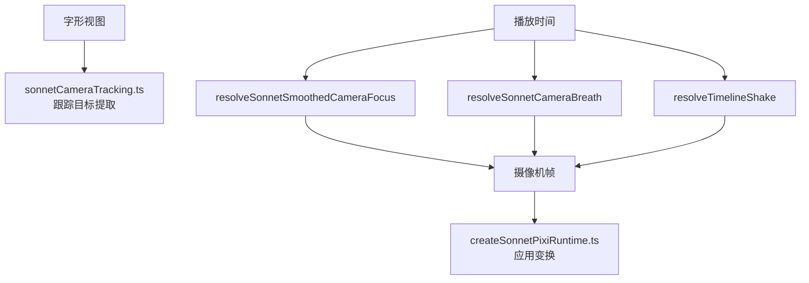
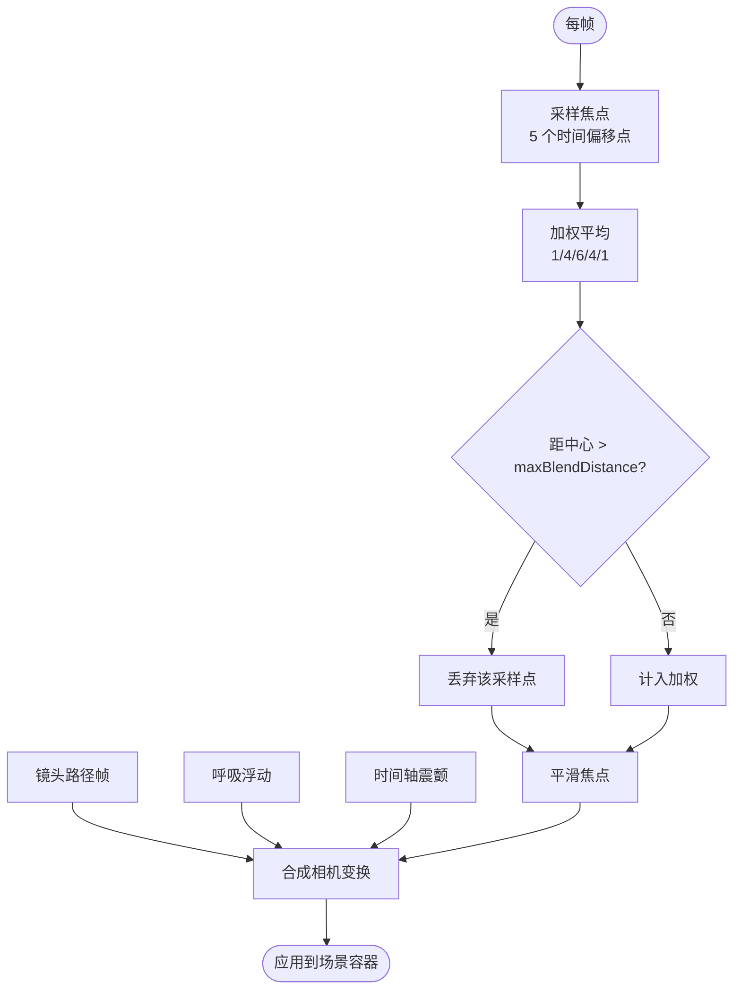
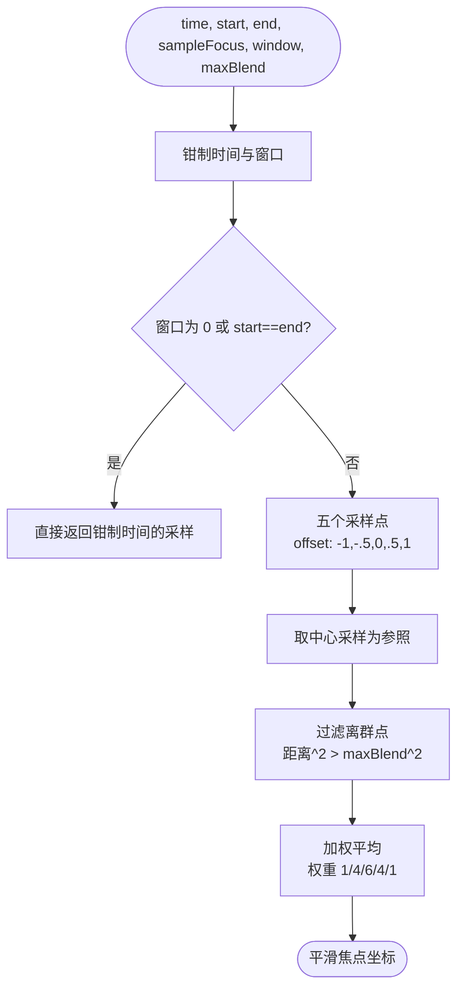
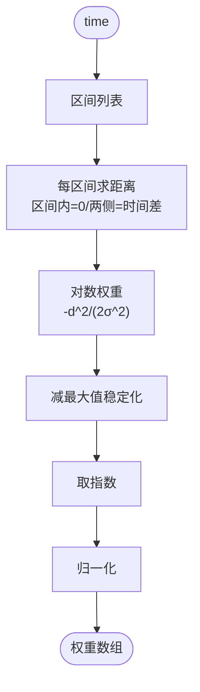
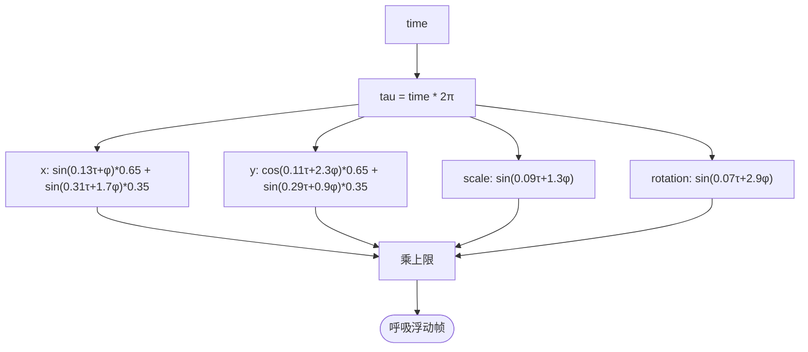
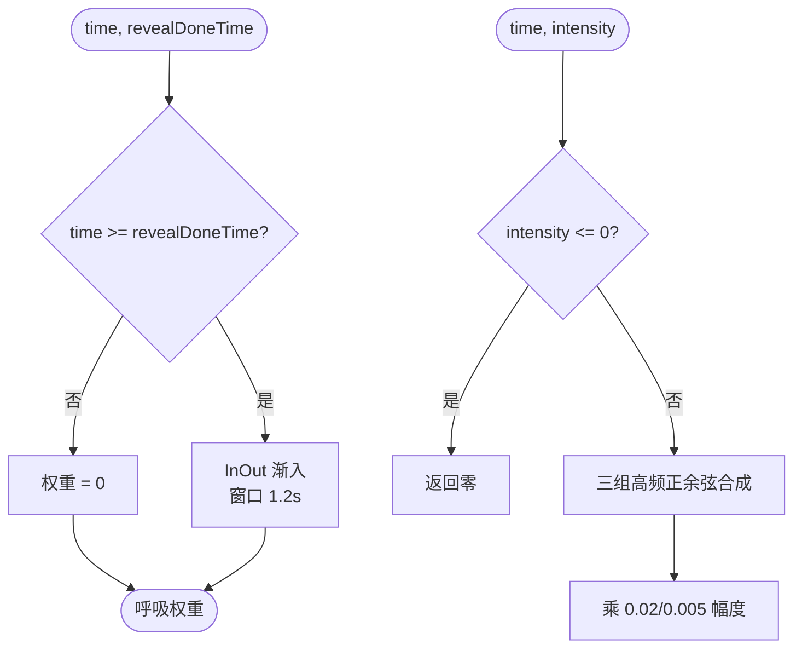
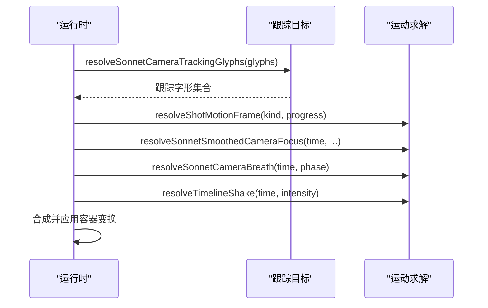
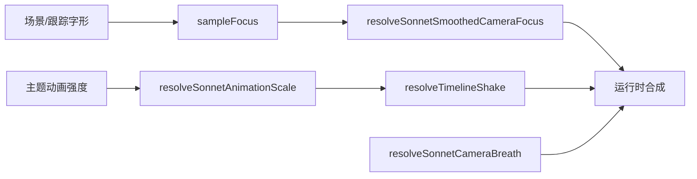

# 摄像机系统

<cite>
**本文引用的文件**   
- [sonnetMotion.ts](file://src/components/visualizer/sonnet/sonnetMotion.ts)
- [sonnetCameraTracking.ts](file://src/components/visualizer/sonnet/sonnetCameraTracking.ts)
- [createSonnetPixiRuntime.ts](file://src/components/visualizer/sonnet/createSonnetPixiRuntime.ts)
- [sonnetCameraTracking.test.ts](file://test/unit/visualizer/sonnetCameraTracking.test.ts)
- [focusJitterRepro.test.ts](file://test/unit/visualizer/focusJitterRepro.test.ts)
- [types.ts](file://src/components/visualizer/sonnet/types.ts)
</cite>

## 目录
1. [引言](#引言)
2. [项目结构](#项目结构)
3. [核心组件](#核心组件)
4. [架构总览](#架构总览)
5. [详细组件分析](#详细组件分析)
6. [依赖关系分析](#依赖关系分析)
7. [性能考量](#性能考量)
8. [故障排查指南](#故障排查指南)
9. [结论](#结论)

## 引言
本文聚焦 Sonnet 模式的摄像机系统，围绕以下目标展开：
- 解释焦点跟踪算法：多时间点采样、高斯权重与边缘保护平滑。
- 说明摄像机抖动模拟：手持呼吸浮动的多层正弦叠加与相位偏移。
- 阐述镜头路径与摄像机的协同：路径进度如何驱动相机位置、缩放与旋转。
- 解释焦点权重计算：时间距离衰减、权重归一化与静默间隙处理。
- 提供稳定性控制（平滑窗口、最大混合距离）与调试方法。

摄像机系统决定了“观众看画面时的呼吸感”：稳定但有生命力的漂移，以及有意的构图跳切。

## 项目结构
- sonnetMotion.ts：摄像机核心算法所在，包括平滑焦点、呼吸浮动、时间轴震颤与镜头运动帧。
- sonnetCameraTracking.ts：从字形视图提取用于相机跟踪的目标集合（trackingGlyphs）。
- createSonnetPixiRuntime.ts：逐帧把焦点与呼吸叠加到场景容器变换上。
- 测试：sonnetCameraTracking.test.ts 与 focusJitterRepro.test.ts 覆盖聚焦与抖动稳定性。

**图示来源**
- [sonnetMotion.ts:119-153](file://src/components/visualizer/sonnet/sonnetMotion.ts#L119-L153)
- [sonnetMotion.ts:250-262](file://src/components/visualizer/sonnet/sonnetMotion.ts#L250-L262)
- [sonnetCameraTracking.ts:11-30](file://src/components/visualizer/sonnet/sonnetCameraTracking.ts#L11-L30)

**章节来源**
- [sonnetMotion.ts:101-153](file://src/components/visualizer/sonnet/sonnetMotion.ts#L101-L153)

## 核心组件
- `resolveSonnetSmoothedCameraFocus`：五采样加权平滑（权重 1/4/6/4/1），带边缘保护。
- `SONNET_CAMERA_SMOOTHING_SAMPLES`：固定的采样偏移与权重表，保证平滑核可审计。
- `resolveSonnetCameraBreath`：四通道（x/y/scale/rotation）确定性呼吸浮动。
- `resolveTimelineShake`：高频噪声合成的时间轴震颤。
- `resolveSonnetFocusWeights`：为多个焦点区间生成归一化高斯权重。

**章节来源**
- [sonnetMotion.ts:111-177](file://src/components/visualizer/sonnet/sonnetMotion.ts#L111-L177)

## 架构总览
摄像机的最终变换由三部分合成：焦点跟踪平移（用户注意力跟随）、呼吸浮动（有机漂移）与震颤（节奏强度），再加上镜头路径本身给出的位置/缩放/旋转。三者都在“绝对时间”上求值，直接 seek 与连续播放结果一致。

**图示来源**
- [sonnetMotion.ts:119-153](file://src/components/visualizer/sonnet/sonnetMotion.ts#L119-L153)
- [sonnetMotion.ts:193-244](file://src/components/visualizer/sonnet/sonnetMotion.ts#L193-L244)

**章节来源**
- [createSonnetPixiRuntime.ts:572-586](file://src/components/visualizer/sonnet/createSonnetPixiRuntime.ts#L572-L586)

## 详细组件分析

### 焦点跟踪与边缘保护平滑
平滑器的输入是一个“时间 → 焦点坐标”的采样函数。实现先钳制平滑窗口与时间边界，然后沿时间轴取偏移为 `-1/-0.5/0/+0.5/+1` 倍的五个采样点，使用 1/4/6/4/1 的离散高斯核加权。关键设计是边缘保护：若某个采样点与中心点的距离超过 `maxBlendDistance`（默认 96px），该点被完全丢弃——这样在两段构图差异很大的歌词之间快速切换时，相机会“跳”过去而不是“拉”过去，保留导演式的切镜感。

**图示来源**
- [sonnetMotion.ts:119-153](file://src/components/visualizer/sonnet/sonnetMotion.ts#L119-L153)

**章节来源**
- [sonnetMotion.ts:101-153](file://src/components/visualizer/sonnet/sonnetMotion.ts#L101-L153)

### 焦点权重计算
当一个镜头内存在多个候选焦点区间时，`resolveSonnetFocusWeights` 负责在它们之间平滑分配注意力。每个区间按“当前时间到区间的距离”计算对数空间的高斯权重，先减去最大对数权重做数值稳定，再一次指数与归一化。区间内距离为 0、两侧按时间差衰减，因此焦点在歌词行间迁移时是连续渐变而非跳变。

**图示来源**
- [sonnetMotion.ts:155-177](file://src/components/visualizer/sonnet/sonnetMotion.ts#L155-L177)

**章节来源**
- [sonnetMotion.ts:155-177](file://src/components/visualizer/sonnet/sonnetMotion.ts#L155-L177)

### 摄像机抖动模拟：呼吸浮动
呼吸浮动由两个不同频率的正弦按 0.65/0.35 权重叠加而成，x、y、scale、rotation 各自使用独立频率与相位，相位可由种子派生。所有通道都乘上小量上限（位置 0.006、缩放 0.002、旋转 0.0015），保证“有生命”但不喧宾夺主。由于全部基于 `time`（以 `2π` 归一），直接跳转也不会破坏相位连续性。

**图示来源**
- [sonnetMotion.ts:250-262](file://src/components/visualizer/sonnet/sonnetMotion.ts#L250-L262)

**章节来源**
- [sonnetMotion.ts:246-262](file://src/components/visualizer/sonnet/sonnetMotion.ts#L246-L262)

### 呼吸渐入与震颤
呼吸浮动通过 `resolveSonnetBreathWeight` 在歌词揭示完成（`revealDoneTime`）后才渐入——避免文字还在入场时相机就开始飘，造成“文字在动、镜头也在动”的双重运动。揭示完成后用 InOut 曲线在 1.2 秒窗口内把权重推到 1。震颤则以三组不同频率的正余弦乘积合成高频噪声，平移幅度上限 `0.02 * intensity`、旋转上限 `0.005 * intensity`。

**图示来源**
- [sonnetMotion.ts:264-282](file://src/components/visualizer/sonnet/sonnetMotion.ts#L264-L282)

**章节来源**
- [sonnetMotion.ts:264-282](file://src/components/visualizer/sonnet/sonnetMotion.ts#L264-L282)

### 跟踪字形与运行时协同
`resolveSonnetCameraTrackingGlyphs` 从镜头的字形集合中筛出参与相机跟踪的目标（排除背景形状等非文字对象），运行时据此计算焦点采样函数。运行时的每帧顺序为：先算镜头路径帧，再叠加平滑焦点平移、呼吸浮动与震颤，最后写入场景容器。这样路径负责“大运镜”，平滑焦点负责“微调视线”，两者职责分离。

**图示来源**
- [sonnetCameraTracking.ts:11-30](file://src/components/visualizer/sonnet/sonnetCameraTracking.ts#L11-L30)
- [createSonnetPixiRuntime.ts:572-586](file://src/components/visualizer/sonnet/createSonnetPixiRuntime.ts#L572-L586)

**章节来源**
- [sonnetMotion.ts:193-244](file://src/components/visualizer/sonnet/sonnetMotion.ts#L193-L244)

## 依赖关系分析
- 摄像机系统依赖主题的动画强度倍率（`resolveSonnetAnimationScale`）缩放震颤等强度参数。
- 平滑焦点的采样函数由场景层提供（基于跟踪字形的世界坐标），因此摄像机系统与场景构建保持松耦合。
- 呼吸浮动与震颤被运行时统一叠加，不改变镜头路径的原始输出，便于分别调试。

**图示来源**
- [sonnetMotion.ts:45-47](file://src/components/visualizer/sonnet/sonnetMotion.ts#L45-L47)
- [sonnetMotion.ts:119-153](file://src/components/visualizer/sonnet/sonnetMotion.ts#L119-L153)

**章节来源**
- [sonnetMotion.ts:45-47](file://src/components/visualizer/sonnet/sonnetMotion.ts#L45-L47)

## 性能考量
- 固定五采样：每次平滑仅执行 5 次焦点采样，成本上界明确，与焦点区间数量无关。
- 零分配核：采样表是模块级常量数组，循环内只做数值计算。
- 确定性使缓存可行：同一 `time` 的摄像机帧可被缓存或重放，无需逐帧累积。
- 幅度上限：呼吸与震颤都有硬上限常量，防止参数配置异常导致相机大幅漂移。

**章节来源**
- [sonnetMotion.ts:111-117](file://src/components/visualizer/sonnet/sonnetMotion.ts#L111-L117)

## 故障排查指南
- 相机“拖影”或过度平滑：降低 `smoothingWindow` 或减小 `maxBlendDistance` 之前，先确认采样函数返回的焦点坐标本身是否有跳变。
- 构图跳切被抹平：检查 `maxBlendDistance` 是否被调得过大，导致原本应被丢弃的远距离采样被平均进去。
- 呼吸浮动在歌词未揭示时就出现：确认 `revealDoneTime` 取值正确、呼吸权重是从 0 开始的。
- 抖动过强：intensity 与主题动画强度倍率相乘，chaotic 主题为 1.35 倍；检查是否符合预期。
- 直接 seek 后画面与连续播放不同：任何把状态缓存在模块作用域的运动计算都违反绝对时间原则，检查是否引入了此类代码。

**章节来源**
- [sonnetMotion.ts:119-153](file://src/components/visualizer/sonnet/sonnetMotion.ts#L119-L153)
- [focusJitterRepro.test.ts](file://test/unit/visualizer/focusJitterRepro.test.ts)

## 结论
Sonnet 摄像机系统用三个正交组件构建出富有导演感的镜头语言：边缘保护的焦点平滑保留了构图跳切、多层正弦呼吸提供有机漂移、时间轴震颤注入节奏能量。它们与镜头路径解耦、全部由绝对时间求解，既保证了 seek 一致性，也让每一层都可以独立调试与替换。
