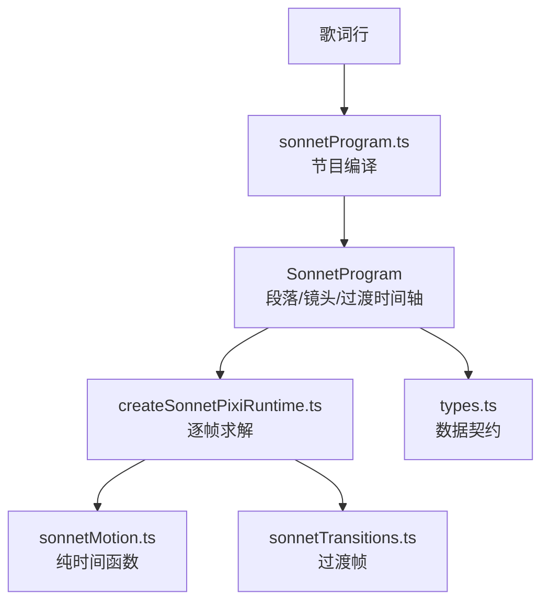
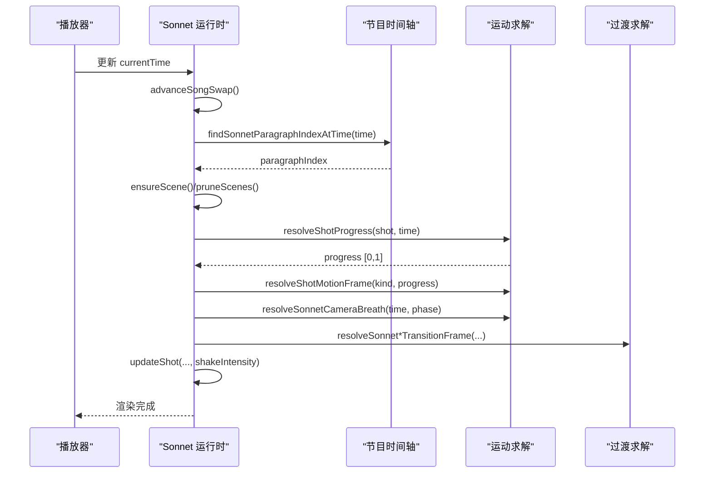
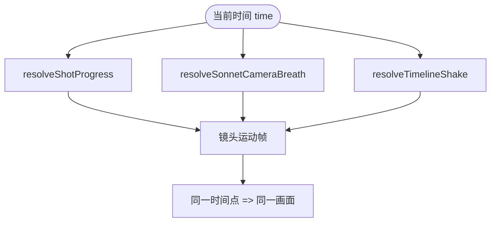
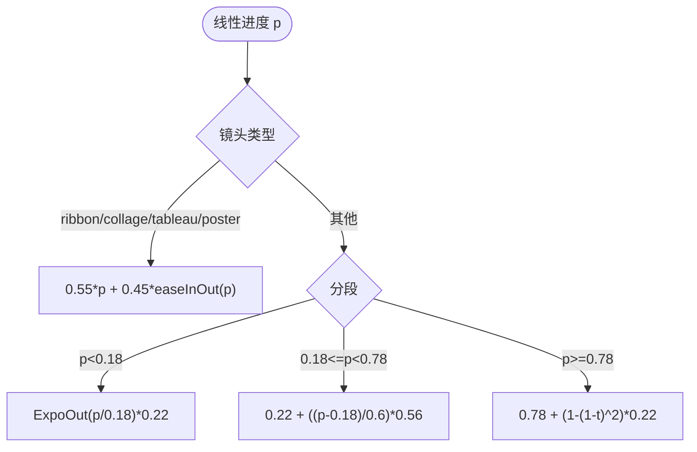
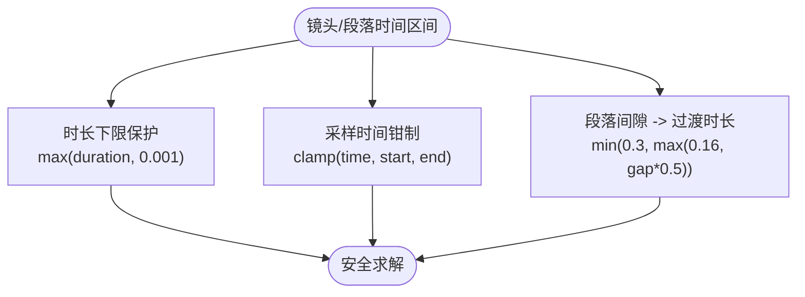
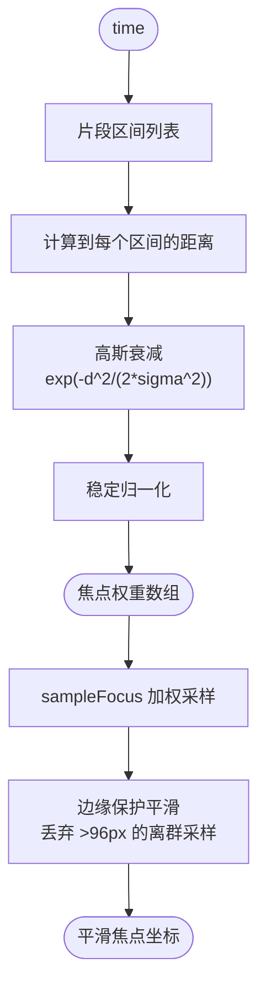
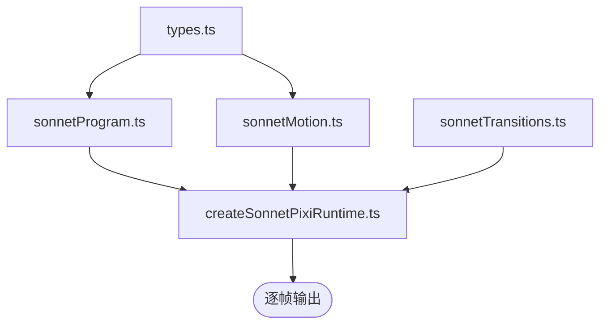

# 时间线系统

<cite>
**本文引用的文件**   
- [sonnetMotion.ts](file://src/components/visualizer/sonnet/sonnetMotion.ts)
- [sonnetProgram.ts](file://src/components/visualizer/sonnet/sonnetProgram.ts)
- [createSonnetPixiRuntime.ts](file://src/components/visualizer/sonnet/createSonnetPixiRuntime.ts)
- [types.ts](file://src/components/visualizer/sonnet/types.ts)
- [sonnetTransitions.ts](file://src/components/visualizer/sonnet/sonnetTransitions.ts)
</cite>

## 目录
1. [引言](#引言)
2. [项目结构](#项目结构)
3. [核心组件](#核心组件)
4. [架构总览](#架构总览)
5. [详细组件分析](#详细组件分析)
6. [依赖关系分析](#依赖关系分析)
7. [性能考量](#性能考量)
8. [故障排查指南](#故障排查指南)
9. [结论](#结论)

## 引言
本文聚焦 Sonnet 模式的时间线系统，围绕以下目标展开：
- 解释绝对时间评估机制：所有运动量以当前播放时间直接求解，直接 seek 与连续播放结果一致。
- 说明镜头路径规划：不同镜头类型的运动轨迹、分段进度函数与平滑算法。
- 阐述时间范围管理：镜头与段落的起止时间、重叠规避与边界检查。
- 解释确定性动画保证：可重复播放、精确 seek 支持与时间一致性验证方式。
- 给出时间缓存、增量计算等性能策略与时间线调试工具的用法。

时间线系统是 Sonnet“PV 引擎”的心脏：歌词被编译为带绝对时间的节目（Program），运行时每一帧都从时间轴求解状态，而不是把状态推进到下一帧。

## 项目结构
- sonnetProgram.ts：把歌词编译为确定性的节目时间线（段落、镜头、过渡），并首次导出段落定位函数。
- sonnetMotion.ts：纯函数运动求解层，覆盖缓动、镜头路径、焦点平滑、呼吸浮动与时间轴震颤。
- createSonnetPixiRuntime.ts：运行时控制器，逐帧读取播放时间并驱动场景更新、预构建与资源裁剪。
- sonnetTransitions.ts：段落级/镜头级过渡帧计算，是时间轴上“边界”的视觉表达。
- types.ts：时间线数据结构契约（SonnetShot、SonnetParagraph、SonnetProgram）。

**图示来源**
- [sonnetProgram.ts:193-265](file://src/components/visualizer/sonnet/sonnetProgram.ts#L193-L265)
- [sonnetMotion.ts:58-65](file://src/components/visualizer/sonnet/sonnetMotion.ts#L58-L65)
- [createSonnetPixiRuntime.ts:438-454](file://src/components/visualizer/sonnet/createSonnetPixiRuntime.ts#L438-L454)

**章节来源**
- [types.ts:49-86](file://src/components/visualizer/sonnet/types.ts#L49-L86)

## 核心组件
- 镜头进度求解：`resolveShotProgress` 以 `(time - startTime) / max(duration, 0.001)` 计算 [0,1] 进度，时长保护避免除零。
- 段落定位：`findSonnetParagraphIndexAtTime` 在段落数组中二分/线性定位当前时间所在段落。
- 路径进度：`resolveShotPathProgress` 把线性进度映射为“快速入场—匀速中段—柔和收尾”的时间曲线。
- 焦点权重：`resolveSonnetFocusWeights` 以高斯距离衰减生成随时间平滑迁移的焦点权重。
- 确定性抖动：`resolveTimelineShake` 用纯时间三角函数合成震颤，不依赖随机状态。

**章节来源**
- [sonnetMotion.ts:58-65](file://src/components/visualizer/sonnet/sonnetMotion.ts#L58-L65)
- [sonnetMotion.ts:156-190](file://src/components/visualizer/sonnet/sonnetMotion.ts#L156-L190)
- [sonnetProgram.ts:260-265](file://src/components/visualizer/sonnet/sonnetProgram.ts#L260-L265)

## 架构总览
运行时的每帧更新遵循固定时序：先推进歌曲切换，再定位活跃段落，确保场景缓存，然后求解镜头路径、呼吸浮动与焦点平滑，最后应用过渡并提交帧。所有运动函数都是“时间 → 数值”的纯映射，因此帧率变化、掉帧或直接拖动进度条都不会造成状态漂移。

**图示来源**
- [createSonnetPixiRuntime.ts:438-454](file://src/components/visualizer/sonnet/createSonnetPixiRuntime.ts#L438-L454)
- [createSonnetPixiRuntime.ts:715-800](file://src/components/visualizer/sonnet/createSonnetPixiRuntime.ts#L715-L800)
- [sonnetProgram.ts:260-265](file://src/components/visualizer/sonnet/sonnetProgram.ts#L260-L265)
- [sonnetTransitions.ts:90-113](file://src/components/visualizer/sonnet/sonnetTransitions.ts#L90-L113)

## 详细组件分析

### 绝对时间评估与帧率无关性
绝对时间评估意味着“画面状态是时间的函数”而不是“时间的积分”。`resolveShotProgress` 只依赖 `shot.startTime/endTime` 与当前 `time`；`resolveSonnetCameraBreath` 直接以 `time` 驱动多层正弦；`resolveTimelineShake` 同样只读取 `time`。这种设计保证：
- 以 30fps 或 120fps 渲染，相同时间点的画面完全一致；
- 直接 seek 到任意时间点，画面与连续播放到该点一致；
- 掉帧只影响观感流畅度，不会造成动画相位漂移。

**图示来源**
- [sonnetMotion.ts:58-65](file://src/components/visualizer/sonnet/sonnetMotion.ts#L58-L65)
- [sonnetMotion.ts:250-282](file://src/components/visualizer/sonnet/sonnetMotion.ts#L250-L282)

**章节来源**
- [sonnetMotion.ts:9-11](file://src/components/visualizer/sonnet/sonnetMotion.ts#L9-L11)

### 镜头路径规划与分段速度曲线
`resolveShotPathProgress` 为镜头路径提供“时间整形”：对 `tracking-ribbon`、`fragment-collage`、`quiet-tableau`、`poster-blocks` 四类镜头，把匀速漂移混入 InOut 曲线（`linear * 0.55 + easeSonnetInOut(linear) * 0.45`），保证中段速度永不为零；其余镜头使用三段式曲线——前 18% 用 ExpoOut 快速入场（仅走完 22% 路径）、中段 60% 近匀速推进（22% → 78%）、末段 22% 用二次收尾把剩余路径柔和交给转场。

**图示来源**
- [sonnetMotion.ts:179-190](file://src/components/visualizer/sonnet/sonnetMotion.ts#L179-L190)

**章节来源**
- [sonnetMotion.ts:179-244](file://src/components/visualizer/sonnet/sonnetMotion.ts#L179-L244)

### 时间范围管理与边界检查
时间范围管理体现在三处：
- 时长保护：`resolveShotProgress` 与 `resolveSegmentProgress` 都以 `Math.max(duration, 极小值)` 防止零时长导致的除零或爆炸。
- 采样钳制：焦点平滑与权重计算把采样时间钳制在 `[startTime, endTime]` 之内，避免越界读取。
- 段落间隙：节目编译阶段按段落间隙计算 `transitionOut` 的时长（`min(0.3, max(0.16, gap*0.5))`），间隙越小过渡越短，保证连续段落之间不出现视觉悬空。

**图示来源**
- [sonnetMotion.ts:58-65](file://src/components/visualizer/sonnet/sonnetMotion.ts#L58-L65)
- [sonnetMotion.ts:120-153](file://src/components/visualizer/sonnet/sonnetMotion.ts#L120-L153)
- [sonnetProgram.ts:234-253](file://src/components/visualizer/sonnet/sonnetProgram.ts#L234-L253)

**章节来源**
- [types.ts:49-79](file://src/components/visualizer/sonnet/types.ts#L49-L79)

### 确定性动画与焦点权重
焦点权重的确定性来自高斯距离衰减：每个时间段（字形区间）按当前时间的距离计算对数权重，做数值稳定归一化（先除以最大对数权重再取指数）。离当前时间越近的区间权重越高，且时间轴尾部与静默间隙都有稳定的权重分布，不会出现“无焦点”导致镜头乱跑的情况。平滑后的焦点经边缘保护（`maxBlendDistance = 96px`）采样：距离中心点过远的采样点被丢弃，保留有意的构图跳跃。

**图示来源**
- [sonnetMotion.ts:155-177](file://src/components/visualizer/sonnet/sonnetMotion.ts#L155-L177)
- [sonnetMotion.ts:119-153](file://src/components/visualizer/sonnet/sonnetMotion.ts#L119-L153)

**章节来源**
- [sonnetMotion.ts:101-153](file://src/components/visualizer/sonnet/sonnetMotion.ts#L101-L153)

### 时间线调试工具
- 呼吸浮动与震颤都有硬上限（`SONNET_CAMERA_BREATH_MAX_OFFSET/SCALE/ROTATION`），调试时可对照常量检查实际幅度是否越界。
- 单元测试 `sonnetMotion.test.ts` 验证呼吸浮动范围与稳定性，可作为修改后的回归基线。
- 运行时调试面板（Sonnet 设置）可开关引导线与调试叠加层，配合 `DEBUG_SONNET_MEASURED_BOUNDS` 定位时间线相关问题（例如入场时刻与测量盒的对应关系）。

**章节来源**
- [sonnetMotion.ts:246-282](file://src/components/visualizer/sonnet/sonnetMotion.ts#L246-L282)

## 依赖关系分析
- sonnetProgram.ts 产出时间线数据；sonnetMotion.ts 是纯函数库，不依赖运行时状态；二者的契约由 types.ts 固定。
- 运行时（createSonnetPixiRuntime.ts）是唯一把时间线数据与当前时间结合的地方，过渡计算（sonnetTransitions.ts）作为时间边界的效果补充。
- 缓动函数（`resolveCubicBezier`、`easeSonnet*`）同时服务于镜头路径、段落进度与呼吸权重，是时间线系统的共享基础设施。

**图示来源**
- [sonnetProgram.ts:1-18](file://src/components/visualizer/sonnet/sonnetProgram.ts#L1-L18)
- [createSonnetPixiRuntime.ts:1-46](file://src/components/visualizer/sonnet/createSonnetPixiRuntime.ts#L1-L46)

**章节来源**
- [sonnetMotion.ts:1-11](file://src/components/visualizer/sonnet/sonnetMotion.ts#L1-L11)

## 性能考量
- 无状态求解：所有函数为纯计算，没有跨帧状态，天然适合“每次从头算”，无需脏标记或增量 diff。
- 时间缓存友好：`resolveSonnetFocusWeights` 的输出只与 `time` 有关，同一时间点重复查询可直接命中缓存（如有）。
- 增量预构建：运行时只为活跃段落构建场景，相邻段落预构建，远端裁剪；时间线越界不会触发整棵场景重建。
- 抖动噪声零分配：`resolveTimelineShake` 返回小对象字面量，避免在热路径上分配数组。

**章节来源**
- [createSonnetPixiRuntime.ts:395-454](file://src/components/visualizer/sonnet/createSonnetPixiRuntime.ts#L395-L454)

## 故障排查指南
- 拖动进度条后画面与连续播放不一致：检查是否有代码把上一帧状态“累积”进运动计算；正确做法是全部改为 `time` 求解。
- 镜头中段停滞：确认镜头类型是否走了 `resolveShotPathProgress` 的匀速混合分支；ribbon/collage 类镜头必须保证中段速度不为零。
- 呼吸浮动在歌词未完成前就出现：`resolveSonnetBreathWeight` 要求 `time >= revealDoneTime` 后才渐入，检查 `revealDoneTime` 的传入值。
- 焦点跳变：确认平滑窗口 `smoothingWindow` 不为 0，且 `maxBlendDistance` 没有被设置得过大导致离群点被平均。
- 时间轴震颤幅度异常：检查 `intensity` 是否为 0 短路返回；非零时最大平移幅度为 `0.02 * intensity`。

**章节来源**
- [sonnetMotion.ts:250-282](file://src/components/visualizer/sonnet/sonnetMotion.ts#L250-L282)
- [sonnetMotion.ts:264-268](file://src/components/visualizer/sonnet/sonnetMotion.ts#L264-L268)

## 结论
Sonnet 时间线系统以“绝对时间求解”为第一原则，把镜头路径、焦点平滑、呼吸浮动与震颤全部建模为纯函数，从而获得可重复、可 seek、帧率无关的确定性动画。配合节目编译阶段的段落/过渡时间规划与运行时的预构建策略，系统在保持视觉张力的同时具备良好的性能与可调试性。理解 `resolveShotProgress` → `resolveShotPathProgress` → `resolveShotMotionFrame` 这条链路，是掌握 Sonnet 时间线的关键。
