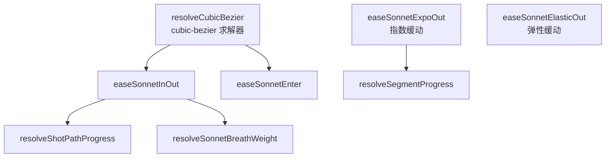
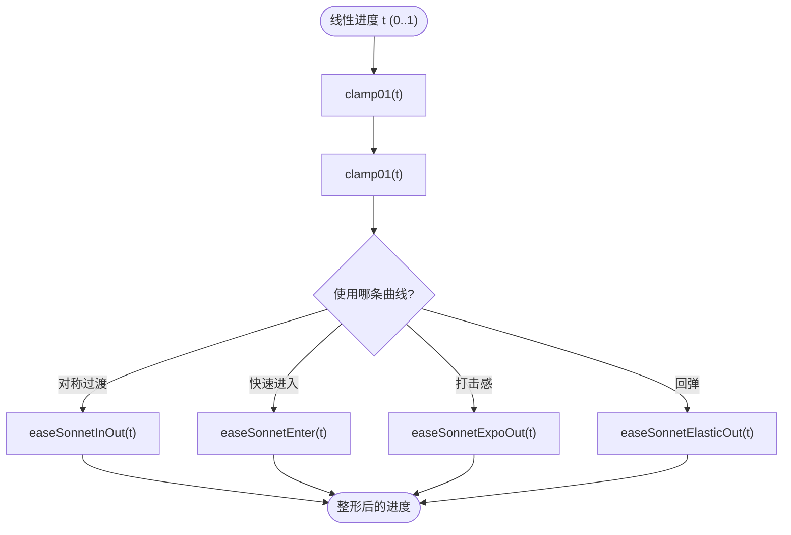
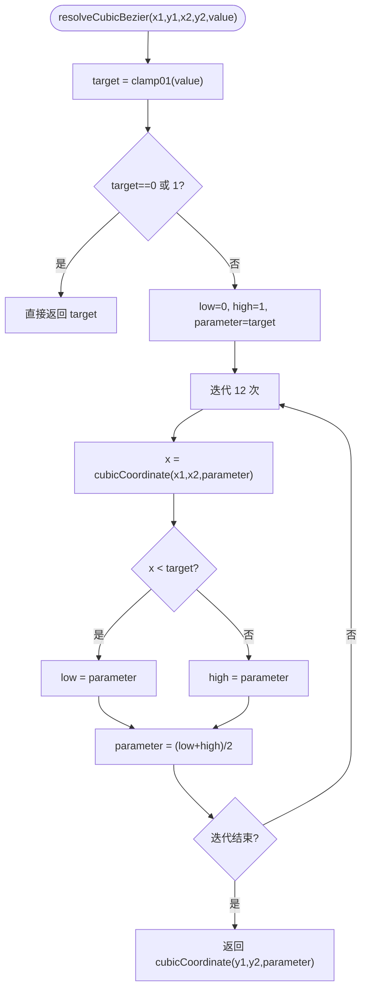
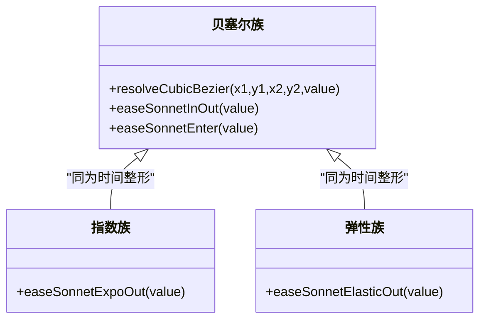
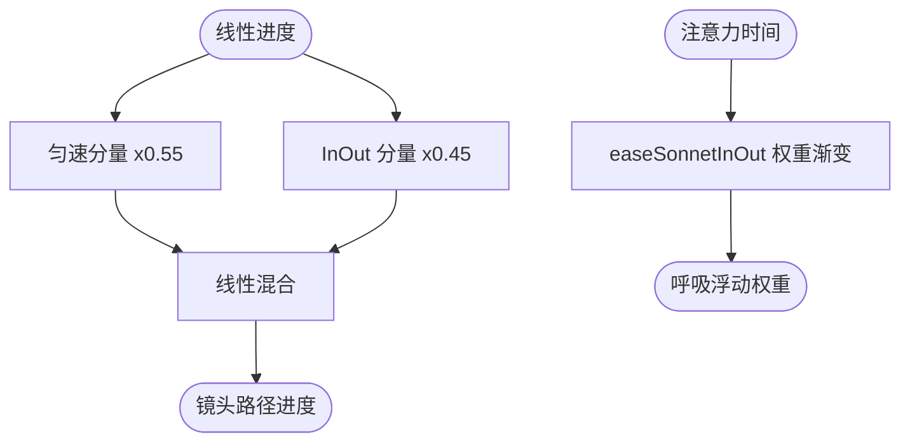

# 缓动曲线系统

<cite>
**本文引用的文件**   
- [sonnetMotion.ts](file://src/components/visualizer/sonnet/sonnetMotion.ts)
- [sonnetMotion.test.ts](file://test/unit/visualizer/sonnetMotion.test.ts)
- [sonnetPostProcess.test.ts](file://test/unit/visualizer/sonnetPostProcess.test.ts)
- [types.ts](file://src/components/visualizer/sonnet/types.ts)
</cite>

## 目录
1. [引言](#引言)
2. [项目结构](#项目结构)
3. [核心组件](#核心组件)
4. [架构总览](#架构总览)
5. [详细组件分析](#详细组件分析)
6. [依赖关系分析](#依赖关系分析)
7. [性能考量](#性能考量)
8. [故障排查指南](#故障排查指南)
9. [结论](#结论)

## 引言
本文聚焦 Sonnet 模式的缓动曲线系统，围绕以下目标展开：
- 解释 CSS 风格 cubic-bezier 的解析实现：先求解 x 曲线上的参数，再采样 y 曲线。
- 说明自定义缓动函数的设计原理：`easeSonnetInOut`、`easeSonnetEnter`、`easeSonnetExpoOut`、`easeSonnetElasticOut`。
- 阐述指数与弹性缓动的视觉目标：打击感入场与物理模拟回弹。
- 解释曲线在系统各处的组合方式：镜头路径、段落进度、呼吸权重。
- 给出性能优化与调试方法。

缓动曲线是 Sonnet 全部动画的“调味料”：同一个线性进度经由不同曲线整形，就能产生从沉稳到高张力的不同气质。

## 项目结构
缓动函数全部集中在 sonnetMotion.ts 中，并由三类调用方消费：
- 段落进度：`resolveSegmentProgress` 使用 ExpoOut 制造单字“打击感”入场。
- 镜头路径：`resolveShotPathProgress` 混合匀速漂移与 InOut 曲线。
- 权重渐变：`resolveSonnetBreathWeight` 使用 InOut 让呼吸浮动渐入。
- 过渡系统：transition 帧计算复用相同的时间整形思想。

**图示来源**
- [sonnetMotion.ts:13-56](file://src/components/visualizer/sonnet/sonnetMotion.ts#L13-L56)
- [sonnetMotion.ts:62-65](file://src/components/visualizer/sonnet/sonnetMotion.ts#L62-L65)

**章节来源**
- [sonnetMotion.ts:9-56](file://src/components/visualizer/sonnet/sonnetMotion.ts#L9-L56)

## 核心组件
- `cubicCoordinate`：三次贝塞尔单轴坐标函数，输入两个控制点与参数 t。
- `resolveCubicBezier(x1, y1, x2, y2, value)`：以 12 次二分迭代求解“x 轴到达目标值”的参数 t，再返回 y 坐标。
- `easeSonnetInOut`：`cubic-bezier(0.65, 0, 0.35, 1)` 的对称高张力曲线。
- `easeSonnetEnter`：`cubic-bezier(0.22, 1, 0.36, 1)` 的快速进入曲线（末端长尾收束）。
- `easeSonnetExpoOut`：`1 - 2^(-10t)` 的指数衰减曲线，t=1 时精确归 1。
- `easeSonnetElasticOut`：带阻尼的正弦回弹，周期参数 p = 0.3。

**章节来源**
- [sonnetMotion.ts:13-56](file://src/components/visualizer/sonnet/sonnetMotion.ts#L13-L56)

## 架构总览
缓动系统的调用链是一个统一模式：“线性进度 → 曲线整形 → 物理量”。曲线不携带状态，可在任意时间点独立求值，因此它天然满足时间线系统的确定性要求。

**图示来源**
- [sonnetMotion.ts:11-56](file://src/components/visualizer/sonnet/sonnetMotion.ts#L11-L56)
- [sonnetMotion.ts:58-65](file://src/components/visualizer/sonnet/sonnetMotion.ts#L58-L65)

**章节来源**
- [sonnetMotion.ts:20-56](file://src/components/visualizer/sonnet/sonnetMotion.ts#L20-L56)

## 详细组件分析

### cubic-bezier 解析器
CSS 的 cubic-bezier 曲线定义在参数域上，而动画系统需要的是“给定 x 求 y”。实现采用教科书式做法：先在 x 轴上二分搜索参数 t（12 次迭代即可满足显示精度），再用同一参数求 y 值。边界处直接短路返回 0 或 1，避免迭代误差。

**图示来源**
- [sonnetMotion.ts:13-40](file://src/components/visualizer/sonnet/sonnetMotion.ts#L13-L40)

**章节来源**
- [sonnetMotion.ts:20-40](file://src/components/visualizer/sonnet/sonnetMotion.ts#L20-L40)

### 自定义缓动函数的设计目标
- `easeSonnetInOut(0.65, 0, 0.35, 1)`：起手与收尾都较慢、中段加速明显，用于场景整体的对称过渡。
- `easeSonnetEnter(0.22, 1, 0.36, 1)`：前 22% 处 y 已到 1，实质是“进场极快、末尾长尾”的曲线，用于需要“瞬间到位再轻微过冲”的元素。
- `easeSonnetExpoOut`：以 `2^(-10t)` 快速逼近 1，最后 10% 的位移几乎不可见；对单字入场而言，这读起来就是“啪”地一声到位。
- `easeSonnetElasticOut`：阻尼正弦，`p=0.3` 控制回弹周期；数值上以指数衰减包络压制正弦，保证收敛。

**图示来源**
- [sonnetMotion.ts:42-56](file://src/components/visualizer/sonnet/sonnetMotion.ts#L42-L56)

**章节来源**
- [sonnetMotion.ts:42-56](file://src/components/visualizer/sonnet/sonnetMotion.ts#L42-L56)

### 曲线组合与混合机制
Sonnet 不满足于“单曲线”，而是把曲线当作可混合的算子：
- 常速与 InOut 混合：`linear * 0.55 + easeSonnetInOut(linear) * 0.45`，让中段漂移永不停滞（镜头路径专用）。
- 分段曲线：镜头路径进度由 ExpoOut 入场段、线性中段、二次收尾段拼接而成，取代单一曲线。
- 缓入权重：呼吸浮动的权重用 InOut 从 0 渐变到 1（`easeSonnetInOut(clamp01(...))`），保证不突然弹出。
- 相位错开：入场的字形运动时长由 `resolveSonnetGlyphMotionDuration` 结合镜头时长决定，同一曲线在不同字形上产生“先后落位”的观感。

**图示来源**
- [sonnetMotion.ts:179-190](file://src/components/visualizer/sonnet/sonnetMotion.ts#L179-L190)
- [sonnetMotion.ts:264-268](file://src/components/visualizer/sonnet/sonnetMotion.ts#L264-L268)

**章节来源**
- [sonnetMotion.ts:179-190](file://src/components/visualizer/sonnet/sonnetMotion.ts#L179-L190)

### 调试可视化与验证
- 单元测试：`sonnetAnimations.test.ts` 与 `sonnetPostProcess.test.ts` 覆盖动画数值边界，是修改曲线后的第一道回归防线。
- 呼吸/震颤上限常量可直接与曲线输出对照，验证“曲线 × 上限”的最终幅度。
- 由于所有曲线都是纯函数，可用任意 `time` 采样绘制曲线形状做可视化比对。

**章节来源**
- [sonnetMotion.ts:246-282](file://src/components/visualizer/sonnet/sonnetMotion.ts#L246-L282)

## 依赖关系分析
- 缓动函数无外部依赖，仅使用 Math 内建函数，属于系统中最底层的纯工具。
- `resolveSonnetAnimationScale` 由主题动画强度决定全局倍率（calm 0.65 / chaotic 1.35），曲线输出乘上该倍率后进入具体运动计算。
- 曲线被 sonnetMotion.ts 内的镜头路径、段落进度、呼吸权重三处消费，并被过渡模块间接复用。

**图示来源**
- [sonnetMotion.ts:45-56](file://src/components/visualizer/sonnet/sonnetMotion.ts#L45-L56)

**章节来源**
- [sonnetMotion.ts:45-56](file://src/components/visualizer/sonnet/sonnetMotion.ts#L45-L56)

## 性能考量
- 12 次二分迭代是精度与成本的折中：每次迭代只有两次多项式计算，单帧内即使上千个字形逐字求值也远远低于一帧预算。
- ExpoOut 与 ElasticOut 是闭式表达式，无迭代成本，适合高频调用（每个字形每次更新都会用到段落进度）。
- 无分配设计：所有函数直接返回 number，不产生临时对象。
- 若未来引入预计算表，应保持函数签名不变，仅替换内部实现。

**章节来源**
- [sonnetMotion.ts:33-39](file://src/components/visualizer/sonnet/sonnetMotion.ts#L33-L39)

## 故障排查指南
- 入场“先慢后快”不符合预期：检查是否误把 `easeSonnetEnter` 与 `easeSonnetInOut` 混用；Enter 曲线的前段极快。
- 动画在中段“停顿”：ribbon/collage 类镜头必须使用匀速混合分支，纯 InOut 会在中段减速到视觉停滞。
- ExpoOut 在 t=0 时返回 0、t=1 时返回 1；若观察到 t=1 仍有残值，检查调用方是否二次变换了结果。
- 弹性曲线产生负值：ElasticOut 早期可能低于 0（回拉），属于预期物理表现；若不想要负值需在调用侧钳制。
- 曲线输出被主题倍率残害：确认 `resolveSonnetAnimationScale` 的结果符合预期（calm 模式为 0.65 倍）。

**章节来源**
- [sonnetMotion.ts:50-56](file://src/components/visualizer/sonnet/sonnetMotion.ts#L50-L56)
- [sonnetMotion.ts:45-47](file://src/components/visualizer/sonnet/sonnetMotion.ts#L45-L47)

## 结论
Sonnet 缓动曲线系统以小而完整的函数族支撑起整套 PV 动画语言：`resolveCubicBezier` 提供与 CSS 一致的可调曲线能力，ExpoOut/ElasticOut 提供高频使用的专业手感，曲线混合与分段整形则让镜头路径兼具“快入场、稳中段、柔收尾”的节奏。全部实现无状态、零分配、可单测，是时间线确定性重要的组成部分。
