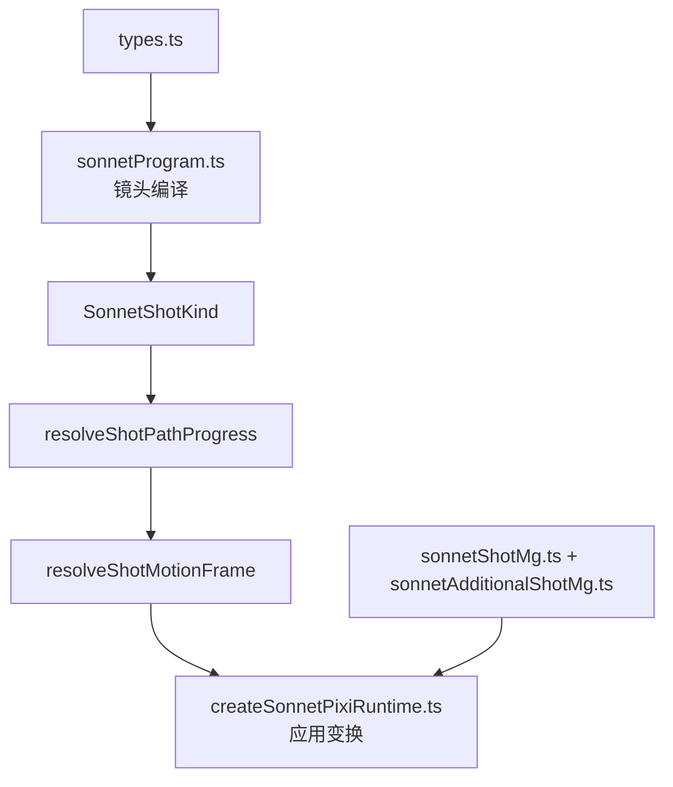
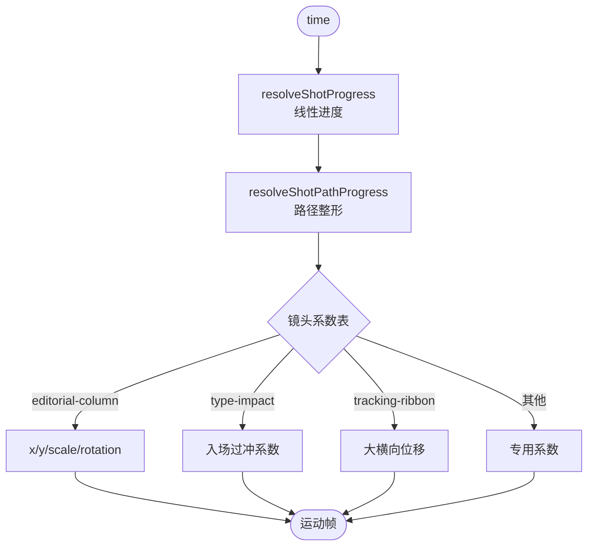
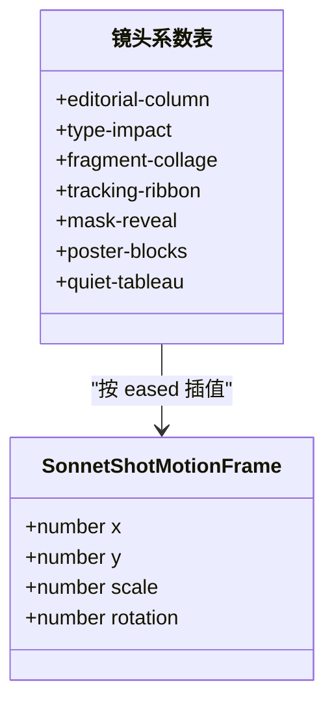
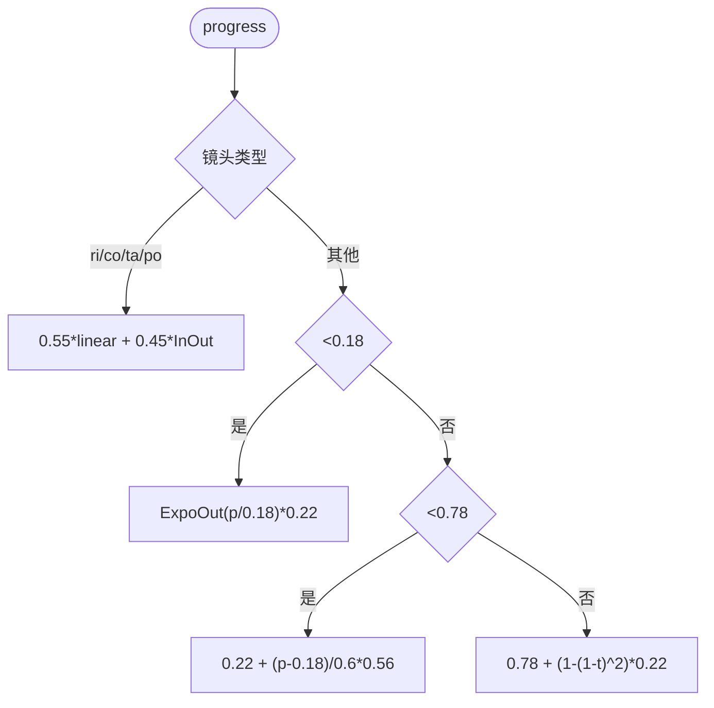
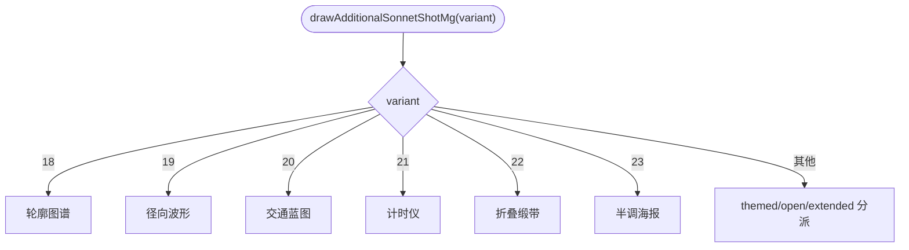
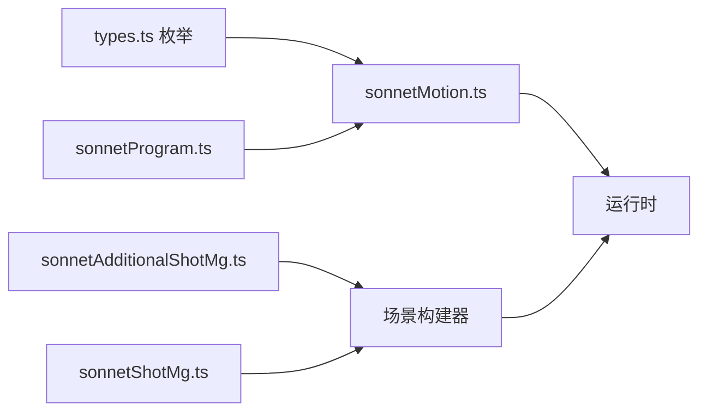

# 镜头运动系统

<cite>
**本文引用的文件**   
- [sonnetMotion.ts](file://src/components/visualizer/sonnet/sonnetMotion.ts)
- [sonnetAdditionalShotMg.ts](file://src/components/visualizer/sonnet/sonnetAdditionalShotMg.ts)
- [sonnetShotMg.ts](file://src/components/visualizer/sonnet/sonnetShotMg.ts)
- [sonnetProgram.ts](file://src/components/visualizer/sonnet/sonnetProgram.ts)
- [createSonnetPixiRuntime.ts](file://src/components/visualizer/sonnet/createSonnetPixiRuntime.ts)
- [types.ts](file://src/components/visualizer/sonnet/types.ts)
</cite>

## 目录
1. [引言](#引言)
2. [项目结构](#项目结构)
3. [核心组件](#核心组件)
4. [架构总览](#架构总览)
5. [详细组件分析](#详细组件分析)
6. [依赖关系分析](#依赖关系分析)
7. [性能考量](#性能考量)
8. [故障排查指南](#故障排查指南)
9. [结论](#结论)

## 引言
本文聚焦 Sonnet 模式的镜头运动系统，围绕以下目标展开：
- 解释七种镜头类型（editorial-column、type-impact、fragment-collage、tracking-ribbon、mask-reveal、poster-blocks、quiet-tableau）的运动参数设计。
- 说明运动框架生成：位置、缩放、旋转的复合变换与时序控制。
- 阐述镜头路径进度计算：分段函数设计、速度曲线混合与边界条件。
- 解释额外素材动画（运镜 MG 图形）的变体注册与调度机制。
- 提供镜头运动调试与自定义镜头开发的指南。

镜头运动系统让每一个镜头都拥有“可复现的镜头语言”：同一种构图在两台机器、两次播放中走出完全一致的轨迹。

## 项目结构
- sonnetMotion.ts：`resolveShotPathProgress` 与 `resolveShotMotionFrame` 就是镜头运动的核心；每种镜头在 `frames` 表中对应一组 x/y/scale/rotation 系数。
- sonnetAdditionalShotMg.ts：镜头配套的 6 个“附加 MG”变体（轮廓图谱、径向波形、交通蓝图、计时仪、折叠缎带、半调海报）。
- sonnetShotMg.ts：主 MG 图形库（镜头装饰图形的主体）。
- sonnetProgram.ts：编译阶段决定每个镜头的 kind、时间范围与相机基准，是运动系统的输入。
- createSonnetPixiRuntime.ts：逐帧调用运动求解并把结果应用到场景容器。

**图示来源**
- [sonnetProgram.ts:93-191](file://src/components/visualizer/sonnet/sonnetProgram.ts#L93-L191)
- [sonnetMotion.ts:179-244](file://src/components/visualizer/sonnet/sonnetMotion.ts#L179-L244)
- [sonnetAdditionalShotMg.ts:203-229](file://src/components/visualizer/sonnet/sonnetAdditionalShotMg.ts#L203-L229)

**章节来源**
- [types.ts:8-62](file://src/components/visualizer/sonnet/types.ts#L8-L62)

## 核心组件
- 运动帧结构 `SonnetShotMotionFrame`：`x/y`（相对屏宽的位移）、`scale`（缩放）、`rotation`（弧度）。
- 路径进度 `resolveShotPathProgress`：把线性进度整形为带节奏的路径进度。
- 运动帧表：每镜头一组固定系数，线性插值在 `eased` 进度上完成。
- 附加 MG 调度器 `drawAdditionalSonnetShotMg`：variant 18-23 的新增图形，其余分派给 themed/open/extended 变体。

**章节来源**
- [sonnetMotion.ts:94-99](file://src/components/visualizer/sonnet/sonnetMotion.ts#L94-L99)
- [sonnetMotion.ts:179-244](file://src/components/visualizer/sonnet/sonnetMotion.ts#L179-L244)
- [sonnetAdditionalShotMg.ts:8-9](file://src/components/visualizer/sonnet/sonnetAdditionalShotMg.ts#L8-L9)

## 架构总览
镜头运动的求值分为两层：先由 `resolveShotPathProgress` 把时间进度整形为“路径进度”，再由 `resolveShotMotionFrame` 在镜头专属的系数表上求值。运行时把结果与呼吸浮动、震颤、焦点平滑叠加后写入场景容器。镜头种类只影响系数，不影响求解流程，新增镜头即是新增一行系数。

**图示来源**
- [sonnetMotion.ts:58-65](file://src/components/visualizer/sonnet/sonnetMotion.ts#L58-L65)
- [sonnetMotion.ts:193-244](file://src/components/visualizer/sonnet/sonnetMotion.ts#L193-L244)

**章节来源**
- [sonnetMotion.ts:179-244](file://src/components/visualizer/sonnet/sonnetMotion.ts#L179-L244)

## 详细组件分析

### 七种镜头的运动参数设计
每种镜头的系数围绕“构图身份”设计：
- editorial-column：轻微左移涌入的杂志式推移（x: -0.055 → +0.04，scale: 0.98 → 1.05）。
- type-impact：入场带有 0.22 的额外过冲缩放（通过未完成的 ExpoOut 反推），营造“砸屏”的冲击。
- fragment-collage：y 轴带一个 `sin(eased·π)` 的升降弧线，模拟碎片散布的呼吸感。
- tracking-ribbon：横向位移最大（-0.16 → +0.12），是唯一的“长距离横移”镜头。
- mask-reveal：从下方上浮（y: 0.1 → -0.035）并放大（0.96 → 1.08），配合遮罩揭示。
- poster-blocks：位移与缩放最克制（x 幅度约 0.024），让海报式构图保持稳定。
- quiet-tableau：静态感最强，仅有轻微的推进与放大（scale: 1 → 1.028）。

**图示来源**
- [sonnetMotion.ts:199-242](file://src/components/visualizer/sonnet/sonnetMotion.ts#L199-L242)

**章节来源**
- [sonnetMotion.ts:193-244](file://src/components/visualizer/sonnet/sonnetMotion.ts#L193-L244)

### 镜头路径进度：分段函数与匀速混合
路径进度是镜头运动的“时间仪表盘”，它保证：
- 入场迅速：前 18% 时间完成 22% 路径，视觉上“马上开始动”。
- 中段不停：18%-78% 区间近似匀速推进，避免长镜头中段失速。
- 收尾柔化：最后 22% 用二次曲线把速度降到 0，画面稳定地交给下一镜头。
- 漂移型镜头特例：ribbon/collage/tableau/poster 直接混合常速与 InOut，中段速度恒不为零。

**图示来源**
- [sonnetMotion.ts:179-190](file://src/components/visualizer/sonnet/sonnetMotion.ts#L179-L190)

**章节来源**
- [sonnetMotion.ts:179-190](file://src/components/visualizer/sonnet/sonnetMotion.ts#L179-L190)

### 附加素材动画：MG 图形变体
`sonnetAdditionalShotMg.ts` 注册了 6 个附加 MG 变体（variant 18-23），全部为确定性绘制：
- 18 轮廓图谱 `drawContourAtlas`：8 层带涟漪的同心闭合轮廓。
- 19 径向波形 `drawRadialWave`：64 根放射条按正弦信号伸缩。
- 20 交通蓝图 `drawTransitBlueprint`：折线路线图带站点圆点，方向由种子决定。
- 21 计时仪 `drawChronograph`：三环 + 48 刻度 + 种子决定的指针角度。
- 22 折叠缎带 `drawFoldedRibbons`：5 层贝塞尔缎带，层间相位交错。
- 23 半调海报 `drawHalftonePoster`：网格化圆点随距离与脉冲变化大小。
调度器把未命中的变体交给 themed/open/extended 三个既有库，既不破坏旧变体又保持顺序稳定。

**图示来源**
- [sonnetAdditionalShotMg.ts:203-229](file://src/components/visualizer/sonnet/sonnetAdditionalShotMg.ts#L203-L229)

**章节来源**
- [sonnetAdditionalShotMg.ts:8-9](file://src/components/visualizer/sonnet/sonnetAdditionalShotMg.ts#L8-L9)

### 镜头时序控制与调试
- 时序：镜头的 `startTime/endTime` 由节目编译决定，运动帧只接受 [0,1] 进度，因此时序调整永远不会让运动越界。
- 调试：`createSonnetShotDebugInfo` 输出的快照包含 `shotKind`、相机参数与 `geoVariantLabel`，可在调试叠加层直接观察当前镜头与 MG 变体。
- 测试：`sonnetProgram.test.ts` 验证镜头编译的确定性；`cameraPath.test.ts` 覆盖路径相关行为。

**章节来源**
- [sonnetDebug.ts:84-104](file://src/components/visualizer/sonnet/sonnetDebug.ts#L84-L104)

## 依赖关系分析
- 镜头运动帧依赖 `resolveShotPathProgress`；后者只依赖缓动函数（InOut/ExpoOut）。
- 镜头种类由 types.ts 枚举约束；`SONNET_SHOT_KINDS`（sonnetProgram.ts）是编译期唯一注册点。
- MG 变体与运动帧互相独立：图形只画一次（构建期），运动逐帧（运行期），互不阻塞。

**图示来源**
- [sonnetProgram.ts:26-34](file://src/components/visualizer/sonnet/sonnetProgram.ts#L26-L34)
- [sonnetMotion.ts:1-11](file://src/components/visualizer/sonnet/sonnetMotion.ts#L1-L11)

**章节来源**
- [sonnetProgram.ts:26-34](file://src/components/visualizer/sonnet/sonnetProgram.ts#L26-L34)

## 性能考量
- 系数表为模块内常量，无逐帧分配；求解为纯算术。
- 每镜头只有一次 `eased` 计算，所有通道共享，避免重复曲线求值。
- MG 图形构建期一次性绘制，运行期仅变换，不产生每帧路径重建。
- 镜头数量与段落分离：非活跃镜头卸载显示树，运动系统仅在活跃镜头实例上求值。

**章节来源**
- [createSonnetPixiRuntime.ts:395-454](file://src/components/visualizer/sonnet/createSonnetPixiRuntime.ts#L395-L454)

## 故障排查指南
- 镜头中段失速：确认镜头类型是否应走匀速混合分支；若新镜头出现中段停滞，优先检查路径进度而非系数表。
- 镜头运动幅度过大/过小：所有系数均为相对屏宽的比值，缩放异常时检查是否误改 `scale` 基准 1.0。
- 不同镜头切换有“跳”感：路径收尾段把速度压到 0，若仍有跳变应检查过渡帧（fast-blur/mono-glitch）是否启用。
- 新 MG 变体不出图：确认 variant 号是否与既有范围冲突；附加库只认 18-23，其余走分派。
- 调试标签与实际不符：`resolveSonnetGeoVariantLabel` 依赖各变体库的注册顺序，新增变体后同步更新注册表。

**章节来源**
- [sonnetMotion.ts:179-190](file://src/components/visualizer/sonnet/sonnetMotion.ts#L179-L190)
- [sonnetAdditionalShotMg.ts:203-229](file://src/components/visualizer/sonnet/sonnetAdditionalShotMg.ts#L203-L229)

## 结论
Sonnet 镜头运动系统把“镜头语言”抽象为一张可插拔的系数表加一条统一的时间整形管线：新增镜头只需定义系数与路径特性，就能自动获得确定性、可调试、可混合的运动输出。配合附加 MG 图形库与调试快照，镜头运动系统的扩展成本被压到最低，同时保持了 PV 级别的画面控制力。
