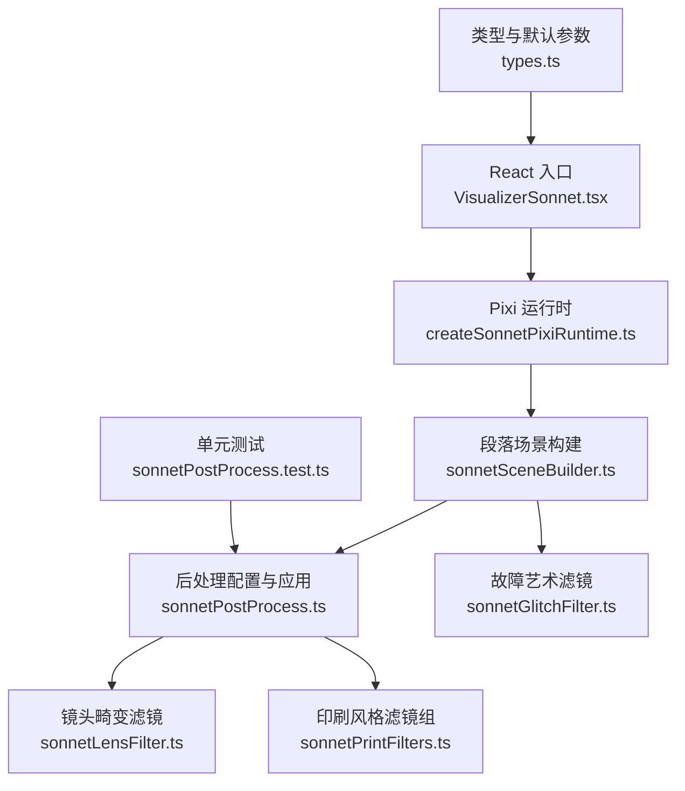
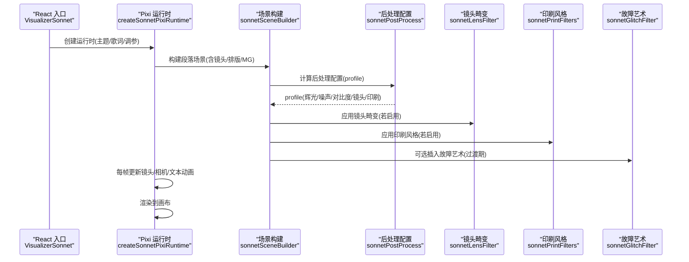
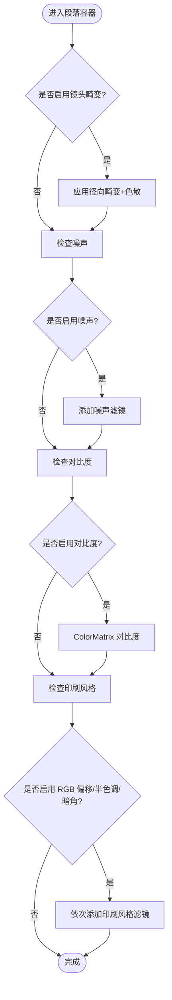
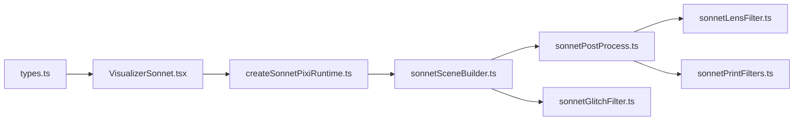

# 后期处理系统

<cite>
**本文引用的文件**   
- [src/components/visualizer/sonnet/VisualizerSonnet.tsx](file://src/components/visualizer/sonnet/VisualizerSonnet.tsx)
- [src/components/visualizer/sonnet/createSonnetPixiRuntime.ts](file://src/components/visualizer/sonnet/createSonnetPixiRuntime.ts)
- [src/components/visualizer/sonnet/sonnetSceneBuilder.ts](file://src/components/visualizer/sonnet/sonnetSceneBuilder.ts)
- [src/components/visualizer/sonnet/sonnetPostProcess.ts](file://src/components/visualizer/sonnet/sonnetPostProcess.ts)
- [src/components/visualizer/sonnet/sonnetLensFilter.ts](file://src/components/visualizer/sonnet/sonnetLensFilter.ts)
- [src/components/visualizer/sonnet/sonnetPrintFilters.ts](file://src/components/visualizer/sonnet/sonnetPrintFilters.ts)
- [src/components/visualizer/sonnet/sonnetGlitchFilter.ts](file://src/components/visualizer/sonnet/sonnetGlitchFilter.ts)
- [src/types.ts](file://src/types.ts)
- [test/unit/visualizer/sonnetPostProcess.test.ts](file://test/unit/visualizer/sonnetPostProcess.test.ts)
</cite>

## 目录
1. [简介](#简介)
2. [项目结构](#项目结构)
3. [核心组件](#核心组件)
4. [架构总览](#架构总览)
5. [详细组件分析](#详细组件分析)
6. [依赖关系分析](#依赖关系分析)
7. [性能考量](#性能考量)
8. [故障排查指南](#故障排查指南)
9. [结论](#结论)
10. [附录：自定义滤镜开发指南](#附录自定义滤镜开发指南)

## 简介
本文件为 Sonnet 模式的后期处理系统提供完整技术文档。内容覆盖渲染管线架构、着色器链管理与渲染目标切换；滤镜系统（内置实现、参数调节与组合效果）；特效算法（故障艺术、镜头畸变与色彩校正）；性能优化策略（GPU 加速、纹理压缩与批处理渲染）；实时调整机制（参数插值、状态同步与回滚）；以及自定义滤镜开发与测试方法，并给出常见视觉效果的实现示例与调优建议。

## 项目结构
Sonnet 的可视化与后期处理位于 `src/components/visualizer/sonnet` 下，围绕 React 入口、PixiJS 运行时、场景构建与后处理模块组织：

图表来源
- [src/components/visualizer/sonnet/VisualizerSonnet.tsx:1-232](file://src/components/visualizer/sonnet/VisualizerSonnet.tsx#L1-L232)
- [src/components/visualizer/sonnet/createSonnetPixiRuntime.ts:148-196](file://src/components/visualizer/sonnet/createSonnetPixiRuntime.ts#L148-L196)
- [src/components/visualizer/sonnet/sonnetSceneBuilder.ts:78-104](file://src/components/visualizer/sonnet/sonnetSceneBuilder.ts#L78-L104)
- [src/components/visualizer/sonnet/sonnetPostProcess.ts:31-67](file://src/components/visualizer/sonnet/sonnetPostProcess.ts#L31-L67)
- [src/components/visualizer/sonnet/sonnetLensFilter.ts:91-108](file://src/components/visualizer/sonnet/sonnetLensFilter.ts#L91-L108)
- [src/components/visualizer/sonnet/sonnetPrintFilters.ts:138-144](file://src/components/visualizer/sonnet/sonnetPrintFilters.ts#L138-L144)
- [src/components/visualizer/sonnet/sonnetGlitchFilter.ts:63-86](file://src/components/visualizer/sonnet/sonnetGlitchFilter.ts#L63-L86)
- [src/types.ts:528-579](file://src/types.ts#L528-L579)
- [test/unit/visualizer/sonnetPostProcess.test.ts:11-88](file://test/unit/visualizer/sonnetPostProcess.test.ts#L11-L88)

章节来源
- [src/components/visualizer/sonnet/VisualizerSonnet.tsx:1-232](file://src/components/visualizer/sonnet/VisualizerSonnet.tsx#L1-L232)
- [src/components/visualizer/sonnet/createSonnetPixiRuntime.ts:148-196](file://src/components/visualizer/sonnet/createSonnetPixiRuntime.ts#L148-L196)
- [src/components/visualizer/sonnet/sonnetSceneBuilder.ts:78-104](file://src/components/visualizer/sonnet/sonnetSceneBuilder.ts#L78-L104)
- [src/types.ts:528-579](file://src/types.ts#L528-L579)

## 核心组件
- React 入口 VisualizerSonnet：负责挂载 Pixi 运行时、传递主题与歌词数据、管理字幕叠加层与静态模式等。
- Pixi 运行时 createSonnetPixiRuntime：生命周期管理、视口与分辨率适配、段落缓存与切换、逐帧更新与过渡控制。
- 场景构建 sonnetSceneBuilder：按段落构建镜头、排版文字、装配 MG 装饰、应用后处理与过渡滤镜。
- 后处理配置 sonnetPostProcess：根据主题强度与用户调参生成后处理配置文件，创建辉光层与滤镜链。
- 镜头畸变滤镜 sonnetLensFilter：单通道径向畸变 + 屏幕空间色散。
- 印刷风格滤镜 sonnetPrintFilters：RGB 偏移、半色调网点、暗角。
- 故障艺术滤镜 sonnetGlitchFilter：水平切片撕裂与亮度闪烁，用于过渡。

章节来源
- [src/components/visualizer/sonnet/VisualizerSonnet.tsx:26-159](file://src/components/visualizer/sonnet/VisualizerSonnet.tsx#L26-L159)
- [src/components/visualizer/sonnet/createSonnetPixiRuntime.ts:108-196](file://src/components/visualizer/sonnet/createSonnetPixiRuntime.ts#L108-L196)
- [src/components/visualizer/sonnet/sonnetSceneBuilder.ts:78-104](file://src/components/visualizer/sonnet/sonnetSceneBuilder.ts#L78-L104)
- [src/components/visualizer/sonnet/sonnetPostProcess.ts:31-67](file://src/components/visualizer/sonnet/sonnetPostProcess.ts#L31-L67)
- [src/components/visualizer/sonnet/sonnetLensFilter.ts:91-108](file://src/components/visualizer/sonnet/sonnetLensFilter.ts#L91-L108)
- [src/components/visualizer/sonnet/sonnetPrintFilters.ts:138-144](file://src/components/visualizer/sonnet/sonnetPrintFilters.ts#L138-L144)
- [src/components/visualizer/sonnet/sonnetGlitchFilter.ts:63-86](file://src/components/visualizer/sonnet/sonnetGlitchFilter.ts#L63-L86)

## 架构总览
Sonnet 的渲染管线由“React 入口 → Pixi 运行时 → 段落场景 → 滤镜链”构成。运行时维护多个段落缓存，当前段落仅一个可见；每个段落包含若干镜头，运行时按时间推进激活对应镜头。后处理在段落容器上以 Pixi Filter 链形式注入，顺序为：镜头畸变 → 噪声 → 对比度 → 印刷风格（RGB 偏移/半色调/暗角），并在需要时插入过渡模糊与故障艺术滤镜。

图表来源
- [src/components/visualizer/sonnet/VisualizerSonnet.tsx:123-159](file://src/components/visualizer/sonnet/VisualizerSonnet.tsx#L123-L159)
- [src/components/visualizer/sonnet/createSonnetPixiRuntime.ts:413-427](file://src/components/visualizer/sonnet/createSonnetPixiRuntime.ts#L413-L427)
- [src/components/visualizer/sonnet/sonnetSceneBuilder.ts:97-104](file://src/components/visualizer/sonnet/sonnetSceneBuilder.ts#L97-L104)
- [src/components/visualizer/sonnet/sonnetPostProcess.ts:31-67](file://src/components/visualizer/sonnet/sonnetPostProcess.ts#L31-L67)
- [src/components/visualizer/sonnet/sonnetLensFilter.ts:91-108](file://src/components/visualizer/sonnet/sonnetLensFilter.ts#L91-L108)
- [src/components/visualizer/sonnet/sonnetPrintFilters.ts:138-144](file://src/components/visualizer/sonnet/sonnetPrintFilters.ts#L138-L144)
- [src/components/visualizer/sonnet/sonnetGlitchFilter.ts:63-86](file://src/components/visualizer/sonnet/sonnetGlitchFilter.ts#L63-L86)

## 详细组件分析

### 渲染管线与着色器链管理
- 辉光层：通过独立容器与 screen 混合模式叠加模糊副本，强度与透明度随主题动画强度缩放，上限受保护。
- 滤镜链顺序：镜头畸变优先，使后续灰度/网点/暗角跟随形变后的画面；噪声与对比度作为可选中间步骤；印刷风格最后，保证网点与暗角对最终调色生效。
- 渲染目标与 filterArea：全场景滤镜使用 viewport 大小的 filterArea，避免 lyric bounds 导致的采样坐标漂移。
- 过渡滤镜：模糊与故障艺术仅在启用过渡且非静态模式下加入，且 repeatEdgePixels/padding 被严格控制以避免暗角偏移。

图表来源
- [src/components/visualizer/sonnet/sonnetPostProcess.ts:90-136](file://src/components/visualizer/sonnet/sonnetPostProcess.ts#L90-L136)
- [src/components/visualizer/sonnet/sonnetSceneBuilder.ts:322-355](file://src/components/visualizer/sonnet/sonnetSceneBuilder.ts#L322-L355)

章节来源
- [src/components/visualizer/sonnet/sonnetPostProcess.ts:69-136](file://src/components/visualizer/sonnet/sonnetPostProcess.ts#L69-L136)
- [src/components/visualizer/sonnet/sonnetSceneBuilder.ts:322-355](file://src/components/visualizer/sonnet/sonnetSceneBuilder.ts#L322-L355)

### 滤镜系统与内置实现
- 镜头畸变滤镜：基于中心径向曲率与边缘色散，支持宽高比校正与透明像素保护，避免细线变绿边。
- 印刷风格滤镜组：
  - RGB 偏移：固定角度轴上的微小色差，保留中性核心防止白线塌陷。
  - 半色调网点：按 CMYK 角度进行点阵采样，保持暗部不引入纸色。
  - 暗角：屏幕空间计算，稳定于 viewport，避免 lyric bounds 引起的抖动。
- 噪声与对比度：分别使用 Pixi 内置噪声与 ColorMatrix，开启时需抗锯齿以保持细线质量。

章节来源
- [src/components/visualizer/sonnet/sonnetLensFilter.ts:7-108](file://src/components/visualizer/sonnet/sonnetLensFilter.ts#L7-L108)
- [src/components/visualizer/sonnet/sonnetPrintFilters.ts:9-144](file://src/components/visualizer/sonnet/sonnetPrintFilters.ts#L9-L144)
- [src/components/visualizer/sonnet/sonnetPostProcess.ts:106-123](file://src/components/visualizer/sonnet/sonnetPostProcess.ts#L106-L123)

### 特效算法
- 故障艺术（Glitch）：多尺度水平条带位移与亮度撕裂，使用哈希噪声驱动，强度与种子可动态更新；padding 设为 0 避免扩大共享渲染框导致暗角偏移。
- 镜头畸变（Lens Distortion）：二次/四次项组合的径向映射，配合边缘色散产生轻微色差。
- 色彩校正（Contrast）：ColorMatrix 加法对比度，需用户显式开启以避免细线走样。

章节来源
- [src/components/visualizer/sonnet/sonnetGlitchFilter.ts:7-86](file://src/components/visualizer/sonnet/sonnetGlitchFilter.ts#L7-L86)
- [src/components/visualizer/sonnet/sonnetLensFilter.ts:47-83](file://src/components/visualizer/sonnet/sonnetLensFilter.ts#L47-L83)
- [src/components/visualizer/sonnet/sonnetPostProcess.ts:116-123](file://src/components/visualizer/sonnet/sonnetPostProcess.ts#L116-L123)

### 参数调节与组合效果
- 后处理配置 resolveSonnetPostProcessProfile：
  - 静态模式：禁用所有动态滤镜（辉光、噪声、对比度、镜头、印刷）。
  - 动态模式：辉光强度与透明度随 typographyMotion 与主题强度缩放；噪声与对比度受 postProcessEnabled 控制；镜头畸变与色散受 postProcessEnabled 控制；印刷风格受 postProcessEnabled 控制，各子效果各自有 0..1 滑块。
- 默认参数 DEFAULT_SONNET_TUNING：提供合理的默认值，便于开箱即用。

章节来源
- [src/components/visualizer/sonnet/sonnetPostProcess.ts:31-67](file://src/components/visualizer/sonnet/sonnetPostProcess.ts#L31-L67)
- [src/types.ts:528-579](file://src/types.ts#L528-L579)
- [test/unit/visualizer/sonnetPostProcess.test.ts:11-88](file://test/unit/visualizer/sonnetPostProcess.test.ts#L11-L88)

### 渲染目标切换与段落/镜头调度
- 段落缓存：按段落索引缓存 SceneView，相邻段落预取，超出范围销毁，减少重复布局与 Text 创建。
- 镜头激活：每帧查找当前时间对应的镜头，严格单一激活，避免残留。
- 视口与分辨率：根据宿主尺寸与 textureResolution 对齐到纹理池档位，resize 时重建 credits/overlay 并清理 staged 场景。
- 歌曲切换：使用遮罩过渡与预构建 incoming scene，在遮罩覆盖时提交新场景，避免跳帧。

章节来源
- [src/components/visualizer/sonnet/createSonnetPixiRuntime.ts:198-222](file://src/components/visualizer/sonnet/createSonnetPixiRuntime.ts#L198-L222)
- [src/components/visualizer/sonnet/createSonnetPixiRuntime.ts:438-454](file://src/components/visualizer/sonnet/createSonnetPixiRuntime.ts#L438-L454)
- [src/components/visualizer/sonnet/createSonnetPixiRuntime.ts:715-800](file://src/components/visualizer/sonnet/createSonnetPixiRuntime.ts#L715-L800)

## 依赖关系分析
- VisualizerSonnet 依赖 createSonnetPixiRuntime 提供 WebGL 上下文与渲染循环。
- createSonnetPixiRuntime 依赖 sonnetSceneBuilder 构建段落与镜头视图，依赖 sonnetPostProcess 生成后处理配置，依赖 sonnetTransitions 与 sonnetMotion 控制时间与运动。
- sonnetSceneBuilder 依赖 sonnetPostProcess、sonnetGlitchFilter、sonnetTypographyLayout、sonnetTextViewBuilder 等。
- sonnetPostProcess 依赖 sonnetLensFilter 与 sonnetPrintFilters。
- types.ts 提供 SonnetTuning 与默认值，供 UI 与运行时共用。

图表来源
- [src/components/visualizer/sonnet/VisualizerSonnet.tsx:123-159](file://src/components/visualizer/sonnet/VisualizerSonnet.tsx#L123-L159)
- [src/components/visualizer/sonnet/createSonnetPixiRuntime.ts:413-427](file://src/components/visualizer/sonnet/createSonnetPixiRuntime.ts#L413-L427)
- [src/components/visualizer/sonnet/sonnetSceneBuilder.ts:78-104](file://src/components/visualizer/sonnet/sonnetSceneBuilder.ts#L78-L104)
- [src/components/visualizer/sonnet/sonnetPostProcess.ts:31-67](file://src/components/visualizer/sonnet/sonnetPostProcess.ts#L31-L67)
- [src/components/visualizer/sonnet/sonnetLensFilter.ts:91-108](file://src/components/visualizer/sonnet/sonnetLensFilter.ts#L91-L108)
- [src/components/visualizer/sonnet/sonnetPrintFilters.ts:138-144](file://src/components/visualizer/sonnet/sonnetPrintFilters.ts#L138-L144)
- [src/components/visualizer/sonnet/sonnetGlitchFilter.ts:63-86](file://src/components/visualizer/sonnet/sonnetGlitchFilter.ts#L63-L86)
- [src/types.ts:528-579](file://src/types.ts#L528-L579)

章节来源
- [src/components/visualizer/sonnet/VisualizerSonnet.tsx:123-159](file://src/components/visualizer/sonnet/VisualizerSonnet.tsx#L123-L159)
- [src/components/visualizer/sonnet/createSonnetPixiRuntime.ts:413-427](file://src/components/visualizer/sonnet/createSonnetPixiRuntime.ts#L413-L427)
- [src/components/visualizer/sonnet/sonnetSceneBuilder.ts:78-104](file://src/components/visualizer/sonnet/sonnetSceneBuilder.ts#L78-L104)
- [src/components/visualizer/sonnet/sonnetPostProcess.ts:31-67](file://src/components/visualizer/sonnet/sonnetPostProcess.ts#L31-L67)
- [src/types.ts:528-579](file://src/types.ts#L528-L579)

## 性能考量
- GPU 加速：全部滤镜基于 Pixi GlProgram，使用 uniform 组传递参数，避免 CPU 重算。
- 纹理压缩与分辨率：运行时将 canvas resolution 对齐到纹理池档位，降低 fill rate 压力；后处理可在低分辨率 pass 上运行（Tempera 已提供该开关，Sonnet 可通过 tuning 扩展）。
- 批处理渲染：ABR（Aberration）层合并以减少 draw call；避免频繁切换 blendMode；filterArea 统一为 viewport 大小，减少裁剪开销。
- 过渡与噪声：仅在必要时启用；静态模式关闭所有动态滤镜；模糊与故障艺术使用 repeatEdgePixels/padding=0 避免额外渲染区域。
- 内存与对象复用：段落缓存与相邻预取；图标纹理池化；destroy 时逐节点释放 GraphicsContext。

章节来源
- [src/components/visualizer/sonnet/createSonnetPixiRuntime.ts:148-164](file://src/components/visualizer/sonnet/createSonnetPixiRuntime.ts#L148-L164)
- [src/components/visualizer/sonnet/createSonnetPixiRuntime.ts:198-222](file://src/components/visualizer/sonnet/createSonnetPixiRuntime.ts#L198-L222)
- [src/components/visualizer/sonnet/sonnetSceneBuilder.ts:221-231](file://src/components/visualizer/sonnet/sonnetSceneBuilder.ts#L221-L231)
- [src/components/visualizer/sonnet/sonnetSceneBuilder.ts:322-355](file://src/components/visualizer/sonnet/sonnetSceneBuilder.ts#L322-L355)
- [src/components/visualizer/sonnet/sonnetGlitchFilter.ts:71-76](file://src/components/visualizer/sonnet/sonnetGlitchFilter.ts#L71-L76)

## 故障排查指南
- 暗角偏移或闪烁：检查故障艺术滤镜 padding 是否为 0，模糊滤镜是否设置 repeatEdgePixels；确认 filterArea 为 viewport 矩形。
- 细线出现绿色边缘：确保镜头畸变与 RGB 偏移均保留中性核心（coreWeight），避免透明通道采样污染。
- 文本锐利度下降：开启噪声或对比度后务必启用 antialias；避免过高的 contrast 值。
- 卡顿与掉帧：检查是否同时启用过多全屏滤镜；确认静态模式已关闭动态效果；评估 textureResolution 与纹理池档位。
- 切歌黑屏或残影：确认遮罩过渡期间 incoming scene 已预热，提交时机正确；销毁旧场景时释放 filters 与显示树。

章节来源
- [src/components/visualizer/sonnet/sonnetGlitchFilter.ts:71-76](file://src/components/visualizer/sonnet/sonnetGlitchFilter.ts#L71-L76)
- [src/components/visualizer/sonnet/sonnetLensFilter.ts:73-79](file://src/components/visualizer/sonnet/sonnetLensFilter.ts#L73-L79)
- [src/components/visualizer/sonnet/sonnetPrintFilters.ts:126-130](file://src/components/visualizer/sonnet/sonnetPrintFilters.ts#L126-L130)
- [src/components/visualizer/sonnet/sonnetSceneBuilder.ts:322-355](file://src/components/visualizer/sonnet/sonnetSceneBuilder.ts#L322-L355)
- [src/components/visualizer/sonnet/createSonnetPixiRuntime.ts:395-406](file://src/components/visualizer/sonnet/createSonnetPixiRuntime.ts#L395-L406)

## 结论
Sonnet 的后期处理系统以 PixiJS 滤镜链为核心，结合主题强度与用户调参，提供可控的镜头畸变、噪声、对比度与印刷风格效果。运行时通过段落缓存、镜头调度与遮罩过渡保障流畅体验，并通过纹理池、filterArea 与抗锯齿等手段优化性能。静态模式与按需启用策略进一步降低开销，适合实时音乐可视化场景。

## 附录：自定义滤镜开发指南

### GLSL 编写要点
- 顶点着色器：使用 uInputSize/uOutputFrame/uOutputTexture 将屏幕坐标转换到纹理 UV，保证跨分辨率一致。
- 片段着色器：使用 uInputClamp 做边界保护；对 premultiplied alpha 输出 finalColor；对薄线/透明区域采用 max(core, separated) 等策略避免颜色塌陷。
- Uniform 组：使用 pixi.UniformGroup 传递参数，避免频繁重建 Filter。

章节来源
- [src/components/visualizer/sonnet/sonnetLensFilter.ts:7-22](file://src/components/visualizer/sonnet/sonnetLensFilter.ts#L7-L22)
- [src/components/visualizer/sonnet/sonnetLensFilter.ts:24-83](file://src/components/visualizer/sonnet/sonnetLensFilter.ts#L24-L83)
- [src/components/visualizer/sonnet/sonnetPrintFilters.ts:9-24](file://src/components/visualizer/sonnet/sonnetPrintFilters.ts#L9-L24)
- [src/components/visualizer/sonnet/sonnetPrintFilters.ts:27-57](file://src/components/visualizer/sonnet/sonnetPrintFilters.ts#L27-L57)

### 接口规范
- 滤镜工厂函数：接收 pixi 模块与 amount 参数，返回 Filter 实例；如需动态更新，返回 { filter, update } 结构。
- 参数类型：定义 Amounts 接口（如 SonnetLensEffectAmounts/SonnetPrintEffectAmounts），约束 strength 范围。
- 集成方式：在 sonnetPostProcess 中按顺序组装滤镜，或在 sonnetSceneBuilder 中追加过渡滤镜。

章节来源
- [src/components/visualizer/sonnet/sonnetLensFilter.ts:86-108](file://src/components/visualizer/sonnet/sonnetLensFilter.ts#L86-L108)
- [src/components/visualizer/sonnet/sonnetPrintFilters.ts:118-144](file://src/components/visualizer/sonnet/sonnetPrintFilters.ts#L118-L144)
- [src/components/visualizer/sonnet/sonnetGlitchFilter.ts:58-86](file://src/components/visualizer/sonnet/sonnetGlitchFilter.ts#L58-L86)

### 测试方法
- 行为断言：验证静态模式禁用所有动态滤镜；验证 postProcessEnabled 打开后印刷风格生效；验证动画强度影响辉光但不超过上限。
- 回归用例：覆盖 glowStrength/glowAlpha/noise/contrast/lensDistortion/lensDispersion/printEffects 等字段。

章节来源
- [test/unit/visualizer/sonnetPostProcess.test.ts:11-88](file://test/unit/visualizer/sonnetPostProcess.test.ts#L11-L88)

### 常见视觉效果实现示例
- 胶片颗粒：使用 NoiseFilter，seed 基于场景随机数，antialias 开启。
- 高对比：使用 ColorMatrixFilter.contrast，注意 aliasing。
- 径向暗角：在屏幕空间计算 length(centered)，smoothstep 后与黑色混合。
- 半色调网点：按 CMYK 角度旋转坐标，计算距离阈值生成网点。
- 色差偏移：沿固定方向偏移 R/B 通道采样，保留中性核心。

章节来源
- [src/components/visualizer/sonnet/sonnetPostProcess.ts:106-123](file://src/components/visualizer/sonnet/sonnetPostProcess.ts#L106-L123)
- [src/components/visualizer/sonnet/sonnetPrintFilters.ts:59-91](file://src/components/visualizer/sonnet/sonnetPrintFilters.ts#L59-L91)
- [src/components/visualizer/sonnet/sonnetPrintFilters.ts:94-116](file://src/components/visualizer/sonnet/sonnetPrintFilters.ts#L94-L116)
- [src/components/visualizer/sonnet/sonnetPrintFilters.ts:27-57](file://src/components/visualizer/sonnet/sonnetPrintFilters.ts#L27-L57)