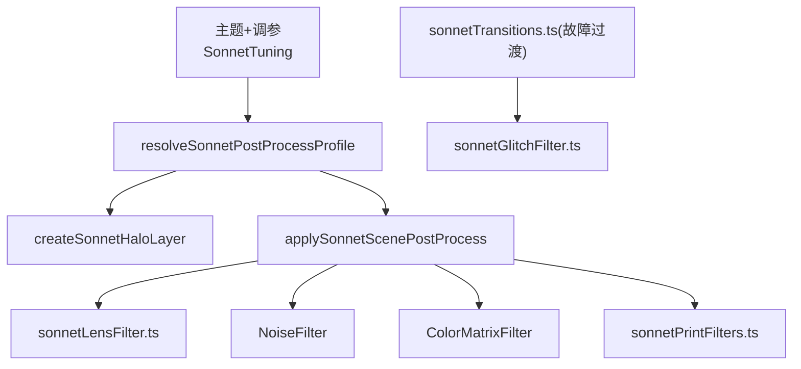
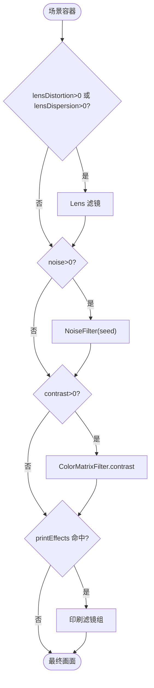
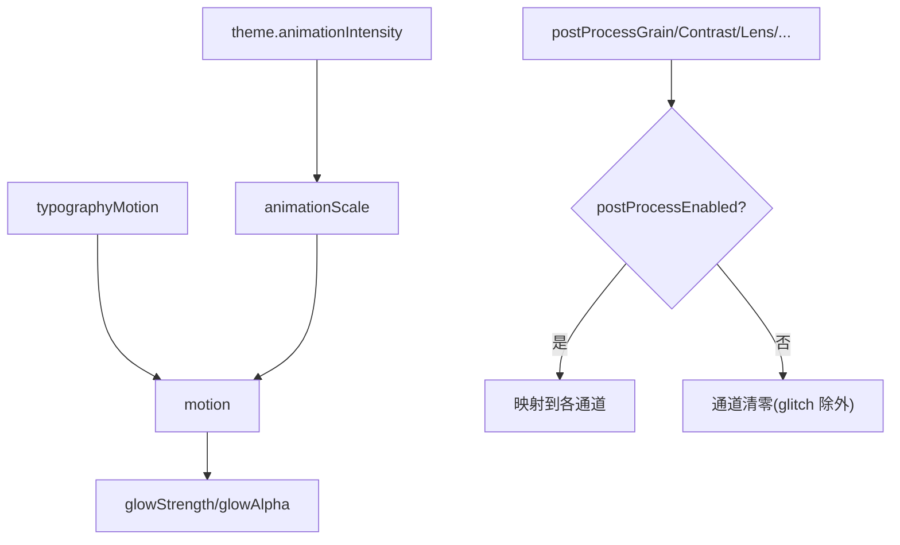
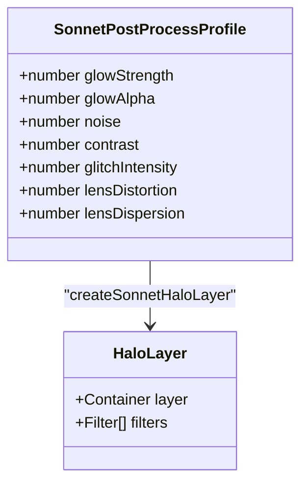
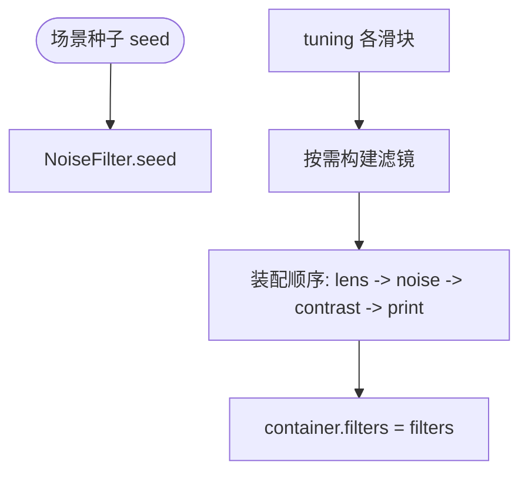
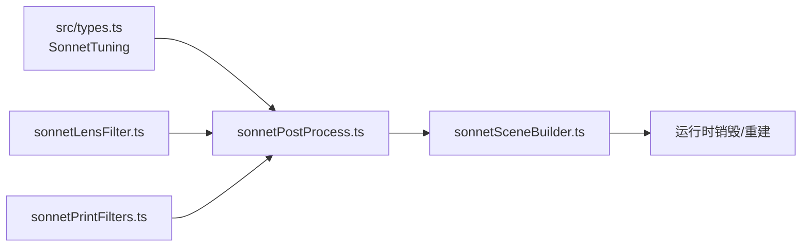

# 后处理效果系统

<cite>
**本文引用的文件**   
- [sonnetPostProcess.ts](file://src/components/visualizer/sonnet/sonnetPostProcess.ts)
- [sonnetLensFilter.ts](file://src/components/visualizer/sonnet/sonnetLensFilter.ts)
- [sonnetPrintFilters.ts](file://src/components/visualizer/sonnet/sonnetPrintFilters.ts)
- [sonnetGlitchFilter.ts](file://src/components/visualizer/sonnet/sonnetGlitchFilter.ts)
- [sonnetTransitions.ts](file://src/components/visualizer/sonnet/sonnetTransitions.ts)
- [sonnetSceneBuilder.ts](file://src/components/visualizer/sonnet/sonnetSceneBuilder.ts)
- [types.ts](file://src/types.ts)
</cite>

## 目录
1. [引言](#引言)
2. [项目结构](#项目结构)
3. [核心组件](#核心组件)
4. [架构总览](#架构总览)
5. [详细组件分析](#详细组件分析)
6. [依赖关系分析](#依赖关系分析)
7. [性能考量](#性能考量)
8. [故障排查指南](#故障排查指南)
9. [结论](#结论)

## 引言
本文聚焦 Sonnet 模式的后处理效果系统，围绕以下目标展开：
- 解释后处理管线的架构与滤镜顺序：镜头畸变 → 噪点 → 对比度 → 印刷风格。
- 说明光晕层（halo）的实现：模糊 + screen 混合的场景级辉光。
- 阐述场景级后处理与静态模式：`staticMode` 全关与调参开关的联动。
- 解释过渡效果（glitch 等）与后处理的关系。
- 给出效果调优、性能保障与调试方法。

后处理是 Sonnet 画面的“最终调色台”：它决定了画面是干净的现代感还是带有印刷/胶片质感的风格化表达。

## 项目结构
- sonnetPostProcess.ts：后处理总管，解析调参生成 `SonnetPostProcessProfile`，并组装滤镜链与光晕层。
- sonnetLensFilter.ts：镜头畸变与色散滤镜。
- sonnetPrintFilters.ts：印刷风格滤镜组（RGB 位移、半调、暗角等）。
- sonnetGlitchFilter.ts：过渡期使用的故障效果。
- sonnetSceneBuilder.ts：在场景构建时调用后处理装配。

**图示来源**
- [sonnetPostProcess.ts:31-67](file://src/components/visualizer/sonnet/sonnetPostProcess.ts#L31-L67)
- [sonnetPostProcess.ts:90-136](file://src/components/visualizer/sonnet/sonnetPostProcess.ts#L90-L136)

**章节来源**
- [sonnetPostProcess.ts:10-29](file://src/components/visualizer/sonnet/sonnetPostProcess.ts#L10-L29)

## 核心组件
- `SonnetPostProcessProfile`：八个数值通道（glow、noise、contrast、glitch、lens、print 组）。
- 静态模式短路：`staticMode === true` 时返回全零画像。
- 光晕层：BlurFilter（strength 2.8-4.6、quality 2、kernel 5、resolution 0.75）+ `screen` 混合 + alpha 上限 0.62。
- 调参映射：噪点 = `postProcessGrain * 0.35`（上限抑制）；对比度 = `postProcessContrast * 0.5`（Pixi 加成式语义）；印刷组各自独立 0-1 滑块。

**章节来源**
- [sonnetPostProcess.ts:14-67](file://src/components/visualizer/sonnet/sonnetPostProcess.ts#L14-L67)

## 架构总览
后处理分两个装配点：光晕层在构建期作为独立显示层创建（screen 混合），场景滤镜链在场景构建期挂载到容器上。滤镜顺序经过设计：镜头弯曲最先执行，让后续的噪点、对比度与印刷纹理都作用于已经弯过的画面；印刷组放最后，让半调网点与暗角“框住”调色后的场景。

**图示来源**
- [sonnetPostProcess.ts:90-136](file://src/components/visualizer/sonnet/sonnetPostProcess.ts#L90-L136)

**章节来源**
- [sonnetPostProcess.ts:90-136](file://src/components/visualizer/sonnet/sonnetPostProcess.ts#L90-L136)

## 详细组件分析

### 后处理画像解析
画像由主题与调参共同决定：
- `motion = typographyMotion * resolveSonnetAnimationScale(theme)`：动画强度倍率参与放大光晕。
- 光晕：strength `2.8 + motion*1.8`，alpha 上限 `min(0.62, 0.28 + motion*0.12)`。
- 噪点与对比度默认 0，因为对比度滤镜会让纤细的背景描边出现锯齿；用户显式调参才启用。
- `glitchIntensity` 恒为 1，仅在过渡期间被消费。

**图示来源**
- [sonnetPostProcess.ts:31-67](file://src/components/visualizer/sonnet/sonnetPostProcess.ts#L31-L67)

**章节来源**
- [sonnetPostProcess.ts:31-67](file://src/components/visualizer/sonnet/sonnetPostProcess.ts#L31-L67)

### 光晕层的实现
光晕实现非常克制：只在 `glowStrength > 0` 时创建一张独立层，挂 BlurFilter 后以 `screen` 混合叠加，整体 alpha 由画像控制。模糊使用 `resolution 0.75` 降低采样成本，`quality 2 / kernelSize 5` 在质量与开销间取平衡。滤镜对象被收集返回，供运行时的销毁流程释放。

**图示来源**
- [sonnetPostProcess.ts:69-88](file://src/components/visualizer/sonnet/sonnetPostProcess.ts#L69-L88)

**章节来源**
- [sonnetPostProcess.ts:69-88](file://src/components/visualizer/sonnet/sonnetPostProcess.ts#L69-L88)

### 场景级后处理与滤镜实现
- 镜头滤镜 `createSonnetLensFilter`：接收 `distortion/dispersion` 两组参数（`SonnetLensEffectAmounts`），同时驱动弯曲与色散。
- 噪点：`NoiseFilter` 使用确定性的 `seed`（`(seed % 10000) / 10000`）保证同镜头每次噪点图案一致；显式开启 `antialias: 'on'` 还原滤镜纹理缺失的 MSAA。
- 对比度：`ColorMatrixFilter.contrast(amount, false)`，Pixi 中 0 为中性、0.5 产生 1.5 倍矩阵；同样强制抗锯齿。
- 印刷组：`createSonnetPrintFilters` 返回滤镜数组（RGB 位移、半调、暗角等），只在对应滑块大于 0 时构建。

**图示来源**
- [sonnetPostProcess.ts:106-134](file://src/components/visualizer/sonnet/sonnetPostProcess.ts#L106-L134)
- [sonnetLensFilter.ts:86-109](file://src/components/visualizer/sonnet/sonnetLensFilter.ts#L86-L109)
- [sonnetPrintFilters.ts:132-145](file://src/components/visualizer/sonnet/sonnetPrintFilters.ts#L132-L145)

**章节来源**
- [sonnetPostProcess.ts:106-134](file://src/components/visualizer/sonnet/sonnetPostProcess.ts#L106-L134)

### 过渡效果与静态模式
- 过渡期故障：`sonnetTransitions.ts` 计算 `glitch` 与 `glitchSeed` 通道，由 `sonnetGlitchFilter` 的 `createSonnetGlitchEffect` 消费；单色故障（mono-glitch）是三个过渡类型之一。
- 静态模式：当运行时进入静态模式（例如仅显示静态画布的场景），画像整体归零——无光晕、无噪点、无滤镜链，保证静态画面的像素纯净。
- 过度效果与后处理解耦：过渡只提供 glitch 数值，后处理不关心过渡种类。

**章节来源**
- [sonnetPostProcess.ts:36-47](file://src/components/visualizer/sonnet/sonnetPostProcess.ts#L36-L47)
- [sonnetTransitions.ts:38-88](file://src/components/visualizer/sonnet/sonnetTransitions.ts#L38-L88)

## 依赖关系分析
- 后处理依赖调参契约 `SonnetTuning`（定义于 src/types.ts），新增滤镜通道需要同步扩展画像与调参项。
- 滤镜对象全部为 Pixi Filter，运行时销毁路径由场景销毁统一处理（`destroyScene`）。
- 光晕层与文本层、MG 层并列挂在场景容器下，混合模式在 Pixi 侧完成。

**图示来源**
- [sonnetPostProcess.ts:1-4](file://src/components/visualizer/sonnet/sonnetPostProcess.ts#L1-L4)

**章节来源**
- [sonnetPostProcess.ts:1-12](file://src/components/visualizer/sonnet/sonnetPostProcess.ts#L1-L12)

## 性能考量
- 全链路默认关闭：噪点、对比度、镜头、印刷组默认值为 0，仅光晕常开——保证默认画质与性能。
- 分辨率削减：光晕模糊 `resolution 0.75`，视觉损失极小但采样成本明显下降。
- 抗锯齿还原：滤镜纹理绕过画布 MSAA，噪点与对比度显式开启 `antialias: 'on'`，避免纤细笔画破碎。
- 滤镜数组返回：便于调用方记录并精确销毁，避免 GPU 资源泄漏。

**章节来源**
- [sonnetPostProcess.ts:75-86](file://src/components/visualizer/sonnet/sonnetPostProcess.ts#L75-L86)

## 故障排查指南
- 文字发糊：优先检查光晕强度与噪点；噪点上限为 slider 的 35%，若画面仍脏，检查是否叠了多个场景层。
- 背景笔画出现锯齿：对比度滤镜是已知诱因（实现中默认关闭），确保 `postProcessContrast` 为 0 或接受锯齿。
- 过渡期无故障效果：glitch 由过渡帧提供，检查当前过渡类型是否为 mono-glitch，并确认 seed 一致。
- 静态模式仍有噪点：检查 `staticMode` 传参路径，画像应在静态模式全零。
- 帧率下降：逐项排查印刷滤镜数量——每个滑块都对应一次全屏采样。

**章节来源**
- [sonnetPostProcess.ts:36-47](file://src/components/visualizer/sonnet/sonnetPostProcess.ts#L36-L47)
- [sonnetPostProcess.ts:116-123](file://src/components/visualizer/sonnet/sonnetPostProcess.ts#L116-L123)

## 结论
Sonnet 后处理效果系统以“画像 + 有序滤镜链 + 独立光晕层”的三件套实现了可控的场景调色：默认克制、逐项可选、顺序严谨。它把视觉风格实验成本降到最低——任何新效果只需扩展画像通道并插入到既定顺序中，就能在调参面板获得完整控制，同时不破坏基线画质。
