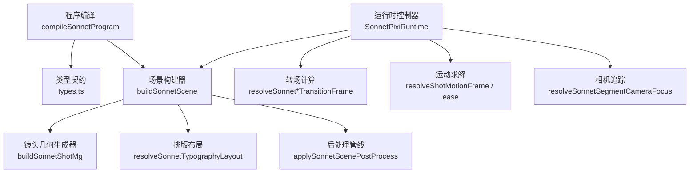
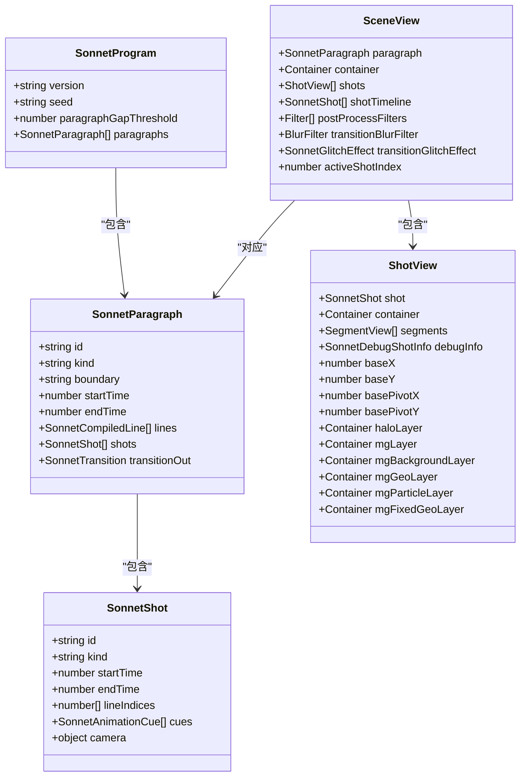
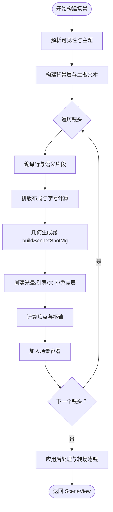
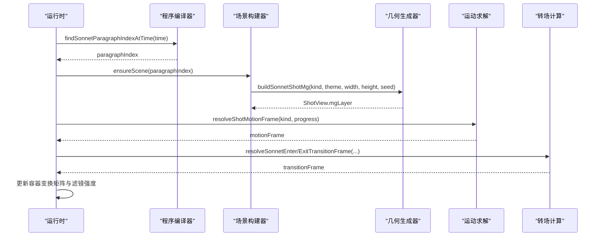
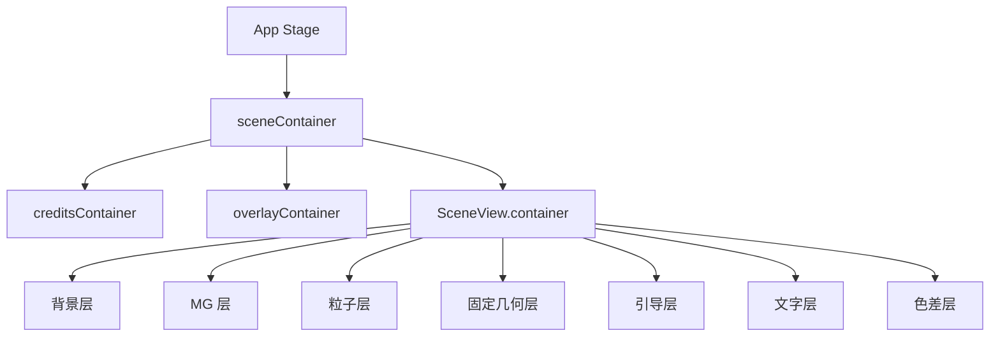
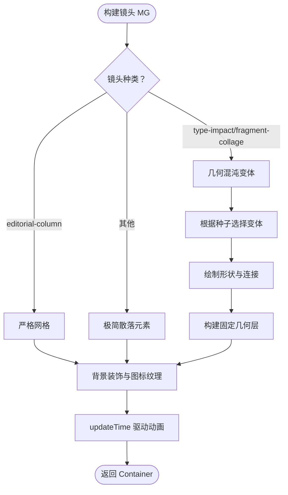
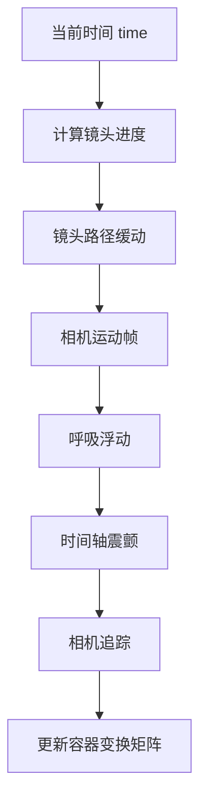
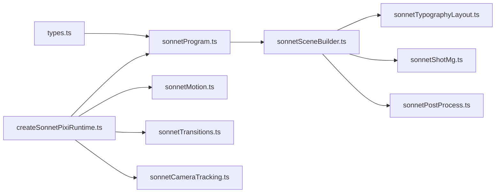

# 场景构建系统

<cite>
**本文引用的文件**   
- [src/components/visualizer/sonnet/createSonnetPixiRuntime.ts](file://src/components/visualizer/sonnet/createSonnetPixiRuntime.ts)
- [src/components/visualizer/sonnet/sonnetSceneBuilder.ts](file://src/components/visualizer/sonnet/sonnetSceneBuilder.ts)
- [src/components/visualizer/sonnet/sonnetTransitions.ts](file://src/components/visualizer/sonnet/sonnetTransitions.ts)
- [src/components/visualizer/sonnet/sonnetMotion.ts](file://src/components/visualizer/sonnet/sonnetMotion.ts)
- [src/components/visualizer/sonnet/types.ts](file://src/components/visualizer/sonnet/types.ts)
- [src/components/visualizer/sonnet/sonnetProgram.ts](file://src/components/visualizer/sonnet/sonnetProgram.ts)
- [src/components/visualizer/sonnet/sonnetShotMg.ts](file://src/components/visualizer/sonnet/sonnetShotMg.ts)
- [src/components/visualizer/sonnet/sonnetTypographyLayout.ts](file://src/components/visualizer/sonnet/sonnetTypographyLayout.ts)
- [src/components/visualizer/sonnet/sonnetPostProcess.ts](file://src/components/visualizer/sonnet/sonnetPostProcess.ts)
- [src/components/visualizer/sonnet/sonnetCameraTracking.ts](file://src/components/visualizer/sonnet/sonnetCameraTracking.ts)
- [src/types.ts](file://src/types.ts)
</cite>

## 目录
1. [引言](#引言)
2. [项目结构](#项目结构)
3. [核心组件](#核心组件)
4. [架构总览](#架构总览)
5. [详细组件分析](#详细组件分析)
6. [依赖关系分析](#依赖关系分析)
7. [性能与优化](#性能与优化)
8. [故障排查指南](#故障排查指南)
9. [结论](#结论)
10. [附录：自定义扩展指南](#附录自定义扩展指南)

## 引言
本技术文档面向 Sonnet 模式的“场景构建系统”，聚焦以下目标：
- 解释场景构建器的设计模式，包括工厂式构建、场景对象管理与缓存策略。
- 说明镜头管理系统：镜头类型定义、参数配置、过渡效果与时间轴驱动。
- 阐述场景图结构：节点层次关系、变换矩阵（位置/缩放/旋转/枢轴）和渲染顺序。
- 解释几何体生成器：基本形状创建、纹理映射与材质设置。
- 说明动画系统：时间轴控制、缓动函数、关键帧插值与相机追踪。
- 总结预渲染优化、LOD 与视锥剔除的实现现状与建议。
- 提供自定义场景元素开发指南与最佳实践。

## 项目结构
Sonnet 的场景构建系统位于可视化模块的 sonnet 子系统中，围绕“程序化 PV 时间线”组织代码：
- 程序编译层：将歌词行编译为段落、镜头、语义片段与动画提示。
- 场景构建层：根据段落与镜头构建 Pixi 场景树，并挂载文本、几何、装饰、滤镜等图层。
- 运行时层：以绝对时间为驱动，更新镜头运动、逐字动画、转场与后处理。
- 类型与调优：统一的类型契约与全局调参接口。

**图表来源**
- [src/components/visualizer/sonnet/sonnetProgram.ts:193-258](file://src/components/visualizer/sonnet/sonnetProgram.ts#L193-L258)
- [src/components/visualizer/sonnet/sonnetSceneBuilder.ts:78-367](file://src/components/visualizer/sonnet/sonnetSceneBuilder.ts#L78-L367)
- [src/components/visualizer/sonnet/sonnetShotMg.ts:41-815](file://src/components/visualizer/sonnet/sonnetShotMg.ts#L41-L815)
- [src/components/visualizer/sonnet/sonnetTypographyLayout.ts:116-425](file://src/components/visualizer/sonnet/sonnetTypographyLayout.ts#L116-L425)
- [src/components/visualizer/sonnet/sonnetPostProcess.ts:90-136](file://src/components/visualizer/sonnet/sonnetPostProcess.ts#L90-L136)
- [src/components/visualizer/sonnet/createSonnetPixiRuntime.ts:148-184](file://src/components/visualizer/sonnet/createSonnetPixiRuntime.ts#L148-L184)
- [src/components/visualizer/sonnet/sonnetTransitions.ts:38-152](file://src/components/visualizer/sonnet/sonnetTransitions.ts#L38-L152)
- [src/components/visualizer/sonnet/sonnetMotion.ts:193-244](file://src/components/visualizer/sonnet/sonnetMotion.ts#L193-L244)
- [src/components/visualizer/sonnet/sonnetCameraTracking.ts:16-45](file://src/components/visualizer/sonnet/sonnetCameraTracking.ts#L16-L45)

**章节来源**
- [src/components/visualizer/sonnet/sonnetProgram.ts:193-258](file://src/components/visualizer/sonnet/sonnetProgram.ts#L193-L258)
- [src/components/visualizer/sonnet/sonnetSceneBuilder.ts:78-367](file://src/components/visualizer/sonnet/sonnetSceneBuilder.ts#L78-L367)
- [src/components/visualizer/sonnet/createSonnetPixiRuntime.ts:148-184](file://src/components/visualizer/sonnet/createSonnetPixiRuntime.ts#L148-L184)

## 核心组件
- 程序编译器：将歌词行编译为可寻址的段落与镜头序列，确定段落边界、镜头种类、相机初始参数与转场。
- 场景构建器：按段落构建 SceneView，包含多个 ShotView；负责背景层、几何层、文字层、引导层、光晕层与后处理滤镜链。
- 运行时控制器：维护 Pixi Application、容器层级、场景缓存、图标纹理池、歌曲切换溶解、字幕片尾与覆盖层。
- 镜头几何生成器：根据镜头种类与种子选择多种几何变体，支持 HUD、固定几何、粒子装饰与图标纹理。
- 排版布局器：基于语义片段与角色权重，计算字号、方向、测量框、进入向量与布局变体。
- 运动与缓动：提供绝对时间驱动的缓动、路径、呼吸抖动、时间轴震颤与相机平滑追踪。
- 转场系统：段落进出与镜头间过渡，支持快速模糊、单色故障与镜头拉远等效果。
- 后处理：辉光、噪声、对比度、镜头畸变、色差、RGB 偏移、半色调与暗角。

**章节来源**
- [src/components/visualizer/sonnet/sonnetProgram.ts:193-258](file://src/components/visualizer/sonnet/sonnetProgram.ts#L193-L258)
- [src/components/visualizer/sonnet/sonnetSceneBuilder.ts:78-367](file://src/components/visualizer/sonnet/sonnetSceneBuilder.ts#L78-L367)
- [src/components/visualizer/sonnet/createSonnetPixiRuntime.ts:108-184](file://src/components/visualizer/sonnet/createSonnetPixiRuntime.ts#L108-L184)
- [src/components/visualizer/sonnet/sonnetShotMg.ts:41-815](file://src/components/visualizer/sonnet/sonnetShotMg.ts#L41-L815)
- [src/components/visualizer/sonnet/sonnetTypographyLayout.ts:116-425](file://src/components/visualizer/sonnet/sonnetTypographyLayout.ts#L116-L425)
- [src/components/visualizer/sonnet/sonnetMotion.ts:193-283](file://src/components/visualizer/sonnet/sonnetMotion.ts#L193-L283)
- [src/components/visualizer/sonnet/sonnetTransitions.ts:38-152](file://src/components/visualizer/sonnet/sonnetTransitions.ts#L38-L152)
- [src/components/visualizer/sonnet/sonnetPostProcess.ts:31-136](file://src/components/visualizer/sonnet/sonnetPostProcess.ts#L31-L136)

## 架构总览
Sonnet 采用“程序化时间线 + 绝对时间驱动”的架构：
- 编译期：生成不可变的 SonnetProgram，包含段落、镜头、语义片段与转场。
- 构建期：按段落构建 SceneView，内部包含多个 ShotView，每个 ShotView 管理自身容器、文本段、几何层与调试信息。
- 运行期：每帧根据当前播放时间查找活跃段落与活跃镜头，更新变换矩阵、动画状态、转场与后处理。

**图表来源**
- [src/components/visualizer/sonnet/types.ts:49-86](file://src/components/visualizer/sonnet/types.ts#L49-L86)
- [src/components/visualizer/sonnet/sonnetSceneBuilder.ts:34-60](file://src/components/visualizer/sonnet/sonnetSceneBuilder.ts#L34-L60)

**章节来源**
- [src/components/visualizer/sonnet/types.ts:49-86](file://src/components/visualizer/sonnet/types.ts#L49-L86)
- [src/components/visualizer/sonnet/sonnetSceneBuilder.ts:34-60](file://src/components/visualizer/sonnet/sonnetSceneBuilder.ts#L34-L60)

## 详细组件分析

### 场景构建器与工厂模式
场景构建器通过 `buildSonnetScene` 完成一个段落场景的构建，职责包括：
- 解析可见性开关（仅文字、背景 MG、固定几何、背景装饰、引导线、外层元数据）。
- 构建背景层（可选纯色底色与随机线条）。
- 构建主题元数据文本（主题名与描述）。
- 遍历段落中的镜头，为每个镜头构建 ShotView：
  - 编译行与语义片段，计算字号与布局。
  - 调用几何生成器 `buildSonnetShotMg` 生成 MG 层。
  - 创建光晕层、引导层、文字层与色差层。
  - 计算焦点与枢轴，设置基础位置。
- 应用场景级后处理滤镜链，必要时启用转场模糊与故障效果。

该过程体现了“工厂方法”模式：
- 输入：Pixi 模块、构建选项、图标纹理、段落。
- 输出：SceneView，封装了容器、镜头视图、时间线与滤镜链。
- 扩展点：不同镜头种类由几何生成器与排版布局器组合决定视觉风格。

**图表来源**
- [src/components/visualizer/sonnet/sonnetSceneBuilder.ts:78-367](file://src/components/visualizer/sonnet/sonnetSceneBuilder.ts#L78-L367)

**章节来源**
- [src/components/visualizer/sonnet/sonnetSceneBuilder.ts:78-367](file://src/components/visualizer/sonnet/sonnetSceneBuilder.ts#L78-L367)

### 镜头管理系统
镜头类型定义在 `types.ts` 中，包括：
- 段落种类：breath、verse、lift、chorus、break、outro。
- 镜头种类：editorial-column、type-impact、fragment-collage、tracking-ribbon、mask-reveal、poster-blocks、quiet-tableau。
- 转场种类：fast-blur、mono-glitch、camera-pull。

镜头参数配置包括：
- 时间范围：startTime、endTime。
- 行索引：lineIndices。
- 动画提示：cues（enter/hold/exit/accent）。
- 相机初始参数：x、y、zoom、rotation。

转场效果由 `sonnetTransitions.ts` 提供：
- 段落进入/退出帧：根据进度与种子计算 x/y/scale/rotation/alpha/blur/glitch。
- 镜头间过渡：相邻镜头之间插入短过渡，避免画面跳变。

**图表来源**
- [src/components/visualizer/sonnet/sonnetTransitions.ts:38-152](file://src/components/visualizer/sonnet/sonnetTransitions.ts#L38-L152)
- [src/components/visualizer/sonnet/sonnetMotion.ts:193-244](file://src/components/visualizer/sonnet/sonnetMotion.ts#L193-L244)
- [src/components/visualizer/sonnet/sonnetSceneBuilder.ts:78-367](file://src/components/visualizer/sonnet/sonnetSceneBuilder.ts#L78-L367)
- [src/components/visualizer/sonnet/createSonnetPixiRuntime.ts:715-800](file://src/components/visualizer/sonnet/createSonnetPixiRuntime.ts#L715-L800)

**章节来源**
- [src/components/visualizer/sonnet/types.ts:8-21](file://src/components/visualizer/sonnet/types.ts#L8-L21)
- [src/components/visualizer/sonnet/sonnetTransitions.ts:38-152](file://src/components/visualizer/sonnet/sonnetTransitions.ts#L38-L152)
- [src/components/visualizer/sonnet/sonnetMotion.ts:193-244](file://src/components/visualizer/sonnet/sonnetMotion.ts#L193-L244)

### 场景图结构与渲染顺序
场景图由三层容器组成：
- sceneContainer：主场景容器，包含所有段落场景。
- creditsContainer：片尾海报容器。
- overlayContainer：覆盖层容器（边框装饰、星号等）。

每个 SceneView 内部：
- 背景层：可选纯色底色与随机线条。
- MG 层：几何与 HUD。
- 粒子层：背景装饰与图标纹理。
- 固定几何层：保持直立，不受相机旋转影响。
- 引导层：调试辅助。
- 文字层：文本与字形。
- 色差层：屏幕混合的 RGB 分离效果。

渲染顺序遵循 Pixi 的绘制顺序，先添加的节点在下层：
1. 背景层
2. MG 层
3. 粒子层
4. 固定几何层
5. 引导层
6. 文字层
7. 色差层

变换矩阵由运行时更新：
- pivot：焦点位置，用于相机追踪。
- position：baseX/baseY 加上相机位移与抖动。
- scale：zoom 与相机缩放。
- rotation：相机旋转与抖动。

**图表来源**
- [src/components/visualizer/sonnet/createSonnetPixiRuntime.ts:148-184](file://src/components/visualizer/sonnet/createSonnetPixiRuntime.ts#L148-L184)
- [src/components/visualizer/sonnet/sonnetSceneBuilder.ts:84-169](file://src/components/visualizer/sonnet/sonnetSceneBuilder.ts#L84-L169)

**章节来源**
- [src/components/visualizer/sonnet/createSonnetPixiRuntime.ts:148-184](file://src/components/visualizer/sonnet/createSonnetPixiRuntime.ts#L148-L184)
- [src/components/visualizer/sonnet/sonnetSceneBuilder.ts:84-169](file://src/components/visualizer/sonnet/sonnetSceneBuilder.ts#L84-L169)

### 几何体生成器
几何体生成器 `buildSonnetShotMg` 根据镜头种类与种子选择多种几何变体：
- HUD 背景：网格、十字线、刻度等。
- 几何混沌：圆形框架、嵌套菱形、六边形网格、分子结构、轨道、山脉、雷达、HUD 框架、等距立方体、星座网络、月相、花卉、神圣几何、建筑单体、三角棱柱、六面体、梯形棱柱等。
- 固定几何：独立于相机旋转，可单独显示。
- 粒子装饰：背景装饰与图标纹理，受音频能量驱动。

纹理映射与材质设置：
- 图标纹理通过 `iconTextures` 传入，按名称与颜色生成 Data URL 并缓存到纹理池。
- 几何图形使用 Pixi Graphics，填充与描边颜色来自主题。
- 动画通过 `AnimatedGraphics.update(rawProgress)` 驱动，结合音频能量进行缩放与脉冲。

**图表来源**
- [src/components/visualizer/sonnet/sonnetShotMg.ts:41-815](file://src/components/visualizer/sonnet/sonnetShotMg.ts#L41-L815)

**章节来源**
- [src/components/visualizer/sonnet/sonnetShotMg.ts:41-815](file://src/components/visualizer/sonnet/sonnetShotMg.ts#L41-L815)

### 动画系统与时间轴控制
动画系统基于绝对时间驱动，确保直接寻址与连续播放一致：
- 缓动函数：easeSonnetInOut、easeSonnetEnter、easeSonnetExpoOut、easeSonnetElasticOut。
- 镜头路径：resolveShotPathProgress 与 resolveShotMotionFrame 提供稳定的相机路径。
- 呼吸浮动：resolveSonnetCameraBreath 与 resolveSonnetBreathWeight 在歌词揭示完成后引入有机漂移。
- 时间轴震颤：resolveTimelineShake 提供高频噪点。
- 相机追踪：resolveSonnetSegmentCameraFocus 与 resolveSonnetSmoothedCameraFocus 对语义字形进行加权平滑。

关键帧插值：
- 段落与镜头时间范围用于计算进度。
- 语义片段的时间中点用于相位分配。
- 多段焦点通过高斯权重融合，避免远距离焦点平均导致的构图跳跃。

**图表来源**
- [src/components/visualizer/sonnet/sonnetMotion.ts:193-283](file://src/components/visualizer/sonnet/sonnetMotion.ts#L193-L283)
- [src/components/visualizer/sonnet/sonnetCameraTracking.ts:16-45](file://src/components/visualizer/sonnet/sonnetCameraTracking.ts#L16-L45)

**章节来源**
- [src/components/visualizer/sonnet/sonnetMotion.ts:193-283](file://src/components/visualizer/sonnet/sonnetMotion.ts#L193-L283)
- [src/components/visualizer/sonnet/sonnetCameraTracking.ts:16-45](file://src/components/visualizer/sonnet/sonnetCameraTracking.ts#L16-L45)

### 后处理与视觉效果
后处理管线由 `sonnetPostProcess.ts` 构建：
- 辉光层：屏幕混合的模糊副本，强度与透明度随动画强度调整。
- 镜头畸变与色差：createSonnetLensFilter。
- 噪声：Film grain，抗锯齿开启以保持细线质量。
- 对比度：ColorMatrixFilter，用户可选。
- 打印风格效果：RGB 偏移、半色调、暗角，由 createSonnetPrintFilters 提供。

转场期间：
- 模糊滤镜：strength 从 0 增长，repeatEdgePixels 防止边缘像素重采样导致暗角漂移。
- 故障效果：createSonnetGlitchEffect，强度由转场帧控制。

**章节来源**
- [src/components/visualizer/sonnet/sonnetPostProcess.ts:31-136](file://src/components/visualizer/sonnet/sonnetPostProcess.ts#L31-L136)
- [src/components/visualizer/sonnet/sonnetSceneBuilder.ts:322-355](file://src/components/visualizer/sonnet/sonnetSceneBuilder.ts#L322-L355)

## 依赖关系分析
Sonnet 系统的依赖关系如下：
- 程序编译器依赖类型契约与语义片段构建。
- 场景构建器依赖排版布局、几何生成器、后处理与调试工具。
- 运行时依赖程序编译器、运动求解、转场计算、相机追踪与资源管理。
- 几何生成器依赖主题、种子与图标纹理。
- 排版布局依赖 pretext 库与角色权重。

**图表来源**
- [src/components/visualizer/sonnet/types.ts:1-96](file://src/components/visualizer/sonnet/types.ts#L1-L96)
- [src/components/visualizer/sonnet/sonnetProgram.ts:1-266](file://src/components/visualizer/sonnet/sonnetProgram.ts#L1-L266)
- [src/components/visualizer/sonnet/sonnetSceneBuilder.ts:1-368](file://src/components/visualizer/sonnet/sonnetSceneBuilder.ts#L1-L368)
- [src/components/visualizer/sonnet/sonnetTypographyLayout.ts:1-426](file://src/components/visualizer/sonnet/sonnetTypographyLayout.ts#L1-L426)
- [src/components/visualizer/sonnet/sonnetShotMg.ts:1-815](file://src/components/visualizer/sonnet/sonnetShotMg.ts#L1-L815)
- [src/components/visualizer/sonnet/sonnetPostProcess.ts:1-137](file://src/components/visualizer/sonnet/sonnetPostProcess.ts#L1-L137)
- [src/components/visualizer/sonnet/createSonnetPixiRuntime.ts:1-184](file://src/components/visualizer/sonnet/createSonnetPixiRuntime.ts#L1-L184)
- [src/components/visualizer/sonnet/sonnetMotion.ts:1-283](file://src/components/visualizer/sonnet/sonnetMotion.ts#L1-L283)
- [src/components/visualizer/sonnet/sonnetTransitions.ts:1-153](file://src/components/visualizer/sonnet/sonnetTransitions.ts#L1-L153)
- [src/components/visualizer/sonnet/sonnetCameraTracking.ts:1-46](file://src/components/visualizer/sonnet/sonnetCameraTracking.ts#L1-L46)

**章节来源**
- [src/components/visualizer/sonnet/types.ts:1-96](file://src/components/visualizer/sonnet/types.ts#L1-L96)
- [src/components/visualizer/sonnet/sonnetProgram.ts:1-266](file://src/components/visualizer/sonnet/sonnetProgram.ts#L1-L266)
- [src/components/visualizer/sonnet/sonnetSceneBuilder.ts:1-368](file://src/components/visualizer/sonnet/sonnetSceneBuilder.ts#L1-L368)

## 性能与优化
当前实现已包含多项优化：
- 场景缓存：按段落索引缓存 SceneView，仅保留当前段落及其相邻段落，超出范围的场景被销毁。
- 纹理池：图标纹理通过 getSonnetTexturePool 复用，避免重复加载。
- 测量缓存：排版布局中对文本测量结果进行 FIFO 缓存，限制最大条目数。
- 分辨率适配：根据宿主尺寸与纹理分辨率设置 snapResolutionToTexturePool，减少过度渲染。
- 过滤器优化：BlurFilter.repeatEdgePixels 防止共享渲染帧膨胀导致暗角漂移。
- 静态模式：禁用动态后处理与辉光，降低 GPU 压力。

建议的进一步优化：
- LOD 技术：根据距离或重要性动态降低几何复杂度与纹理分辨率。
- 视锥剔除：对不在摄像机视野内的 ShotView 跳过更新与绘制。
- 批处理优化：合并相同材质的几何绘制，减少 draw call。
- 异步构建：将昂贵的排版与几何构建移至 Web Worker，避免主线程阻塞。

**章节来源**
- [src/components/visualizer/sonnet/createSonnetPixiRuntime.ts:438-454](file://src/components/visualizer/sonnet/createSonnetPixiRuntime.ts#L438-L454)
- [src/components/visualizer/sonnet/sonnetTypographyLayout.ts:92-114](file://src/components/visualizer/sonnet/sonnetTypographyLayout.ts#L92-L114)
- [src/components/visualizer/sonnet/sonnetPostProcess.ts:31-67](file://src/components/visualizer/sonnet/sonnetPostProcess.ts#L31-L67)

## 故障排查指南
常见问题与定位方法：
- 场景空白：检查 shouldDrawSonnetSceneBackdrop 与透明背景设置。
- 转场异常：确认 enableTransitions 与 staticMode 设置，检查 blur 与 glitch 滤镜是否启用。
- 几何缺失：验证镜头种类与几何变体选择逻辑，检查种子与主题颜色。
- 文本溢出：查看排版布局的 fitScale 与最大宽高限制。
- 性能下降：监控场景缓存大小、纹理池占用与过滤器数量。

调试工具：
- sonnetDebugState：记录活跃镜头与段落索引。
- buildSonnetMeasuredBoundsDebug：显示测量边界。
- createSonnetShotDebugInfo：记录几何变体、背景 MG 变体、固定几何变体与背景装饰变体。

**章节来源**
- [src/components/visualizer/sonnet/sonnetSceneBuilder.ts:74-76](file://src/components/visualizer/sonnet/sonnetSceneBuilder.ts#L74-L76)
- [src/components/visualizer/sonnet/sonnetSceneBuilder.ts:263-284](file://src/components/visualizer/sonnet/sonnetSceneBuilder.ts#L263-L284)
- [src/components/visualizer/sonnet/createSonnetPixiRuntime.ts:715-800](file://src/components/visualizer/sonnet/createSonnetPixiRuntime.ts#L715-L800)

## 结论
Sonnet 的场景构建系统通过程序化时间线、绝对时间驱动与模块化组件实现了高性能、可定制的 PV 风格歌词可视化。其核心优势在于：
- 确定性：所有动画与布局基于种子与时间，确保可重现。
- 可扩展性：镜头种类、几何变体、排版布局与后处理均可扩展。
- 性能优化：场景缓存、纹理池、测量缓存与过滤器优化保障流畅体验。

未来可在 LOD、视锥剔除、异步构建与批处理方面进一步探索，以提升复杂场景下的性能表现。

## 附录：自定义扩展指南
### 新增镜头种类
- 在 types.ts 中添加新的 SonnetShotKind。
- 在 sonnetProgram.ts 的 SONNET_SHOT_KINDS 中注册。
- 在 sonnetShotMg.ts 中实现对应的几何变体逻辑。
- 在 sonnetMotion.ts 的 resolveShotMotionFrame 中添加相机路径。
- 在 sonnetTypographyLayout.ts 中添加排版布局分支。

### 自定义几何变体
- 在 sonnetShotMg.ts 的 switch 分支中添加新变体编号。
- 使用 AnimatedGraphics 绘制形状，支持 update(rawProgress) 驱动动画。
- 如需固定几何，参考 buildSonnetFixedGeo 的实现。

### 自定义排版布局
- 在 sonnetTypographyLayout.ts 中添加新的布局函数。
- 在 resolveSonnetTypographyLayout 中根据 shotKind 调用新布局。
- 确保测量与 fitScale 逻辑正确，避免文本溢出。

### 自定义后处理效果
- 在 sonnetPostProcess.ts 中添加新的滤镜或效果。
- 在 applySonnetScenePostProcess 中注册滤镜链。
- 在 SonnetTuning 中添加对应开关与滑块。

**章节来源**
- [src/components/visualizer/sonnet/types.ts:8-21](file://src/components/visualizer/sonnet/types.ts#L8-L21)
- [src/components/visualizer/sonnet/sonnetProgram.ts:26-34](file://src/components/visualizer/sonnet/sonnetProgram.ts#L26-L34)
- [src/components/visualizer/sonnet/sonnetShotMg.ts:41-815](file://src/components/visualizer/sonnet/sonnetShotMg.ts#L41-L815)
- [src/components/visualizer/sonnet/sonnetMotion.ts:193-244](file://src/components/visualizer/sonnet/sonnetMotion.ts#L193-L244)
- [src/components/visualizer/sonnet/sonnetTypographyLayout.ts:116-425](file://src/components/visualizer/sonnet/sonnetTypographyLayout.ts#L116-L425)
- [src/components/visualizer/sonnet/sonnetPostProcess.ts:90-136](file://src/components/visualizer/sonnet/sonnetPostProcess.ts#L90-L136)
- [src/types.ts:528-556](file://src/types.ts#L528-L556)