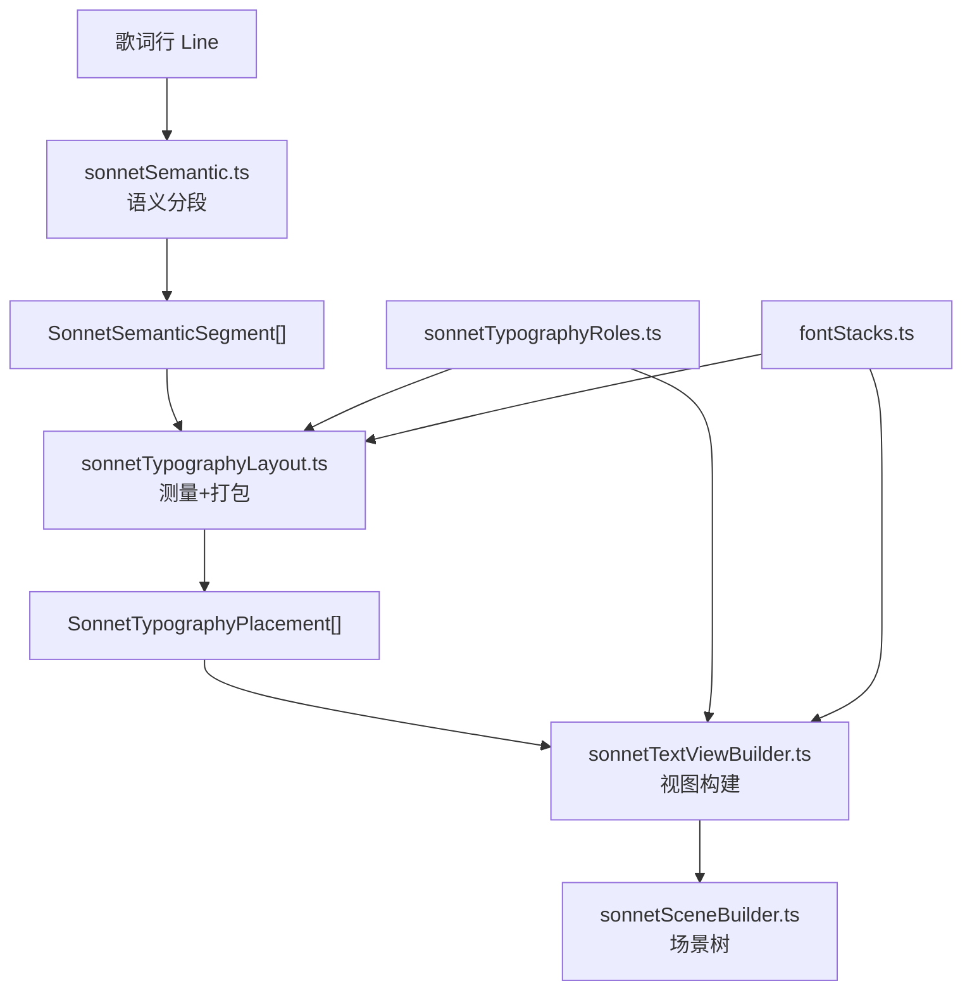
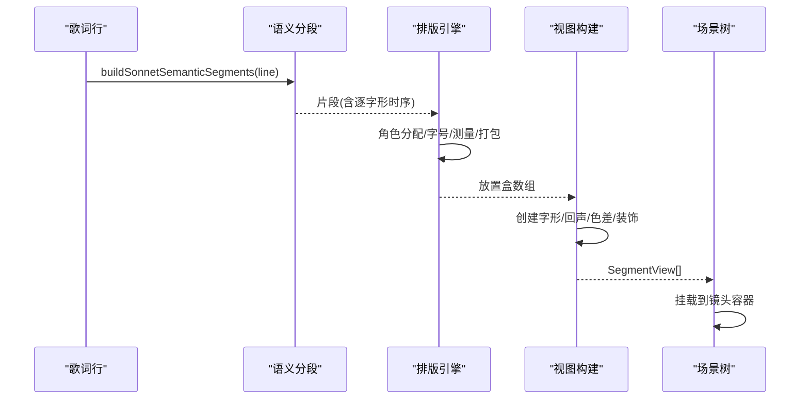
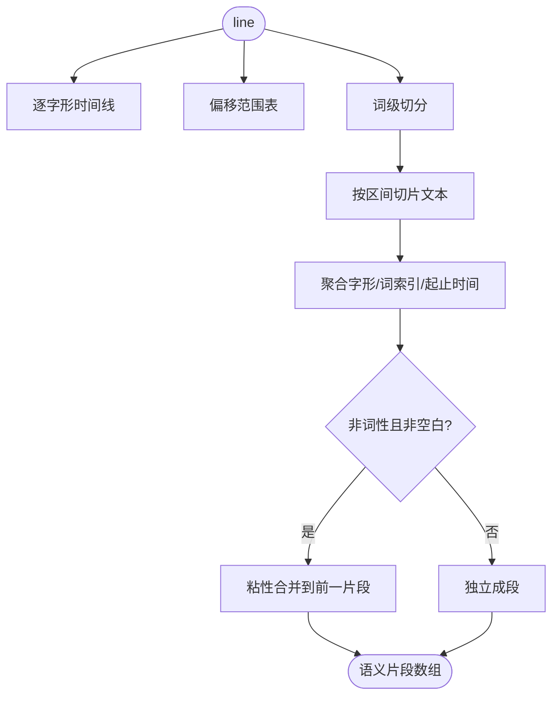
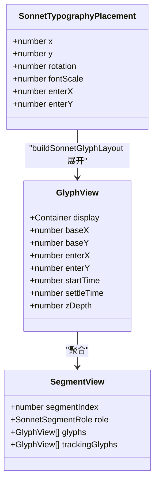
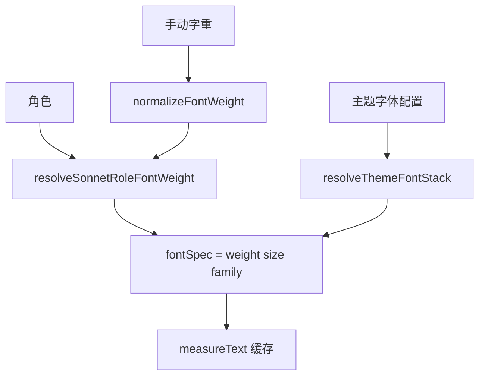
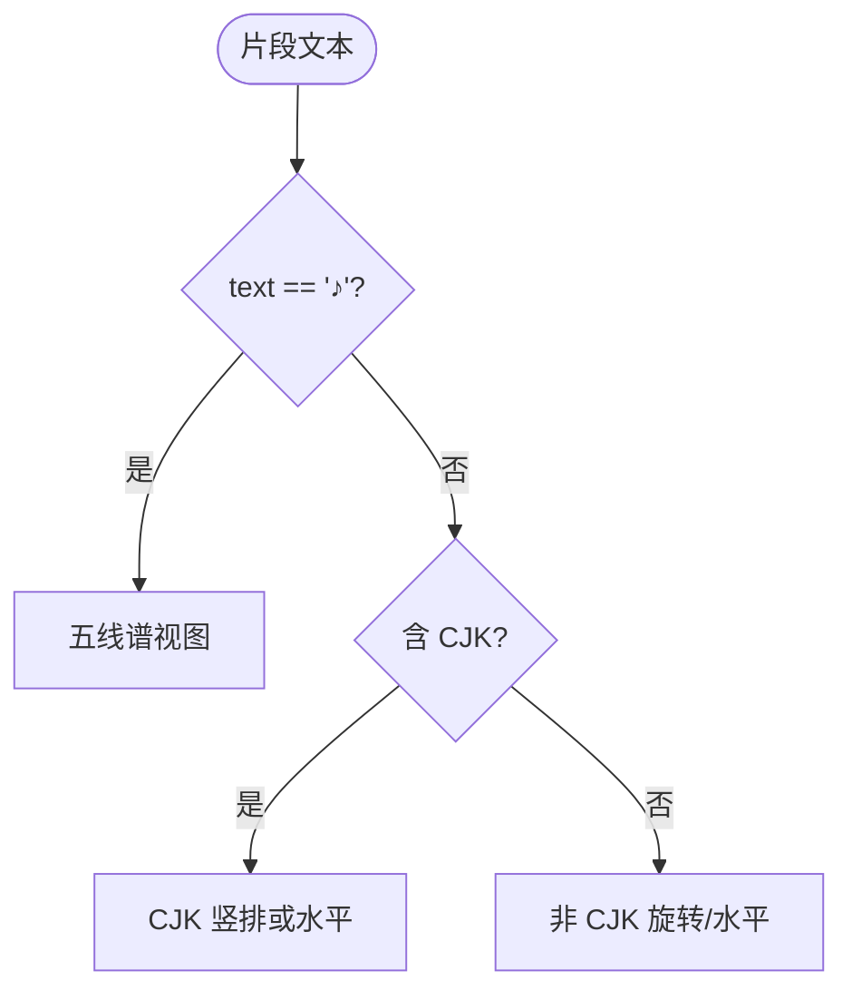
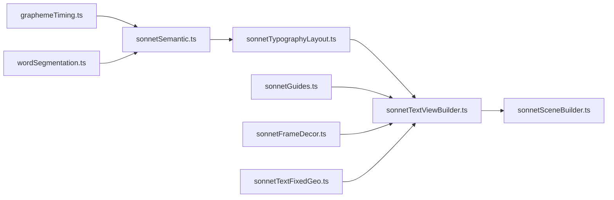

# 文本布局系统

<cite>
**本文引用的文件**   
- [sonnetTypographyLayout.ts](file://src/components/visualizer/sonnet/sonnetTypographyLayout.ts)
- [sonnetTextViewBuilder.ts](file://src/components/visualizer/sonnet/sonnetTextViewBuilder.ts)
- [sonnetSemantic.ts](file://src/components/visualizer/sonnet/sonnetSemantic.ts)
- [sonnetTypographyRoles.ts](file://src/components/visualizer/sonnet/sonnetTypographyRoles.ts)
- [sonnetSceneBuilder.ts](file://src/components/visualizer/sonnet/sonnetSceneBuilder.ts)
- [fontStacks.ts](file://src/utils/fontStacks.ts)
- [graphemeTiming.ts](file://src/utils/lyrics/graphemeTiming.ts)
- [wordSegmentation.ts](file://src/utils/lyrics/wordSegmentation.ts)
</cite>

## 目录
1. [引言](#引言)
2. [项目结构](#项目结构)
3. [核心组件](#核心组件)
4. [架构总览](#架构总览)
5. [详细组件分析](#详细组件分析)
6. [依赖关系分析](#依赖关系分析)
7. [性能考量](#性能考量)
8. [故障排查指南](#故障排查指南)
9. [结论](#结论)

## 引言
文本布局系统是 Sonnet 场景构建系统中把“歌词文本”变成“屏幕上可动画的排版结构”的完整链路。本文围绕以下目标展开：
- 解释文本排版算法与视图构建器的协作方式：分段、测量、放置、视图创建。
- 说明文本分割与语义分组：逐字形时序、词切分与粘性标点合并。
- 阐述字体渲染优化：字体栈解析、字重归一化与测量缓存。
- 解释布局定位、边界检测与视觉层次（hero/semi-hero/support/decoration）。
- 给出多语言、特殊字符与无障碍相关的处理方式。

## 项目结构
- sonnetSemantic.ts：把一行歌词切成语义片段，并把展示偏移映射到解析器输出的逐字形时序。
- sonnetTypographyLayout.ts：测量、角色分配与按镜头类型的排版打包。
- sonnetTextViewBuilder.ts：把放置盒实例化为 PixiJS 文本视图（核心字形、光晕、回声、色差层）。
- sonnetTypographyRoles.ts：hero/semi-hero 的评分选取与字重解析。
- fontStacks.ts：字体栈与字重的规范化工具。
- sonnetSceneBuilder.ts：按镜头构建整棵场景树，是布局系统的最终调用方。

**图示来源**
- [sonnetSemantic.ts:43-74](file://src/components/visualizer/sonnet/sonnetSemantic.ts#L43-L74)
- [sonnetTypographyLayout.ts:116-125](file://src/components/visualizer/sonnet/sonnetTypographyLayout.ts#L116-L125)
- [sonnetTextViewBuilder.ts:106-110](file://src/components/visualizer/sonnet/sonnetTextViewBuilder.ts#L106-L110)

**章节来源**
- [sonnetSceneBuilder.ts:78-101](file://src/components/visualizer/sonnet/sonnetSceneBuilder.ts#L78-L101)

## 核心组件
- 语义分段器 `buildSonnetSemanticSegments`：无损切分 + 时序映射 + 粘性合并。
- 排版引擎 `resolveSonnetTypographyLayout`：角色 → 字号 → 测量 → 打包。
- 视图构建器 `buildSonnetTextView`：字形对（核心/光晕）、色差层、回声、引导线、装饰。
- 字体规范化：`normalizeFontWeight`、`resolveThemeFontStack`、`BUILTIN_FONT_STACKS`。
- 特殊分支：`♪` 音符片段由 `buildSonnetStaffView` 绘制为五线谱视图。

**章节来源**
- [sonnetTextViewBuilder.ts:198-235](file://src/components/visualizer/sonnet/sonnetTextViewBuilder.ts#L198-L235)
- [fontStacks.ts:1-21](file://src/utils/fontStacks.ts#L1-L21)

## 架构总览
从输入到渲染的顺序是严格的单向管道：歌词行 → 语义片段 → 放置盒 → 视图对象 → 场景树。每一步都不回溯修改上游数据，这保证了同一行歌词在任何镜头下走的是同一套分段与时序，差异只在布局打包。

**图示来源**
- [sonnetSemantic.ts:43-74](file://src/components/visualizer/sonnet/sonnetSemantic.ts#L43-L74)
- [sonnetTextViewBuilder.ts:106-337](file://src/components/visualizer/sonnet/sonnetTextViewBuilder.ts#L106-L337)

**章节来源**
- [sonnetTextViewBuilder.ts:20-74](file://src/components/visualizer/sonnet/sonnetTextViewBuilder.ts#L20-L74)

## 详细组件分析

### 文本分割与语义分组
分段流程分四步：
1. 构造逐字形时间线 `buildLineGraphemeTimeline(line)` 并生成偏移范围表 `getGraphemeRanges`。
2. 使用 `segmentLyricWords(line)` 得到词级切分（尊重用户保存的分段）。
3. 按相邻词索引的区间切片文本，逐片段聚合字形与词索引，得到精确的 `startTime/endTime`。
4. 粘性合并：非空白、非词性片段（如标点）吸附到前一个片段，避免标点被布局当作独立排版单元，也防止其获得独立动画相位。

**图示来源**
- [sonnetSemantic.ts:11-74](file://src/components/visualizer/sonnet/sonnetSemantic.ts#L11-L74)

**章节来源**
- [sonnetSemantic.ts:1-75](file://src/components/visualizer/sonnet/sonnetSemantic.ts#L1-L75)

### 排版算法与视图构建器的协作
排版引擎负责“几何”，视图构建器负责“外观”：
- 排版输出 `SonnetTypographyPlacement`（坐标、旋转、字号倍率、入场向量）。
- 视图构建器根据 `role` 决定颜色策略：正文用主题主色，光晕/描边用关键词色或强调色；decoration 仅描边、alpha 0.2。
- 每个字形创建独立 wrapper，记录 `baseX/baseY`、`enterX/enterY`、`entryRotation`、`startTime/settleTime`，供运行时按时间驱动。

**图示来源**
- [sonnetTextViewBuilder.ts:33-74](file://src/components/visualizer/sonnet/sonnetTextViewBuilder.ts#L33-L74)
- [sonnetGlyphLayout.ts:33-77](file://src/components/visualizer/sonnet/sonnetGlyphLayout.ts#L33-L77)

**章节来源**
- [sonnetTextViewBuilder.ts:106-180](file://src/components/visualizer/sonnet/sonnetTextViewBuilder.ts#L106-L180)

### 布局定位系统
- 坐标计算：放置盒坐标即片段中心（锚点 0.5），字形坐标由 `buildSonnetGlyphLayout` 在局部坐标轴上排布后经旋转矩阵变换到屏幕空间。
- 边界检测：测量盒参与 82% 视口适配；海报竖排另有二次测量。
- 碰撞避免：布局函数在打包阶段按流式方向推进游标，盒与盒之间由 `flowGap/stackGap` 保证最小间距，从结构上避免重叠。
- 入场向量：hero 统一下方 15% 屏高；竖排字形按 ±0.28 字体大小的错位交替，形成“抖动落位”。

**章节来源**
- [sonnetTypographyLayout.ts:288-326](file://src/components/visualizer/sonnet/sonnetTypographyLayout.ts#L288-L326)
- [sonnetGlyphLayout.ts:50-76](file://src/components/visualizer/sonnet/sonnetGlyphLayout.ts#L50-L76)

### 字体渲染优化：字体栈与字重归一化
- 字体栈：`resolveThemeFontStack` 依据主题的 `fontStyle/fontFamily/fontFamilyStack` 合成最终 CSS 字体栈，内置栈定义在 `BUILTIN_FONT_STACKS`。
- 字重归一化：`normalizeFontWeight` 把任意输入夹紧到 100-900、步进 10；`resolveSonnetRoleFontWeight` 在自动模式下给 hero/semi-hero 900、support 700、decoration 300，手动覆盖优先。
- 缓存机制：测量缓存以含字重的 `fontSpec` 为键，同一字体栈下不会重复测量。

**图示来源**
- [fontStacks.ts:7-21](file://src/utils/fontStacks.ts#L7-L21)
- [sonnetTypographyRoles.ts:12-21](file://src/components/visualizer/sonnet/sonnetTypographyRoles.ts#L12-L21)
- [sonnetTypographyLayout.ts:92-114](file://src/components/visualizer/sonnet/sonnetTypographyLayout.ts#L92-L114)

**章节来源**
- [fontStacks.ts:1-120](file://src/utils/fontStacks.ts#L1-L120)

### 多语言与特殊字符
- CJK：竖排堆叠按 `fontSize * 0.9` 的字形前进节奏排布，与字形渲染器保持相同的列高口径。
- 非 CJK 竖排：整体旋转 90°，水平测量参与打包。
- 特殊字符：`♪` 片段走五线谱视图分支，生成 `SonnetStaffView` 并同样接入引导线系统。
- 可访问性：视觉层不改变语义树；歌词无障碍依赖播放页的文本层组件，布局系统仅负责视觉呈现。

**图示来源**
- [sonnetTextViewBuilder.ts:198-235](file://src/components/visualizer/sonnet/sonnetTextViewBuilder.ts#L198-L235)
- [sonnetTypographyLayout.ts:73-84](file://src/components/visualizer/sonnet/sonnetTypographyLayout.ts#L73-L84)

**章节来源**
- [sonnetStaffView.ts:20-60](file://src/components/visualizer/sonnet/sonnetStaffView.ts#L20-L60)

## 依赖关系分析
- 布局系统依赖歌词基础设施：`graphemeTiming.ts`（逐字形时间线）与 `wordSegmentation.ts`（词切分），两者同时服务于其他可视化模式。
- 视图构建器依赖运行时工具：`sonnetGuides`（引导线）、`sonnetFrameDecor`（框架装饰）、`sonnetTextFixedGeo`（背景几何）、`sonnetCameraTracking`（跟踪字形）。
- 所有依赖均为单向：语义层不知道布局层，布局层不知道视图层，便于单独测试（如 `sonnetTypographyLayout.test.ts`、`sonnetGlyphLayout.test.ts`）。

**图示来源**
- [sonnetSemantic.ts:1-9](file://src/components/visualizer/sonnet/sonnetSemantic.ts#L1-L9)
- [sonnetTextViewBuilder.ts:1-18](file://src/components/visualizer/sonnet/sonnetTextViewBuilder.ts#L1-L18)

**章节来源**
- [sonnetTextViewBuilder.ts:1-18](file://src/components/visualizer/sonnet/sonnetTextViewBuilder.ts#L1-L18)

## 性能考量
- 分段零分配优化：粘性合并就地修改片段对象，避免多次数组重建。
- 测量缓存：见《文本布局算法》一文；视图构建器中的逐字测量同样受益。
- 引导线与装饰的惰性：`isDecoration` 片段不创建引导线，减少一半以上的对象数量。
- 视图对象池化潜力：字形 wrapper 字段固定，理论上可池化；当前实现为保证正确性每次构建，构建期一次性完成。

**章节来源**
- [sonnetTypographyLayout.ts:92-114](file://src/components/visualizer/sonnet/sonnetTypographyLayout.ts#L92-L114)
- [sonnetTextViewBuilder.ts:216-218](file://src/components/visualizer/sonnet/sonnetTextViewBuilder.ts#L216-L218)

## 故障排查指南
- 标点单独动画/单独换行：检查粘性合并条件；非词性片段应吸附到前一片段。
- 字形时序与歌词不同步：确认 `buildLineGraphemeTimeline` 的输出与 `segmentLyricWords` 的切分一致性，特别是用户自定义分段生效的行。
- 字重不生效：`normalizeFontWeight` 只接受数字；字符串字重会被归一化为 null 并回退到角色默认。
- 字体回退异常：检查 `resolveThemeFontStack` 输出的栈顺序，内置栈是兜底，自定义字体应排在最前。
- `♪` 显示为普通文字：确认走的是 `buildSonnetStaffView` 分支（严格等于 `'♪'`）。

**章节来源**
- [sonnetSemantic.ts:60-72](file://src/components/visualizer/sonnet/sonnetSemantic.ts#L60-L72)
- [fontStacks.ts:7-12](file://src/utils/fontStacks.ts#L7-L12)

## 结论
Sonnet 文本布局系统是一套职责分明的四段式管线：语义分段保证时序无损，排版引擎负责确定性的几何，视图构建器负责全部视觉细节，场景构建器完成挂载。它以字体栈规范化与测量缓存支撑多语言排版，以角色体系构建视觉层次，是 Sonnet 视觉语言在文本维度上的完整实现。
