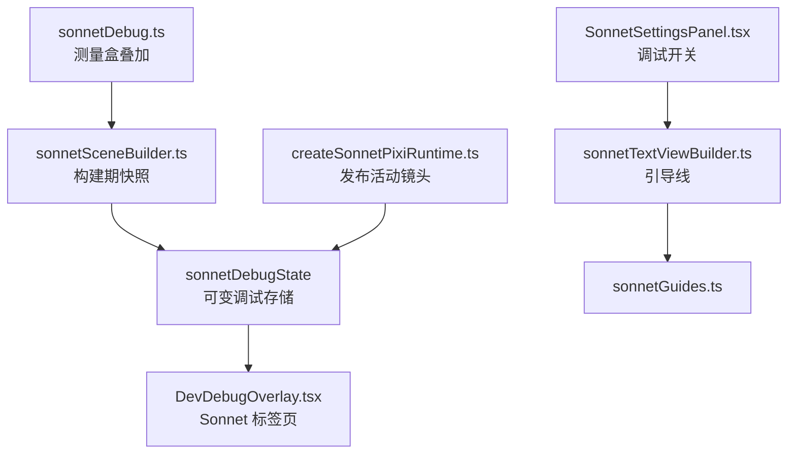
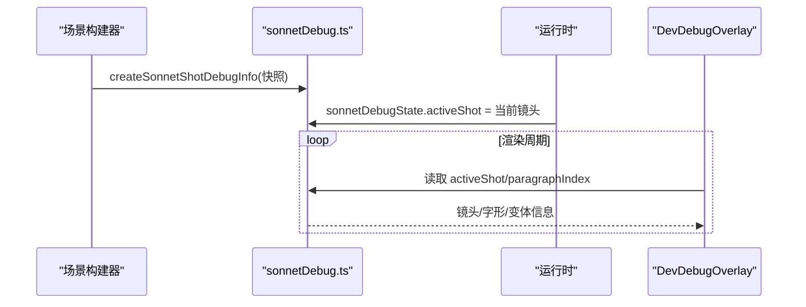
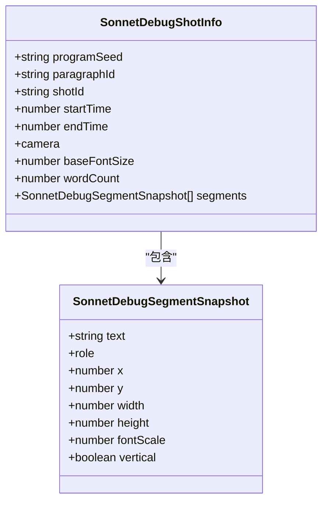
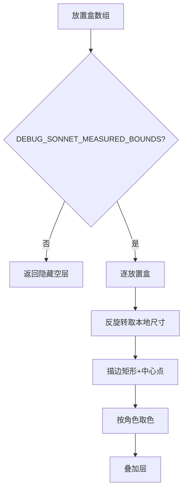
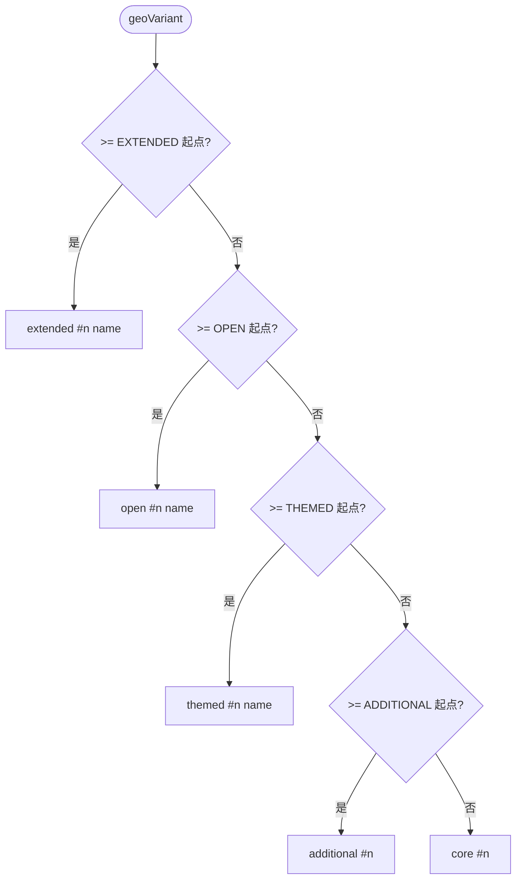
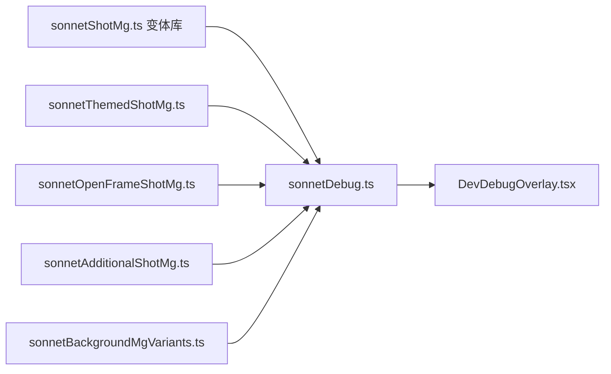

# 调试与可视化系统

<cite>
**本文引用的文件**   
- [sonnetDebug.ts](file://src/components/visualizer/sonnet/sonnetDebug.ts)
- [sonnetGuides.ts](file://src/components/visualizer/sonnet/sonnetGuides.ts)
- [DevDebugOverlay.tsx](file://src/components/DevDebugOverlay.tsx)
- [createSonnetPixiRuntime.ts](file://src/components/visualizer/sonnet/createSonnetPixiRuntime.ts)
- [sonnetSceneBuilder.ts](file://src/components/visualizer/sonnet/sonnetSceneBuilder.ts)
- [SonnetSettingsPanel.tsx](file://src/components/visualizer/sonnet/SonnetSettingsPanel.tsx)
</cite>

## 目录
1. [引言](#引言)
2. [项目结构](#项目结构)
3. [核心组件](#核心组件)
4. [架构总览](#架构总览)
5. [详细组件分析](#详细组件分析)
6. [依赖关系分析](#依赖关系分析)
7. [性能考量](#性能考量)
8. [故障排查指南](#故障排查指南)
9. [结论](#结论)

## 引言
本文聚焦 Sonnet 模式的调试与可视化系统，围绕以下目标展开：
- 解释调试信息收集机制：镜头快照、段落状态与字形测量数据。
- 说明可视化覆盖层：测量盒调试层、引导线系统与角色配色。
- 阐述调试数据格式化：geo 变体标签、MG 标签与结构化快照。
- 解释开发者工具集成：DevDebugOverlay 的 Sonnet 标签页与设置面板调试开关。
- 给出扩展自定义调试功能的方法。

Sonnet 是一个“参数敏感”的视觉系统：镜头、字形、MG 与后处理层层叠加。调试系统的作用是让每一层的决策过程都可见、可解释。

## 项目结构
- sonnetDebug.ts：调试核心，包含测量盒叠加层、快照数据结构、变体标签解析与共享调试状态。
- sonnetGuides.ts：生产级“引导线”视觉层（可在设置中开关），既是调试工具也是设计元素。
- DevDebugOverlay.tsx：开发工具面板，读取 `sonnetDebugState` 渲染实时镜头信息。
- SonnetSettingsPanel.tsx：用户可见的 Sonnet 调参面板，含 showGuide 等调试型开关。
- createSonnetPixiRuntime.ts / sonnetSceneBuilder.ts：调试数据的产生方（快照写入、调试层创建）。

**图示来源**
- [sonnetDebug.ts:68-112](file://src/components/visualizer/sonnet/sonnetDebug.ts#L68-L112)
- [sonnetGuides.ts:32-60](file://src/components/visualizer/sonnet/sonnetGuides.ts#L32-L60)

**章节来源**
- [sonnetDebug.ts:21-25](file://src/components/visualizer/sonnet/sonnetDebug.ts#L21-L25)

## 核心组件
- `DEBUG_SONNET_MEASURED_BOUNDS`：测量盒叠加总开关（默认 false）。
- `buildSonnetMeasuredBoundsDebug`：按角色配色绘制每个放置盒的边界与锚点。
- `sonnetDebugState`：非响应式可变调试存储（`activeShot` 与 `paragraphIndex`）。
- `createSonnetShotDebugInfo`：构建不可变快照（镜头、相机、段落、字形、变体标签）。
- `resolveSonnetGeoVariantLabel`：把数字变体号翻译为“来源库 + 序号 + 名称”。
- 引导线系统：`resolveSonnetGuideCue` 与 `createSonnetGuide` 生成按时间的视觉引导。

**章节来源**
- [sonnetDebug.ts:25-66](file://src/components/visualizer/sonnet/sonnetDebug.ts#L25-L66)
- [sonnetDebug.ts:143-191](file://src/components/visualizer/sonnet/sonnetDebug.ts#L143-L191)

## 架构总览
调试体系分“构建期快照”与“运行期发布”两条数据流：
- 构建期：场景构建器为每个镜头生成完整调试快照（含字形测量数据），随场景缓存。
- 运行期：运行时把当前活跃镜头的快照发布到 `sonnetDebugState`，开发面板每帧读取渲染。
- 可视化层：测量盒层在构建期根据开关生成；引导线是常规场景内容的一部分，由用户设置控制。

**图示来源**
- [sonnetDebug.ts:106-112](file://src/components/visualizer/sonnet/sonnetDebug.ts#L106-L112)
- [sonnetDebug.ts:143-158](file://src/components/visualizer/sonnet/sonnetDebug.ts#L143-L158)

**章节来源**
- [sonnetDebug.ts:68-83](file://src/components/visualizer/sonnet/sonnetDebug.ts#L68-L83)

## 详细组件分析

### 调试信息收集与快照结构
`SonnetDebugShotInfo` 是调试的单镜头真相源，包含：
- 定位信息：`programSeed`、`paragraphId/paragraphKind`、`shotId/shotKind`、`shotIndex/shotCount`、`lineIndices`。
- 时间与相机：`startTime/endTime` 与 `camera` 四元组。
- 排版信息：`baseFontSize`、`wordCount`、每个片段的 `role/x/y/width/height/fontScale/vertical`。
- 变体信息：`geoVariant`（可空）、`backgroundMgLabel`、`fixedGeoLabel`、`backgroundDecorLabel`。
快照在构建期生成、随场景驻留，运行时只做指针替换，读侧零成本。

**图示来源**
- [sonnetDebug.ts:73-104](file://src/components/visualizer/sonnet/sonnetDebug.ts#L73-L104)

**章节来源**
- [sonnetDebug.ts:143-191](file://src/components/visualizer/sonnet/sonnetDebug.ts#L143-L191)

### 可视化覆盖层
- 测量盒：`buildSonnetMeasuredBoundsDebug` 为每个放置盒绘制描边矩形与中心点。角色配色固定（hero 红 `0xff4466`、semi-hero 橙 `0xffaa00`、support 蓝 `0x44ccff`、decoration 灰 `0x888888`），可一眼区分层级。矩形使用本地尺寸先反旋转再画，避免双重旋转。
- 引导线：`createSonnetGuide` 为每个片段创建引导视图（生产路径同样使用），`resolveSonnetGuideCue` 决定引导的时序行为；decoration 片段不创建引导。
- 调试开关：`DEBUG_SONNET_MEASURED_BOUNDS = false` 为默认；开发时可临时开启，或在调试环境注入。

**图示来源**
- [sonnetDebug.ts:38-66](file://src/components/visualizer/sonnet/sonnetDebug.ts#L38-L66)

**章节来源**
- [sonnetDebug.ts:29-66](file://src/components/visualizer/sonnet/sonnetDebug.ts#L29-L66)

### 调试数据格式化与变体标签
变体号是数字，调试系统负责把它翻译成人类可读标签：
- `resolveSonnetGeoVariantLabel`：按阈值范围（extended / open / themed / additional / core）逐级判定，并从对应变体库的注册表取名称（如 `themed #7 xxx`）。
- 背景类标签：`labelFor` 从 `SONNET_BACKGROUND_MG_VARIANTS`、`SONNET_FIXED_GEO_VARIANTS`、`SONNET_BACKGROUND_DECOR_VARIANTS` 三个注册表取名字，注册表更新后标签自动同步。
- 空值处理：未使用几何变体时标签为 null，UI 显示为“无”。

**图示来源**
- [sonnetDebug.ts:114-140](file://src/components/visualizer/sonnet/sonnetDebug.ts#L114-L140)

**章节来源**
- [sonnetDebug.ts:114-140](file://src/components/visualizer/sonnet/sonnetDebug.ts#L114-L140)

### 开发者工具集成
- DevDebugOverlay：开发构建中展示的面板，其 Sonnet 标签页在渲染期间直接读取 `sonnetDebugState`（刻意不做响应式，避免每帧触发 React 状态更新），显示当前段落、镜头、相机、变体与字形列表。
- 设置面板：`SonnetSettingsPanel` 提供引导线等可视化开关；这些开关走常规设置存储与外观导入导出流程，便于截图复现问题。
- 日志与错误：场景构建中的异常（如超长文本拆分死循环保护 `splitOversizedDraft`）会输出错误日志，结合快照可快速定位输入。

**章节来源**
- [sonnetDebug.ts:68-72](file://src/components/visualizer/sonnet/sonnetDebug.ts#L68-L72)

## 依赖关系分析
- sonnetDebug.ts 依赖各 MG 变体库的注册表（themed/open/extended/additional/background/fixed）——这是“标签自动同步”的关键约定：新增变体只需注册名字。
- 调试层与生产层的唯一耦合点是构建器在构建期按开关插入调试层；不开启时是空层，运行期零开销。
- DevDebugOverlay 与视觉渲染解耦：仅读取可变存储，不干扰渲染管线。

**图示来源**
- [sonnetDebug.ts:1-19](file://src/components/visualizer/sonnet/sonnetDebug.ts#L1-L19)

**章节来源**
- [sonnetDebug.ts:1-19](file://src/components/visualizer/sonnet/sonnetDebug.ts#L1-L19)

## 性能考量
- 快照零拷贝发布：运行时仅替换指针，无逐帧对象创建。
- 非响应式读取：DevDebugOverlay 直接读可变存储，避免 React 重渲染与渲染循环互相拉扯。
- 默认关闭：测量盒与引导线默认不参与渲染；引导线作为设置项由用户显式开启。
- 按需构建：调试层在没有开启时只是一个 `visible = false` 的空容器。

**章节来源**
- [sonnetDebug.ts:42-44](file://src/components/visualizer/sonnet/sonnetDebug.ts#L42-L44)

## 故障排查指南
- 测量盒与字形错位：检查放置盒的旋转是否被双重应用（实现已通过 `resolveSonnetFrameLocalDimensions` 反旋转，自定义代码需遵循同样约定）。
- 调试面板无数据：确认场景构建期确实调用了 `createSonnetShotDebugInfo`，且运行时发布了 `activeShot`。
- 变体标签显示错误库名：标签按阈值顺序判定，新增变体库时必须定义新的起始常量并调整判定顺序。
- 引导线影响观感：引导线属于生产功能，可在设置中关闭；排查问题时也要学会利用它验证片段时序。
- 无法复现布局问题：使用外观导入导出保存完整设置（含 Sonnet 调参），再配合快照中的 seed 信息进行确定性复现。

**章节来源**
- [sonnetDebug.ts:46-66](file://src/components/visualizer/sonnet/sonnetDebug.ts#L46-L66)
- [sonnetDebug.ts:116-133](file://src/components/visualizer/sonnet/sonnetDebug.ts#L116-L133)

## 结论
Sonnet 调试与可视化系统以“构建期快照 + 运行期指针发布 + 按需可视化层”的结构，把复杂的排版与变体决策变成可检查的数据。测量盒、引导线与开发面板三层工具分别覆盖几何、时序与状态维度，配合确定性的种子体系，使任何视觉问题都可以被复现、定位与修复。
