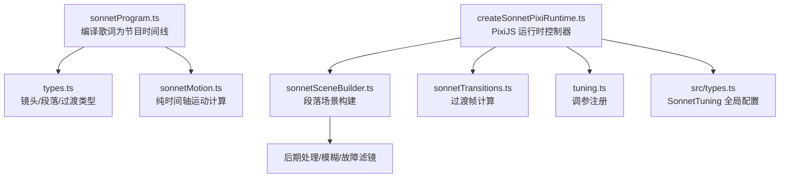
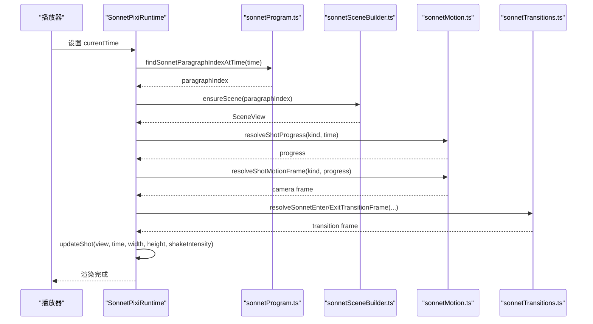
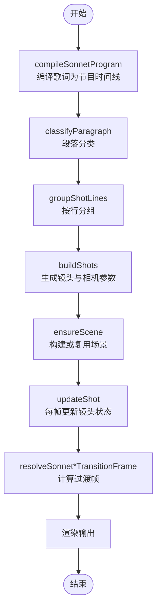
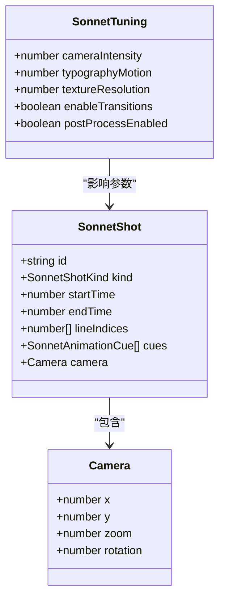
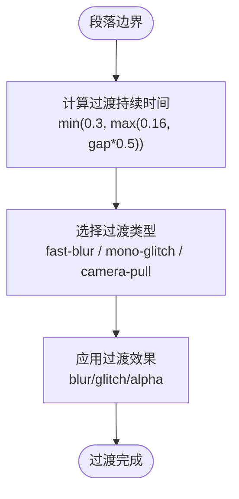
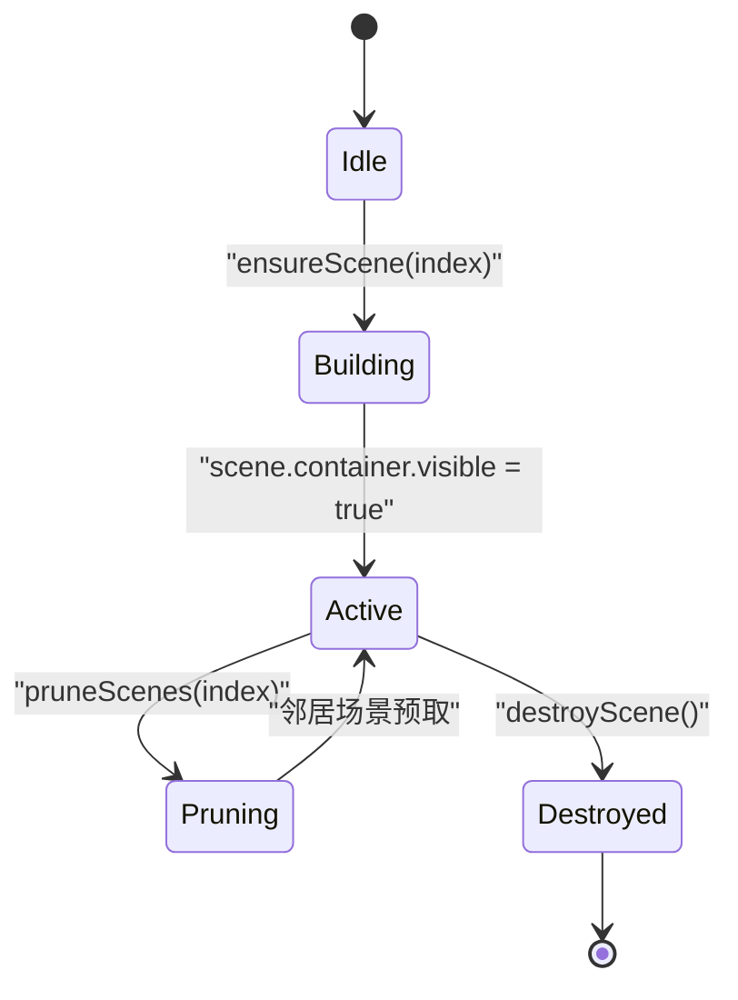
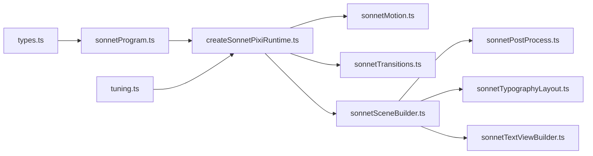

# 镜头管理系统

<cite>
**本文引用的文件**   
- [types.ts](file://src/components/visualizer/sonnet/types.ts)
- [sonnetProgram.ts](file://src/components/visualizer/sonnet/sonnetProgram.ts)
- [sonnetMotion.ts](file://src/components/visualizer/sonnet/sonnetMotion.ts)
- [createSonnetPixiRuntime.ts](file://src/components/visualizer/sonnet/createSonnetPixiRuntime.ts)
- [sonnetSceneBuilder.ts](file://src/components/visualizer/sonnet/sonnetSceneBuilder.ts)
- [sonnetTransitions.ts](file://src/components/visualizer/sonnet/sonnetTransitions.ts)
- [tuning.ts](file://src/components/visualizer/sonnet/tuning.ts)
- [types.ts（全局 SonnetTuning）](file://src/types.ts)
</cite>

## 目录
1. [引言](#引言)
2. [项目结构](#项目结构)
3. [核心组件](#核心组件)
4. [架构总览](#架构总览)
5. [详细组件分析](#详细组件分析)
6. [依赖关系分析](#依赖关系分析)
7. [性能与优化](#性能与优化)
8. [调试、监控与错误处理](#调试监控与错误处理)
9. [自定义镜头类型开发指南](#自定义镜头类型开发指南)
10. [结论](#结论)

## 引言
本技术文档围绕 Sonnet 模式的镜头管理系统展开，聚焦以下目标：
- 解释镜头类型定义，包括 type-impact、quiet-tableau、poster-blocks 等。
- 说明镜头生命周期管理：从歌词编译、段落划分、镜头生成到运行时渲染切换。
- 阐述镜头参数配置系统：相机位置、缩放比例、旋转角度和过渡效果参数。
- 解释镜头间切换机制：淡入淡出、模糊过渡和故障效果实现。
- 说明镜头状态管理：激活状态、可见性控制和性能优化策略。
- 提供调试信息生成、性能监控和错误处理机制。
- 给出自定义镜头类型的开发指南与最佳实践。

该系统以“确定性时间轴 + PixiJS 渲染”为核心，将歌词语义划分为段落与镜头，并通过纯函数运动计算驱动相机、文本、装饰元素和转场效果。

## 项目结构
Sonnet 镜头管理系统位于可视化器模块下，主要文件职责如下：
- types.ts：定义镜头、段落、程序、过渡等公共数据结构。
- sonnetProgram.ts：将歌词编译为可寻址、确定性的 PV 时间线，生成段落、镜头和过渡。
- sonnetMotion.ts：纯时间轴运动计算，包括缓动、相机路径、呼吸抖动、焦点权重等。
- createSonnetPixiRuntime.ts：PixiJS 运行时控制器，负责场景缓存、帧更新、歌曲切换、资源释放。
- sonnetSceneBuilder.ts：构建单个段落场景，包含文本布局、背景 MG、后期处理和过渡滤镜。
- sonnetTransitions.ts：计算段落级和镜头级过渡帧，支持快速模糊、单色故障和相机拉远。
- tuning.ts：注册 Sonnet 调参入口。
- src/types.ts：全局 SonnetTuning 配置接口，控制相机强度、动画强度、纹理分辨率、后处理开关等。

**图表来源**
- [sonnetProgram.ts:26-34](file://src/components/visualizer/sonnet/sonnetProgram.ts#L26-L34)
- [types.ts:8-21](file://src/components/visualizer/sonnet/types.ts#L8-L21)
- [sonnetMotion.ts:58-65](file://src/components/visualizer/sonnet/sonnetMotion.ts#L58-L65)
- [createSonnetPixiRuntime.ts:108-146](file://src/components/visualizer/sonnet/createSonnetPixiRuntime.ts#L108-L146)
- [sonnetSceneBuilder.ts:78-101](file://src/components/visualizer/sonnet/sonnetSceneBuilder.ts#L78-L101)
- [sonnetTransitions.ts:38-88](file://src/components/visualizer/sonnet/sonnetTransitions.ts#L38-L88)
- [tuning.ts:5-10](file://src/components/visualizer/sonnet/tuning.ts#L5-L10)
- [types.ts（全局 SonnetTuning）:528-556](file://src/types.ts#L528-L556)

**章节来源**
- [sonnetProgram.ts:26-34](file://src/components/visualizer/sonnet/sonnetProgram.ts#L26-L34)
- [types.ts:8-21](file://src/components/visualizer/sonnet/types.ts#L8-L21)
- [sonnetMotion.ts:58-65](file://src/components/visualizer/sonnet/sonnetMotion.ts#L58-L65)
- [createSonnetPixiRuntime.ts:108-146](file://src/components/visualizer/sonnet/createSonnetPixiRuntime.ts#L108-L146)
- [sonnetSceneBuilder.ts:78-101](file://src/components/visualizer/sonnet/sonnetSceneBuilder.ts#L78-L101)
- [sonnetTransitions.ts:38-88](file://src/components/visualizer/sonnet/sonnetTransitions.ts#L38-L88)
- [tuning.ts:5-10](file://src/components/visualizer/sonnet/tuning.ts#L5-L10)
- [types.ts（全局 SonnetTuning）:528-556](file://src/types.ts#L528-L556)

## 核心组件
- 镜头类型定义：editorial-column、type-impact、fragment-collage、tracking-ribbon、mask-reveal、poster-blocks、quiet-tableau。
- 过渡类型定义：fast-blur、mono-glitch、camera-pull。
- 镜头数据结构：id、kind、startTime、endTime、lineIndices、cues、camera（x/y/zoom/rotation）。
- 段落数据结构：id、kind、boundary、startTime、endTime、lines、shots、transitionOut。
- 节目数据结构：version、seed、paragraphGapThreshold、paragraphs。

这些类型共同构成 Sonnet 的确定性 PV 时间线，确保回放与直接寻址行为一致。

**章节来源**
- [types.ts:8-21](file://src/components/visualizer/sonnet/types.ts#L8-L21)
- [types.ts:49-86](file://src/components/visualizer/sonnet/types.ts#L49-L86)

## 架构总览
Sonnet 镜头管理系统的整体流程如下：
1. 歌词输入被编译为 SonnetProgram，划分段落并生成镜头与过渡。
2. 运行时根据当前播放时间选择活跃段落，构建或复用场景视图。
3. 每帧计算镜头进度、相机路径、文本逐字动画、装饰元素和过渡效果。
4. 通过 PixiJS 渲染容器输出画面，并在歌曲切换时执行覆盖式淡入淡出。

**图表来源**
- [createSonnetPixiRuntime.ts:715-800](file://src/components/visualizer/sonnet/createSonnetPixiRuntime.ts#L715-L800)
- [sonnetProgram.ts:260-265](file://src/components/visualizer/sonnet/sonnetProgram.ts#L260-L265)
- [sonnetSceneBuilder.ts:78-101](file://src/components/visualizer/sonnet/sonnetSceneBuilder.ts#L78-L101)
- [sonnetMotion.ts:58-65](file://src/components/visualizer/sonnet/sonnetMotion.ts#L58-L65)
- [sonnetTransitions.ts:90-113](file://src/components/visualizer/sonnet/sonnetTransitions.ts#L90-L113)

## 详细组件分析

### 镜头类型与生命周期
- 镜头类型由 SONNET_SHOT_KINDS 定义，运行时根据歌词语义和随机种子选择镜头类型，避免重复。
- 段落分类（breath、verse、lift、chorus、break、outro）影响镜头选择和缩放基值。
- 镜头生命周期：
  - 编译阶段：compileSonnetProgram 将歌词分组为段落，再按行组生成镜头。
  - 构建阶段：buildSonnetScene 为每个镜头创建容器、文本布局和装饰层。
  - 运行阶段：updateShot 根据时间计算镜头进度、相机路径、逐字动画和过渡。
  - 销毁阶段：destroyScene 清理过滤器、显示树和纹理资源。

**图表来源**
- [sonnetProgram.ts:93-103](file://src/components/visualizer/sonnet/sonnetProgram.ts#L93-L103)
- [sonnetProgram.ts:125-191](file://src/components/visualizer/sonnet/sonnetProgram.ts#L125-L191)
- [sonnetSceneBuilder.ts:78-101](file://src/components/visualizer/sonnet/sonnetSceneBuilder.ts#L78-L101)
- [createSonnetPixiRuntime.ts:456-713](file://src/components/visualizer/sonnet/createSonnetPixiRuntime.ts#L456-L713)
- [sonnetTransitions.ts:90-152](file://src/components/visualizer/sonnet/sonnetTransitions.ts#L90-L152)

**章节来源**
- [sonnetProgram.ts:26-34](file://src/components/visualizer/sonnet/sonnetProgram.ts#L26-L34)
- [sonnetProgram.ts:93-103](file://src/components/visualizer/sonnet/sonnetProgram.ts#L93-L103)
- [sonnetProgram.ts:125-191](file://src/components/visualizer/sonnet/sonnetProgram.ts#L125-L191)
- [sonnetSceneBuilder.ts:78-101](file://src/components/visualizer/sonnet/sonnetSceneBuilder.ts#L78-L101)
- [createSonnetPixiRuntime.ts:456-713](file://src/components/visualizer/sonnet/createSonnetPixiRuntime.ts#L456-L713)
- [sonnetTransitions.ts:90-152](file://src/components/visualizer/sonnet/sonnetTransitions.ts#L90-L152)

### 镜头参数配置系统
- 相机位置：shot.camera.x/y 在 buildShots 中基于随机种子生成，poster-blocks 和 quiet-tableau 使用更宽的构图。
- 缩放比例：zoomBase 和 zoomSpan 根据镜头类型调整，type-impact 强调近景，poster-blocks 保持较宽视野。
- 旋转角度：rotation 由随机种子决定，范围较小以保持稳定。
- 过渡效果参数：enableTransitions 控制是否启用过渡；transitionOut.kind 决定过渡类型（fast-blur、mono-glitch、camera-pull）。
- 全局调参：SonnetTuning 提供 cameraIntensity、typographyMotion、textureResolution、postProcessEnabled 等开关。

**图表来源**
- [types.ts:49-62](file://src/components/visualizer/sonnet/types.ts#L49-L62)
- [types.ts（全局 SonnetTuning）:528-556](file://src/types.ts#L528-L556)
- [sonnetProgram.ts:170-189](file://src/components/visualizer/sonnet/sonnetProgram.ts#L170-L189)

**章节来源**
- [types.ts:49-62](file://src/components/visualizer/sonnet/types.ts#L49-L62)
- [types.ts（全局 SonnetTuning）:528-556](file://src/types.ts#L528-L556)
- [sonnetProgram.ts:170-189](file://src/components/visualizer/sonnet/sonnetProgram.ts#L170-L189)

### 镜头间切换机制
- 段落级过渡：transitionOut 在 compileSonnetProgram 中根据相邻段落间隙计算持续时间，并选择过渡类型。
- 镜头级过渡：resolveSonnetShotTransitionFrame 在当前镜头与前后镜头之间插入短过渡，增强节奏感。
- 过渡效果实现：
  - fast-blur：模糊强度随进度变化，alpha 在退出时逐渐降低。
  - mono-glitch：单色故障效果，glitchSeed 用于稳定随机噪声。
  - camera-pull：默认过渡，无特殊效果，仅控制 alpha。

**图表来源**
- [sonnetProgram.ts:234-253](file://src/components/visualizer/sonnet/sonnetProgram.ts#L234-L253)
- [sonnetTransitions.ts:38-88](file://src/components/visualizer/sonnet/sonnetTransitions.ts#L38-L88)
- [sonnetTransitions.ts:116-152](file://src/components/visualizer/sonnet/sonnetTransitions.ts#L116-L152)

**章节来源**
- [sonnetProgram.ts:234-253](file://src/components/visualizer/sonnet/sonnetProgram.ts#L234-L253)
- [sonnetTransitions.ts:38-88](file://src/components/visualizer/sonnet/sonnetTransitions.ts#L38-L88)
- [sonnetTransitions.ts:116-152](file://src/components/visualizer/sonnet/sonnetTransitions.ts#L116-L152)

### 镜头状态管理
- 激活状态：activeParagraphIndex 记录当前活跃段落，sceneCache 缓存已构建场景。
- 可见性控制：scene.container.visible 仅在活跃段落时为 true，非活跃场景卸载当前镜头以减少渲染开销。
- 性能优化：
  - 场景预取：提前构建下一个或上一个段落场景，避免边界跳帧。
  - 资源回收：destroyScene 清理过滤器、显示树和纹理，防止内存泄漏。
  - 纹理池：getSonnetTexturePool 复用图标纹理，减少 GPU 压力。

**图表来源**
- [createSonnetPixiRuntime.ts:438-454](file://src/components/visualizer/sonnet/createSonnetPixiRuntime.ts#L438-L454)
- [createSonnetPixiRuntime.ts:395-406](file://src/components/visualizer/sonnet/createSonnetPixiRuntime.ts#L395-L406)
- [createSonnetPixiRuntime.ts:756-800](file://src/components/visualizer/sonnet/createSonnetPixiRuntime.ts#L756-L800)

**章节来源**
- [createSonnetPixiRuntime.ts:438-454](file://src/components/visualizer/sonnet/createSonnetPixiRuntime.ts#L438-L454)
- [createSonnetPixiRuntime.ts:395-406](file://src/components/visualizer/sonnet/createSonnetPixiRuntime.ts#L395-L406)
- [createSonnetPixiRuntime.ts:756-800](file://src/components/visualizer/sonnet/createSonnetPixiRuntime.ts#L756-L800)

## 依赖关系分析
- sonnetProgram.ts 依赖 types.ts 定义的数据结构，并调用 sonnetSemantic 进行歌词语义分割。
- createSonnetPixiRuntime.ts 依赖 sonnetMotion.ts 计算运动，sonnetTransitions.ts 计算过渡，sonnetSceneBuilder.ts 构建场景。
- sonnetSceneBuilder.ts 依赖 sonnetPostProcess、sonnetTypographyLayout、sonnetTextViewBuilder 等子模块。
- tuning.ts 通过 defineVisualizerTuning 注入 Sonnet 调参接口。

**图表来源**
- [sonnetProgram.ts:1-18](file://src/components/visualizer/sonnet/sonnetProgram.ts#L1-L18)
- [createSonnetPixiRuntime.ts:1-45](file://src/components/visualizer/sonnet/createSonnetPixiRuntime.ts#L1-L45)
- [sonnetSceneBuilder.ts:1-29](file://src/components/visualizer/sonnet/sonnetSceneBuilder.ts#L1-L29)
- [tuning.ts:1-10](file://src/components/visualizer/sonnet/tuning.ts#L1-L10)

**章节来源**
- [sonnetProgram.ts:1-18](file://src/components/visualizer/sonnet/sonnetProgram.ts#L1-L18)
- [createSonnetPixiRuntime.ts:1-45](file://src/components/visualizer/sonnet/createSonnetPixiRuntime.ts#L1-L45)
- [sonnetSceneBuilder.ts:1-29](file://src/components/visualizer/sonnet/sonnetSceneBuilder.ts#L1-L29)
- [tuning.ts:1-10](file://src/components/visualizer/sonnet/tuning.ts#L1-L10)

## 性能与优化
- 确定性时间轴：所有运动计算基于绝对时间，确保直接寻址与连续回放一致。
- 场景缓存：sceneCache 避免重复构建，pruneScenes 仅保留相邻段落。
- 纹理池：getSonnetTexturePool 复用图标纹理，减少 GPU 分配。
- 过滤器优化：transitionBlurFilter.repeatEdgePixels 避免边框扩展导致的光晕漂移。
- 音频响应：audioBands 和 audioPower 驱动装饰元素动画，但仅在必要时更新。

[本节为通用性能指导，不直接分析具体文件]

## 调试、监控与错误处理
- 调试信息：createSonnetShotDebugInfo 生成镜头调试数据，包括基础字号、字数、几何变体等。
- 错误处理：splitOversizedDraft 检测无限循环并抛出错误日志。
- 资源清理：destroyScene 清理过滤器、显示树和纹理，防止内存泄漏。
- 调试开关：showGuide、showOnlyText、outerFrameMode 控制调试界面显示。

**章节来源**
- [sonnetSceneBuilder.ts:268-284](file://src/components/visualizer/sonnet/sonnetSceneBuilder.ts#L268-L284)
- [sonnetProgram.ts:71-75](file://src/components/visualizer/sonnet/sonnetProgram.ts#L71-L75)
- [createSonnetPixiRuntime.ts:395-406](file://src/components/visualizer/sonnet/createSonnetPixiRuntime.ts#L395-L406)
- [sonnetSceneBuilder.ts:90-96](file://src/components/visualizer/sonnet/sonnetSceneBuilder.ts#L90-L96)

## 自定义镜头类型开发指南
要添加新的镜头类型，需遵循以下步骤：
1. 在 types.ts 中添加新镜头类型到 SonnetShotKind。
2. 在 sonnetProgram.ts 的 SONNET_SHOT_KINDS 中注册新类型。
3. 在 sonnetMotion.ts 的 resolveShotMotionFrame 中实现新镜头的运动路径。
4. 在 sonnetSceneBuilder.ts 中为新镜头类型调整布局、字号和焦点逻辑。
5. 可选：在 sonnetTransitions.ts 中为新镜头类型定制过渡效果。

最佳实践：
- 保持运动计算的确定性，避免依赖帧率或随机抖动。
- 为新镜头类型提供合理的相机路径，避免极端缩放或旋转。
- 测试不同歌词长度下的布局表现，确保可读性和视觉平衡。
- 利用调试工具验证镜头激活状态和过渡效果。

**章节来源**
- [types.ts:8-15](file://src/components/visualizer/sonnet/types.ts#L8-L15)
- [sonnetProgram.ts:26-34](file://src/components/visualizer/sonnet/sonnetProgram.ts#L26-L34)
- [sonnetMotion.ts:193-244](file://src/components/visualizer/sonnet/sonnetMotion.ts#L193-L244)
- [sonnetSceneBuilder.ts:170-318](file://src/components/visualizer/sonnet/sonnetSceneBuilder.ts#L170-L318)

## 结论
Sonnet 镜头管理系统通过确定性时间轴、纯函数运动计算和 PixiJS 渲染引擎，实现了高张力、可寻址的歌词可视化体验。其镜头类型丰富、过渡效果多样，并提供完善的调试和性能优化机制。开发者可通过遵循上述指南，轻松扩展自定义镜头类型，进一步提升视觉表现力。

[本节为总结性内容，不直接分析具体文件]