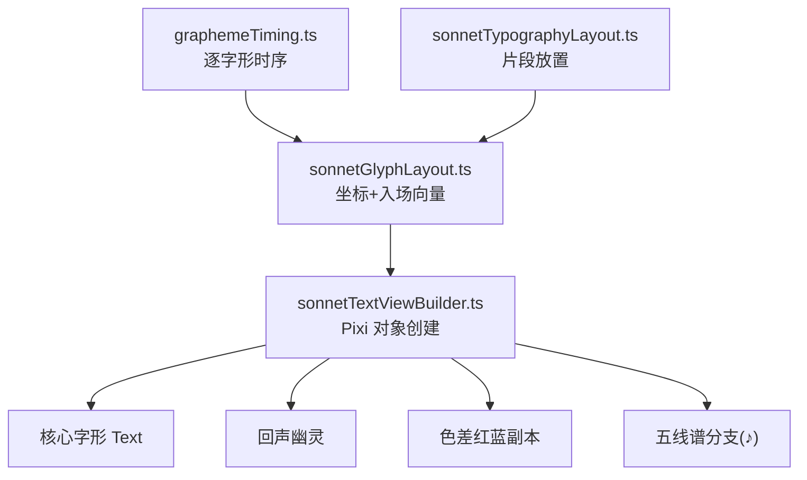
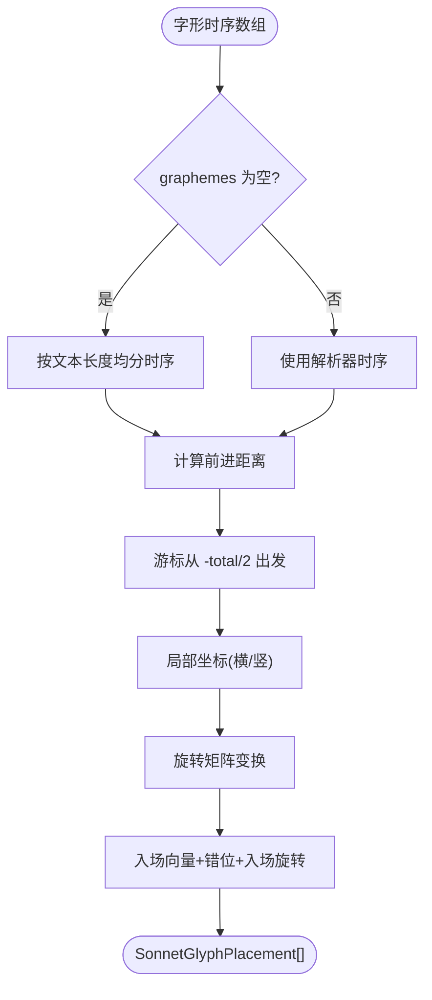
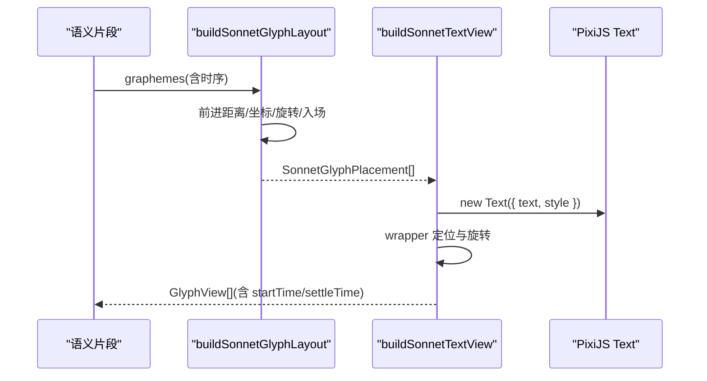
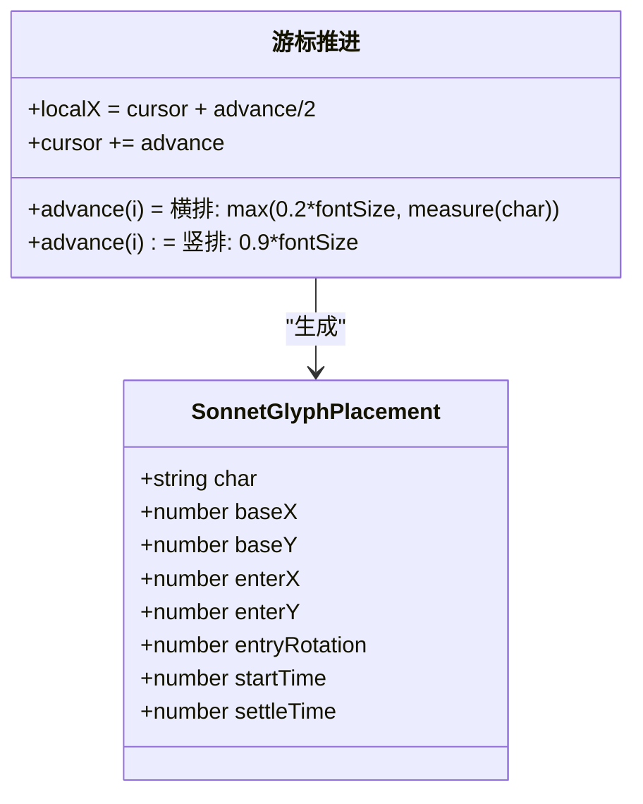
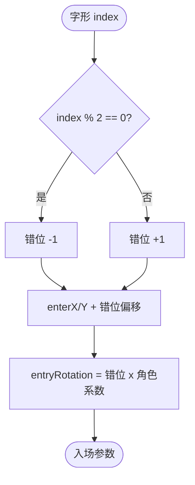
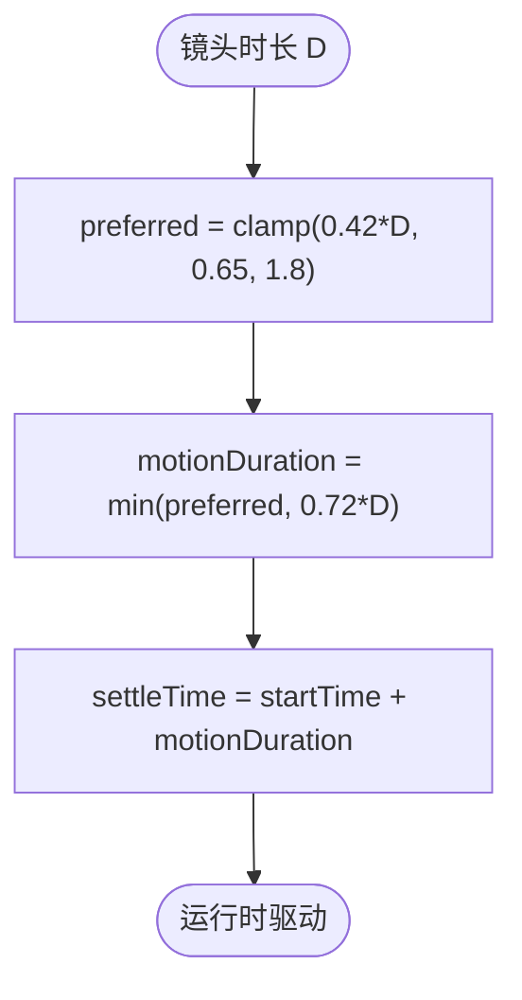
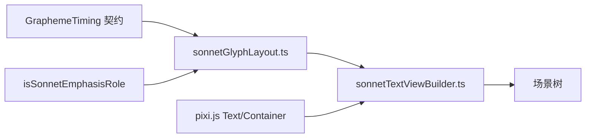

# 字形渲染系统

<cite>
**本文引用的文件**   
- [sonnetGlyphLayout.ts](file://src/components/visualizer/sonnet/sonnetGlyphLayout.ts)
- [sonnetTextViewBuilder.ts](file://src/components/visualizer/sonnet/sonnetTextViewBuilder.ts)
- [sonnetTypographyLayout.ts](file://src/components/visualizer/sonnet/sonnetTypographyLayout.ts)
- [sonnetStaffView.ts](file://src/components/visualizer/sonnet/sonnetStaffView.ts)
- [graphemeTiming.ts](file://src/utils/lyrics/graphemeTiming.ts)
- [sonnetGlyphLayout.test.ts](file://test/unit/visualizer/sonnetGlyphLayout.test.ts)
</cite>

## 目录
1. [引言](#引言)
2. [项目结构](#项目结构)
3. [核心组件](#核心组件)
4. [架构总览](#架构总览)
5. [详细组件分析](#详细组件分析)
6. [依赖关系分析](#依赖关系分析)
7. [性能考量](#性能考量)
8. [故障排查指南](#故障排查指南)
9. [结论](#结论)

## 引言
本文聚焦 Sonnet 模式的字形渲染系统，围绕以下目标展开：
- 解释字形生成流程：从解析器时序到 PixiJS Text 对象的完整映射。
- 说明字形排版：前进距离计算、竖排/横排坐标变换与入场向量生成。
- 阐述字形渲染的视觉组件：核心字形、回声幽灵、色差红蓝副本与五线谱特殊分支。
- 解释字形时序：startTime/settleTime 的推导与入场时长策略。
- 给出字形层面的优化与调试方法。

字形是 Sonnet 视觉系统的“像素级主角”：每个字符都是独立对象，拥有自己的坐标、时序与动画参数。

## 项目结构
- sonnetGlyphLayout.ts：字形布局纯函数层，负责把字形时序映射为坐标与入场向量。
- sonnetTextViewBuilder.ts：把字形布局结果实例化为 PixiJS 对象（Text、Container、混合模式）。
- sonnetTypographyLayout.ts：提供片段级放置数据（坐标、旋转、字体规格）。
- sonnetStaffView.ts：`♪` 字符的专用五线谱渲染分支。
- graphemeTiming.ts：解析器侧逐字形时间线的来源。

**图示来源**
- [sonnetGlyphLayout.ts:33-77](file://src/components/visualizer/sonnet/sonnetGlyphLayout.ts#L33-L77)
- [sonnetTextViewBuilder.ts:237-337](file://src/components/visualizer/sonnet/sonnetTextViewBuilder.ts#L237-L337)

**章节来源**
- [sonnetGlyphLayout.ts:9-25](file://src/components/visualizer/sonnet/sonnetGlyphLayout.ts#L9-L25)

## 核心组件
- `buildSonnetGlyphLayout`：输入片段、放置、字号、测量函数与运动窗口，输出 `SonnetGlyphPlacement[]`。
- `resolveSonnetGlyphMotionDuration`：由镜头时长推导入场动画时长（0.65-1.8s，且不超过镜头时长的 72%）。
- 字形前进距离：横排用测量宽度（下限 `fontSize * 0.2`），竖排固定 `fontSize * 0.9`。
- 入场向量：继承片段入场方向，叠加奇偶错位与入场旋转。
- `♪` 分支：`buildSonnetStaffView` 生成完整五线谱视图并复用引导线系统。

**章节来源**
- [sonnetGlyphLayout.ts:27-31](file://src/components/visualizer/sonnet/sonnetGlyphLayout.ts#L27-L31)
- [sonnetGlyphLayout.ts:50-76](file://src/components/visualizer/sonnet/sonnetGlyphLayout.ts#L50-L76)

## 架构总览
字形渲染分两阶段：布局阶段（纯计算）与构建阶段（对象创建）。布局阶段对每个字形执行“时序回退 → 前进距离 → 局部坐标 → 旋转变换 → 入场向量”的流水线；构建阶段则为每个字形创建核心 Text 与附属对象（回声、色差），并把时序写入 `GlyphView` 供运行时逐帧驱动。

**图示来源**
- [sonnetGlyphLayout.ts:40-76](file://src/components/visualizer/sonnet/sonnetGlyphLayout.ts#L40-L76)

**章节来源**
- [sonnetGlyphLayout.ts:33-77](file://src/components/visualizer/sonnet/sonnetGlyphLayout.ts#L33-L77)

## 详细组件分析

### 字形生成流程
完整链路为：`SonnetSemanticSegment.graphemes`（解析器时序）→ `buildSonnetGlyphLayout`（坐标）→ `buildSonnetTextView`（Text 对象）→ 场景树。当解析器没有提供逐字形时序时（例如纯音频行），布局层会按片段时长线性均分做回退，保证任何输入都有可动画的字形序列。

**图示来源**
- [sonnetGlyphLayout.ts:41-54](file://src/components/visualizer/sonnet/sonnetGlyphLayout.ts#L41-L54)
- [sonnetTextViewBuilder.ts:246-315](file://src/components/visualizer/sonnet/sonnetTextViewBuilder.ts#L246-L315)

**章节来源**
- [sonnetTextViewBuilder.ts:106-150](file://src/components/visualizer/sonnet/sonnetTextViewBuilder.ts#L106-L150)

### 字符映射与字形坐标
字符映射以 grapheme 为最小单位（正确处理组合字符与 emoji）：横排时每个字形前进距离为该字形测量的宽度，游标从 `-totalAdvance/2` 开始累进，字形中心位于 `cursor + advance/2`；竖排时前进距离固定 `fontSize * 0.9`，字形沿 y 轴推进。最终坐标经旋转矩阵变换到片段坐标系，确保旋转前后的打包边界与渲染边界一致。

**图示来源**
- [sonnetGlyphLayout.ts:50-70](file://src/components/visualizer/sonnet/sonnetGlyphLayout.ts#L50-L70)

**章节来源**
- [sonnetGlyphLayout.ts:50-70](file://src/components/visualizer/sonnet/sonnetGlyphLayout.ts#L50-L70)

### 字形变换与入场向量
每个字形的入场由三部分叠加：
- 基础入场：继承片段的 `enterX/enterY`（hero 为下方 15% 屏高）。
- 奇偶错位：横排字形交替 ±`0.24 * fontSize` 的 y 偏置，竖排交替 ±`0.28 * fontSize` 的 x 偏置，制造“抖动落位”的节奏。
- 入场旋转：奇偶交替 ±(hero 0.055 / support 0.035) 弧度，让落位带有轻微摇摆。

**图示来源**
- [sonnetGlyphLayout.ts:63-72](file://src/components/visualizer/sonnet/sonnetGlyphLayout.ts#L63-L72)

**章节来源**
- [sonnetGlyphLayout.ts:56-76](file://src/components/visualizer/sonnet/sonnetGlyphLayout.ts#L56-L76)

### 字形时序：startTime 与 settleTime
字形入场时长由 `resolveSonnetGlyphMotionDuration` 决定：优先 `镜头时长 * 0.42`，夹在 0.65-1.8 秒之间，并且永不超过镜头时长的 72%——保证极短镜头里字形也能完成落位。`settleTime = startTime + motionDuration` 即字形“稳定”的时刻，运行时的入场动画、回声与色差都以这两个时间点分段。所有字形与解析器时间戳对齐（`startTime = grapheme.startTime`），因此歌词高亮与字形动画天然同步。

**图示来源**
- [sonnetGlyphLayout.ts:27-31](file://src/components/visualizer/sonnet/sonnetGlyphLayout.ts#L27-L31)
- [sonnetGlyphLayout.ts:64-65](file://src/components/visualizer/sonnet/sonnetGlyphLayout.ts#L64-L65)

**章节来源**
- [sonnetGlyphLayout.ts:22-31](file://src/components/visualizer/sonnet/sonnetGlyphLayout.ts#L22-L31)

### 特殊分支：五线谱渲染
当片段文本严格等于 `♪` 时，跳过常规字形创建，改为调用 `buildSonnetStaffView` 生成五线谱视图（包含谱线与音符元素），并单独补偿相机跟踪字形集合（`trackingGlyphs: [staffView]`），保证音符视图也能被焦点系统跟踪。

**章节来源**
- [sonnetTextViewBuilder.ts:198-235](file://src/components/visualizer/sonnet/sonnetTextViewBuilder.ts#L198-L235)

## 依赖关系分析
- 字形布局依赖 `GraphemeTiming` 契约与 `isSonnetEmphasisRole` 角色判断，不依赖 PixiJS——这使字形几何可以脱离渲染环境单测（`sonnetGlyphLayout.test.ts`）。
- 视图构建器依赖 PixiJS 的 `Text/Container` 与混合模式扩展（`pixi.js/advanced-blend-modes`）。
- 字形前进距离测量与排版层共用相同测量口径（横排取实测宽度，竖排取 `fontSize * 0.9`）。

**图示来源**
- [sonnetGlyphLayout.ts:1-3](file://src/components/visualizer/sonnet/sonnetGlyphLayout.ts#L1-L3)
- [sonnetTextViewBuilder.ts:1-18](file://src/components/visualizer/sonnet/sonnetTextViewBuilder.ts#L1-L18)

**章节来源**
- [sonnetGlyphLayout.ts:1-10](file://src/components/visualizer/sonnet/sonnetGlyphLayout.ts#L1-L10)

## 性能考量
- 单字形对象粒度是“效果”与“成本”的平衡点：每字形一个 wrapper + 一个 Text，避免逐字形重建纹理（Pixi 按需渲染文本纹理）。
- 非文字对象统一标记：`isTextGlyph !== false` 的过滤让装饰与背景形状不参与字形动画与跟踪，减少热路径对象数。
- 纯函数布局：字形坐标在构建期一次算出，运行时只做插值，不重复测量。
- 测试保障：`sonnetGlyphLayout.test.ts` 锁定前进距离、错位与入场向量的数值边界。

**章节来源**
- [sonnetGlyphLayout.ts:50-76](file://src/components/visualizer/sonnet/sonnetGlyphLayout.ts#L50-L76)

## 故障排查指南
- 字形排布偏向一侧：检查 `totalAdvance` 是否正确累计（空字形会被过滤，但空白字符参与前进距离）。
- 竖排行距异常：竖排前进距离固定 `fontSize * 0.9`，若观察值与字号不符，检查字号是否经过 fitScale 缩放。
- 入场抖动过强：错位幅度与入场旋转由角色与奇偶共同决定；hero 的入场旋转是 support 的约 1.6 倍。
- settleTime 早于 startTime：实现中有 `Math.max(startTime, settleTime)` 保护；若仍异常，检查镜头时长是否为负。
- `♪` 未渲染成五线谱：确认文本是恰好的单字符 `♪`（无空白、无组合字符）。

**章节来源**
- [sonnetGlyphLayout.ts:64-74](file://src/components/visualizer/sonnet/sonnetGlyphLayout.ts#L64-L74)

## 结论
字形渲染系统把“逐字形时间线”这一输入抽象为可寻址、可动画、可测试的字形放置数据，再由视图构建器映射为带全套视觉附件的 PixiJS 对象。它严格保持“布局纯函数、构建无状态、运行时按时间驱动”的三层分工，是 Sonnet 逐字动画体验可靠性的根基。
