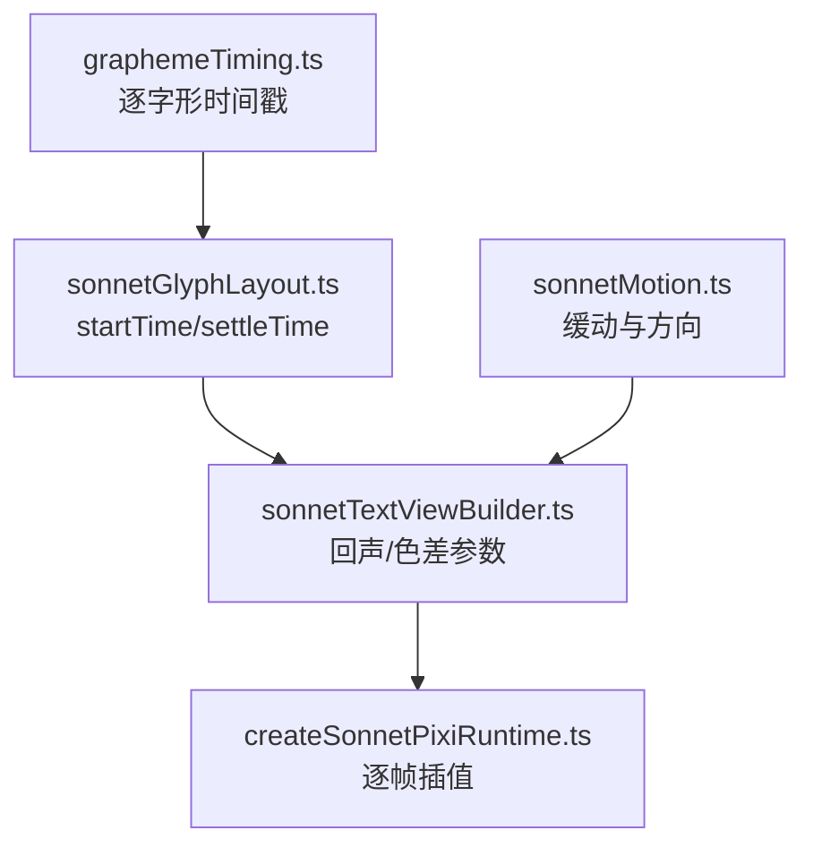
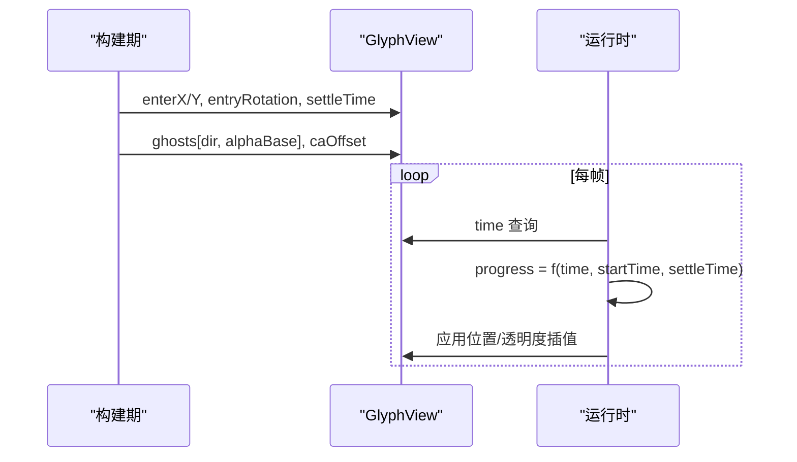
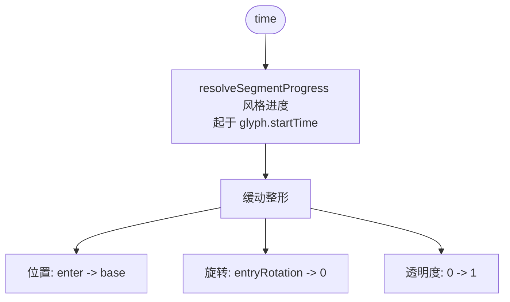
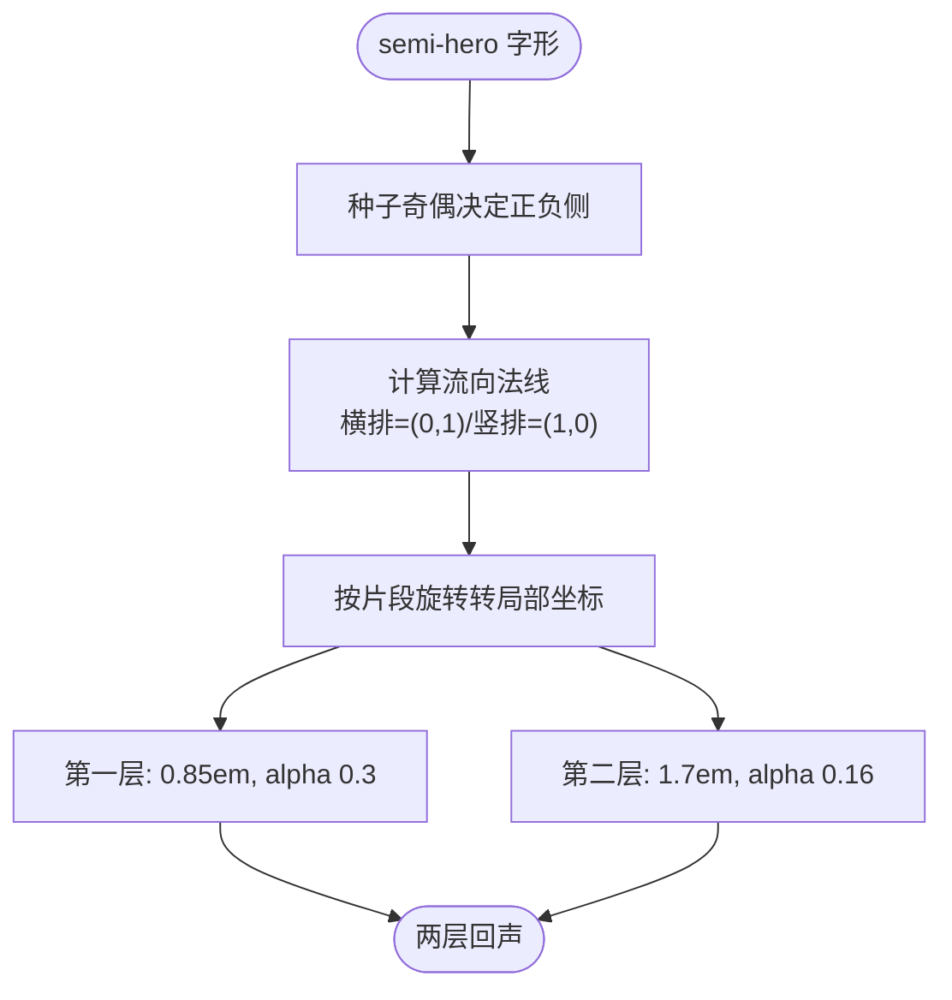
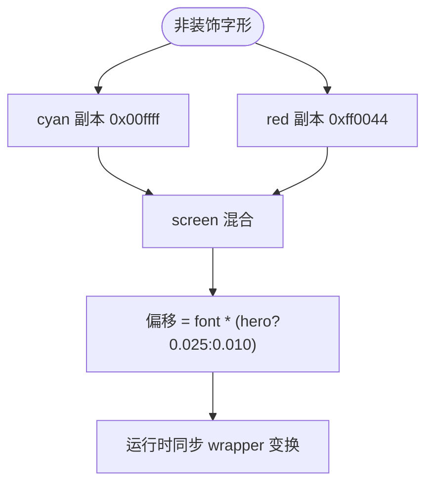
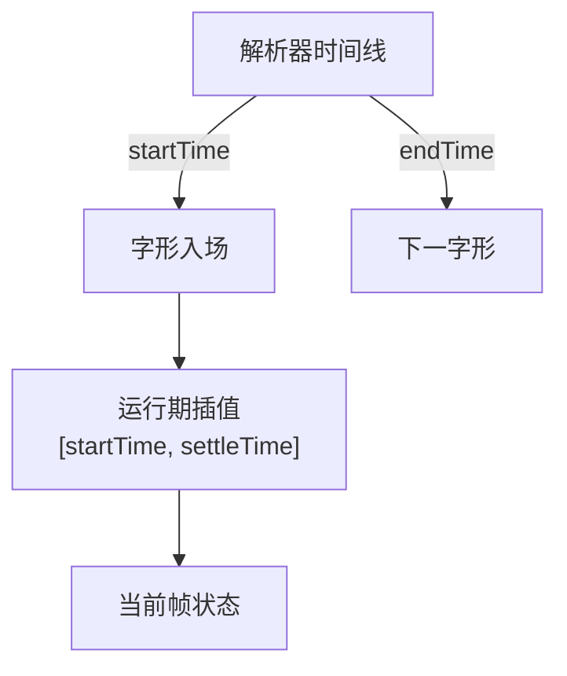
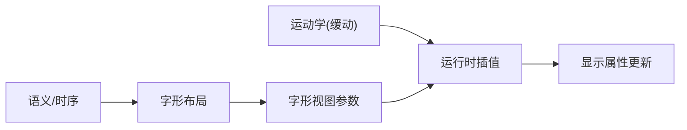

# 文本动画系统

<cite>
**本文引用的文件**   
- [sonnetTextViewBuilder.ts](file://src/components/visualizer/sonnet/sonnetTextViewBuilder.ts)
- [sonnetMotion.ts](file://src/components/visualizer/sonnet/sonnetMotion.ts)
- [sonnetGlyphLayout.ts](file://src/components/visualizer/sonnet/sonnetGlyphLayout.ts)
- [sonnetSemantic.ts](file://src/components/visualizer/sonnet/sonnetSemantic.ts)
- [graphemeTiming.ts](file://src/utils/lyrics/graphemeTiming.ts)
- [createSonnetPixiRuntime.ts](file://src/components/visualizer/sonnet/createSonnetPixiRuntime.ts)
</cite>

## 目录
1. [引言](#引言)
2. [项目结构](#项目结构)
3. [核心组件](#核心组件)
4. [架构总览](#架构总览)
5. [详细组件分析](#详细组件分析)
6. [依赖关系分析](#依赖关系分析)
7. [性能考量](#性能考量)
8. [故障排查指南](#故障排查指南)
9. [结论](#结论)

## 引言
本文聚焦 Sonnet 模式的文本动画系统，围绕以下目标展开：
- 解释入场动画：逐字出现、淡入与位置过渡的时间组织方式。
- 说明回声幽灵效果：semi-hero 拖尾副本的偏移方向、透明度衰减与持续时间。
- 阐述色差分散效果：红蓝通道副本、screen 混合与动态偏移策略。
- 解释时间轴同步：歌词时间戳到字形时间的映射与帧率无关性。
- 给出动画插值与性能优化方法。

文本动画系统让文字不只是“出现”，而是“以某种方式登场”——这是 Sonnet PV 风格的核心体验。

## 项目结构
- 文本动画参数在视图构建期生成（回声方向、色差偏移、入场向量），运行时逐帧只做插值。
- 入场时序来自 `GraphemeTiming`（解析器逐字形时间线），入场时长由 `resolveSonnetGlyphMotionDuration` 推导。
- 运行时（createSonnetPixiRuntime.ts）每帧遍历字形视图，以 `startTime/settleTime` 为界驱动动画。

**图示来源**
- [sonnetTextViewBuilder.ts:169-196](file://src/components/visualizer/sonnet/sonnetTextViewBuilder.ts#L169-L196)
- [sonnetGlyphLayout.ts:56-76](file://src/components/visualizer/sonnet/sonnetGlyphLayout.ts#L56-L76)

**章节来源**
- [sonnetTextViewBuilder.ts:24-56](file://src/components/visualizer/sonnet/sonnetTextViewBuilder.ts#L24-L56)

## 核心组件
- 入场三要素：起始透明度 0、入场向量（enterX/enterY）、入场旋转（entryRotation），在 `[startTime, settleTime]` 窗口内收敛。
- 回声幽灵 `GlyphGhostView`：两层描边副本，预计算 `dirX/dirY/alphaBase`。
- 色差副本：cyan（0x00ffff）与 red（0xff0044）屏幕混合副本，偏移随角色（hero 0.025 / 普通 0.010 字体大小）。
- 回声时长 `ghostDuration`：随镜头时长 0.4-0.7 秒之间取值。

**章节来源**
- [sonnetTextViewBuilder.ts:24-42](file://src/components/visualizer/sonnet/sonnetTextViewBuilder.ts#L24-L42)

## 架构总览
动画系统的数据流是“构建期预计算 + 运行期纯插值”：
1. 构建期：确定每个字形的入场向量、视觉副本的峰值参数（方向、透明度、偏移）。
2. 运行期：按当前时间与 `startTime/settleTime` 计算插值进度，缩放预计算的峰值即可得到当前帧状态。
这样运行时没有分支复杂的“状态机”，只有数值插值。

**图示来源**
- [sonnetTextViewBuilder.ts:317-337](file://src/components/visualizer/sonnet/sonnetTextViewBuilder.ts#L317-L337)
- [createSonnetPixiRuntime.ts:572-586](file://src/components/visualizer/sonnet/createSonnetPixiRuntime.ts#L572-L586)

**章节来源**
- [sonnetTextViewBuilder.ts:292-313](file://src/components/visualizer/sonnet/sonnetTextViewBuilder.ts#L292-L313)

## 详细组件分析

### 入场动画：逐字出现与位置过渡
每个字形独立入场：起始在 `baseX/enterX` 的偏移位置、旋转 `entryRotation`、alpha 0，在 `startTime → settleTime` 窗口内落位到 `baseX/baseY`、旋转归零、alpha 1。由于 `startTime` 直接取解析器的字形时间戳，歌词唱到哪个字，哪个字就开始入场；而入场时长被夹在镜头时长的 42%（0.65-1.8s，≤72% 镜头时长），保证了慢歌从容、快歌利落。

**图示来源**
- [sonnetGlyphLayout.ts:64-74](file://src/components/visualizer/sonnet/sonnetGlyphLayout.ts#L64-L74)
- [sonnetMotion.ts:62-65](file://src/components/visualizer/sonnet/sonnetMotion.ts#L62-L65)

**章节来源**
- [sonnetGlyphLayout.ts:27-31](file://src/components/visualizer/sonnet/sonnetGlyphLayout.ts#L27-L31)

### 回声幽灵效果
semi-hero 片段（次级强调）的每个字形携带两层空心描边副本：
- 方向：由片段种子的奇偶决定正负侧，沿“排版流向的法线方向”偏移（横排为 y 法线、竖排为 x 法线），经旋转矩阵变换到 wrapper 局部坐标。
- 距离：第一层 0.85 字体大小，第二层 1.7 倍，形成有层次的拖尾。
- 透明度：峰值 0.3 与 0.16，快速淡入淡出——观感是“一笔带过的残影”，不喧宾夺主。
- 时长：`min(0.7, max(0.4, 镜头时长*0.12+0.1))` 秒。

**图示来源**
- [sonnetTextViewBuilder.ts:169-196](file://src/components/visualizer/sonnet/sonnetTextViewBuilder.ts#L169-L196)
- [sonnetTextViewBuilder.ts:295-313](file://src/components/visualizer/sonnet/sonnetTextViewBuilder.ts#L295-L313)

**章节来源**
- [sonnetTextViewBuilder.ts:169-196](file://src/components/visualizer/sonnet/sonnetTextViewBuilder.ts#L169-L196)

### 色差分散效果
每个非装饰字形还会生成红蓝两个副本，挂在镜头共享的色差层（caLayer）上：
- 颜色：cyan `0x00ffff` 与 red `0xff0044`。
- 混合：`blendMode = 'screen'`，让副本只提亮不遮暗。
- 偏移：`caOffset = fontSize * (hero ? 0.025 : 0.010)`，hero 的偏移是普通字形的 2.5 倍。
- 透明度：hero 0.8 / 普通 0.5。
运行时逐帧把 wrapper 的变换拷贝给色差副本容器，副本与主体始终同形。

**图示来源**
- [sonnetTextViewBuilder.ts:256-288](file://src/components/visualizer/sonnet/sonnetTextViewBuilder.ts#L256-L288)

**章节来源**
- [sonnetTextViewBuilder.ts:256-288](file://src/components/visualizer/sonnet/sonnetTextViewBuilder.ts#L256-L288)

### 时间轴同步与插值
时间轴同步的根是解析器的逐字形时间线：`buildLineGraphemeTimeline` 输出每个字形的 `startTime/endTime`，布局层直接把 `grapheme.startTime` 作为字形入场起点，`settleTime = startTime + motionDuration` 作为落位终点。运行时的每帧计算等价于在 `[startTime, settleTime]` 上的归一化插值，因此：
- 帧率无关：掉帧后下一帧直接计算新时间的插值结果；
- seek 精确：直接跳到任意时间，入场状态由时间决定；
- 歌词同步：视觉入场与音频/歌词高亮共享同一时间戳源。

**图示来源**
- [sonnetSemantic.ts:20-41](file://src/components/visualizer/sonnet/sonnetSemantic.ts#L20-L41)
- [sonnetGlyphLayout.ts:40-54](file://src/components/visualizer/sonnet/sonnetGlyphLayout.ts#L40-L54)

**章节来源**
- [sonnetSemantic.ts:20-41](file://src/components/visualizer/sonnet/sonnetSemantic.ts#L20-L41)

## 依赖关系分析
- 动画系统消费时间线（时序）与运动学（缓动/方向），自身不产生随机性；所有“随机感”来自种子散列（`hashSonnetSeed`）。
- 运行时不修改视图参数，只读写每帧的显示属性（位置/旋转/alpha），视图对象是构建期不可变的参数容器。
- 色差层与文本层分离（`caLayer` 是 textLayer 的底层子容器），保证色差副本不遮挡字形本体。

**图示来源**
- [sonnetTextViewBuilder.ts:90-96](file://src/components/visualizer/sonnet/sonnetTextViewBuilder.ts#L90-L96)

**章节来源**
- [sonnetTextViewBuilder.ts:90-96](file://src/components/visualizer/sonnet/sonnetTextViewBuilder.ts#L90-L96)

## 性能考量
- 预计算原则：回声方向、峰值透明度、色差偏移全部在构建期算好，运行期只乘缩放系数（注释明确：运行期仅按包络缩放）。
- 峰值上限：回声 alpha 峰值 0.3/0.16、色差 alpha 0.8/0.5 使副本可被低成本混合，无额外滤镜。
- 对象隔离：色差容器独立于字形 wrapper，可以整体跟随变换而无需逐副本更新。
- 批量驱动：运行时按字形数组线性遍历，无递归查询；窗口外的字形可跳过插值。

**章节来源**
- [sonnetTextViewBuilder.ts:26-31](file://src/components/visualizer/sonnet/sonnetTextViewBuilder.ts#L26-L31)
- [sonnetTextViewBuilder.ts:292-296](file://src/components/visualizer/sonnet/sonnetTextViewBuilder.ts#L292-L296)

## 故障排查指南
- 入场突兀（瞬间出现）：检查字形是否缺少 enter 向量或 `settleTime == startTime`（镜头时长过短会触发保护）。
- 回声方向反了：方向由种子奇偶决定，若整体观感不协调应调整种子输入（文本+偏移），而不是硬编码方向。
- 色差副本错位：运行时必须每帧同步 wrapper 变换到 caWrapper；若出现静止错位，检查同步逻辑。
- 回声在竖排中横向漂移：法线方向在竖排为 x 轴，横排为 y 轴；方向异常时检查 `layoutDirection` 传入值。
- 歌词高亮与动画不同步：两者必须共享同一解析器时间线；检查是否使用了回退时序（均分）而非解析器时序。

**章节来源**
- [sonnetTextViewBuilder.ts:183-196](file://src/components/visualizer/sonnet/sonnetTextViewBuilder.ts#L183-L196)
- [sonnetGlyphLayout.ts:40-49](file://src/components/visualizer/sonnet/sonnetGlyphLayout.ts#L40-L49)

## 结论
Sonnet 文本动画系统把“构建期预计算 + 运行期插值”的结构贯彻到底：入场、回声、色差三类效果全部以参数形式随视图对象固化，运行时仅按绝对时间插值。它与解析器时间线天然对齐，获得了帧率无关、seek 安全、歌词同步的确定性动画品质，是 Sonnet 逐字演出效果的核心实现。
