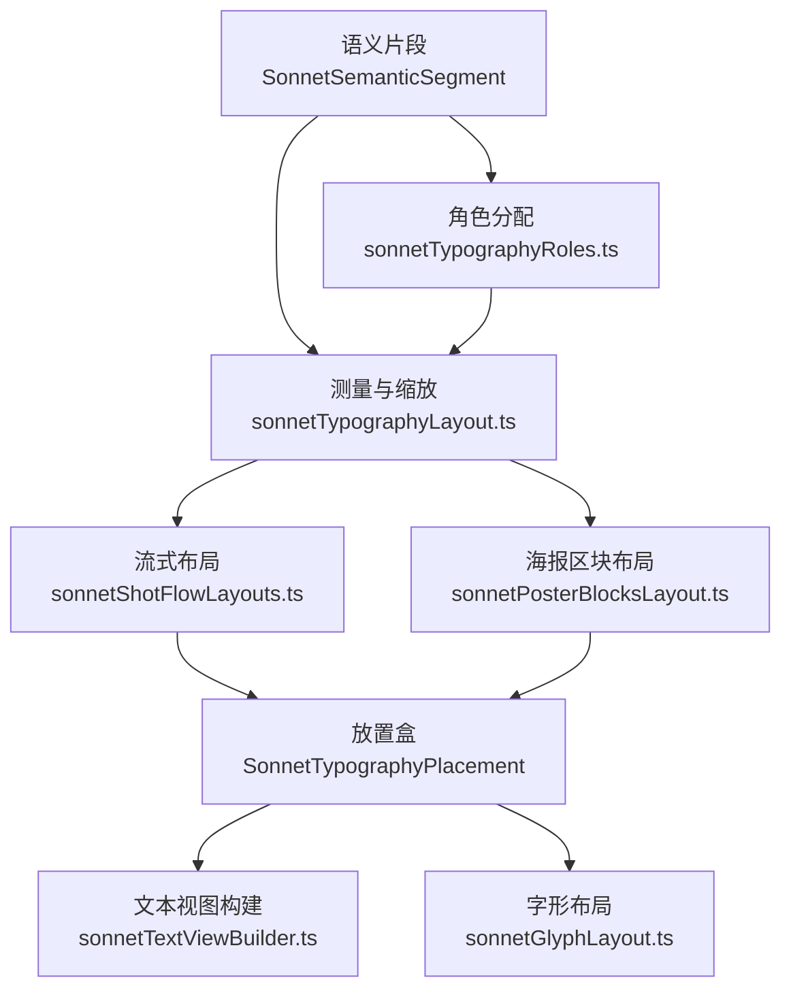
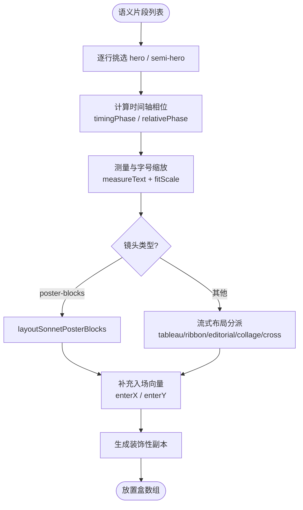
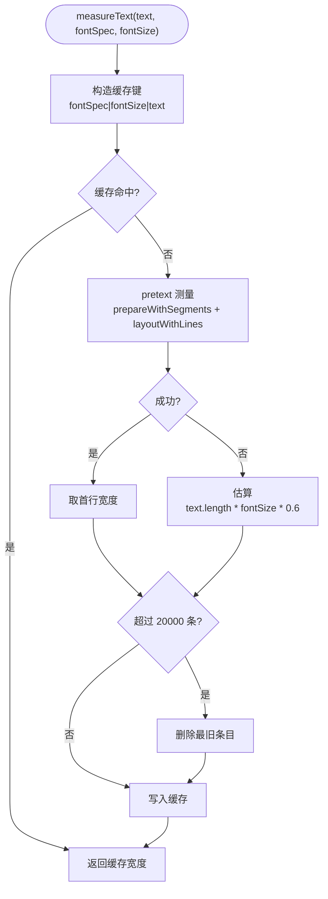
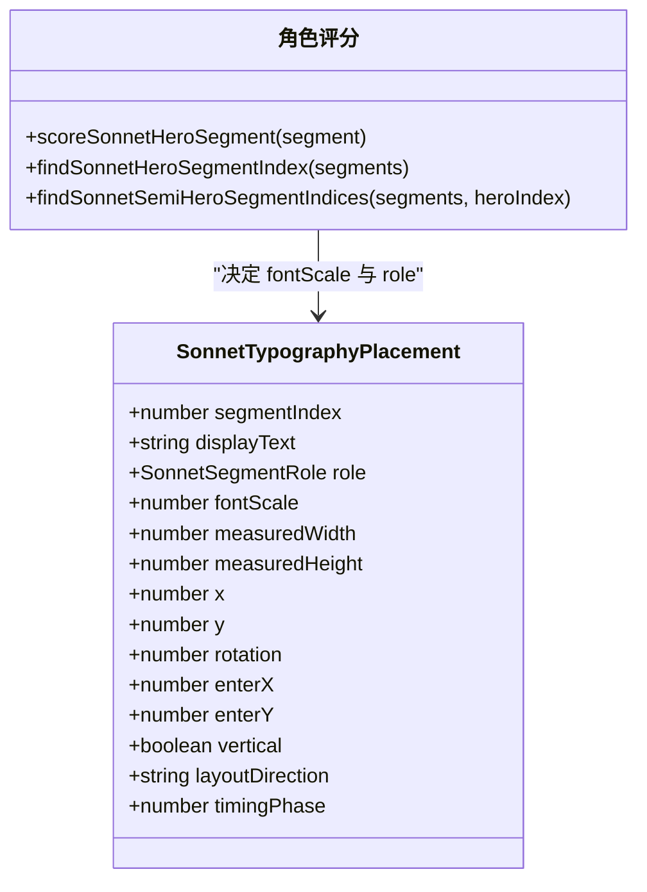
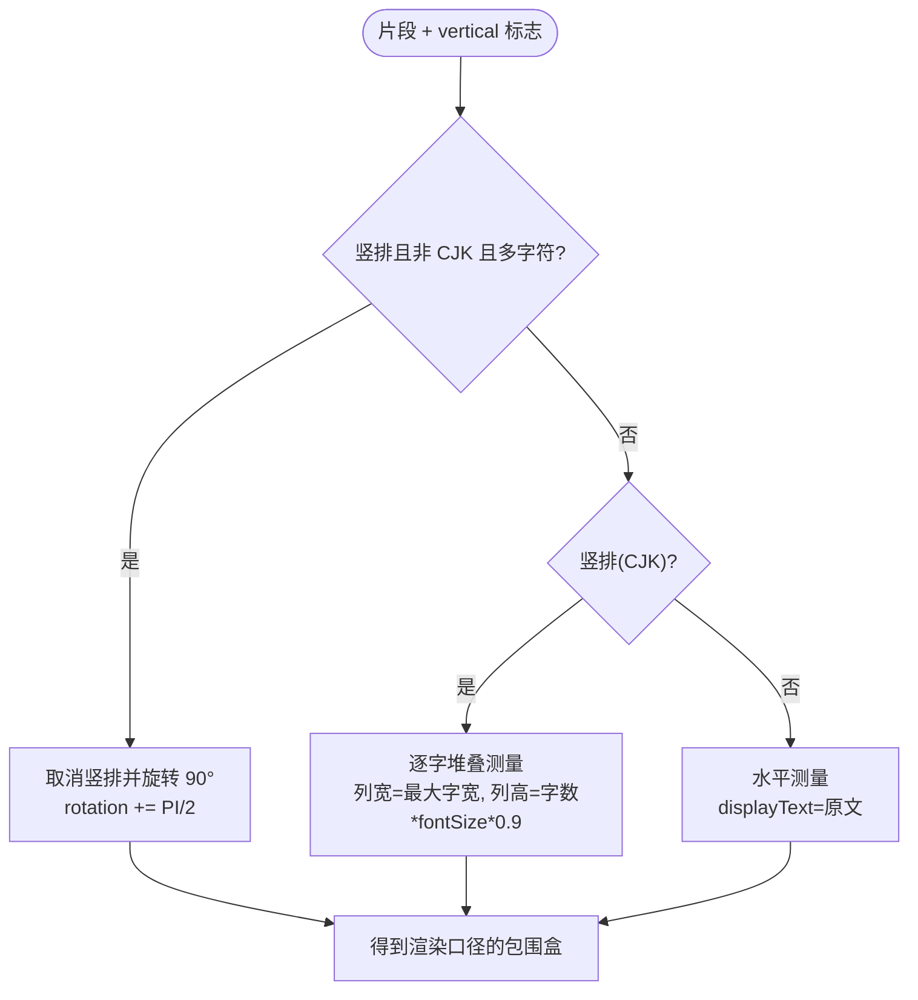
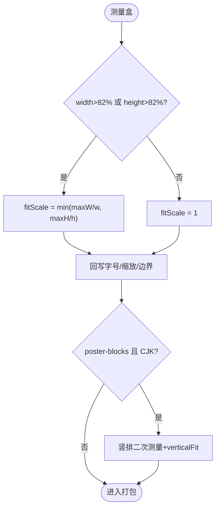
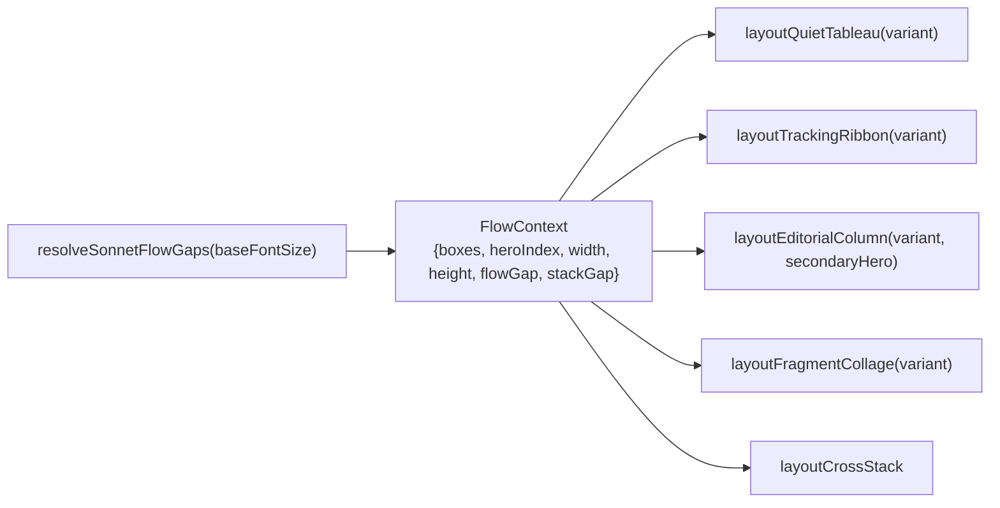
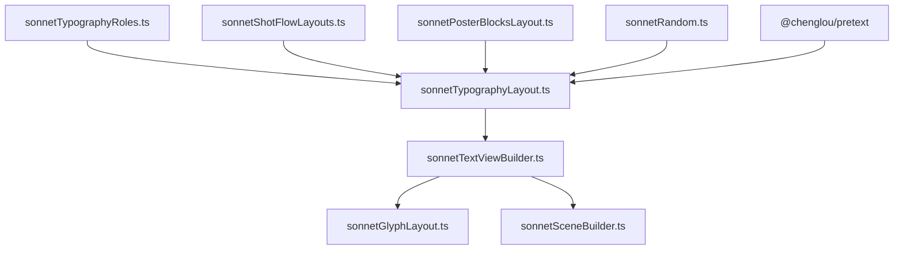

# 文本布局算法

<cite>
**本文引用的文件**   
- [sonnetTypographyLayout.ts](file://src/components/visualizer/sonnet/sonnetTypographyLayout.ts)
- [sonnetTextViewBuilder.ts](file://src/components/visualizer/sonnet/sonnetTextViewBuilder.ts)
- [sonnetTypographyRoles.ts](file://src/components/visualizer/sonnet/sonnetTypographyRoles.ts)
- [sonnetGlyphLayout.ts](file://src/components/visualizer/sonnet/sonnetGlyphLayout.ts)
- [sonnetShotFlowLayouts.ts](file://src/components/visualizer/sonnet/sonnetShotFlowLayouts.ts)
- [sonnetPosterBlocksLayout.ts](file://src/components/visualizer/sonnet/sonnetPosterBlocksLayout.ts)
- [types.ts](file://src/components/visualizer/sonnet/types.ts)
</cite>

## 目录
1. [引言](#引言)
2. [项目结构](#项目结构)
3. [核心组件](#核心组件)
4. [架构总览](#架构总览)
5. [详细组件分析](#详细组件分析)
6. [依赖关系分析](#依赖关系分析)
7. [性能考量](#性能考量)
8. [故障排查指南](#故障排查指南)
9. [结论](#结论)

## 引言
本文聚焦 Sonnet 模式文本渲染引擎中的布局算法层，围绕以下目标展开：
- 解释基于 `@chenglou/pretext` 的文本测量与分割机制，包括字形前进距离与行布局计算。
- 说明排版布局的整体流程：从语义片段到测量盒，再到按镜头类型的布局分配。
- 阐述对齐方式、间距计算与文本流向控制（水平/垂直）的具体实现。
- 解释文本边界检测与溢出处理：82% 视口适配、fitScale 缩放与海报区块的竖排二次测量。
- 给出布局性能优化策略（测量缓存、批量计算、确定性变体）与调试技巧。

布局算法是 Sonnet 场景构建的第一步：它把歌词语义片段转换为带有屏幕坐标、旋转、缩放与入场向量的“放置盒”，后续的字形渲染与动画都基于这些放置数据执行。

## 项目结构
Sonnet 文本布局相关文件职责如下：
- sonnetTypographyLayout.ts：测量与排版主入口，负责角色分配、字号缩放、视口适配与按镜头类型分发布局。
- sonnetShotFlowLayouts.ts：非海报镜头的流式布局实现（editorial-column、tracking-ribbon、quiet-tableau、fragment-collage、cross-stack）。
- sonnetPosterBlocksLayout.ts：poster-blocks 镜头的区块式布局实现。
- sonnetTypographyRoles.ts：hero / semi-hero 角色的选取评分与字重解析。
- sonnetTextViewBuilder.ts：把放置盒转为 PixiJS 文本视图，并创建引导线、框架装饰与背景几何。
- sonnetGlyphLayout.ts：把逐字形时序映射为最终字形坐标与入场向量。

**图示来源**
- [sonnetTypographyLayout.ts:116-125](file://src/components/visualizer/sonnet/sonnetTypographyLayout.ts#L116-L125)
- [sonnetTypographyRoles.ts:33-47](file://src/components/visualizer/sonnet/sonnetTypographyRoles.ts#L33-L47)
- [sonnetShotFlowLayouts.ts:37-76](file://src/components/visualizer/sonnet/sonnetShotFlowLayouts.ts#L37-L76)
- [sonnetPosterBlocksLayout.ts:262-280](file://src/components/visualizer/sonnet/sonnetPosterBlocksLayout.ts#L262-L280)

**章节来源**
- [sonnetTypographyLayout.ts:39-67](file://src/components/visualizer/sonnet/sonnetTypographyLayout.ts#L39-L67)
- [sonnetTextViewBuilder.ts:20-56](file://src/components/visualizer/sonnet/sonnetTextViewBuilder.ts#L20-L56)

## 核心组件
- 测量缓存 measureText：以 `fontSpec|fontSize|text` 为键的记忆化文本宽度测量，FIFO 淘汰上限 20000 条。
- 角色评分体系：`scoreSonnetHeroSegment` 依据可见长度与持续时间对片段评分，选出 hero 与 semi-hero。
- 放置盒 SonnetTypographyPlacement：包含 `fontScale`、`measuredWidth/Height`、`x/y`、`rotation`、`enterX/enterY`、`vertical`、`timingPhase` 等字段。
- 流式布局族：`layoutQuietTableau`、`layoutTrackingRibbon`、`layoutEditorialColumn`、`layoutFragmentCollage`、`layoutCrossStack` 与共享的 `resolveSonnetFlowGaps`。
- 海报区块布局：`layoutSonnetPosterBlocks` 为 poster-blocks 镜头提供独立网格。
- 视口适配：82% 最大宽高约束与 `fitScale` 下行缩放，避免巨型文本溢出屏幕。

**章节来源**
- [sonnetTypographyLayout.ts:92-114](file://src/components/visualizer/sonnet/sonnetTypographyLayout.ts#L92-L114)
- [sonnetTypographyLayout.ts:288-326](file://src/components/visualizer/sonnet/sonnetTypographyLayout.ts#L288-L326)
- [sonnetTypographyLayout.ts:353-367](file://src/components/visualizer/sonnet/sonnetTypographyLayout.ts#L353-L367)

## 架构总览
布局算法的主流程在 `resolveSonnetTypographyLayout` 中完成，分为三个阶段：
1. 角色与时序准备：对每行歌词挑选 hero/semi-hero 片段，计算每个片段在整段时间轴中的相对相位 `timingPhase` 与相对相位 `relativePhase`。
2. 测量与适配：按镜头类型确定 hero/support 字号倍率，测量文本宽度，处理非 CJK 竖排旋转与 CJK 堆叠列，执行 82% 视口 fitScale。
3. 布局打包：poster-blocks 走 `layoutSonnetPosterBlocks`，其余镜头共享流式布局入口，最终补充 hero 的入场向量与装饰性副本。

**图示来源**
- [sonnetTypographyLayout.ts:126-177](file://src/components/visualizer/sonnet/sonnetTypographyLayout.ts#L126-L177)
- [sonnetTypographyLayout.ts:179-351](file://src/components/visualizer/sonnet/sonnetTypographyLayout.ts#L179-L351)
- [sonnetTypographyLayout.ts:353-407](file://src/components/visualizer/sonnet/sonnetTypographyLayout.ts#L353-L407)

**章节来源**
- [sonnetTypographyLayout.ts:116-125](file://src/components/visualizer/sonnet/sonnetTypographyLayout.ts#L116-L125)

## 详细组件分析

### 文本测量与缓存
测量函数使用 `pretext` 的 `prepareWithSegments` 与 `layoutWithLines` 在无限行宽下测量单行宽度；异常时回退到 `text.length * fontSize * 0.6` 的估算。由于测量在“每行、每镜头、每段落”中反复发生，缓存采用完全自描述的键（字重、字号与字体都编码在 `fontSpec` 中），相同键的条目永不冲突；到达上限后按 FIFO 淘汰，因为重新计算的成本相同，策略只需约束内存。

**图示来源**
- [sonnetTypographyLayout.ts:86-114](file://src/components/visualizer/sonnet/sonnetTypographyLayout.ts#L86-L114)
- [sonnetTextViewBuilder.ts:97-104](file://src/components/visualizer/sonnet/sonnetTextViewBuilder.ts#L97-L104)

**章节来源**
- [sonnetTypographyLayout.ts:92-114](file://src/components/visualizer/sonnet/sonnetTypographyLayout.ts#L92-L114)

### 角色分配与字号体系
hero/semi-hero 的选取完全确定：先按可见字符数与持续时间加权评分选出 hero，再在满足间距与分数阈值约束下挑选对侧 semi-hero，保证构图平衡。字号倍率由镜头类型驱动：type-impact 的 hero 达到 5.5 倍，editorial-column 在 Logo Badge 变体下达到 4.2 倍；semi-hero 取 `support * 1.35` 与 `hero * 0.72` 的较大值，避免与 hero 差距过大。

**图示来源**
- [sonnetTypographyLayout.ts:41-56](file://src/components/visualizer/sonnet/sonnetTypographyLayout.ts#L41-L56)
- [sonnetTypographyRoles.ts:27-108](file://src/components/visualizer/sonnet/sonnetTypographyRoles.ts#L27-L108)

**章节来源**
- [sonnetTypographyLayout.ts:179-240](file://src/components/visualizer/sonnet/sonnetTypographyLayout.ts#L179-L240)
- [sonnetTypographyRoles.ts:1-115](file://src/components/visualizer/sonnet/sonnetTypographyRoles.ts#L1-L115)

### 文本流向控制：横排、竖排与 CJK 堆叠
流向处理有三条分支：
- 水平布局：默认分支，`displayText` 即原始文本，`measuredHeight` 取 `fontSize * 1.2`。
- CJK 竖排堆叠：`verticalText` 将每个字形换行拼接为单列文本；测量时逐字取最大宽度作为列宽，列高按 `fontSize * 0.9` 的字形前进节奏累计，与字形渲染器保持一致。
- 非 CJK 竖排旋转：当竖排方向下片段为多字符非 CJK 文本时，改为水平测量后整体旋转 `Math.PI / 2`，使用“翻转后的包围盒”参与打包，避免渲染后与打包边界不一致。

**图示来源**
- [sonnetTypographyLayout.ts:73-84](file://src/components/visualizer/sonnet/sonnetTypographyLayout.ts#L73-L84)
- [sonnetTypographyLayout.ts:242-286](file://src/components/visualizer/sonnet/sonnetTypographyLayout.ts#L242-L286)

**章节来源**
- [sonnetTypographyLayout.ts:73-84](file://src/components/visualizer/sonnet/sonnetTypographyLayout.ts#L73-L84)

### 边界检测与视口适配
测量完成后执行两级边界处理：
- 通用 fitScale：当宽度超过视口 82% 或高度超过视口 82% 时，计算统一缩放系数，同步回写 `targetFontSize`、`fontScale` 与测量宽高，保证后续打包使用缩放后的真实边界。
- 海报区块竖排预测量：poster-blocks 镜头下 CJK 片段会被翻转为竖列，布局前需要单独计算该朝向的列宽列高与 `verticalFontScale`，避免打包阶段使用水平边界导致的错位。

**图示来源**
- [sonnetTypographyLayout.ts:288-326](file://src/components/visualizer/sonnet/sonnetTypographyLayout.ts#L288-L326)

**章节来源**
- [sonnetTypographyLayout.ts:288-326](file://src/components/visualizer/sonnet/sonnetTypographyLayout.ts#L288-L326)

### 间距计算与打包策略
非海报分支共享 `resolveSonnetFlowGaps` 返回的 `flowGap` 与 `stackGap` 两个间距常数，由基础字号派生；各镜头布局函数在统一上下文上执行，保证间距度量一致。hero 盒在打包后统一获得向下 15% 屏高的入场向量，装饰副本则从屏幕外进入，并提供反向偏移与旋转，形成 PV 风格的层次感。

**图示来源**
- [sonnetTypographyLayout.ts:353-367](file://src/components/visualizer/sonnet/sonnetTypographyLayout.ts#L353-L367)
- [sonnetShotFlowLayouts.ts:37-76](file://src/components/visualizer/sonnet/sonnetShotFlowLayouts.ts#L37-L76)

**章节来源**
- [sonnetTypographyLayout.ts:353-407](file://src/components/visualizer/sonnet/sonnetTypographyLayout.ts#L353-L407)

### 自定义布局规则的扩展方法
新增镜头布局的推荐步骤：
1. 在 types.ts 的 `SonnetShotKind` 中添加新镜头类型，并在 `SONNET_SHOT_KINDS` 中注册。
2. 在 sonnetTypographyLayout.ts 的测量分支中定义该镜头的 hero/support 字号倍率与竖排策略。
3. 在新的布局模块（或 sonnetShotFlowLayouts.ts）中实现打包函数，输出 `x/y/rotation`；若需要新间距，扩展 `resolveSonnetFlowGaps`。
4. 在分派逻辑中接入新布局函数，并为其分配确定性变体种子（参考 `layoutVariantSeed`、`posterLayoutSeed`）。
5. 通过 `DEBUG_SONNET_MEASURED_BOUNDS` 打开测量盒叠加验证打包边界。

**章节来源**
- [sonnetTypographyLayout.ts:152-177](file://src/components/visualizer/sonnet/sonnetTypographyLayout.ts#L152-L177)
- [sonnetTypographyLayout.ts:355-367](file://src/components/visualizer/sonnet/sonnetTypographyLayout.ts#L355-L367)

## 依赖关系分析
- sonnetTypographyLayout.ts 依赖 sonnetTypographyRoles.ts（角色）、sonnetShotFlowLayouts.ts（流式布局）、sonnetPosterBlocksLayout.ts（海报布局）、sonnetRandom.ts（种子散列）与 `@chenglou/pretext`（测量）。
- sonnetTextViewBuilder.ts 复用放置盒并调用 sonnetGlyphLayout.ts 生成字形坐标；其测量函数是独立实现，用于字形前进距离。
- 布局输出被场景构建器（sonnetSceneBuilder.ts）消费，最终进入运行时逐帧更新。

**图示来源**
- [sonnetTypographyLayout.ts:1-25](file://src/components/visualizer/sonnet/sonnetTypographyLayout.ts#L1-L25)
- [sonnetTextViewBuilder.ts:1-18](file://src/components/visualizer/sonnet/sonnetTextViewBuilder.ts#L1-L18)

**章节来源**
- [sonnetTypographyLayout.ts:1-37](file://src/components/visualizer/sonnet/sonnetTypographyLayout.ts#L1-L37)

## 性能考量
- 测量缓存：`MEASURE_CACHE_LIMIT = 20000` 的 FIFO 缓存消除了同屏重复测量开销，这是场景构建成本的主要来源。
- 确定性变体：布局变体由文本内容派生的种子（`layoutVariantSeed`、`posterLayoutSeed`）驱动，无需随机数发生器，重复构建结果稳定，可安全缓存整棵场景树。
- 边界一次收敛：fitScale 与竖排二次测量都在布局阶段完成，运行时不再重复测量，避免逐帧成本。
- 批量输出：所有放置盒一次性返回数组，调用方可批量创建 PixiJS 对象，减少布局抖动。

**章节来源**
- [sonnetTypographyLayout.ts:86-114](file://src/components/visualizer/sonnet/sonnetTypographyLayout.ts#L86-L114)
- [sonnetTypographyLayout.ts:152-158](file://src/components/visualizer/sonnet/sonnetTypographyLayout.ts#L152-L158)

## 故障排查指南
- 文本溢出屏幕：检查对应镜头是否正确执行 fitScale 分支；确认 `width/height` 传入的是最新画布尺寸。
- 竖排文字与打包错位：确认 CJK 竖排使用了逐字堆叠测量（列高按 `fontSize * 0.9`），非 CJK 竖排走了旋转分支且打包使用旋转后的包围盒。
- 文本换行异常：`measureText` 的异常回退会降低精度，检查 `fontFamily/fontSpec` 是否包含未加载的字体。
- hero 缺失：当所有片段都不是 `isWordLike` 或可见长度为 0 时，hero 会退化到索引 0；检查语义分段输入。
- 布局不稳定（同一句两次不一致）：确认没有在布局路径引入 `Math.random`，所有随机量必须来自种子散列（`hashSonnetSeed`）。

**章节来源**
- [sonnetTypographyLayout.ts:95-114](file://src/components/visualizer/sonnet/sonnetTypographyLayout.ts#L95-L114)
- [sonnetTypographyRoles.ts:33-47](file://src/components/visualizer/sonnet/sonnetTypographyRoles.ts#L33-L47)

## 结论
Sonnet 的文本布局算法以“测量缓存 + 角色评分 + 镜头化打包 + 视口适配”四层结构实现了确定性、可寻址的排版系统。它把 PV 风格的高张力排版抽象为可扩展的布局函数族，同时通过测量缓存与一次性边界收敛把场景构建成本控制在合理范围。新增镜头时只需遵循角色、测量、打包三段式扩展点即可获得与内置镜头一致的调试与性能保障。
