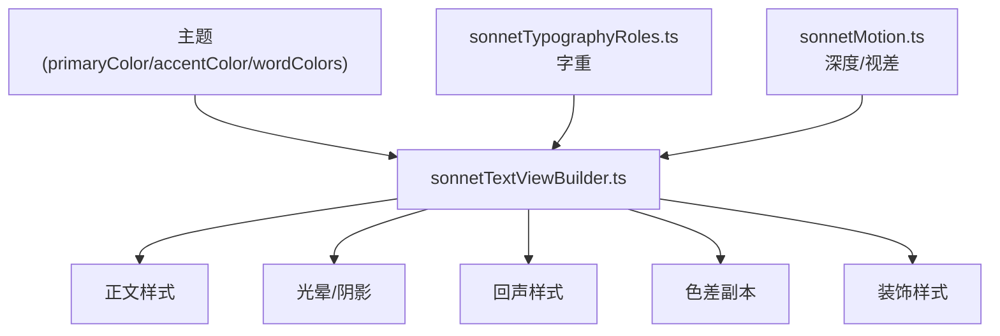
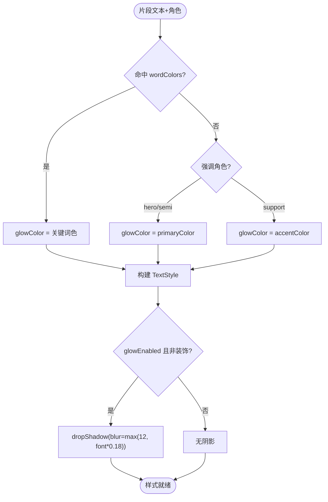
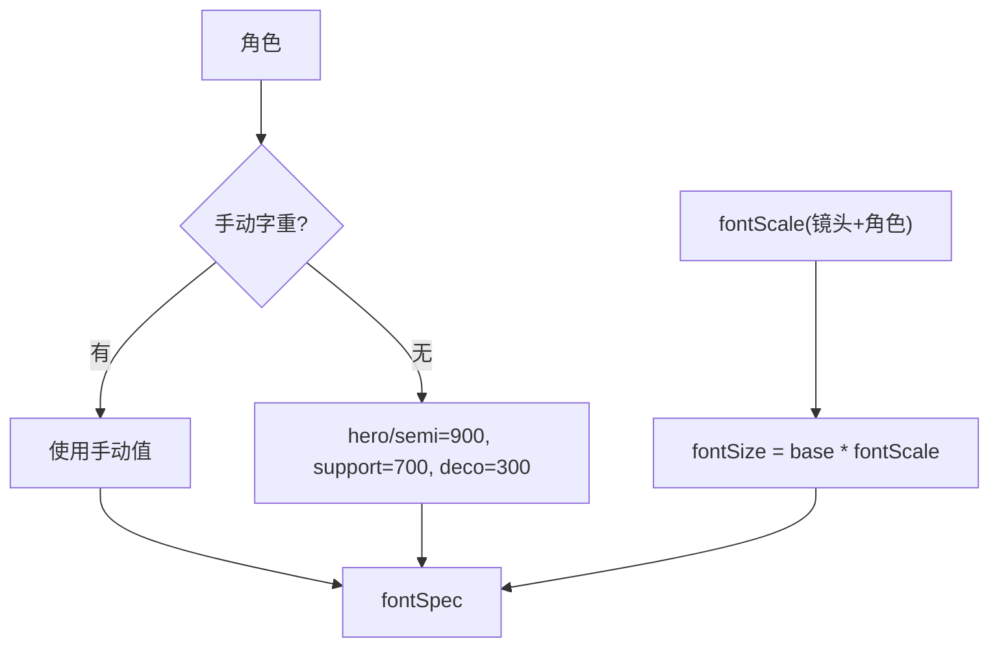
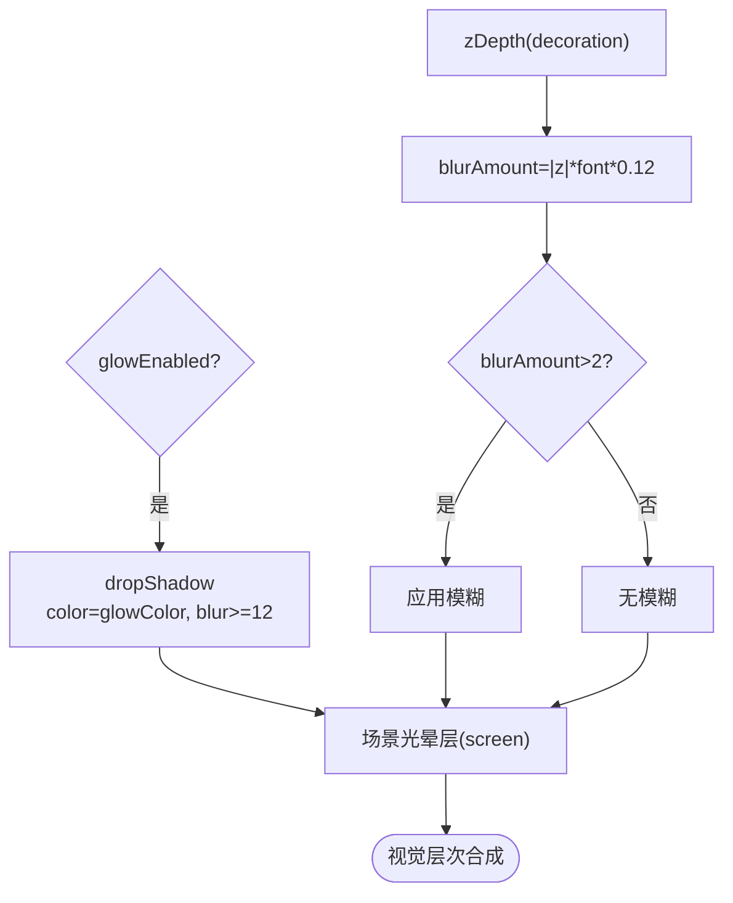
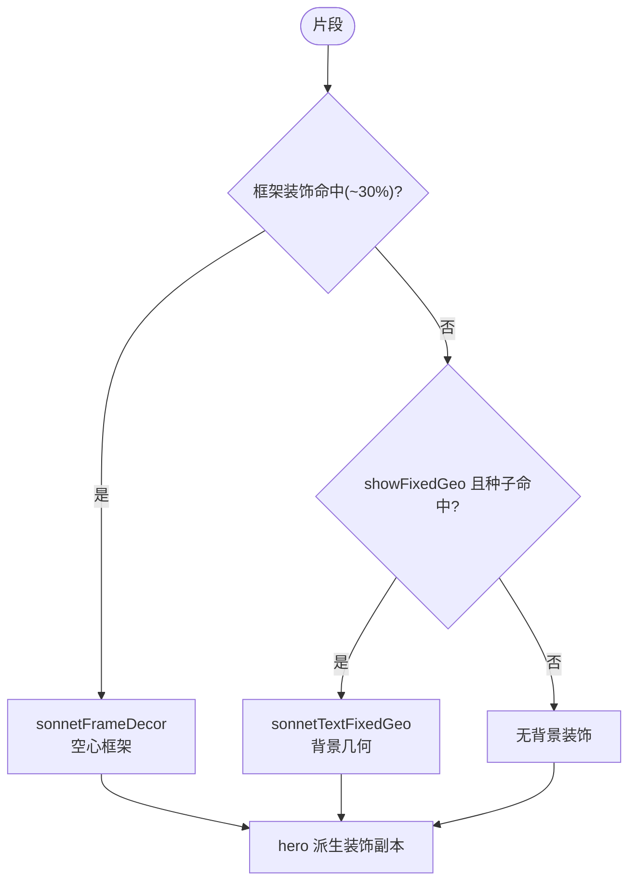
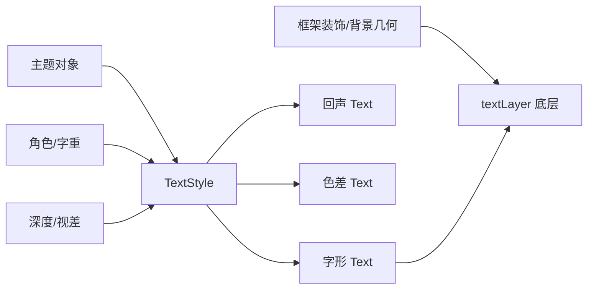

# 文本样式系统

<cite>
**本文引用的文件**   
- [sonnetTextViewBuilder.ts](file://src/components/visualizer/sonnet/sonnetTextViewBuilder.ts)
- [sonnetTypographyRoles.ts](file://src/components/visualizer/sonnet/sonnetTypographyRoles.ts)
- [sonnetMotion.ts](file://src/components/visualizer/sonnet/sonnetMotion.ts)
- [sonnetFrameDecor.ts](file://src/components/visualizer/sonnet/sonnetFrameDecor.ts)
- [sonnetTextFixedGeo.ts](file://src/components/visualizer/sonnet/sonnetTextFixedGeo.ts)
- [sonnetTypographyLayout.ts](file://src/components/visualizer/sonnet/sonnetTypographyLayout.ts)
- [types.ts](file://src/types.ts)
</cite>

## 目录
1. [引言](#引言)
2. [项目结构](#项目结构)
3. [核心组件](#核心组件)
4. [架构总览](#架构总览)
5. [详细组件分析](#详细组件分析)
6. [依赖关系分析](#依赖关系分析)
7. [性能考量](#性能考量)
8. [故障排查指南](#故障排查指南)
9. [结论](#结论)

## 引言
本文聚焦 Sonnet 模式的文本样式系统，围绕以下目标展开：
- 解释样式继承机制：主题颜色、字重与字号如何按角色动态应用。
- 说明关键词高亮与颜色策略：正文色、光晕色与强调色的分工。
- 阐述阴影与发光效果：drop shadow 配置、光晕层强度与时序。
- 解释装饰性样式：透明填充 + 描边的 decoration 角色、框架装饰与随机背景几何。
- 给出半透明视觉层次（z 深度视差）与样式性能优化方法。

文本样式系统负责回答一个问题：“同一句话里的每个字，为什么长成这样？”

## 项目结构
- sonnetTextViewBuilder.ts：样式创建的唯一入口，构造 `TextStyle`、`ghostStyle` 与色差副本样式。
- sonnetTypographyRoles.ts：字重解析（900/700/300）与角色判定。
- sonnetMotion.ts：`resolveSonnetSegmentDepth` 决定装饰片段的视差深度。
- sonnetFrameDecor.ts / sonnetTextFixedGeo.ts：框架装饰与背景几何的样式化图形。
- sonnetTypographyLayout.ts：字号倍率体系（hero/support 及镜头差异）的来源。

**图示来源**
- [sonnetTextViewBuilder.ts:131-180](file://src/components/visualizer/sonnet/sonnetTextViewBuilder.ts#L131-L180)
- [sonnetTypographyRoles.ts:12-21](file://src/components/visualizer/sonnet/sonnetTypographyRoles.ts#L12-L21)

**章节来源**
- [sonnetTextViewBuilder.ts:131-167](file://src/components/visualizer/sonnet/sonnetTextViewBuilder.ts#L131-L167)

## 核心组件
- 颜色三元组：正文 `bodyColor = theme.primaryColor`；光晕 `glowColor` 取关键词色、或强调色（support）/主色（hero）。
- 关键词匹配：`theme.wordColors` 中词条与片段文本（忽略大小写）匹配即命中。
- 样式对象：主 `TextStyle`（含 dropShadow、stroke、padding）；echo `ghostStyle`（透明填充+描边）。
- 视差深度：`zDepth = resolveSonnetSegmentDepth(role)`，decoration 片段取 ±(0.5-1.3)，其余为 0。
- 模糊派生：`blurAmount = |zDepth| * fontSize * 0.12`，超过 2px 才启用模糊。

**章节来源**
- [sonnetTextViewBuilder.ts:131-166](file://src/components/visualizer/sonnet/sonnetTextViewBuilder.ts#L131-L166)

## 架构总览
样式系统的决策顺序是固定的：先定角色（hero/semi-hero/support/decoration），再由角色派生字重、颜色、描边与特效，再由主题开关（glowEnabled、wordColors）做最终修饰。每个片段只创建一个主样式对象，所有字形共享；副本样式（回声、色差）为半英雄或非装饰片段按需创建。

**图示来源**
- [sonnetTextViewBuilder.ts:131-167](file://src/components/visualizer/sonnet/sonnetTextViewBuilder.ts#L131-L167)

**章节来源**
- [sonnetTextViewBuilder.ts:131-167](file://src/components/visualizer/sonnet/sonnetTextViewBuilder.ts#L131-L167)

## 详细组件分析

### 样式继承：角色 → 字重 → 字号
样式继承不是 CSS 级联，而是显式的角色驱动：
- 字重：自动模式下 hero/semi-hero 为 900、support 为 700、decoration 为 300；用户手动字重（经 `normalizeFontWeight` 归一化）全局优先。
- 字号：`fontSize = baseFontSize * placement.fontScale`，fontScale 由镜头类型与角色共同决定（如 type-impact hero 为 5.5 倍）。
- 对齐：所有字形独立锚点 0.5、`align: 'center'`，对齐由布局阶段完成而非文本流。

**图示来源**
- [sonnetTypographyRoles.ts:12-21](file://src/components/visualizer/sonnet/sonnetTypographyRoles.ts#L12-L21)
- [sonnetTextViewBuilder.ts:114-143](file://src/components/visualizer/sonnet/sonnetTextViewBuilder.ts#L114-L143)

**章节来源**
- [sonnetTypographyRoles.ts:12-21](file://src/components/visualizer/sonnet/sonnetTypographyRoles.ts#L12-L21)

### 颜色策略与关键词高亮
颜色只有一个入口：主题。正文保持主色不参与高亮，色彩信息全部放在光晕/描边边缘：
- 关键词命中时，光晕取 `wordColors` 中定义的色值——这是用户可见的“歌词关键词变色”实现方式。
- 强调角色（hero/semi-hero）光晕取主色，support 取强调色，形成冷暖层次。
- decoration 片段填充透明、仅描边，用最少的墨水制造“影子文字”。

**章节来源**
- [sonnetTextViewBuilder.ts:131-143](file://src/components/visualizer/sonnet/sonnetTextViewBuilder.ts#L131-L143)

### 阴影、发光与半透明层次
- 发光：`glowEnabled` 且非装饰时，主样式携带 dropShadow（色为 glowColor、alpha 0.8、blur 至少 12px），并为文本 padding 预留 2.5 倍模糊半径防止裁剪。
- 场景级光晕：光晕层由 `createSonnetHaloLayer` 以 BlurFilter（strength 随动画强度 2.8-3.8）+ screen 混合模式 + 0.28-0.62 alpha 实现，是整个场景的“辉光罩”。
- 视差层次：decoration 片段被赋予 ±0.5-1.3 的 z 深度，`blurAmount` 派生模糊，负深度（更远）与正深度（更近）分别参与视差计算，制造景深错觉。
- 装饰透明度：装饰字形固定 alpha 0.2，不与正文争夺注意力。

**图示来源**
- [sonnetTextViewBuilder.ts:145-167](file://src/components/visualizer/sonnet/sonnetTextViewBuilder.ts#L145-L167)
- [sonnetMotion.ts:67-75](file://src/components/visualizer/sonnet/sonnetMotion.ts#L67-L75)
- [sonnetPostProcess.ts:69-88](file://src/components/visualizer/sonnet/sonnetPostProcess.ts#L69-L88)

**章节来源**
- [sonnetTextViewBuilder.ts:145-156](file://src/components/visualizer/sonnet/sonnetTextViewBuilder.ts#L145-L156)

### 装饰性样式系统
装饰分三类，全部由种子决定、互相排斥：
- 框架装饰 `sonnetFrameDecor`：约 30% 的片段获得空心框架（含复杂规格判定 `resolveSonnetFrameDecorSpec`），绘于字形之下。
- 背景固定几何 `sonnetTextFixedGeo`：当 `showFixedGeo` 开启且种子命中（合唱段落阈值 26%、普通 15%）时，在片段背后生成图形。
- 装饰字形：从 hero 派生的放大副本（2.2-5.5 倍、透明填充、描边），从屏幕外入场，承担“排版残影”作用。

**图示来源**
- [sonnetTextViewBuilder.ts:340-414](file://src/components/visualizer/sonnet/sonnetTextViewBuilder.ts#L340-L414)
- [sonnetTypographyLayout.ts:369-406](file://src/components/visualizer/sonnet/sonnetTypographyLayout.ts#L369-L406)

**章节来源**
- [sonnetTextViewBuilder.ts:340-414](file://src/components/visualizer/sonnet/sonnetTextViewBuilder.ts#L340-L414)

## 依赖关系分析
- 样式系统只读主题与角色，不产生新的状态；`TextStyle` 创建后由 Pixi 托管。
- 回声与色差样式与主样式同源（同字号、同字重），确保三个副本像素对齐。
- 框架装饰与背景几何依赖各自模块的种子派生规则，样式系统只负责调用与层级排序（`addChildAt(..., 0)` 保持在字形之下）。

**图示来源**
- [sonnetTextViewBuilder.ts:158-167](file://src/components/visualizer/sonnet/sonnetTextViewBuilder.ts#L158-L167)
- [sonnetTextViewBuilder.ts:403-414](file://src/components/visualizer/sonnet/sonnetTextViewBuilder.ts#L403-L414)

**章节来源**
- [sonnetTextViewBuilder.ts:1-18](file://src/components/visualizer/sonnet/sonnetTextViewBuilder.ts#L1-L18)

## 性能考量
- 样式对象按片段共享：同一片段的所有字形共用一份 TextStyle，Pixi 纹理缓存以样式为键，减少重复排版。
- 模糊阈值保护：只有 `blurAmount > 2` 才启用模糊，小字号装饰不引入额外滤镜成本。
- 装饰互斥：框架装饰与背景几何通过 `hasFrameDecor` 互斥，避免两层描边叠加造成的双倍绘制。
- 光晕分离：发光不在字形样式上做多层文本，而是共享一个场景级 BlurFilter 层，成本与文本量无关。

**章节来源**
- [sonnetTextViewBuilder.ts:148-149](file://src/components/visualizer/sonnet/sonnetTextViewBuilder.ts#L148-L149)
- [sonnetTextViewBuilder.ts:347-353](file://src/components/visualizer/sonnet/sonnetTextViewBuilder.ts#L347-L353)

## 故障排查指南
- 关键词不变色：确认用户在主题 wordColors 中定义的词与片段文本完全匹配（忽略大小写），且该片段不是 decoration。
- 阴影裁切：dropShadow 需要 padding；若自定义样式去掉 padding，模糊边缘会被裁剪。
- 装饰文字抢戏：检查 decoration 的 alpha 是否仍为 0.2，以及其 z 深度是否被错误放大。
- 光晕过亮/过暗：光晕强度由主题动画强度缩放（calm 0.65 / chaotic 1.35），检查主题设置。
- 样式未生效：所有样式在构建期固化，运行时修改样式对象不会触发重建；需重建场景。

**章节来源**
- [sonnetTextViewBuilder.ts:158-167](file://src/components/visualizer/sonnet/sonnetTextViewBuilder.ts#L158-L167)
- [sonnetMotion.ts:45-47](file://src/components/visualizer/sonnet/sonnetMotion.ts#L45-L47)

## 结论
Sonnet 文本样式系统以“角色驱动 + 主题单一来源 + 副本对齐”为原则，把复杂的视觉语言收敛为可预测的样式决策树。颜色、字重、阴影、装饰与景深全部由角色和主题派生，任何视觉调整都只需改主题或角色规则，而不必触碰渲染代码，支撑起了系统的可维护性与视觉一致性。
