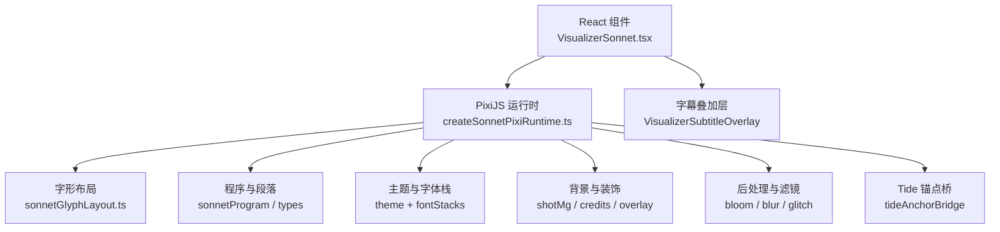
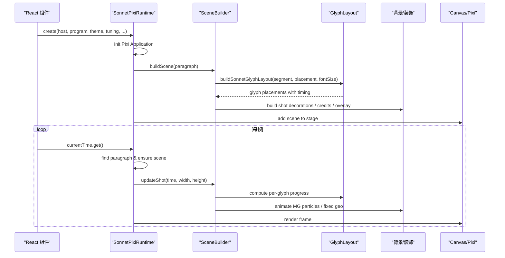
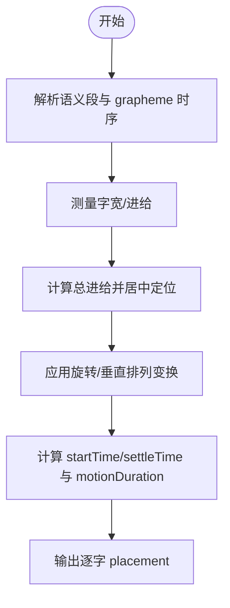
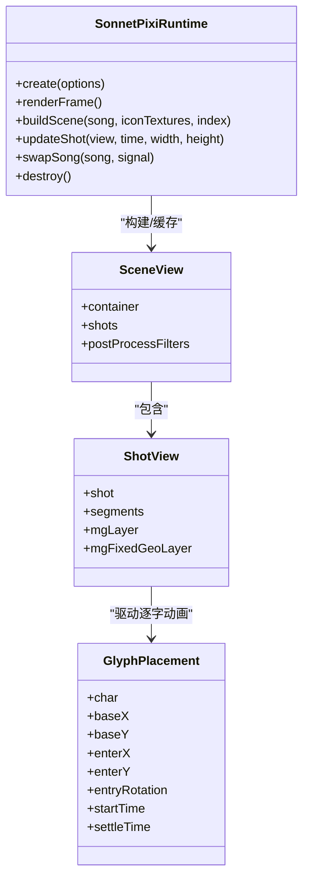
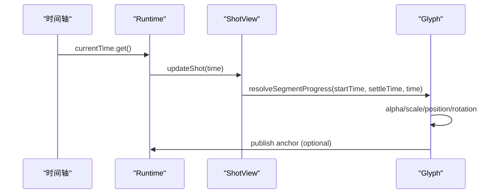
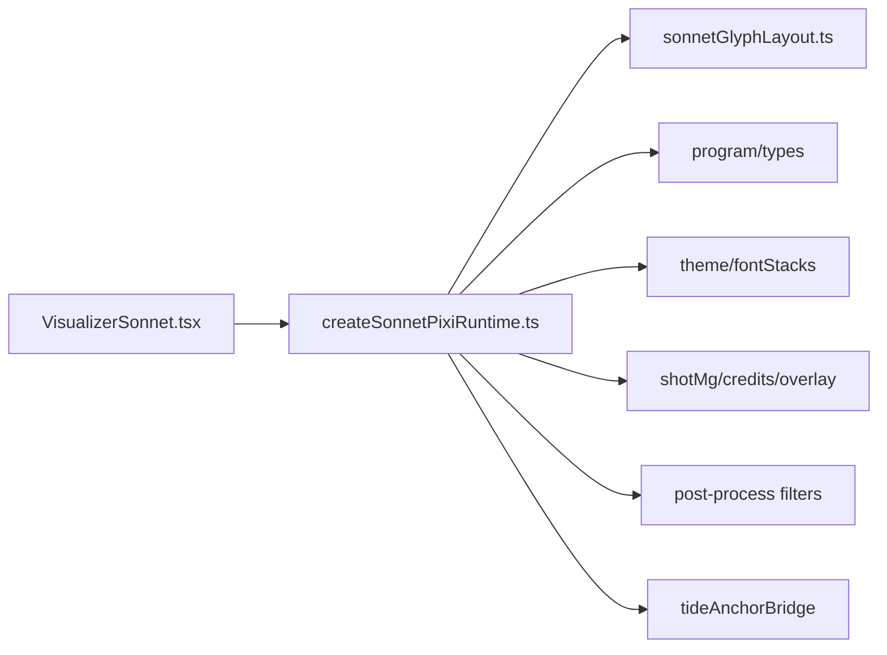

# 文本渲染引擎

<cite>
**本文引用的文件**   
- [VisualizerSonnet.tsx](file://src/components/visualizer/sonnet/VisualizerSonnet.tsx)
- [createSonnetPixiRuntime.ts](file://src/components/visualizer/sonnet/createSonnetPixiRuntime.ts)
- [tuning.ts](file://src/components/visualizer/sonnet/tuning.ts)
- [sonnetGlyphLayout.ts](file://src/components/visualizer/sonnet/sonnetGlyphLayout.ts)
- [README.md（Tempera 排版说明）](file://src/components/visualizer/tempera/README.md)
- [README.md（Partita 字符处理流程）](file://src/components/visualizer/partita/README.md)
- [glyphLine.ts](file://src/components/visualizer/lumiere/text/glyphLine.ts)
- [scene.ts](file://src/components/visualizer/lumiere/scene.ts)
- [sentenceLayout.ts](file://src/utils/lyrics/sentenceLayout.ts)
- [modeGlyphs.tsx](file://src/components/visualizer/modeGlyphs.tsx)
- [DevDebugOverlay.tsx](file://src/components/DevDebugOverlay.tsx)
</cite>

## 目录
1. [引言](#引言)
2. [项目结构](#项目结构)
3. [核心组件](#核心组件)
4. [架构总览](#架构总览)
5. [详细组件分析](#详细组件分析)
6. [依赖关系分析](#依赖关系分析)
7. [性能考量](#性能考量)
8. [故障排查指南](#故障排查指南)
9. [结论](#结论)
10. [附录](#附录)

## 引言
本文面向 Sonnet 模式的文本渲染引擎，聚焦歌词在视觉化舞台中的布局、字形绘制、多语言支持、样式系统、高亮机制与性能优化。Sonnet 模式以 PixiJS 为图形后端，将歌词解析为段落与镜头，再按时间轴驱动逐字动画、相机运动、装饰元素与后处理效果；同时与主题、字体栈、音频能量和外部背景层（如 Tide）协作，形成完整的“文字 PV”体验。

## 项目结构
Sonnet 的文本渲染位于可视化器子系统中，采用 React 组件负责 UI 壳层与字幕叠加，PixiJS Runtime 负责 WebGL 场景、纹理与帧循环；排版与语义信息来自歌词工具链，调参与主题通过注册表注入。

图表来源
- [VisualizerSonnet.tsx:123-158](file://src/components/visualizer/sonnet/VisualizerSonnet.tsx#L123-L158)
- [createSonnetPixiRuntime.ts:148-184](file://src/components/visualizer/sonnet/createSonnetPixiRuntime.ts#L148-L184)
- [sonnetGlyphLayout.ts:33-77](file://src/components/visualizer/sonnet/sonnetGlyphLayout.ts#L33-L77)

章节来源
- [VisualizerSonnet.tsx:1-232](file://src/components/visualizer/sonnet/VisualizerSonnet.tsx#L1-L232)
- [createSonnetPixiRuntime.ts:1-800](file://src/components/visualizer/sonnet/createSonnetPixiRuntime.ts#L1-L800)

## 核心组件
- VisualizerSonnet：React 入口，负责挂载 Pixi 宿主、构建节目程序、传递主题与调参、管理字幕叠加与回退显示。
- SonnetPixiRuntime：生命周期与帧循环所有者，负责创建 Pixi Application、预加载图标、构建/缓存场景、更新镜头与逐字动画、歌曲切换过渡、资源释放。
- sonnetGlyphLayout：将语义段与排版位置映射为逐字坐标、进入向量、旋转与时间窗口。
- tuning.ts：将 Sonnet 强类型调参注入可视化器注册表。
- 其他辅助：歌词句子切分、字体栈解析、渲染提示、调试面板等。

章节来源
- [VisualizerSonnet.tsx:26-176](file://src/components/visualizer/sonnet/VisualizerSonnet.tsx#L26-L176)
- [createSonnetPixiRuntime.ts:108-184](file://src/components/visualizer/sonnet/createSonnetPixiRuntime.ts#L108-L184)
- [sonnetGlyphLayout.ts:33-77](file://src/components/visualizer/sonnet/sonnetGlyphLayout.ts#L33-L77)
- [tuning.ts:1-11](file://src/components/visualizer/sonnet/tuning.ts#L1-L11)

## 架构总览
Sonnet 渲染管线从 React 到 Pixi 再到屏幕，关键阶段如下：
- 输入：当前时间、歌词行、主题、音频能量、调参与 Mod 调制。
- 节目编译：根据歌词与种子生成段落与镜头序列。
- 场景构建：按段落构建 SceneView，内含 ShotView、SegmentView、GlyphView。
- 帧更新：计算进度、相机、抖动、呼吸、视差、逐字入场与回声浮影。
- 输出：渲染到 Canvas，并可选发布字形锚点到 Tide 背景。

图表来源
- [VisualizerSonnet.tsx:123-158](file://src/components/visualizer/sonnet/VisualizerSonnet.tsx#L123-L158)
- [createSonnetPixiRuntime.ts:408-427](file://src/components/visualizer/sonnet/createSonnetPixiRuntime.ts#L408-L427)
- [createSonnetPixiRuntime.ts:715-800](file://src/components/visualizer/sonnet/createSonnetPixiRuntime.ts#L715-L800)
- [sonnetGlyphLayout.ts:33-77](file://src/components/visualizer/sonnet/sonnetGlyphLayout.ts#L33-L77)

## 详细组件分析

### 文本布局算法
Sonnet 的文本布局由语义段与排版位置共同决定，最终产出逐字坐标、进入位移、旋转与时间窗口。

- 自动换行与分行
  - 歌词先被解析为语义段；若未提供精细分词，则回退到字符级均匀分配时间。
  - 通用句子切分逻辑用于 Western 词块、标点粘滞、括号引号提取，避免错误断行。
  - CJK 与拉丁混排时，Western 词组尽量保持完整，CJK 边界保留视觉微距。
- 对齐方式
  - 水平居中为主，支持垂直排列（竖排）与旋转排版；每个字基于局部坐标经旋转变换得到世界坐标。
- 间距计算
  - 字宽由 measureGlyph 测量或回退到字号比例；垂直模式下使用字号比例作为进给。
  - 行内总进给用于居中定位，相邻字之间不额外加空格，仅在原文存在空白时保留。
- 入场与节奏
  - 每个字有 startTime/settleTime，进入位移 enterX/enterY 与 entryRotation 产生错落的“拼贴式”入场。
  - 强调角色（如 hero 词）具有更大的旋转幅度与缩放差异。

图表来源
- [sonnetGlyphLayout.ts:33-77](file://src/components/visualizer/sonnet/sonnetGlyphLayout.ts#L33-L77)
- [sentenceLayout.ts:112-263](file://src/utils/lyrics/sentenceLayout.ts#L112-L263)

章节来源
- [sonnetGlyphLayout.ts:33-77](file://src/components/visualizer/sonnet/sonnetGlyphLayout.ts#L33-L77)
- [sentenceLayout.ts:112-263](file://src/utils/lyrics/sentenceLayout.ts#L112-L263)

### 字形渲染系统
Sonnet 的字形渲染基于 PixiJS，每个字通常对应一个 Text 或 Graphics 节点，并通过容器层级组织。

- 字体加载与回退
  - React 层通过主题解析字体栈与字重，作为 fallback 字体与权重。
  - Runtime 层根据主题与调参选择纹理分辨率与抗锯齿策略。
- 字符映射
  - 使用 grapheme 时序保证 CJK 逐字动画；若无精细分词则按字符均匀分配。
  - 标点与黏连词（如 It’s）在 Partita/Tempera 等模式中已有成熟处理，Sonnet 复用歌词工具链的语义与分段能力。
- 矢量绘制
  - 装饰元素（MG）、固定几何、边框与星号等使用 Graphics 绘制。
  - 文本层可附加 Bloom/Blur/Glitch 等滤镜；部分层不参与反色以避免主题色被过滤抹掉。

图表来源
- [createSonnetPixiRuntime.ts:108-184](file://src/components/visualizer/sonnet/createSonnetPixiRuntime.ts#L108-L184)
- [createSonnetPixiRuntime.ts:408-427](file://src/components/visualizer/sonnet/createSonnetPixiRuntime.ts#L408-L427)
- [createSonnetPixiRuntime.ts:456-713](file://src/components/visualizer/sonnet/createSonnetPixiRuntime.ts#L456-L713)
- [sonnetGlyphLayout.ts:11-20](file://src/components/visualizer/sonnet/sonnetGlyphLayout.ts#L11-L20)

章节来源
- [createSonnetPixiRuntime.ts:148-184](file://src/components/visualizer/sonnet/createSonnetPixiRuntime.ts#L148-L184)
- [createSonnetPixiRuntime.ts:408-427](file://src/components/visualizer/sonnet/createSonnetPixiRuntime.ts#L408-L427)
- [sonnetGlyphLayout.ts:33-77](file://src/components/visualizer/sonnet/sonnetGlyphLayout.ts#L33-L77)

### 多语言支持
- CJK 文字处理
  - 优先使用精细分词的 grapheme 时序；否则按字符均匀分配时间，确保逐字动画稳定。
  - 句子切分对 CJK 与 Western 混合文本进行保护，避免错误断行。
- RTL 文本
  - 代码中未见显式 RTL 方向控制；如需支持，可在排版层增加方向标志与镜像变换。
- Unicode 范围
  - 依赖 PixiJS 与平台字体覆盖；建议主题字体栈包含常用 CJK 与符号字体，必要时引入自定义字体服务。

章节来源
- [sonnetGlyphLayout.ts:33-77](file://src/components/visualizer/sonnet/sonnetGlyphLayout.ts#L33-L77)
- [sentenceLayout.ts:112-263](file://src/utils/lyrics/sentenceLayout.ts#L112-L263)

### 文本样式系统
- 字体栈管理
  - React 层解析主题字体栈与字重，作为回退字体；Runtime 层根据主题与调参设置纹理分辨率与抗锯齿。
- 颜色渐变
  - 主题色通过 primaryColor/accentColor/secondaryColor 传入；装饰与边框使用主题色绘制。
  - 关键字着色在其他模式（如 Tempera）中走共享 wordColoring 逻辑，Sonnet 可复用该思路。
- 阴影与光晕
  - Bloom 与 Blur 滤镜用于光晕与柔化；部分层（如 keywordLayer）不参与反色以保持主题色。
  - 回声浮影（ghost）与色差（CA）动画增强动感。

章节来源
- [VisualizerSonnet.tsx:178-179](file://src/components/visualizer/sonnet/VisualizerSonnet.tsx#L178-L179)
- [createSonnetPixiRuntime.ts:294-338](file://src/components/visualizer/sonnet/createSonnetPixiRuntime.ts#L294-L338)
- [createSonnetPixiRuntime.ts:673-708](file://src/components/visualizer/sonnet/createSonnetPixiRuntime.ts#L673-L708)

### 歌词高亮机制
- 时间轴同步
  - 通过 currentTime 驱动段落查找与镜头进度；每帧计算 segment/glyph 进度，控制可见性、透明度、缩放与旋转。
- 逐词动画
  - 每个字有独立 startTime/settleTime 与进入向量，形成错落入场；强调角色具有更大旋转与缩放差异。
- 语义标记
  - 语义段 role 区分 decoration/emphasis 等；isSonnetEmphasisRole 影响动画强度与视觉效果。

图表来源
- [createSonnetPixiRuntime.ts:456-713](file://src/components/visualizer/sonnet/createSonnetPixiRuntime.ts#L456-L713)
- [sonnetGlyphLayout.ts:33-77](file://src/components/visualizer/sonnet/sonnetGlyphLayout.ts#L33-L77)

章节来源
- [createSonnetPixiRuntime.ts:456-713](file://src/components/visualizer/sonnet/createSonnetPixiRuntime.ts#L456-L713)

### 与其他模式的对比与借鉴
- Tempera 排版
  - 使用拼贴式排版：分词仅用于字号层级，不影响字间距；CJK 边界留视觉微距；hero 词放大，其余缩小；行高紧凑；每字独立入场向量；关键词着色走共享 wordColoring。
- Partita 字符处理
  - 将 layoutUnit 切成不均匀 chunks，保留原始 timing；semantic/sticky/display layout units 分离；预热下一句布局以提升流畅度。
- Lumiere 字形线
  - 字形纹理裁剪与 pad 计算，纵向留白用于放置字形；Bloom 区域固定以避免抖动。

章节来源
- [README.md（Tempera 排版说明）:24-28](file://src/components/visualizer/tempera/README.md#L24-L28)
- [README.md（Partita 字符处理流程）:122-160](file://src/components/visualizer/partita/README.md#L122-L160)
- [glyphLine.ts:125-156](file://src/components/visualizer/lumiere/text/glyphLine.ts#L125-L156)
- [scene.ts:349-365](file://src/components/visualizer/lumiere/scene.ts#L349-L365)

## 依赖关系分析
- React 组件依赖：主题、字体栈、歌词数据、调参与 Mod 调制。
- Runtime 依赖：PixiJS、歌词程序（段落/镜头）、主题与图标资源、背景装饰、后处理滤镜、Tide 锚点桥。
- 布局依赖：语义段、grapheme 时序、measureGlyph、排版位置与旋转。

图表来源
- [VisualizerSonnet.tsx:123-158](file://src/components/visualizer/sonnet/VisualizerSonnet.tsx#L123-L158)
- [createSonnetPixiRuntime.ts:148-184](file://src/components/visualizer/sonnet/createSonnetPixiRuntime.ts#L148-L184)
- [sonnetGlyphLayout.ts:33-77](file://src/components/visualizer/sonnet/sonnetGlyphLayout.ts#L33-L77)

章节来源
- [VisualizerSonnet.tsx:123-158](file://src/components/visualizer/sonnet/VisualizerSonnet.tsx#L123-L158)
- [createSonnetPixiRuntime.ts:148-184](file://src/components/visualizer/sonnet/createSonnetPixiRuntime.ts#L148-L184)

## 性能考量
- 批处理渲染
  - 每帧只构建必要场景；邻居段落预取但限制每帧最多一个，避免卡顿。
- 离屏缓存
  - 场景缓存 Map 按段落索引存储；销毁时逐节点清理 GPU 缓冲，避免内存泄漏。
- 增量更新
  - 调参变化就地下发，不重建 WebGL；图片 blob 按 id 集合触发加载，避免全量读取。
- 纹理池与分辨率
  - 纹理分辨率按视口与调参快照，减少重复解码与分配。
- 滤镜优化
  - Bloom 区域固定为远大于画布的区域，避免每帧重新计算导致抖动。

章节来源
- [createSonnetPixiRuntime.ts:438-454](file://src/components/visualizer/sonnet/createSonnetPixiRuntime.ts#L438-L454)
- [createSonnetPixiRuntime.ts:387-406](file://src/components/visualizer/sonnet/createSonnetPixiRuntime.ts#L387-L406)
- [createSonnetPixiRuntime.ts:715-800](file://src/components/visualizer/sonnet/createSonnetPixiRuntime.ts#L715-L800)
- [scene.ts:349-365](file://src/components/visualizer/lumiere/scene.ts#L349-L365)

## 故障排查指南
- 无歌词或程序为空
  - React 层会显示等待提示或回退文本；检查歌词数据与节目编译是否成功。
- 运行时失败
  - 组件状态 runtimeFailed 为真时显示回退 UI；检查 Pixi 初始化与资源加载。
- 调试面板
  - DevDebugOverlay 提供 Sonnet 调试视图，显示活跃镜头、段落信息与重叠统计。
- 模式图标
  - modeGlyphs 中 Sonnet 图标用于标识模式；确认图标路径与主题配置正确。

章节来源
- [VisualizerSonnet.tsx:194-206](file://src/components/visualizer/sonnet/VisualizerSonnet.tsx#L194-L206)
- [DevDebugOverlay.tsx:468-504](file://src/components/DevDebugOverlay.tsx#L468-L504)
- [modeGlyphs.tsx:112-118](file://src/components/visualizer/modeGlyphs.tsx#L112-L118)

## 结论
Sonnet 文本渲染引擎以 PixiJS 为核心，结合语义化的歌词布局、逐字动画、相机运动与后处理滤镜，实现了高质量的“文字 PV”体验。其架构清晰、性能优化到位，并在多模式间共享歌词工具链与主题系统。未来可扩展 RTL 支持、更丰富的关键字着色与更细粒度的性能监控。

## 附录
- 调参与注册
  - tuning.ts 将 Sonnet 强类型调参注入可视化器注册表，便于设置面板与 Mod 集成。
- 模式标识
  - modeGlyphs.tsx 提供 Sonnet 模式图标，便于用户识别。

章节来源
- [tuning.ts:1-11](file://src/components/visualizer/sonnet/tuning.ts#L1-L11)
- [modeGlyphs.tsx:112-118](file://src/components/visualizer/modeGlyphs.tsx#L112-L118)