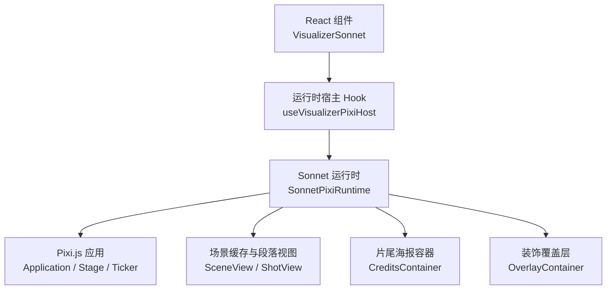
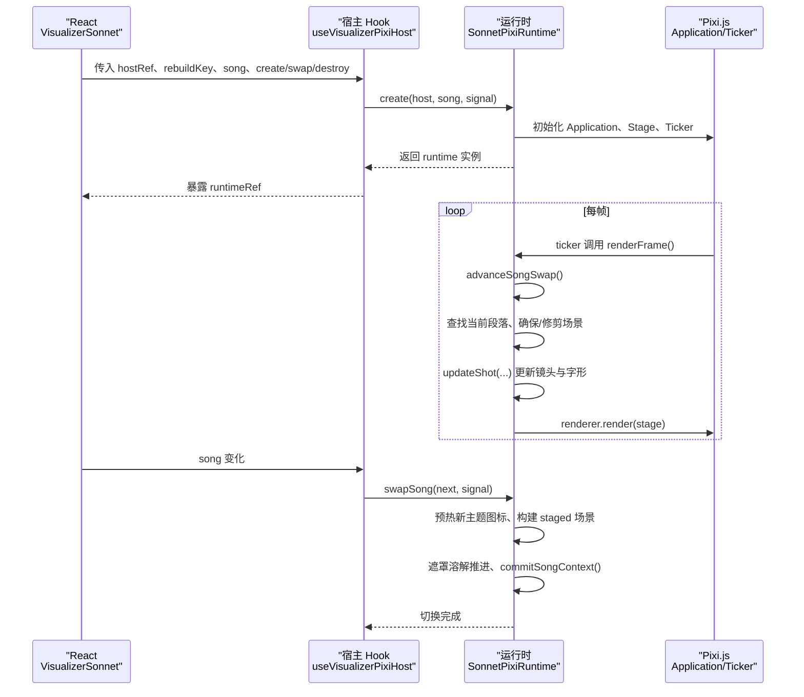
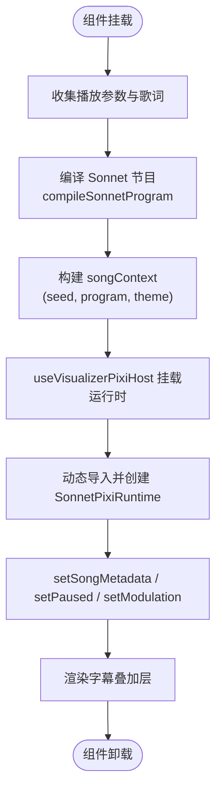
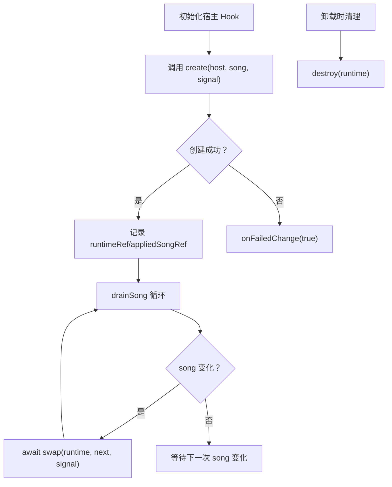
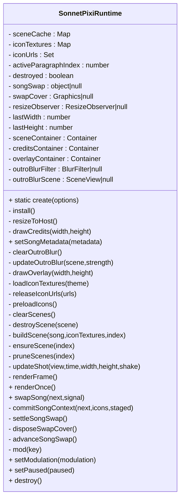
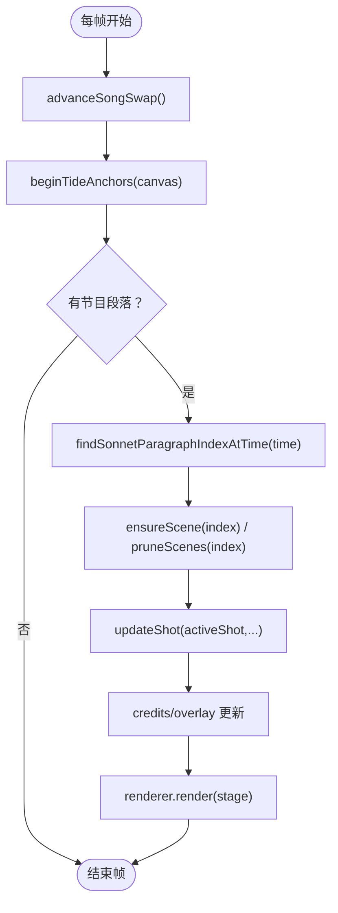
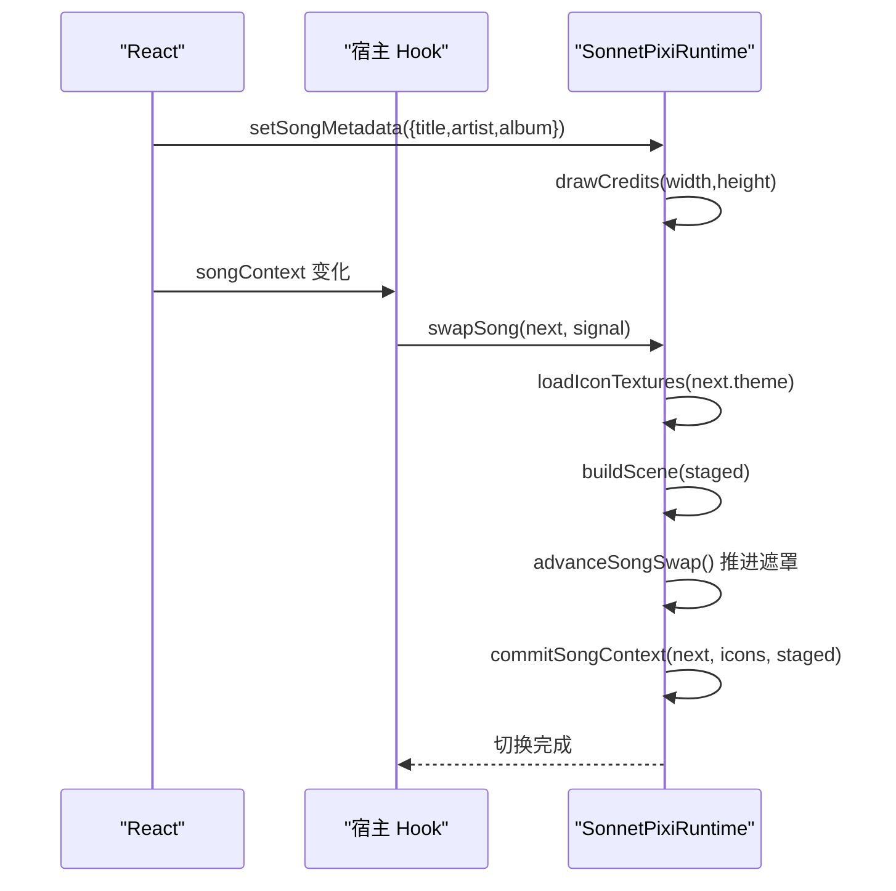
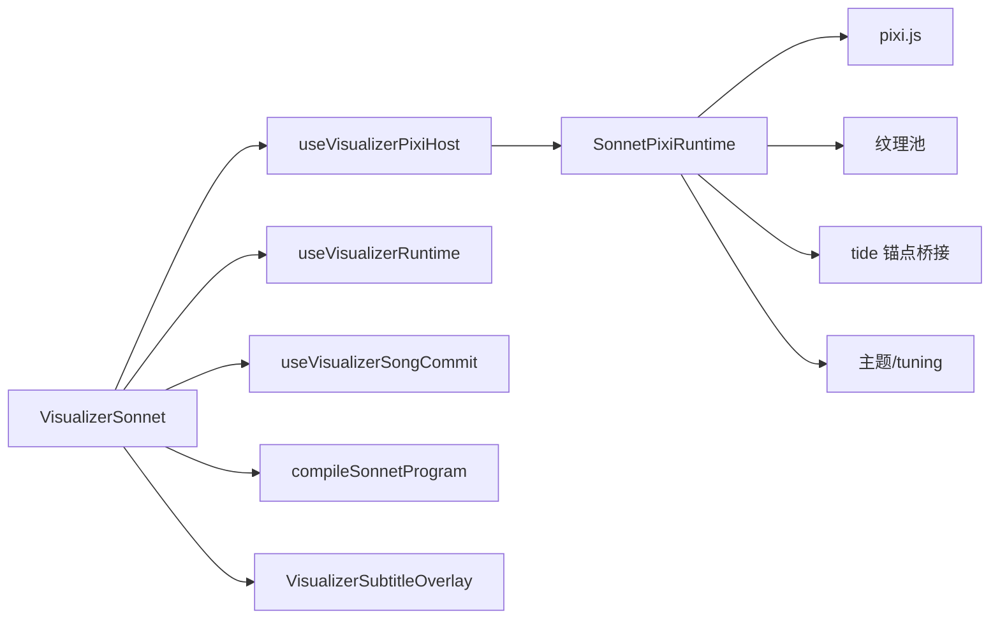

# 核心架构设计

<cite>
**本文引用的文件**   
- [VisualizerSonnet.tsx](file://src/components/visualizer/sonnet/VisualizerSonnet.tsx)
- [pixiRuntimeHost.ts](file://src/components/visualizer/pixiRuntimeHost.ts)
- [createSonnetPixiRuntime.ts](file://src/components/visualizer/sonnet/createSonnetPixiRuntime.ts)
- [VisualizerLumiere.tsx](file://src/components/visualizer/lumiere/VisualizerLumiere.tsx)
</cite>

## 目录
1. [引言](#引言)
2. [项目结构](#项目结构)
3. [核心组件](#核心组件)
4. [架构总览](#架构总览)
5. [详细组件分析](#详细组件分析)
6. [依赖关系分析](#依赖关系分析)
7. [性能考量](#性能考量)
8. [故障排查指南](#故障排查指南)
9. [结论](#结论)

## 引言
本文件聚焦 Sonnet 模式的核心架构，围绕 Pixi.js 运行时管理、React 组件集成与生命周期控制展开。文档解释主渲染循环机制（帧更新、状态同步、性能优化）、歌曲上下文管理（元数据传递、程序编译、场景切换）、模块化加载（动态导入、依赖管理与内存优化），以及错误处理与降级策略。同时给出架构决策的技术背景、权衡考虑与扩展点设计原则，帮助读者在不深入源码的情况下理解系统行为。

## 项目结构
Sonnet 可视化模式位于 React 应用的前端层，采用“React 外壳 + Pixi.js 运行时”的分层组织：
- React 层负责 UI 壳、字幕叠加、参数收集、歌曲准备与运行时挂载。
- Pixi.js 层负责 WebGL 渲染、场景构建、歌词排版、过渡动画与资源管理。
- 通用宿主 Hook 抽象出运行时的创建、换歌、销毁与失败回调，避免每次切歌重建 WebGL。

图表来源
- [VisualizerSonnet.tsx:26-160](file://src/components/visualizer/sonnet/VisualizerSonnet.tsx#L26-L160)
- [pixiRuntimeHost.ts:37-143](file://src/components/visualizer/pixiRuntimeHost.ts#L37-L143)
- [createSonnetPixiRuntime.ts:148-196](file://src/components/visualizer/sonnet/createSonnetPixiRuntime.ts#L148-L196)

章节来源
- [VisualizerSonnet.tsx:26-160](file://src/components/visualizer/sonnet/VisualizerSonnet.tsx#L26-L160)
- [pixiRuntimeHost.ts:37-143](file://src/components/visualizer/pixiRuntimeHost.ts#L37-L143)
- [createSonnetPixiRuntime.ts:148-196](file://src/components/visualizer/sonnet/createSonnetPixiRuntime.ts#L148-L196)

## 核心组件
- VisualizerSonnet：React 组件，负责收集播放时间、歌词、主题、音频能量等输入，编译 Sonnet 节目，并通过 useVisualizerPixiHost 挂载 Pixi 运行时。它还维护字幕叠加层和运行时失败回退显示。
- useVisualizerPixiHost：通用宿主 Hook，封装 Pixi 运行时的创建、换歌、销毁与失败通知；保证 WebGL 上下文复用，避免切歌时闪烁。
- SonnetPixiRuntime：Pixi 运行时类，负责初始化 Application、Ticker、ResizeObserver，管理场景缓存、图标纹理、片尾海报、覆盖层，并实现逐帧渲染、段落切换、镜头运动、歌词字形动画、换歌溶解过渡与资源释放。

章节来源
- [VisualizerSonnet.tsx:26-160](file://src/components/visualizer/sonnet/VisualizerSonnet.tsx#L26-L160)
- [pixiRuntimeHost.ts:37-143](file://src/components/visualizer/pixiRuntimeHost.ts#L37-L143)
- [createSonnetPixiRuntime.ts:108-196](file://src/components/visualizer/sonnet/createSonnetPixiRuntime.ts#L108-L196)

## 架构总览
Sonnet 的渲染管线由 React 驱动，通过宿主 Hook 将 SongContext 交给 SonnetPixiRuntime。运行时在每帧中根据绝对播放时间选择段落、构建或复用场景、更新镜头与字形动画，并在换歌时使用“遮罩溶解”完成无缝切换。

图表来源
- [VisualizerSonnet.tsx:123-160](file://src/components/visualizer/sonnet/VisualizerSonnet.tsx#L123-L160)
- [pixiRuntimeHost.ts:98-143](file://src/components/visualizer/pixiRuntimeHost.ts#L98-L143)
- [createSonnetPixiRuntime.ts:148-196](file://src/components/visualizer/sonnet/createSonnetPixiRuntime.ts#L148-L196)
- [createSonnetPixiRuntime.ts:715-872](file://src/components/visualizer/sonnet/createSonnetPixiRuntime.ts#L715-L872)
- [createSonnetPixiRuntime.ts:882-1026](file://src/components/visualizer/sonnet/createSonnetPixiRuntime.ts#L882-L1026)

## 详细组件分析

### React 组件：VisualizerSonnet
职责与流程
- 从 props 获取播放时间、歌词、主题、音频能量、字体缩放、静态模式、暂停状态、子标题配置等。
- 使用 useFoliumTunings 读取 Mod 驱动的 per-frame 调制参数，避免重建 Pixi 上下文。
- 使用 useVisualizerSongCommit 对歌词进行提交缓冲，避免歌词未就绪时重建场景。
- 编译 Sonnet 节目（program）并生成 songContext（seed + program + theme）。
- 通过 useVisualizerPixiHost 创建/交换/销毁 SonnetPixiRuntime，并将 metadata、暂停、调制参数热更新到运行时。
- 当运行时初始化失败或无有效段落时，显示文本回退界面；否则显示字幕叠加层。

关键交互
- 运行时创建：动态导入 createSonnetPixiRuntime，构造 SonnetPixiRuntime.create(...)。
- 运行时交换：runtime.swapSong(song, signal)。
- 运行时销毁：runtime.destroy()。
- 运行时失败：onFailedChange 触发 UI 回退。

图表来源
- [VisualizerSonnet.tsx:26-160](file://src/components/visualizer/sonnet/VisualizerSonnet.tsx#L26-L160)

章节来源
- [VisualizerSonnet.tsx:26-160](file://src/components/visualizer/sonnet/VisualizerSonnet.tsx#L26-L160)

### 运行时宿主：useVisualizerPixiHost
职责与流程
- 封装 Pixi 运行时的生命周期：创建、换歌、销毁、失败回调。
- 使用 rebuildKey 控制何时重建 WebGL 上下文；song 作为轨道级输入，走 swap 路径而非重建。
- 提供 drainSong 队列，快速跳过时只保留最新目标，避免堆积多次交接。
- 使用 AbortSignal 取消过期任务，防止长时间快进导致 Promise 挂起。
- 在组件卸载时清理 canvas、停止 ticker、释放运行时。

图表来源
- [pixiRuntimeHost.ts:37-143](file://src/components/visualizer/pixiRuntimeHost.ts#L37-L143)

章节来源
- [pixiRuntimeHost.ts:37-143](file://src/components/visualizer/pixiRuntimeHost.ts#L37-L143)

### Sonnet 运行时：SonnetPixiRuntime
职责与流程
- 初始化 Pixi Application：设置分辨率、抗锯齿、共享 Ticker 关闭、高性能 GPU 偏好。
- 安装场景容器：sceneContainer、creditsContainer、overlayContainer。
- 监听 ResizeObserver，按宿主尺寸调整渲染器分辨率，必要时重建 staged 场景。
- 预加载主题图标纹理，并按 URL 引用计数归还纹理池。
- 每帧渲染：advanceSongSwap → beginTideAnchors → 段落查找 → ensure/prune scenes → updateShot → credits/overlay 更新 → renderer.render。
- 换歌溶解：预热新主题图标 → 构建 staged 场景 → 遮罩进度推进 → commitSongContext → 清理遮罩。
- 提供 setSongMetadata、setPaused、setModulation、renderOnce、destroy 等接口。

图表来源
- [createSonnetPixiRuntime.ts:108-196](file://src/components/visualizer/sonnet/createSonnetPixiRuntime.ts#L108-L196)
- [createSonnetPixiRuntime.ts:224-338](file://src/components/visualizer/sonnet/createSonnetPixiRuntime.ts#L224-L338)
- [createSonnetPixiRuntime.ts:345-385](file://src/components/visualizer/sonnet/createSonnetPixiRuntime.ts#L345-L385)
- [createSonnetPixiRuntime.ts:387-454](file://src/components/visualizer/sonnet/createSonnetPixiRuntime.ts#L387-L454)
- [createSonnetPixiRuntime.ts:456-713](file://src/components/visualizer/sonnet/createSonnetPixiRuntime.ts#L456-L713)
- [createSonnetPixiRuntime.ts:715-872](file://src/components/visualizer/sonnet/createSonnetPixiRuntime.ts#L715-L872)
- [createSonnetPixiRuntime.ts:882-1073](file://src/components/visualizer/sonnet/createSonnetPixiRuntime.ts#L882-L1073)

章节来源
- [createSonnetPixiRuntime.ts:108-196](file://src/components/visualizer/sonnet/createSonnetPixiRuntime.ts#L108-L196)
- [createSonnetPixiRuntime.ts:715-872](file://src/components/visualizer/sonnet/createSonnetPixiRuntime.ts#L715-L872)
- [createSonnetPixiRuntime.ts:882-1073](file://src/components/visualizer/sonnet/createSonnetPixiRuntime.ts#L882-L1073)

### 主渲染循环机制
- 帧入口：Ticker 每帧调用 renderFrame。
- 段落选择：根据 currentTime 查找当前段落索引，确保当前段落场景存在，并预取相邻段落以减少跳转开销。
- 场景可见性：仅激活段落场景绘制，非活跃场景隐藏并卸载其上一 shot 的显示树以释放 GPU 资源。
- 镜头与字形：updateShot 计算镜头位移、缩放、旋转、抖动、呼吸浮动、跟随歌词焦点、视差与粒子层动画，并更新每个字形的透明度、位置、旋转、色差与回声浮影。
- 过渡与片尾：段落进入/退出过渡、镜头过渡、模糊与 Glitch 效果；最终段落结合 credits 控制歌词透明度与外景模糊。
- 渲染输出：renderer.render(stage)，仅在 paused 模式下手动调用 renderOnce。

图表来源
- [createSonnetPixiRuntime.ts:715-872](file://src/components/visualizer/sonnet/createSonnetPixiRuntime.ts#L715-L872)

章节来源
- [createSonnetPixiRuntime.ts:715-872](file://src/components/visualizer/sonnet/createSonnetPixiRuntime.ts#L715-L872)

### 歌曲上下文管理与场景切换
- 歌曲上下文：SongContext 包含 seed（真实曲目变更标识）、program（已编译节目）与 theme（主题）。
- 元数据传递：React 层通过 setSongMetadata 更新 title/artist/album，运行时据此重绘片尾海报。
- 程序编译：React 层使用 compileSonnetProgram 将歌词与种子编译为段落序列，供运行时构建场景。
- 场景切换：swapSong 预热新主题图标、构建 staged 场景，使用遮罩溶解在 560ms 内完成切换；中途可被 abort 或销毁立即了结。

图表来源
- [createSonnetPixiRuntime.ts:246-260](file://src/components/visualizer/sonnet/createSonnetPixiRuntime.ts#L246-L260)
- [createSonnetPixiRuntime.ts:345-385](file://src/components/visualizer/sonnet/createSonnetPixiRuntime.ts#L345-L385)
- [createSonnetPixiRuntime.ts:882-1026](file://src/components/visualizer/sonnet/createSonnetPixiRuntime.ts#L882-L1026)

章节来源
- [createSonnetPixiRuntime.ts:246-260](file://src/components/visualizer/sonnet/createSonnetPixiRuntime.ts#L246-L260)
- [createSonnetPixiRuntime.ts:882-1026](file://src/components/visualizer/sonnet/createSonnetPixiRuntime.ts#L882-L1026)

### 模块化加载机制
- 动态导入：VisualizerSonnet 在 create 回调中动态 import('./createSonnetPixiRuntime')，避免首屏加载不必要的 Pixi 代码。
- 依赖管理：运行时内部按需加载 Pixi、纹理池、图标资源；图标 URL 通过引用计数归还纹理池，避免泄漏。
- 内存优化：场景缓存仅保留当前段落及其相邻段落；非活跃 shot 的显示树及时卸载；过滤器与图形对象显式销毁；ResizeObserver 与 Ticker 在销毁时断开与移除。

章节来源
- [VisualizerSonnet.tsx:130-131](file://src/components/visualizer/sonnet/VisualizerSonnet.tsx#L130-L131)
- [createSonnetPixiRuntime.ts:345-385](file://src/components/visualizer/sonnet/createSonnetPixiRuntime.ts#L345-L385)
- [createSonnetPixiRuntime.ts:387-454](file://src/components/visualizer/sonnet/createSonnetPixiRuntime.ts#L387-L454)
- [createSonnetPixiRuntime.ts:1052-1073](file://src/components/visualizer/sonnet/createSonnetPixiRuntime.ts#L1052-L1073)

### 错误处理与降级策略
- 运行时初始化失败：宿主 Hook 捕获异常并调用 onFailedChange(true)，React 层显示文本回退界面。
- 换歌失败：宿主 Hook 的 drainSong 捕获异常但不中断旧歌渲染，避免画面空洞。
- 资源清理：运行时销毁时释放所有场景、图标纹理、ResizeObserver、Ticker、Canvas 与 Pixi Application，确保无残留。

章节来源
- [pixiRuntimeHost.ts:120-124](file://src/components/visualizer/pixiRuntimeHost.ts#L120-L124)
- [pixiRuntimeHost.ts:87-95](file://src/components/visualizer/pixiRuntimeHost.ts#L87-L95)
- [createSonnetPixiRuntime.ts:1052-1073](file://src/components/visualizer/sonnet/createSonnetPixiRuntime.ts#L1052-L1073)

### 架构决策与技术权衡
- 复用 WebGL 上下文：通过 useVisualizerPixiHost 将 song 走 swap 路径，避免切歌重建 Canvas 导致的闪烁与性能损失。
- 遮罩溶解切换：使用全屏遮罩在 560ms 内完成新旧歌曲切换，预热新主题图标与 staged 场景，保证切换过程不透明且流畅。
- 场景缓存与邻近预取：仅缓存当前段落及相邻段落，减少布局与字形栅格化开销，避免掉帧。
- 像素密度与纹理池：根据宿主尺寸与 tuning.textureResolution 对齐纹理池分辨率，避免滤镜目标跨桶边界带来的额外开销。
- 暂停与单帧渲染：paused 模式下停止 Ticker，但支持 renderOnce 以响应外部变化（如字幕、元数据）。

章节来源
- [pixiRuntimeHost.ts:37-143](file://src/components/visualizer/pixiRuntimeHost.ts#L37-L143)
- [createSonnetPixiRuntime.ts:148-196](file://src/components/visualizer/sonnet/createSonnetPixiRuntime.ts#L148-L196)
- [createSonnetPixiRuntime.ts:882-1026](file://src/components/visualizer/sonnet/createSonnetPixiRuntime.ts#L882-L1026)
- [createSonnetPixiRuntime.ts:715-872](file://src/components/visualizer/sonnet/createSonnetPixiRuntime.ts#L715-L872)

### 扩展点与设计原则
- 运行时接口：create/swap/destroy/onFailedChange 构成统一扩展点，其他可视化模式（如 Lumiere）遵循相同契约。
- 运行时选项：SonnetRuntimeOptions 允许注入 host、tuning、currentTime、audioPower/audioBands、modulation 等，便于 Mod 驱动调参。
- 场景构建钩子：buildScene/buildEntry 等可扩展不同视觉风格；sceneCache/ensure/prune 提供一致的缓存策略。
- 调试与观测：sonnetDebugState 暴露 activeShot/paragraphIndex，便于开发面板诊断。

章节来源
- [VisualizerLumiere.tsx:91-125](file://src/components/visualizer/lumiere/VisualizerLumiere.tsx#L91-L125)
- [createSonnetPixiRuntime.ts:86-106](file://src/components/visualizer/sonnet/createSonnetPixiRuntime.ts#L86-L106)
- [createSonnetPixiRuntime.ts:715-872](file://src/components/visualizer/sonnet/createSonnetPixiRuntime.ts#L715-L872)

## 依赖关系分析
Sonnet 模式的依赖关系如下：
- VisualizerSonnet 依赖 useVisualizerPixiHost、useVisualizerRuntime、useVisualizerSongCommit、compileSonnetProgram、VisualizerSubtitleOverlay。
- useVisualizerPixiHost 依赖宿主 DOM ref、label、rebuildKey、song、create/swap/destroy/onFailedChange。
- SonnetPixiRuntime 依赖 Pixi.js、纹理池、tide 锚点桥接、主题与 tuning、歌词排版与动画工具。

图表来源
- [VisualizerSonnet.tsx:1-21](file://src/components/visualizer/sonnet/VisualizerSonnet.tsx#L1-L21)
- [pixiRuntimeHost.ts:11-28](file://src/components/visualizer/pixiRuntimeHost.ts#L11-L28)
- [createSonnetPixiRuntime.ts:1-45](file://src/components/visualizer/sonnet/createSonnetPixiRuntime.ts#L1-L45)

章节来源
- [VisualizerSonnet.tsx:1-21](file://src/components/visualizer/sonnet/VisualizerSonnet.tsx#L1-L21)
- [pixiRuntimeHost.ts:11-28](file://src/components/visualizer/pixiRuntimeHost.ts#L11-L28)
- [createSonnetPixiRuntime.ts:1-45](file://src/components/visualizer/sonnet/createSonnetPixiRuntime.ts#L1-L45)

## 性能考量
- WebGL 上下文复用：避免切歌重建 Canvas，减少 GPU 初始化成本与画面闪烁。
- 场景缓存与邻近预取：仅缓存当前段落与相邻段落，减少重复布局与字形栅格化。
- 纹理池与引用计数：图标纹理按 URL 引用计数管理，避免重复解码与内存泄漏。
- 分辨率对齐：根据宿主尺寸与 tuning.textureResolution 对齐渲染分辨率，避免滤镜目标跨桶边界。
- 暂停优化：paused 时停止 Ticker，但仍支持 renderOnce 以响应外部变化。
- 资源释放：非活跃 shot 的显示树及时卸载，过滤器与图形对象显式销毁，ResizeObserver 与 Ticker 在销毁时断开。

[本节为通用性能指导，不直接分析具体文件]

## 故障排查指南
- 运行时初始化失败：检查控制台日志中的 “[Sonnet] Pixi runtime initialization failed”，确认宿主 DOM 是否存在、信号是否被提前中止。
- 换歌卡顿或卡住：检查 drainSong 是否因长时间快进堆积多个 swap；确认 AbortSignal 是否正确传递与清理。
- 画面空白或闪烁：确认 rebuildKey 是否误包含 song 相关字段导致重建；检查 swapSong 是否被频繁打断。
- 资源泄漏：确认 destroy 是否被调用，场景缓存、图标纹理、ResizeObserver、Ticker 是否释放。

章节来源
- [pixiRuntimeHost.ts:120-124](file://src/components/visualizer/pixiRuntimeHost.ts#L120-L124)
- [pixiRuntimeHost.ts:87-95](file://src/components/visualizer/pixiRuntimeHost.ts#L87-L95)
- [createSonnetPixiRuntime.ts:1052-1073](file://src/components/visualizer/sonnet/createSonnetPixiRuntime.ts#L1052-L1073)

## 结论
Sonnet 模式通过 React 外壳与 Pixi.js 运行时的清晰分层，实现了高性能、可维护的音乐可视化体验。useVisualizerPixiHost 抽象出统一的运行时生命周期，SonnetPixiRuntime 则专注于渲染细节与资源管理。通过场景缓存、纹理池、遮罩溶解与精确的帧更新策略，系统在切歌、暂停、尺寸变化与 Mod 调参等场景下保持流畅与稳定。扩展点设计遵循统一契约，便于新增可视化模式与功能增强。