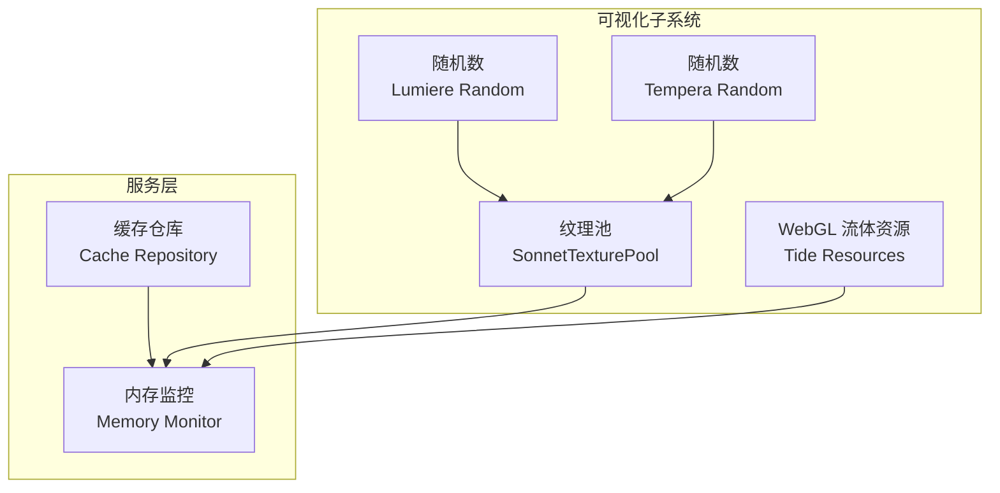
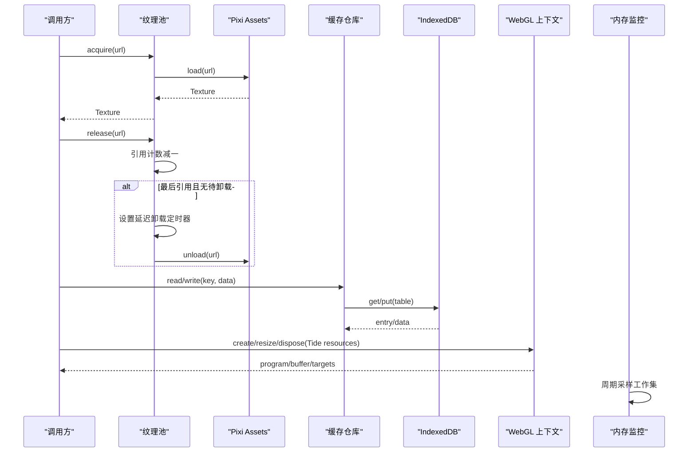
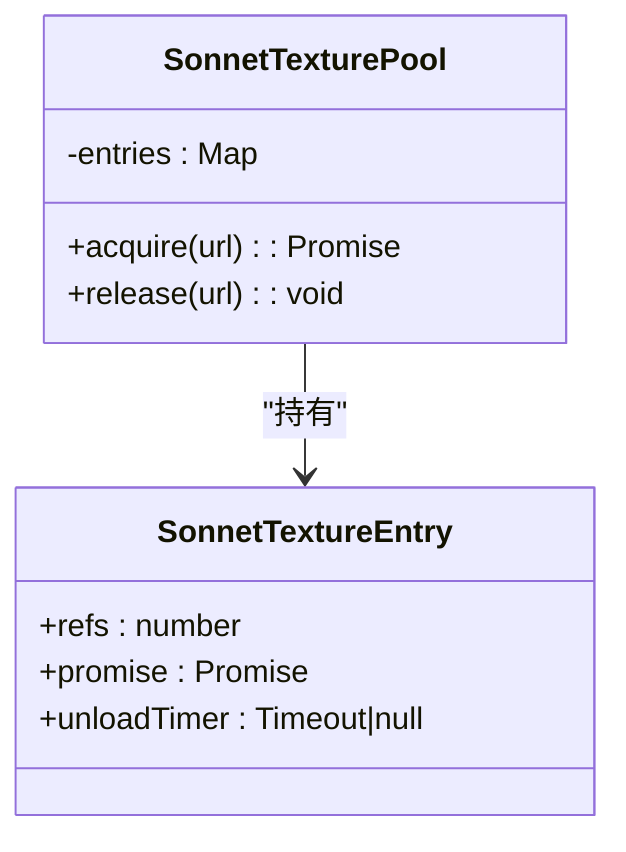
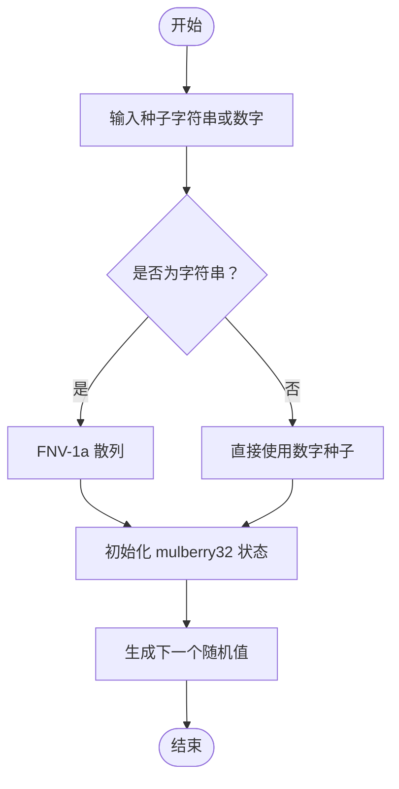
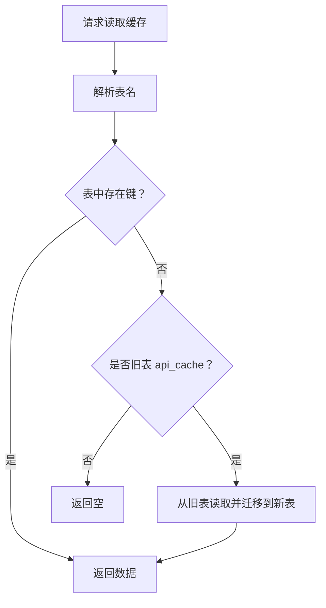
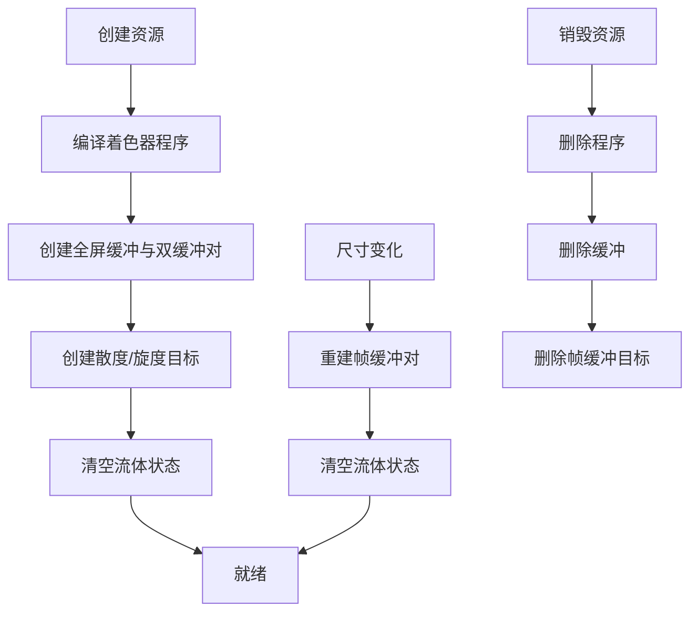
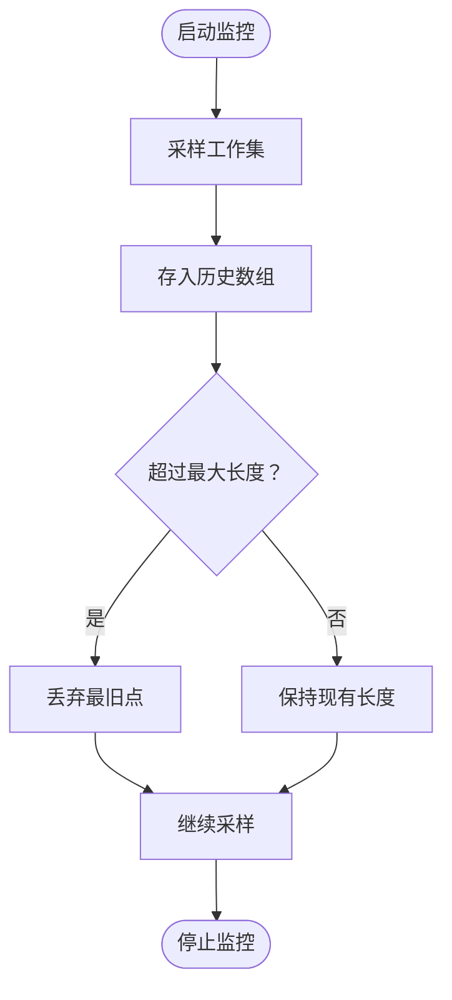
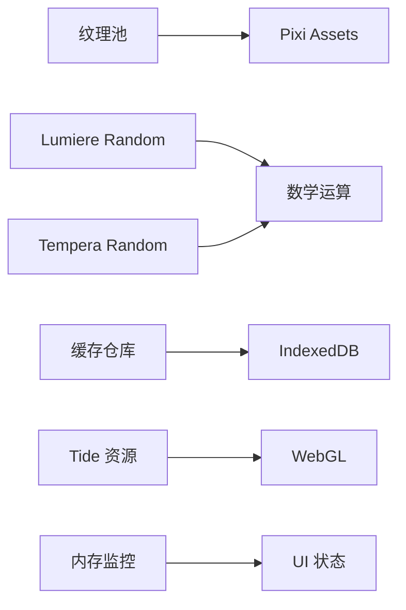

# 资源管理系统

<cite>
**本文引用的文件**   
- [sonnetTexturePool.ts](file://src/components/visualizer/sonnet/sonnetTexturePool.ts)
- [sonnetTexturePool.test.ts](file://test/unit/visualizer/sonnetTexturePool.test.ts)
- [lumiereRandom.ts](file://src/components/visualizer/lumiere/lumiereRandom.ts)
- [temperaRandom.ts](file://src/components/visualizer/tempera/temperaRandom.ts)
- [cacheRepository.ts](file://src/services/repositories/cacheRepository.ts)
- [tideResources.ts](file://src/components/visualizer/backgrounds/tide/tideResources.ts)
- [buildAppOverlaysModel.ts](file://src/components/app/overlays/buildAppOverlaysModel.ts)
- [debugMemorySamples.test.ts](file://test/unit/services/debugMemorySamples.test.ts)
</cite>

## 目录
1. [引言](#引言)
2. [项目结构](#项目结构)
3. [核心组件](#核心组件)
4. [架构总览](#架构总览)
5. [详细组件分析](#详细组件分析)
6. [依赖关系分析](#依赖关系分析)
7. [性能考量](#性能考量)
8. [故障排查指南](#故障排查指南)
9. [结论](#结论)
10. [附录](#附录)

## 引言
本技术文档聚焦 Sonnet 模式的资源管理系统，围绕以下目标展开：
- 资源池设计：对象复用、内存分配与垃圾回收优化。
- 纹理管理：纹理加载、格式转换与压缩策略（以 Pixi Assets 集成与延迟卸载为核心）。
- 随机数生成：种子控制、分布函数与可重现性保证。
- 缓存机制：LRU 思想、过期策略与持久化存储。
- 资源生命周期：初始化、使用与销毁流程。
- 内存监控与优化：泄漏检测、峰值控制与渐进式加载。
- 最佳实践与性能调优建议。

## 项目结构
Sonnet 模式相关资源管理主要分布在可视化子系统与服务层：
- 纹理池与运行时资源：位于可视化子系统中，负责跨运行时共享纹理的引用计数与延迟释放。
- 随机数模块：为不同可视化后端提供确定性随机流与哈希工具。
- 缓存仓库：基于 IndexedDB 的分表缓存，支持按前缀查询与迁移。
- WebGL 流体资源：Tide 背景的水体求解器资源管理与销毁。
- 内存监控：开发调试窗口与采样历史，用于观察工作集增长趋势。

**图表来源**
- [sonnetTexturePool.ts:1-68](file://src/components/visualizer/sonnet/sonnetTexturePool.ts#L1-L68)
- [lumiereRandom.ts:1-34](file://src/components/visualizer/lumiere/lumiereRandom.ts#L1-L34)
- [temperaRandom.ts:1-31](file://src/components/visualizer/tempera/temperaRandom.ts#L1-L31)
- [cacheRepository.ts:55-142](file://src/services/repositories/cacheRepository.ts#L55-L142)
- [tideResources.ts:96-188](file://src/components/visualizer/backgrounds/tide/tideResources.ts#L96-L188)
- [buildAppOverlaysModel.ts:138-149](file://src/components/app/overlays/buildAppOverlaysModel.ts#L138-L149)

**章节来源**
- [sonnetTexturePool.ts:1-68](file://src/components/visualizer/sonnet/sonnetTexturePool.ts#L1-L68)
- [cacheRepository.ts:55-142](file://src/services/repositories/cacheRepository.ts#L55-L142)
- [tideResources.ts:96-188](file://src/components/visualizer/backgrounds/tide/tideResources.ts#L96-L188)

## 核心组件
- 纹理池（SonnetTexturePool）：对 Pixi 纹理进行全局缓存与引用计数，避免重复加载；在最后一次 release 后延迟卸载，防止多运行时竞争导致的误删。
- 随机数模块（Lumiere/Tempera）：提供确定性随机流与元素级哈希选择，确保同一歌曲、同一种子下的画面稳定。
- 缓存仓库（Cache Repository）：基于 IndexedDB 的分表缓存，支持按前缀读取、批量删除与旧表迁移。
- WebGL 流体资源（Tide Resources）：封装程序、缓冲与帧缓冲对的创建、缩放与销毁，保障 GPU 资源正确释放。
- 内存监控（Memory Monitor）：周期性采样进程工作集，保留最近曲线点，避免监控自身成为内存问题。

**章节来源**
- [sonnetTexturePool.ts:1-68](file://src/components/visualizer/sonnet/sonnetTexturePool.ts#L1-L68)
- [lumiereRandom.ts:1-34](file://src/components/visualizer/lumiere/lumiereRandom.ts#L1-L34)
- [temperaRandom.ts:1-31](file://src/components/visualizer/tempera/temperaRandom.ts#L1-L31)
- [cacheRepository.ts:55-142](file://src/services/repositories/cacheRepository.ts#L55-L142)
- [tideResources.ts:96-188](file://src/components/visualizer/backgrounds/tide/tideResources.ts#L96-L188)
- [debugMemorySamples.test.ts:37-54](file://test/unit/services/debugMemorySamples.test.ts#L37-L54)

## 架构总览
Sonnet 资源管理的整体交互如下：
- 纹理池通过 Pixi Assets 加载纹理，并在多个运行时之间共享；当所有引用释放后，延迟调用 unload。
- 随机数模块为场景构建与着色器参数提供确定性输入，保证可重现性。
- 缓存仓库将计算结果或网络数据持久化到 IndexedDB，并按前缀组织表名，支持迁移与批量清理。
- Tide 资源在 WebGL 上下文中创建并维护流体求解所需的程序与帧缓冲对，尺寸变化时重建必要部分。
- 内存监控窗口周期性记录工作集大小，帮助定位泄漏与峰值。

**图表来源**
- [sonnetTexturePool.ts:18-51](file://src/components/visualizer/sonnet/sonnetTexturePool.ts#L18-L51)
- [cacheRepository.ts:57-79](file://src/services/repositories/cacheRepository.ts#L57-L79)
- [tideResources.ts:96-188](file://src/components/visualizer/backgrounds/tide/tideResources.ts#L96-L188)
- [debugMemorySamples.test.ts:37-54](file://test/unit/services/debugMemorySamples.test.ts#L37-L54)

## 详细组件分析

### 纹理池（SonnetTexturePool）
- 设计要点：
  - 全局 Map 缓存条目，包含引用计数、加载 Promise 与卸载定时器。
  - acquire 时若不存在则发起异步加载，并共享 Promise；release 时减少引用计数，仅在最后一个引用释放后安排延迟卸载。
  - 若在同一 URL 上再次 acquire，取消之前的卸载定时器，避免被提前释放。
  - WeakMap 绑定 Pixi.Assets 实例，确保每个 Pixi 实例拥有独立池。
- 复杂度：
  - acquire/release 均为 O(1)。
  - 延迟卸载使用 setTimeout，时间开销取决于系统调度。
- 错误处理：
  - 加载失败时从缓存中移除对应条目，避免脏状态。
- 性能影响：
  - 显著降低重复纹理加载成本；延迟卸载平衡了即时释放与多运行时安全。

**图表来源**
- [sonnetTexturePool.ts:3-52](file://src/components/visualizer/sonnet/sonnetTexturePool.ts#L3-L52)

**章节来源**
- [sonnetTexturePool.ts:1-68](file://src/components/visualizer/sonnet/sonnetTexturePool.ts#L1-L68)
- [sonnetTexturePool.test.ts:11-47](file://test/unit/visualizer/sonnetTexturePool.test.ts#L11-L47)

### 随机数生成（Lumiere / Tempera）
- Lumiere Random：
  - 使用 mulberry32 实现确定性随机流，支持按 key 播种与跳过位置（createRngAt），保证歌词窗口按需构建时的稳定性。
- Tempera Random：
  - 提供 FNV-1a 风格哈希与混合函数，用于元素级抖动与不重复选择（chooseWithoutRepeat）。
- 可重现性：
  - 同一歌曲、同一种子下，无论 seek、重建或预热，均得到相同随机序列。

**图表来源**
- [lumiereRandom.ts:7-34](file://src/components/visualizer/lumiere/lumiereRandom.ts#L7-L34)
- [temperaRandom.ts:3-31](file://src/components/visualizer/tempera/temperaRandom.ts#L3-L31)

**章节来源**
- [lumiereRandom.ts:1-34](file://src/components/visualizer/lumiere/lumiereRandom.ts#L1-L34)
- [temperaRandom.ts:1-31](file://src/components/visualizer/tempera/temperaRandom.ts#L1-L31)

### 缓存机制（Cache Repository）
- 分表策略：
  - 根据键的前缀映射到不同表名，便于分类管理与清理。
- 迁移支持：
  - 读取时若发现旧表 api_cache 中存在键，自动迁移到新表并返回数据。
- 批量操作：
  - 支持按前缀获取键列表、批量删除与事务写入。
- 过期策略：
  - 每条缓存项附带时间戳，但当前接口未直接实现 TTL 淘汰；可按需扩展扫描与清理逻辑。

**图表来源**
- [cacheRepository.ts:57-79](file://src/services/repositories/cacheRepository.ts#L57-L79)

**章节来源**
- [cacheRepository.ts:55-142](file://src/services/repositories/cacheRepository.ts#L55-L142)

### WebGL 流体资源（Tide Resources）
- 资源组成：
  - 多个着色器程序、全屏缓冲、速度/墨水/压力双缓冲对、散度与旋度目标。
- 生命周期：
  - 创建时初始化所有程序与缓冲；失败时回滚已创建的程序。
  - 尺寸变化时仅重建必要的帧缓冲对，并清空流体状态。
  - 销毁时逐一删除程序、缓冲与帧缓冲目标。
- 性能考虑：
  - 双缓冲避免读写冲突；texel 预计算加速邻域采样。

**图表来源**
- [tideResources.ts:96-188](file://src/components/visualizer/backgrounds/tide/tideResources.ts#L96-L188)

**章节来源**
- [tideResources.ts:96-188](file://src/components/visualizer/backgrounds/tide/tideResources.ts#L96-L188)

### 内存监控（Memory Monitor）
- 功能：
  - 周期性采样进程工作集大小，保留最近 N 个点，避免监控窗口自身造成内存膨胀。
  - 提供每进程细分信息（最新样本）。
- 使用：
  - 开发者设置中可启用/禁用监控窗口。

**图表来源**
- [debugMemorySamples.test.ts:37-54](file://test/unit/services/debugMemorySamples.test.ts#L37-L54)
- [buildAppOverlaysModel.ts:138-149](file://src/components/app/overlays/buildAppOverlaysModel.ts#L138-L149)

**章节来源**
- [debugMemorySamples.test.ts:37-54](file://test/unit/services/debugMemorySamples.test.ts#L37-L54)
- [buildAppOverlaysModel.ts:138-149](file://src/components/app/overlays/buildAppOverlaysModel.ts#L138-L149)

## 依赖关系分析
- 纹理池依赖 Pixi Assets 进行加载与卸载；WeakMap 确保每个 Pixi 实例隔离池。
- 随机数模块不依赖外部库，纯数学运算，适合高频调用。
- 缓存仓库依赖 IndexedDB，通过事务保证一致性。
- Tide 资源依赖 WebGL API，需正确处理上下文丢失与资源销毁。
- 内存监控与 UI 层解耦，通过状态开关控制可见性。

**图表来源**
- [sonnetTexturePool.ts:54-67](file://src/components/visualizer/sonnet/sonnetTexturePool.ts#L54-L67)
- [lumiereRandom.ts:7-34](file://src/components/visualizer/lumiere/lumiereRandom.ts#L7-L34)
- [temperaRandom.ts:3-31](file://src/components/visualizer/tempera/temperaRandom.ts#L3-L31)
- [cacheRepository.ts:55-142](file://src/services/repositories/cacheRepository.ts#L55-L142)
- [tideResources.ts:96-188](file://src/components/visualizer/backgrounds/tide/tideResources.ts#L96-L188)
- [buildAppOverlaysModel.ts:138-149](file://src/components/app/overlays/buildAppOverlaysModel.ts#L138-L149)

**章节来源**
- [sonnetTexturePool.ts:54-67](file://src/components/visualizer/sonnet/sonnetTexturePool.ts#L54-L67)
- [cacheRepository.ts:55-142](file://src/services/repositories/cacheRepository.ts#L55-L142)
- [tideResources.ts:96-188](file://src/components/visualizer/backgrounds/tide/tideResources.ts#L96-L188)

## 性能考量
- 纹理池：
  - 通过引用计数与延迟卸载减少重复加载与频繁 GC。
  - 建议在高频切换运行时场景中复用同一 Pixi 实例，以获得更稳定的池行为。
- 随机数：
  - 确定性随机流避免全局状态污染，适合并发构建与回放。
- 缓存：
  - 分表与迁移提升可维护性；可按需实现 TTL 淘汰策略以降低存储占用。
- WebGL 资源：
  - 双缓冲与增量重建降低绘制开销；务必在尺寸变化时及时清理旧目标。
- 内存监控：
  - 限制历史点数量，避免监控本身成为瓶颈；结合 UI 开关控制采样频率。

[本节为通用指导，无需特定文件来源]

## 故障排查指南
- 纹理被意外卸载：
  - 检查是否存在多个运行时同时 acquire/release 同一 URL；确认延迟卸载时间足够长。
  - 参考测试用例验证引用计数与取消卸载逻辑。
- 随机数不一致：
  - 确认种子来源一致，避免混用不同随机模块。
  - 对于歌词窗口构建，优先使用 createRngAt 以跳过无关随机值。
- 缓存读取为空：
  - 检查键前缀是否正确映射到表名；确认旧表迁移是否成功。
  - 使用按前缀查询接口排查残留键。
- WebGL 资源泄漏：
  - 确保 disposeTideResources 在所有退出路径中被调用。
  - 关注帧缓冲对与程序的成对删除。
- 内存持续增长：
  - 开启内存监控窗口，观察工作集曲线；定位异常增长阶段。
  - 检查是否有未释放的纹理、图形对象或监听器。

**章节来源**
- [sonnetTexturePool.test.ts:11-47](file://test/unit/visualizer/sonnetTexturePool.test.ts#L11-L47)
- [cacheRepository.ts:57-79](file://src/services/repositories/cacheRepository.ts#L57-L79)
- [tideResources.ts:173-188](file://src/components/visualizer/backgrounds/tide/tideResources.ts#L173-L188)
- [debugMemorySamples.test.ts:37-54](file://test/unit/services/debugMemorySamples.test.ts#L37-L54)

## 结论
Sonnet 模式的资源管理系统通过纹理池、确定性随机数、分表缓存与 WebGL 资源封装，构建了高内聚、低耦合的资源管理基础设施。引用计数与延迟卸载有效平衡了复用与释放；随机数模块保障了画面可重现性；缓存仓库提供了可扩展的持久化能力；Tide 资源封装简化了复杂流体求解器的生命周期管理；内存监控为性能调优提供了直观反馈。遵循本文的最佳实践与调优建议，可在大规模可视化场景中保持稳定与高效。

[本节为总结性内容，无需特定文件来源]

## 附录
- 最佳实践清单：
  - 始终通过纹理池获取与释放纹理，避免直接调用 Pixi Assets。
  - 使用确定性随机模块，避免全局随机状态。
  - 缓存键命名规范，便于前缀分组与清理。
  - 在尺寸变化时显式重建并清理 WebGL 资源。
  - 启用内存监控并定期审查工作集曲线。
- 性能调优建议：
  - 调整纹理池的卸载延迟以适应业务节奏。
  - 对热点纹理进行预加载与常驻缓存。
  - 对大体积流体资源采用渐进式分辨率与按需渲染。
  - 结合缓存前缀实施定时清理任务。

[本节为通用指导，无需特定文件来源]