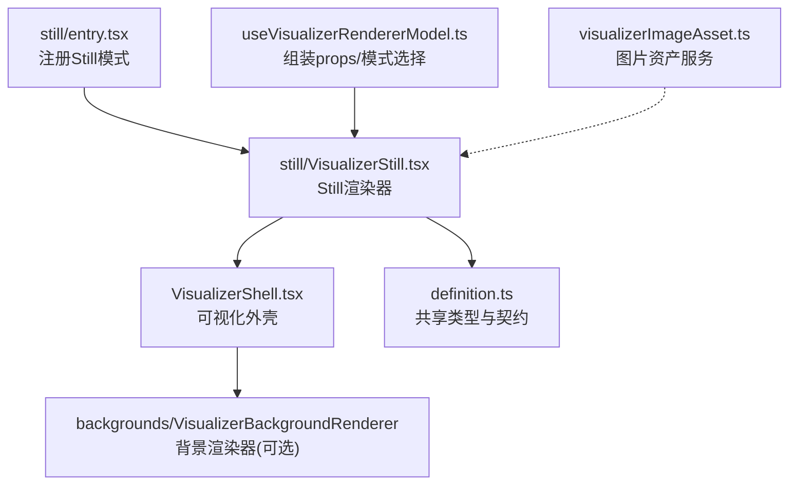
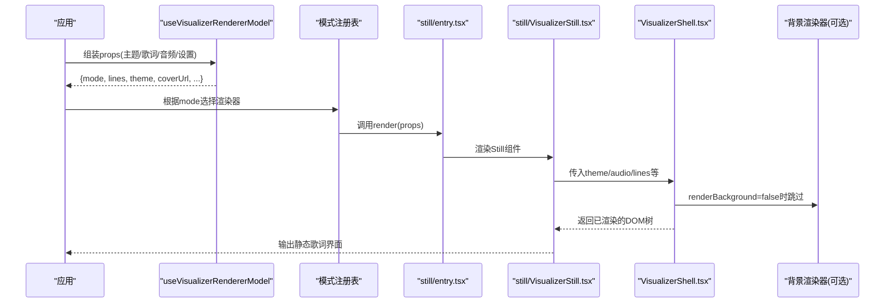
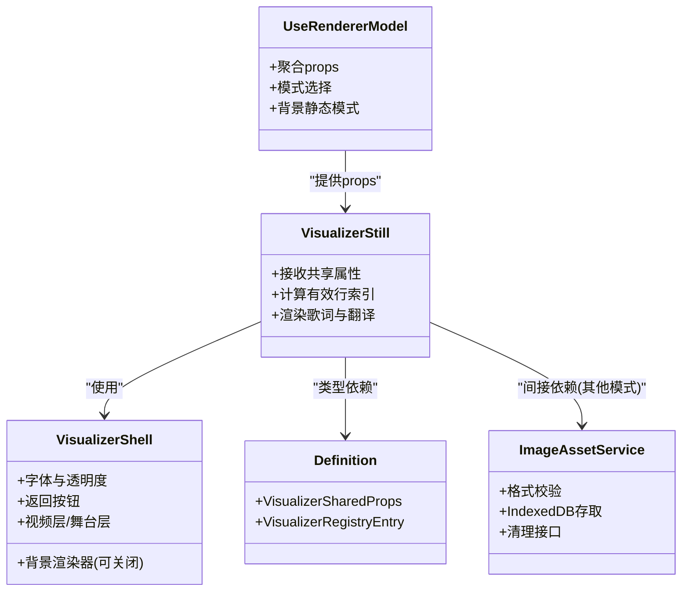

# Still模式实现

<cite>
**本文引用的文件**   
- [VisualizerStill.tsx](file://src/components/visualizer/still/VisualizerStill.tsx)
- [entry.tsx](file://src/components/visualizer/still/entry.tsx)
- [definition.ts](file://src/components/visualizer/definition.ts)
- [VisualizerShell.tsx](file://src/components/visualizer/VisualizerShell.tsx)
- [useVisualizerRendererModel.ts](file://src/components/visualizer/useVisualizerRendererModel.ts)
- [visualizerImageAsset.ts](file://src/services/visualizerImageAsset.ts)
</cite>

## 目录
1. [简介](#简介)
2. [项目结构](#项目结构)
3. [核心组件](#核心组件)
4. [架构总览](#架构总览)
5. [详细组件分析](#详细组件分析)
6. [依赖关系分析](#依赖关系分析)
7. [性能与优化](#性能与优化)
8. [故障排查指南](#故障排查指南)
9. [结论](#结论)
10. [附录：自定义静态展示效果开发指南](#附录自定义静态展示效果开发指南)

## 简介
本文件面向“Still可视化模式”的技术文档，聚焦其静态展示能力：歌词文本渲染、主题适配、背景层控制、图像资源加载与缓存、显示优化（懒加载、预取、资源清理）、用户交互（点击、手势、导航）以及性能优化策略。Still模式以最小开销呈现当前歌词与翻译字幕，同时复用统一的可视化外壳，保证与其他模式的体验一致性。

## 项目结构
Still模式由以下关键文件组成：
- still/entry.tsx：注册Still模式到可视化模式注册表
- still/VisualizerStill.tsx：Still模式的具体渲染逻辑
- VisualizerShell.tsx：所有可视化模式共享的外壳，负责背景层、返回按钮、舞台层等
- definition.ts：可视化模式契约与共享属性定义
- useVisualizerRendererModel.ts：为可视化模式组装props，决定模式选择与数据源
- visualizerImageAsset.ts：可视化图片资产服务（格式支持、IndexedDB缓存、工具方法）

**图示来源**
- [entry.tsx:1-18](file://src/components/visualizer/still/entry.tsx#L1-L18)
- [VisualizerStill.tsx:1-100](file://src/components/visualizer/still/VisualizerStill.tsx#L1-L100)
- [VisualizerShell.tsx:1-253](file://src/components/visualizer/VisualizerShell.tsx#L1-L253)
- [definition.ts:33-99](file://src/components/visualizer/definition.ts#L33-L99)
- [useVisualizerRendererModel.ts:51-163](file://src/components/visualizer/useVisualizerRendererModel.ts#L51-L163)
- [visualizerImageAsset.ts:1-45](file://src/services/visualizerImageAsset.ts#L1-L45)

**章节来源**
- [entry.tsx:1-18](file://src/components/visualizer/still/entry.tsx#L1-L18)
- [VisualizerStill.tsx:1-100](file://src/components/visualizer/still/VisualizerStill.tsx#L1-L100)
- [VisualizerShell.tsx:1-253](file://src/components/visualizer/VisualizerShell.tsx#L1-L253)
- [definition.ts:33-99](file://src/components/visualizer/definition.ts#L33-L99)
- [useVisualizerRendererModel.ts:51-163](file://src/components/visualizer/useVisualizerRendererModel.ts#L51-L163)
- [visualizerImageAsset.ts:1-45](file://src/services/visualizerImageAsset.ts#L1-L45)

## 核心组件
- Still模式入口：通过defineVisualizer将Still模式注册到系统，提供预览种子、排序、标签键与渲染函数。
- Still渲染器：在统一外壳内仅渲染歌词与翻译字幕，不挂载背景渲染器，降低资源占用。
- 可视化外壳：统一管理字体、透明度、返回按钮、背景层、视频层与Folium舞台层；可关闭背景渲染。
- 渲染模型装配：从应用状态中聚合歌词、封面、主题、音频信号、设置项，并决定模式是否为still（例如OBS浏览器源场景）。
- 图片资产服务：提供图片格式校验、IndexedDB持久化、读取/保存/清理接口。

**章节来源**
- [entry.tsx:1-18](file://src/components/visualizer/still/entry.tsx#L1-L18)
- [VisualizerStill.tsx:1-100](file://src/components/visualizer/still/VisualizerStill.tsx#L1-L100)
- [VisualizerShell.tsx:1-253](file://src/components/visualizer/VisualizerShell.tsx#L1-L253)
- [useVisualizerRendererModel.ts:51-163](file://src/components/visualizer/useVisualizerRendererModel.ts#L51-L163)
- [visualizerImageAsset.ts:1-45](file://src/services/visualizerImageAsset.ts#L1-L45)

## 架构总览
Still模式作为可视化模式之一，遵循统一的注册与渲染契约。外壳负责通用UI与背景层，Still渲染器专注歌词布局与主题样式。渲染模型装配层屏蔽了不同宿主（主窗口、预览、OBS浏览器源）的差异，确保Still模式在合适场景下被强制启用。

**图示来源**
- [useVisualizerRendererModel.ts:51-163](file://src/components/visualizer/useVisualizerRendererModel.ts#L51-L163)
- [entry.tsx:1-18](file://src/components/visualizer/still/entry.tsx#L1-L18)
- [VisualizerStill.tsx:1-100](file://src/components/visualizer/still/VisualizerStill.tsx#L1-L100)
- [VisualizerShell.tsx:1-253](file://src/components/visualizer/VisualizerShell.tsx#L1-L253)

## 详细组件分析

### Still模式入口与注册
- entry.tsx使用defineVisualizer声明模式标识、排序、标签、预览参数与渲染函数。
- 渲染函数采用React.lazy包裹实际组件，避免未使用时加载重型依赖。

关键点
- 模式标识：'still'
- 渲染函数：props => <VisualizerStill {...props} />
- 预览参数：previewSeed='still', previewStartOffset=0
- 调优种类：tuningKind='none'

**章节来源**
- [entry.tsx:1-18](file://src/components/visualizer/still/entry.tsx#L1-L18)
- [definition.ts:173-219](file://src/components/visualizer/definition.ts#L173-L219)

### Still渲染器：静态歌词展示
- VisualizerStill接收共享属性，计算有效行索引，并在外壳内渲染当前行及前后行的歌词与翻译。
- 通过isDaylight切换叠加层的混合模式与透明度，提升可读性。
- 使用主题色与字体栈，支持歌词与翻译的独立缩放与字重。

行为说明
- 当currentLineIndex无效或越界时，回退到首行。
- showText控制是否显示歌词区域。
- hideTranslationSubtitle控制是否隐藏翻译字幕。
- lyricsFontScale与subtitleFontScale分别控制主歌词与翻译缩放。

**章节来源**
- [VisualizerStill.tsx:1-100](file://src/components/visualizer/still/VisualizerStill.tsx#L1-L100)

### 可视化外壳：背景、交互与层级
- VisualizerShell统一管理：
  - 字体族与字重（基于主题）
  - 透明度与背景色
  - 返回按钮（悬停显示）
  - 触摸面板引导热点
  - 背景渲染器（可关闭）
  - 视频层与Folium舞台层（非预览且非staticMode时启用）

Still模式下
- renderBackground=false，跳过背景渲染，减少GPU/CPU压力。
- 仍保留返回按钮与外壳基础样式，保证一致的导航体验。

**章节来源**
- [VisualizerShell.tsx:1-253](file://src/components/visualizer/VisualizerShell.tsx#L1-L253)

### 渲染模型装配：模式选择与数据流
- useVisualizerRendererModel从多个store聚合数据：播放状态、歌词、封面、主题、音频信号、设置项。
- 当isObsBrowserSourceRendering为true时，强制mode='still'，确保OBS浏览器源只渲染静态画面。
- 提供onLyricLineSeek给特定模式（如monet、pendolo），Still模式不启用行点击跳转。

关键决策
- mode = isObsBrowserSourceRendering ? 'still' : visualizerMode
- backgroundStaticMode根据背景配置与视图状态动态计算
- paused由播放状态决定

**章节来源**
- [useVisualizerRendererModel.ts:51-163](file://src/components/visualizer/useVisualizerRendererModel.ts#L51-L163)

### 图片资产服务：格式支持与缓存
- visualizerImageAsset.ts提供：
  - 支持的扩展名：.png, .jpg, .jpeg, .gif, .webp, .svg
  - isSupportedVisualizerImageFile：判断文件类型或扩展名
  - getStoredVisualizerImageAsset/saveStoredVisualizerImageAsset/clearStoredVisualizerImageAsset：IndexedDB存取与清理
  - buildStoredVisualizerImageAsset：构建存储对象

用途
- Still模式本身不直接加载图片，但其他可视化模式（如Tempera）可能使用该服务进行图片解码与缓存。
- 该服务为整个可视化子系统提供统一的图片资源管理基线。

**章节来源**
- [visualizerImageAsset.ts:1-45](file://src/services/visualizerImageAsset.ts#L1-L45)

## 依赖关系分析
- Still渲染器依赖：
  - VisualizerShell（外壳）
  - 字体栈工具（主题字体解析）
  - 共享类型定义（VisualizerSharedProps）
- 外壳依赖：
  - 背景渲染器（可选）
  - 视频层与Folium舞台层（条件启用）
  - 主题与音频信号
- 渲染模型依赖：
  - 多个store（播放、主题、设置、视觉资产）
  - 背景配置与调谐集合

**图示来源**
- [VisualizerStill.tsx:1-100](file://src/components/visualizer/still/VisualizerStill.tsx#L1-L100)
- [VisualizerShell.tsx:1-253](file://src/components/visualizer/VisualizerShell.tsx#L1-L253)
- [definition.ts:33-99](file://src/components/visualizer/definition.ts#L33-L99)
- [useVisualizerRendererModel.ts:51-163](file://src/components/visualizer/useVisualizerRendererModel.ts#L51-L163)
- [visualizerImageAsset.ts:1-45](file://src/services/visualizerImageAsset.ts#L1-L45)

**章节来源**
- [VisualizerStill.tsx:1-100](file://src/components/visualizer/still/VisualizerStill.tsx#L1-L100)
- [VisualizerShell.tsx:1-253](file://src/components/visualizer/VisualizerShell.tsx#L1-L253)
- [definition.ts:33-99](file://src/components/visualizer/definition.ts#L33-L99)
- [useVisualizerRendererModel.ts:51-163](file://src/components/visualizer/useVisualizerRendererModel.ts#L51-L163)
- [visualizerImageAsset.ts:1-45](file://src/services/visualizerImageAsset.ts#L1-L45)

## 性能与优化
- 低资源渲染：Still模式不挂载背景渲染器，避免不必要的绘制与动画。
- 懒加载：entry.tsx使用React.lazy包裹组件，按需加载Still渲染器。
- 预取策略：渲染模型在宿主侧聚合数据，避免重复订阅与计算；背景静态模式根据上下文动态关闭几何背景。
- 资源清理：外壳在卸载时清理触摸引导超时与热点状态；图片资产服务提供IndexedDB清理接口。
- 主题与字体：通过主题栈与字重解析，减少运行时样式计算成本。
- OBS场景优化：在OBS浏览器源中强制still模式，冻结动态内容，降低渲染压力。

[本节为通用指导，无需具体文件引用]

## 故障排查指南
常见问题与定位要点
- 歌词不显示：检查showText与hideTranslationSubtitle；确认lines与currentLineIndex有效。
- 背景异常：确认renderBackground=false；若需要背景，检查background配置与staticMode。
- 主题颜色不一致：核对theme.primaryColor与resolvedSubtitleTheme.secondaryColor；确认isDaylight影响叠加层混合。
- 返回按钮不可见：检查alwaysShowBackButton与鼠标悬停区域；确认isPanelOpen状态。
- 图片资源问题：使用isSupportedVisualizerImageFile校验；通过getStoredVisualizerImageAsset读取，必要时clearStoredVisualizerImageAsset清理。

**章节来源**
- [VisualizerStill.tsx:1-100](file://src/components/visualizer/still/VisualizerStill.tsx#L1-L100)
- [VisualizerShell.tsx:1-253](file://src/components/visualizer/VisualizerShell.tsx#L1-L253)
- [visualizerImageAsset.ts:1-45](file://src/services/visualizerImageAsset.ts#L1-L45)

## 结论
Still模式以极简方式呈现歌词与翻译，复用统一外壳与主题体系，确保跨模式一致性与低资源消耗。通过渲染模型装配与外壳控制，Still模式在不同宿主（主窗口、预览、OBS浏览器源）中均能稳定工作。图片资产服务为可视化子系统提供统一的格式支持与缓存机制，便于扩展与优化。

[本节为总结性内容，无需具体文件引用]

## 附录：自定义静态展示效果开发指南
目标
- 在不改变Still模式核心语义的前提下，扩展静态展示效果（如背景叠加、边框样式、主题适配）。

步骤
1. 扩展Still渲染器
   - 在VisualizerStill.tsx中增加新的展示元素（如边框容器、背景遮罩）。
   - 使用主题色与字体栈保持一致风格。
   - 通过新增props（如borderStyle、overlayOpacity）控制外观。

2. 更新共享类型
   - 在definition.ts的VisualizerSharedProps中添加新字段。
   - 在useVisualizerRendererModel.ts中注入默认值或从设置中读取。

3. 外壳适配
   - 如需禁用背景但仍保留外壳交互，保持renderBackground=false。
   - 如需在外壳中插入自定义层，可在VisualizerShell.tsx中增加条件渲染节点。

4. 图片与缓存
   - 若需加载静态图片，使用visualizerImageAsset.ts的接口进行格式校验与缓存。
   - 在组件卸载时清理临时资源（如URL、Bitmap）。

5. 测试与验证
   - 验证不同主题（浅色/深色）下的可读性与对比度。
   - 验证OBS浏览器源场景下仍为静态渲染。
   - 验证触摸与鼠标交互不影响静态展示。

最佳实践
- 保持Still模式的“静态”语义：避免引入动画或高频重绘。
- 使用主题系统而非硬编码颜色。
- 通过props暴露可控样式，便于外部定制。
- 谨慎处理大图与复杂背景，优先使用轻量级CSS渐变或半透明遮罩。

[本节为概念性指导，无需具体文件引用]