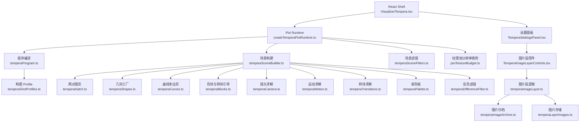
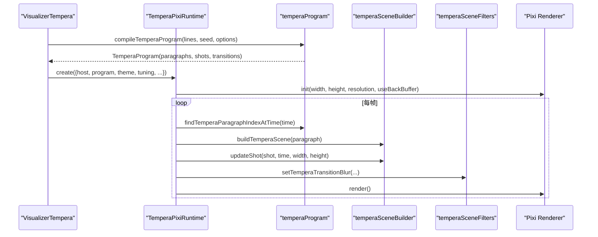
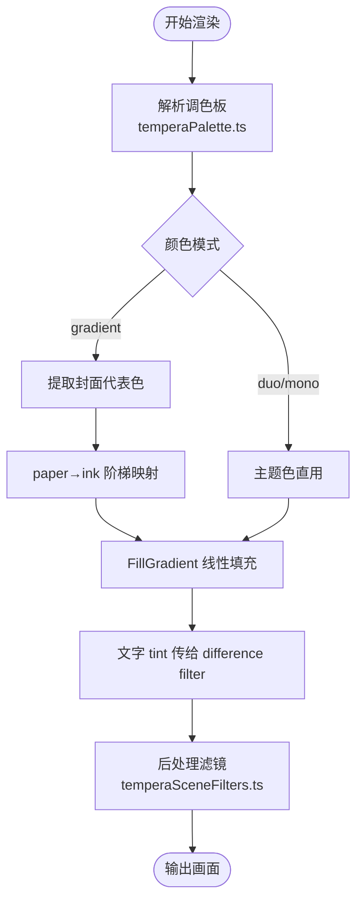
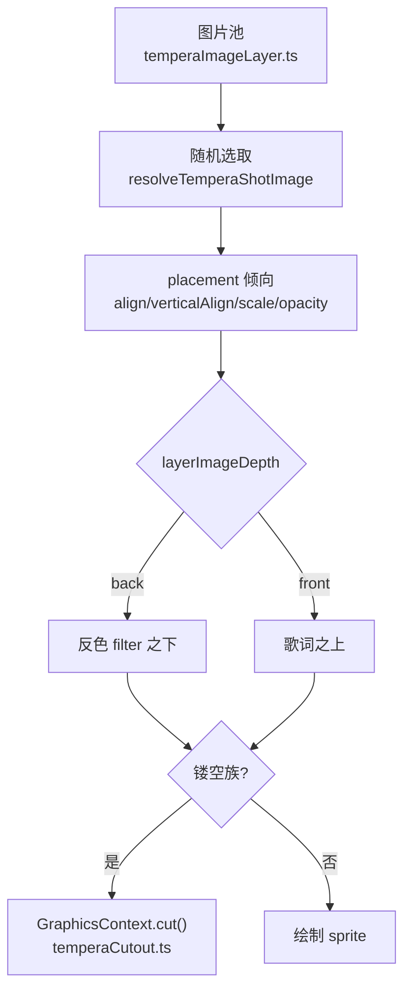
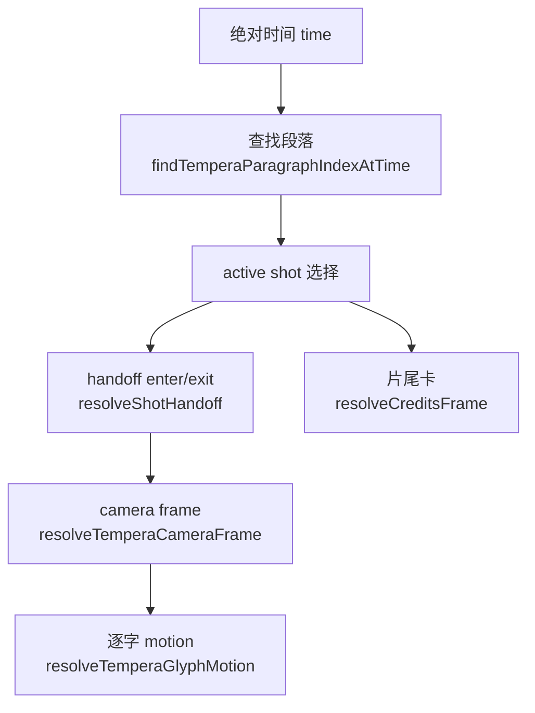
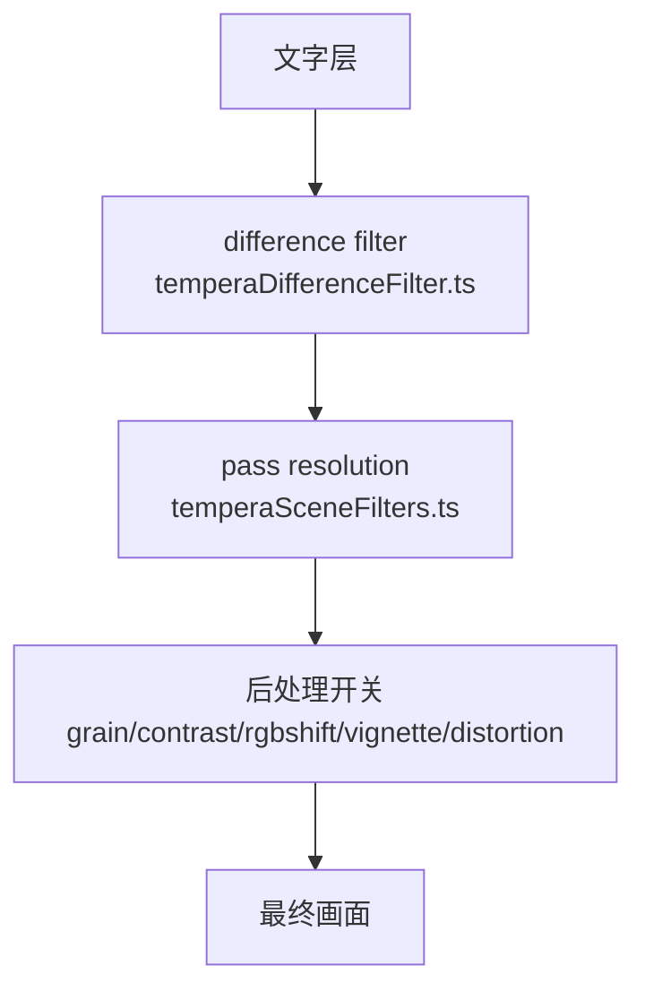
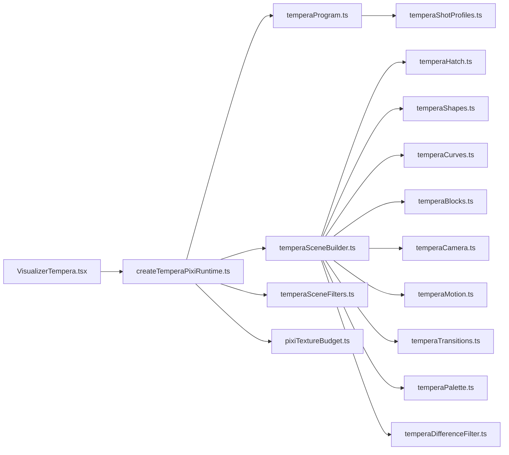
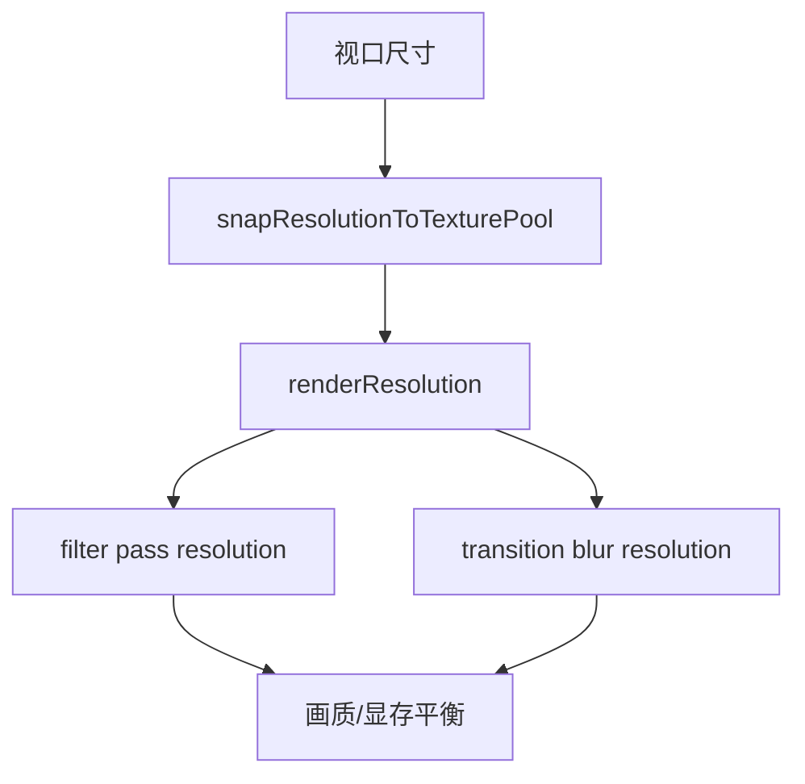

# Tempera模式实现

<cite>
**本文引用的文件**   
- [VisualizerTempera.tsx](file://src/components/visualizer/tempera/VisualizerTempera.tsx)
- [createTemperaPixiRuntime.ts](file://src/components/visualizer/tempera/createTemperaPixiRuntime.ts)
- [temperaProgram.ts](file://src/components/visualizer/tempera/temperaProgram.ts)
- [temperaShotProfiles.ts](file://src/components/visualizer/tempera/temperaShotProfiles.ts)
- [temperaImageLayer.ts](file://src/components/visualizer/tempera/temperaImageLayer.ts)
- [temperaImageLayerControls.tsx](file://src/components/visualizer/tempera/TemperaImageLayerControls.tsx)
- [temperaSettingsPanel.tsx](file://src/components/visualizer/tempera/TemperaSettingsPanel.tsx)
- [README.md](file://src/components/visualizer/tempera/README.md)
- [types.ts](file://src/types.ts)
- [temperaSceneFilters.ts](file://src/components/visualizer/tempera/temperaSceneFilters.ts)
- [temperaDifferenceFilter.ts](file://src/components/visualizer/tempera/temperaDifferenceFilter.ts)
- [temperaPalette.ts](file://src/components/visualizer/tempera/temperaPalette.ts)
- [temperaMotion.ts](file://src/components/visualizer/tempera/temperaMotion.ts)
- [temperaHatch.ts](file://src/components/visualizer/tempera/temperaHatch.ts)
- [temperaShapes.ts](file://src/components/visualizer/tempera/temperaShapes.ts)
- [temperaBlocks.ts](file://src/components/visualizer/tempera/temperaBlocks.ts)
- [temperaCamera.ts](file://src/components/visualizer/tempera/temperaCamera.ts)
- [temperaTransitions.ts](file://src/components/visualizer/tempera/temperaTransitions.ts)
- [temperaLayout.ts](file://src/components/visualizer/tempera/temperaLayout.ts)
- [temperaMeasure.ts](file://src/components/visualizer/tempera/temperaMeasure.ts)
- [temperaEnterStyles.ts](file://src/components/visualizer/tempera/temperaEnterStyles.ts)
- [temperaCurves.ts](file://src/components/visualizer/tempera/temperaCurves.ts)
- [temperaCutout.ts](file://src/components/visualizer/tempera/compositions/temperaCutout.ts)
- [temperaCharmCompositions.ts](file://src/components/visualizer/tempera/compositions/temperaCharmCompositions.ts)
- [temperaApertureCompositions.ts](file://src/components/visualizer/tempera/compositions/temperaApertureCompositions.ts)
- [temperaSignalCompositions.ts](file://src/components/visualizer/tempera/compositions/temperaSignalCompositions.ts)
- [temperaCorridorCompositions.ts](file://src/components/visualizer/tempera/compositions/temperaCorridorCompositions.ts)
- [temperaMonolithKit.ts](file://src/components/visualizer/tempera/compositions/temperaMonolithKit.ts)
- [temperaImageArchive.ts](file://src/services/temperaImageArchive.ts)
- [temperaLayerImages.ts](file://src/services/temperaLayerImages.ts)
- [pixiTextureBudget.ts](file://src/components/visualizer/pixiTextureBudget.ts)
</cite>

## 目录
1. [引言](#引言)
2. [项目结构](#项目结构)
3. [核心组件](#核心组件)
4. [架构总览](#架构总览)
5. [详细组件分析](#详细组件分析)
6. [依赖关系分析](#依赖关系分析)
7. [性能与渲染特性](#性能与渲染特性)
8. [故障排查指南](#故障排查指南)
9. [结论](#结论)
10. [附录：开发扩展指南](#附录开发扩展指南)

## 引言
Tempera（凝彩）是 Folia Major 的可视化模式之一，采用网点图形风格驱动逐字歌词 PV。它基于 Pixi runtime 与绝对时间驱动，但与同族的 sonnet 视觉路线不同：Tempera 以“色块、构图族、反色文字、镜头交接”为核心语言，强调段落内 shot 之间的纵向接力式长镜头，而不是切换转场。

该模式实现了以下能力：
- 笔触模拟：通过 hatch、抖动折线、重复符行列、贯穿斜线和纸面点阵等纯函数生成器构建网点图形层。
- 颜料混合与画布纹理：从主题或封面提取代表色，按亮度阶梯映射到 paper→ink 渐变 ramp，并配合 GLSL 后处理滤镜（模糊、噪点、对比度、色差、暗角、镜头畸变）。
- 构图系统：提供分割、色带、框窗、海报、cinema-shot、charm 圆滑族、aperture/signal/corridor 镂空族、monolith/terrain 巨构族、monogatari-blank 物语系过场卡等十三族构图；排版区域、入场向量、镜头位移和 mood 由数据化 profile 控制。
- 图像层管理：用户图片池支持对齐倾向、垂直对齐、缩放、透明度、深度层级、出现频率；back/front 两层分别位于反色 filter 之下或之上。
- 动画系统：缓动函数、逐字 solver、镜头呼吸、flowAngle 接力、block-wipe/camera-pan/shape-carry 转场、关键帧插值（camera start/end、enter/exit、credits poster）。
- 图像处理管道：difference 反色 filter、scene pass resolution 统一、纹理池分辨率吸附、post-process 开关与压缩策略。
- 自定义画笔工具与纹理生成：hatch/shapes/curves 为可复用几何原语；layer image 导入导出 zip 归档。

需要特别说明的是：仓库中并未实现“分形几何生成”“流体动力学模拟”“黄金分割布局”“对称性检测”“视觉焦点定位”“蒙版技术”“时间轴控制”“关键帧插值”等通用概念；Tempera 的实现更偏向“构图族 + 摄影机运动 + 反色文字 + 图层池 + 转场”。

**章节来源**
- [README.md:1-129](file://src/components/visualizer/tempera/README.md#L1-L129)

## 项目结构
Tempera 的核心代码集中在 `src/components/visualizer/tempera`，并按职责分层：
- React shell 与设置面板：`VisualizerTempera.tsx`、`TemperaSettingsPanel.tsx`、`TemperaImageLayerControls.tsx`、`TemperaImageLayerDialog.tsx`。
- Pixi runtime 与场景构建：`createTemperaPixiRuntime.ts`、`temperaSceneBuilder.ts`、`temperaSceneFilters.ts`。
- 程序编译与时间线：`temperaProgram.ts`、`temperaShotProfiles.ts`、`types.ts`。
- 排版与测量：`temperaLayout.ts`、`temperaMeasure.ts`、`temperaEnterStyles.ts`。
- 图形语汇与构图族：`temperaHatch.ts`、`temperaShapes.ts`、`temperaCurves.ts`、`compositions/*`。
- 运动与镜头：`temperaMotion.ts`、`temperaCamera.ts`、`temperaTransitions.ts`、`temperaBlocks.ts`。
- 图像层服务：`temperaImageLayer.ts`、`temperaImageArchive.ts`、`temperaLayerImages.ts`。
- 调色板与反色：`temperaPalette.ts`、`temperaDifferenceFilter.ts`。
- 纹理预算：`pixiTextureBudget.ts`。



**图表来源**
- [VisualizerTempera.tsx:26-218](file://src/components/visualizer/tempera/VisualizerTempera.tsx#L26-L218)
- [createTemperaPixiRuntime.ts:173-266](file://src/components/visualizer/tempera/createTemperaPixiRuntime.ts#L173-L266)
- [temperaProgram.ts:515-632](file://src/components/visualizer/tempera/temperaProgram.ts#L515-L632)
- [temperaShotProfiles.ts:54-800](file://src/components/visualizer/tempera/temperaShotProfiles.ts#L54-L800)
- [temperaImageLayer.ts:1-159](file://src/components/visualizer/tempera/temperaImageLayer.ts#L1-L159)
- [temperaImageArchive.ts](file://src/services/temperaImageArchive.ts)
- [temperaLayerImages.ts](file://src/services/temperaLayerImages.ts)
- [pixiTextureBudget.ts](file://src/components/visualizer/pixiTextureBudget.ts)

**章节来源**
- [README.md:7-18](file://src/components/visualizer/tempera/README.md#L7-L18)
- [VisualizerTempera.tsx:26-218](file://src/components/visualizer/tempera/VisualizerTempera.tsx#L26-L218)
- [createTemperaPixiRuntime.ts:173-266](file://src/components/visualizer/tempera/createTemperaPixiRuntime.ts#L173-L266)

## 核心组件
- **VisualizerTempera.tsx**：React shell，负责歌词行提交、seed、program 编译、封面取色、图片 blob 加载、runtime 创建与 swap、tuning 下发、暂停状态同步、字幕叠加。
- **createTemperaPixiRuntime.ts**：Pixi 生命周期、scene cache ±1、绝对时间驱动、无外部纹理、段落 scene 预卷、song handover 两帧过渡、credits poster、overlay 擦除块、纹理解码、resolution 吸附、ticker 渲染循环。
- **temperaProgram.ts**：将统一歌词编译为可寻址、确定性的 block-PV timeline，包括 segment 粘标点、paragraph 分类、shot chunk 切分、bridge shot、decor 编译、flowAngle 延续、transition 选择。
- **temperaShotProfiles.ts**：每个 composition kind 的区域、入场向量、相机行程、zoom 起止、mood、是否共享装饰。
- **temperaImageLayer.ts**：用户图片池在 canvas 上的随机选取、placement 倾向、sprite 缩放/旋转/透明度、depth back/front、frequency 控制。
- **temperaSceneFilters.ts / temperaDifferenceFilter.ts**：scene pass resolution 统一、transition blur 分辨率、difference 反色 filter、tint-only 形态。
- **temperaPalette.ts**：duo/mono/gradient 调色板、封面代表色提取、paper→ink 阶梯、textGradient tint。
- **temperaMotion.ts / temperaCamera.ts / temperaTransitions.ts / temperaBlocks.ts**：缓动、逐字 motion、镜头呼吸、flowAngle 接力、block-wipe/camera-pan/shape-carry、色块进度。
- **temperaHatch.ts / temperaShapes.ts / temperaCurves.ts**：网点图形生成器、Graphics 工厂、凸多边形约束。
- **compositions/***：各构图族绘制逻辑，包括 charm、aperture、signal、corridor、monolith/terrain、monogatari-blank。
- **temperaLayout.ts / temperaMeasure.ts / temperaEnterStyles.ts**：拼贴排版、字号层级、词间空格、hero 词放大、入场样式。
- **temperaImageArchive.ts / temperaLayerImages.ts**：zip 导入导出、IndexedDB 存储、OBS data URL 注入。

**章节来源**
- [VisualizerTempera.tsx:26-218](file://src/components/visualizer/tempera/VisualizerTempera.tsx#L26-L218)
- [createTemperaPixiRuntime.ts:173-266](file://src/components/visualizer/tempera/createTemperaPixiRuntime.ts#L173-L266)
- [temperaProgram.ts:515-632](file://src/components/visualizer/tempera/temperaProgram.ts#L515-L632)
- [temperaShotProfiles.ts:54-800](file://src/components/visualizer/tempera/temperaShotProfiles.ts#L54-L800)
- [temperaImageLayer.ts:1-159](file://src/components/visualizer/tempera/temperaImageLayer.ts#L1-L159)
- [temperaSceneFilters.ts](file://src/components/visualizer/tempera/temperaSceneFilters.ts)
- [temperaDifferenceFilter.ts](file://src/components/visualizer/tempera/temperaDifferenceFilter.ts)
- [temperaPalette.ts](file://src/components/visualizer/tempera/temperaPalette.ts)
- [temperaMotion.ts](file://src/components/visualizer/tempera/temperaMotion.ts)
- [temperaCamera.ts](file://src/components/visualizer/tempera/temperaCamera.ts)
- [temperaTransitions.ts](file://src/components/visualizer/tempera/temperaTransitions.ts)
- [temperaBlocks.ts](file://src/components/visualizer/tempera/temperaBlocks.ts)
- [temperaHatch.ts](file://src/components/visualizer/tempera/temperaHatch.ts)
- [temperaShapes.ts](file://src/components/visualizer/tempera/temperaShapes.ts)
- [temperaCurves.ts](file://src/components/visualizer/tempera/temperaCurves.ts)
- [temperaLayout.ts](file://src/components/visualizer/tempera/temperaLayout.ts)
- [temperaMeasure.ts](file://src/components/visualizer/tempera/temperaMeasure.ts)
- [temperaEnterStyles.ts](file://src/components/visualizer/tempera/temperaEnterStyles.ts)
- [temperaImageArchive.ts](file://src/services/temperaImageArchive.ts)
- [temperaLayerImages.ts](file://src/services/temperaLayerImages.ts)

## 架构总览
Tempera 的运行流程可以概括为：
1. React shell 接收播放时间、歌词、主题、tuning、图片资源。
2. 编译 program：segment → paragraph → shot → decor → flowAngle → transition。
3. 创建 Pixi runtime：初始化 app、texture pool、scene container、credits overlay、resize observer。
4. 每帧根据 absolute time 查找当前 paragraph，确保 scene cache ±1，更新 active shot。
5. 对每个 shot 计算 camera frame、handoff enter/exit、blocks/images/glyphs 运动。
6. 应用 scene filters：difference、post-process、transition blur。
7. 输出到 renderer，同时维护 credits poster 与 overlay wipe。



**图表来源**
- [VisualizerTempera.tsx:107-218](file://src/components/visualizer/tempera/VisualizerTempera.tsx#L107-L218)
- [createTemperaPixiRuntime.ts:224-266](file://src/components/visualizer/tempera/createTemperaPixiRuntime.ts#L224-L266)
- [createTemperaPixiRuntime.ts:674-800](file://src/components/visualizer/tempera/createTemperaPixiRuntime.ts#L674-L800)
- [temperaProgram.ts:634-639](file://src/components/visualizer/tempera/temperaProgram.ts#L634-L639)

**章节来源**
- [README.md:20-30](file://src/components/visualizer/tempera/README.md#L20-L30)
- [createTemperaPixiRuntime.ts:674-800](file://src/components/visualizer/tempera/createTemperaPixiRuntime.ts#L674-L800)

## 详细组件分析

### 绘画艺术风格渲染：笔触模拟、颜料混合、画布纹理
- 笔触模拟：`temperaHatch.ts` 提供斜线 hatch、抖动涂鸦折线、重复符行列、贯穿斜线、纸面点阵；`temperaShapes.ts` 将其转为静态 Pixi Graphics；`temperaCurves.ts` 提供凸多边形几何，用于 charm 族的圆形、心形、花瓣扇、蕾丝波边、缎带蝴蝶结等。
- 颜料混合：`temperaPalette.ts` 从主题派生 duo/mono/gradient 调色板；gradient 模式使用封面代表色，按亮度排序映射到 paper→ink 阶梯，再用 FillGradient 做线性填充；文字走 textGradient，作为 difference filter 的 tint，不直接覆盖 ink/paper 判定。
- 画布纹理：后处理复用 sonnet 的 GLSL filter（lens/glitch/print），但默认关闭 postProcessTextureCompression，避免 1x 光栅化导致网点、细线、文字变软；scene pass resolution 由 `resolveTemperaPassResolution` 统一，transition blur 由 `resolveTemperaTransitionBlurResolution` 决定。



**图表来源**
- [temperaPalette.ts](file://src/components/visualizer/tempera/temperaPalette.ts)
- [temperaSceneFilters.ts](file://src/components/visualizer/tempera/temperaSceneFilters.ts)
- [README.md:28-30](file://src/components/visualizer/tempera/README.md#L28-L30)

**章节来源**
- [README.md:28-30](file://src/components/visualizer/tempera/README.md#L28-L30)
- [temperaHatch.ts](file://src/components/visualizer/tempera/temperaHatch.ts)
- [temperaShapes.ts](file://src/components/visualizer/tempera/temperaShapes.ts)
- [temperaCurves.ts](file://src/components/visualizer/tempera/temperaCurves.ts)
- [temperaPalette.ts](file://src/components/visualizer/tempera/temperaPalette.ts)
- [temperaSceneFilters.ts](file://src/components/visualizer/tempera/temperaSceneFilters.ts)

### 构图系统：composition families、region、flowAngle、mood
- 构图族：分割/色带/框窗/海报/稀疏，加上 cinema-shot、charm、aperture/signal/corridor、monolith/terrain、monogatari-blank。
- region：每个 kind 定义 lyric 区域（cx/cy/w/h/align/rotation/fontScale），确保文字不被洞压住、不被背景吞掉。
- flowAngle：垂直为主轴，相邻 shot 小幅转向，交接读作纵向长镜头。
- mood：quiet/neutral/loud，影响 bridge shot 候选、watermark、fragment 密度。

```mermaid
classDiagram
class TemperaShotProfile {
+TemperaShotRegion region
+{x : number,y : number} enter
+{travel : number,zoomStart : number,zoomEnd : number} camera
+string mood
+boolean sharedDecor
}
class TemperaShotRegion {
+number cx
+number cy
+number w
+number h
+string align
+number rotation
+number fontScale
}
TemperaShotProfile --> TemperaShotRegion : "包含"
```

**图表来源**
- [temperaShotProfiles.ts:8-36](file://src/components/visualizer/tempera/temperaShotProfiles.ts#L8-L36)

**章节来源**
- [README.md:20-30](file://src/components/visualizer/tempera/README.md#L20-L30)
- [temperaShotProfiles.ts:54-800](file://src/components/visualizer/tempera/temperaShotProfiles.ts#L54-L800)
- [temperaProgram.ts:358-447](file://src/components/visualizer/tempera/temperaProgram.ts#L358-L447)

### 图像层管理系统：图层混合、透明度、深度、蒙版
- 图层混合：back 层位于 difference filter 之下，立绘像色块一样把歌词切开；front 层压在歌词之上。
- 透明度：每个 layer image 有 opacity，placement 时写入 sprite.alpha。
- 深度：layerImageDepth 控制 back/front 层次。
- 蒙版：aperture/signal/corridor 族通过 `drawPolygonFillWithHoles` 和 pixi `GraphicsContext.cut()` 真正挖洞，露出 shell 背景层；corridor 通道沿 flow 方向开，两端伸出画外以避免接缝暴露剪辑点。



**图表来源**
- [temperaImageLayer.ts:18-159](file://src/components/visualizer/tempera/temperaImageLayer.ts#L18-L159)
- [temperaCutout.ts](file://src/components/visualizer/tempera/compositions/temperaCutout.ts)
- [README.md:64-78](file://src/components/visualizer/tempera/README.md#L64-L78)

**章节来源**
- [temperaImageLayer.ts:18-159](file://src/components/visualizer/tempera/temperaImageLayer.ts#L18-L159)
- [temperaImageLayerControls.tsx:481-506](file://src/components/visualizer/tempera/TemperaImageLayerControls.tsx#L481-L506)
- [README.md:100-105](file://src/components/visualizer/tempera/README.md#L100-L105)
- [README.md:64-78](file://src/components/visualizer/tempera/README.md#L64-L78)

### 动画系统：缓动函数、时间轴、关键帧插值
- 缓动函数：`easeTemperaEnter`、`easeTemperaInOut`、`clamp01`、`resolveShotPacedDuration`。
- 时间轴：absolute time 驱动，shot startTime/endTime/lyricEndTime，bridge shot 填补 ≥1.2s 间隙，段落转场窗口 pre-roll。
- 关键帧插值：camera start/end、enter/exit、credits poster lyricAlpha/posterAlpha/posterOffsetY/posterScale。



**图表来源**
- [createTemperaPixiRuntime.ts:549-633](file://src/components/visualizer/tempera/createTemperaPixiRuntime.ts#L549-L633)
- [createTemperaPixiRuntime.ts:125-136](file://src/components/visualizer/tempera/createTemperaPixiRuntime.ts#L125-L136)
- [temperaMotion.ts](file://src/components/visualizer/tempera/temperaMotion.ts)

**章节来源**
- [README.md:36-54](file://src/components/visualizer/tempera/README.md#L36-L54)
- [createTemperaPixiRuntime.ts:549-633](file://src/components/visualizer/tempera/createTemperaPixiRuntime.ts#L549-L633)
- [temperaProgram.ts:449-513](file://src/components/visualizer/tempera/temperaProgram.ts#L449-L513)

### 图像处理管道：滤镜、噪点、质感增强
- 反色 filter：`temperaDifferenceFilter.ts` 声明 `blendRequired`，读取 uBackTexture 亮度，逐像素选 ink/paper；必须 resolution `'inherit'`，否则采样偏移。
- 后处理：sonnetLensFilter/sonnetGlitchFilter/sonnetPrintFilters，默认关闭 postProcessTextureCompression，避免 1x 光栅化。
- 纹理压缩：postProcessTextureCompression 开关回退到旧行为，留给低显存机器。
- 噪点与质感：postProcessGrain/postProcessContrast/postProcessRgbShift/postProcessVignette/postProcessLensDistortion。



**图表来源**
- [temperaDifferenceFilter.ts](file://src/components/visualizer/tempera/temperaDifferenceFilter.ts)
- [temperaSceneFilters.ts](file://src/components/visualizer/tempera/temperaSceneFilters.ts)
- [README.md:28-30](file://src/components/visualizer/tempera/README.md#L28-L30)

**章节来源**
- [README.md:28-30](file://src/components/visualizer/tempera/README.md#L28-L30)
- [README.md:92-94](file://src/components/visualizer/tempera/README.md#L92-L94)

### 自定义画笔工具与纹理生成
- 画笔工具：`temperaHatch.ts` 提供 hatch、scribble、repeat symbols、crossing lines、dot matrix；`temperaShapes.ts` 提供 Graphics 工厂；`temperaCurves.ts` 提供凸多边形几何。
- 纹理生成：layer image 支持 PNG/JPG/SVG/Blob，运行时 `createImageBitmap` 解码，SVG 回落到 `Image`；zip 归档 meta.json/pool.json/images/<id>.<ext>。
- 开发扩展：新增 composition 需注册到 `temperaCompositions.ts`，新增 kind 需在 `temperaShotProfiles.ts` 定义 region/enter/camera/mood/sharedDecor。

**章节来源**
- [temperaHatch.ts](file://src/components/visualizer/tempera/temperaHatch.ts)
- [temperaShapes.ts](file://src/components/visualizer/tempera/temperaShapes.ts)
- [temperaCurves.ts](file://src/components/visualizer/tempera/temperaCurves.ts)
- [temperaImageArchive.ts](file://src/services/temperaImageArchive.ts)
- [temperaLayerImages.ts](file://src/services/temperaLayerImages.ts)
- [README.md:100-105](file://src/components/visualizer/tempera/README.md#L100-L105)

## 依赖关系分析
Tempera 的依赖呈现“shell → runtime → program/scene/filters”的分层结构，同时 compositions 与 geometry primitives 被 scene builder 聚合。



**图表来源**
- [VisualizerTempera.tsx:26-218](file://src/components/visualizer/tempera/VisualizerTempera.tsx#L26-L218)
- [createTemperaPixiRuntime.ts:173-266](file://src/components/visualizer/tempera/createTemperaPixiRuntime.ts#L173-L266)
- [temperaProgram.ts:515-632](file://src/components/visualizer/tempera/temperaProgram.ts#L515-L632)

**章节来源**
- [README.md:7-18](file://src/components/visualizer/tempera/README.md#L7-L18)
- [createTemperaPixiRuntime.ts:173-266](file://src/components/visualizer/tempera/createTemperaPixiRuntime.ts#L173-L266)

## 性能与渲染特性
- 纹理池分辨率吸附：`snapResolutionToTexturePool` 只让出能换到更小档位的部分分辨率，避免 2048→1024 档位的显存跳变；renderResolution 随视口变化，filter pass 从吸附后的值派生。
- scene cache ±1：相邻段落 scene 缓存，避免频繁重建；retired scenes 一帧一帧释放，避免 song handover 卡顿。
- 图片纹理一次性加载：imageBlobs 按 id 集合触发，避免拖动滑块时重复读取 IndexedDB。
- 后处理分辨率：默认 inherit，postProcessTextureCompression 关闭；transition blur 分辨率按 pass 一半取值。
- 音频：Tempera 渲染层不消费 audioPower/audioBands，仅传给共享背景层。



**图表来源**
- [pixiTextureBudget.ts](file://src/components/visualizer/pixiTextureBudget.ts)
- [createTemperaPixiRuntime.ts:284-311](file://src/components/visualizer/tempera/createTemperaPixiRuntime.ts#L284-L311)
- [README.md:106-120](file://src/components/visualizer/tempera/README.md#L106-L120)

**章节来源**
- [README.md:106-120](file://src/components/visualizer/tempera/README.md#L106-L120)
- [createTemperaPixiRuntime.ts:284-311](file://src/components/visualizer/tempera/createTemperaPixiRuntime.ts#L284-L311)
- [README.md:126-129](file://src/components/visualizer/tempera/README.md#L126-L129)

## 故障排查指南
- 反色 filter 错位：difference filter 必须 resolution `'inherit'`，否则 uBackTexture 与 surface resolution 不一致导致采样偏移；不要混用不同 resolution 的 filter。
- 反色层上 disabled filter：disabled filter 仍会被 push 成 skip 记录，bounds 停在 Infinity，拷贝原点塌成 (0,0)，每个字对着左上角反色；应只在真的模糊时才挂 scene filters。
- 后处理变糊：pixi Filter 默认 resolution=1，直接挂上去等于 1x 光栅化再拉伸；应通过 `resolveTemperaPassResolution` 统一 resolution。
- 图片加载失败：blob URL 无后缀，Assets.load 会拒绝；应使用 `createImageBitmap` 解码，SVG 回落到 `Image`。
- 图片池 OBS 源：OBS 本地服务器与主窗口不同源，读不到 IndexedDB；需通过 `useObsBrowserSourcePublisher` 解析为 data URL 随 config 下发。
- 纹理显存跳变：视口跨越 2 的幂档位时 GEM 突增；应启用 textureResolution 吸附，避免全局调低。

**章节来源**
- [README.md:28-30](file://src/components/visualizer/tempera/README.md#L28-L30)
- [README.md:92-94](file://src/components/visualizer/tempera/README.md#L92-L94)
- [README.md:100-105](file://src/components/visualizer/tempera/README.md#L100-L105)
- [README.md:106-120](file://src/components/visualizer/tempera/README.md#L106-L120)

## 结论
Tempera 是一个高度工程化的歌词可视化模式，其核心不是通用意义上的“分形/流体/黄金分割”，而是围绕“构图族 + 摄影机运动 + 反色文字 + 图层池 + 转场”的系统设计。它在可读性、确定性、性能之间做了精细权衡：segment 粘标点、lyricEndTime 与 endTime 分离、flowAngle 接力、scene cache ±1、texture pool 吸附、difference filter 的 blendRequired 与 resolution 约束、credits poster 的渐近运动。对于扩展者来说，新增 composition、kind、decor、layer image 行为都需要遵循这些约束，尤其是 region 不能压在洞上、cut 只能一次 fill、通道角度取 flow 的一半、体量大到画框裁掉一部分等规则。

[本节不直接分析具体文件，因此不添加章节来源]

## 附录：开发扩展指南
- 新增 composition kind：
  - 在 `temperaShotProfiles.ts` 中添加 region/enter/camera/mood/sharedDecor。
  - 在 `compositions/*` 中实现绘制逻辑，并在 `temperaCompositions.ts` 注册。
  - 遵守四硬约束（镂空族）、三条约束（巨构族）、sharedDecor 语义。
- 新增 layer image 行为：
  - 在 `temperaImageLayer.ts` 中调整 placement、frequency、depth。
  - 在 `TemperaImageLayerControls.tsx` 中增加 UI 控件。
  - 在 `temperaImageArchive.ts` 中校验/导入/导出 zip。
- 新增后处理效果：
  - 在 `temperaSceneFilters.ts` 中统一 pass resolution。
  - 在 `temperaPalette.ts` 中确保 ink/paper 亮度差 ≥96。
- 新增运动/镜头：
  - 在 `temperaMotion.ts` 中扩展缓动或逐字 solver。
  - 在 `temperaCamera.ts` 中扩展 breath/frame。
  - 在 `temperaTransitions.ts` 中扩展 block-wipe/camera-pan/shape-carry。

**章节来源**
- [temperaShotProfiles.ts:54-800](file://src/components/visualizer/tempera/temperaShotProfiles.ts#L54-L800)
- [temperaImageLayer.ts:18-159](file://src/components/visualizer/tempera/temperaImageLayer.ts#L18-L159)
- [TemperaImageLayerControls.tsx:481-506](file://src/components/visualizer/tempera/TemperaImageLayerControls.tsx#L481-L506)
- [temperaImageArchive.ts](file://src/services/temperaImageArchive.ts)
- [temperaSceneFilters.ts](file://src/components/visualizer/tempera/temperaSceneFilters.ts)
- [temperaPalette.ts](file://src/components/visualizer/tempera/temperaPalette.ts)
- [temperaMotion.ts](file://src/components/visualizer/tempera/temperaMotion.ts)
- [temperaCamera.ts](file://src/components/visualizer/tempera/temperaCamera.ts)
- [temperaTransitions.ts](file://src/components/visualizer/tempera/temperaTransitions.ts)