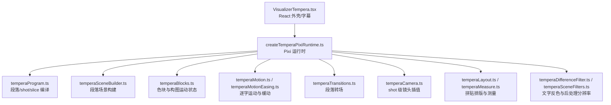
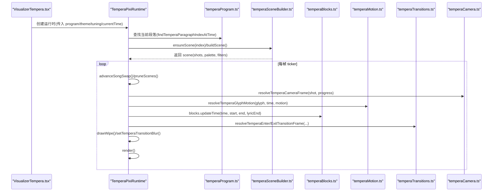
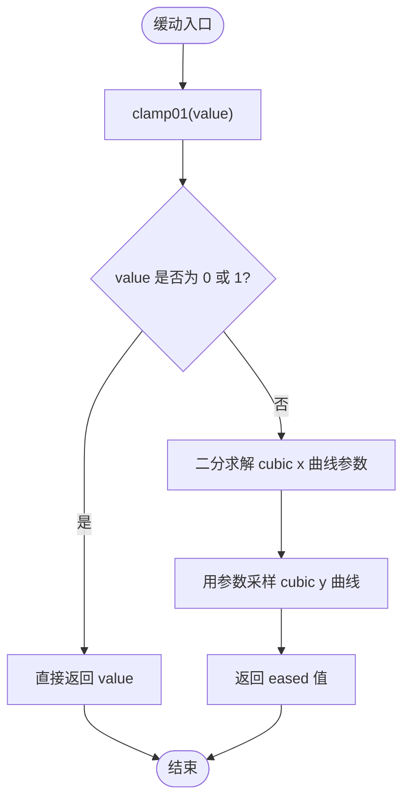
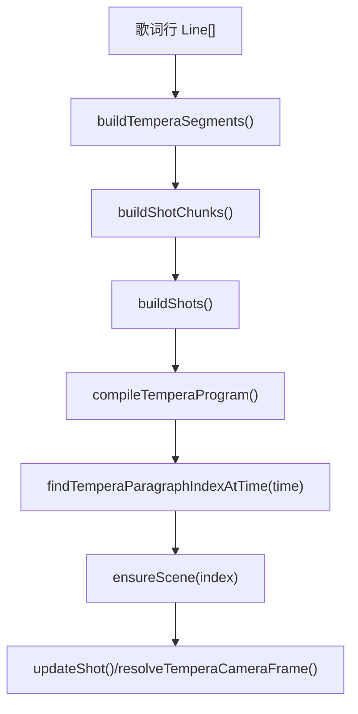
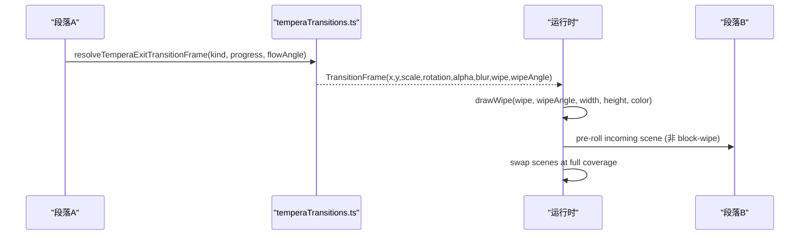
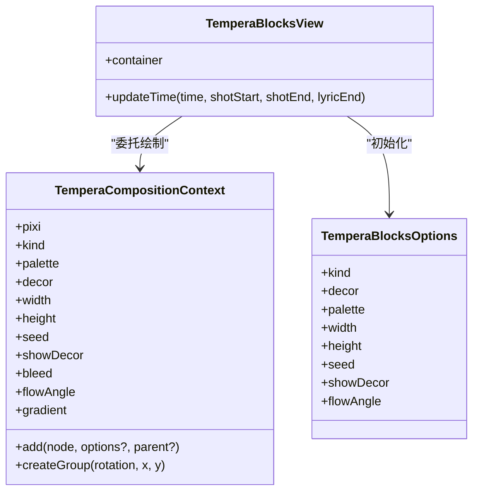
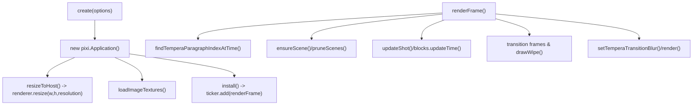
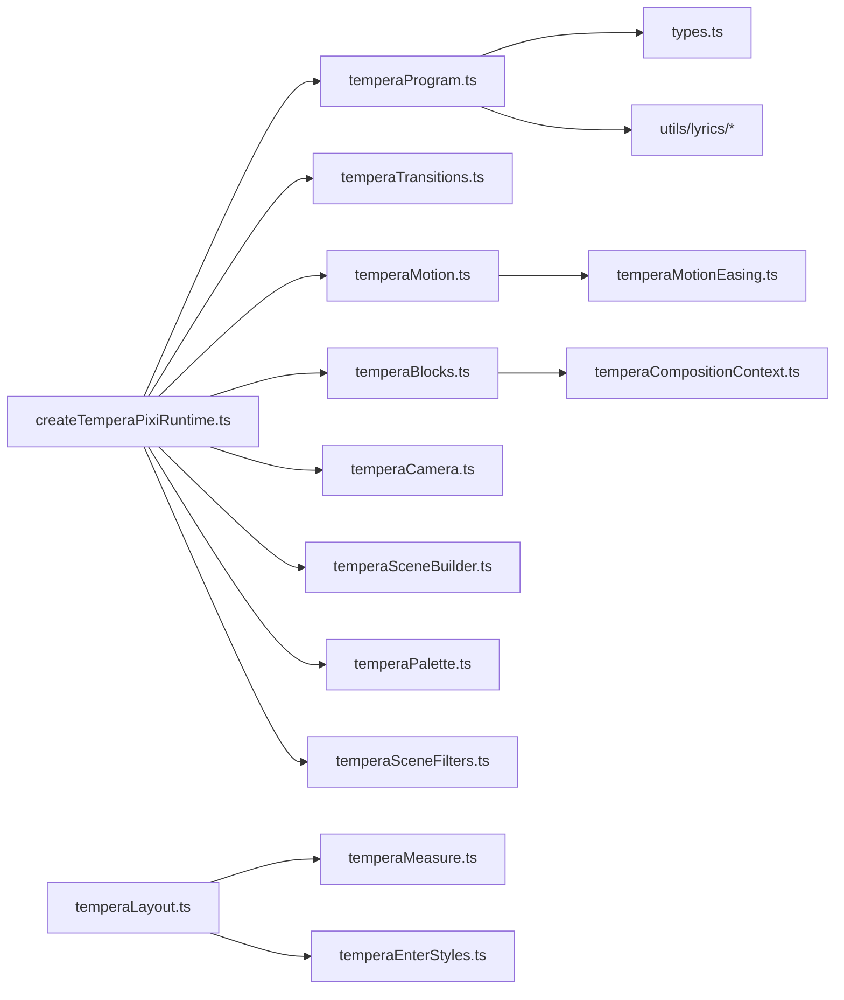

# 动画与运动系统

<cite>
**本文引用的文件**   
- [src/components/visualizer/README.md](file://src/components/visualizer/README.md)
- [src/components/visualizer/tempera/README.md](file://src/components/visualizer/tempera/README.md)
- [src/components/visualizer/tempera/temperaMotionEasing.ts](file://src/components/visualizer/tempera/temperaMotionEasing.ts)
- [src/components/visualizer/tempera/temperaMotion.ts](file://src/components/visualizer/tempera/temperaMotion.ts)
- [src/components/visualizer/tempera/temperaTransitions.ts](file://src/components/visualizer/tempera/temperaTransitions.ts)
- [src/components/visualizer/tempera/temperaCompositionContext.ts](file://src/components/visualizer/tempera/temperaCompositionContext.ts)
- [src/components/visualizer/tempera/temperaProgram.ts](file://src/components/visualizer/tempera/temperaProgram.ts)
- [src/components/visualizer/tempera/types.ts](file://src/components/visualizer/tempera/types.ts)
- [src/components/visualizer/tempera/temperaLayout.ts](file://src/components/visualizer/tempera/temperaLayout.ts)
- [src/components/visualizer/tempera/temperaBlocks.ts](file://src/components/visualizer/tempera/temperaBlocks.ts)
- [src/components/visualizer/tempera/createTemperaPixiRuntime.ts](file://src/components/visualizer/tempera/createTemperaPixiRuntime.ts)
</cite>

## 目录
1. [引言](#引言)
2. [项目结构](#项目结构)
3. [核心组件](#核心组件)
4. [架构总览](#架构总览)
5. [详细组件分析](#详细组件分析)
6. [依赖关系分析](#依赖关系分析)
7. [性能考量](#性能考量)
8. [故障排查指南](#故障排查指南)
9. [结论](#结论)
10. [附录：自定义动画效果开发指南与调试工具](#附录自定义动画效果开发指南与调试工具)

## 引言
本技术文档聚焦于 Tempera（凝彩）模式的动画与运动系统，围绕以下目标展开：
- 缓动函数库：线性、二次、三次、弹性等曲线在系统中的实现与使用。
- 时间轴控制系统：关键帧插值、动画序列编排与时间同步机制。
- 过渡效果系统：段落转场、镜头交接、元素位移与模糊擦除。
- 音频响应动画：频谱分析与节拍检测在该模式中的角色与边界。
- 性能优化策略：GPU 加速、批处理渲染、纹理池与内存管理。
- 自定义动画效果开发指南与调试工具使用方法。

Tempera 是 PixiJS 驱动的绝对时间驱动型歌词 PV 模式，强调确定性、可寻址回放和拼贴式排版；其渲染层不消费音频，音频数据仅用于共享背景层。

## 项目结构
Tempera 位于 `src/components/visualizer/tempera`，采用“编译期程序 + 运行时求解”的分层组织：
- 编译期：将歌词行切分为段落、shot、slice，并生成带 seed 的装饰、镜头、flowAngle 等纯数据。
- 运行时：按绝对播放时间驱动场景、镜头、逐字运动、转场与片尾卡。

图表来源
- [src/components/visualizer/tempera/createTemperaPixiRuntime.ts:45-266](file://src/components/visualizer/tempera/createTemperaPixiRuntime.ts#L45-L266)
- [src/components/visualizer/tempera/temperaProgram.ts:30-32](file://src/components/visualizer/tempera/temperaProgram.ts#L30-L32)
- [src/components/visualizer/tempera/temperaBlocks.ts:11-15](file://src/components/visualizer/tempera/temperaBlocks.ts#L11-L15)
- [src/components/visualizer/tempera/temperaMotion.ts:10-13](file://src/components/visualizer/tempera/temperaMotion.ts#L10-L13)
- [src/components/visualizer/tempera/temperaTransitions.ts:4-8](file://src/components/visualizer/tempera/temperaTransitions.ts#L4-L8)

章节来源
- [src/components/visualizer/README.md:131-139](file://src/components/visualizer/README.md#L131-L139)
- [src/components/visualizer/tempera/README.md:7-18](file://src/components/visualizer/tempera/README.md#L7-L18)

## 核心组件
- 缓动与运动求解器
  - 提供 CSS cubic-bezier 解析、进入/进出/回弹缓动，以及逐字入场、当前字强调、唱完释放（tracking expansion）。
- 时间轴与序列编排
  - 将歌词编译为段落、shot、bridge shot，维护 flowAngle、camera keyframes、decor 与 transitionOut。
- 转场系统
  - block-wipe、camera-pan、shape-carry 三种段落转场，沿 flowAngle 连续移动，避免硬切。
- 构图与色块
  - 通过 composition context 绘制静态图形，blocks 持有 enter/exit/drift/grow 等运动状态。
- 运行时
  - 管理 Pixi Application、scene cache ±1、song handover、图片纹理、overlay wipe、credits 与后处理分辨率。

章节来源
- [src/components/visualizer/tempera/temperaMotionEasing.ts:1-49](file://src/components/visualizer/tempera/temperaMotionEasing.ts#L1-L49)
- [src/components/visualizer/tempera/temperaMotion.ts:10-144](file://src/components/visualizer/tempera/temperaMotion.ts#L10-L144)
- [src/components/visualizer/tempera/temperaTransitions.ts:4-118](file://src/components/visualizer/tempera/temperaTransitions.ts#L4-L118)
- [src/components/visualizer/tempera/temperaBlocks.ts:11-153](file://src/components/visualizer/tempera/temperaBlocks.ts#L11-L153)
- [src/components/visualizer/tempera/createTemperaPixiRuntime.ts:45-266](file://src/components/visualizer/tempera/createTemperaPixiRuntime.ts#L45-L266)

## 架构总览
Tempera 的运行流程从 React 外壳到 Pixi 运行时，再到段落场景与 shot 级更新：

图表来源
- [src/components/visualizer/tempera/createTemperaPixiRuntime.ts:674-800](file://src/components/visualizer/tempera/createTemperaPixiRuntime.ts#L674-L800)
- [src/components/visualizer/tempera/temperaProgram.ts:515-632](file://src/components/visualizer/tempera/temperaProgram.ts#L515-L632)
- [src/components/visualizer/tempera/temperaMotion.ts:72-131](file://src/components/visualizer/tempera/temperaMotion.ts#L72-L131)
- [src/components/visualizer/tempera/temperaBlocks.ts:116-151](file://src/components/visualizer/tempera/temperaBlocks.ts#L116-L151)
- [src/components/visualizer/tempera/temperaTransitions.ts:38-117](file://src/components/visualizer/tempera/temperaTransitions.ts#L38-L117)

## 详细组件分析

### 缓动函数库与数学实现
- cubic-bezier 解析
  - 通过二分迭代求解 x 曲线参数，再采样 y，得到 CSS 风格的 cubic-bezier 数值解。
- 进入与进出缓动
  - easeTemperaEnter：前重后轻，强调果断开场与长尾慢爬。
  - easeTemperaInOut：对称平滑，常用于透明度与缩放。
  - easeTemperaSoftBack：轻微回弹，用于 scale 落位时的微过冲。
- 线性与基础工具
  - clamp01 保证输入范围；resolveShotPacedDuration 将比例映射为秒数并钳制速度。

图表来源
- [src/components/visualizer/tempera/temperaMotionEasing.ts:4-33](file://src/components/visualizer/tempera/temperaMotionEasing.ts#L4-L33)

章节来源
- [src/components/visualizer/tempera/temperaMotionEasing.ts:1-49](file://src/components/visualizer/tempera/temperaMotionEasing.ts#L1-L49)
- [src/components/visualizer/tempera/temperaMotion.ts:13-144](file://src/components/visualizer/tempera/temperaMotion.ts#L13-L144)

### 时间轴控制与关键帧插值
- 段落与 shot 编译
  - buildTemperaSegments：词/音节边界 + 标点粘附重计时。
  - buildShotChunks：默认半句切分（2~4 词或 ~2.2s），wholeLineLyrics 整句模式。
  - buildShots：选择 shot kind、flowAngle、camera keys、decor。
  - buildBridgeShots：≥1.2s 间隙填充无歌词 shot，保持画面持续运动。
- 关键帧插值
  - camera.start/cameraEnd 在运行时按进度插值，叠加 breath 微动。
  - 逐字 startTime/settleTime/releaseTime 由布局阶段计算，运行时按绝对时间求解。

图表来源
- [src/components/visualizer/tempera/temperaProgram.ts:61-113](file://src/components/visualizer/tempera/temperaProgram.ts#L61-L113)
- [src/components/visualizer/tempera/temperaProgram.ts:181-243](file://src/components/visualizer/tempera/temperaProgram.ts#L181-L243)
- [src/components/visualizer/tempera/temperaProgram.ts:358-447](file://src/components/visualizer/tempera/temperaProgram.ts#L358-L447)
- [src/components/visualizer/tempera/temperaProgram.ts:458-513](file://src/components/visualizer/tempera/temperaProgram.ts#L458-L513)
- [src/components/visualizer/tempera/temperaProgram.ts:515-632](file://src/components/visualizer/tempera/temperaProgram.ts#L515-L632)
- [src/components/visualizer/tempera/createTemperaPixiRuntime.ts:674-701](file://src/components/visualizer/tempera/createTemperaPixiRuntime.ts#L674-L701)

章节来源
- [src/components/visualizer/tempera/temperaProgram.ts:30-632](file://src/components/visualizer/tempera/temperaProgram.ts#L30-L632)
- [src/components/visualizer/tempera/types.ts:164-299](file://src/components/visualizer/tempera/types.ts#L164-L299)

### 过渡效果系统
- 段落转场类型
  - block-wipe：全屏色块沿 flowAngle 扫过，满覆盖时切换场景。
  - camera-pan：相机平移，alpha 在接近出画时才衰减，避免空屏。
  - shape-carry：形状漂移、放大、模糊，柔和退出。
- 运行时机
  - 出段：transitionOut 在段落末尾附近触发。
  - 入段：block-wipe 在进入段落后开始“揭开遮罩”，其他转场提前预卷下一段 scene。

图表来源
- [src/components/visualizer/tempera/temperaTransitions.ts:38-92](file://src/components/visualizer/tempera/temperaTransitions.ts#L38-L92)
- [src/components/visualizer/tempera/createTemperaPixiRuntime.ts:712-781](file://src/components/visualizer/tempera/createTemperaPixiRuntime.ts#L712-L781)
- [src/components/visualizer/tempera/createTemperaPixiRuntime.ts:637-672](file://src/components/visualizer/tempera/createTemperaPixiRuntime.ts#L637-L672)

章节来源
- [src/components/visualizer/tempera/temperaTransitions.ts:4-118](file://src/components/visualizer/tempera/temperaTransitions.ts#L4-L118)
- [src/components/visualizer/tempera/createTemperaPixiRuntime.ts:712-800](file://src/components/visualizer/tempera/createTemperaPixiRuntime.ts#L712-L800)

### 音频响应动画
- Tempera 渲染层不消费音频（audioPower/audioBands 仅传给共享背景层）。
- 因此，频谱分析、节拍检测与节奏同步不在该模式内实现；若需音乐联动，应通过背景层或其他宿主逻辑完成。

章节来源
- [src/components/visualizer/tempera/README.md:126-129](file://src/components/visualizer/tempera/README.md#L126-L129)

### 构图、色块与文字排版
- Composition Context
  - 统一 pixi、kind、palette、decor、width/height、seed、showDecor、flowAngle、gradient、add/createGroup。
- Blocks
  - 持有每个 Graphics 的 baseX/Y/Alpha、enterDX/DY、delay/span、drift/grow，按 shot 时长比例驱动 stagger 与 creep。
- Layout
  - 拼贴排版：Intl.Segmenter 分词决定字号层级，CJK 留 0.035em 视觉微距；hero 词放大，其余缩小；每字独立入场向量与样式。
  - settleStretch 控制入场窗口拉伸，release 阶段中心外扩 tracking。

图表来源
- [src/components/visualizer/tempera/temperaCompositionContext.ts:12-53](file://src/components/visualizer/tempera/temperaCompositionContext.ts#L12-L53)
- [src/components/visualizer/tempera/temperaBlocks.ts:19-40](file://src/components/visualizer/tempera/temperaBlocks.ts#L19-L40)
- [src/components/visualizer/tempera/temperaBlocks.ts:57-114](file://src/components/visualizer/tempera/temperaBlocks.ts#L57-L114)

章节来源
- [src/components/visualizer/tempera/temperaCompositionContext.ts:1-53](file://src/components/visualizer/tempera/temperaCompositionContext.ts#L1-L53)
- [src/components/visualizer/tempera/temperaBlocks.ts:11-153](file://src/components/visualizer/tempera/temperaBlocks.ts#L11-L153)
- [src/components/visualizer/tempera/temperaLayout.ts:16-377](file://src/components/visualizer/tempera/temperaLayout.ts#L16-L377)

### 运行时与像素管线
- Pixi 生命周期
  - createApplication、app.ticker、ResizeObserver、sharedTicker=false、useBackBuffer=true。
- Scene Cache 与 Song Handover
  - 缓存 ±1 个段落场景；歌曲切换两帧完成：第一帧构建新场景，第二帧替换内容，旧场景逐帧释放。
- 图片纹理
  - 直接从 Blob 解码（createImageBitmap/SVG 回退 Image），Texture.from 复用，避免 Assets.load。
- 后处理与分辨率
  - snapResolutionToTexturePool 吸附纹理池档位；filter pass resolution 继承或压缩；transition blur 随 pass 一半分辨率。

图表来源
- [src/components/visualizer/tempera/createTemperaPixiRuntime.ts:224-277](file://src/components/visualizer/tempera/createTemperaPixiRuntime.ts#L224-L277)
- [src/components/visualizer/tempera/createTemperaPixiRuntime.ts:290-311](file://src/components/visualizer/tempera/createTemperaPixiRuntime.ts#L290-L311)
- [src/components/visualizer/tempera/createTemperaPixiRuntime.ts:429-444](file://src/components/visualizer/tempera/createTemperaPixiRuntime.ts#L429-L444)
- [src/components/visualizer/tempera/createTemperaPixiRuntime.ts:674-800](file://src/components/visualizer/tempera/createTemperaPixiRuntime.ts#L674-L800)

章节来源
- [src/components/visualizer/tempera/createTemperaPixiRuntime.ts:45-800](file://src/components/visualizer/tempera/createTemperaPixiRuntime.ts#L45-L800)

## 依赖关系分析
- 模块耦合
  - runtime 依赖 program、transitions、motion、blocks、camera、scene builder、palette、filters。
  - program 依赖 lyrics grapheme timing、word segmentation、shot profiles、random seed。
  - layout 依赖 measure、enter styles、shot profiles、random seed。
- 外部依赖
  - PixiJS（Graphics、Text、Container、Application、Texture）。
  - Framer Motion（MotionValue 作为 currentTime 源）。
- 循环依赖
  - 通过拆分 easing/motion/layout/blocks/transitions 避免互相导入；composition context 仅声明接口契约。

图表来源
- [src/components/visualizer/tempera/createTemperaPixiRuntime.ts:1-40](file://src/components/visualizer/tempera/createTemperaPixiRuntime.ts#L1-L40)
- [src/components/visualizer/tempera/temperaProgram.ts:1-24](file://src/components/visualizer/tempera/temperaProgram.ts#L1-L24)
- [src/components/visualizer/tempera/temperaBlocks.ts:1-10](file://src/components/visualizer/tempera/temperaBlocks.ts#L1-L10)
- [src/components/visualizer/tempera/temperaMotion.ts:1-7](file://src/components/visualizer/tempera/temperaMotion.ts#L1-L7)
- [src/components/visualizer/tempera/temperaLayout.ts:1-10](file://src/components/visualizer/tempera/temperaLayout.ts#L1-L10)

章节来源
- [src/components/visualizer/tempera/temperaProgram.ts:1-24](file://src/components/visualizer/tempera/temperaProgram.ts#L1-L24)
- [src/components/visualizer/tempera/createTemperaPixiRuntime.ts:1-40](file://src/components/visualizer/tempera/createTemperaPixiRuntime.ts#L1-L40)

## 性能考量
- GPU 加速
  - 使用 Pixi WebGL 渲染；useBackBuffer=true 确保 difference filter 生效。
- 批处理渲染
  - 同一 shot 的多个 Graphics 节点尽量合并；气泡/星形等集合走单个 Graphics 节点以减少批次。
- 纹理池与分辨率
  - snapResolutionToTexturePool 将视口分辨率吸附到纹理池档位，减少显存浪费；postProcessTextureCompression 允许回退到旧行为以保兼容。
- 内存管理
  - scene cache ±1；retiredScenes 逐帧释放；destroyPixiDisplayTree 逐个销毁 GraphicsContext 与 GPU 缓冲；图片纹理一次性加载并按 id 复用。
- 帧预算
  - 每帧只做一件昂贵的事：先释放 retired scenes，再预取相邻段落 scene；避免在 swap 帧做大量 GC。

章节来源
- [src/components/visualizer/tempera/createTemperaPixiRuntime.ts:173-216](file://src/components/visualizer/tempera/createTemperaPixiRuntime.ts#L173-L216)
- [src/components/visualizer/tempera/createTemperaPixiRuntime.ts:455-495](file://src/components/visualizer/tempera/createTemperaPixiRuntime.ts#L455-L495)
- [src/components/visualizer/tempera/createTemperaPixiRuntime.ts:674-701](file://src/components/visualizer/tempera/createTemperaPixiRuntime.ts#L674-L701)
- [src/components/visualizer/tempera/README.md:106-121](file://src/components/visualizer/tempera/README.md#L106-L121)

## 故障排查指南
- 文字反色异常
  - 检查 difference filter 是否挂在 textLayer 上且 bounds 最小化；确认未停放 disabled filter；gradient 模式下关闭 textInversion 会退化 tint-only。
- 后处理变糊
  - 确认所有 filter pass 的 resolution 一致（inherit 或压缩档）；transition blur 使用所在 pass 的一半分辨率。
- 场景卡顿
  - 检查是否在 swap 帧重建场景；确认 retiredScenes 被 drainRetiredScene 逐帧释放；避免重复 loadImageTextures。
- 图片未显示
  - 确认 Blob 解码成功；SVG 回退到 Image；不要用 Assets.load（blob URL 无后缀会被拒绝）。
- 转场闪烁
  - 确认 block-wipe 的 enter 阶段在段落开始后执行；其他转场启用 pre-roll 以避免滑出到空白 shell。

章节来源
- [src/components/visualizer/tempera/README.md:92-105](file://src/components/visualizer/tempera/README.md#L92-L105)
- [src/components/visualizer/tempera/createTemperaPixiRuntime.ts:429-444](file://src/components/visualizer/tempera/createTemperaPixiRuntime.ts#L429-L444)
- [src/components/visualizer/tempera/createTemperaPixiRuntime.ts:712-781](file://src/components/visualizer/tempera/createTemperaPixiRuntime.ts#L712-L781)

## 结论
Tempera 的动画与运动系统以“编译期程序 + 绝对时间驱动”为核心，通过稳定的缓动函数、严格的 shot 交接与段落转场、以及精细的纹理池与内存管理，实现了高可读性、低抖动、可寻址的歌词 PV 体验。其渲染层不消费音频，音频联动应由背景层或宿主逻辑承担。扩展自定义动画效果时，应遵循 composition context 契约、保持确定性、并在运行时按帧求解而非频繁重建场景。

## 附录：自定义动画效果开发指南与调试工具
- 新增构图族
  - 在 compositions 下新建文件，注册到 temperaCompositions；遵循 TemperaCompositionContext 契约，输出静态 Graphics。
- 新增缓动曲线
  - 在 temperaMotionEasing.ts 中新增函数，并在 temperaMotion.ts 暴露；在 layout 或 blocks 中按语义使用。
- 新增转场
  - 在 types.ts 的 TEMPERA_TRANSITION_KINDS 中添加 kind，并在 temperaTransitions.ts 实现 resolveTemperaTransitionEffectFrame。
- 调试建议
  - 使用 VisPlayground 预览当前 tuning；观察 scene cache 与 retiredScenes 释放；检查 filter resolution 与 texture pool 档位；对长句/间奏验证 lyricEndTime 与 endTime 的使用是否正确。

章节来源
- [src/components/visualizer/tempera/temperaCompositionContext.ts:12-53](file://src/components/visualizer/tempera/temperaCompositionContext.ts#L12-L53)
- [src/components/visualizer/tempera/temperaMotionEasing.ts:1-49](file://src/components/visualizer/tempera/temperaMotionEasing.ts#L1-L49)
- [src/components/visualizer/tempera/temperaTransitions.ts:157-162](file://src/components/visualizer/tempera/temperaTransitions.ts#L157-L162)
- [src/components/visualizer/README.md:155-173](file://src/components/visualizer/README.md#L155-L173)