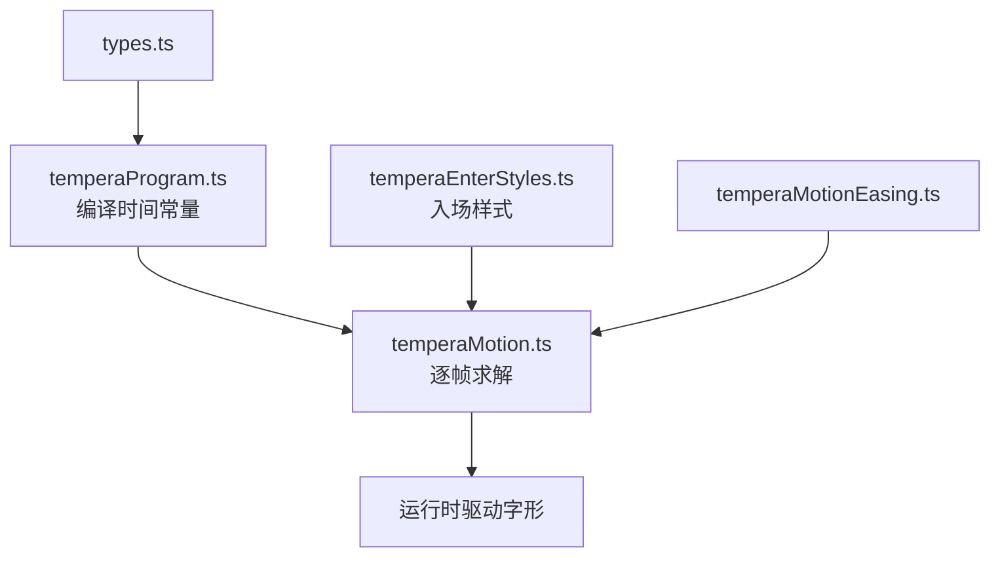
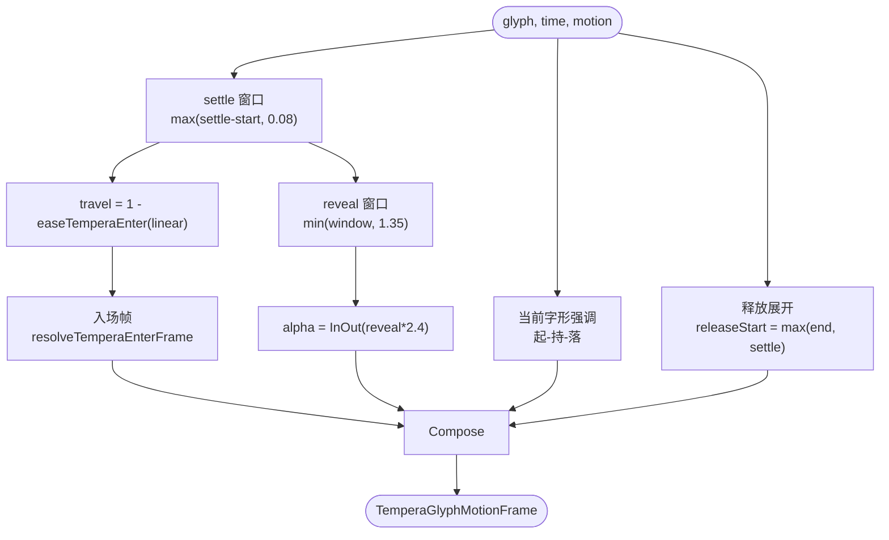
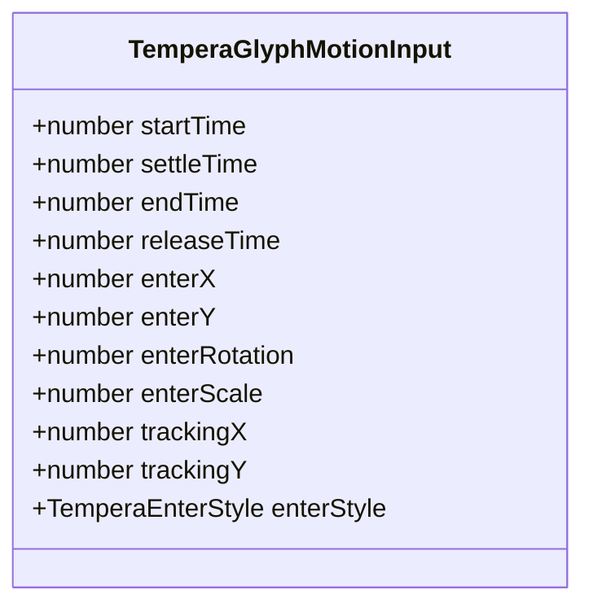
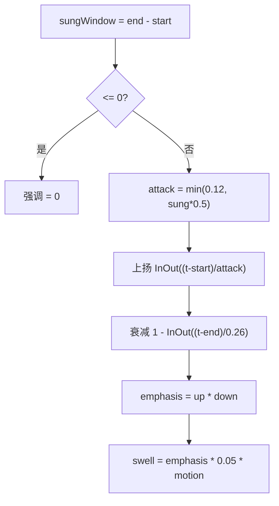
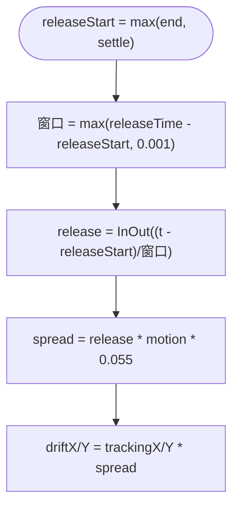
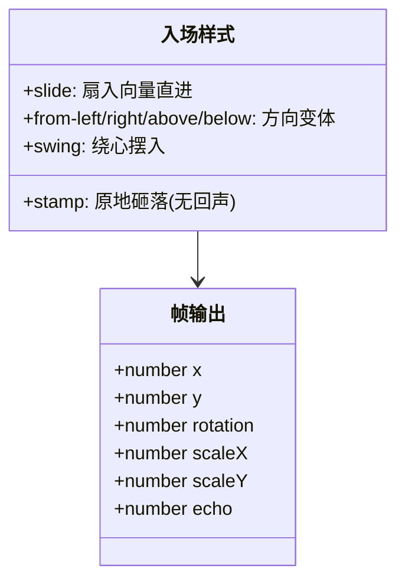
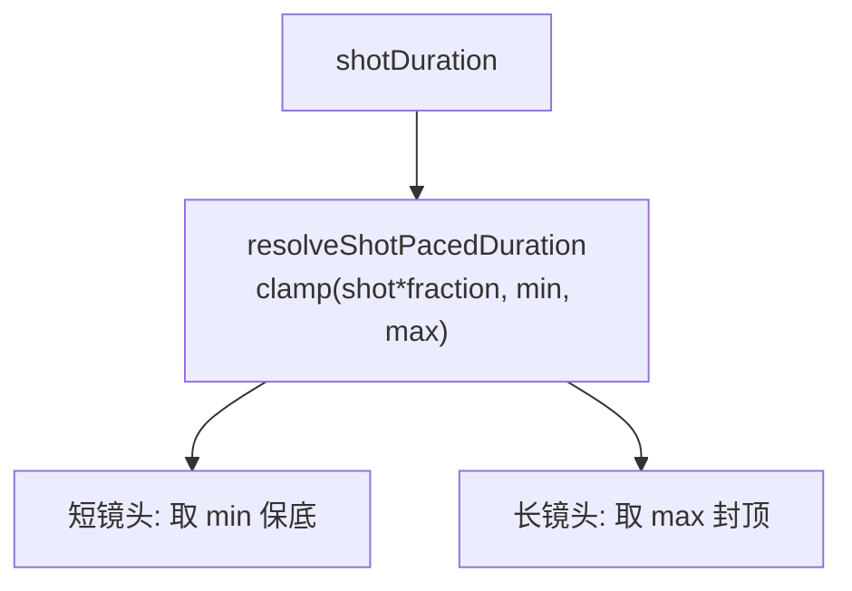
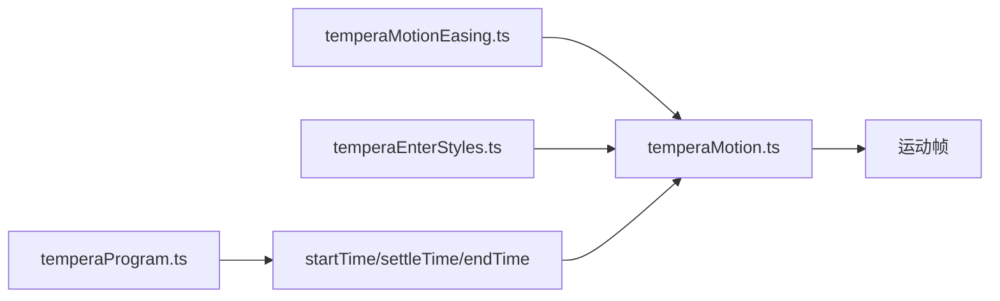

# 时间轴控制系统

<cite>
**本文引用的文件**   
- [temperaMotion.ts](file://src/components/visualizer/tempera/temperaMotion.ts)
- [temperaEnterStyles.ts](file://src/components/visualizer/tempera/temperaEnterStyles.ts)
- [temperaMotionEasing.ts](file://src/components/visualizer/tempera/temperaMotionEasing.ts)
- [temperaProgram.ts](file://src/components/visualizer/tempera/temperaProgram.ts)
- [types.ts](file://src/components/visualizer/tempera/types.ts)
- [temperaMotion.test.ts](file://test/unit/visualizer/temperaMotion.test.ts)
</cite>

## 目录
1. [引言](#引言)
2. [项目结构](#项目结构)
3. [核心组件](#核心组件)
4. [架构总览](#架构总览)
5. [详细组件分析](#详细组件分析)
6. [依赖关系分析](#依赖关系分析)
7. [性能考量](#性能考量)
8. [故障排查指南](#故障排查指南)
9. [结论](#结论)

## 引言
本文聚焦 Tempera 模式的时间轴控制系统，围绕以下目标展开：
- 解释绝对时间运动评估机制：每个运动值都由时钟与每字形常量推导，seek 与连续播放逐像素一致。
- 说明字形入场动画系统：`startTime`、`settleTime`、`endTime`、`releaseTime` 四个时间参数的作用与控制逻辑。
- 阐述动画序列编排：入场样式（enterStyle）、跟踪偏移（trackingX/Y）、释放时间（releaseTime）与当前字形强调的计算方式。
- 解释时间窗口管理与性能策略。

## 项目结构
- temperaMotion.ts：时间轴求解核心——`resolveTemperaGlyphMotion` 与 `resolveShotPacedDuration`。
- temperaEnterStyles.ts：入场样式矩阵（7 种方向/形态变体）。
- temperaMotionEasing.ts：曲线基元。
- temperaProgram.ts：节目编译，为每个字形生成时间常量。
- types.ts：镜头/段落数据结构（`TemperaShot`、`TemperaCameraKey` 等）。

**图示来源**
- [temperaMotion.ts:1-13](file://src/components/visualizer/tempera/temperaMotion.ts#L1-L13)
- [temperaProgram.ts:515-633](file://src/components/visualizer/tempera/temperaProgram.ts#L515-L633)

**章节来源**
- [temperaMotion.ts:10-12](file://src/components/visualizer/tempera/temperaMotion.ts#L10-L12)

## 核心组件
- `resolveTemperaGlyphMotion(glyph, time, motion)`：单个字形的完整运动帧求解。
- `resolveShotPacedDuration(shotDuration, fraction, minSeconds, maxSeconds)`：把镜头时长映射为动画秒数（带上下限）。
- 四个时间常量：`startTime`（开始唱）、`settleTime`（落位完成）、`endTime`（唱完）、`releaseTime`（释放展开到达全幅）。
- 三个时间窗口：settle 窗口（位置/缩放）、reveal 窗口（透明度/回声，上限 1.35s）、release 窗口（唱后加宽）。

**章节来源**
- [temperaMotion.ts:15-49](file://src/components/visualizer/tempera/temperaMotion.ts#L15-L49)

## 架构总览
每个字形每帧的求解流程是固定的六段：窗口计算 → 旅行量（位置/旋转）→ 透明度 → 当前强调 → 释放展开 → 合成帧。所有数值直接由 `time` 求解，没有跨帧状态，因此拖动进度条与连续播放得到完全相同的画面。

**图示来源**
- [temperaMotion.ts:76-130](file://src/components/visualizer/tempera/temperaMotion.ts#L76-L130)

**章节来源**
- [temperaMotion.ts:69-131](file://src/components/visualizer/tempera/temperaMotion.ts#L69-L131)

## 详细组件分析

### 四个时间参数
- `startTime`：字形开始入场（与歌词时序对齐）。
- `settleTime`：位置与缩放完成落位；`visible = time >= startTime` 是最基本的可见性判断。
- `endTime`：字形唱完的时间——驱动"当前字形强调"的衰减起点；未唱的标点（零长度）不会获得强调。
- `releaseTime`：唱后释放展开到达全幅的时间，由行自身时长界定——**一行唱完多久，字形就展开多久，不再延长**。

**图示来源**
- [temperaMotion.ts:15-34](file://src/components/visualizer/tempera/temperaMotion.ts#L15-L34)

**章节来源**
- [temperaMotion.ts:15-34](file://src/components/visualizer/tempera/temperaMotion.ts#L15-L34)

### 当前字形强调：起-持-落
强调是一个小的缩放膨胀（`CURRENT_EMPHASIS = 0.05`），而不是绘制背板：任何画在字形后面的东西都会成为反色滤镜读取的背景，把效果变成"彩色盒子"而不是对画面的反应。强调跟随"被唱窗口"本身（上扬-min(0.12, 时长*0.5)、）与衰减（`EMPHASIS_DECAY = 0.26`）两段 InOut 相乘得到；零长度字形（合并的标点）不产生脉冲。这一修正记录了历史教训：旧实现给每个字形都发脉冲，导致标点自己弹跳。

**图示来源**
- [temperaMotion.ts:87-100](file://src/components/visualizer/tempera/temperaMotion.ts#L87-L100)

**章节来源**
- [temperaMotion.ts:87-100](file://src/components/visualizer/tempera/temperaMotion.ts#L87-L100)

### 释放展开：唱后的缓慢加宽
唱完的字形不会冻结，而是缓慢展开字距（tracking）：`releaseStart = max(endTime, settleTime)` 保证释放不与入场打架；`spread = release * motion * 0.055`（`RELEASE_TRACKING` 刻意很小——这是加宽字距，不是漂移）。展开是刚性、从中心向外的扩张：无游走、无漂浮、无旋转——因为漂移的字形会违背该模式建立在确定性排版上的原则。

**图示来源**
- [temperaMotion.ts:102-113](file://src/components/visualizer/tempera/temperaMotion.ts#L102-L113)

**章节来源**
- [temperaMotion.ts:102-113](file://src/components/visualizer/tempera/temperaMotion.ts#L102-L113)

### 入场样式与序列编排
入场样式在布局期按词选取（同一词作为整体落位，相邻词样式不同，避免拼贴读作统一下滑）：
- 方向变体：`from-left`/`from-right`/`from-above`/`from-below` 复用布局给定的距离，只改方向（带轻微横轴倾斜）。
- `slide`：沿镜头自身的扇入向量直进。
- `swing`：位移取 0.6 倍，旋转额外加 ±0.95 弧度，绕中心摆入。
- `stamp`：唯一原地样式——从放大状态砸落，无位移、无回声。
所有样式的定位幅度都由布局预选，切换样式只换"从哪来"，不换"走多远"。

**图示来源**
- [temperaEnterStyles.ts:11-117](file://src/components/visualizer/tempera/temperaEnterStyles.ts#L11-L117)

**章节来源**
- [temperaEnterStyles.ts:3-19](file://src/components/visualizer/tempera/temperaEnterStyles.ts#L3-L19)

### 时间窗口管理与节奏
- 位置/缩放使用"拉长到整行"的 settle 窗口：板块在整行唱完时仍在缓入，长行因此成为一次连续运动。
- 透明度与回声使用独立上限窗口（`MAX_REVEAL_WINDOW = 1.35`）：**文字旅行过程中必须可读，活过入场期的回声会读作污迹而不是运动**。
- `resolveShotPacedDuration` 把镜头时长按比例映射为动画秒数并夹在 [min, max]：极短或极长的镜头都能以可观看的速度动画，把块运动绑定到"行的节奏"而不是固定墙钟时长。

**图示来源**
- [temperaMotion.ts:133-144](file://src/components/visualizer/tempera/temperaMotion.ts#L133-L144)

**章节来源**
- [temperaMotion.ts:51-67](file://src/components/visualizer/tempera/temperaMotion.ts#L51-L67)

## 依赖关系分析
- 时间轴求解依赖曲线库与入场样式库，两者互不依赖（拆库设计）。
- 时间常量由节目编译（temperaProgram.ts）生成，运行时只消费。
- `motion` 参数是调参/主题缩放后的量：`motion = 0` 会把所有样式钉回布局位置——入场被拉回静止姿态而不是反转。

**图示来源**
- [temperaMotion.ts:1-8](file://src/components/visualizer/tempera/temperaMotion.ts#L1-L8)

**章节来源**
- [temperaMotion.ts:115-130](file://src/components/visualizer/tempera/temperaMotion.ts#L115-L130)

## 性能考量
- 每字形每帧约十余次算术运算 + 最多三次曲线求值；无分配、无状态。
- `motion = 0` 时所有位移/旋转/回声归零，可用于静态渲染路径。
- 单元测试（`temperaMotion.test.ts`）覆盖窗口边界、强调脉冲与释放行为，修改后应保持全绿。

**章节来源**
- [temperaMotion.ts:115-131](file://src/components/visualizer/tempera/temperaMotion.ts#L115-L131)

## 故障排查指南
- 标点字形自己弹跳：检查该字形的 `endTime - startTime` 是否为正；零长度字形应当无强调。
- 长行文字在移动中不可读：透明度窗口失控；确认 reveal 窗口取的是 `min(window, 1.35)`。
- 入场在慢歌里显得"急"：`resolveShotPacedDuration` 的上限在起作用；这是有意设计（速度可观看优先）。
- 唱完的字形漂移：释放展开是刚性缩放；若出现游走，检查 `trackingX/Y` 是否被误加入了旋转或随机项。
- seek 后帧不一致：时间轴求解无状态，问题必在调用方缓存了上一帧状态。
- `motion = 0` 时仍有位移：检查入场帧是否乘了 `motion`；所有位移/旋转/回声都必须乘以它。

**章节来源**
- [temperaMotion.ts:119-130](file://src/components/visualizer/tempera/temperaMotion.ts#L119-L130)
- [temperaMotion.ts:87-100](file://src/components/visualizer/tempera/temperaMotion.ts#L87-L100)

## 结论
Tempera 时间轴控制系统以"绝对时间 + 每字形常量"的两要素模型，把入场、强调与释放三个时序行为收敛为一个纯函数。它对窗口的精细切分（settle 拉长、reveal 封顶、release 对齐唱完）与对"可读性优先"的坚持，使这个以动效见长的模式同时保持了排版的确定性与文字的可读性，是 Tempera 运动体验的核心编排层。
