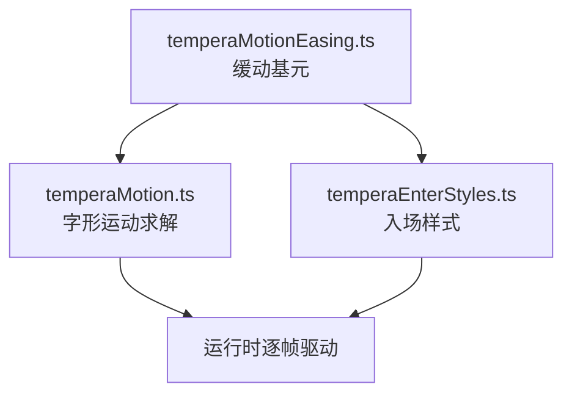
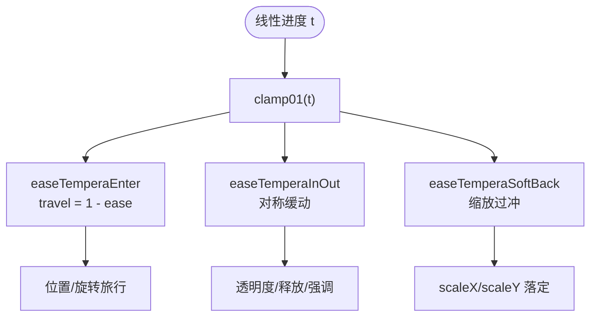
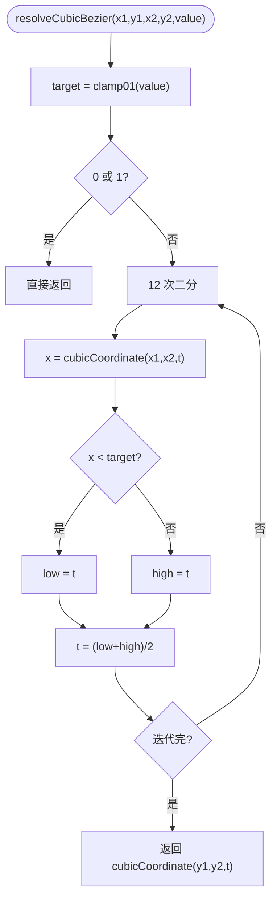
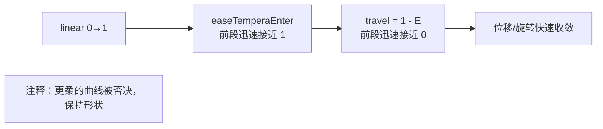
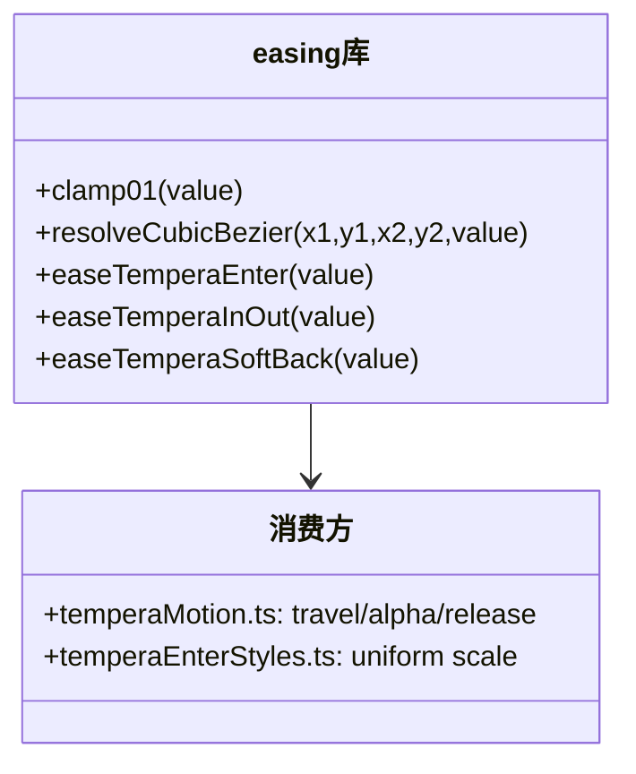
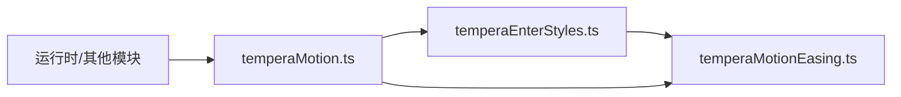

# 缓动函数库

<cite>
**本文引用的文件**   
- [temperaMotionEasing.ts](file://src/components/visualizer/tempera/temperaMotionEasing.ts)
- [temperaMotion.ts](file://src/components/visualizer/tempera/temperaMotion.ts)
- [temperaEnterStyles.ts](file://src/components/visualizer/tempera/temperaEnterStyles.ts)
- [temperaCurves.test.ts](file://test/unit/visualizer/temperaCurves.test.ts)
- [temperaMotion.test.ts](file://test/unit/visualizer/temperaMotion.test.ts)
</cite>

## 目录
1. [引言](#引言)
2. [项目结构](#项目结构)
3. [核心组件](#核心组件)
4. [架构总览](#架构总览)
5. [详细组件分析](#详细组件分析)
6. [依赖关系分析](#依赖关系分析)
7. [性能考量](#性能考量)
8. [故障排查指南](#故障排查指南)
9. [结论](#结论)

## 引言
本文聚焦 Tempera 模式的缓动函数库，围绕以下目标展开：
- 解释基础缓动曲线的数学实现：clamp01、三次贝塞尔坐标与 `resolveCubicBezier` 求解器。
- 说明 Tempera 专属缓动函数：`easeTemperaEnter`、`easeTemperaInOut`、`easeTemperaSoftBack` 的算法与设计目标。
- 阐述缓动函数被"拆库"的架构原因：入场样式与字形求解器共享而不互相导入。
- 提供使用示例、性能分析与调试建议。

缓动函数库是 Tempera 全部运动的时间基元：入场、缓入缓出、回弹与释放全部经由这几条曲线整形。

## 项目结构
- temperaMotionEasing.ts：缓动基元（无内部依赖），被两大消费方共享。
- temperaMotion.ts：字形运动求解器，汇总导出缓动函数供外部使用。
- temperaEnterStyles.ts：入场样式矩阵，使用 `easeTemperaSoftBack` 实现缩放落定。

**图示来源**
- [temperaMotionEasing.ts:1-3](file://src/components/visualizer/tempera/temperaMotionEasing.ts#L1-L3)
- [temperaMotion.ts:1-13](file://src/components/visualizer/tempera/temperaMotion.ts#L1-L13)

**章节来源**
- [temperaMotionEasing.ts:1-3](file://src/components/visualizer/tempera/temperaMotionEasing.ts#L1-L3)

## 核心组件
- `clamp01(value)`：把值夹紧到 [0,1]，所有缓动的入口守卫。
- `cubicCoordinate(point1, point2, time)`：三次贝塞尔单轴坐标（伯恩斯坦多项式展开）。
- `resolveCubicBezier(x1, y1, x2, y2, value)`：CSS 风格 cubic-bezier——先解 x 曲线再采 y 值。
- `easeTemperaEnter`：`cubic-bezier(0.22, 1, 0.36, 1)`——开场果断、尾部长的软减速。
- `easeTemperaInOut`：`cubic-bezier(0.62, 0, 0.32, 1)`——对称的缓入缓出。
- `easeTemperaSoftBack`：带轻度过冲的闭式回弹（c = 1.42），用于缩放落定。

**章节来源**
- [temperaMotionEasing.ts:4-49](file://src/components/visualizer/tempera/temperaMotionEasing.ts#L4-L49)

## 架构总览
缓动库的调用链为"线性进度 → 曲线整形 → 物理量"。三个函数在实现中被反复共享：`easeTemperaEnter` 驱动位置旅行（travel = 1 - ease），`easeTemperaInOut` 驱动透明度、强调衰减与释放展开，`easeTemperaSoftBack` 驱动缩放落定的轻微过冲。

**图示来源**
- [temperaMotion.ts:77-130](file://src/components/visualizer/tempera/temperaMotion.ts#L77-L130)

**章节来源**
- [temperaMotion.ts:69-131](file://src/components/visualizer/tempera/temperaMotion.ts#L69-L131)

## 详细组件分析

### cubic-bezier 求解器
与 Sonnet 的实现同源：输入目标 x，用 12 次二分迭代找到参数 t（使 `cubicCoordinate(x1, x2, t) ≈ target`），再以同一参数求 y。边界值 0/1 直接返回，避免迭代误差；每次迭代仅两次多项式求值。

**图示来源**
- [temperaMotionEasing.ts:13-33](file://src/components/visualizer/tempera/temperaMotionEasing.ts#L13-L33)

**章节来源**
- [temperaMotionEasing.ts:6-33](file://src/components/visualizer/tempera/temperaMotionEasing.ts#L6-L33)

### temperaEnter：开场的"果断感"
家族注释明确记录了设计取舍：**更长、更软的减速——开场果断，然后是长长的蜿蜒尾巴；更温和的曲线被尝试过，读起来会显得迟钝；开场的那一拳正是整个模式运动的来源，因此不要动它的形状。** 这条注释保护了 `easeTemperaEnter` 的形态不被"优化"掉，也解释了为什么 travel 用 `1 - easeTemperaEnter(linear)`：曲线在前段冲到接近 1，意味着元素瞬间离开入场位，随后缓慢收束。

**图示来源**
- [temperaMotionEasing.ts:35-40](file://src/components/visualizer/tempera/temperaMotionEasing.ts#L35-L40)

**章节来源**
- [temperaMotionEasing.ts:35-41](file://src/components/visualizer/tempera/temperaMotionEasing.ts#L35-L41)

### easeTemperaSoftBack：轻度过冲的闭式回弹
`easeTemperaSoftBack` 使用标准 back-out 多项式：`1 + (c+1)*(t-1)^3 + c*(t-1)^2`，c = 1.42 给出温和的过冲（t 接近 1 时短暂超过 1 再回落）。它只用于缩放：字形落定时轻微鼓起，像印压在纸上的一次微弹。

**图示来源**
- [temperaMotionEasing.ts:43-48](file://src/components/visualizer/tempera/temperaMotionEasing.ts#L43-L48)
- [temperaEnterStyles.ts:72-75](file://src/components/visualizer/tempera/temperaEnterStyles.ts#L72-L75)

**章节来源**
- [temperaMotionEasing.ts:35-49](file://src/components/visualizer/tempera/temperaMotionEasing.ts#L35-L49)

### 使用示例
- 位置旅行：`travel = 1 - easeTemperaEnter(linear)`，入场样式的位移乘数。
- 透明度：`alpha = easeTemperaInOut(clamp01(reveal * 2.4))`——透明度比位置结算得更快，保证字形在移动中已经可读。
- 强调衰减：`emphasis` 使用两段 InOut（上扬与衰减）构造"起-持-落"。
- 释放展开：`release = easeTemperaInOut((time - releaseStart) / max(...))`，唱完的板块缓慢加宽字距。

**章节来源**
- [temperaMotion.ts:77-113](file://src/components/visualizer/tempera/temperaMotion.ts#L77-L113)

## 依赖关系分析
- 缓动库刻意与两个消费方解耦：入场样式模块与字形求解器都只依赖它，而不互相导入（文件头注释明确了这一点）。
- `temperaMotion.ts` 转发导出全部缓动函数，外部模块（构图、运行时）从统一入口取用。
- 曲线是纯函数，无状态、无分配，可被测试直接采样（`temperaMotion.test.ts`）。

**图示来源**
- [temperaMotionEasing.ts:1-3](file://src/components/visualizer/tempera/temperaMotionEasing.ts#L1-L3)
- [temperaMotion.ts:8-13](file://src/components/visualizer/tempera/temperaMotion.ts#L8-L13)

**章节来源**
- [temperaMotion.ts:1-13](file://src/components/visualizer/tempera/temperaMotion.ts#L1-L13)

## 性能考量
- 二分迭代固定 12 次：单帧内数百字形逐字求值的成本可控。
- `easeTemperaSoftBack` 为闭式多项式，无迭代。
- 全部函数无闭包状态、无对象分配，适合热路径。
- 若引入查表优化，必须保持函数签名与数值一致，避免动画观感漂移。

**章节来源**
- [temperaMotionEasing.ts:13-33](file://src/components/visualizer/tempera/temperaMotionEasing.ts#L13-L33)

## 故障排查指南
- 入场显得"钝"：检查是否误把 `easeTemperaEnter` 换成了更温和的曲线——注释明确警告过这一点。
- 缩放落定没有轻微过冲：确认 `easeTemperaSoftBack` 的 c 系数未被改动；手动字重或主题不应影响该曲线。
- 透明度与位置不同步：两者使用不同窗口（reveal 上限 `MAX_REVEAL_WINDOW = 1.35s`，位置使用拉伸后的整窗），这是有意设计。
- seek 后曲线状态异常：曲线无状态，问题一定出在调用方的时间或窗口计算。
- 数值抖动：所有入口必须先 `clamp01`；直接传入越界值会破坏二分前提。

**章节来源**
- [temperaMotion.ts:55-65](file://src/components/visualizer/tempera/temperaMotion.ts#L55-L65)
- [temperaMotionEasing.ts:4-4](file://src/components/visualizer/tempera/temperaMotionEasing.ts#L4-L4)

## 结论
Tempera 缓动函数库以四个基元（clamp、贝塞尔求解器、Enter、InOut）加一条闭式回弹曲线，支撑了整个模式从入场到释放的全部时间整形。它的设计注释（"不要动它的形状"）记录了经由实践检验的取舍，而拆库架构保证了入场样式与字形求解器可以独立演化。是 Tempera 运动语言最底层、最稳定的基座。
