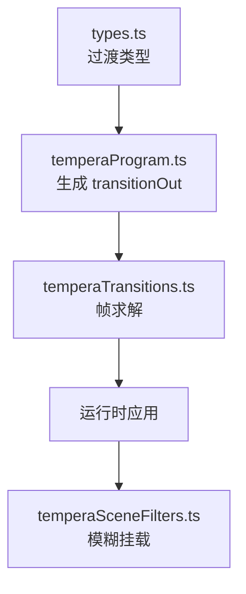
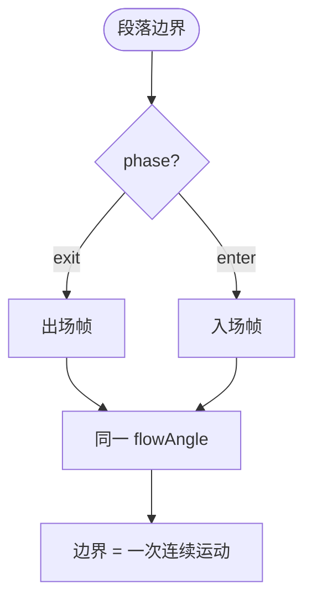
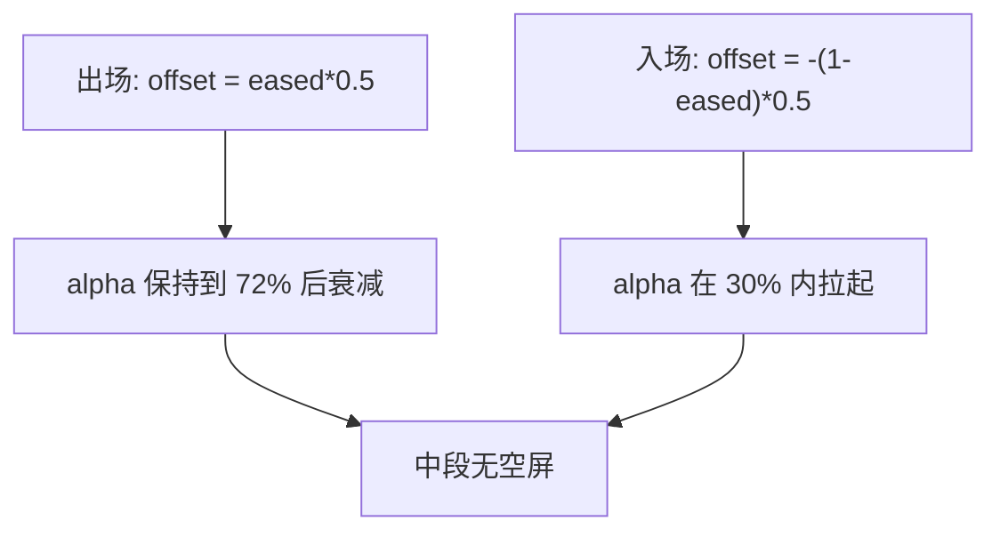
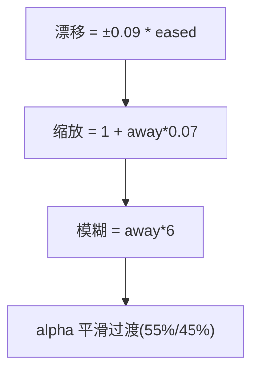
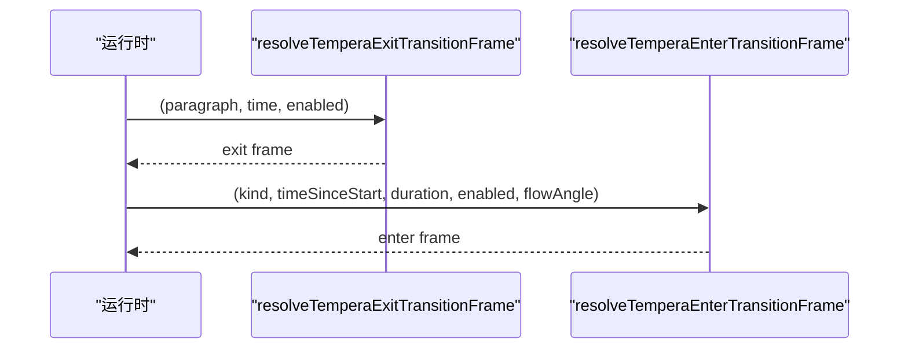
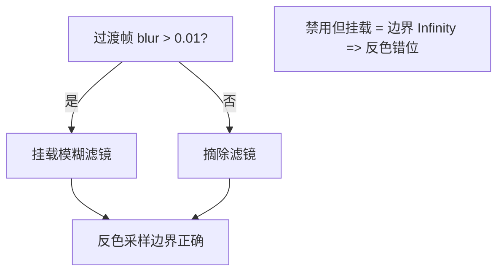
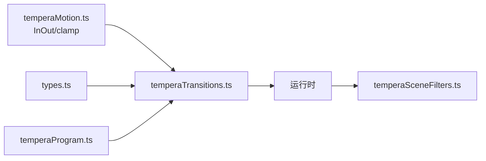

# 过渡效果系统

<cite>
**本文引用的文件**   
- [temperaTransitions.ts](file://src/components/visualizer/tempera/temperaTransitions.ts)
- [temperaMotion.ts](file://src/components/visualizer/tempera/temperaMotion.ts)
- [temperaProgram.ts](file://src/components/visualizer/tempera/temperaProgram.ts)
- [types.ts](file://src/components/visualizer/tempera/types.ts)
- [temperaSceneFilters.ts](file://src/components/visualizer/tempera/temperaSceneFilters.ts)
</cite>

## 目录
1. [引言](#引言)
2. [项目结构](#项目结构)
3. [核心组件](#核心组件)
4. [架构总览](#架构总览)
5. [详细组件分析](#详细组件分析)
6. [依赖关系分析](#依赖关系分析)
7. [性能考量](#性能考量)
8. [故障排查指南](#故障排查指南)
9. [结论](#结论)

## 引言
本文聚焦 Tempera 模式的过渡效果系统，围绕以下目标展开：
- 解释段落边界过渡的三种类型：block-wipe（块擦除）、camera-pan（相机平移）、shape-carry（形态携带）。
- 说明"沿流动方向"的设计原则：出场与入场沿同一 flow 向量运动，边界读作一次连续运动。
- 阐述过渡帧的数据结构与 seek 稳定性保证。
- 解释过渡与场景模糊滤镜的协同。

## 项目结构
- temperaTransitions.ts：过渡帧求解核心（纯函数）。
- temperaMotion.ts：提供 `easeTemperaInOut` 与 `clamp01`。
- temperaProgram.ts：在编译期为段落生成 `transitionOut`（类型与时间窗）。
- temperaSceneFilters.ts：过渡模糊滤镜的挂载策略（与反色滤镜的正确性绑定）。
- types.ts：`TemperaTransitionKind` 与 `TemperaTransition`。

**图示来源**
- [temperaTransitions.ts:1-8](file://src/components/visualizer/tempera/temperaTransitions.ts#L1-L8)
- [types.ts:157-162](file://src/components/visualizer/tempera/types.ts#L157-L162)

**章节来源**
- [temperaTransitions.ts:4-8](file://src/components/visualizer/tempera/temperaTransitions.ts#L4-L8)

## 核心组件
- `TemperaTransitionFrame`：过渡帧——x/y/scale/rotation/alpha/blur/wipe/wipeAngle 八个通道。
- `IDLE_TEMPERA_TRANSITION_FRAME`：恒等帧（无过渡时的返回值）。
- `resolveTemperaTransitionEffectFrame(kind, phase, progress, flowAngle)`：按类型与进出相位求解。
- `resolveTemperaExitTransitionFrame` / `resolveTemperaEnterTransitionFrame`：从段落与时间推导进度。
- 三种过渡类型：`block-wipe`、`camera-pan`、`shape-carry`。

**章节来源**
- [temperaTransitions.ts:9-31](file://src/components/visualizer/tempera/temperaTransitions.ts#L9-L31)

## 架构总览
过渡只在段落边界发生——镜头边界不需要：构图之间在运行时直接交错（hand off）。每种过渡都由大图形或相机领衔，并沿镜头的 `flowAngle` 运动，因此出场段落与入场段落走同一方向，边界读作一次连续的运动。所有帧由 `progress` 纯函数求得，保证 seek 稳定。

**图示来源**
- [temperaTransitions.ts:33-43](file://src/components/visualizer/tempera/temperaTransitions.ts#L33-L43)

**章节来源**
- [temperaTransitions.ts:4-8](file://src/components/visualizer/tempera/temperaTransitions.ts#L4-L8)

## 详细组件分析

### block-wipe：全遮罩块擦除
场景保持完全不透明且原地不动；一块屏幕大小的色块沿流动向量滑过，切换在全覆盖之下发生。`wipe` 是一次连续 0→2 的行程：0→1 把色块带入，1→2 把它带走——**色块永不中途反向**。wipeAngle 与 flowAngle 一致，保证擦除方向与运镜一致。

**图示来源**
- [temperaTransitions.ts:49-59](file://src/components/visualizer/tempera/temperaTransitions.ts#L49-L59)

**章节来源**
- [temperaTransitions.ts:49-59](file://src/components/visualizer/tempera/temperaTransitions.ts#L49-L59)

### camera-pan：相机平移
出场段落沿流向推出（travel 0.5），入场段落从上游到位。Alpha 被刻意保持到最后——**出场 alpha 在 72% 之前保持全量、入场在 30% 内快速拉起**，避免移动中段出现空屏。缩放附加 3% 的轻微呼吸，强化"相机运动"的读感。

**图示来源**
- [temperaTransitions.ts:61-77](file://src/components/visualizer/tempera/temperaTransitions.ts#L61-L77)

**章节来源**
- [temperaTransitions.ts:61-77](file://src/components/visualizer/tempera/temperaTransitions.ts#L61-L77)

### shape-carry：形态携带
构图沿流向继续漂移，同时膨胀并柔化——像下一张图形把它拉出焦点。**没有硬切、没有故障闪烁**：漂移 ±0.09、缩放 7%、模糊 6、alpha 在 55%/45% 处平滑过渡。它是三种过渡中最"有机"的一种，适合情绪段落之间的连接。

**图示来源**
- [temperaTransitions.ts:79-91](file://src/components/visualizer/tempera/temperaTransitions.ts#L79-L91)

**章节来源**
- [temperaTransitions.ts:79-91](file://src/components/visualizer/tempera/temperaTransitions.ts#L79-L91)

### seek 稳定性与时间推导
两个入口函数负责把时间映射为进度：
- `resolveTemperaExitTransitionFrame`：读取段落的 `transitionOut`，进度 = `(time - startTime) / max(duration, 0.001)`；flowAngle 取段落最后一个镜头的流向。
- `resolveTemperaEnterTransitionFrame`：由 `timeSinceStart / duration` 计算；越界（<0 或 >duration）返回恒等帧。
两者共享同一个效果帧求解器，保证出/入两侧的曲线参数完全对称。

**图示来源**
- [temperaTransitions.ts:94-117](file://src/components/visualizer/tempera/temperaTransitions.ts#L94-L117)

**章节来源**
- [temperaTransitions.ts:94-117](file://src/components/visualizer/tempera/temperaTransitions.ts#L94-L117)

### 与场景模糊滤镜的协同
过渡帧的 `blur` 通道由 `setTemperaTransitionBlur` 消费：模糊滤镜只在过渡期间挂到场景容器上，过渡结束立即摘除。这一策略并非微优化，而是反色滤镜正确性的保障——被挂载但禁用（strength=0）的容器滤镜仍会被 Pixi 压入滤镜栈，其未计算的边界（Infinity）会让反色副本的采样原点下溢到画面左上角，导致每个字形与画面的左上角做反色。因此模糊"上-下"必须严格跟随过渡窗口。

**图示来源**
- [temperaSceneFilters.ts:82-95](file://src/components/visualizer/tempera/temperaSceneFilters.ts#L82-L95)

**章节来源**
- [temperaSceneFilters.ts:6-21](file://src/components/visualizer/tempera/temperaSceneFilters.ts#L6-L21)

## 依赖关系分析
- 过渡求解依赖缓动（InOut）与 clamp；消费过渡类型枚举与段落数据。
- 与镜像层无关——过渡施加在场景容器层级，构图内部不知道过渡的存在。
- 过渡类型在编译期确定（`transitionOut.kind`），运行期只做帧求解。

**图示来源**
- [temperaTransitions.ts:1-2](file://src/components/visualizer/tempera/temperaTransitions.ts#L1-L2)

**章节来源**
- [temperaTransitions.ts:1-8](file://src/components/visualizer/tempera/temperaTransitions.ts#L1-L8)

## 性能考量
- 帧求解为纯算术，无分配（除展开字面量外）；每帧仅一次调用。
- 模糊滤镜仅在过渡窗口内存在，常规播放零开销。
- block-wipe 的擦除块由运行时 overlay 绘制，构图层不参与。

**章节来源**
- [temperaTransitions.ts:49-91](file://src/components/visualizer/tempera/temperaTransitions.ts#L49-L91)

## 故障排查指南
- 过渡中段出现空屏：`camera-pan` 的 alpha 曲线被改平；出场 alpha 必须保持到 72%。
- 擦除块中途反向：`wipe` 必须是 0→2 的单向行程；检查 exit/enter 两侧的拼装。
- 反色在过渡后错位：模糊滤镜残留（禁用但挂载）；确保 `setTemperaTransitionBlur` 在 strength ≤ 0.01 时摘除滤镜。
- 边界读作硬切：出场与入场的 flowAngle 不一致；入场应使用同一段落的流向。
- seek 到过渡中段画面抖动：进度计算必须基于绝对时间与过渡时间窗，检查是否引入了增量状态。

**章节来源**
- [temperaTransitions.ts:61-77](file://src/components/visualizer/tempera/temperaTransitions.ts#L61-L77)
- [temperaSceneFilters.ts:85-95](file://src/components/visualizer/tempera/temperaSceneFilters.ts#L85-L95)

## 结论
Tempera 过渡效果系统以三种"全程沿流向运动"的过渡类型，把段落边界做成一次连续的运动而非剪辑：block-wipe 用全遮罩保证干净切换，camera-pan 用延迟 alpha 避免空屏，shape-carry 用漂移+膨胀+模糊完成有机衔接。纯函数帧求解与"模糊上-下"策略分别保证了 seek 稳定与反色正确性，是 Tempera 段落级叙事节奏的关键装置。
